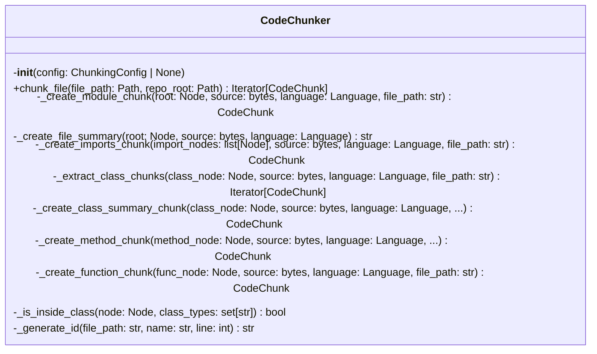

# chunker.py

## File Overview

This module provides code chunking functionality for the local_deepwiki system. It contains the CodeChunker class and utility functions for breaking down source code into meaningful chunks for documentation generation.

## Classes

### CodeChunker

The [main](../export/pdf.md) class responsible for chunking source code into analyzable segments. It uses tree-sitter parsing to identify and extract different types of code constructs.

**Purpose**: Processes parsed code into structured chunks that can be used for documentation generation.

**Dependencies**: 
- Uses CodeParser for syntax tree parsing
- Integrates with [ChunkingConfig](../config.md) for configuration settings
- Creates [CodeChunk](../models.md) model instances for output

## Functions

### get_parent_classes

A utility function that appears to be related to extracting parent class information from code structures.

## Related Components

This module integrates with several other components of the local_deepwiki system:

- **CodeParser**: Used for parsing source code into syntax trees
- **[ChunkingConfig](../config.md)**: Provides configuration settings for chunking behavior
- **[CodeChunk](../models.md)**: The model class used to represent individual code chunks
- **[ChunkType](../models.md)**: Enumeration defining different types of code chunks
- **[Language](../models.md)**: Enumeration for programming language identification

The module also uses utility functions from the parser module including:
- `find_nodes_by_type`: For locating specific node types in syntax trees
- `get_docstring`: For extracting documentation strings
- `get_node_name`: For retrieving node identifiers
- `get_node_text`: For extracting text content from nodes

## Usage Context

Based on the imports and structure, this chunker module serves as a core component in the code analysis pipeline, taking parsed code and organizing it into meaningful segments for further processing by the documentation generation system.

## API Reference

### class `CodeChunker`

Extract semantic code chunks from source files using AST analysis.

**Methods:**

#### `__init__`

```python
def __init__(config: ChunkingConfig | None = None)
```

Initialize the chunker.


| [Parameter](../generators/api_docs.md) | Type | Default | Description |
|-----------|------|---------|-------------|
| `config` | `ChunkingConfig | None` | `None` | Optional chunking configuration. |

#### `chunk_file`

```python
def chunk_file(file_path: Path, repo_root: Path) -> Iterator[CodeChunk]
```

Extract code chunks from a source file.


| [Parameter](../generators/api_docs.md) | Type | Default | Description |
|-----------|------|---------|-------------|
| `file_path` | `Path` | - | Path to the source file. |
| `repo_root` | `Path` | - | Root directory of the repository. |


---

### Functions

#### `get_parent_classes`

```python
def get_parent_classes(class_node: Node, source: bytes, language: Language) -> list[str]
```

Extract parent class names from a class definition.


| [Parameter](../generators/api_docs.md) | Type | Default | Description |
|-----------|------|---------|-------------|
| `class_node` | `Node` | - | The class AST node. |
| `source` | `bytes` | - | Source bytes. |
| `language` | [`Language`](../models.md) | - | Programming language. |

**Returns:** `list[str]`


## Class Diagram



## Call Graph

```mermaid
flowchart TD
    N0[CodeChunk]
    N1[CodeChunker.__init__]
    N2[CodeChunker._create_class_s...]
    N3[CodeChunker._create_file_su...]
    N4[CodeChunker._create_functio...]
    N5[CodeChunker._create_imports...]
    N6[CodeChunker._create_method_...]
    N7[CodeChunker._create_module_...]
    N8[CodeChunker._extract_class_...]
    N9[CodeChunker._generate_id]
    N10[CodeChunker.chunk_file]
    N11[CodeParser]
    N12[Path]
    N13[_create_class_summary_chunk]
    N14[_create_file_summary]
    N15[_create_function_chunk]
    N16[_create_imports_chunk]
    N17[_create_method_chunk]
    N18[_create_module_chunk]
    N19[_extract_class_chunks]
    N20[_generate_id]
    N21[_is_inside_class]
    N22[find_nodes_by_type]
    N23[get_config]
    N24[get_docstring]
    N25[get_node_name]
    N26[get_node_text]
    N27[get_parent_classes]
    N28[parse_file]
    N29[relative_to]
    N27 --> N26
    N27 --> N22
    N1 --> N23
    N1 --> N11
    N10 --> N28
    N10 --> N29
    N10 --> N18
    N10 --> N22
    N10 --> N16
    N10 --> N19
    N10 --> N21
    N10 --> N15
    N7 --> N26
    N7 --> N14
    N7 --> N20
    N7 --> N0
    N7 --> N12
    N3 --> N22
    N3 --> N26
    N3 --> N25
    N3 --> N21
    N5 --> N26
    N5 --> N20
    N5 --> N0
    N8 --> N25
    N8 --> N24
    N8 --> N26
    N8 --> N27
    N8 --> N13
    N8 --> N22
    N8 --> N17
    N8 --> N20
    N8 --> N0
    N2 --> N22
    N2 --> N25
    N2 --> N20
    N2 --> N0
    N6 --> N25
    N6 --> N26
    N6 --> N24
    N6 --> N20
    N6 --> N0
    N4 --> N25
    N4 --> N26
    N4 --> N24
    N4 --> N20
    N4 --> N0
    classDef func fill:#e1f5fe
    class N0,N11,N12,N13,N14,N15,N16,N17,N18,N19,N20,N21,N22,N23,N24,N25,N26,N27,N28,N29 func
    classDef method fill:#fff3e0
    class N1,N2,N3,N4,N5,N6,N7,N8,N9,N10 method
```



## Usage Examples

*Examples extracted from test files*

### Test chunking a Python file

From `test_chunker.py::test_chunk_python_file`:

```python
chunks = list(self.chunker.chunk_file(test_file, tmp_path))

# Should have: module, imports, function, class
assert len(chunks) >= 3
```

### Test chunking a Python file

From `test_chunker.py::test_chunk_python_file`:

```python
# Should have: module, imports, function, class
assert len(chunks) >= 3
```

### Test chunking a Python file

From `test_chunker.py::test_chunk_python_file`:

```python
def __init__(self, prefix: str = "Hello"):
        self.prefix = prefix

    def greet(self, name: str) -> str:
        """Greet someone."""
        return f"{self.prefix}, {name}!"
'''
        test_file = tmp_path / "test.py"
        test_file.write_text(code)

        chunks = list(self.chunker.chunk_file(test_file, tmp_path))

        # Should have: module, imports, function, class
        assert len(chunks) >= 3
```

### Test chunking a Python file

From `test_chunker.py::test_chunk_python_file`:

```python
chunks = list(self.chunker.chunk_file(test_file, tmp_path))

# Should have: module, imports, function, class
assert len(chunks) >= 3
```

### Test that function names are extracted

From `test_chunker.py::test_chunk_extracts_function_names`:

```python
chunks = list(self.chunker.chunk_file(test_file, tmp_path))
function_chunks = [c for c in chunks if c.chunk_type == ChunkType.FUNCTION]

function_names = {c.name for c in function_chunks}
assert "process_data" in function_names
```

## Relevant Source Files

- `src/local_deepwiki/core/chunker.py:200-597`

## See Also

- [callgraph](../generators/callgraph.md) - uses this
- [api_docs](../generators/api_docs.md) - uses this
- [logging](../logging.md) - dependency
- [models](../models.md) - dependency
- [test_examples](../generators/test_examples.md) - shares 5 dependencies
