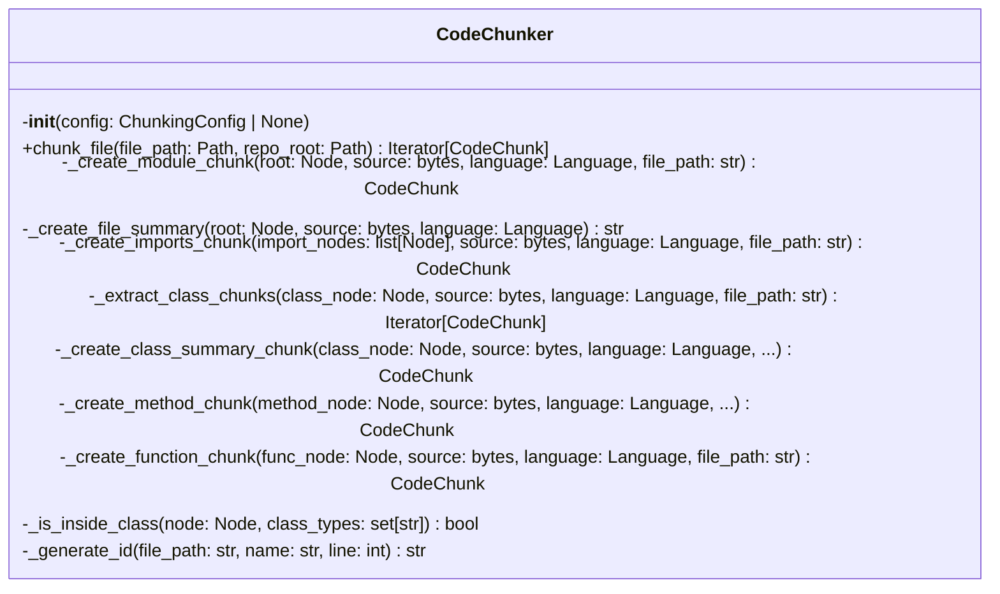

# chunker.py

## File Overview

The chunker module provides functionality for breaking down code files into semantically meaningful chunks for documentation and analysis purposes. It works with the tree-sitter parser to extract different types of code elements (classes, functions, methods, etc.) and convert them into structured [CodeChunk](../models.md) objects.

## Classes

### CodeChunker

The [main](../export/pdf.md) class responsible for chunking code files into semantic units. It uses tree-sitter parsing to identify and extract different code constructs based on the programming language.

## Functions

### get_parent_classes

Extracts parent class information from code nodes, likely used for inheritance analysis.

### extract_python_parameter_types

Extracts type information for Python function parameters from the parsed syntax tree.

### extract_python_parameter_defaults

Extracts default values for Python function parameters from the parsed syntax tree.

### extract_python_return_type

Extracts return type annotations from Python function definitions.

### extract_python_decorators

Extracts [decorator](../providers/base.md) information from Python functions and classes.

## Dependencies

The module relies on several core components:

- **tree_sitter**: For parsing code into abstract syntax trees
- **[CodeParser](parser.md)**: From the parser module for language-specific parsing
- **[ChunkingConfig](../config.md)**: Configuration settings for chunking behavior
- **[CodeChunk](../models.md) and [ChunkType](../models.md)**: Data models for representing code chunks
- **[Language](../models.md)**: Enumeration for supported programming languages

## Usage Context

This module is designed to work as part of a larger documentation generation system. It takes parsed code and converts it into structured chunks that can be processed by other components in the local_deepwiki system. The chunker appears to have specific support for Python language constructs, with dedicated functions for extracting Python-specific metadata like decorators, type hints, and parameter defaults.

The module uses a logging system and configuration management, indicating it's part of a larger application framework with centralized configuration and logging capabilities.

## API Reference

### class `CodeChunker`

Extract semantic code chunks from source files using AST analysis.

**Methods:**


<details>
<summary>View Source (lines 498-906) | <a href="https://github.com/UrbanDiver/local-deepwiki-mcp/blob/[main](../export/pdf.md)/src/local_deepwiki/core/chunker.py#L498-L906">GitHub</a></summary>

```python
class CodeChunker:
    # Methods: __init__, chunk_file, _create_module_chunk, _create_file_summary, _create_imports_chunk, _extract_class_chunks, _create_class_summary_chunk, _create_method_chunk, _create_function_chunk, _is_inside_class, _generate_id
```

</details>

#### `__init__`

```python
def __init__(config: ChunkingConfig | None = None)
```

Initialize the chunker.


| [Parameter](../generators/api_docs.md) | Type | Default | Description |
|-----------|------|---------|-------------|
| `config` | `ChunkingConfig | None` | `None` | Optional chunking configuration. |


<details>
<summary>View Source (lines 501-508) | <a href="https://github.com/UrbanDiver/local-deepwiki-mcp/blob/[main](../export/pdf.md)/src/local_deepwiki/core/chunker.py#L501-L508">GitHub</a></summary>

```python
def __init__(self, config: ChunkingConfig | None = None):
        """Initialize the chunker.

        Args:
            config: Optional chunking configuration.
        """
        self.config = config or get_config().chunking
        self.parser = CodeParser()
```

</details>

#### `chunk_file`

```python
def chunk_file(file_path: Path, repo_root: Path) -> Iterator[CodeChunk]
```

Extract code chunks from a source file.


| [Parameter](../generators/api_docs.md) | Type | Default | Description |
|-----------|------|---------|-------------|
| `file_path` | `Path` | - | Path to the source file. |
| `repo_root` | `Path` | - | Root directory of the repository. |


---


<details>
<summary>View Source (lines 510-548) | <a href="https://github.com/UrbanDiver/local-deepwiki-mcp/blob/[main](../export/pdf.md)/src/local_deepwiki/core/chunker.py#L510-L548">GitHub</a></summary>

```python
def chunk_file(self, file_path: Path, repo_root: Path) -> Iterator[CodeChunk]:
        """Extract code chunks from a source file.

        Args:
            file_path: Path to the source file.
            repo_root: Root directory of the repository.

        Yields:
            CodeChunk objects for each semantic unit found.
        """
        result = self.parser.parse_file(file_path)
        if result is None:
            logger.debug(f"Skipping unsupported file: {file_path}")
            return

        root, language, source = result
        rel_path = str(file_path.relative_to(repo_root))
        logger.debug(f"Chunking {rel_path} ({language.value})")

        # Extract module-level chunk (file overview)
        yield self._create_module_chunk(root, source, language, rel_path)

        # Extract imports
        import_types = IMPORT_NODE_TYPES.get(language, set())
        import_nodes = find_nodes_by_type(root, import_types)
        if import_nodes:
            yield self._create_imports_chunk(import_nodes, source, language, rel_path)

        # Extract classes and their methods
        class_types = CLASS_NODE_TYPES.get(language, set())
        for class_node in find_nodes_by_type(root, class_types):
            yield from self._extract_class_chunks(class_node, source, language, rel_path)

        # Extract top-level functions (not inside classes)
        function_types = FUNCTION_NODE_TYPES.get(language, set())
        for func_node in find_nodes_by_type(root, function_types):
            # Skip if inside a class (already processed)
            if not self._is_inside_class(func_node, class_types):
                yield self._create_function_chunk(func_node, source, language, rel_path)
```

</details>

### Functions

#### `get_parent_classes`

```python
def get_parent_classes(class_node: Node, source: bytes, language: Language) -> list[str]
```

Extract parent class names from a class definition.


| [Parameter](../generators/api_docs.md) | Type | Default | Description |
|-----------|------|---------|-------------|
| `class_node` | `Node` | - | The class AST node. |
| `source` | `bytes` | - | Source bytes. |
| `language` | [`Language`](../models.md) | - | Programming language. |

**Returns:** `list[str]`


<details>
<summary>View Source (lines 94-197) | <a href="https://github.com/UrbanDiver/local-deepwiki-mcp/blob/[main](../export/pdf.md)/src/local_deepwiki/core/chunker.py#L94-L197">GitHub</a></summary>

```python
def get_parent_classes(class_node: Node, source: bytes, language: Language) -> list[str]:
    """Extract parent class names from a class definition.

    Args:
        class_node: The class AST node.
        source: Source bytes.
        language: Programming language.

    Returns:
        List of parent class names.
    """
    parents = []

    if language == Language.PYTHON:
        # Python: class Child(Parent, Mixin): → argument_list > identifier
        for child in class_node.children:
            if child.type == "argument_list":
                for arg in child.children:
                    if arg.type == "identifier":
                        parents.append(get_node_text(arg, source))

    elif language in (Language.TYPESCRIPT, Language.JAVASCRIPT):
        # TS/JS: class Child extends Parent implements Interface
        for child in class_node.children:
            if child.type == "class_heritage":
                for clause in child.children:
                    if clause.type in ("extends_clause", "implements_clause"):
                        for item in clause.children:
                            if item.type in ("identifier", "type_identifier"):
                                parents.append(get_node_text(item, source))

    elif language == Language.JAVA:
        # Java: class Child extends Parent implements Interface
        for child in class_node.children:
            if child.type == "superclass":
                for item in child.children:
                    if item.type == "type_identifier":
                        parents.append(get_node_text(item, source))
            elif child.type == "super_interfaces":
                for item in find_nodes_by_type(child, {"type_identifier"}):
                    parents.append(get_node_text(item, source))

    elif language == Language.SWIFT:
        # Swift: class Child: Parent, Protocol
        for child in class_node.children:
            if child.type == "type_inheritance_clause":
                for item in child.children:
                    if item.type in ("user_type", "type_identifier"):
                        # Get the identifier from user_type
                        text = get_node_text(item, source)
                        if text and text not in (":", ","):
                            parents.append(text)

    elif language == Language.CPP:
        # C++: class Child : public Parent
        for child in class_node.children:
            if child.type == "base_class_clause":
                for item in find_nodes_by_type(child, {"type_identifier"}):
                    parents.append(get_node_text(item, source))

    elif language == Language.RUBY:
        # Ruby: class Child < Parent
        for child in class_node.children:
            if child.type == "superclass":
                for sc in child.children:
                    if sc.type == "constant" or sc.type == "scope_resolution":
                        parents.append(get_node_text(sc, source))

    elif language == Language.PHP:
        # PHP: class Child extends Parent implements Interface1, Interface2
        for child in class_node.children:
            if child.type == "base_clause":
                # extends clause
                for item in find_nodes_by_type(child, {"name", "qualified_name"}):
                    parents.append(get_node_text(item, source))
            elif child.type == "class_interface_clause":
                # implements clause
                for item in find_nodes_by_type(child, {"name", "qualified_name"}):
                    parents.append(get_node_text(item, source))

    elif language == Language.KOTLIN:
        # Kotlin: class Child : Parent(), Interface1, Interface2
        for child in class_node.children:
            if child.type == "delegation_specifiers":
                for spec in child.children:
                    if spec.type == "delegation_specifier":
                        for item in find_nodes_by_type(spec, {"user_type", "simple_identifier"}):
                            text = get_node_text(item, source)
                            if text and text not in (":", ","):
                                parents.append(text)
                                break  # Only get the type name, not nested parts

    elif language == Language.CSHARP:
        # C#: class Child : Parent, IInterface1, IInterface2
        for child in class_node.children:
            if child.type == "base_list":
                for item in find_nodes_by_type(
                    child, {"identifier", "generic_name", "qualified_name"}
                ):
                    text = get_node_text(item, source)
                    if text:
                        parents.append(text)

    return parents
```

</details>

#### `extract_python_parameter_types`

```python
def extract_python_parameter_types(func_node: Node, source: bytes) -> dict[str, str | None]
```

Extract parameter types from a Python function.


| [Parameter](../generators/api_docs.md) | Type | Default | Description |
|-----------|------|---------|-------------|
| `func_node` | `Node` | - | The function_definition AST node. |
| `source` | `bytes` | - | Source code bytes. |

**Returns:** `dict[str, str | None]`


<details>
<summary>View Source (lines 200-300) | <a href="https://github.com/UrbanDiver/local-deepwiki-mcp/blob/[main](../export/pdf.md)/src/local_deepwiki/core/chunker.py#L200-L300">GitHub</a></summary>

```python
def extract_python_parameter_types(func_node: Node, source: bytes) -> dict[str, str | None]:
    """Extract parameter types from a Python function.

    Args:
        func_node: The function_definition AST node.
        source: Source code bytes.

    Returns:
        Dictionary mapping parameter names to their type hints.
    """
    param_types: dict[str, str | None] = {}
    params_node = func_node.child_by_field_name("parameters")
    if not params_node:
        return param_types

    for child in params_node.children:
        if child.type == "identifier":
            # Simple parameter without type hint
            name = get_node_text(child, source)
            if name not in ("self", "cls"):
                param_types[name] = None

        elif child.type == "typed_parameter":
            # Parameter with type hint: name: type
            # Or typed *args: *args: type, typed **kwargs: **kwargs: type
            name_node = None
            type_node = None
            splat_pattern = None

            for c in child.children:
                if c.type == "identifier":
                    name_node = c
                elif c.type == "type":
                    type_node = c
                elif c.type == "list_splat_pattern":
                    splat_pattern = c
                    for sc in c.children:
                        if sc.type == "identifier":
                            name_node = sc
                            break
                elif c.type == "dictionary_splat_pattern":
                    splat_pattern = c
                    for sc in c.children:
                        if sc.type == "identifier":
                            name_node = sc
                            break

            if name_node:
                name = get_node_text(name_node, source)
                if name not in ("self", "cls"):
                    type_hint = get_node_text(type_node, source) if type_node else None
                    # Add prefix for splat patterns
                    if splat_pattern:
                        prefix = "*" if splat_pattern.type == "list_splat_pattern" else "**"
                        name = f"{prefix}{name}"
                    param_types[name] = type_hint

        elif child.type == "default_parameter":
            # Parameter with default: name = value
            name_node = child.child_by_field_name("name")
            if name_node:
                name = get_node_text(name_node, source)
                if name not in ("self", "cls"):
                    param_types[name] = None

        elif child.type == "typed_default_parameter":
            # Parameter with type and default: name: type = value
            name_node = child.child_by_field_name("name")
            type_node = child.child_by_field_name("type")

            if name_node:
                name = get_node_text(name_node, source)
                if name not in ("self", "cls"):
                    type_hint = get_node_text(type_node, source) if type_node else None
                    param_types[name] = type_hint

        elif child.type in ("list_splat_pattern", "dictionary_splat_pattern"):
            # *args or **kwargs
            for c in child.children:
                if c.type == "identifier":
                    name = get_node_text(c, source)
                    prefix = "*" if child.type == "list_splat_pattern" else "**"
                    param_types[f"{prefix}{name}"] = None
                    break
                elif c.type == "typed_parameter":
                    # *args: type or **kwargs: type
                    inner_name = None
                    inner_type = None
                    for tc in c.children:
                        if tc.type == "identifier":
                            inner_name = tc
                        elif tc.type == "type":
                            inner_type = tc
                    if inner_name:
                        name = get_node_text(inner_name, source)
                        prefix = "*" if child.type == "list_splat_pattern" else "**"
                        type_hint = get_node_text(inner_type, source) if inner_type else None
                        param_types[f"{prefix}{name}"] = type_hint
                    break

    return param_types
```

</details>

#### `extract_python_parameter_defaults`

```python
def extract_python_parameter_defaults(func_node: Node, source: bytes) -> dict[str, str]
```

Extract parameter default values from a Python function.


| [Parameter](../generators/api_docs.md) | Type | Default | Description |
|-----------|------|---------|-------------|
| `func_node` | `Node` | - | The function_definition AST node. |
| `source` | `bytes` | - | Source code bytes. |

**Returns:** `dict[str, str]`


<details>
<summary>View Source (lines 303-335) | <a href="https://github.com/UrbanDiver/local-deepwiki-mcp/blob/[main](../export/pdf.md)/src/local_deepwiki/core/chunker.py#L303-L335">GitHub</a></summary>

```python
def extract_python_parameter_defaults(func_node: Node, source: bytes) -> dict[str, str]:
    """Extract parameter default values from a Python function.

    Args:
        func_node: The function_definition AST node.
        source: Source code bytes.

    Returns:
        Dictionary mapping parameter names to their default values.
    """
    defaults: dict[str, str] = {}
    params_node = func_node.child_by_field_name("parameters")
    if not params_node:
        return defaults

    for child in params_node.children:
        if child.type == "default_parameter":
            name_node = child.child_by_field_name("name")
            value_node = child.child_by_field_name("value")
            if name_node and value_node:
                name = get_node_text(name_node, source)
                if name not in ("self", "cls"):
                    defaults[name] = get_node_text(value_node, source)

        elif child.type == "typed_default_parameter":
            name_node = child.child_by_field_name("name")
            value_node = child.child_by_field_name("value")
            if name_node and value_node:
                name = get_node_text(name_node, source)
                if name not in ("self", "cls"):
                    defaults[name] = get_node_text(value_node, source)

    return defaults
```

</details>

#### `extract_python_return_type`

```python
def extract_python_return_type(func_node: Node, source: bytes) -> str | None
```

Extract return type annotation from a Python function.


| [Parameter](../generators/api_docs.md) | Type | Default | Description |
|-----------|------|---------|-------------|
| `func_node` | `Node` | - | The function_definition AST node. |
| `source` | `bytes` | - | Source code bytes. |

**Returns:** `str | None`


<details>
<summary>View Source (lines 338-351) | <a href="https://github.com/UrbanDiver/local-deepwiki-mcp/blob/[main](../export/pdf.md)/src/local_deepwiki/core/chunker.py#L338-L351">GitHub</a></summary>

```python
def extract_python_return_type(func_node: Node, source: bytes) -> str | None:
    """Extract return type annotation from a Python function.

    Args:
        func_node: The function_definition AST node.
        source: Source code bytes.

    Returns:
        Return type string or None.
    """
    return_type_node = func_node.child_by_field_name("return_type")
    if return_type_node:
        return get_node_text(return_type_node, source)
    return None
```

</details>

#### `extract_python_decorators`

```python
def extract_python_decorators(func_node: Node, source: bytes) -> list[str]
```

Extract decorators from a Python function.


| [Parameter](../generators/api_docs.md) | Type | Default | Description |
|-----------|------|---------|-------------|
| `func_node` | `Node` | - | The function_definition AST node. |
| `source` | `bytes` | - | Source code bytes. |

**Returns:** `list[str]`


<details>
<summary>View Source (lines 354-374) | <a href="https://github.com/UrbanDiver/local-deepwiki-mcp/blob/[main](../export/pdf.md)/src/local_deepwiki/core/chunker.py#L354-L374">GitHub</a></summary>

```python
def extract_python_decorators(func_node: Node, source: bytes) -> list[str]:
    """Extract decorators from a Python function.

    Args:
        func_node: The function_definition AST node.
        source: Source code bytes.

    Returns:
        List of decorator strings.
    """
    decorators = []
    if func_node.parent:
        prev_sibling = func_node.prev_sibling
        while prev_sibling:
            if prev_sibling.type == "decorator":
                dec_text = get_node_text(prev_sibling, source)
                decorators.insert(0, dec_text)
            elif prev_sibling.type not in ("comment", "decorator"):
                break
            prev_sibling = prev_sibling.prev_sibling
    return decorators
```

</details>

#### `is_async_function`

```python
def is_async_function(func_node: Node) -> bool
```

Check if a function is async.


| [Parameter](../generators/api_docs.md) | Type | Default | Description |
|-----------|------|---------|-------------|
| `func_node` | `Node` | - | The function AST node. |

**Returns:** `bool`


<details>
<summary>View Source (lines 377-388) | <a href="https://github.com/UrbanDiver/local-deepwiki-mcp/blob/[main](../export/pdf.md)/src/local_deepwiki/core/chunker.py#L377-L388">GitHub</a></summary>

```python
def is_async_function(func_node: Node) -> bool:
    """Check if a function is async.

    Args:
        func_node: The function AST node.

    Returns:
        True if the function is async.
    """
    return func_node.type == "async_function_definition" or any(
        c.type == "async" for c in func_node.children
    )
```

</details>

#### `extract_python_raised_exceptions`

```python
def extract_python_raised_exceptions(func_node: Node, source: bytes) -> list[str]
```

Extract exception types raised by a Python function.  Finds all `raise` statements within the function and extracts the exception type being raised.


| [Parameter](../generators/api_docs.md) | Type | Default | Description |
|-----------|------|---------|-------------|
| `func_node` | `Node` | - | The function_definition AST node. |
| `source` | `bytes` | - | Source code bytes. |

**Returns:** `list[str]`


<details>
<summary>View Source (lines 391-443) | <a href="https://github.com/UrbanDiver/local-deepwiki-mcp/blob/[main](../export/pdf.md)/src/local_deepwiki/core/chunker.py#L391-L443">GitHub</a></summary>

```python
def extract_python_raised_exceptions(func_node: Node, source: bytes) -> list[str]:
    """Extract exception types raised by a Python function.

    Finds all `raise` statements within the function and extracts the exception
    type being raised.

    Args:
        func_node: The function_definition AST node.
        source: Source code bytes.

    Returns:
        List of unique exception type names raised by the function.
    """
    exceptions: set[str] = set()

    def find_raise_statements(node: Node) -> None:
        """Recursively find raise statements in the AST."""
        if node.type == "raise_statement":
            # Extract the exception type
            for child in node.children:
                if child.type == "identifier":
                    # Direct raise like: raise ValueError
                    exc_name = get_node_text(child, source)
                    if exc_name and exc_name != "raise":
                        exceptions.add(exc_name)
                    break
                elif child.type == "call":
                    # Raise with call like: raise ValueError("msg")
                    for call_child in child.children:
                        if call_child.type == "identifier":
                            exc_name = get_node_text(call_child, source)
                            if exc_name:
                                exceptions.add(exc_name)
                            break
                        elif call_child.type == "attribute":
                            # Handle module.Exception like: raise errors.CustomError
                            exc_name = get_node_text(call_child, source)
                            if exc_name:
                                exceptions.add(exc_name)
                            break
                    break

        # Recurse into child nodes (but not into nested functions)
        for child in node.children:
            if child.type not in ("function_definition", "async_function_definition"):
                find_raise_statements(child)

    # Start searching from the function body
    for child in func_node.children:
        if child.type == "block":
            find_raise_statements(child)

    return sorted(exceptions)
```

</details>

#### `find_raise_statements`

```python
def find_raise_statements(node: Node) -> None
```

Recursively [find](../generators/manifest.md) raise statements in the AST.


| [Parameter](../generators/api_docs.md) | Type | Default | Description |
|-----------|------|---------|-------------|
| `node` | `Node` | - | - |

**Returns:** `None`


<details>
<summary>View Source (lines 406-436) | <a href="https://github.com/UrbanDiver/local-deepwiki-mcp/blob/[main](../export/pdf.md)/src/local_deepwiki/core/chunker.py#L406-L436">GitHub</a></summary>

```python
def find_raise_statements(node: Node) -> None:
        """Recursively find raise statements in the AST."""
        if node.type == "raise_statement":
            # Extract the exception type
            for child in node.children:
                if child.type == "identifier":
                    # Direct raise like: raise ValueError
                    exc_name = get_node_text(child, source)
                    if exc_name and exc_name != "raise":
                        exceptions.add(exc_name)
                    break
                elif child.type == "call":
                    # Raise with call like: raise ValueError("msg")
                    for call_child in child.children:
                        if call_child.type == "identifier":
                            exc_name = get_node_text(call_child, source)
                            if exc_name:
                                exceptions.add(exc_name)
                            break
                        elif call_child.type == "attribute":
                            # Handle module.Exception like: raise errors.CustomError
                            exc_name = get_node_text(call_child, source)
                            if exc_name:
                                exceptions.add(exc_name)
                            break
                    break

        # Recurse into child nodes (but not into nested functions)
        for child in node.children:
            if child.type not in ("function_definition", "async_function_definition"):
                find_raise_statements(child)
```

</details>

#### `extract_function_type_metadata`

```python
def extract_function_type_metadata(func_node: Node, source: bytes, language: Language) -> dict[str, Any]
```

Extract type annotation metadata from a function node.


| [Parameter](../generators/api_docs.md) | Type | Default | Description |
|-----------|------|---------|-------------|
| `func_node` | `Node` | - | The function AST node. |
| `source` | `bytes` | - | Source code bytes. |
| `language` | [`Language`](../models.md) | - | Programming language. |

**Returns:** `dict[str, Any]`


<details>
<summary>View Source (lines 446-495) | <a href="https://github.com/UrbanDiver/local-deepwiki-mcp/blob/[main](../export/pdf.md)/src/local_deepwiki/core/chunker.py#L446-L495">GitHub</a></summary>

```python
def extract_function_type_metadata(
    func_node: Node, source: bytes, language: Language
) -> dict[str, Any]:
    """Extract type annotation metadata from a function node.

    Args:
        func_node: The function AST node.
        source: Source code bytes.
        language: Programming language.

    Returns:
        Metadata dictionary with type information.
    """
    metadata: dict[str, Any] = {}

    if language == Language.PYTHON:
        # Extract parameter types
        param_types = extract_python_parameter_types(func_node, source)
        # Only include parameters that have type hints
        typed_params = {k: v for k, v in param_types.items() if v is not None}
        if typed_params:
            metadata["parameter_types"] = typed_params

        # Extract parameter defaults
        param_defaults = extract_python_parameter_defaults(func_node, source)
        if param_defaults:
            metadata["parameter_defaults"] = param_defaults

        # Extract return type
        return_type = extract_python_return_type(func_node, source)
        if return_type:
            metadata["return_type"] = return_type

        # Extract decorators
        decorators = extract_python_decorators(func_node, source)
        if decorators:
            metadata["decorators"] = decorators

        # Check if async
        if is_async_function(func_node):
            metadata["is_async"] = True

        # Extract raised exceptions
        raised_exceptions = extract_python_raised_exceptions(func_node, source)
        if raised_exceptions:
            metadata["raises"] = raised_exceptions

    # TODO: Add support for other languages (TypeScript, Java, etc.)

    return metadata
```

</details>

## Class Diagram



## Call Graph

```mermaid
flowchart TD
    N0[CodeChunk]
    N1[CodeChunker.__init__]
    N2[CodeChunker._create_class_s...]
    N3[CodeChunker._create_file_su...]
    N4[CodeChunker._create_functio...]
    N5[CodeChunker._create_imports...]
    N6[CodeChunker._create_method_...]
    N7[CodeChunker._create_module_...]
    N8[CodeChunker._extract_class_...]
    N9[CodeChunker._generate_id]
    N10[CodeChunker.chunk_file]
    N11[CodeParser]
    N12[_generate_id]
    N13[_is_inside_class]
    N14[add]
    N15[child_by_field_name]
    N16[extract_function_type_metadata]
    N17[extract_python_decorators]
    N18[extract_python_parameter_de...]
    N19[extract_python_parameter_types]
    N20[extract_python_raised_excep...]
    N21[extract_python_return_type]
    N22[find_nodes_by_type]
    N23[find_raise_statements]
    N24[get_config]
    N25[get_docstring]
    N26[get_node_name]
    N27[get_node_text]
    N28[get_parent_classes]
    N29[is_async_function]
    N28 --> N27
    N28 --> N22
    N19 --> N15
    N19 --> N27
    N18 --> N15
    N18 --> N27
    N21 --> N15
    N21 --> N27
    N17 --> N27
    N20 --> N27
    N20 --> N14
    N20 --> N23
    N23 --> N27
    N23 --> N14
    N23 --> N23
    N16 --> N19
    N16 --> N18
    N16 --> N21
    N16 --> N17
    N16 --> N29
    N16 --> N20
    N1 --> N24
    N1 --> N11
    N10 --> N22
    N10 --> N13
    N7 --> N27
    N7 --> N12
    N7 --> N0
    N3 --> N22
    N3 --> N27
    N3 --> N26
    N3 --> N13
    N5 --> N27
    N5 --> N12
    N5 --> N0
    N8 --> N26
    N8 --> N25
    N8 --> N27
    N8 --> N28
    N8 --> N22
    N8 --> N12
    N8 --> N0
    N2 --> N22
    N2 --> N26
    N2 --> N12
    N2 --> N0
    N6 --> N26
    N6 --> N27
    N6 --> N25
    N6 --> N16
    N6 --> N12
    N6 --> N0
    N4 --> N26
    N4 --> N27
    N4 --> N25
    N4 --> N16
    N4 --> N12
    N4 --> N0
    classDef func fill:#e1f5fe
    class N0,N11,N12,N13,N14,N15,N16,N17,N18,N19,N20,N21,N22,N23,N24,N25,N26,N27,N28,N29 func
    classDef method fill:#fff3e0
    class N1,N2,N3,N4,N5,N6,N7,N8,N9,N10 method
```



## Used By

Functions and methods in this file and their callers:

- **[`CodeChunk`](../models.md)**: called by `CodeChunker._create_class_summary_chunk`, `CodeChunker._create_function_chunk`, `CodeChunker._create_imports_chunk`, `CodeChunker._create_method_chunk`, `CodeChunker._create_module_chunk`, `CodeChunker._extract_class_chunks`
- **[`CodeParser`](parser.md)**: called by `CodeChunker.__init__`
- **`Path`**: called by `CodeChunker._create_module_chunk`
- **`_create_class_summary_chunk`**: called by `CodeChunker._extract_class_chunks`
- **`_create_file_summary`**: called by `CodeChunker._create_module_chunk`
- **`_create_function_chunk`**: called by `CodeChunker.chunk_file`
- **`_create_imports_chunk`**: called by `CodeChunker.chunk_file`
- **`_create_method_chunk`**: called by `CodeChunker._extract_class_chunks`
- **`_create_module_chunk`**: called by `CodeChunker.chunk_file`
- **`_extract_class_chunks`**: called by `CodeChunker.chunk_file`
- **`_generate_id`**: called by `CodeChunker._create_class_summary_chunk`, `CodeChunker._create_function_chunk`, `CodeChunker._create_imports_chunk`, `CodeChunker._create_method_chunk`, `CodeChunker._create_module_chunk`, `CodeChunker._extract_class_chunks`
- **`_is_inside_class`**: called by `CodeChunker._create_file_summary`, `CodeChunker.chunk_file`
- **`add`**: called by `extract_python_raised_exceptions`, `find_raise_statements`
- **`child_by_field_name`**: called by `extract_python_parameter_defaults`, `extract_python_parameter_types`, `extract_python_return_type`
- **`decode`**: called by `CodeChunker._create_class_summary_chunk`
- **`encode`**: called by `CodeChunker._generate_id`
- **`extract_function_type_metadata`**: called by `CodeChunker._create_function_chunk`, `CodeChunker._create_method_chunk`
- **`extract_python_decorators`**: called by `extract_function_type_metadata`
- **`extract_python_parameter_defaults`**: called by `extract_function_type_metadata`
- **`extract_python_parameter_types`**: called by `extract_function_type_metadata`
- **`extract_python_raised_exceptions`**: called by `extract_function_type_metadata`
- **`extract_python_return_type`**: called by `extract_function_type_metadata`
- **[`find_nodes_by_type`](parser.md)**: called by `CodeChunker._create_class_summary_chunk`, `CodeChunker._create_file_summary`, `CodeChunker._extract_class_chunks`, `CodeChunker.chunk_file`, `get_parent_classes`
- **`find_raise_statements`**: called by `extract_python_raised_exceptions`, `find_raise_statements`
- **[`get_config`](../config.md)**: called by `CodeChunker.__init__`
- **[`get_docstring`](parser.md)**: called by `CodeChunker._create_function_chunk`, `CodeChunker._create_method_chunk`, `CodeChunker._extract_class_chunks`
- **[`get_node_name`](parser.md)**: called by `CodeChunker._create_class_summary_chunk`, `CodeChunker._create_file_summary`, `CodeChunker._create_function_chunk`, `CodeChunker._create_method_chunk`, `CodeChunker._extract_class_chunks`
- **[`get_node_text`](parser.md)**: called by `CodeChunker._create_file_summary`, `CodeChunker._create_function_chunk`, `CodeChunker._create_imports_chunk`, `CodeChunker._create_method_chunk`, `CodeChunker._create_module_chunk`, `CodeChunker._extract_class_chunks`, `extract_python_decorators`, `extract_python_parameter_defaults`, `extract_python_parameter_types`, `extract_python_raised_exceptions`, `extract_python_return_type`, `find_raise_statements`, `get_parent_classes`
- **`get_parent_classes`**: called by `CodeChunker._extract_class_chunks`
- **`hexdigest`**: called by `CodeChunker._generate_id`
- **`is_async_function`**: called by `extract_function_type_metadata`
- **`parse_file`**: called by `CodeChunker.chunk_file`
- **`relative_to`**: called by `CodeChunker.chunk_file`
- **`sha256`**: called by `CodeChunker._generate_id`

## Usage Examples

*Examples extracted from test files*

### Test chunking a Python file

From `test_chunker.py::TestCodeChunker::test_chunk_python_file`:

```python
chunks = list(self.chunker.chunk_file(test_file, tmp_path))

# Should have: module, imports, function, class
assert len(chunks) >= 3

# Check chunk types
chunk_types = {c.chunk_type for c in chunks}
assert ChunkType.MODULE in chunk_types
```

### Test chunking a Python file

From `test_chunker.py::TestCodeChunker::test_chunk_python_file`:

```python
# Should have: module, imports, function, class
assert len(chunks) >= 3

# Check chunk types
chunk_types = {c.chunk_type for c in chunks}
assert ChunkType.MODULE in chunk_types
```

### Test chunking a Python file

From `test_chunker.py::TestCodeChunker::test_chunk_python_file`:

```python
def __init__(self, prefix: str = "Hello"):
        self.prefix = prefix

    def greet(self, name: str) -> str:
        """Greet someone."""
        return f"{self.prefix}, {name}!"
'''
        test_file = tmp_path / "test.py"
        test_file.write_text(code)

        chunks = list(self.chunker.chunk_file(test_file, tmp_path))

        # Should have: module, imports, function, class
        assert len(chunks) >= 3

        # Check chunk types
        chunk_types = {c.chunk_type for c in chunks}
        assert ChunkType.MODULE in chunk_types
```

### Test chunking a Python file

From `test_chunker.py::TestCodeChunker::test_chunk_python_file`:

```python
chunks = list(self.chunker.chunk_file(test_file, tmp_path))

# Should have: module, imports, function, class
assert len(chunks) >= 3

# Check chunk types
chunk_types = {c.chunk_type for c in chunks}
assert ChunkType.MODULE in chunk_types
```

### Test that function names are extracted

From `test_chunker.py::TestCodeChunker::test_chunk_extracts_function_names`:

```python
chunks = list(self.chunker.chunk_file(test_file, tmp_path))
function_chunks = [c for c in chunks if c.chunk_type == ChunkType.FUNCTION]

function_names = {c.name for c in function_chunks}
assert "process_data" in function_names
assert "analyze_results" in function_names
```


## Last Modified

| Entity | Type | Author | Date | Commit |
|--------|------|--------|------|--------|
| `extract_python_raised_exceptions` | function | Brian Breidenbach | today | `202b96d` Add exception documentation... |
| `find_raise_statements` | function | Brian Breidenbach | today | `202b96d` Add exception documentation... |
| `extract_function_type_metadata` | function | Brian Breidenbach | today | `202b96d` Add exception documentation... |
| `CodeChunker` | class | Brian Breidenbach | today | `ce066c4` Add type annotation extract... |
| `_create_method_chunk` | method | Brian Breidenbach | today | `ce066c4` Add type annotation extract... |
| `_create_function_chunk` | method | Brian Breidenbach | today | `ce066c4` Add type annotation extract... |
| `extract_python_parameter_types` | function | Brian Breidenbach | today | `ce066c4` Add type annotation extract... |
| `extract_python_parameter_defaults` | function | Brian Breidenbach | today | `ce066c4` Add type annotation extract... |
| `extract_python_return_type` | function | Brian Breidenbach | today | `ce066c4` Add type annotation extract... |
| `extract_python_decorators` | function | Brian Breidenbach | today | `ce066c4` Add type annotation extract... |
| `is_async_function` | function | Brian Breidenbach | today | `ce066c4` Add type annotation extract... |
| `_create_class_summary_chunk` | method | Brian Breidenbach | today | `0d91a70` Apply Python best practices... |
| `_extract_class_chunks` | method | Brian Breidenbach | yesterday | `65d50b1` Fix remaining pyright type ... |
| `chunk_file` | method | Brian Breidenbach | 3 days ago | `c568951` Add input validation, type ... |
| `_create_file_summary` | method | Brian Breidenbach | 3 days ago | `c568951` Add input validation, type ... |
| `get_parent_classes` | function | Brian Breidenbach | 3 days ago | `c568951` Add input validation, type ... |
| `__init__` | method | Brian Breidenbach | 5 days ago | `cdae76f` Initial commit: Local DeepW... |
| `_create_module_chunk` | method | Brian Breidenbach | 5 days ago | `cdae76f` Initial commit: Local DeepW... |
| `_create_imports_chunk` | method | Brian Breidenbach | 5 days ago | `cdae76f` Initial commit: Local DeepW... |
| `_is_inside_class` | method | Brian Breidenbach | 5 days ago | `cdae76f` Initial commit: Local DeepW... |
| `_generate_id` | method | Brian Breidenbach | 5 days ago | `cdae76f` Initial commit: Local DeepW... |

## Additional Source Code

Source code for functions and methods not listed in the API Reference above.

#### `_create_module_chunk`

<details>
<summary>View Source (lines 550-594) | <a href="https://github.com/UrbanDiver/local-deepwiki-mcp/blob/[main](../export/pdf.md)/src/local_deepwiki/core/chunker.py#L550-L594">GitHub</a></summary>

```python
def _create_module_chunk(
        self,
        root: Node,
        source: bytes,
        language: Language,
        file_path: str,
    ) -> CodeChunk:
        """Create a chunk for the module/file overview.

        Args:
            root: AST root node.
            source: Source bytes.
            language: Programming language.
            file_path: Relative file path.

        Returns:
            A CodeChunk for the module.
        """
        # Get module docstring if present
        docstring = None
        if language == Language.PYTHON:
            # Python module docstring is first expression
            if root.children and root.children[0].type == "expression_statement":
                expr = root.children[0]
                if expr.children and expr.children[0].type == "string":
                    docstring = get_node_text(expr.children[0], source)
                    if docstring.startswith('"""') or docstring.startswith("'''"):
                        docstring = docstring[3:-3].strip()

        # Create a summary of the file structure
        content = self._create_file_summary(root, source, language)

        chunk_id = self._generate_id(file_path, "module", 0)
        return CodeChunk(
            id=chunk_id,
            file_path=file_path,
            language=language,
            chunk_type=ChunkType.MODULE,
            name=Path(file_path).stem,
            content=content,
            start_line=1,
            end_line=source.count(b"\n") + 1,
            docstring=docstring,
            metadata={"is_overview": True},
        )
```

</details>


#### `_create_file_summary`

<details>
<summary>View Source (lines 596-636) | <a href="https://github.com/UrbanDiver/local-deepwiki-mcp/blob/[main](../export/pdf.md)/src/local_deepwiki/core/chunker.py#L596-L636">GitHub</a></summary>

```python
def _create_file_summary(self, root: Node, source: bytes, language: Language) -> str:
        """Create a summary of file structure for the module chunk.

        Args:
            root: AST root node.
            source: Source bytes.
            language: Programming language.

        Returns:
            A summary string of file contents.
        """
        parts = []

        # List imports
        import_types = IMPORT_NODE_TYPES.get(language, set())
        imports = find_nodes_by_type(root, import_types)
        if imports:
            import_text = "\n".join(get_node_text(n, source) for n in imports[:10])
            if len(imports) > 10:
                import_text += f"\n# ... and {len(imports) - 10} more imports"
            parts.append(f"# Imports:\n{import_text}")

        # List classes
        class_types = CLASS_NODE_TYPES.get(language, set())
        classes = find_nodes_by_type(root, class_types)
        if classes:
            class_names = [get_node_name(c, source, language) or "anonymous" for c in classes]
            parts.append(f"# Classes: {', '.join(class_names)}")

        # List functions
        function_types = FUNCTION_NODE_TYPES.get(language, set())
        functions = [
            f
            for f in find_nodes_by_type(root, function_types)
            if not self._is_inside_class(f, class_types)
        ]
        if functions:
            func_names = [get_node_name(f, source, language) or "anonymous" for f in functions]
            parts.append(f"# Functions: {', '.join(func_names)}")

        return "\n\n".join(parts) if parts else "# Empty file"
```

</details>


#### `_create_imports_chunk`

<details>
<summary>View Source (lines 638-671) | <a href="https://github.com/UrbanDiver/local-deepwiki-mcp/blob/[main](../export/pdf.md)/src/local_deepwiki/core/chunker.py#L638-L671">GitHub</a></summary>

```python
def _create_imports_chunk(
        self,
        import_nodes: list[Node],
        source: bytes,
        language: Language,
        file_path: str,
    ) -> CodeChunk:
        """Create a chunk for import statements.

        Args:
            import_nodes: List of import nodes.
            source: Source bytes.
            language: Programming language.
            file_path: Relative file path.

        Returns:
            A CodeChunk for imports.
        """
        content = "\n".join(get_node_text(n, source) for n in import_nodes)
        start_line = min(n.start_point[0] + 1 for n in import_nodes)
        end_line = max(n.end_point[0] + 1 for n in import_nodes)

        chunk_id = self._generate_id(file_path, "imports", start_line)
        return CodeChunk(
            id=chunk_id,
            file_path=file_path,
            language=language,
            chunk_type=ChunkType.IMPORT,
            name="imports",
            content=content,
            start_line=start_line,
            end_line=end_line,
            metadata={"import_count": len(import_nodes)},
        )
```

</details>


#### `_extract_class_chunks`

<details>
<summary>View Source (lines 673-731) | <a href="https://github.com/UrbanDiver/local-deepwiki-mcp/blob/[main](../export/pdf.md)/src/local_deepwiki/core/chunker.py#L673-L731">GitHub</a></summary>

```python
def _extract_class_chunks(
        self,
        class_node: Node,
        source: bytes,
        language: Language,
        file_path: str,
    ) -> Iterator[CodeChunk]:
        """Extract chunks from a class definition.

        Args:
            class_node: The class AST node.
            source: Source bytes.
            language: Programming language.
            file_path: Relative file path.

        Yields:
            CodeChunks for the class and its methods.
        """
        class_name = get_node_name(class_node, source, language) or "anonymous"
        docstring = get_docstring(class_node, source, language)
        content = get_node_text(class_node, source)

        # Extract parent classes for inheritance
        parent_classes = get_parent_classes(class_node, source, language)

        # Check if class is too large and needs to be split
        lines = content.count("\n") + 1
        if lines > self.config.class_split_threshold:
            # For large classes, create a summary chunk and method chunks
            yield self._create_class_summary_chunk(
                class_node, source, language, file_path, class_name, docstring, parent_classes
            )

            # Extract methods separately
            function_types = FUNCTION_NODE_TYPES.get(language, set())
            for method_node in find_nodes_by_type(class_node, function_types):
                yield self._create_method_chunk(
                    method_node, source, language, file_path, class_name
                )
        else:
            # Small class - include everything in one chunk
            chunk_id = self._generate_id(
                file_path, f"class_{class_name}", class_node.start_point[0]
            )
            metadata: dict[str, int | list[str]] = {"line_count": lines}
            if parent_classes:
                metadata["parent_classes"] = parent_classes
            yield CodeChunk(
                id=chunk_id,
                file_path=file_path,
                language=language,
                chunk_type=ChunkType.CLASS,
                name=class_name,
                content=content,
                start_line=class_node.start_point[0] + 1,
                end_line=class_node.end_point[0] + 1,
                docstring=docstring,
                metadata=metadata,
            )
```

</details>


#### `_create_class_summary_chunk`

<details>
<summary>View Source (lines 733-792) | <a href="https://github.com/UrbanDiver/local-deepwiki-mcp/blob/[main](../export/pdf.md)/src/local_deepwiki/core/chunker.py#L733-L792">GitHub</a></summary>

```python
def _create_class_summary_chunk(
        self,
        class_node: Node,
        source: bytes,
        language: Language,
        file_path: str,
        class_name: str,
        docstring: str | None,
        parent_classes: list[str] | None = None,
    ) -> CodeChunk:
        """Create a summary chunk for a large class.

        Args:
            class_node: The class AST node.
            source: Source bytes.
            language: Programming language.
            file_path: Relative file path.
            class_name: Name of the class.
            docstring: Class docstring if any.
            parent_classes: List of parent class names.

        Returns:
            A summary CodeChunk for the class.
        """
        # Get class signature and method list
        function_types = FUNCTION_NODE_TYPES.get(language, set())
        methods = find_nodes_by_type(class_node, function_types)
        method_names = [get_node_name(m, source, language) or "anonymous" for m in methods]

        # Build summary content
        signature_end = class_node.start_byte
        for child in class_node.children:
            if child.type in ("block", "class_body", "declaration_list"):
                signature_end = child.start_byte
                break

        signature = (
            source[class_node.start_byte : signature_end].decode("utf-8", errors="replace").strip()
        )
        content = f"{signature}\n    # Methods: {', '.join(method_names)}"

        chunk_id = self._generate_id(file_path, f"class_{class_name}", class_node.start_point[0])
        metadata: dict[str, bool | int | list[str]] = {
            "is_summary": True,
            "method_count": len(methods),
        }
        if parent_classes:
            metadata["parent_classes"] = parent_classes
        return CodeChunk(
            id=chunk_id,
            file_path=file_path,
            language=language,
            chunk_type=ChunkType.CLASS,
            name=class_name,
            content=content,
            start_line=class_node.start_point[0] + 1,
            end_line=class_node.end_point[0] + 1,
            docstring=docstring,
            metadata=metadata,
        )
```

</details>


#### `_create_method_chunk`

<details>
<summary>View Source (lines 794-836) | <a href="https://github.com/UrbanDiver/local-deepwiki-mcp/blob/[main](../export/pdf.md)/src/local_deepwiki/core/chunker.py#L794-L836">GitHub</a></summary>

```python
def _create_method_chunk(
        self,
        method_node: Node,
        source: bytes,
        language: Language,
        file_path: str,
        class_name: str,
    ) -> CodeChunk:
        """Create a chunk for a class method.

        Args:
            method_node: The method AST node.
            source: Source bytes.
            language: Programming language.
            file_path: Relative file path.
            class_name: Name of the parent class.

        Returns:
            A CodeChunk for the method.
        """
        method_name = get_node_name(method_node, source, language) or "anonymous"
        content = get_node_text(method_node, source)
        docstring = get_docstring(method_node, source, language)

        # Extract type annotation metadata
        metadata = extract_function_type_metadata(method_node, source, language)

        chunk_id = self._generate_id(
            file_path, f"{class_name}.{method_name}", method_node.start_point[0]
        )
        return CodeChunk(
            id=chunk_id,
            file_path=file_path,
            language=language,
            chunk_type=ChunkType.METHOD,
            name=method_name,
            content=content,
            start_line=method_node.start_point[0] + 1,
            end_line=method_node.end_point[0] + 1,
            docstring=docstring,
            parent_name=class_name,
            metadata=metadata,
        )
```

</details>


#### `_create_function_chunk`

<details>
<summary>View Source (lines 838-875) | <a href="https://github.com/UrbanDiver/local-deepwiki-mcp/blob/[main](../export/pdf.md)/src/local_deepwiki/core/chunker.py#L838-L875">GitHub</a></summary>

```python
def _create_function_chunk(
        self,
        func_node: Node,
        source: bytes,
        language: Language,
        file_path: str,
    ) -> CodeChunk:
        """Create a chunk for a top-level function.

        Args:
            func_node: The function AST node.
            source: Source bytes.
            language: Programming language.
            file_path: Relative file path.

        Returns:
            A CodeChunk for the function.
        """
        func_name = get_node_name(func_node, source, language) or "anonymous"
        content = get_node_text(func_node, source)
        docstring = get_docstring(func_node, source, language)

        # Extract type annotation metadata
        metadata = extract_function_type_metadata(func_node, source, language)

        chunk_id = self._generate_id(file_path, f"func_{func_name}", func_node.start_point[0])
        return CodeChunk(
            id=chunk_id,
            file_path=file_path,
            language=language,
            chunk_type=ChunkType.FUNCTION,
            name=func_name,
            content=content,
            start_line=func_node.start_point[0] + 1,
            end_line=func_node.end_point[0] + 1,
            docstring=docstring,
            metadata=metadata,
        )
```

</details>


#### `_is_inside_class`

<details>
<summary>View Source (lines 877-892) | <a href="https://github.com/UrbanDiver/local-deepwiki-mcp/blob/[main](../export/pdf.md)/src/local_deepwiki/core/chunker.py#L877-L892">GitHub</a></summary>

```python
def _is_inside_class(self, node: Node, class_types: set[str]) -> bool:
        """Check if a node is inside a class definition.

        Args:
            node: The node to check.
            class_types: Set of class node type names.

        Returns:
            True if the node is inside a class.
        """
        parent = node.parent
        while parent:
            if parent.type in class_types:
                return True
            parent = parent.parent
        return False
```

</details>


#### `_generate_id`

<details>
<summary>View Source (lines 894-906) | <a href="https://github.com/UrbanDiver/local-deepwiki-mcp/blob/[main](../export/pdf.md)/src/local_deepwiki/core/chunker.py#L894-L906">GitHub</a></summary>

```python
def _generate_id(self, file_path: str, name: str, line: int) -> str:
        """Generate a unique chunk ID.

        Args:
            file_path: File path.
            name: Chunk name.
            line: Line number.

        Returns:
            A unique ID string.
        """
        key = f"{file_path}:{name}:{line}"
        return hashlib.sha256(key.encode()).hexdigest()[:16]
```

</details>

## Relevant Source Files

- `src/local_deepwiki/core/chunker.py:498-906`

## See Also

- [api_docs](../generators/api_docs.md) - uses this
- [callgraph](../generators/callgraph.md) - uses this
- [models](../models.md) - dependency
- [logging](../logging.md) - dependency
- [test_examples](../generators/test_examples.md) - shares 5 dependencies

## See Also

- [api_docs](../generators/api_docs.md) - uses this
- [callgraph](../generators/callgraph.md) - uses this
- [logging](../logging.md) - dependency
- [test_examples](../generators/test_examples.md) - shares 5 dependencies
