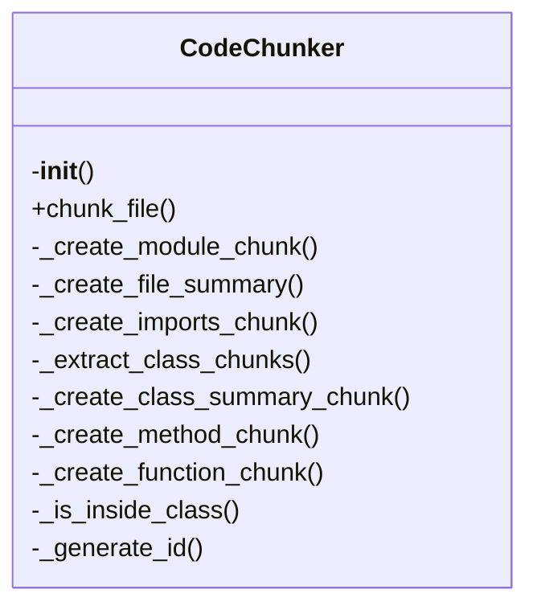

# File Overview

This file defines the `CodeChunker` class and related functionality for splitting code into logical chunks based on language-specific parsing rules. It uses the `tree_sitter` library to parse code and extract meaningful units such as functions, classes, and methods.

# Classes

## CodeChunker

The `CodeChunker` class is responsible for breaking down code files into logical chunks based on their structure and content. It uses a [`CodeParser`](parser.md) to parse the source code and then extracts nodes of specific types (like functions, classes, etc.) to form chunks.

### Key Methods

- `__init__(self, language: Language, config: ChunkingConfig = None)`:
  Initializes the chunker with a specific language and configuration. If no configuration is provided, it retrieves the default configuration using `get_config()`.

- `chunk(self, file_path: Path, content: str) -> Iterator[CodeChunk]`:
  Takes a file path and its content and yields [`CodeChunk`](../models.md) objects representing logical units of code. It uses [`find_nodes_by_type`](parser.md) to identify relevant nodes and processes them using helper functions from the parser module.

# Functions

## get_parent_classes

- `get_parent_classes(node: Node) -> list[str]`:
  Extracts the names of parent classes from a given `Node` object, which is typically a class definition in the parsed AST. Returns a list of strings representing the names of parent classes.

# Usage Examples

To use the `CodeChunker` class:

```python
from local_deepwiki.core.chunker import CodeChunker
from local_deepwiki.models import Language

chunker = CodeChunker(language=Language.PYTHON)
chunks = chunker.chunk(Path("example.py"), "def hello():\n    print('Hello')")
for chunk in chunks:
    print(chunk)
```

# Related Components

This file works with the following components:

- [`CodeParser`](parser.md) from `local_deepwiki.core.parser`: Used for parsing source code into an Abstract Syntax Tree (AST).
- [`ChunkingConfig`](../config.md) from `local_deepwiki.config`: Provides configuration options for chunking behavior.
- [`get_config`](../config.md) from `local_deepwiki.config`: Retrieves the default chunking configuration.
- [`get_node_text`](parser.md), [`get_node_name`](parser.md), [`get_docstring`](parser.md), [`find_nodes_by_type`](parser.md) from `local_deepwiki.core.parser`: Helper functions for extracting information from parsed nodes.
- [`CodeChunk`](../models.md), [`ChunkType`](../models.md), [`Language`](../models.md) from `local_deepwiki.models`: Data models representing chunks of code and their metadata.

## API Reference

### class `CodeChunker`

Extract semantic code chunks from source files using AST analysis.

**Methods:**

#### `__init__`

```python
def __init__(config: ChunkingConfig | None = None)
```

Initialize the chunker.


| [Parameter](../generators/api_docs.md) | Type | Default | Description |
|-----------|------|---------|-------------|
| `config` | `ChunkingConfig | None` | `None` | Optional chunking configuration. |

#### `chunk_file`

```python
def chunk_file(file_path: Path, repo_root: Path) -> Iterator[CodeChunk]
```

Extract code chunks from a source file.


| [Parameter](../generators/api_docs.md) | Type | Default | Description |
|-----------|------|---------|-------------|
| `file_path` | `Path` | - | Path to the source file. |
| `repo_root` | `Path` | - | Root directory of the repository. |


---

### Functions

#### `get_parent_classes`

```python
def get_parent_classes(class_node: Node, source: bytes, language: Language) -> list[str]
```

Extract parent class names from a class definition.


| [Parameter](../generators/api_docs.md) | Type | Default | Description |
|-----------|------|---------|-------------|
| `class_node` | `Node` | - | The class AST node. |
| `source` | `bytes` | - | Source bytes. |
| `language` | [`Language`](../models.md) | - | Programming language. |

**Returns:** `list[str]`


## Class Diagram



## Call Graph

```mermaid
flowchart TD
    N0[CodeChunk]
    N1[CodeChunker.__init__]
    N2[CodeChunker._create_class_s...]
    N3[CodeChunker._create_file_su...]
    N4[CodeChunker._create_functio...]
    N5[CodeChunker._create_imports...]
    N6[CodeChunker._create_method_...]
    N7[CodeChunker._create_module_...]
    N8[CodeChunker._extract_class_...]
    N9[CodeChunker._generate_id]
    N10[CodeChunker.chunk_file]
    N11[CodeParser]
    N12[Path]
    N13[_create_class_summary_chunk]
    N14[_create_file_summary]
    N15[_create_function_chunk]
    N16[_create_imports_chunk]
    N17[_create_method_chunk]
    N18[_create_module_chunk]
    N19[_extract_class_chunks]
    N20[_generate_id]
    N21[_is_inside_class]
    N22[find_nodes_by_type]
    N23[get_config]
    N24[get_docstring]
    N25[get_node_name]
    N26[get_node_text]
    N27[get_parent_classes]
    N28[parse_file]
    N29[relative_to]
    N27 --> N26
    N27 --> N22
    N1 --> N23
    N1 --> N11
    N10 --> N28
    N10 --> N29
    N10 --> N18
    N10 --> N22
    N10 --> N16
    N10 --> N19
    N10 --> N21
    N10 --> N15
    N7 --> N26
    N7 --> N14
    N7 --> N20
    N7 --> N0
    N7 --> N12
    N3 --> N22
    N3 --> N26
    N3 --> N25
    N3 --> N21
    N5 --> N26
    N5 --> N20
    N5 --> N0
    N8 --> N25
    N8 --> N24
    N8 --> N26
    N8 --> N27
    N8 --> N13
    N8 --> N22
    N8 --> N17
    N8 --> N20
    N8 --> N0
    N2 --> N22
    N2 --> N25
    N2 --> N20
    N2 --> N0
    N6 --> N25
    N6 --> N26
    N6 --> N24
    N6 --> N20
    N6 --> N0
    N4 --> N25
    N4 --> N26
    N4 --> N24
    N4 --> N20
    N4 --> N0
    classDef func fill:#e1f5fe
    class N0,N11,N12,N13,N14,N15,N16,N17,N18,N19,N20,N21,N22,N23,N24,N25,N26,N27,N28,N29 func
    classDef method fill:#fff3e0
    class N1,N2,N3,N4,N5,N6,N7,N8,N9,N10 method
```



## Relevant Source Files

- `src/local_deepwiki/core/chunker.py`

## See Also

- [api_docs](../generators/api_docs.md) - uses this
- [test_chunker](../../../tests/test_chunker.md) - uses this
- [models](../models.md) - dependency
- [config](../config.md) - dependency
- [parser](parser.md) - dependency
