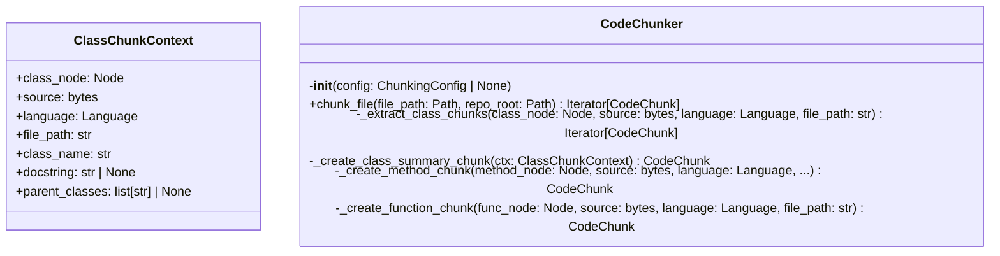

# File: `src/local_deepwiki/core/chunker.py`

## File Overview

This file implements an AST-based code chunking system for semantic extraction from source code. It is responsible for parsing source files and splitting them into meaningful semantic units (chunks) that can be used for retrieval-augmented generation (RAG) and other downstream analysis tasks.

The chunker leverages the Tree-sitter parser for language-specific AST parsing and supports plugin-based parsers for extensibility. It handles various code constructs such as modules, classes, methods, functions, and imports, generating appropriate [`CodeChunk`](../models/chunks.md) objects for each.

## Key Concepts

### AST-Based Semantic Chunking

The core design rationale is to decompose source code into semantic units using an Abstract Syntax Tree (AST). This approach allows for more precise and meaningful code understanding compared to line-based or regex-based chunking.

Each chunk represents a distinct semantic unit:
- **Module-level chunks**: Provide file overview and structure
- **Class chunks**: Represent class definitions, either as full content or summary
- **Method chunks**: Represent individual methods within classes
- **Function chunks**: Represent top-level functions
- **Import chunks**: Group import statements for clarity

### Large Class Handling

A key design choice is to detect large classes and split them into a summary chunk and individual method chunks. This improves retrieval accuracy by allowing users to query either the class overview or specific methods without retrieving entire large classes.

The threshold for splitting is configurable via `class_split_threshold` in [`ChunkingConfig`](../config/processing_models.md).

### Plugin Support for Extensibility

The chunker supports external language parser plugins via the `get_plugin_registry()` mechanism. If a plugin handles a file's extension, it is used instead of the built-in Tree-sitter parser. This design allows for language-specific parsing enhancements or support for non-standard syntax without modifying core logic.

## Integration

This file integrates deeply with the core parsing and chunking infrastructure of `local_deepwiki`. It depends on:
- [`CodeParser`](parser/code_parser.md) from `local_deepwiki.core.parser` for AST construction
- [`ChunkingConfig`](../config/processing_models.md) and `get_config()` for configuration management
- `get_plugin_registry()` from `local_deepwiki.plugins.registry` for plugin support
- Various helper functions from `local_deepwiki.core.chunk_builders` and `local_deepwiki.core.chunk_extractors` for chunk creation and metadata extraction

It is used by:
- `CodeChunker` class, which is directly invoked by `test_chunker` (as per caller context)

The chunker is part of a broader data pipeline that includes:
- AST caching (`src/local_deepwiki/core/parser/ast_cache.py`)
- AST utilities (`src/local_deepwiki/core/parser/ast_utils.py`)
- Docstring extraction (`src/local_deepwiki/core/parser/docstrings.py`)
- Dependency graph generation (`src/local_deepwiki/generators/analysis/dependency_graph_data.py`)

## Design Notes

### Defensive Copy of Configuration

The `__init__` method stores a defensive copy of the [`ChunkingConfig`](../config/processing_models.md) to prevent external mutation, ensuring consistent behavior during chunking operations.

### Fallback to Built-in Parser

If a plugin parser fails or is not available, the system gracefully falls back to the built-in Tree-sitter parser. This fallback is logged with a warning, allowing users to be aware of the fallback mechanism.

### Metadata Extraction

The chunker extracts rich metadata for functions and methods, including:
- Type annotations (parameter types, return types, raised exceptions)
- Decorators
- Default parameter values
- Async status

This metadata is stored in the `metadata` field of [`CodeChunk`](../models/chunks.md) objects, enhancing the semantic richness of the extracted chunks.

### Handling of Special Files

For `__init__.py` files, the chunker generates a `MODULE_SUMMARY` chunk in addition to the standard module chunk, providing a tailored summary for package initialization logic.

### Class Chunking Strategy

For classes that exceed the configured `class_split_threshold`, the chunker:
1. Creates a summary chunk containing the class signature and a list of methods
2. Generates individual chunks for each method

This ensures that large classes are not overwhelming during retrieval while still preserving method-level granularity.

### Edge Cases

- **Unsupported file types**: Files that cannot be parsed by the Tree-sitter parser are skipped with a debug log.
- **Anonymous nodes**: Functions or classes without names are handled gracefully by falling back to "anonymous" in chunk names.
- **[Plugin](../plugins/base.md) failures**: If a plugin parser fails, the system logs a warning and falls back to the built-in parser.
- **Empty or minimal classes/functions**: These are handled without issue, with appropriate metadata and line counts.

## API Reference

### class `ClassChunkContext`

Immutable context for creating a class summary chunk.  Bundles the data extracted from the AST that :meth:`CodeChunker._create_class_summary_chunk` needs.


<details>
<summary>View Source (lines 50-63) | <a href="https://github.com/UrbanDiver/local-deepwiki-mcp/blob/main/src/local_deepwiki/core/chunker.py#L50-L63">GitHub</a></summary>

```python
class ClassChunkContext:
    """Immutable context for creating a class summary chunk.

    Bundles the data extracted from the AST that
    :meth:`CodeChunker._create_class_summary_chunk` needs.
    """

    class_node: Node
    source: bytes
    language: Language
    file_path: str
    class_name: str
    docstring: str | None = None
    parent_classes: list[str] | None = None
```

</details>

### class `CodeChunker`

Extract semantic code chunks from source files using AST analysis.

**Methods:**


<details>
<summary>View Source (lines 66-366) | <a href="https://github.com/UrbanDiver/local-deepwiki-mcp/blob/main/src/local_deepwiki/core/chunker.py#L66-L366">GitHub</a></summary>

```python
class CodeChunker:
    # Methods: __init__, chunk_file, _extract_class_chunks, _create_class_summary_chunk, _create_method_chunk, _create_function_chunk
```

</details>

#### `__init__`

```python
def __init__(config: ChunkingConfig | None = None)
```

Initialize the chunker.


| Parameter | Type | Default | Description |
|-----------|------|---------|-------------|
| `config` | `ChunkingConfig | None` | `None` | Optional chunking configuration. |


<details>
<summary>View Source (lines 69-78) | <a href="https://github.com/UrbanDiver/local-deepwiki-mcp/blob/main/src/local_deepwiki/core/chunker.py#L69-L78">GitHub</a></summary>

```python
def __init__(self, config: ChunkingConfig | None = None):
        """Initialize the chunker.

        Args:
            config: Optional chunking configuration.
        """
        base_config = config or get_config().chunking
        # Store a defensive copy to prevent external mutation
        self.config = base_config.model_copy(deep=True)
        self.parser = CodeParser()
```

</details>

#### `chunk_file`

```python
def chunk_file(file_path: Path, repo_root: Path) -> Iterator[CodeChunk]
```

Extract code chunks from a source file.  Checks for registered language parser plugins first. If a plugin handles the file extension, uses the plugin's parse_file method. Otherwise falls back to the built-in tree-sitter parser.


| Parameter | Type | Default | Description |
|-----------|------|---------|-------------|
| `file_path` | `Path` | - | Path to the source file. |
| `repo_root` | `Path` | - | Root directory of the repository. |


<details>
<summary>View Source (lines 80-157) | <a href="https://github.com/UrbanDiver/local-deepwiki-mcp/blob/main/src/local_deepwiki/core/chunker.py#L80-L157">GitHub</a></summary>

```python
def chunk_file(self, file_path: Path, repo_root: Path) -> Iterator[CodeChunk]:
        """Extract code chunks from a source file.

        Checks for registered language parser plugins first. If a plugin
        handles the file extension, uses the plugin's parse_file method.
        Otherwise falls back to the built-in tree-sitter parser.

        Args:
            file_path: Path to the source file.
            repo_root: Root directory of the repository.

        Yields:
            CodeChunk objects for each semantic unit found.
        """
        # Check for plugin parser first
        registry = get_plugin_registry()
        plugin_parser = registry.get_parser_for_extension(file_path.suffix)

        if plugin_parser is not None:
            # Use plugin parser - it returns CodeChunk objects directly
            logger.debug(
                "Using plugin parser '%s' for %s",
                plugin_parser.language_name,
                file_path.name,
            )
            try:
                source = file_path.read_bytes()
                chunks = plugin_parser.parse_file(file_path, source)
                yield from chunks
                return
            except (OSError, ValueError, LookupError, TypeError, RuntimeError) as e:
                logger.warning(
                    "Plugin parser failed for %s: %s, falling back to built-in",
                    file_path,
                    e,
                )

        # Fall back to built-in tree-sitter parser
        result = self.parser.parse_file(file_path)
        if result is None:
            logger.debug("Skipping unsupported file: %s", file_path)
            return

        root, language, source = result
        rel_path = str(file_path.relative_to(repo_root))
        logger.debug("Chunking %s (%s)", rel_path, language.value)

        # Extract module-level chunk (file overview)
        yield create_module_chunk(root, source, language, rel_path)

        # For __init__.py files, yield a MODULE_SUMMARY chunk
        if file_path.name == "__init__.py":
            yield create_module_summary_chunk(
                root, source, language, rel_path, file_path
            )

        # Extract imports
        import_types = IMPORT_NODE_TYPES.get(language, set())
        import_nodes = find_nodes_by_type(root, import_types)
        if import_nodes:
            yield create_imports_chunk(import_nodes, source, language, rel_path)

        # Extract classes and their methods
        class_types = CLASS_NODE_TYPES.get(language, set())
        for class_node in find_nodes_by_type(root, class_types):
            yield from self._extract_class_chunks(
                class_node, source, language, rel_path
            )

        # Extract top-level functions (not inside classes)
        function_types = FUNCTION_NODE_TYPES.get(language, set())
        for func_node in find_nodes_by_type(root, function_types):
            # Skip if inside a class (already processed)
            if not is_inside_class(func_node, class_types):
                yield self._create_function_chunk(func_node, source, language, rel_path)

        # Yield FILE_SUMMARY as the last chunk for RAG retrieval on broad questions
        yield create_file_summary_chunk(root, source, language, rel_path)
```

</details>

## Class Diagram


```mermaid
classDiagram
    class ClassChunkContext {
        +class_node: Node
        +source: bytes
        +language: Language
        +file_path: str
        +class_name: str
        +docstring: str | None
        +parent_classes: list[str] | None
    }
    class CodeChunker {
        -__init__(config: ChunkingConfig | None)
        +chunk_file(file_path: Path, repo_root: Path) Iterator[CodeChunk]
        -_extract_class_chunks(class_node: Node, source: bytes, language: Language, file_path: str) Iterator[CodeChunk]
        -_create_class_summary_chunk(ctx: ClassChunkContext) CodeChunk
        -_create_method_chunk(method_node: Node, source: bytes, language: Language, ...) CodeChunk
        -_create_function_chunk(func_node: Node, source: bytes, language: Language, file_path: str) CodeChunk
    }
```

## Call Graph


```mermaid
flowchart TD
    N0[CodeChunk]
    N1[CodeChunker.__init__]
    N2[CodeChunker._create_class_s...]
    N3[CodeChunker._create_functio...]
    N4[CodeChunker._create_method_...]
    N5[CodeChunker._extract_class_...]
    N6[CodeChunker.chunk_file]
    N7[CodeParser]
    N8[_create_class_summary_chunk]
    N9[_create_function_chunk]
    N10[_extract_class_chunks]
    N11[create_file_summary_chunk]
    N12[create_imports_chunk]
    N13[create_module_chunk]
    N14[create_module_summary_chunk]
    N15[extract_function_type_metadata]
    N16[find_nodes_by_type]
    N17[generate_chunk_id]
    N18[get_config]
    N19[get_docstring]
    N20[get_node_name]
    N21[get_node_text]
    N22[get_parent_classes]
    N23[get_parser_for_extension]
    N24[get_plugin_registry]
    N25[is_inside_class]
    N26[model_copy]
    N27[parse_file]
    N28[read_bytes]
    N29[relative_to]
    N1 --> N18
    N1 --> N26
    N1 --> N7
    N6 --> N24
    N6 --> N23
    N6 --> N28
    N6 --> N27
    N6 --> N29
    N6 --> N13
    N6 --> N14
    N6 --> N16
    N6 --> N12
    N6 --> N10
    N6 --> N25
    N6 --> N9
    N6 --> N11
    N5 --> N20
    N5 --> N19
    N5 --> N21
    N5 --> N22
    N5 --> N8
    N5 --> N16
    N5 --> N17
    N5 --> N0
    N2 --> N16
    N2 --> N20
    N2 --> N17
    N2 --> N0
    N4 --> N20
    N4 --> N21
    N4 --> N19
    N4 --> N15
    N4 --> N17
    N4 --> N0
    N3 --> N20
    N3 --> N21
    N3 --> N19
    N3 --> N15
    N3 --> N17
    N3 --> N0
    classDef func fill:#e1f5fe
    class N0,N7,N8,N9,N10,N11,N12,N13,N14,N15,N16,N17,N18,N19,N20,N21,N22,N23,N24,N25,N26,N27,N28,N29 func
    classDef method fill:#fff3e0
    class N1,N2,N3,N4,N5,N6 method
```

## Used By

Functions and methods in this file and their callers:

- **`ClassChunkContext`**: called by `CodeChunker._extract_class_chunks`
- **[`CodeChunk`](../models/chunks.md)**: called by `CodeChunker._create_class_summary_chunk`, `CodeChunker._create_function_chunk`, `CodeChunker._create_method_chunk`, `CodeChunker._extract_class_chunks`
- **[`CodeParser`](parser/code_parser.md)**: called by `CodeChunker.__init__`
- **`_create_class_summary_chunk`**: called by `CodeChunker._extract_class_chunks`
- **`_create_function_chunk`**: called by `CodeChunker.chunk_file`
- **`_create_method_chunk`**: called by `CodeChunker._extract_class_chunks`
- **`_extract_class_chunks`**: called by `CodeChunker.chunk_file`
- **[`create_file_summary_chunk`](chunk_builders.md)**: called by `CodeChunker.chunk_file`
- **[`create_imports_chunk`](chunk_builders.md)**: called by `CodeChunker.chunk_file`
- **[`create_module_chunk`](chunk_builders.md)**: called by `CodeChunker.chunk_file`
- **[`create_module_summary_chunk`](chunk_builders.md)**: called by `CodeChunker.chunk_file`
- **`decode`**: called by `CodeChunker._create_class_summary_chunk`
- **[`extract_function_type_metadata`](chunk_extractors.md)**: called by `CodeChunker._create_function_chunk`, `CodeChunker._create_method_chunk`
- **[`find_nodes_by_type`](parser/ast_utils.md)**: called by `CodeChunker._create_class_summary_chunk`, `CodeChunker._extract_class_chunks`, `CodeChunker.chunk_file`
- **[`generate_chunk_id`](chunk_builders.md)**: called by `CodeChunker._create_class_summary_chunk`, `CodeChunker._create_function_chunk`, `CodeChunker._create_method_chunk`, `CodeChunker._extract_class_chunks`
- **[`get_config`](../config/loader.md)**: called by `CodeChunker.__init__`
- **[`get_docstring`](parser/docstrings.md)**: called by `CodeChunker._create_function_chunk`, `CodeChunker._create_method_chunk`, `CodeChunker._extract_class_chunks`
- **[`get_node_name`](parser/ast_utils.md)**: called by `CodeChunker._create_class_summary_chunk`, `CodeChunker._create_function_chunk`, `CodeChunker._create_method_chunk`, `CodeChunker._extract_class_chunks`
- **[`get_node_text`](parser/ast_utils.md)**: called by `CodeChunker._create_function_chunk`, `CodeChunker._create_method_chunk`, `CodeChunker._extract_class_chunks`
- **[`get_parent_classes`](chunk_extractors.md)**: called by `CodeChunker._extract_class_chunks`
- **`get_parser_for_extension`**: called by `CodeChunker.chunk_file`
- **[`get_plugin_registry`](../plugins/registry.md)**: called by `CodeChunker.chunk_file`
- **[`is_inside_class`](chunk_builders.md)**: called by `CodeChunker.chunk_file`
- **`model_copy`**: called by `CodeChunker.__init__`
- **`parse_file`**: called by `CodeChunker.chunk_file`
- **`read_bytes`**: called by `CodeChunker.chunk_file`
- **`relative_to`**: called by `CodeChunker.chunk_file`

## Usage Examples

*Examples extracted from test files*

### Test chunking a Python file

From `test_chunker.py::TestCodeChunker::test_chunk_python_file`:

```python
chunks = list(self.chunker.chunk_file(test_file, tmp_path))

# Should have: module, imports, function, class
assert len(chunks) >= 3

# Check chunk types
chunk_types = {c.chunk_type for c in chunks}
assert ChunkType.MODULE in chunk_types
```

### Test chunking a Python file

From `test_chunker.py::TestCodeChunker::test_chunk_python_file`:

```python
# Should have: module, imports, function, class
assert len(chunks) >= 3

# Check chunk types
chunk_types = {c.chunk_type for c in chunks}
assert ChunkType.MODULE in chunk_types
```

### Test chunking a Python file

From `test_chunker.py::TestCodeChunker::test_chunk_python_file`:

```python
def __init__(self, prefix: str = "Hello"):
        self.prefix = prefix

    def greet(self, name: str) -> str:
        """Greet someone."""
        return f"{self.prefix}, {name}!"
'''
        test_file = tmp_path / "test.py"
        test_file.write_text(code)

        chunks = list(self.chunker.chunk_file(test_file, tmp_path))

        # Should have: module, imports, function, class
        assert len(chunks) >= 3

        # Check chunk types
        chunk_types = {c.chunk_type for c in chunks}
        assert ChunkType.MODULE in chunk_types
```

### Test chunking a Python file

From `test_chunker.py::TestCodeChunker::test_chunk_python_file`:

```python
chunks = list(self.chunker.chunk_file(test_file, tmp_path))

# Should have: module, imports, function, class
assert len(chunks) >= 3

# Check chunk types
chunk_types = {c.chunk_type for c in chunks}
assert ChunkType.MODULE in chunk_types
```

### Test that function names are extracted

From `test_chunker.py::TestCodeChunker::test_chunk_extracts_function_names`:

```python
chunks = list(self.chunker.chunk_file(test_file, tmp_path))
function_chunks = [c for c in chunks if c.chunk_type == ChunkType.FUNCTION]

function_names = {c.name for c in function_chunks}
assert "process_data" in function_names
assert "analyze_results" in function_names
```


## Last Modified

| Entity | Type | Author | Date | Commit |
|--------|------|--------|------|--------|
| `CodeChunker` | class | Brian Breidenbach | today | `1276e81` refactor: remove backward-c... |
| `_extract_class_chunks` | method | Brian Breidenbach | today | `1276e81` refactor: remove backward-c... |
| `_create_class_summary_chunk` | method | Brian Breidenbach | today | `1276e81` refactor: remove backward-c... |
| `_create_method_chunk` | method | Brian Breidenbach | today | `1276e81` refactor: remove backward-c... |
| `_create_function_chunk` | method | Brian Breidenbach | today | `1276e81` refactor: remove backward-c... |
| `ClassChunkContext` | class | Brian Breidenbach | yesterday | `1eef062` refactor: complete Grade A ... |
| `chunk_file` | method | Brian Breidenbach | yesterday | `1eef062` refactor: complete Grade A ... |
| `__init__` | method | Brian Breidenbach | Jan 22, 2026 | `2f85bf8` Fix critical issues: config... |

## Additional Source Code

Source code for functions and methods not listed in the API Reference above.

#### `_extract_class_chunks`

<details>
<summary>View Source (lines 159-225) | <a href="https://github.com/UrbanDiver/local-deepwiki-mcp/blob/main/src/local_deepwiki/core/chunker.py#L159-L225">GitHub</a></summary>

```python
def _extract_class_chunks(
        self,
        class_node: Node,
        source: bytes,
        language: Language,
        file_path: str,
    ) -> Iterator[CodeChunk]:
        """Extract chunks from a class definition.

        Args:
            class_node: The class AST node.
            source: Source bytes.
            language: Programming language.
            file_path: Relative file path.

        Yields:
            CodeChunks for the class and its methods.
        """
        class_name = get_node_name(class_node, source, language) or "anonymous"
        docstring = get_docstring(class_node, source, language)
        content = get_node_text(class_node, source)

        # Extract parent classes for inheritance
        parent_classes = get_parent_classes(class_node, source, language)

        # Check if class is too large and needs to be split
        lines = content.count("\n") + 1
        if lines > self.config.class_split_threshold:
            # For large classes, create a summary chunk and method chunks
            yield self._create_class_summary_chunk(
                ClassChunkContext(
                    class_node=class_node,
                    source=source,
                    language=language,
                    file_path=file_path,
                    class_name=class_name,
                    docstring=docstring,
                    parent_classes=parent_classes,
                )
            )

            # Extract methods separately
            function_types = FUNCTION_NODE_TYPES.get(language, set())
            for method_node in find_nodes_by_type(class_node, function_types):
                yield self._create_method_chunk(
                    method_node, source, language, file_path, class_name
                )
        else:
            # Small class - include everything in one chunk
            chunk_id = generate_chunk_id(
                file_path, f"class_{class_name}", class_node.start_point[0]
            )
            metadata: dict[str, int | list[str]] = {"line_count": lines}
            if parent_classes:
                metadata["parent_classes"] = parent_classes
            yield CodeChunk(
                id=chunk_id,
                file_path=file_path,
                language=language,
                chunk_type=ChunkType.CLASS,
                name=class_name,
                content=content,
                start_line=class_node.start_point[0] + 1,
                end_line=class_node.end_point[0] + 1,
                docstring=docstring,
                metadata=metadata,
            )
```

</details>


#### `_create_class_summary_chunk`

<details>
<summary>View Source (lines 227-281) | <a href="https://github.com/UrbanDiver/local-deepwiki-mcp/blob/main/src/local_deepwiki/core/chunker.py#L227-L281">GitHub</a></summary>

```python
def _create_class_summary_chunk(
        self,
        ctx: ClassChunkContext,
    ) -> CodeChunk:
        """Create a summary chunk for a large class.

        Args:
            ctx: Immutable context with class node, source, language,
                file path, class name, docstring, and parent classes.

        Returns:
            A summary CodeChunk for the class.
        """
        # Get class signature and method list
        function_types = FUNCTION_NODE_TYPES.get(ctx.language, set())
        methods = find_nodes_by_type(ctx.class_node, function_types)
        method_names = [
            get_node_name(m, ctx.source, ctx.language) or "anonymous" for m in methods
        ]

        # Build summary content
        signature_end = ctx.class_node.start_byte
        for child in ctx.class_node.children:
            if child.type in ("block", "class_body", "declaration_list"):
                signature_end = child.start_byte
                break

        signature = (
            ctx.source[ctx.class_node.start_byte : signature_end]
            .decode("utf-8", errors="replace")
            .strip()
        )
        content = f"{signature}\n    # Methods: {', '.join(method_names)}"

        chunk_id = generate_chunk_id(
            ctx.file_path, f"class_{ctx.class_name}", ctx.class_node.start_point[0]
        )
        metadata: dict[str, bool | int | list[str]] = {
            "is_summary": True,
            "method_count": len(methods),
        }
        if ctx.parent_classes:
            metadata["parent_classes"] = ctx.parent_classes
        return CodeChunk(
            id=chunk_id,
            file_path=ctx.file_path,
            language=ctx.language,
            chunk_type=ChunkType.CLASS,
            name=ctx.class_name,
            content=content,
            start_line=ctx.class_node.start_point[0] + 1,
            end_line=ctx.class_node.end_point[0] + 1,
            docstring=ctx.docstring,
            metadata=metadata,
        )
```

</details>


#### `_create_method_chunk`

<details>
<summary>View Source (lines 283-325) | <a href="https://github.com/UrbanDiver/local-deepwiki-mcp/blob/main/src/local_deepwiki/core/chunker.py#L283-L325">GitHub</a></summary>

```python
def _create_method_chunk(
        self,
        method_node: Node,
        source: bytes,
        language: Language,
        file_path: str,
        class_name: str,
    ) -> CodeChunk:
        """Create a chunk for a class method.

        Args:
            method_node: The method AST node.
            source: Source bytes.
            language: Programming language.
            file_path: Relative file path.
            class_name: Name of the parent class.

        Returns:
            A CodeChunk for the method.
        """
        method_name = get_node_name(method_node, source, language) or "anonymous"
        content = get_node_text(method_node, source)
        docstring = get_docstring(method_node, source, language)

        # Extract type annotation metadata
        metadata = extract_function_type_metadata(method_node, source, language)

        chunk_id = generate_chunk_id(
            file_path, f"{class_name}.{method_name}", method_node.start_point[0]
        )
        return CodeChunk(
            id=chunk_id,
            file_path=file_path,
            language=language,
            chunk_type=ChunkType.METHOD,
            name=method_name,
            content=content,
            start_line=method_node.start_point[0] + 1,
            end_line=method_node.end_point[0] + 1,
            docstring=docstring,
            parent_name=class_name,
            metadata=metadata,
        )
```

</details>


#### `_create_function_chunk`

<details>
<summary>View Source (lines 327-366) | <a href="https://github.com/UrbanDiver/local-deepwiki-mcp/blob/main/src/local_deepwiki/core/chunker.py#L327-L366">GitHub</a></summary>

```python
def _create_function_chunk(
        self,
        func_node: Node,
        source: bytes,
        language: Language,
        file_path: str,
    ) -> CodeChunk:
        """Create a chunk for a top-level function.

        Args:
            func_node: The function AST node.
            source: Source bytes.
            language: Programming language.
            file_path: Relative file path.

        Returns:
            A CodeChunk for the function.
        """
        func_name = get_node_name(func_node, source, language) or "anonymous"
        content = get_node_text(func_node, source)
        docstring = get_docstring(func_node, source, language)

        # Extract type annotation metadata
        metadata = extract_function_type_metadata(func_node, source, language)

        chunk_id = generate_chunk_id(
            file_path, f"func_{func_name}", func_node.start_point[0]
        )
        return CodeChunk(
            id=chunk_id,
            file_path=file_path,
            language=language,
            chunk_type=ChunkType.FUNCTION,
            name=func_name,
            content=content,
            start_line=func_node.start_point[0] + 1,
            end_line=func_node.end_point[0] + 1,
            docstring=docstring,
            metadata=metadata,
        )
```

</details>

## Relevant Source Files

- `src/local_deepwiki/core/chunker.py:50-63`
