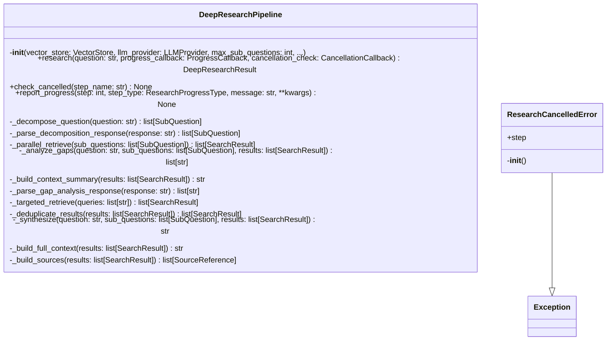

# deep_research.py

## File Overview

This module provides deep research capabilities for the local_deepwiki system. It implements a pipeline-based approach to conduct comprehensive research by breaking down complex queries into manageable sub-questions, searching for relevant information, and synthesizing results. The module includes progress tracking and cancellation support for long-running research operations.

## Classes

### ResearchCancelledError

A custom exception class used to signal when a research operation has been cancelled. This allows the research pipeline to gracefully handle cancellation requests and clean up resources appropriately.

### DeepResearchPipeline

The [main](../export/html.md) class that orchestrates the deep research process. This pipeline manages the entire research workflow, from initial query processing through final result synthesis.

**Purpose**: Coordinates multi-step research operations including query decomposition, information retrieval, and result compilation while providing progress updates and cancellation support.

**Key Components**:
- Integrates with [VectorStore](vectorstore.md) for information retrieval
- Uses [LLMProvider](../providers/base.md) for natural language processing tasks
- Implements progress tracking through [ResearchProgress](../models.md) callbacks
- Supports research operation cancellation

## Functions

The module contains various utility and processing functions that support the research pipeline, though their specific signatures and parameters are not fully visible in the provided code chunks.

## Usage Examples

```python
from local_deepwiki.core.deep_research import DeepResearchPipeline, ResearchCancelledError
from local_deepwiki.core.vectorstore import VectorStore
from local_deepwiki.providers.base import LLMProvider

# Initialize the research pipeline
pipeline = DeepResearchPipeline(
    vector_store=vector_store,
    llm_provider=llm_provider
)

# Handle research cancellation
try:
    result = await pipeline.research(query="Your research question")
except ResearchCancelledError:
    print("Research was cancelled")
```

## Related Components

This module works closely with several other components:

- **[VectorStore](vectorstore.md)**: Used for storing and retrieving vectorized information during research
- **[LLMProvider](../providers/base.md)**: Provides language model capabilities for query processing and synthesis
- **[DeepResearchResult](../models.md)**: Data model for research output
- **[ResearchProgress](../models.md)**: Progress tracking model with [ResearchProgressType](../models.md) enumeration
- **[ResearchStep](../models.md)**: Individual step tracking with [ResearchStepType](../models.md) classification
- **[SearchResult](../models.md)**: Search operation results
- **[SourceReference](../models.md)**: Reference tracking for research sources
- **[SubQuestion](../models.md)**: Sub-query decomposition model

The module also integrates with the logging system through [`get_logger`](../logging.md) for operational monitoring and debugging.

## Models Integration

The research pipeline leverages several data models to structure the research process:

- Uses [SubQuestion](../models.md) for breaking down complex queries
- Tracks progress through [ResearchStep](../models.md) and [ResearchProgress](../models.md)
- Compiles results into [DeepResearchResult](../models.md) format
- Maintains [SourceReference](../models.md) for citation and verification
- Processes [SearchResult](../models.md) data from vector store queries

## API Reference

### class `ResearchCancelledError`

**Inherits from:** `Exception`

Raised when a deep research operation is cancelled.

**Methods:**

#### `__init__`

```python
def __init__(step: str = "unknown")
```


| [Parameter](../generators/api_docs.md) | Type | Default | Description |
|-----------|------|---------|-------------|
| `step` | `str` | `"unknown"` | - |


### class `DeepResearchPipeline`

Multi-step research pipeline for complex codebase questions.  This pipeline performs: 1. Query decomposition - breaks question into sub-questions 2. Parallel retrieval - searches for each sub-question 3. Gap analysis - identifies missing context 4. Follow-up retrieval - targeted search for gaps 5. Synthesis - combines context into comprehensive answer

**Methods:**

#### `__init__`

```python
def __init__(vector_store: VectorStore, llm_provider: LLMProvider, max_sub_questions: int = 4, chunks_per_subquestion: int = 5, max_total_chunks: int = 30, max_follow_up_queries: int = 3, synthesis_temperature: float = 0.5, synthesis_max_tokens: int = 4096, decomposition_prompt: str | None = None, gap_analysis_prompt: str | None = None, synthesis_prompt: str | None = None)
```

Initialize the deep research pipeline.


| [Parameter](../generators/api_docs.md) | Type | Default | Description |
|-----------|------|---------|-------------|
| `vector_store` | [`VectorStore`](vectorstore.md) | - | Vector store for semantic search. |
| `llm_provider` | [`LLMProvider`](../providers/base.md) | - | LLM provider for reasoning. |
| `max_sub_questions` | `int` | `4` | Maximum sub-questions to generate. |
| `chunks_per_subquestion` | `int` | `5` | Chunks to retrieve per sub-question. |
| `max_total_chunks` | `int` | `30` | Maximum total chunks to use in synthesis. |
| `max_follow_up_queries` | `int` | `3` | Maximum follow-up queries in gap analysis. |
| `synthesis_temperature` | `float` | `0.5` | LLM temperature for synthesis (0.0-2.0). |
| `synthesis_max_tokens` | `int` | `4096` | Maximum tokens in synthesis response. |
| `decomposition_prompt` | `str | None` | `None` | Custom system prompt for decomposition (optional). |
| `gap_analysis_prompt` | `str | None` | `None` | Custom system prompt for gap analysis (optional). |
| `synthesis_prompt` | `str | None` | `None` | Custom system prompt for synthesis (optional). |

#### `research`

```python
async def research(question: str, progress_callback: ProgressCallback = None, cancellation_check: CancellationCallback = None) -> DeepResearchResult
```

Execute the full research pipeline.


| [Parameter](../generators/api_docs.md) | Type | Default | Description |
|-----------|------|---------|-------------|
| `question` | `str` | - | The complex question to research. |
| [`progress_callback`](../watcher.md) | [`ProgressCallback`](../models.md) | `None` | Optional async callback for progress updates. |
| `cancellation_check` | `CancellationCallback` | `None` | Optional callback that returns True if cancelled. |

#### `check_cancelled`

```python
def check_cancelled(step_name: str) -> None
```

Check if cancelled and raise if so.


| [Parameter](../generators/api_docs.md) | Type | Default | Description |
|-----------|------|---------|-------------|
| `step_name` | `str` | - | - |

#### `report_progress`

```python
async def report_progress(step: int, step_type: ResearchProgressType, message: str, **kwargs) -> None
```


| [Parameter](../generators/api_docs.md) | Type | Default | Description |
|-----------|------|---------|-------------|
| `step` | `int` | - | - |
| `step_type` | [`ResearchProgressType`](../models.md) | - | - |
| `message` | `str` | - | - |
| `**kwargs` | - | - | - |


## Class Diagram



## Call Graph


## Usage Examples

*Examples extracted from test files*

### Test decomposition of a simple question

From `test_deep_research.py::test_decompose_simple_question`:

```python
pipeline = DeepResearchPipeline(
    vector_store=mock_vector_store,
    llm_provider=llm,
)

result = await pipeline.research("How does authentication work?")

assert len(result.sub_questions) == 2
```

### Test decomposition of a simple question

From `test_deep_research.py::test_decompose_simple_question`:

```python
result = await pipeline.research("How does authentication work?")

assert len(result.sub_questions) == 2
```

### Test that decomposition limits sub-questions to max

From `test_deep_research.py::test_decompose_limits_sub_questions`:

```python
pipeline = DeepResearchPipeline(
    vector_store=mock_vector_store,
    llm_provider=llm,
    max_sub_questions=4,
)

result = await pipeline.research("Complex question")

assert len(result.sub_questions) <= 4
```

### Test that decomposition limits sub-questions to max

From `test_deep_research.py::test_decompose_limits_sub_questions`:

```python
result = await pipeline.research("Complex question")

assert len(result.sub_questions) <= 4
```

### Test error returned for empty question

From `test_deep_research.py::test_returns_error_for_empty_question`:

```python
from local_deepwiki.server import handle_deep_research

result = await handle_deep_research({
    "repo_path": "/some/path",
    "question": "",
})

assert len(result) == 1
```

## Relevant Source Files

- `src/local_deepwiki/core/deep_research.py:33-38`
