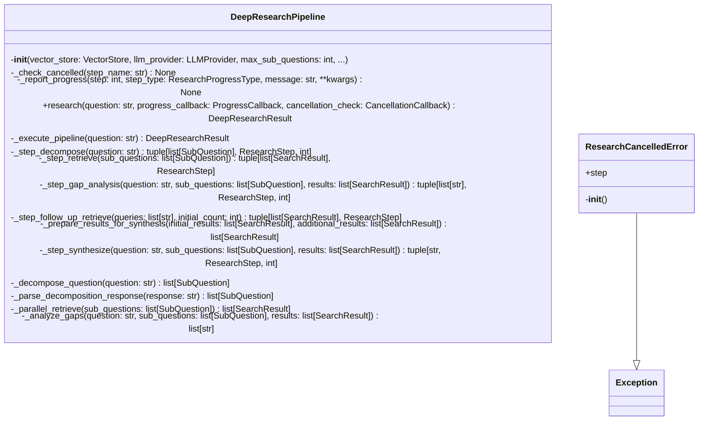

# Deep Research Module

## File Overview

The `deep_research.py` module provides the core deep research pipeline functionality for the Local DeepWiki system. It implements a comprehensive research workflow that can break down complex questions into sub-questions, conduct searches, and synthesize findings into structured research results.

## Classes

### ResearchCancelledError

A custom exception class used to signal when a research operation has been cancelled.

### DeepResearchPipeline

The [main](../export/pdf.md) class that orchestrates the deep research process. It manages the complete research workflow from initial question analysis through final synthesis.

**Key Dependencies:**
- [VectorStore](vectorstore.md) for search operations
- [LLMProvider](../providers/base.md) for language model interactions
- Progress tracking through callback functions

## Models and Data Structures

The module works with several data models imported from `local_deepwiki.models`:

- **[DeepResearchResult](../models.md)**: Contains the final research output
- **[ResearchProgress](../models.md)**: Tracks progress through the research pipeline
- **[ResearchProgressType](../models.md)**: Enumeration of progress event types
- **[ResearchStep](../models.md)**: Individual steps in the research process
- **[ResearchStepType](../models.md)**: Types of research steps
- **[SearchResult](../models.md)**: Results from search operations
- **[SourceReference](../models.md)**: References to source materials
- **[SubQuestion](../models.md)**: Sub-questions derived from the [main](../export/pdf.md) research question

## Core Functionality

The module implements an asynchronous research pipeline that:

1. **Question Analysis**: Breaks down complex research questions into manageable sub-questions
2. **Search Execution**: Conducts searches using the integrated vector store
3. **Progress Tracking**: Provides real-time updates on research progress
4. **Result Synthesis**: Combines findings into comprehensive research results

## Related Components

This module integrates with several other components of the Local DeepWiki system:

- **[VectorStore](vectorstore.md)**: For conducting semantic searches across the knowledge base
- **[LLMProvider](../providers/base.md)**: For natural language processing and content generation
- **Logging system**: For operational logging and debugging
- **Models package**: For structured data representation throughout the research process

## Usage Context

The deep research pipeline is designed to handle complex, multi-faceted research questions that require:
- Breaking down into smaller, focused sub-questions
- Multiple search iterations
- Synthesis of information from various sources
- Progress tracking for long-running operations
- Cancellation support for user-initiated stops

The module uses asyncio for concurrent operations and provides callback mechanisms for progress updates, making it suitable for integration into both CLI and web-based interfaces.

## API Reference

### class `ResearchCancelledError`

**Inherits from:** `Exception`

Raised when a deep research operation is cancelled.

**Methods:**

#### `__init__`

```python
def __init__(step: str = "unknown")
```


| [Parameter](../generators/api_docs.md) | Type | Default | Description |
|-----------|------|---------|-------------|
| `step` | `str` | `"unknown"` | - |


### class `DeepResearchPipeline`

Multi-step research pipeline for complex codebase questions.  This pipeline performs: 1. Query decomposition - breaks question into sub-questions 2. Parallel retrieval - searches for each sub-question 3. Gap analysis - identifies missing context 4. Follow-up retrieval - targeted search for gaps 5. Synthesis - combines context into comprehensive answer

**Methods:**

#### `__init__`

```python
def __init__(vector_store: VectorStore, llm_provider: LLMProvider, max_sub_questions: int = 4, chunks_per_subquestion: int = 5, max_total_chunks: int = 30, max_follow_up_queries: int = 3, synthesis_temperature: float = 0.5, synthesis_max_tokens: int = 4096, decomposition_prompt: str | None = None, gap_analysis_prompt: str | None = None, synthesis_prompt: str | None = None)
```

Initialize the deep research pipeline.


| [Parameter](../generators/api_docs.md) | Type | Default | Description |
|-----------|------|---------|-------------|
| `vector_store` | [`VectorStore`](vectorstore.md) | - | Vector store for semantic search. |
| `llm_provider` | [`LLMProvider`](../providers/base.md) | - | LLM provider for reasoning. |
| `max_sub_questions` | `int` | `4` | Maximum sub-questions to generate. |
| `chunks_per_subquestion` | `int` | `5` | Chunks to retrieve per sub-question. |
| `max_total_chunks` | `int` | `30` | Maximum total chunks to use in synthesis. |
| `max_follow_up_queries` | `int` | `3` | Maximum follow-up queries in gap analysis. |
| `synthesis_temperature` | `float` | `0.5` | LLM temperature for synthesis (0.0-2.0). |
| `synthesis_max_tokens` | `int` | `4096` | Maximum tokens in synthesis response. |
| `decomposition_prompt` | `str | None` | `None` | Custom system prompt for decomposition (optional). |
| `gap_analysis_prompt` | `str | None` | `None` | Custom system prompt for gap analysis (optional). |
| `synthesis_prompt` | `str | None` | `None` | Custom system prompt for synthesis (optional). |

#### `research`

```python
async def research(question: str, progress_callback: ProgressCallback = None, cancellation_check: CancellationCallback = None) -> DeepResearchResult
```

Execute the full research pipeline.


| [Parameter](../generators/api_docs.md) | Type | Default | Description |
|-----------|------|---------|-------------|
| `question` | `str` | - | The complex question to research. |
| [`progress_callback`](../watcher.md) | [`ProgressCallback`](../models.md) | `None` | Optional async callback for progress updates. |
| `cancellation_check` | `CancellationCallback` | `None` | Optional callback that returns True if cancelled. |


## Class Diagram



## Call Graph


## Usage Examples

*Examples extracted from test files*

### Test decomposition of a simple question

From `test_deep_research.py::test_decompose_simple_question`:

```python
pipeline = DeepResearchPipeline(
    vector_store=mock_vector_store,
    llm_provider=llm,
)

result = await pipeline.research("How does authentication work?")

assert len(result.sub_questions) == 2
```

### Test decomposition of a simple question

From `test_deep_research.py::test_decompose_simple_question`:

```python
result = await pipeline.research("How does authentication work?")

assert len(result.sub_questions) == 2
```

### Test that decomposition limits sub-questions to max

From `test_deep_research.py::test_decompose_limits_sub_questions`:

```python
pipeline = DeepResearchPipeline(
    vector_store=mock_vector_store,
    llm_provider=llm,
    max_sub_questions=4,
)

result = await pipeline.research("Complex question")

assert len(result.sub_questions) <= 4
```

### Test that decomposition limits sub-questions to max

From `test_deep_research.py::test_decompose_limits_sub_questions`:

```python
result = await pipeline.research("Complex question")

assert len(result.sub_questions) <= 4
```

### Test error returned for empty question

From `test_deep_research.py::test_returns_error_for_empty_question`:

```python
from local_deepwiki.handlers import handle_deep_research

result = await handle_deep_research({
    "repo_path": "/some/path",
    "question": "",
})

assert len(result) == 1
```

## Relevant Source Files

- `src/local_deepwiki/core/deep_research.py:33-38`
