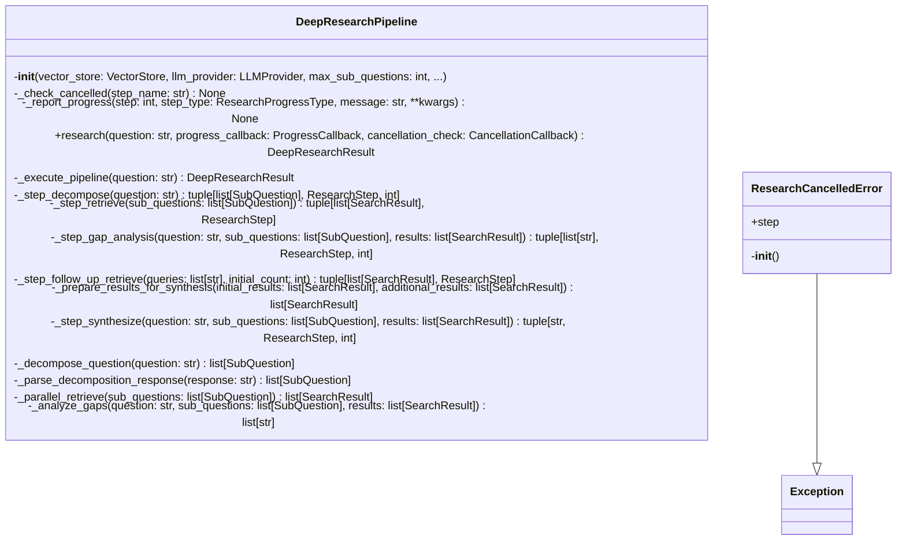

# Deep Research Module

## File Overview

The `deep_research.py` module provides the core research pipeline functionality for the local_deepwiki system. It implements a sophisticated research workflow that breaks down complex queries into sub-questions, conducts searches, and synthesizes comprehensive research results using vector stores and LLM providers.

## Classes

### ResearchCancelledError

A custom exception class used to signal when a research operation has been cancelled.

### DeepResearchPipeline

The [main](../export/pdf.md) research orchestration class that manages the entire research workflow. This class coordinates between vector stores, LLM providers, and various research steps to produce comprehensive research results.

**Key Responsibilities:**
- Breaking down complex research queries into manageable sub-questions
- Conducting searches using vector stores
- Synthesizing research findings using LLM providers
- Managing research progress and step tracking
- Handling cancellation of research operations

## Core Functionality

The module implements a multi-step research process that:

1. **Question Decomposition**: Breaks down complex queries into focused sub-questions
2. **Search Execution**: Performs searches using the integrated vector store
3. **Result Synthesis**: Uses LLM providers to analyze and synthesize findings
4. **Progress Tracking**: Provides detailed progress updates throughout the research process

## Data Models Integration

The module works extensively with several data models:

- **[DeepResearchResult](../models.md)**: Represents the final comprehensive research output
- **[ResearchProgress](../models.md)**: Tracks the current state and progress of research operations
- **[ResearchStep](../models.md)**: Represents individual steps in the research workflow
- **[SubQuestion](../models.md)**: Represents decomposed questions for focused research
- **[SearchResult](../models.md)**: Contains search results from vector store queries
- **[SourceReference](../models.md)**: Tracks source materials and references

## Related Components

This module integrates with several other system components:

- **[VectorStore](vectorstore.md)**: Used for semantic search and document retrieval
- **[LLMProvider](../providers/base.md)**: Provides language model capabilities for analysis and synthesis
- **Logging System**: Integrated logging for research operation tracking

## Usage Context

The DeepResearchPipeline class serves as the central orchestrator for research operations, coordinating between different system components to deliver comprehensive research results. It supports asynchronous operations and provides progress callbacks for real-time updates during research execution.

The module is designed to handle complex research workflows while providing proper error handling through the ResearchCancelledError exception and comprehensive progress tracking through the [ResearchProgress](../models.md) system.

## API Reference

### class `ResearchCancelledError`

**Inherits from:** `Exception`

Raised when a deep research operation is cancelled.

**Methods:**


<details>
<summary>View Source (lines 33-38) | <a href="https://github.com/UrbanDiver/local-deepwiki-mcp/blob/[main](../export/pdf.md)/src/local_deepwiki/core/deep_research.py#L33-L38">GitHub</a></summary>

```python
class ResearchCancelledError(Exception):
    """Raised when a deep research operation is cancelled."""

    def __init__(self, step: str = "unknown"):
        self.step = step
        super().__init__(f"Research cancelled during {step}")
```

</details>

#### `__init__`

```python
def __init__(step: str = "unknown")
```


| [Parameter](../generators/api_docs.md) | Type | Default | Description |
|-----------|------|---------|-------------|
| `step` | `str` | `"unknown"` | - |


<details>
<summary>View Source (lines 33-38) | <a href="https://github.com/UrbanDiver/local-deepwiki-mcp/blob/[main](../export/pdf.md)/src/local_deepwiki/core/deep_research.py#L33-L38">GitHub</a></summary>

```python
class ResearchCancelledError(Exception):
    """Raised when a deep research operation is cancelled."""

    def __init__(self, step: str = "unknown"):
        self.step = step
        super().__init__(f"Research cancelled during {step}")
```

</details>

### class `DeepResearchPipeline`

Multi-step research pipeline for complex codebase questions.  This pipeline performs: 1. Query decomposition - breaks question into sub-questions 2. Parallel retrieval - searches for each sub-question 3. Gap analysis - identifies missing context 4. Follow-up retrieval - targeted search for gaps 5. Synthesis - combines context into comprehensive answer

**Methods:**


<details>
<summary>View Source (lines 113-806) | <a href="https://github.com/UrbanDiver/local-deepwiki-mcp/blob/[main](../export/pdf.md)/src/local_deepwiki/core/deep_research.py#L113-L806">GitHub</a></summary>

```python
class DeepResearchPipeline:
    # Methods: __init__, _check_cancelled, _report_progress, research, _execute_pipeline, _step_decompose, _step_retrieve, _step_gap_analysis, _step_follow_up_retrieve, _prepare_results_for_synthesis, _step_synthesize, _decompose_question, _parse_decomposition_response, _parallel_retrieve, _analyze_gaps, _build_context_summary, _parse_gap_analysis_response, _targeted_retrieve, _deduplicate_results, _synthesize, _build_full_context, _build_sources
```

</details>

#### `__init__`

```python
def __init__(vector_store: VectorStore, llm_provider: LLMProvider, max_sub_questions: int = 4, chunks_per_subquestion: int = 5, max_total_chunks: int = 30, max_follow_up_queries: int = 3, synthesis_temperature: float = 0.5, synthesis_max_tokens: int = 4096, decomposition_prompt: str | None = None, gap_analysis_prompt: str | None = None, synthesis_prompt: str | None = None)
```

Initialize the deep research pipeline.


| [Parameter](../generators/api_docs.md) | Type | Default | Description |
|-----------|------|---------|-------------|
| `vector_store` | [`VectorStore`](vectorstore.md) | - | Vector store for semantic search. |
| `llm_provider` | [`LLMProvider`](../providers/base.md) | - | LLM provider for reasoning. |
| `max_sub_questions` | `int` | `4` | Maximum sub-questions to generate. |
| `chunks_per_subquestion` | `int` | `5` | Chunks to retrieve per sub-question. |
| `max_total_chunks` | `int` | `30` | Maximum total chunks to use in synthesis. |
| `max_follow_up_queries` | `int` | `3` | Maximum follow-up queries in gap analysis. |
| `synthesis_temperature` | `float` | `0.5` | LLM temperature for synthesis (0.0-2.0). |
| `synthesis_max_tokens` | `int` | `4096` | Maximum tokens in synthesis response. |
| `decomposition_prompt` | `str | None` | `None` | Custom system prompt for decomposition (optional). |
| `gap_analysis_prompt` | `str | None` | `None` | Custom system prompt for gap analysis (optional). |
| `synthesis_prompt` | `str | None` | `None` | Custom system prompt for synthesis (optional). |


<details>
<summary>View Source (lines 124-169) | <a href="https://github.com/UrbanDiver/local-deepwiki-mcp/blob/[main](../export/pdf.md)/src/local_deepwiki/core/deep_research.py#L124-L169">GitHub</a></summary>

```python
def __init__(
        self,
        vector_store: VectorStore,
        llm_provider: LLMProvider,
        max_sub_questions: int = 4,
        chunks_per_subquestion: int = 5,
        max_total_chunks: int = 30,
        max_follow_up_queries: int = 3,
        synthesis_temperature: float = 0.5,
        synthesis_max_tokens: int = 4096,
        decomposition_prompt: str | None = None,
        gap_analysis_prompt: str | None = None,
        synthesis_prompt: str | None = None,
    ):
        """Initialize the deep research pipeline.

        Args:
            vector_store: Vector store for semantic search.
            llm_provider: LLM provider for reasoning.
            max_sub_questions: Maximum sub-questions to generate.
            chunks_per_subquestion: Chunks to retrieve per sub-question.
            max_total_chunks: Maximum total chunks to use in synthesis.
            max_follow_up_queries: Maximum follow-up queries in gap analysis.
            synthesis_temperature: LLM temperature for synthesis (0.0-2.0).
            synthesis_max_tokens: Maximum tokens in synthesis response.
            decomposition_prompt: Custom system prompt for decomposition (optional).
            gap_analysis_prompt: Custom system prompt for gap analysis (optional).
            synthesis_prompt: Custom system prompt for synthesis (optional).
        """
        self.vector_store = vector_store
        self.llm = llm_provider
        self.max_sub_questions = max_sub_questions
        self.chunks_per_subquestion = chunks_per_subquestion
        self.max_total_chunks = max_total_chunks
        self.max_follow_up_queries = max_follow_up_queries
        self.synthesis_temperature = synthesis_temperature
        self.synthesis_max_tokens = synthesis_max_tokens

        # Use custom prompts if provided, otherwise use defaults
        self.decomposition_prompt = decomposition_prompt or DECOMPOSITION_SYSTEM_PROMPT
        self.gap_analysis_prompt = gap_analysis_prompt or GAP_ANALYSIS_SYSTEM_PROMPT
        self.synthesis_prompt = synthesis_prompt or SYNTHESIS_SYSTEM_PROMPT

        # Runtime state (set during research())
        self._progress_callback: ProgressCallback = None
        self._cancellation_check: CancellationCallback = None
```

</details>

#### `research`

```python
async def research(question: str, progress_callback: ProgressCallback = None, cancellation_check: CancellationCallback = None) -> DeepResearchResult
```

Execute the full research pipeline.


| [Parameter](../generators/api_docs.md) | Type | Default | Description |
|-----------|------|---------|-------------|
| `question` | `str` | - | The complex question to research. |
| [`progress_callback`](../handlers.md) | [`ProgressCallback`](../models.md) | `None` | Optional async callback for progress updates. |
| `cancellation_check` | `CancellationCallback` | `None` | Optional callback that returns True if cancelled. |


<details>
<summary>View Source (lines 209-237) | <a href="https://github.com/UrbanDiver/local-deepwiki-mcp/blob/[main](../export/pdf.md)/src/local_deepwiki/core/deep_research.py#L209-L237">GitHub</a></summary>

```python
async def research(
        self,
        question: str,
        progress_callback: ProgressCallback = None,
        cancellation_check: CancellationCallback = None,
    ) -> DeepResearchResult:
        """Execute the full research pipeline.

        Args:
            question: The complex question to research.
            progress_callback: Optional async callback for progress updates.
            cancellation_check: Optional callback that returns True if cancelled.

        Returns:
            DeepResearchResult with answer, sources, and reasoning trace.

        Raises:
            ResearchCancelledError: If the operation is cancelled.
        """
        # Store callbacks for use by helper methods
        self._progress_callback = progress_callback
        self._cancellation_check = cancellation_check

        try:
            return await self._execute_pipeline(question)
        finally:
            # Clear callbacks after execution
            self._progress_callback = None
            self._cancellation_check = None
```

</details>

## Class Diagram



## Call Graph


## Used By

Functions and methods in this file and their callers:

- **[`DeepResearchResult`](../models.md)**: called by `DeepResearchPipeline._execute_pipeline`
- **`ResearchCancelledError`**: called by `DeepResearchPipeline._check_cancelled`
- **[`ResearchProgress`](../models.md)**: called by `DeepResearchPipeline._report_progress`
- **[`ResearchStep`](../models.md)**: called by `DeepResearchPipeline._step_decompose`, `DeepResearchPipeline._step_follow_up_retrieve`, `DeepResearchPipeline._step_gap_analysis`, `DeepResearchPipeline._step_retrieve`, `DeepResearchPipeline._step_synthesize`
- **[`SourceReference`](../models.md)**: called by `DeepResearchPipeline._build_sources`
- **[`SubQuestion`](../models.md)**: called by `DeepResearchPipeline._parse_decomposition_response`
- **`__init__`**: called by `ResearchCancelledError.__init__`
- **`_analyze_gaps`**: called by `DeepResearchPipeline._step_gap_analysis`
- **`_build_context_summary`**: called by `DeepResearchPipeline._analyze_gaps`
- **`_build_full_context`**: called by `DeepResearchPipeline._synthesize`
- **`_build_sources`**: called by `DeepResearchPipeline._execute_pipeline`
- **`_cancellation_check`**: called by `DeepResearchPipeline._check_cancelled`
- **`_check_cancelled`**: called by `DeepResearchPipeline._step_decompose`, `DeepResearchPipeline._step_follow_up_retrieve`, `DeepResearchPipeline._step_gap_analysis`, `DeepResearchPipeline._step_retrieve`, `DeepResearchPipeline._step_synthesize`
- **`_decompose_question`**: called by `DeepResearchPipeline._step_decompose`
- **`_deduplicate_results`**: called by `DeepResearchPipeline._prepare_results_for_synthesis`
- **`_execute_pipeline`**: called by `DeepResearchPipeline.research`
- **`_parallel_retrieve`**: called by `DeepResearchPipeline._step_retrieve`
- **`_parse_decomposition_response`**: called by `DeepResearchPipeline._decompose_question`
- **`_parse_gap_analysis_response`**: called by `DeepResearchPipeline._analyze_gaps`
- **`_prepare_results_for_synthesis`**: called by `DeepResearchPipeline._execute_pipeline`
- **`_progress_callback`**: called by `DeepResearchPipeline._report_progress`
- **`_report_progress`**: called by `DeepResearchPipeline._execute_pipeline`, `DeepResearchPipeline._step_decompose`, `DeepResearchPipeline._step_follow_up_retrieve`, `DeepResearchPipeline._step_gap_analysis`, `DeepResearchPipeline._step_retrieve`, `DeepResearchPipeline._step_synthesize`
- **`_step_decompose`**: called by `DeepResearchPipeline._execute_pipeline`
- **`_step_follow_up_retrieve`**: called by `DeepResearchPipeline._execute_pipeline`
- **`_step_gap_analysis`**: called by `DeepResearchPipeline._execute_pipeline`
- **`_step_retrieve`**: called by `DeepResearchPipeline._execute_pipeline`
- **`_step_synthesize`**: called by `DeepResearchPipeline._execute_pipeline`
- **`_synthesize`**: called by `DeepResearchPipeline._step_synthesize`
- **`_targeted_retrieve`**: called by `DeepResearchPipeline._step_follow_up_retrieve`
- **`gather`**: called by `DeepResearchPipeline._parallel_retrieve`, `DeepResearchPipeline._targeted_retrieve`
- **`generate`**: called by `DeepResearchPipeline._analyze_gaps`, `DeepResearchPipeline._decompose_question`, `DeepResearchPipeline._synthesize`
- **`group`**: called by `DeepResearchPipeline._parse_decomposition_response`, `DeepResearchPipeline._parse_gap_analysis_response`
- **`loads`**: called by `DeepResearchPipeline._parse_decomposition_response`, `DeepResearchPipeline._parse_gap_analysis_response`
- **`search`**: called by `DeepResearchPipeline._parallel_retrieve`, `DeepResearchPipeline._parse_decomposition_response`, `DeepResearchPipeline._parse_gap_analysis_response`, `DeepResearchPipeline._targeted_retrieve`
- **`time`**: called by `DeepResearchPipeline._step_decompose`, `DeepResearchPipeline._step_follow_up_retrieve`, `DeepResearchPipeline._step_gap_analysis`, `DeepResearchPipeline._step_retrieve`, `DeepResearchPipeline._step_synthesize`

## Usage Examples

*Examples extracted from test files*

### Test decomposition of a simple question

From `test_deep_research.py::TestDeepResearchPipelineDecomposition::test_decompose_simple_question`:

```python
pipeline = DeepResearchPipeline(
    vector_store=mock_vector_store,
    llm_provider=llm,
)

result = await pipeline.research("How does authentication work?")

assert len(result.sub_questions) == 2
assert result.sub_questions[0].category == "structure"
```

### Test decomposition of a simple question

From `test_deep_research.py::TestDeepResearchPipelineDecomposition::test_decompose_simple_question`:

```python
llm = MockLLMProvider(
    responses=[
        json.dumps(
            {
                "sub_questions": [
                    {"question": "What is the structure?", "category": "structure"},
                    {"question": "How does it flow?", "category": "flow"},
                ]
            }
        ),
        json.dumps({"gaps": [], "follow_up_queries": []}),
        "Final answer",
    ]
)

pipeline = DeepResearchPipeline(
    vector_store=mock_vector_store,
    llm_provider=llm,
)

result = await pipeline.research("How does authentication work?")

assert len(result.sub_questions) == 2
assert result.sub_questions[0].category == "structure"
assert result.sub_questions[1].category == "flow"
```

### Test that decomposition limits sub-questions to max

From `test_deep_research.py::TestDeepResearchPipelineDecomposition::test_decompose_limits_sub_questions`:

```python
pipeline = DeepResearchPipeline(
    vector_store=mock_vector_store,
    llm_provider=llm,
    max_sub_questions=4,
)

result = await pipeline.research("Complex question")

assert len(result.sub_questions) <= 4
```

### Test that decomposition limits sub-questions to max

From `test_deep_research.py::TestDeepResearchPipelineDecomposition::test_decompose_limits_sub_questions`:

```python
llm = MockLLMProvider(
    responses=[
        json.dumps(
            {
                "sub_questions": [
                    {"question": f"Q{i}?", "category": "structure"} for i in range(10)
                ]
            }
        ),
        json.dumps({"gaps": [], "follow_up_queries": []}),
        "Final answer",
    ]
)

pipeline = DeepResearchPipeline(
    vector_store=mock_vector_store,
    llm_provider=llm,
    max_sub_questions=4,
)

result = await pipeline.research("Complex question")

assert len(result.sub_questions) <= 4
```

### Test error returned for empty question

From `test_deep_research.py::TestHandleDeepResearch::test_returns_error_for_empty_question`:

```python
from local_deepwiki.handlers import handle_deep_research

result = await handle_deep_research(
    {
        "repo_path": "/some/path",
        "question": "",
    }
)

assert len(result) == 1
assert "Error" in result[0].text
```


## Last Modified

| Entity | Type | Author | Date | Commit |
|--------|------|--------|------|--------|
| `DeepResearchPipeline` | class | Brian Breidenbach | today | `0d91a70` Apply Python best practices... |
| `_step_decompose` | method | Brian Breidenbach | today | `0d91a70` Apply Python best practices... |
| `_parse_decomposition_response` | method | Brian Breidenbach | today | `0d91a70` Apply Python best practices... |
| `_parallel_retrieve` | method | Brian Breidenbach | today | `0d91a70` Apply Python best practices... |
| `_analyze_gaps` | method | Brian Breidenbach | today | `0d91a70` Apply Python best practices... |
| `_targeted_retrieve` | method | Brian Breidenbach | today | `0d91a70` Apply Python best practices... |
| `_deduplicate_results` | method | Brian Breidenbach | today | `0d91a70` Apply Python best practices... |
| `_synthesize` | method | Brian Breidenbach | today | `0d91a70` Apply Python best practices... |
| `__init__` | method | Brian Breidenbach | yesterday | `43b1ef2` Refactor: Extract step meth... |
| `_check_cancelled` | method | Brian Breidenbach | yesterday | `43b1ef2` Refactor: Extract step meth... |
| `_report_progress` | method | Brian Breidenbach | yesterday | `43b1ef2` Refactor: Extract step meth... |
| `research` | method | Brian Breidenbach | yesterday | `43b1ef2` Refactor: Extract step meth... |
| `_execute_pipeline` | method | Brian Breidenbach | yesterday | `43b1ef2` Refactor: Extract step meth... |
| `_step_retrieve` | method | Brian Breidenbach | yesterday | `43b1ef2` Refactor: Extract step meth... |
| `_step_gap_analysis` | method | Brian Breidenbach | yesterday | `43b1ef2` Refactor: Extract step meth... |
| `_step_follow_up_retrieve` | method | Brian Breidenbach | yesterday | `43b1ef2` Refactor: Extract step meth... |
| `_prepare_results_for_synthesis` | method | Brian Breidenbach | yesterday | `43b1ef2` Refactor: Extract step meth... |
| `_step_synthesize` | method | Brian Breidenbach | yesterday | `43b1ef2` Refactor: Extract step meth... |
| `_decompose_question` | method | Brian Breidenbach | 2 days ago | `d387d4f` Add provider-specific promp... |
| `ResearchCancelledError` | class | Brian Breidenbach | 2 days ago | `7096531` Add cancellation support fo... |
| `_build_context_summary` | method | Brian Breidenbach | 2 days ago | `2d97082` Add Deep Research mode for ... |
| `_parse_gap_analysis_response` | method | Brian Breidenbach | 2 days ago | `2d97082` Add Deep Research mode for ... |
| `_build_full_context` | method | Brian Breidenbach | 2 days ago | `2d97082` Add Deep Research mode for ... |
| `_build_sources` | method | Brian Breidenbach | 2 days ago | `2d97082` Add Deep Research mode for ... |

## Additional Source Code

Source code for functions and methods not listed in the API Reference above.

#### `_check_cancelled`

<details>
<summary>View Source (lines 171-182) | <a href="https://github.com/UrbanDiver/local-deepwiki-mcp/blob/[main](../export/pdf.md)/src/local_deepwiki/core/deep_research.py#L171-L182">GitHub</a></summary>

```python
def _check_cancelled(self, step_name: str) -> None:
        """Check if research was cancelled and raise if so.

        Args:
            step_name: Name of the current step for error message.

        Raises:
            ResearchCancelledError: If cancellation was requested.
        """
        if self._cancellation_check and self._cancellation_check():
            logger.info(f"Research cancelled during {step_name}")
            raise ResearchCancelledError(step_name)
```

</details>


#### `_report_progress`

<details>
<summary>View Source (lines 184-207) | <a href="https://github.com/UrbanDiver/local-deepwiki-mcp/blob/[main](../export/pdf.md)/src/local_deepwiki/core/deep_research.py#L184-L207">GitHub</a></summary>

```python
async def _report_progress(
        self,
        step: int,
        step_type: ResearchProgressType,
        message: str,
        **kwargs,
    ) -> None:
        """Report progress to the callback if set.

        Args:
            step: Current step number.
            step_type: Type of progress event.
            message: Human-readable progress message.
            **kwargs: Additional progress data.
        """
        if self._progress_callback:
            await self._progress_callback(
                ResearchProgress(
                    step=step,
                    step_type=step_type,
                    message=message,
                    **kwargs,
                )
            )
```

</details>


#### `_execute_pipeline`

<details>
<summary>View Source (lines 239-302) | <a href="https://github.com/UrbanDiver/local-deepwiki-mcp/blob/[main](../export/pdf.md)/src/local_deepwiki/core/deep_research.py#L239-L302">GitHub</a></summary>

```python
async def _execute_pipeline(self, question: str) -> DeepResearchResult:
        """Execute the research pipeline steps.

        Args:
            question: The complex question to research.

        Returns:
            DeepResearchResult with answer, sources, and reasoning trace.
        """
        trace: list[ResearchStep] = []
        llm_calls = 0

        await self._report_progress(0, ResearchProgressType.STARTED, "Starting deep research...")

        # Step 1: Decompose question
        sub_questions, step, calls = await self._step_decompose(question)
        trace.append(step)
        llm_calls += calls

        # Step 2: Parallel retrieval
        initial_results, step = await self._step_retrieve(sub_questions)
        trace.append(step)

        # Step 3: Gap analysis
        follow_up_queries, step, calls = await self._step_gap_analysis(
            question, sub_questions, initial_results
        )
        trace.append(step)
        llm_calls += calls

        # Step 4: Follow-up retrieval (if needed)
        additional_results: list[SearchResult] = []
        if follow_up_queries:
            additional_results, step = await self._step_follow_up_retrieve(
                follow_up_queries, len(initial_results)
            )
            trace.append(step)

        # Prepare results for synthesis
        all_results = self._prepare_results_for_synthesis(initial_results, additional_results)

        # Step 5: Synthesis
        answer, step, calls = await self._step_synthesize(question, sub_questions, all_results)
        trace.append(step)
        llm_calls += calls

        # Report completion
        await self._report_progress(
            5,
            ResearchProgressType.COMPLETE,
            f"Research complete: {len(all_results)} chunks analyzed, {llm_calls} LLM calls",
            chunks_retrieved=len(all_results),
            duration_ms=step.duration_ms,
        )

        return DeepResearchResult(
            question=question,
            answer=answer,
            sub_questions=sub_questions,
            sources=self._build_sources(all_results),
            reasoning_trace=trace,
            total_chunks_analyzed=len(all_results),
            total_llm_calls=llm_calls,
        )
```

</details>


#### `_step_decompose`

<details>
<summary>View Source (lines 304-331) | <a href="https://github.com/UrbanDiver/local-deepwiki-mcp/blob/[main](../export/pdf.md)/src/local_deepwiki/core/deep_research.py#L304-L331">GitHub</a></summary>

```python
async def _step_decompose(self, question: str) -> tuple[list[SubQuestion], ResearchStep, int]:
        """Execute the decomposition step.

        Returns:
            Tuple of (sub_questions, trace_step, llm_call_count).
        """
        self._check_cancelled("decomposition")
        start_time = time.time()

        sub_questions = await self._decompose_question(question)
        duration_ms = int((time.time() - start_time) * 1000)

        step = ResearchStep(
            step_type=ResearchStepType.DECOMPOSITION,
            description=f"Decomposed into {len(sub_questions)} sub-questions",
            duration_ms=duration_ms,
        )

        logger.info(f"Decomposed question into {len(sub_questions)} sub-questions")
        await self._report_progress(
            1,
            ResearchProgressType.DECOMPOSITION_COMPLETE,
            f"Decomposed into {len(sub_questions)} sub-questions",
            sub_questions=sub_questions,
            duration_ms=duration_ms,
        )

        return sub_questions, step, 1
```

</details>


#### `_step_retrieve`

<details>
<summary>View Source (lines 333-362) | <a href="https://github.com/UrbanDiver/local-deepwiki-mcp/blob/[main](../export/pdf.md)/src/local_deepwiki/core/deep_research.py#L333-L362">GitHub</a></summary>

```python
async def _step_retrieve(
        self, sub_questions: list[SubQuestion]
    ) -> tuple[list[SearchResult], ResearchStep]:
        """Execute the initial retrieval step.

        Returns:
            Tuple of (search_results, trace_step).
        """
        self._check_cancelled("retrieval")
        start_time = time.time()

        results = await self._parallel_retrieve(sub_questions)
        duration_ms = int((time.time() - start_time) * 1000)

        step = ResearchStep(
            step_type=ResearchStepType.RETRIEVAL,
            description=f"Retrieved {len(results)} code chunks",
            duration_ms=duration_ms,
        )

        logger.info(f"Initial retrieval found {len(results)} chunks")
        await self._report_progress(
            2,
            ResearchProgressType.RETRIEVAL_COMPLETE,
            f"Retrieved {len(results)} code chunks",
            chunks_retrieved=len(results),
            duration_ms=duration_ms,
        )

        return results, step
```

</details>


#### `_step_gap_analysis`

<details>
<summary>View Source (lines 364-396) | <a href="https://github.com/UrbanDiver/local-deepwiki-mcp/blob/[main](../export/pdf.md)/src/local_deepwiki/core/deep_research.py#L364-L396">GitHub</a></summary>

```python
async def _step_gap_analysis(
        self,
        question: str,
        sub_questions: list[SubQuestion],
        results: list[SearchResult],
    ) -> tuple[list[str], ResearchStep, int]:
        """Execute the gap analysis step.

        Returns:
            Tuple of (follow_up_queries, trace_step, llm_call_count).
        """
        self._check_cancelled("gap_analysis")
        start_time = time.time()

        follow_up_queries = await self._analyze_gaps(question, sub_questions, results)
        duration_ms = int((time.time() - start_time) * 1000)

        step = ResearchStep(
            step_type=ResearchStepType.GAP_ANALYSIS,
            description=f"Identified {len(follow_up_queries)} gaps to fill",
            duration_ms=duration_ms,
        )

        logger.info(f"Gap analysis generated {len(follow_up_queries)} follow-up queries")
        await self._report_progress(
            3,
            ResearchProgressType.GAP_ANALYSIS_COMPLETE,
            f"Identified {len(follow_up_queries)} follow-up queries",
            follow_up_queries=follow_up_queries if follow_up_queries else None,
            duration_ms=duration_ms,
        )

        return follow_up_queries, step, 1
```

</details>


#### `_step_follow_up_retrieve`

<details>
<summary>View Source (lines 398-427) | <a href="https://github.com/UrbanDiver/local-deepwiki-mcp/blob/[main](../export/pdf.md)/src/local_deepwiki/core/deep_research.py#L398-L427">GitHub</a></summary>

```python
async def _step_follow_up_retrieve(
        self, queries: list[str], initial_count: int
    ) -> tuple[list[SearchResult], ResearchStep]:
        """Execute the follow-up retrieval step.

        Returns:
            Tuple of (search_results, trace_step).
        """
        self._check_cancelled("follow_up_retrieval")
        start_time = time.time()

        results = await self._targeted_retrieve(queries)
        duration_ms = int((time.time() - start_time) * 1000)

        step = ResearchStep(
            step_type=ResearchStepType.RETRIEVAL,
            description=f"Follow-up retrieved {len(results)} chunks",
            duration_ms=duration_ms,
        )

        logger.info(f"Follow-up retrieval found {len(results)} chunks")
        await self._report_progress(
            4,
            ResearchProgressType.FOLLOWUP_COMPLETE,
            f"Follow-up retrieved {len(results)} additional chunks",
            chunks_retrieved=initial_count + len(results),
            duration_ms=duration_ms,
        )

        return results, step
```

</details>


#### `_prepare_results_for_synthesis`

<details>
<summary>View Source (lines 429-445) | <a href="https://github.com/UrbanDiver/local-deepwiki-mcp/blob/[main](../export/pdf.md)/src/local_deepwiki/core/deep_research.py#L429-L445">GitHub</a></summary>

```python
def _prepare_results_for_synthesis(
        self,
        initial_results: list[SearchResult],
        additional_results: list[SearchResult],
    ) -> list[SearchResult]:
        """Deduplicate and limit results for synthesis.

        Returns:
            Prepared list of search results.
        """
        all_results = self._deduplicate_results(initial_results + additional_results)

        if len(all_results) > self.max_total_chunks:
            all_results = all_results[: self.max_total_chunks]
            logger.info(f"Limited to {self.max_total_chunks} chunks for synthesis")

        return all_results
```

</details>


#### `_step_synthesize`

<details>
<summary>View Source (lines 447-480) | <a href="https://github.com/UrbanDiver/local-deepwiki-mcp/blob/[main](../export/pdf.md)/src/local_deepwiki/core/deep_research.py#L447-L480">GitHub</a></summary>

```python
async def _step_synthesize(
        self,
        question: str,
        sub_questions: list[SubQuestion],
        results: list[SearchResult],
    ) -> tuple[str, ResearchStep, int]:
        """Execute the synthesis step.

        Returns:
            Tuple of (answer, trace_step, llm_call_count).
        """
        # Notify synthesis is starting (it's the longest step)
        await self._report_progress(
            4,
            ResearchProgressType.SYNTHESIS_STARTED,
            f"Synthesizing answer from {len(results)} chunks...",
            chunks_retrieved=len(results),
        )

        self._check_cancelled("synthesis")
        start_time = time.time()

        answer = await self._synthesize(question, sub_questions, results)
        duration_ms = int((time.time() - start_time) * 1000)

        step = ResearchStep(
            step_type=ResearchStepType.SYNTHESIS,
            description=f"Synthesized answer from {len(results)} chunks",
            duration_ms=duration_ms,
        )

        logger.info("Synthesis complete")

        return answer, step, 1
```

</details>


#### `_decompose_question`

<details>
<summary>View Source (lines 482-506) | <a href="https://github.com/UrbanDiver/local-deepwiki-mcp/blob/[main](../export/pdf.md)/src/local_deepwiki/core/deep_research.py#L482-L506">GitHub</a></summary>

```python
async def _decompose_question(self, question: str) -> list[SubQuestion]:
        """Decompose a complex question into sub-questions.

        Args:
            question: The original question.

        Returns:
            List of sub-questions to investigate.
        """
        prompt = DECOMPOSITION_USER_PROMPT.format(question=question)

        response = await self.llm.generate(
            prompt=prompt,
            system_prompt=self.decomposition_prompt,
            temperature=0.3,  # Lower temperature for structured output
        )

        # Parse JSON response
        sub_questions = self._parse_decomposition_response(response)

        # Limit to max
        if len(sub_questions) > self.max_sub_questions:
            sub_questions = sub_questions[: self.max_sub_questions]

        return sub_questions
```

</details>


#### `_parse_decomposition_response`

<details>
<summary>View Source (lines 508-540) | <a href="https://github.com/UrbanDiver/local-deepwiki-mcp/blob/[main](../export/pdf.md)/src/local_deepwiki/core/deep_research.py#L508-L540">GitHub</a></summary>

```python
def _parse_decomposition_response(self, response: str) -> list[SubQuestion]:
        """Parse the LLM decomposition response.

        Args:
            response: Raw LLM response.

        Returns:
            List of parsed SubQuestions.
        """
        try:
            # Try to extract JSON from the response
            json_match = re.search(r"\{[\s\S]*\}", response)
            if not json_match:
                logger.warning("No JSON found in decomposition response")
                return []

            data = json.loads(json_match.group())
            sub_questions = []

            for item in data.get("sub_questions", []):
                if isinstance(item, dict) and "question" in item:
                    category = item.get("category", "structure")
                    # Validate category
                    valid_categories = {"structure", "flow", "dependencies", "impact", "comparison"}
                    if category not in valid_categories:
                        category = "structure"
                    sub_questions.append(SubQuestion(question=item["question"], category=category))

            return sub_questions

        except json.JSONDecodeError as e:
            logger.warning(f"Failed to parse decomposition JSON: {e}")
            return []
```

</details>


#### `_parallel_retrieve`

<details>
<summary>View Source (lines 542-571) | <a href="https://github.com/UrbanDiver/local-deepwiki-mcp/blob/[main](../export/pdf.md)/src/local_deepwiki/core/deep_research.py#L542-L571">GitHub</a></summary>

```python
async def _parallel_retrieve(self, sub_questions: list[SubQuestion]) -> list[SearchResult]:
        """Retrieve code chunks for each sub-question in parallel.

        Args:
            sub_questions: List of sub-questions to search for.

        Returns:
            Combined list of search results.
        """
        if not sub_questions:
            return []

        # Create search tasks
        tasks = [
            self.vector_store.search(sq.question, limit=self.chunks_per_subquestion)
            for sq in sub_questions
        ]

        # Execute in parallel
        results_lists = await asyncio.gather(*tasks, return_exceptions=True)

        # Combine results
        all_results: list[SearchResult] = []
        for i, result_or_exc in enumerate(results_lists):
            if isinstance(result_or_exc, BaseException):
                logger.warning(f"Search failed for sub-question {i}: {result_or_exc}")
                continue
            all_results.extend(result_or_exc)

        return all_results
```

</details>


#### `_analyze_gaps`

<details>
<summary>View Source (lines 573-616) | <a href="https://github.com/UrbanDiver/local-deepwiki-mcp/blob/[main](../export/pdf.md)/src/local_deepwiki/core/deep_research.py#L573-L616">GitHub</a></summary>

```python
async def _analyze_gaps(
        self,
        question: str,
        sub_questions: list[SubQuestion],
        results: list[SearchResult],
    ) -> list[str]:
        """Analyze retrieved context for gaps.

        Args:
            question: Original question.
            sub_questions: Sub-questions investigated.
            results: Retrieved search results.

        Returns:
            List of follow-up queries to fill gaps.
        """
        if not results:
            # No results, generate basic follow-up
            return [question]

        # Build context summary
        context_summary = self._build_context_summary(results)
        sub_q_text = "\n".join(f"- [{sq.category}] {sq.question}" for sq in sub_questions)

        prompt = GAP_ANALYSIS_USER_PROMPT.format(
            question=question,
            sub_questions=sub_q_text,
            context_summary=context_summary,
        )

        response = await self.llm.generate(
            prompt=prompt,
            system_prompt=self.gap_analysis_prompt,
            temperature=0.3,
        )

        # Parse response
        follow_ups = self._parse_gap_analysis_response(response)

        # Limit follow-up queries
        if len(follow_ups) > self.max_follow_up_queries:
            follow_ups = follow_ups[: self.max_follow_up_queries]

        return follow_ups
```

</details>


#### `_build_context_summary`

<details>
<summary>View Source (lines 618-646) | <a href="https://github.com/UrbanDiver/local-deepwiki-mcp/blob/[main](../export/pdf.md)/src/local_deepwiki/core/deep_research.py#L618-L646">GitHub</a></summary>

```python
def _build_context_summary(self, results: list[SearchResult]) -> str:
        """Build a summary of retrieved context for gap analysis.

        Args:
            results: Search results to summarize.

        Returns:
            String summary of the context.
        """
        if not results:
            return "No code context retrieved."

        # Group by file
        files: dict[str, list[SearchResult]] = {}
        for r in results:
            path = r.chunk.file_path
            if path not in files:
                files[path] = []
            files[path].append(r)

        summary_parts = []
        for path, file_results in files.items():
            chunks = ", ".join(
                f"{r.chunk.chunk_type.value} '{r.chunk.name or 'unnamed'}'"
                for r in file_results[:3]  # Limit per file
            )
            summary_parts.append(f"- {path}: {chunks}")

        return "\n".join(summary_parts[:10])  # Limit total files
```

</details>


#### `_parse_gap_analysis_response`

<details>
<summary>View Source (lines 648-670) | <a href="https://github.com/UrbanDiver/local-deepwiki-mcp/blob/[main](../export/pdf.md)/src/local_deepwiki/core/deep_research.py#L648-L670">GitHub</a></summary>

```python
def _parse_gap_analysis_response(self, response: str) -> list[str]:
        """Parse the LLM gap analysis response.

        Args:
            response: Raw LLM response.

        Returns:
            List of follow-up queries.
        """
        try:
            json_match = re.search(r"\{[\s\S]*\}", response)
            if not json_match:
                return []

            data = json.loads(json_match.group())
            follow_ups = data.get("follow_up_queries", [])

            # Filter out empty strings
            return [q for q in follow_ups if q and isinstance(q, str)]

        except json.JSONDecodeError as e:
            logger.warning(f"Failed to parse gap analysis JSON: {e}")
            return []
```

</details>


#### `_targeted_retrieve`

<details>
<summary>View Source (lines 672-698) | <a href="https://github.com/UrbanDiver/local-deepwiki-mcp/blob/[main](../export/pdf.md)/src/local_deepwiki/core/deep_research.py#L672-L698">GitHub</a></summary>

```python
async def _targeted_retrieve(self, queries: list[str]) -> list[SearchResult]:
        """Perform targeted retrieval for follow-up queries.

        Args:
            queries: List of search queries.

        Returns:
            Combined search results.
        """
        if not queries:
            return []

        # Use slightly fewer chunks per query for follow-ups
        chunks_per_query = max(3, self.chunks_per_subquestion - 2)

        tasks = [self.vector_store.search(query, limit=chunks_per_query) for query in queries]

        results_lists = await asyncio.gather(*tasks, return_exceptions=True)

        all_results: list[SearchResult] = []
        for i, result_or_exc in enumerate(results_lists):
            if isinstance(result_or_exc, BaseException):
                logger.warning(f"Follow-up search failed for query {i}: {result_or_exc}")
                continue
            all_results.extend(result_or_exc)

        return all_results
```

</details>


#### `_deduplicate_results`

<details>
<summary>View Source (lines 700-717) | <a href="https://github.com/UrbanDiver/local-deepwiki-mcp/blob/[main](../export/pdf.md)/src/local_deepwiki/core/deep_research.py#L700-L717">GitHub</a></summary>

```python
def _deduplicate_results(self, results: list[SearchResult]) -> list[SearchResult]:
        """Remove duplicate chunks, keeping highest-scoring ones.

        Args:
            results: List of search results.

        Returns:
            Deduplicated list sorted by score.
        """
        seen: dict[str, SearchResult] = {}

        for r in results:
            chunk_id = r.chunk.id
            if chunk_id not in seen or r.score > seen[chunk_id].score:
                seen[chunk_id] = r

        # Sort by score descending
        return sorted(seen.values(), key=lambda x: x.score, reverse=True)
```

</details>


#### `_synthesize`

<details>
<summary>View Source (lines 719-763) | <a href="https://github.com/UrbanDiver/local-deepwiki-mcp/blob/[main](../export/pdf.md)/src/local_deepwiki/core/deep_research.py#L719-L763">GitHub</a></summary>

```python
async def _synthesize(
        self,
        question: str,
        sub_questions: list[SubQuestion],
        results: list[SearchResult],
    ) -> str:
        """Synthesize a comprehensive answer from all context.

        Args:
            question: Original question.
            sub_questions: Sub-questions investigated.
            results: All retrieved search results.

        Returns:
            Comprehensive answer string.
        """
        if not results:
            return (
                "I couldn't find relevant code context to answer this question. "
                "Please ensure the repository has been indexed."
            )

        # Build full context
        full_context = self._build_full_context(results)
        sub_q_text = "\n".join(f"- [{sq.category}] {sq.question}" for sq in sub_questions)

        # Count unique files
        unique_files = len(set(r.chunk.file_path for r in results))

        prompt = SYNTHESIS_USER_PROMPT.format(
            question=question,
            sub_questions=sub_q_text,
            num_files=unique_files,
            num_chunks=len(results),
            full_context=full_context,
        )

        answer = await self.llm.generate(
            prompt=prompt,
            system_prompt=self.synthesis_prompt,
            temperature=self.synthesis_temperature,
            max_tokens=self.synthesis_max_tokens,
        )

        return answer
```

</details>


#### `_build_full_context`

<details>
<summary>View Source (lines 765-785) | <a href="https://github.com/UrbanDiver/local-deepwiki-mcp/blob/[main](../export/pdf.md)/src/local_deepwiki/core/deep_research.py#L765-L785">GitHub</a></summary>

```python
def _build_full_context(self, results: list[SearchResult]) -> str:
        """Build full context string for synthesis.

        Args:
            results: Search results to include.

        Returns:
            Formatted context string.
        """
        context_parts = []

        for r in results:
            chunk = r.chunk
            header = f"File: {chunk.file_path}:{chunk.start_line}-{chunk.end_line}"
            header += f" | Type: {chunk.chunk_type.value}"
            if chunk.name:
                header += f" | Name: {chunk.name}"

            context_parts.append(f"{header}\n```\n{chunk.content}\n```")

        return "\n\n---\n\n".join(context_parts)
```

</details>


#### `_build_sources`

<details>
<summary>View Source (lines 787-806) | <a href="https://github.com/UrbanDiver/local-deepwiki-mcp/blob/[main](../export/pdf.md)/src/local_deepwiki/core/deep_research.py#L787-L806">GitHub</a></summary>

```python
def _build_sources(self, results: list[SearchResult]) -> list[SourceReference]:
        """Build source references from search results.

        Args:
            results: Search results to convert.

        Returns:
            List of SourceReference objects.
        """
        return [
            SourceReference(
                file_path=r.chunk.file_path,
                start_line=r.chunk.start_line,
                end_line=r.chunk.end_line,
                chunk_type=r.chunk.chunk_type.value,
                name=r.chunk.name,
                relevance_score=r.score,
            )
            for r in results
        ]
```

</details>

## Relevant Source Files

- `src/local_deepwiki/core/deep_research.py:33-38`
