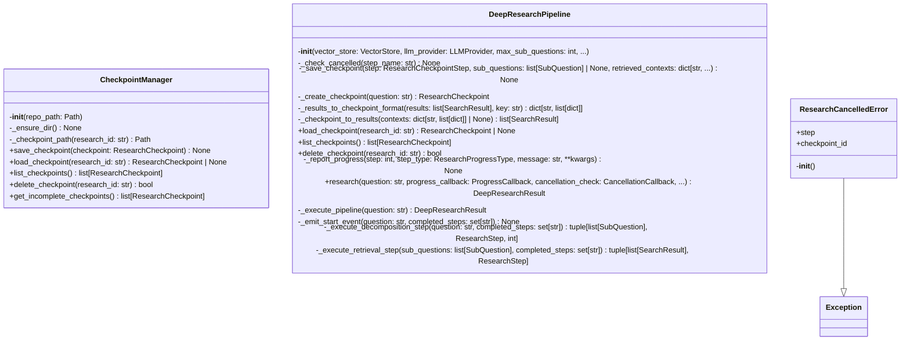

# File Overview

This file, `src/local_deepwiki/core/deep_research.py`, implements the core logic for performing deep research using a structured pipeline. It orchestrates multiple steps including question decomposition, retrieval, gap analysis, and synthesis, while managing checkpoints for resumable research sessions. The pipeline integrates with vector stores for retrieval and LLM providers for generating responses.

Dependencies include:
- `asyncio` for asynchronous operations
- `json` for checkpoint serialization
- `uuid` for generating unique IDs
- `local_deepwiki.core.rate_limiter` for rate limiting
- `local_deepwiki.core.vectorstore` for vector-based retrieval
- `local_deepwiki.events` for emitting events
- `local_deepwiki.logging` for logging
- `local_deepwiki.models` for data models and types

# Classes

## ResearchCancelledError

Raised when a deep research operation is cancelled.

### Constructor Parameters
- `step` (str): The step during which the cancellation occurred. Defaults to "unknown".
- `checkpoint_id` (str | None): ID of the checkpoint, if applicable.

## CheckpointManager

Manages research checkpoints on disk, enabling resumable research sessions.

### Constructor Parameters
- `repo_path` (Path): Path to the repository where checkpoints are stored.

### Methods
- `__init__(self, repo_path: Path)`  
  Initialize the checkpoint manager.

- `_ensure_dir(self)`  
  Ensure the checkpoint directory exists.

- `_checkpoint_path(self, research_id: str) -> Path`  
  Get the path to a checkpoint file.

- `save_checkpoint(self, checkpoint: ResearchCheckpoint) -> None`  
  Save a checkpoint to disk.

- `load_checkpoint(self, research_id: str) -> ResearchCheckpoint | None`  
  Load a checkpoint from disk.

- `list_checkpoints(self) -> list[ResearchCheckpoint]`  
  List all checkpoints for this repository.

- `delete_checkpoint(self, research_id: str) -> bool`  
  Delete a checkpoint.

- `get_incomplete_checkpoints(self) -> list[ResearchCheckpoint]`  
  Get all incomplete (non-complete, non-error) checkpoints.

## DeepResearchPipeline

The main class orchestrating the deep research process, including decomposition, retrieval, gap analysis, and synthesis steps.

### Constructor Parameters
- `vector_store` (VectorStore): The vector store used for retrieval.
- `llm_provider` (LLMProvider): The LLM provider for generating responses.
- `max_sub_questions` (int): Maximum number of sub-questions to generate. Defaults to 4.
- `chunks_per_subquestion` (int): Number of chunks to retrieve per sub-question. Defaults to 5.
- `max_total_chunks` (int): Maximum number of chunks to process overall. Defaults to 30.
- `max_follow_up_queries` (int): Maximum number of follow-up queries. Defaults to 3.
- `synthesis_temperature` (float): Temperature for synthesis LLM calls. Defaults to 0.5.
- `synthesis_max_tokens` (int): Maximum tokens for synthesis. Defaults to 4096.
- `decomposition_prompt` (str | None): Custom prompt for decomposition. Defaults to None.
- `gap_analysis_prompt` (str | None): Custom prompt for gap analysis. Defaults to None.
- `synthesis_prompt` (str | None): Custom prompt for synthesis. Defaults to None.
- `repo_path` (Path | None): Path to the repository for checkpointing. Defaults to None.

### Methods
- `__init__(self, vector_store: VectorStore, llm_provider: LLMProvider, max_sub_questions: int = 4, chunks_per_subquestion: int = 5, max_total_chunks: int = 30, max_follow_up_queries: int = 3, synthesis_temperature: float = 0.5, synthesis_max_tokens: int = 4096, decomposition_prompt: str | None = None, gap_analysis_prompt: str | None = None, synthesis_prompt: str | None = None, repo_path: Path | None = None)`  
  Initialize the deep research pipeline.

- `_check_cancelled(self, step_name: str) -> None`  
  Check if research was cancelled and raise if so.

- `_save_checkpoint(self, checkpoint: ResearchCheckpoint) -> None`  
  Save the current checkpoint.

- `_create_checkpoint(self, research_id: str, step: ResearchCheckpointStep) -> ResearchCheckpoint`  
  Create a new checkpoint.

- `_results_to_checkpoint_format(self, results: DeepResearchResult) -> dict[str, Any]`  
  Convert research results to checkpoint format.

- `_checkpoint_to_results(self, checkpoint: ResearchCheckpoint) -> DeepResearchResult`  
  Convert checkpoint data back to research results.

- `load_checkpoint(self, research_id: str) -> ResearchCheckpoint | None`  
  Load a checkpoint from disk.

- `list_checkpoints(self) -> list[ResearchCheckpoint]`  
  List all checkpoints for this repository.

- `delete_checkpoint(self, research_id: str) -> bool`  
  Delete a checkpoint.

- `_report_progress(self, step: ResearchCheckpointStep, progress: int, total: int) -> None`  
  Report progress to the event emitter.

- `research(self, question: str, cancellation_event: asyncio.Event | None = None) -> DeepResearchResult`  
  Execute the deep research pipeline for a given question.

- `_execute_pipeline(self, question: str, cancellation_event: asyncio.Event | None = None) -> DeepResearchResult`  
  Execute the full research pipeline.

- `_emit_start_event(self, question: str) -> None`  
  Emit a start event for the research.

- `_execute_decomposition_step(self, question: str) -> list[str]`  
  Execute the decomposition step.

- `_execute_retrieval_step(self, subquestions: list[str]) -> list[CodeChunk]`  
  Execute the retrieval step.

- `_execute_gap_analysis_step(self, chunks: list[CodeChunk]) -> list[CodeChunk]`  
  Execute the gap analysis step.

- `_execute_follow_up_step(self, question: str, chunks: list[CodeChunk]) -> list[CodeChunk]`  
  Execute the follow-up step.

- `_finalize_research(self, chunks: list[CodeChunk], question: str) -> DeepResearchResult`  
  Finalize the research and return results.

- `_step_decompose(self, question: str) -> list[str]`  
  Decompose the question into sub-questions.

- `_step_retrieve(self, subquestions: list[str]) -> list[CodeChunk]`  
  Retrieve relevant chunks for each sub-question.

- `_step_gap_analysis(self, chunks: list[CodeChunk]) -> list[CodeChunk]`  
  Perform gap analysis on the retrieved chunks.

- `_step_follow_up_retrieve(self, question: str, chunks: list[CodeChunk]) -> list[CodeChunk]`  
  Perform follow-up retrieval.

- `_prepare_results_for_synthesis(self, chunks: list[CodeChunk]) -> str`  
  Prepare chunks for synthesis.

- `_step_synthesize(self, question: str, chunks: list[CodeChunk]) -> str`  
  Synthesize the final answer.

- `_decompose_question(self, question: str) -> list[str]`  
  Decompose a question into sub-questions.

- `_parse_decomposition_response(self, response: str) -> list[str]`  
  Parse the decomposition response.

- `_parallel_retrieve(self, subquestions: list[str]) -> list[CodeChunk]`  
  Retrieve chunks in parallel.

# Functions

## _search_result_to_dict

Converts a search result to a dictionary.

## _dict_to_search_result

Converts a dictionary back to a search result.

## cancel_research

Cancels a research session.

## list_research_checkpoints

Lists all research checkpoints.

## get_research_checkpoint

Retrieves a specific research checkpoint.

## delete_research_checkpoint

Deletes a specific research checkpoint.

# Integration

This file integrates with:
- `local_deepwiki.core.rate_limiter` for managing rate limits
- `local_deepwiki.core.vectorstore` for retrieving relevant chunks
- `local_deepwiki.events` for emitting research-related events
- `local_deepwiki.logging` for logging research steps and events
- `local_deepwiki.models` for data models used throughout the pipeline

The functions `cancel_research`, `list_research_checkpoints`, `get_research_checkpoint`, and `delete_research_checkpoint` are called by external components to manage research sessions.

# Usage Examples

## Initialize and Run Research

```python
from local_deepwiki.core.deep_research import DeepResearchPipeline
from local_deepwiki.core.vectorstore import VectorStore
from local_deepwiki.core.llm_provider import LLMProvider

# Assume vector_store and llm_provider are initialized
pipeline = DeepResearchPipeline(
    vector_store=vector_store,
    llm_provider=llm_provider,
    max_sub_questions=3,
    chunks_per_subquestion=4,
    max_total_chunks=20
)

# Run research
result = pipeline.research("What is the impact of climate change?")
```

## Manage Checkpoints

```python
# List checkpoints
checkpoints = pipeline.list_checkpoints()

# Load a specific checkpoint
checkpoint = pipeline.load_checkpoint("some-research-id")

# Delete a checkpoint
deleted = pipeline.delete_checkpoint("some-research-id")
```

## API Reference

### class `ResearchCancelledError`

**Inherits from:** `Exception`

Raised when a deep research operation is cancelled.

**Methods:**


<details>
<summary>View Source (lines 43-52) | <a href="https://github.com/UrbanDiver/local-deepwiki-mcp/blob/main/src/local_deepwiki/core/deep_research.py#L43-L52">GitHub</a></summary>

```python
class ResearchCancelledError(Exception):
    """Raised when a deep research operation is cancelled."""

    def __init__(self, step: str = "unknown", checkpoint_id: str | None = None):
        self.step = step
        self.checkpoint_id = checkpoint_id
        msg = f"Research cancelled during {step}"
        if checkpoint_id:
            msg += f" (checkpoint: {checkpoint_id})"
        super().__init__(msg)
```

</details>

#### `__init__`

```python
def __init__(step: str = "unknown", checkpoint_id: str | None = None)
```


| Parameter | Type | Default | Description |
|-----------|------|---------|-------------|
| `step` | `str` | `"unknown"` | - |
| `checkpoint_id` | `str | None` | `None` | - |


<details>
<summary>View Source (lines 43-52) | <a href="https://github.com/UrbanDiver/local-deepwiki-mcp/blob/main/src/local_deepwiki/core/deep_research.py#L43-L52">GitHub</a></summary>

```python
class ResearchCancelledError(Exception):
    """Raised when a deep research operation is cancelled."""

    def __init__(self, step: str = "unknown", checkpoint_id: str | None = None):
        self.step = step
        self.checkpoint_id = checkpoint_id
        msg = f"Research cancelled during {step}"
        if checkpoint_id:
            msg += f" (checkpoint: {checkpoint_id})"
        super().__init__(msg)
```

</details>

### class `CheckpointManager`

Manages saving and loading research checkpoints.  Checkpoints are stored as JSON files in the .deepwiki/research_checkpoints directory within each repository.

**Methods:**


<details>
<summary>View Source (lines 55-167) | <a href="https://github.com/UrbanDiver/local-deepwiki-mcp/blob/main/src/local_deepwiki/core/deep_research.py#L55-L167">GitHub</a></summary>

```python
class CheckpointManager:
    # Methods: __init__, _ensure_dir, _checkpoint_path, save_checkpoint, load_checkpoint, list_checkpoints, delete_checkpoint, get_incomplete_checkpoints
```

</details>

#### `__init__`

```python
def __init__(repo_path: Path)
```

Initialize the checkpoint manager.


| Parameter | Type | Default | Description |
|-----------|------|---------|-------------|
| `repo_path` | `Path` | - | Path to the repository. |


<details>
<summary>View Source (lines 62-69) | <a href="https://github.com/UrbanDiver/local-deepwiki-mcp/blob/main/src/local_deepwiki/core/deep_research.py#L62-L69">GitHub</a></summary>

```python
def __init__(self, repo_path: Path):
        """Initialize the checkpoint manager.

        Args:
            repo_path: Path to the repository.
        """
        self.repo_path = repo_path
        self.checkpoint_dir = repo_path / ".deepwiki" / "research_checkpoints"
```

</details>

#### `save_checkpoint`

```python
def save_checkpoint(checkpoint: ResearchCheckpoint) -> None
```

Save a checkpoint to disk.


| Parameter | Type | Default | Description |
|-----------|------|---------|-------------|
| `checkpoint` | `ResearchCheckpoint` | - | The checkpoint to save. |


<details>
<summary>View Source (lines 86-95) | <a href="https://github.com/UrbanDiver/local-deepwiki-mcp/blob/main/src/local_deepwiki/core/deep_research.py#L86-L95">GitHub</a></summary>

```python
def save_checkpoint(self, checkpoint: ResearchCheckpoint) -> None:
        """Save a checkpoint to disk.

        Args:
            checkpoint: The checkpoint to save.
        """
        self._ensure_dir()
        checkpoint_path = self._checkpoint_path(checkpoint.research_id)
        checkpoint_path.write_text(checkpoint.model_dump_json(indent=2))
        logger.debug(f"Saved checkpoint {checkpoint.research_id} at step {checkpoint.current_step}")
```

</details>

#### `load_checkpoint`

```python
def load_checkpoint(research_id: str) -> ResearchCheckpoint | None
```

Load a checkpoint from disk.


| Parameter | Type | Default | Description |
|-----------|------|---------|-------------|
| `research_id` | `str` | - | The research session ID. |


<details>
<summary>View Source (lines 97-115) | <a href="https://github.com/UrbanDiver/local-deepwiki-mcp/blob/main/src/local_deepwiki/core/deep_research.py#L97-L115">GitHub</a></summary>

```python
def load_checkpoint(self, research_id: str) -> ResearchCheckpoint | None:
        """Load a checkpoint from disk.

        Args:
            research_id: The research session ID.

        Returns:
            The loaded checkpoint, or None if not found.
        """
        checkpoint_path = self._checkpoint_path(research_id)
        if not checkpoint_path.exists():
            return None

        try:
            data = json.loads(checkpoint_path.read_text())
            return ResearchCheckpoint.model_validate(data)
        except (json.JSONDecodeError, ValueError) as e:
            logger.warning(f"Failed to load checkpoint {research_id}: {e}")
            return None
```

</details>

#### `list_checkpoints`

```python
def list_checkpoints() -> list[ResearchCheckpoint]
```

List all checkpoints for this repository.


<details>
<summary>View Source (lines 117-137) | <a href="https://github.com/UrbanDiver/local-deepwiki-mcp/blob/main/src/local_deepwiki/core/deep_research.py#L117-L137">GitHub</a></summary>

```python
def list_checkpoints(self) -> list[ResearchCheckpoint]:
        """List all checkpoints for this repository.

        Returns:
            List of checkpoints, sorted by updated_at descending.
        """
        if not self.checkpoint_dir.exists():
            return []

        checkpoints = []
        for path in self.checkpoint_dir.glob("*.json"):
            try:
                data = json.loads(path.read_text())
                checkpoint = ResearchCheckpoint.model_validate(data)
                checkpoints.append(checkpoint)
            except (json.JSONDecodeError, ValueError) as e:
                logger.warning(f"Failed to load checkpoint {path.name}: {e}")
                continue

        # Sort by updated_at descending (most recent first)
        return sorted(checkpoints, key=lambda c: c.updated_at, reverse=True)
```

</details>

#### `delete_checkpoint`

```python
def delete_checkpoint(research_id: str) -> bool
```

Delete a checkpoint.


| Parameter | Type | Default | Description |
|-----------|------|---------|-------------|
| `research_id` | `str` | - | The research session ID. |


<details>
<summary>View Source (lines 139-153) | <a href="https://github.com/UrbanDiver/local-deepwiki-mcp/blob/main/src/local_deepwiki/core/deep_research.py#L139-L153">GitHub</a></summary>

```python
def delete_checkpoint(self, research_id: str) -> bool:
        """Delete a checkpoint.

        Args:
            research_id: The research session ID.

        Returns:
            True if deleted, False if not found.
        """
        checkpoint_path = self._checkpoint_path(research_id)
        if checkpoint_path.exists():
            checkpoint_path.unlink()
            logger.debug(f"Deleted checkpoint {research_id}")
            return True
        return False
```

</details>

#### `get_incomplete_checkpoints`

```python
def get_incomplete_checkpoints() -> list[ResearchCheckpoint]
```

Get all incomplete (non-complete, non-error) checkpoints.


<details>
<summary>View Source (lines 155-167) | <a href="https://github.com/UrbanDiver/local-deepwiki-mcp/blob/main/src/local_deepwiki/core/deep_research.py#L155-L167">GitHub</a></summary>

```python
def get_incomplete_checkpoints(self) -> list[ResearchCheckpoint]:
        """Get all incomplete (non-complete, non-error) checkpoints.

        Returns:
            List of incomplete checkpoints.
        """
        return [
            c for c in self.list_checkpoints()
            if c.current_step not in (
                ResearchCheckpointStep.COMPLETE,
                ResearchCheckpointStep.ERROR,
            )
        ]
```

</details>

### class `DeepResearchPipeline`

Multi-step research pipeline for complex codebase questions.  This pipeline performs: 1. Query decomposition - breaks question into sub-questions 2. Parallel retrieval - searches for each sub-question 3. Gap analysis - identifies missing context 4. Follow-up retrieval - targeted search for gaps 5. Synthesis - combines context into comprehensive answer

**Methods:**


<details>
<summary>View Source (lines 300-1468) | <a href="https://github.com/UrbanDiver/local-deepwiki-mcp/blob/main/src/local_deepwiki/core/deep_research.py#L300-L1468">GitHub</a></summary>

```python
class DeepResearchPipeline:
    # Methods: __init__, _check_cancelled, _save_checkpoint, _create_checkpoint, _results_to_checkpoint_format, _checkpoint_to_results, load_checkpoint, list_checkpoints, delete_checkpoint, _report_progress, research, _execute_pipeline, _emit_start_event, _execute_decomposition_step, _execute_retrieval_step, _execute_gap_analysis_step, _execute_follow_up_step, _finalize_research, _step_decompose, _step_retrieve, _step_gap_analysis, _step_follow_up_retrieve, _prepare_results_for_synthesis, _step_synthesize, _decompose_question, _parse_decomposition_response, _parallel_retrieve, _analyze_gaps, _build_context_summary, _parse_gap_analysis_response, _targeted_retrieve, _deduplicate_results, _synthesize, _build_full_context, _build_sources
```

</details>

#### `__init__`

```python
def __init__(vector_store: VectorStore, llm_provider: LLMProvider, max_sub_questions: int = 4, chunks_per_subquestion: int = 5, max_total_chunks: int = 30, max_follow_up_queries: int = 3, synthesis_temperature: float = 0.5, synthesis_max_tokens: int = 4096, decomposition_prompt: str | None = None, gap_analysis_prompt: str | None = None, synthesis_prompt: str | None = None, repo_path: Path | None = None)
```

Initialize the deep research pipeline.


| Parameter | Type | Default | Description |
|-----------|------|---------|-------------|
| `vector_store` | `VectorStore` | - | Vector store for semantic search. |
| `llm_provider` | `LLMProvider` | - | LLM provider for reasoning. |
| `max_sub_questions` | `int` | `4` | Maximum sub-questions to generate. |
| `chunks_per_subquestion` | `int` | `5` | Chunks to retrieve per sub-question. |
| `max_total_chunks` | `int` | `30` | Maximum total chunks to use in synthesis. |
| `max_follow_up_queries` | `int` | `3` | Maximum follow-up queries in gap analysis. |
| `synthesis_temperature` | `float` | `0.5` | LLM temperature for synthesis (0.0-2.0). |
| `synthesis_max_tokens` | `int` | `4096` | Maximum tokens in synthesis response. |
| `decomposition_prompt` | `str | None` | `None` | Custom system prompt for decomposition (optional). |
| `gap_analysis_prompt` | `str | None` | `None` | Custom system prompt for gap analysis (optional). |
| `synthesis_prompt` | `str | None` | `None` | Custom system prompt for synthesis (optional). |
| `repo_path` | `Path | None` | `None` | Path to the repository (required for checkpointing). |


<details>
<summary>View Source (lines 311-366) | <a href="https://github.com/UrbanDiver/local-deepwiki-mcp/blob/main/src/local_deepwiki/core/deep_research.py#L311-L366">GitHub</a></summary>

```python
def __init__(
        self,
        vector_store: VectorStore,
        llm_provider: LLMProvider,
        max_sub_questions: int = 4,
        chunks_per_subquestion: int = 5,
        max_total_chunks: int = 30,
        max_follow_up_queries: int = 3,
        synthesis_temperature: float = 0.5,
        synthesis_max_tokens: int = 4096,
        decomposition_prompt: str | None = None,
        gap_analysis_prompt: str | None = None,
        synthesis_prompt: str | None = None,
        repo_path: Path | None = None,
    ):
        """Initialize the deep research pipeline.

        Args:
            vector_store: Vector store for semantic search.
            llm_provider: LLM provider for reasoning.
            max_sub_questions: Maximum sub-questions to generate.
            chunks_per_subquestion: Chunks to retrieve per sub-question.
            max_total_chunks: Maximum total chunks to use in synthesis.
            max_follow_up_queries: Maximum follow-up queries in gap analysis.
            synthesis_temperature: LLM temperature for synthesis (0.0-2.0).
            synthesis_max_tokens: Maximum tokens in synthesis response.
            decomposition_prompt: Custom system prompt for decomposition (optional).
            gap_analysis_prompt: Custom system prompt for gap analysis (optional).
            synthesis_prompt: Custom system prompt for synthesis (optional).
            repo_path: Path to the repository (required for checkpointing).
        """
        self.vector_store = vector_store
        self.llm = llm_provider
        self.max_sub_questions = max_sub_questions
        self.chunks_per_subquestion = chunks_per_subquestion
        self.max_total_chunks = max_total_chunks
        self.max_follow_up_queries = max_follow_up_queries
        self.synthesis_temperature = synthesis_temperature
        self.synthesis_max_tokens = synthesis_max_tokens

        # Use custom prompts if provided, otherwise use defaults
        self.decomposition_prompt = decomposition_prompt or DECOMPOSITION_SYSTEM_PROMPT
        self.gap_analysis_prompt = gap_analysis_prompt or GAP_ANALYSIS_SYSTEM_PROMPT
        self.synthesis_prompt = synthesis_prompt or SYNTHESIS_SYSTEM_PROMPT

        # Repository path for checkpointing
        self.repo_path = repo_path
        self._checkpoint_manager: CheckpointManager | None = None
        if repo_path:
            self._checkpoint_manager = CheckpointManager(repo_path)

        # Runtime state (set during research())
        self._progress_callback: ProgressCallback = None
        self._cancellation_check: CancellationCallback = None
        self._current_checkpoint: ResearchCheckpoint | None = None
        self._cancellation_event: asyncio.Event | None = None
```

</details>

#### `load_checkpoint`

```python
def load_checkpoint(research_id: str) -> ResearchCheckpoint | None
```

Load a checkpoint by ID.


| Parameter | Type | Default | Description |
|-----------|------|---------|-------------|
| `research_id` | `str` | - | The research session ID. |


<details>
<summary>View Source (lines 499-510) | <a href="https://github.com/UrbanDiver/local-deepwiki-mcp/blob/main/src/local_deepwiki/core/deep_research.py#L499-L510">GitHub</a></summary>

```python
def load_checkpoint(self, research_id: str) -> ResearchCheckpoint | None:
        """Load a checkpoint by ID.

        Args:
            research_id: The research session ID.

        Returns:
            The loaded checkpoint, or None if not found.
        """
        if not self._checkpoint_manager:
            return None
        return self._checkpoint_manager.load_checkpoint(research_id)
```

</details>

#### `list_checkpoints`

```python
def list_checkpoints() -> list[ResearchCheckpoint]
```

List all checkpoints for this repository.


<details>
<summary>View Source (lines 512-520) | <a href="https://github.com/UrbanDiver/local-deepwiki-mcp/blob/main/src/local_deepwiki/core/deep_research.py#L512-L520">GitHub</a></summary>

```python
def list_checkpoints(self) -> list[ResearchCheckpoint]:
        """List all checkpoints for this repository.

        Returns:
            List of checkpoints.
        """
        if not self._checkpoint_manager:
            return []
        return self._checkpoint_manager.list_checkpoints()
```

</details>

#### `delete_checkpoint`

```python
def delete_checkpoint(research_id: str) -> bool
```

Delete a checkpoint.


| Parameter | Type | Default | Description |
|-----------|------|---------|-------------|
| `research_id` | `str` | - | The research session ID. |


<details>
<summary>View Source (lines 522-533) | <a href="https://github.com/UrbanDiver/local-deepwiki-mcp/blob/main/src/local_deepwiki/core/deep_research.py#L522-L533">GitHub</a></summary>

```python
def delete_checkpoint(self, research_id: str) -> bool:
        """Delete a checkpoint.

        Args:
            research_id: The research session ID.

        Returns:
            True if deleted, False if not found.
        """
        if not self._checkpoint_manager:
            return False
        return self._checkpoint_manager.delete_checkpoint(research_id)
```

</details>

#### `research`

```python
async def research(question: str, progress_callback: ProgressCallback = None, cancellation_check: CancellationCallback = None, resume_id: str | None = None, cancellation_event: asyncio.Event | None = None) -> DeepResearchResult
```

Execute the full research pipeline.


| Parameter | Type | Default | Description |
|-----------|------|---------|-------------|
| `question` | `str` | - | The complex question to research. |
| `progress_callback` | `ProgressCallback` | `None` | Optional async callback for progress updates. |
| `cancellation_check` | `CancellationCallback` | `None` | Optional callback that returns True if cancelled. |
| `resume_id` | `str | None` | `None` | Optional checkpoint ID to resume from. |
| `cancellation_event` | `asyncio.Event | None` | `None` | Optional asyncio.Event for cancellation signaling. |


---


<details>
<summary>View Source (lines 560-634) | <a href="https://github.com/UrbanDiver/local-deepwiki-mcp/blob/main/src/local_deepwiki/core/deep_research.py#L560-L634">GitHub</a></summary>

```python
async def research(
        self,
        question: str,
        progress_callback: ProgressCallback = None,
        cancellation_check: CancellationCallback = None,
        resume_id: str | None = None,
        cancellation_event: asyncio.Event | None = None,
    ) -> DeepResearchResult:
        """Execute the full research pipeline.

        Args:
            question: The complex question to research.
            progress_callback: Optional async callback for progress updates.
            cancellation_check: Optional callback that returns True if cancelled.
            resume_id: Optional checkpoint ID to resume from.
            cancellation_event: Optional asyncio.Event for cancellation signaling.

        Returns:
            DeepResearchResult with answer, sources, and reasoning trace.

        Raises:
            ResearchCancelledError: If the operation is cancelled.
        """
        # Store callbacks for use by helper methods
        self._progress_callback = progress_callback
        self._cancellation_check = cancellation_check
        self._cancellation_event = cancellation_event

        # Handle resume or create new checkpoint
        if resume_id and self._checkpoint_manager:
            checkpoint = self._checkpoint_manager.load_checkpoint(resume_id)
            if checkpoint:
                self._current_checkpoint = checkpoint
                logger.info(f"Resuming research {resume_id} from step {checkpoint.current_step}")
            else:
                logger.warning(f"Checkpoint {resume_id} not found, starting fresh")
                self._current_checkpoint = self._create_checkpoint(question)
        elif self._checkpoint_manager:
            self._current_checkpoint = self._create_checkpoint(question)
        else:
            self._current_checkpoint = None

        try:
            result = await self._execute_pipeline(question)

            # Clean up checkpoint on successful completion
            if self._current_checkpoint and self._checkpoint_manager:
                self._checkpoint_manager.delete_checkpoint(self._current_checkpoint.research_id)

            return result

        except ResearchCancelledError:
            # Save checkpoint on cancellation
            if self._current_checkpoint:
                self._save_checkpoint(
                    step=ResearchCheckpointStep.CANCELLED,
                    error="Research was cancelled by user",
                )
            raise

        except Exception as e:
            # Save checkpoint on error
            if self._current_checkpoint:
                self._save_checkpoint(
                    step=ResearchCheckpointStep.ERROR,
                    error=str(e),
                )
            raise

        finally:
            # Clear callbacks after execution
            self._progress_callback = None
            self._cancellation_check = None
            self._cancellation_event = None
            self._current_checkpoint = None
```

</details>

### Functions

#### `cancel_research`

```python
def cancel_research(repo_path: Path, research_id: str) -> ResearchCheckpoint | None
```

Cancel a research operation and save its checkpoint.  This is a synchronous utility function that can be called to mark a research session as cancelled. The checkpoint will be preserved for potential resumption later.


| Parameter | Type | Default | Description |
|-----------|------|---------|-------------|
| `repo_path` | `Path` | - | Path to the repository. |
| `research_id` | `str` | - | The research session ID to cancel. |

**Returns:** `ResearchCheckpoint | None`


<details>
<summary>View Source (lines 1471-1499) | <a href="https://github.com/UrbanDiver/local-deepwiki-mcp/blob/main/src/local_deepwiki/core/deep_research.py#L1471-L1499">GitHub</a></summary>

```python
def cancel_research(repo_path: Path, research_id: str) -> ResearchCheckpoint | None:
    """Cancel a research operation and save its checkpoint.

    This is a synchronous utility function that can be called to mark
    a research session as cancelled. The checkpoint will be preserved
    for potential resumption later.

    Args:
        repo_path: Path to the repository.
        research_id: The research session ID to cancel.

    Returns:
        The cancelled checkpoint, or None if not found.
    """
    manager = CheckpointManager(repo_path)
    checkpoint = manager.load_checkpoint(research_id)

    if not checkpoint:
        return None

    # Mark as cancelled
    checkpoint.current_step = ResearchCheckpointStep.CANCELLED
    checkpoint.updated_at = time.time()
    checkpoint.error = "Research was cancelled by user"

    manager.save_checkpoint(checkpoint)
    logger.info(f"Cancelled research {research_id}")

    return checkpoint
```

</details>

#### `list_research_checkpoints`

```python
def list_research_checkpoints(repo_path: Path) -> list[ResearchCheckpoint]
```

List all research checkpoints for a repository.


| Parameter | Type | Default | Description |
|-----------|------|---------|-------------|
| `repo_path` | `Path` | - | Path to the repository. |

**Returns:** `list[ResearchCheckpoint]`


<details>
<summary>View Source (lines 1502-1512) | <a href="https://github.com/UrbanDiver/local-deepwiki-mcp/blob/main/src/local_deepwiki/core/deep_research.py#L1502-L1512">GitHub</a></summary>

```python
def list_research_checkpoints(repo_path: Path) -> list[ResearchCheckpoint]:
    """List all research checkpoints for a repository.

    Args:
        repo_path: Path to the repository.

    Returns:
        List of checkpoints, sorted by updated_at descending.
    """
    manager = CheckpointManager(repo_path)
    return manager.list_checkpoints()
```

</details>

#### `get_research_checkpoint`

```python
def get_research_checkpoint(repo_path: Path, research_id: str) -> ResearchCheckpoint | None
```

Get a specific research checkpoint.


| Parameter | Type | Default | Description |
|-----------|------|---------|-------------|
| `repo_path` | `Path` | - | Path to the repository. |
| `research_id` | `str` | - | The research session ID. |

**Returns:** `ResearchCheckpoint | None`


<details>
<summary>View Source (lines 1515-1526) | <a href="https://github.com/UrbanDiver/local-deepwiki-mcp/blob/main/src/local_deepwiki/core/deep_research.py#L1515-L1526">GitHub</a></summary>

```python
def get_research_checkpoint(repo_path: Path, research_id: str) -> ResearchCheckpoint | None:
    """Get a specific research checkpoint.

    Args:
        repo_path: Path to the repository.
        research_id: The research session ID.

    Returns:
        The checkpoint, or None if not found.
    """
    manager = CheckpointManager(repo_path)
    return manager.load_checkpoint(research_id)
```

</details>

#### `delete_research_checkpoint`

```python
def delete_research_checkpoint(repo_path: Path, research_id: str) -> bool
```

Delete a research checkpoint.


| Parameter | Type | Default | Description |
|-----------|------|---------|-------------|
| `repo_path` | `Path` | - | Path to the repository. |
| `research_id` | `str` | - | The research session ID. |

**Returns:** `bool`


<details>
<summary>View Source (lines 1529-1540) | <a href="https://github.com/UrbanDiver/local-deepwiki-mcp/blob/main/src/local_deepwiki/core/deep_research.py#L1529-L1540">GitHub</a></summary>

```python
def delete_research_checkpoint(repo_path: Path, research_id: str) -> bool:
    """Delete a research checkpoint.

    Args:
        repo_path: Path to the repository.
        research_id: The research session ID.

    Returns:
        True if deleted, False if not found.
    """
    manager = CheckpointManager(repo_path)
    return manager.delete_checkpoint(research_id)
```

</details>

## Class Diagram


```mermaid
classDiagram
    class CheckpointManager {
        -__init__(repo_path: Path)
        -_ensure_dir() None
        -_checkpoint_path(research_id: str) Path
        +save_checkpoint(checkpoint: ResearchCheckpoint) None
        +load_checkpoint(research_id: str) ResearchCheckpoint | None
        +list_checkpoints() list[ResearchCheckpoint]
        +delete_checkpoint(research_id: str) bool
        +get_incomplete_checkpoints() list[ResearchCheckpoint]
    }
    class DeepResearchPipeline {
        -__init__(vector_store: VectorStore, llm_provider: LLMProvider, max_sub_questions: int, ...)
        -_check_cancelled(step_name: str) None
        -_save_checkpoint(step: ResearchCheckpointStep, sub_questions: list[SubQuestion] | None, retrieved_contexts: dict[str, ...) None
        -_create_checkpoint(question: str) ResearchCheckpoint
        -_results_to_checkpoint_format(results: list[SearchResult], key: str) dict[str, list[dict]]
        -_checkpoint_to_results(contexts: dict[str, list[dict]] | None) list[SearchResult]
        +load_checkpoint(research_id: str) ResearchCheckpoint | None
        +list_checkpoints() list[ResearchCheckpoint]
        +delete_checkpoint(research_id: str) bool
        -_report_progress(step: int, step_type: ResearchProgressType, message: str, **kwargs) None
        +research(question: str, progress_callback: ProgressCallback, cancellation_check: CancellationCallback, ...) DeepResearchResult
        -_execute_pipeline(question: str) DeepResearchResult
        -_emit_start_event(question: str, completed_steps: set[str]) None
        -_execute_decomposition_step(question: str, completed_steps: set[str]) tuple[list[SubQuestion], ResearchStep, int]
        -_execute_retrieval_step(sub_questions: list[SubQuestion], completed_steps: set[str]) tuple[list[SearchResult], ResearchStep]
    }
    class ResearchCancelledError {
        +step
        +checkpoint_id
        -__init__()
    }
    ResearchCancelledError --|> Exception
```

## Call Graph


```mermaid
flowchart TD
    N0[CheckpointManager]
    N1[CheckpointManager.list_chec...]
    N2[CheckpointManager.load_chec...]
    N3[CheckpointManager.save_chec...]
    N4[DeepResearchPipeline._analy...]
    N5[DeepResearchPipeline._execu...]
    N6[DeepResearchPipeline._execu...]
    N7[DeepResearchPipeline._execu...]
    N8[DeepResearchPipeline._final...]
    N9[DeepResearchPipeline._parse...]
    N10[DeepResearchPipeline._step_...]
    N11[DeepResearchPipeline._step_...]
    N12[DeepResearchPipeline._step_...]
    N13[DeepResearchPipeline._step_...]
    N14[DeepResearchPipeline._step_...]
    N15[DeepResearchPipeline.research]
    N16[ResearchStep]
    N17[_check_cancelled]
    N18[_checkpoint_path]
    N19[_dict_to_search_result]
    N20[_report_progress]
    N21[_save_checkpoint]
    N22[cancel_research]
    N23[delete_checkpoint]
    N24[exists]
    N25[list_checkpoints]
    N26[load_checkpoint]
    N27[loads]
    N28[search]
    N29[time]
    N22 --> N0
    N22 --> N26
    N22 --> N29
    N3 --> N18
    N2 --> N18
    N2 --> N24
    N2 --> N27
    N1 --> N24
    N1 --> N27
    N15 --> N26
    N15 --> N23
    N15 --> N21
    N7 --> N16
    N7 --> N21
    N5 --> N19
    N5 --> N16
    N5 --> N21
    N8 --> N21
    N8 --> N20
    N10 --> N17
    N10 --> N29
    N10 --> N16
    N10 --> N20
    N13 --> N17
    N13 --> N29
    N13 --> N16
    N13 --> N20
    N12 --> N17
    N12 --> N29
    N12 --> N16
    N12 --> N20
    N11 --> N17
    N11 --> N29
    N11 --> N16
    N11 --> N20
    N14 --> N20
    N14 --> N17
    N14 --> N29
    N14 --> N16
    N9 --> N28
    N9 --> N27
    classDef func fill:#e1f5fe
    class N0,N16,N17,N18,N19,N20,N21,N22,N23,N24,N25,N26,N27,N28,N29 func
    classDef method fill:#fff3e0
    class N1,N2,N3,N4,N5,N6,N7,N8,N9,N10,N11,N12,N13,N14,N15 method
```

## Used By

Functions and methods in this file and their callers:

- **`CheckpointManager`**: called by `DeepResearchPipeline.__init__`, `cancel_research`, `delete_research_checkpoint`, `get_research_checkpoint`, `list_research_checkpoints`
- **`ChunkType`**: called by `_dict_to_search_result`
- **`CodeChunk`**: called by `_dict_to_search_result`
- **`DeepResearchResult`**: called by `DeepResearchPipeline._finalize_research`
- **`Language`**: called by `_dict_to_search_result`
- **`ResearchCancelledError`**: called by `DeepResearchPipeline._check_cancelled`
- **`ResearchCheckpoint`**: called by `DeepResearchPipeline._create_checkpoint`
- **`ResearchProgress`**: called by `DeepResearchPipeline._report_progress`
- **`ResearchStep`**: called by `DeepResearchPipeline._execute_decomposition_step`, `DeepResearchPipeline._execute_follow_up_step`, `DeepResearchPipeline._execute_gap_analysis_step`, `DeepResearchPipeline._execute_retrieval_step`, `DeepResearchPipeline._step_decompose`, `DeepResearchPipeline._step_follow_up_retrieve`, `DeepResearchPipeline._step_gap_analysis`, `DeepResearchPipeline._step_retrieve`, `DeepResearchPipeline._step_synthesize`
- **`SearchResult`**: called by `_dict_to_search_result`
- **`SourceReference`**: called by `DeepResearchPipeline._build_sources`
- **`SubQuestion`**: called by `DeepResearchPipeline._parse_decomposition_response`
- **`__init__`**: called by `ResearchCancelledError.__init__`
- **`_analyze_gaps`**: called by `DeepResearchPipeline._step_gap_analysis`
- **`_build_context_summary`**: called by `DeepResearchPipeline._analyze_gaps`
- **`_build_full_context`**: called by `DeepResearchPipeline._synthesize`
- **`_build_sources`**: called by `DeepResearchPipeline._finalize_research`
- **`_cancellation_check`**: called by `DeepResearchPipeline._check_cancelled`
- **`_check_cancelled`**: called by `DeepResearchPipeline._step_decompose`, `DeepResearchPipeline._step_follow_up_retrieve`, `DeepResearchPipeline._step_gap_analysis`, `DeepResearchPipeline._step_retrieve`, `DeepResearchPipeline._step_synthesize`
- **`_checkpoint_path`**: called by `CheckpointManager.delete_checkpoint`, `CheckpointManager.load_checkpoint`, `CheckpointManager.save_checkpoint`
- **`_checkpoint_to_results`**: called by `DeepResearchPipeline._execute_retrieval_step`
- **`_create_checkpoint`**: called by `DeepResearchPipeline.research`
- **`_decompose_question`**: called by `DeepResearchPipeline._step_decompose`
- **`_deduplicate_results`**: called by `DeepResearchPipeline._prepare_results_for_synthesis`
- **`_dict_to_search_result`**: called by `DeepResearchPipeline._checkpoint_to_results`, `DeepResearchPipeline._execute_follow_up_step`
- **`_emit_start_event`**: called by `DeepResearchPipeline._execute_pipeline`
- **`_ensure_dir`**: called by `CheckpointManager.save_checkpoint`
- **`_execute_decomposition_step`**: called by `DeepResearchPipeline._execute_pipeline`
- **`_execute_follow_up_step`**: called by `DeepResearchPipeline._execute_pipeline`
- **`_execute_gap_analysis_step`**: called by `DeepResearchPipeline._execute_pipeline`
- **`_execute_pipeline`**: called by `DeepResearchPipeline.research`
- **`_execute_retrieval_step`**: called by `DeepResearchPipeline._execute_pipeline`
- **`_finalize_research`**: called by `DeepResearchPipeline._execute_pipeline`
- **`_parallel_retrieve`**: called by `DeepResearchPipeline._step_retrieve`
- **`_parse_decomposition_response`**: called by `DeepResearchPipeline._decompose_question`
- **`_parse_gap_analysis_response`**: called by `DeepResearchPipeline._analyze_gaps`
- **`_prepare_results_for_synthesis`**: called by `DeepResearchPipeline._execute_pipeline`
- **`_progress_callback`**: called by `DeepResearchPipeline._report_progress`
- **`_report_progress`**: called by `DeepResearchPipeline._emit_start_event`, `DeepResearchPipeline._finalize_research`, `DeepResearchPipeline._step_decompose`, `DeepResearchPipeline._step_follow_up_retrieve`, `DeepResearchPipeline._step_gap_analysis`, `DeepResearchPipeline._step_retrieve`, `DeepResearchPipeline._step_synthesize`
- **`_results_to_checkpoint_format`**: called by `DeepResearchPipeline._execute_retrieval_step`
- **`_save_checkpoint`**: called by `DeepResearchPipeline._execute_decomposition_step`, `DeepResearchPipeline._execute_follow_up_step`, `DeepResearchPipeline._execute_gap_analysis_step`, `DeepResearchPipeline._execute_retrieval_step`, `DeepResearchPipeline._finalize_research`, `DeepResearchPipeline.research`
- **`_search_result_to_dict`**: called by `DeepResearchPipeline._execute_follow_up_step`, `DeepResearchPipeline._results_to_checkpoint_format`
- **`_step_decompose`**: called by `DeepResearchPipeline._execute_decomposition_step`
- **`_step_follow_up_retrieve`**: called by `DeepResearchPipeline._execute_follow_up_step`
- **`_step_gap_analysis`**: called by `DeepResearchPipeline._execute_gap_analysis_step`
- **`_step_retrieve`**: called by `DeepResearchPipeline._execute_retrieval_step`
- **`_step_synthesize`**: called by `DeepResearchPipeline._execute_pipeline`
- **`_synthesize`**: called by `DeepResearchPipeline._step_synthesize`
- **`_targeted_retrieve`**: called by `DeepResearchPipeline._step_follow_up_retrieve`
- **`delete_checkpoint`**: called by `DeepResearchPipeline.delete_checkpoint`, `DeepResearchPipeline.research`, `delete_research_checkpoint`
- **`emit`**: called by `DeepResearchPipeline._emit_start_event`, `DeepResearchPipeline._finalize_research`, `DeepResearchPipeline._step_decompose`
- **`exists`**: called by `CheckpointManager.delete_checkpoint`, `CheckpointManager.list_checkpoints`, `CheckpointManager.load_checkpoint`
- **`gather`**: called by `DeepResearchPipeline._parallel_retrieve`, `DeepResearchPipeline._targeted_retrieve`
- **`generate`**: called by `DeepResearchPipeline._analyze_gaps`, `DeepResearchPipeline._decompose_question`, `DeepResearchPipeline._synthesize`
- **`get_event_emitter`**: called by `DeepResearchPipeline._emit_start_event`, `DeepResearchPipeline._finalize_research`, `DeepResearchPipeline._step_decompose`
- **`get_rate_limiter`**: called by `DeepResearchPipeline._analyze_gaps`, `DeepResearchPipeline._decompose_question`, `DeepResearchPipeline._synthesize`
- **`glob`**: called by `CheckpointManager.list_checkpoints`
- **`group`**: called by `DeepResearchPipeline._parse_decomposition_response`, `DeepResearchPipeline._parse_gap_analysis_response`
- **`is_set`**: called by `DeepResearchPipeline._check_cancelled`
- **`list_checkpoints`**: called by `CheckpointManager.get_incomplete_checkpoints`, `DeepResearchPipeline.list_checkpoints`, `list_research_checkpoints`
- **`load_checkpoint`**: called by `DeepResearchPipeline.load_checkpoint`, `DeepResearchPipeline.research`, `cancel_research`, `get_research_checkpoint`
- **`loads`**: called by `CheckpointManager.list_checkpoints`, `CheckpointManager.load_checkpoint`, `DeepResearchPipeline._parse_decomposition_response`, `DeepResearchPipeline._parse_gap_analysis_response`
- **`mkdir`**: called by `CheckpointManager._ensure_dir`
- **`model_dump_json`**: called by `CheckpointManager.save_checkpoint`
- **`model_validate`**: called by `CheckpointManager.list_checkpoints`, `CheckpointManager.load_checkpoint`
- **`read_text`**: called by `CheckpointManager.list_checkpoints`, `CheckpointManager.load_checkpoint`
- **`save_checkpoint`**: called by `DeepResearchPipeline._save_checkpoint`, `cancel_research`
- **`search`**: called by `DeepResearchPipeline._parallel_retrieve`, `DeepResearchPipeline._parse_decomposition_response`, `DeepResearchPipeline._parse_gap_analysis_response`, `DeepResearchPipeline._targeted_retrieve`
- **`time`**: called by `DeepResearchPipeline._create_checkpoint`, `DeepResearchPipeline._save_checkpoint`, `DeepResearchPipeline._step_decompose`, `DeepResearchPipeline._step_follow_up_retrieve`, `DeepResearchPipeline._step_gap_analysis`, `DeepResearchPipeline._step_retrieve`, `DeepResearchPipeline._step_synthesize`, `cancel_research`
- **`unlink`**: called by `CheckpointManager.delete_checkpoint`
- **`uuid4`**: called by `DeepResearchPipeline._create_checkpoint`
- **`write_text`**: called by `CheckpointManager.save_checkpoint`

## Usage Examples

*Examples extracted from test files*

### Test decomposition of a simple question

From `test_deep_research.py::TestDeepResearchPipelineDecomposition::test_decompose_simple_question`:

```python
pipeline = DeepResearchPipeline(
    vector_store=mock_vector_store,
    llm_provider=llm,
)

result = await pipeline.research("How does authentication work?")

assert len(result.sub_questions) == 2
assert result.sub_questions[0].category == "structure"
```

### Test decomposition of a simple question

From `test_deep_research.py::TestDeepResearchPipelineDecomposition::test_decompose_simple_question`:

```python
llm = MockLLMProvider(
    responses=[
        json.dumps(
            {
                "sub_questions": [
                    {"question": "What is the structure?", "category": "structure"},
                    {"question": "How does it flow?", "category": "flow"},
                ]
            }
        ),
        json.dumps({"gaps": [], "follow_up_queries": []}),
        "Final answer",
    ]
)

pipeline = DeepResearchPipeline(
    vector_store=mock_vector_store,
    llm_provider=llm,
)

result = await pipeline.research("How does authentication work?")

assert len(result.sub_questions) == 2
assert result.sub_questions[0].category == "structure"
assert result.sub_questions[1].category == "flow"
```

### Test that decomposition limits sub-questions to max

From `test_deep_research.py::TestDeepResearchPipelineDecomposition::test_decompose_limits_sub_questions`:

```python
pipeline = DeepResearchPipeline(
    vector_store=mock_vector_store,
    llm_provider=llm,
    max_sub_questions=4,
)

result = await pipeline.research("Complex question")

assert len(result.sub_questions) <= 4
```

### Test that decomposition limits sub-questions to max

From `test_deep_research.py::TestDeepResearchPipelineDecomposition::test_decompose_limits_sub_questions`:

```python
llm = MockLLMProvider(
    responses=[
        json.dumps(
            {
                "sub_questions": [
                    {"question": f"Q{i}?", "category": "structure"} for i in range(10)
                ]
            }
        ),
        json.dumps({"gaps": [], "follow_up_queries": []}),
        "Final answer",
    ]
)

pipeline = DeepResearchPipeline(
    vector_store=mock_vector_store,
    llm_provider=llm,
    max_sub_questions=4,
)

result = await pipeline.research("Complex question")

assert len(result.sub_questions) <= 4
```

### Test error returned for empty question

From `test_deep_research.py::TestHandleDeepResearch::test_returns_error_for_empty_question`:

```python
from local_deepwiki.handlers import handle_deep_research

result = await handle_deep_research(
    {
        "repo_path": "/some/path",
        "question": "",
    }
)

assert len(result) == 1
assert "Error" in result[0].text
```


## Last Modified

| Entity | Type | Author | Date | Commit |
|--------|------|--------|------|--------|
| `DeepResearchPipeline` | class | Brian Breidenbach | 1 week ago | `89d3399` Add code quality improvemen... |
| `_execute_pipeline` | method | Brian Breidenbach | 1 week ago | `89d3399` Add code quality improvemen... |
| `_emit_start_event` | method | Brian Breidenbach | 1 week ago | `89d3399` Add code quality improvemen... |
| `_execute_decomposition_step` | method | Brian Breidenbach | 1 week ago | `89d3399` Add code quality improvemen... |
| `_execute_retrieval_step` | method | Brian Breidenbach | 1 week ago | `89d3399` Add code quality improvemen... |
| `_execute_gap_analysis_step` | method | Brian Breidenbach | 1 week ago | `89d3399` Add code quality improvemen... |
| `_execute_follow_up_step` | method | Brian Breidenbach | 1 week ago | `89d3399` Add code quality improvemen... |
| `_finalize_research` | method | Brian Breidenbach | 1 week ago | `89d3399` Add code quality improvemen... |
| `_decompose_question` | method | Brian Breidenbach | 1 week ago | `89d3399` Add code quality improvemen... |
| `_analyze_gaps` | method | Brian Breidenbach | 1 week ago | `89d3399` Add code quality improvemen... |
| `_synthesize` | method | Brian Breidenbach | 1 week ago | `89d3399` Add code quality improvemen... |
| `ResearchCancelledError` | class | Brian Breidenbach | 1 week ago | `e899c6c` Add three high-value enhanc... |
| `CheckpointManager` | class | Brian Breidenbach | 1 week ago | `e899c6c` Add three high-value enhanc... |
| `__init__` | method | Brian Breidenbach | 1 week ago | `e899c6c` Add three high-value enhanc... |
| `_ensure_dir` | method | Brian Breidenbach | 1 week ago | `e899c6c` Add three high-value enhanc... |
| `_checkpoint_path` | method | Brian Breidenbach | 1 week ago | `e899c6c` Add three high-value enhanc... |
| `save_checkpoint` | method | Brian Breidenbach | 1 week ago | `e899c6c` Add three high-value enhanc... |
| `load_checkpoint` | method | Brian Breidenbach | 1 week ago | `e899c6c` Add three high-value enhanc... |
| `list_checkpoints` | method | Brian Breidenbach | 1 week ago | `e899c6c` Add three high-value enhanc... |
| `delete_checkpoint` | method | Brian Breidenbach | 1 week ago | `e899c6c` Add three high-value enhanc... |
| `get_incomplete_checkpoints` | method | Brian Breidenbach | 1 week ago | `e899c6c` Add three high-value enhanc... |
| `__init__` | method | Brian Breidenbach | 1 week ago | `e899c6c` Add three high-value enhanc... |
| `_check_cancelled` | method | Brian Breidenbach | 1 week ago | `e899c6c` Add three high-value enhanc... |
| `_save_checkpoint` | method | Brian Breidenbach | 1 week ago | `e899c6c` Add three high-value enhanc... |
| `_create_checkpoint` | method | Brian Breidenbach | 1 week ago | `e899c6c` Add three high-value enhanc... |
| `_results_to_checkpoint_format` | method | Brian Breidenbach | 1 week ago | `e899c6c` Add three high-value enhanc... |
| `_checkpoint_to_results` | method | Brian Breidenbach | 1 week ago | `e899c6c` Add three high-value enhanc... |
| `load_checkpoint` | method | Brian Breidenbach | 1 week ago | `e899c6c` Add three high-value enhanc... |
| `list_checkpoints` | method | Brian Breidenbach | 1 week ago | `e899c6c` Add three high-value enhanc... |
| `delete_checkpoint` | method | Brian Breidenbach | 1 week ago | `e899c6c` Add three high-value enhanc... |
| `research` | method | Brian Breidenbach | 1 week ago | `e899c6c` Add three high-value enhanc... |
| `_search_result_to_dict` | function | Brian Breidenbach | 1 week ago | `e899c6c` Add three high-value enhanc... |
| `_dict_to_search_result` | function | Brian Breidenbach | 1 week ago | `e899c6c` Add three high-value enhanc... |
| `cancel_research` | function | Brian Breidenbach | 1 week ago | `e899c6c` Add three high-value enhanc... |
| `list_research_checkpoints` | function | Brian Breidenbach | 1 week ago | `e899c6c` Add three high-value enhanc... |
| `get_research_checkpoint` | function | Brian Breidenbach | 1 week ago | `e899c6c` Add three high-value enhanc... |
| `delete_research_checkpoint` | function | Brian Breidenbach | 1 week ago | `e899c6c` Add three high-value enhanc... |
| `_step_decompose` | method | Brian Breidenbach | 1 week ago | `a0b2f83` Integrate event system into... |
| `_parse_decomposition_response` | method | Brian Breidenbach | 3 weeks ago | `0d91a70` Apply Python best practices... |
| `_parallel_retrieve` | method | Brian Breidenbach | 3 weeks ago | `0d91a70` Apply Python best practices... |
| `_targeted_retrieve` | method | Brian Breidenbach | 3 weeks ago | `0d91a70` Apply Python best practices... |
| `_deduplicate_results` | method | Brian Breidenbach | 3 weeks ago | `0d91a70` Apply Python best practices... |
| `_report_progress` | method | Brian Breidenbach | 3 weeks ago | `43b1ef2` Refactor: Extract step meth... |
| `_step_retrieve` | method | Brian Breidenbach | 3 weeks ago | `43b1ef2` Refactor: Extract step meth... |
| `_step_gap_analysis` | method | Brian Breidenbach | 3 weeks ago | `43b1ef2` Refactor: Extract step meth... |
| `_step_follow_up_retrieve` | method | Brian Breidenbach | 3 weeks ago | `43b1ef2` Refactor: Extract step meth... |
| `_prepare_results_for_synthesis` | method | Brian Breidenbach | 3 weeks ago | `43b1ef2` Refactor: Extract step meth... |
| `_step_synthesize` | method | Brian Breidenbach | 3 weeks ago | `43b1ef2` Refactor: Extract step meth... |
| `_build_context_summary` | method | Brian Breidenbach | 3 weeks ago | `2d97082` Add Deep Research mode for ... |
| `_parse_gap_analysis_response` | method | Brian Breidenbach | 3 weeks ago | `2d97082` Add Deep Research mode for ... |
| `_build_full_context` | method | Brian Breidenbach | 3 weeks ago | `2d97082` Add Deep Research mode for ... |
| `_build_sources` | method | Brian Breidenbach | 3 weeks ago | `2d97082` Add Deep Research mode for ... |

## Additional Source Code

Source code for functions and methods not listed in the API Reference above.

#### `_ensure_dir`

<details>
<summary>View Source (lines 71-73) | <a href="https://github.com/UrbanDiver/local-deepwiki-mcp/blob/main/src/local_deepwiki/core/deep_research.py#L71-L73">GitHub</a></summary>

```python
def _ensure_dir(self) -> None:
        """Ensure the checkpoint directory exists."""
        self.checkpoint_dir.mkdir(parents=True, exist_ok=True)
```

</details>


#### `_checkpoint_path`

<details>
<summary>View Source (lines 75-84) | <a href="https://github.com/UrbanDiver/local-deepwiki-mcp/blob/main/src/local_deepwiki/core/deep_research.py#L75-L84">GitHub</a></summary>

```python
def _checkpoint_path(self, research_id: str) -> Path:
        """Get the path to a checkpoint file.

        Args:
            research_id: The research session ID.

        Returns:
            Path to the checkpoint JSON file.
        """
        return self.checkpoint_dir / f"{research_id}.json"
```

</details>


#### `_search_result_to_dict`

<details>
<summary>View Source (lines 170-195) | <a href="https://github.com/UrbanDiver/local-deepwiki-mcp/blob/main/src/local_deepwiki/core/deep_research.py#L170-L195">GitHub</a></summary>

```python
def _search_result_to_dict(result: SearchResult) -> dict[str, Any]:
    """Convert a SearchResult to a serializable dictionary.

    Args:
        result: The search result to convert.

    Returns:
        Dictionary representation suitable for JSON serialization.
    """
    return {
        "chunk": {
            "id": result.chunk.id,
            "file_path": result.chunk.file_path,
            "language": result.chunk.language.value,
            "chunk_type": result.chunk.chunk_type.value,
            "name": result.chunk.name,
            "content": result.chunk.content,
            "start_line": result.chunk.start_line,
            "end_line": result.chunk.end_line,
            "docstring": result.chunk.docstring,
            "parent_name": result.chunk.parent_name,
            "metadata": result.chunk.metadata,
        },
        "score": result.score,
        "highlights": result.highlights,
    }
```

</details>


#### `_dict_to_search_result`

<details>
<summary>View Source (lines 198-225) | <a href="https://github.com/UrbanDiver/local-deepwiki-mcp/blob/main/src/local_deepwiki/core/deep_research.py#L198-L225">GitHub</a></summary>

```python
def _dict_to_search_result(data: dict[str, Any]) -> SearchResult:
    """Convert a dictionary back to a SearchResult.

    Args:
        data: Dictionary representation of a search result.

    Returns:
        Reconstructed SearchResult object.
    """
    chunk_data = data["chunk"]
    chunk = CodeChunk(
        id=chunk_data["id"],
        file_path=chunk_data["file_path"],
        language=Language(chunk_data["language"]),
        chunk_type=ChunkType(chunk_data["chunk_type"]),
        name=chunk_data.get("name"),
        content=chunk_data["content"],
        start_line=chunk_data["start_line"],
        end_line=chunk_data["end_line"],
        docstring=chunk_data.get("docstring"),
        parent_name=chunk_data.get("parent_name"),
        metadata=chunk_data.get("metadata", {}),
    )
    return SearchResult(
        chunk=chunk,
        score=data["score"],
        highlights=data.get("highlights", []),
    )
```

</details>


#### `_check_cancelled`

<details>
<summary>View Source (lines 368-387) | <a href="https://github.com/UrbanDiver/local-deepwiki-mcp/blob/main/src/local_deepwiki/core/deep_research.py#L368-L387">GitHub</a></summary>

```python
def _check_cancelled(self, step_name: str) -> None:
        """Check if research was cancelled and raise if so.

        Args:
            step_name: Name of the current step for error message.

        Raises:
            ResearchCancelledError: If cancellation was requested.
        """
        # Check the cancellation event first
        if self._cancellation_event and self._cancellation_event.is_set():
            logger.info(f"Research cancelled via event during {step_name}")
            checkpoint_id = self._current_checkpoint.research_id if self._current_checkpoint else None
            raise ResearchCancelledError(step_name, checkpoint_id)

        # Then check the callback
        if self._cancellation_check and self._cancellation_check():
            logger.info(f"Research cancelled during {step_name}")
            checkpoint_id = self._current_checkpoint.research_id if self._current_checkpoint else None
            raise ResearchCancelledError(step_name, checkpoint_id)
```

</details>


#### `_save_checkpoint`

<details>
<summary>View Source (lines 389-436) | <a href="https://github.com/UrbanDiver/local-deepwiki-mcp/blob/main/src/local_deepwiki/core/deep_research.py#L389-L436">GitHub</a></summary>

```python
def _save_checkpoint(
        self,
        step: ResearchCheckpointStep,
        sub_questions: list[SubQuestion] | None = None,
        retrieved_contexts: dict[str, list[dict]] | None = None,
        follow_up_queries: list[str] | None = None,
        follow_up_contexts: list[dict] | None = None,
        partial_synthesis: str | None = None,
        error: str | None = None,
        completed_step: str | None = None,
    ) -> None:
        """Save the current research state as a checkpoint.

        Args:
            step: The current step in the research process.
            sub_questions: Decomposed sub-questions (if available).
            retrieved_contexts: Retrieved context data (if available).
            follow_up_queries: Follow-up queries from gap analysis (if available).
            follow_up_contexts: Follow-up retrieval contexts (if available).
            partial_synthesis: Partial synthesis result (if available).
            error: Error message if failed.
            completed_step: Name of the step that was just completed.
        """
        if not self._checkpoint_manager or not self._current_checkpoint:
            return

        checkpoint = self._current_checkpoint

        # Update checkpoint fields
        checkpoint.current_step = step
        checkpoint.updated_at = time.time()

        if sub_questions is not None:
            checkpoint.sub_questions = sub_questions
        if retrieved_contexts is not None:
            checkpoint.retrieved_contexts = retrieved_contexts
        if follow_up_queries is not None:
            checkpoint.follow_up_queries = follow_up_queries
        if follow_up_contexts is not None:
            checkpoint.follow_up_contexts = follow_up_contexts
        if partial_synthesis is not None:
            checkpoint.partial_synthesis = partial_synthesis
        if error is not None:
            checkpoint.error = error
        if completed_step and completed_step not in checkpoint.completed_steps:
            checkpoint.completed_steps.append(completed_step)

        self._checkpoint_manager.save_checkpoint(checkpoint)
```

</details>


#### `_create_checkpoint`

<details>
<summary>View Source (lines 438-456) | <a href="https://github.com/UrbanDiver/local-deepwiki-mcp/blob/main/src/local_deepwiki/core/deep_research.py#L438-L456">GitHub</a></summary>

```python
def _create_checkpoint(self, question: str) -> ResearchCheckpoint:
        """Create a new checkpoint for a research session.

        Args:
            question: The research question.

        Returns:
            A new ResearchCheckpoint object.
        """
        now = time.time()
        return ResearchCheckpoint(
            research_id=str(uuid.uuid4()),
            question=question,
            repo_path=str(self.repo_path) if self.repo_path else "",
            started_at=now,
            updated_at=now,
            current_step=ResearchCheckpointStep.DECOMPOSITION,
            completed_steps=[],
        )
```

</details>


#### `_results_to_checkpoint_format`

<details>
<summary>View Source (lines 458-472) | <a href="https://github.com/UrbanDiver/local-deepwiki-mcp/blob/main/src/local_deepwiki/core/deep_research.py#L458-L472">GitHub</a></summary>

```python
def _results_to_checkpoint_format(
        self,
        results: list[SearchResult],
        key: str = "default",
    ) -> dict[str, list[dict]]:
        """Convert search results to checkpoint-serializable format.

        Args:
            results: List of search results.
            key: Key to use in the dictionary.

        Returns:
            Dictionary mapping key to list of serialized results.
        """
        return {key: [_search_result_to_dict(r) for r in results]}
```

</details>


#### `_checkpoint_to_results`

<details>
<summary>View Source (lines 474-497) | <a href="https://github.com/UrbanDiver/local-deepwiki-mcp/blob/main/src/local_deepwiki/core/deep_research.py#L474-L497">GitHub</a></summary>

```python
def _checkpoint_to_results(
        self,
        contexts: dict[str, list[dict]] | None,
    ) -> list[SearchResult]:
        """Convert checkpoint context data back to SearchResults.

        Args:
            contexts: Dictionary of serialized contexts from checkpoint.

        Returns:
            List of reconstructed SearchResult objects.
        """
        if not contexts:
            return []

        results = []
        for key_results in contexts.values():
            for data in key_results:
                try:
                    results.append(_dict_to_search_result(data))
                except (KeyError, ValueError) as e:
                    logger.warning(f"Failed to restore search result: {e}")
                    continue
        return results
```

</details>


#### `_report_progress`

<details>
<summary>View Source (lines 535-558) | <a href="https://github.com/UrbanDiver/local-deepwiki-mcp/blob/main/src/local_deepwiki/core/deep_research.py#L535-L558">GitHub</a></summary>

```python
async def _report_progress(
        self,
        step: int,
        step_type: ResearchProgressType,
        message: str,
        **kwargs,
    ) -> None:
        """Report progress to the callback if set.

        Args:
            step: Current step number.
            step_type: Type of progress event.
            message: Human-readable progress message.
            **kwargs: Additional progress data.
        """
        if self._progress_callback:
            await self._progress_callback(
                ResearchProgress(
                    step=step,
                    step_type=step_type,
                    message=message,
                    **kwargs,
                )
            )
```

</details>


#### `_execute_pipeline`

<details>
<summary>View Source (lines 636-696) | <a href="https://github.com/UrbanDiver/local-deepwiki-mcp/blob/main/src/local_deepwiki/core/deep_research.py#L636-L696">GitHub</a></summary>

```python
async def _execute_pipeline(self, question: str) -> DeepResearchResult:
        """Execute the research pipeline steps.

        This is a high-level orchestrator that coordinates the research steps,
        delegating checkpoint restoration and step execution to helper methods.

        Args:
            question: The complex question to research.

        Returns:
            DeepResearchResult with answer, sources, and reasoning trace.
        """
        trace: list[ResearchStep] = []
        llm_calls = 0

        # Determine what steps to skip based on checkpoint
        checkpoint = self._current_checkpoint
        completed_steps = set(checkpoint.completed_steps) if checkpoint else set()

        # Emit start event and report progress
        await self._emit_start_event(question, completed_steps)

        # Step 1: Decompose question
        sub_questions, step, calls = await self._execute_decomposition_step(
            question, completed_steps
        )
        trace.append(step)
        llm_calls += calls

        # Step 2: Parallel retrieval
        initial_results, step = await self._execute_retrieval_step(
            sub_questions, completed_steps
        )
        trace.append(step)

        # Step 3: Gap analysis
        follow_up_queries, step, calls = await self._execute_gap_analysis_step(
            question, sub_questions, initial_results, completed_steps
        )
        trace.append(step)
        llm_calls += calls

        # Step 4: Follow-up retrieval (if needed)
        additional_results, follow_up_step = await self._execute_follow_up_step(
            follow_up_queries, len(initial_results), completed_steps
        )
        if follow_up_step:
            trace.append(follow_up_step)

        # Prepare results for synthesis
        all_results = self._prepare_results_for_synthesis(initial_results, additional_results)

        # Step 5: Synthesis
        answer, step, calls = await self._step_synthesize(question, sub_questions, all_results)
        trace.append(step)
        llm_calls += calls

        # Finalize and build result
        return await self._finalize_research(
            question, answer, sub_questions, all_results, trace, llm_calls, step.duration_ms
        )
```

</details>


#### `_emit_start_event`

<details>
<summary>View Source (lines 698-723) | <a href="https://github.com/UrbanDiver/local-deepwiki-mcp/blob/main/src/local_deepwiki/core/deep_research.py#L698-L723">GitHub</a></summary>

```python
async def _emit_start_event(
        self,
        question: str,
        completed_steps: set[str],
    ) -> None:
        """Emit the research start event and report initial progress.

        Args:
            question: The research question.
            completed_steps: Set of already completed step names.
        """
        emitter = get_event_emitter()
        is_resuming = bool(completed_steps)

        if not is_resuming:
            await emitter.emit(
                EventType.RESEARCH_START,
                {"question": question},
            )
            await self._report_progress(0, ResearchProgressType.STARTED, "Starting deep research...")
        else:
            await self._report_progress(
                0,
                ResearchProgressType.STARTED,
                f"Resuming deep research from checkpoint (completed: {', '.join(completed_steps)})",
            )
```

</details>


#### `_execute_decomposition_step`

<details>
<summary>View Source (lines 725-760) | <a href="https://github.com/UrbanDiver/local-deepwiki-mcp/blob/main/src/local_deepwiki/core/deep_research.py#L725-L760">GitHub</a></summary>

```python
async def _execute_decomposition_step(
        self,
        question: str,
        completed_steps: set[str],
    ) -> tuple[list[SubQuestion], ResearchStep, int]:
        """Execute or restore the decomposition step.

        Args:
            question: The research question.
            completed_steps: Set of already completed step names.

        Returns:
            Tuple of (sub_questions, trace_step, llm_call_count).
        """
        checkpoint = self._current_checkpoint

        if "decomposition" in completed_steps and checkpoint and checkpoint.sub_questions:
            # Restore from checkpoint
            sub_questions = checkpoint.sub_questions
            logger.info(f"Restored {len(sub_questions)} sub-questions from checkpoint")
            step = ResearchStep(
                step_type=ResearchStepType.DECOMPOSITION,
                description=f"Restored {len(sub_questions)} sub-questions from checkpoint",
                duration_ms=0,
            )
            return sub_questions, step, 0

        # Execute the step
        sub_questions, step, calls = await self._step_decompose(question)
        # Save checkpoint after decomposition
        self._save_checkpoint(
            step=ResearchCheckpointStep.RETRIEVAL,
            sub_questions=sub_questions,
            completed_step="decomposition",
        )
        return sub_questions, step, calls
```

</details>


#### `_execute_retrieval_step`

<details>
<summary>View Source (lines 762-797) | <a href="https://github.com/UrbanDiver/local-deepwiki-mcp/blob/main/src/local_deepwiki/core/deep_research.py#L762-L797">GitHub</a></summary>

```python
async def _execute_retrieval_step(
        self,
        sub_questions: list[SubQuestion],
        completed_steps: set[str],
    ) -> tuple[list[SearchResult], ResearchStep]:
        """Execute or restore the initial retrieval step.

        Args:
            sub_questions: The decomposed sub-questions.
            completed_steps: Set of already completed step names.

        Returns:
            Tuple of (search_results, trace_step).
        """
        checkpoint = self._current_checkpoint

        if "retrieval" in completed_steps and checkpoint and checkpoint.retrieved_contexts:
            # Restore from checkpoint
            initial_results = self._checkpoint_to_results(checkpoint.retrieved_contexts)
            logger.info(f"Restored {len(initial_results)} chunks from checkpoint")
            step = ResearchStep(
                step_type=ResearchStepType.RETRIEVAL,
                description=f"Restored {len(initial_results)} chunks from checkpoint",
                duration_ms=0,
            )
            return initial_results, step

        # Execute the step
        initial_results, step = await self._step_retrieve(sub_questions)
        # Save checkpoint after retrieval
        self._save_checkpoint(
            step=ResearchCheckpointStep.GAP_ANALYSIS,
            retrieved_contexts=self._results_to_checkpoint_format(initial_results, "initial"),
            completed_step="retrieval",
        )
        return initial_results, step
```

</details>


#### `_execute_gap_analysis_step`

<details>
<summary>View Source (lines 799-840) | <a href="https://github.com/UrbanDiver/local-deepwiki-mcp/blob/main/src/local_deepwiki/core/deep_research.py#L799-L840">GitHub</a></summary>

```python
async def _execute_gap_analysis_step(
        self,
        question: str,
        sub_questions: list[SubQuestion],
        initial_results: list[SearchResult],
        completed_steps: set[str],
    ) -> tuple[list[str], ResearchStep, int]:
        """Execute or restore the gap analysis step.

        Args:
            question: The original research question.
            sub_questions: The decomposed sub-questions.
            initial_results: Results from initial retrieval.
            completed_steps: Set of already completed step names.

        Returns:
            Tuple of (follow_up_queries, trace_step, llm_call_count).
        """
        checkpoint = self._current_checkpoint

        if "gap_analysis" in completed_steps and checkpoint and checkpoint.follow_up_queries is not None:
            # Restore from checkpoint
            follow_up_queries = checkpoint.follow_up_queries
            logger.info(f"Restored {len(follow_up_queries)} follow-up queries from checkpoint")
            step = ResearchStep(
                step_type=ResearchStepType.GAP_ANALYSIS,
                description=f"Restored {len(follow_up_queries)} follow-up queries from checkpoint",
                duration_ms=0,
            )
            return follow_up_queries, step, 0

        # Execute the step
        follow_up_queries, step, calls = await self._step_gap_analysis(
            question, sub_questions, initial_results
        )
        # Save checkpoint after gap analysis
        self._save_checkpoint(
            step=ResearchCheckpointStep.FOLLOW_UP_RETRIEVAL if follow_up_queries else ResearchCheckpointStep.SYNTHESIS,
            follow_up_queries=follow_up_queries,
            completed_step="gap_analysis",
        )
        return follow_up_queries, step, calls
```

</details>


#### `_execute_follow_up_step`

<details>
<summary>View Source (lines 842-884) | <a href="https://github.com/UrbanDiver/local-deepwiki-mcp/blob/main/src/local_deepwiki/core/deep_research.py#L842-L884">GitHub</a></summary>

```python
async def _execute_follow_up_step(
        self,
        follow_up_queries: list[str],
        initial_count: int,
        completed_steps: set[str],
    ) -> tuple[list[SearchResult], ResearchStep | None]:
        """Execute or restore the follow-up retrieval step.

        Args:
            follow_up_queries: Queries from gap analysis.
            initial_count: Number of results from initial retrieval.
            completed_steps: Set of already completed step names.

        Returns:
            Tuple of (additional_results, trace_step or None if no follow-up needed).
        """
        if not follow_up_queries:
            return [], None

        checkpoint = self._current_checkpoint

        if "follow_up_retrieval" in completed_steps and checkpoint and checkpoint.follow_up_contexts:
            # Restore from checkpoint
            additional_results = [_dict_to_search_result(d) for d in checkpoint.follow_up_contexts]
            logger.info(f"Restored {len(additional_results)} follow-up chunks from checkpoint")
            step = ResearchStep(
                step_type=ResearchStepType.RETRIEVAL,
                description=f"Restored {len(additional_results)} follow-up chunks from checkpoint",
                duration_ms=0,
            )
            return additional_results, step

        # Execute the step
        additional_results, step = await self._step_follow_up_retrieve(
            follow_up_queries, initial_count
        )
        # Save checkpoint after follow-up retrieval
        self._save_checkpoint(
            step=ResearchCheckpointStep.SYNTHESIS,
            follow_up_contexts=[_search_result_to_dict(r) for r in additional_results],
            completed_step="follow_up_retrieval",
        )
        return additional_results, step
```

</details>


#### `_finalize_research`

<details>
<summary>View Source (lines 886-946) | <a href="https://github.com/UrbanDiver/local-deepwiki-mcp/blob/main/src/local_deepwiki/core/deep_research.py#L886-L946">GitHub</a></summary>

```python
async def _finalize_research(
        self,
        question: str,
        answer: str,
        sub_questions: list[SubQuestion],
        all_results: list[SearchResult],
        trace: list[ResearchStep],
        llm_calls: int,
        synthesis_duration_ms: int,
    ) -> DeepResearchResult:
        """Finalize the research by saving checkpoint and emitting completion events.

        Args:
            question: The original research question.
            answer: The synthesized answer.
            sub_questions: The decomposed sub-questions.
            all_results: All retrieved search results.
            trace: The reasoning trace.
            llm_calls: Total number of LLM calls made.
            synthesis_duration_ms: Duration of the synthesis step.

        Returns:
            The final DeepResearchResult.
        """
        # Mark checkpoint as complete
        self._save_checkpoint(
            step=ResearchCheckpointStep.COMPLETE,
            partial_synthesis=answer,
            completed_step="synthesis",
        )

        # Report completion
        await self._report_progress(
            5,
            ResearchProgressType.COMPLETE,
            f"Research complete: {len(all_results)} chunks analyzed, {llm_calls} LLM calls",
            chunks_retrieved=len(all_results),
            duration_ms=synthesis_duration_ms,
        )

        # Emit RESEARCH_COMPLETE event
        emitter = get_event_emitter()
        await emitter.emit(
            EventType.RESEARCH_COMPLETE,
            {
                "question": question,
                "sub_question_count": len(sub_questions),
                "chunks_analyzed": len(all_results),
                "llm_calls": llm_calls,
            },
        )

        return DeepResearchResult(
            question=question,
            answer=answer,
            sub_questions=sub_questions,
            sources=self._build_sources(all_results),
            reasoning_trace=trace,
            total_chunks_analyzed=len(all_results),
            total_llm_calls=llm_calls,
        )
```

</details>


#### `_step_decompose`

<details>
<summary>View Source (lines 948-987) | <a href="https://github.com/UrbanDiver/local-deepwiki-mcp/blob/main/src/local_deepwiki/core/deep_research.py#L948-L987">GitHub</a></summary>

```python
async def _step_decompose(self, question: str) -> tuple[list[SubQuestion], ResearchStep, int]:
        """Execute the decomposition step.

        Returns:
            Tuple of (sub_questions, trace_step, llm_call_count).
        """
        self._check_cancelled("decomposition")
        start_time = time.time()

        sub_questions = await self._decompose_question(question)
        duration_ms = int((time.time() - start_time) * 1000)

        step = ResearchStep(
            step_type=ResearchStepType.DECOMPOSITION,
            description=f"Decomposed into {len(sub_questions)} sub-questions",
            duration_ms=duration_ms,
        )

        logger.info(f"Decomposed question into {len(sub_questions)} sub-questions")

        # Emit RESEARCH_QUERY events for each sub-question
        emitter = get_event_emitter()
        for sq in sub_questions:
            await emitter.emit(
                EventType.RESEARCH_QUERY,
                {
                    "question": sq.question,
                    "category": sq.category,
                },
            )

        await self._report_progress(
            1,
            ResearchProgressType.DECOMPOSITION_COMPLETE,
            f"Decomposed into {len(sub_questions)} sub-questions",
            sub_questions=sub_questions,
            duration_ms=duration_ms,
        )

        return sub_questions, step, 1
```

</details>


#### `_step_retrieve`

<details>
<summary>View Source (lines 989-1018) | <a href="https://github.com/UrbanDiver/local-deepwiki-mcp/blob/main/src/local_deepwiki/core/deep_research.py#L989-L1018">GitHub</a></summary>

```python
async def _step_retrieve(
        self, sub_questions: list[SubQuestion]
    ) -> tuple[list[SearchResult], ResearchStep]:
        """Execute the initial retrieval step.

        Returns:
            Tuple of (search_results, trace_step).
        """
        self._check_cancelled("retrieval")
        start_time = time.time()

        results = await self._parallel_retrieve(sub_questions)
        duration_ms = int((time.time() - start_time) * 1000)

        step = ResearchStep(
            step_type=ResearchStepType.RETRIEVAL,
            description=f"Retrieved {len(results)} code chunks",
            duration_ms=duration_ms,
        )

        logger.info(f"Initial retrieval found {len(results)} chunks")
        await self._report_progress(
            2,
            ResearchProgressType.RETRIEVAL_COMPLETE,
            f"Retrieved {len(results)} code chunks",
            chunks_retrieved=len(results),
            duration_ms=duration_ms,
        )

        return results, step
```

</details>


#### `_step_gap_analysis`

<details>
<summary>View Source (lines 1020-1052) | <a href="https://github.com/UrbanDiver/local-deepwiki-mcp/blob/main/src/local_deepwiki/core/deep_research.py#L1020-L1052">GitHub</a></summary>

```python
async def _step_gap_analysis(
        self,
        question: str,
        sub_questions: list[SubQuestion],
        results: list[SearchResult],
    ) -> tuple[list[str], ResearchStep, int]:
        """Execute the gap analysis step.

        Returns:
            Tuple of (follow_up_queries, trace_step, llm_call_count).
        """
        self._check_cancelled("gap_analysis")
        start_time = time.time()

        follow_up_queries = await self._analyze_gaps(question, sub_questions, results)
        duration_ms = int((time.time() - start_time) * 1000)

        step = ResearchStep(
            step_type=ResearchStepType.GAP_ANALYSIS,
            description=f"Identified {len(follow_up_queries)} gaps to fill",
            duration_ms=duration_ms,
        )

        logger.info(f"Gap analysis generated {len(follow_up_queries)} follow-up queries")
        await self._report_progress(
            3,
            ResearchProgressType.GAP_ANALYSIS_COMPLETE,
            f"Identified {len(follow_up_queries)} follow-up queries",
            follow_up_queries=follow_up_queries if follow_up_queries else None,
            duration_ms=duration_ms,
        )

        return follow_up_queries, step, 1
```

</details>


#### `_step_follow_up_retrieve`

<details>
<summary>View Source (lines 1054-1083) | <a href="https://github.com/UrbanDiver/local-deepwiki-mcp/blob/main/src/local_deepwiki/core/deep_research.py#L1054-L1083">GitHub</a></summary>

```python
async def _step_follow_up_retrieve(
        self, queries: list[str], initial_count: int
    ) -> tuple[list[SearchResult], ResearchStep]:
        """Execute the follow-up retrieval step.

        Returns:
            Tuple of (search_results, trace_step).
        """
        self._check_cancelled("follow_up_retrieval")
        start_time = time.time()

        results = await self._targeted_retrieve(queries)
        duration_ms = int((time.time() - start_time) * 1000)

        step = ResearchStep(
            step_type=ResearchStepType.RETRIEVAL,
            description=f"Follow-up retrieved {len(results)} chunks",
            duration_ms=duration_ms,
        )

        logger.info(f"Follow-up retrieval found {len(results)} chunks")
        await self._report_progress(
            4,
            ResearchProgressType.FOLLOWUP_COMPLETE,
            f"Follow-up retrieved {len(results)} additional chunks",
            chunks_retrieved=initial_count + len(results),
            duration_ms=duration_ms,
        )

        return results, step
```

</details>


#### `_prepare_results_for_synthesis`

<details>
<summary>View Source (lines 1085-1101) | <a href="https://github.com/UrbanDiver/local-deepwiki-mcp/blob/main/src/local_deepwiki/core/deep_research.py#L1085-L1101">GitHub</a></summary>

```python
def _prepare_results_for_synthesis(
        self,
        initial_results: list[SearchResult],
        additional_results: list[SearchResult],
    ) -> list[SearchResult]:
        """Deduplicate and limit results for synthesis.

        Returns:
            Prepared list of search results.
        """
        all_results = self._deduplicate_results(initial_results + additional_results)

        if len(all_results) > self.max_total_chunks:
            all_results = all_results[: self.max_total_chunks]
            logger.info(f"Limited to {self.max_total_chunks} chunks for synthesis")

        return all_results
```

</details>


#### `_step_synthesize`

<details>
<summary>View Source (lines 1103-1136) | <a href="https://github.com/UrbanDiver/local-deepwiki-mcp/blob/main/src/local_deepwiki/core/deep_research.py#L1103-L1136">GitHub</a></summary>

```python
async def _step_synthesize(
        self,
        question: str,
        sub_questions: list[SubQuestion],
        results: list[SearchResult],
    ) -> tuple[str, ResearchStep, int]:
        """Execute the synthesis step.

        Returns:
            Tuple of (answer, trace_step, llm_call_count).
        """
        # Notify synthesis is starting (it's the longest step)
        await self._report_progress(
            4,
            ResearchProgressType.SYNTHESIS_STARTED,
            f"Synthesizing answer from {len(results)} chunks...",
            chunks_retrieved=len(results),
        )

        self._check_cancelled("synthesis")
        start_time = time.time()

        answer = await self._synthesize(question, sub_questions, results)
        duration_ms = int((time.time() - start_time) * 1000)

        step = ResearchStep(
            step_type=ResearchStepType.SYNTHESIS,
            description=f"Synthesized answer from {len(results)} chunks",
            duration_ms=duration_ms,
        )

        logger.info("Synthesis complete")

        return answer, step, 1
```

</details>


#### `_decompose_question`

<details>
<summary>View Source (lines 1138-1164) | <a href="https://github.com/UrbanDiver/local-deepwiki-mcp/blob/main/src/local_deepwiki/core/deep_research.py#L1138-L1164">GitHub</a></summary>

```python
async def _decompose_question(self, question: str) -> list[SubQuestion]:
        """Decompose a complex question into sub-questions.

        Args:
            question: The original question.

        Returns:
            List of sub-questions to investigate.
        """
        prompt = DECOMPOSITION_USER_PROMPT.format(question=question)

        # Acquire rate limit before LLM call
        async with get_rate_limiter():
            response = await self.llm.generate(
                prompt=prompt,
                system_prompt=self.decomposition_prompt,
                temperature=0.3,  # Lower temperature for structured output
            )

        # Parse JSON response
        sub_questions = self._parse_decomposition_response(response)

        # Limit to max
        if len(sub_questions) > self.max_sub_questions:
            sub_questions = sub_questions[: self.max_sub_questions]

        return sub_questions
```

</details>


#### `_parse_decomposition_response`

<details>
<summary>View Source (lines 1166-1198) | <a href="https://github.com/UrbanDiver/local-deepwiki-mcp/blob/main/src/local_deepwiki/core/deep_research.py#L1166-L1198">GitHub</a></summary>

```python
def _parse_decomposition_response(self, response: str) -> list[SubQuestion]:
        """Parse the LLM decomposition response.

        Args:
            response: Raw LLM response.

        Returns:
            List of parsed SubQuestions.
        """
        try:
            # Try to extract JSON from the response
            json_match = re.search(r"\{[\s\S]*\}", response)
            if not json_match:
                logger.warning("No JSON found in decomposition response")
                return []

            data = json.loads(json_match.group())
            sub_questions = []

            for item in data.get("sub_questions", []):
                if isinstance(item, dict) and "question" in item:
                    category = item.get("category", "structure")
                    # Validate category
                    valid_categories = {"structure", "flow", "dependencies", "impact", "comparison"}
                    if category not in valid_categories:
                        category = "structure"
                    sub_questions.append(SubQuestion(question=item["question"], category=category))

            return sub_questions

        except json.JSONDecodeError as e:
            logger.warning(f"Failed to parse decomposition JSON: {e}")
            return []
```

</details>


#### `_parallel_retrieve`

<details>
<summary>View Source (lines 1200-1229) | <a href="https://github.com/UrbanDiver/local-deepwiki-mcp/blob/main/src/local_deepwiki/core/deep_research.py#L1200-L1229">GitHub</a></summary>

```python
async def _parallel_retrieve(self, sub_questions: list[SubQuestion]) -> list[SearchResult]:
        """Retrieve code chunks for each sub-question in parallel.

        Args:
            sub_questions: List of sub-questions to search for.

        Returns:
            Combined list of search results.
        """
        if not sub_questions:
            return []

        # Create search tasks
        tasks = [
            self.vector_store.search(sq.question, limit=self.chunks_per_subquestion)
            for sq in sub_questions
        ]

        # Execute in parallel
        results_lists = await asyncio.gather(*tasks, return_exceptions=True)

        # Combine results
        all_results: list[SearchResult] = []
        for i, result_or_exc in enumerate(results_lists):
            if isinstance(result_or_exc, BaseException):
                logger.warning(f"Search failed for sub-question {i}: {result_or_exc}")
                continue
            all_results.extend(result_or_exc)

        return all_results
```

</details>


#### `_analyze_gaps`

<details>
<summary>View Source (lines 1231-1276) | <a href="https://github.com/UrbanDiver/local-deepwiki-mcp/blob/main/src/local_deepwiki/core/deep_research.py#L1231-L1276">GitHub</a></summary>

```python
async def _analyze_gaps(
        self,
        question: str,
        sub_questions: list[SubQuestion],
        results: list[SearchResult],
    ) -> list[str]:
        """Analyze retrieved context for gaps.

        Args:
            question: Original question.
            sub_questions: Sub-questions investigated.
            results: Retrieved search results.

        Returns:
            List of follow-up queries to fill gaps.
        """
        if not results:
            # No results, generate basic follow-up
            return [question]

        # Build context summary
        context_summary = self._build_context_summary(results)
        sub_q_text = "\n".join(f"- [{sq.category}] {sq.question}" for sq in sub_questions)

        prompt = GAP_ANALYSIS_USER_PROMPT.format(
            question=question,
            sub_questions=sub_q_text,
            context_summary=context_summary,
        )

        # Acquire rate limit before LLM call
        async with get_rate_limiter():
            response = await self.llm.generate(
                prompt=prompt,
                system_prompt=self.gap_analysis_prompt,
                temperature=0.3,
            )

        # Parse response
        follow_ups = self._parse_gap_analysis_response(response)

        # Limit follow-up queries
        if len(follow_ups) > self.max_follow_up_queries:
            follow_ups = follow_ups[: self.max_follow_up_queries]

        return follow_ups
```

</details>


#### `_build_context_summary`

<details>
<summary>View Source (lines 1278-1306) | <a href="https://github.com/UrbanDiver/local-deepwiki-mcp/blob/main/src/local_deepwiki/core/deep_research.py#L1278-L1306">GitHub</a></summary>

```python
def _build_context_summary(self, results: list[SearchResult]) -> str:
        """Build a summary of retrieved context for gap analysis.

        Args:
            results: Search results to summarize.

        Returns:
            String summary of the context.
        """
        if not results:
            return "No code context retrieved."

        # Group by file
        files: dict[str, list[SearchResult]] = {}
        for r in results:
            path = r.chunk.file_path
            if path not in files:
                files[path] = []
            files[path].append(r)

        summary_parts = []
        for path, file_results in files.items():
            chunks = ", ".join(
                f"{r.chunk.chunk_type.value} '{r.chunk.name or 'unnamed'}'"
                for r in file_results[:3]  # Limit per file
            )
            summary_parts.append(f"- {path}: {chunks}")

        return "\n".join(summary_parts[:10])  # Limit total files
```

</details>


#### `_parse_gap_analysis_response`

<details>
<summary>View Source (lines 1308-1330) | <a href="https://github.com/UrbanDiver/local-deepwiki-mcp/blob/main/src/local_deepwiki/core/deep_research.py#L1308-L1330">GitHub</a></summary>

```python
def _parse_gap_analysis_response(self, response: str) -> list[str]:
        """Parse the LLM gap analysis response.

        Args:
            response: Raw LLM response.

        Returns:
            List of follow-up queries.
        """
        try:
            json_match = re.search(r"\{[\s\S]*\}", response)
            if not json_match:
                return []

            data = json.loads(json_match.group())
            follow_ups = data.get("follow_up_queries", [])

            # Filter out empty strings
            return [q for q in follow_ups if q and isinstance(q, str)]

        except json.JSONDecodeError as e:
            logger.warning(f"Failed to parse gap analysis JSON: {e}")
            return []
```

</details>


#### `_targeted_retrieve`

<details>
<summary>View Source (lines 1332-1358) | <a href="https://github.com/UrbanDiver/local-deepwiki-mcp/blob/main/src/local_deepwiki/core/deep_research.py#L1332-L1358">GitHub</a></summary>

```python
async def _targeted_retrieve(self, queries: list[str]) -> list[SearchResult]:
        """Perform targeted retrieval for follow-up queries.

        Args:
            queries: List of search queries.

        Returns:
            Combined search results.
        """
        if not queries:
            return []

        # Use slightly fewer chunks per query for follow-ups
        chunks_per_query = max(3, self.chunks_per_subquestion - 2)

        tasks = [self.vector_store.search(query, limit=chunks_per_query) for query in queries]

        results_lists = await asyncio.gather(*tasks, return_exceptions=True)

        all_results: list[SearchResult] = []
        for i, result_or_exc in enumerate(results_lists):
            if isinstance(result_or_exc, BaseException):
                logger.warning(f"Follow-up search failed for query {i}: {result_or_exc}")
                continue
            all_results.extend(result_or_exc)

        return all_results
```

</details>


#### `_deduplicate_results`

<details>
<summary>View Source (lines 1360-1377) | <a href="https://github.com/UrbanDiver/local-deepwiki-mcp/blob/main/src/local_deepwiki/core/deep_research.py#L1360-L1377">GitHub</a></summary>

```python
def _deduplicate_results(self, results: list[SearchResult]) -> list[SearchResult]:
        """Remove duplicate chunks, keeping highest-scoring ones.

        Args:
            results: List of search results.

        Returns:
            Deduplicated list sorted by score.
        """
        seen: dict[str, SearchResult] = {}

        for r in results:
            chunk_id = r.chunk.id
            if chunk_id not in seen or r.score > seen[chunk_id].score:
                seen[chunk_id] = r

        # Sort by score descending
        return sorted(seen.values(), key=lambda x: x.score, reverse=True)
```

</details>


#### `_synthesize`

<details>
<summary>View Source (lines 1379-1425) | <a href="https://github.com/UrbanDiver/local-deepwiki-mcp/blob/main/src/local_deepwiki/core/deep_research.py#L1379-L1425">GitHub</a></summary>

```python
async def _synthesize(
        self,
        question: str,
        sub_questions: list[SubQuestion],
        results: list[SearchResult],
    ) -> str:
        """Synthesize a comprehensive answer from all context.

        Args:
            question: Original question.
            sub_questions: Sub-questions investigated.
            results: All retrieved search results.

        Returns:
            Comprehensive answer string.
        """
        if not results:
            return (
                "I couldn't find relevant code context to answer this question. "
                "Please ensure the repository has been indexed."
            )

        # Build full context
        full_context = self._build_full_context(results)
        sub_q_text = "\n".join(f"- [{sq.category}] {sq.question}" for sq in sub_questions)

        # Count unique files
        unique_files = len(set(r.chunk.file_path for r in results))

        prompt = SYNTHESIS_USER_PROMPT.format(
            question=question,
            sub_questions=sub_q_text,
            num_files=unique_files,
            num_chunks=len(results),
            full_context=full_context,
        )

        # Acquire rate limit before LLM call
        async with get_rate_limiter():
            answer = await self.llm.generate(
                prompt=prompt,
                system_prompt=self.synthesis_prompt,
                temperature=self.synthesis_temperature,
                max_tokens=self.synthesis_max_tokens,
            )

        return answer
```

</details>


#### `_build_full_context`

<details>
<summary>View Source (lines 1427-1447) | <a href="https://github.com/UrbanDiver/local-deepwiki-mcp/blob/main/src/local_deepwiki/core/deep_research.py#L1427-L1447">GitHub</a></summary>

```python
def _build_full_context(self, results: list[SearchResult]) -> str:
        """Build full context string for synthesis.

        Args:
            results: Search results to include.

        Returns:
            Formatted context string.
        """
        context_parts = []

        for r in results:
            chunk = r.chunk
            header = f"File: {chunk.file_path}:{chunk.start_line}-{chunk.end_line}"
            header += f" | Type: {chunk.chunk_type.value}"
            if chunk.name:
                header += f" | Name: {chunk.name}"

            context_parts.append(f"{header}\n```\n{chunk.content}\n```")

        return "\n\n---\n\n".join(context_parts)
```

</details>


#### `_build_sources`

<details>
<summary>View Source (lines 1449-1468) | <a href="https://github.com/UrbanDiver/local-deepwiki-mcp/blob/main/src/local_deepwiki/core/deep_research.py#L1449-L1468">GitHub</a></summary>

```python
def _build_sources(self, results: list[SearchResult]) -> list[SourceReference]:
        """Build source references from search results.

        Args:
            results: Search results to convert.

        Returns:
            List of SourceReference objects.
        """
        return [
            SourceReference(
                file_path=r.chunk.file_path,
                start_line=r.chunk.start_line,
                end_line=r.chunk.end_line,
                chunk_type=r.chunk.chunk_type.value,
                name=r.chunk.name,
                relevance_score=r.score,
            )
            for r in results
        ]
```

</details>

