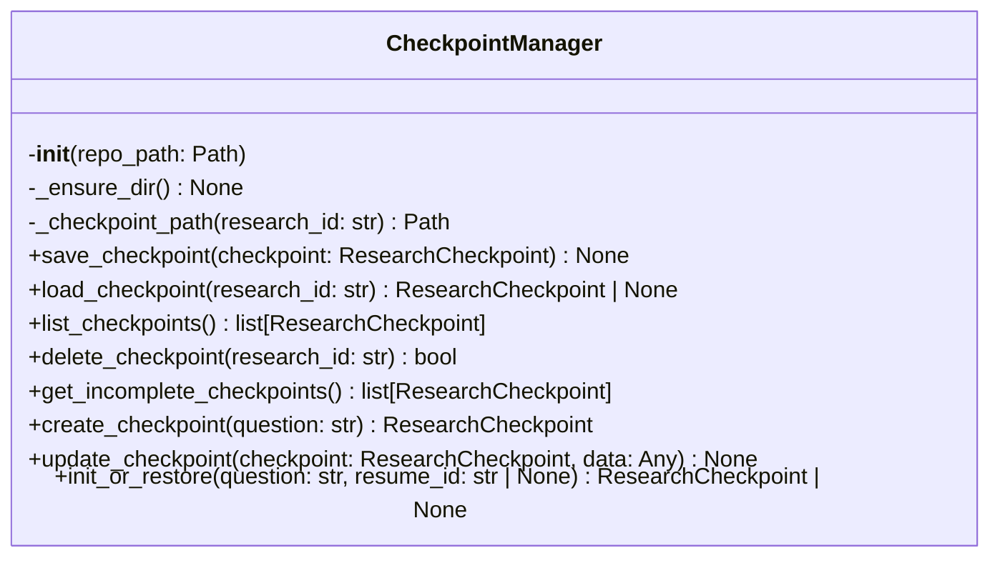

# File: `src/local_deepwiki/core/deep_research/checkpoints.py`

## File Overview

This file implements checkpoint management for deep research sessions, enabling the persistence of research state to allow resumption of interrupted or cancelled research operations. Checkpoints are stored as JSON files in the `.deepwiki/research_checkpoints` directory within each repository.

The module provides a `CheckpointManager` class for handling checkpoint creation, loading, updating, listing, and deletion. It also includes utility functions for converting search results to and from checkpoint-serializable formats, as well as functions for managing checkpoints at the repository level.

## Key Concepts

### Checkpoint Persistence

The core abstraction is the [`ResearchCheckpoint`](../../models/research.md) model, which captures the state of a research session at various stages. This includes:

- The research question
- The repository path
- Timing information (`started_at`, `updated_at`)
- The current step in the research process
- Lists of completed steps
- Intermediate results and context (sub-questions, retrieved contexts, follow-up queries, etc.)

This design allows for granular recovery points during complex research workflows, supporting steps like decomposition, retrieval, synthesis, and follow-up.

### Schema Versioning

Checkpoints are validated against a known schema version (`1`) to ensure compatibility. If an incompatible version is detected, the checkpoint is skipped during listing, and a warning is logged. This provides a mechanism for future schema evolution while maintaining backward compatibility.

### Asynchronous Resumption

The `init_or_restore` function supports both fresh research creation and resumption from an existing checkpoint, enabling workflows where a user can cancel and later resume a research session.

### Data Conversion Utilities

The functions `results_to_checkpoint_format` and `checkpoint_to_results` bridge the gap between [`SearchResult`](../../handlers/types.md) objects and checkpoint-serializable dictionaries, facilitating the storage and restoration of search results in checkpoints.

## Integration

This module integrates with:

- **`local_deepwiki.models`**: Uses [`ResearchCheckpoint`](../../models/research.md), [`ResearchCheckpointStep`](../../models/research.md), and [`SearchResult`](../../handlers/types.md) models for type safety and data structure definition.
- **`local_deepwiki.logging`**: Logs checkpoint operations and errors using a logger instance.
- **`.serialization`**: Converts between [`SearchResult`](../../handlers/types.md) and dictionary representations for checkpoint storage.
- **CLI modules**: The functions `list_research_checkpoints`, `get_research_checkpoint`, and `delete_research_checkpoint` are used by CLI commands to manage checkpoints, allowing users to inspect and manage research sessions from the command line.
- **Test infrastructure**: The `CheckpointManager` class is directly used by test classes like `TestCheckpointManager` and `TestResearchCheckpointing`.

This file is part of the core deep research logic, and its functionality is crucial for enabling robust, recoverable research workflows. It supports the CLI tools by providing the underlying checkpointing infrastructure.

## Design Notes

### Why JSON for Checkpoints?

JSON is used for checkpoint storage due to its simplicity, human-readability, and wide support. It allows for easy debugging and manual inspection of checkpoint state, which is valuable during development and troubleshooting.

### Why UUID for Research IDs?

UUIDs are used for `research_id` to ensure uniqueness across sessions and repositories, avoiding conflicts when multiple research sessions are run concurrently or across different environments.

### Handling Incomplete Checkpoints

The `get_incomplete_checkpoints` method filters out checkpoints that are either complete or in an error state, focusing on those that are actively in progress or paused. This helps in identifying sessions that may need attention or resumption.

### Error Handling

- Invalid or corrupt checkpoint files are gracefully handled by logging warnings and returning `None`.
- Schema version mismatches are logged but do not halt execution; instead, the checkpoint is skipped.
- The `update_checkpoint` method uses duck-typing for `data` to avoid circular imports, making it more flexible and robust.

### Synchronous Cancellation

The `cancel_research` function is synchronous and intended for direct CLI use. It marks a checkpoint as cancelled and saves it, preserving the state for potential future resumption. This is a deliberate design choice to ensure that cancellation is immediate and reliable, even if it blocks the calling thread.

## API Reference

### class `CheckpointManager`

Manages saving and loading research checkpoints.  Checkpoints are stored as JSON files in the .deepwiki/research_checkpoints directory within each repository.

**Methods:**


<details>
<summary>View Source (lines 29-249) | <a href="https://github.com/UrbanDiver/local-deepwiki-mcp/blob/main/src/local_deepwiki/core/deep_research/checkpoints.py#L29-L249">GitHub</a></summary>

```python
class CheckpointManager:
    # Methods: __init__, _ensure_dir, _checkpoint_path, save_checkpoint, load_checkpoint, list_checkpoints, delete_checkpoint, get_incomplete_checkpoints, create_checkpoint, update_checkpoint, init_or_restore
```

</details>

#### `__init__`

```python
def __init__(repo_path: Path)
```

Initialize the checkpoint manager.


| Parameter | Type | Default | Description |
|-----------|------|---------|-------------|
| `repo_path` | `Path` | - | Path to the repository. |


<details>
<summary>View Source (lines 36-43) | <a href="https://github.com/UrbanDiver/local-deepwiki-mcp/blob/main/src/local_deepwiki/core/deep_research/checkpoints.py#L36-L43">GitHub</a></summary>

```python
def __init__(self, repo_path: Path):
        """Initialize the checkpoint manager.

        Args:
            repo_path: Path to the repository.
        """
        self.repo_path = repo_path
        self.checkpoint_dir = repo_path / ".deepwiki" / "research_checkpoints"
```

</details>

#### `save_checkpoint`

```python
def save_checkpoint(checkpoint: ResearchCheckpoint) -> None
```

Save a checkpoint to disk.


| Parameter | Type | Default | Description |
|-----------|------|---------|-------------|
| `checkpoint` | `ResearchCheckpoint` | - | The checkpoint to save. |


<details>
<summary>View Source (lines 60-73) | <a href="https://github.com/UrbanDiver/local-deepwiki-mcp/blob/main/src/local_deepwiki/core/deep_research/checkpoints.py#L60-L73">GitHub</a></summary>

```python
def save_checkpoint(self, checkpoint: ResearchCheckpoint) -> None:
        """Save a checkpoint to disk.

        Args:
            checkpoint: The checkpoint to save.
        """
        self._ensure_dir()
        checkpoint_path = self._checkpoint_path(checkpoint.research_id)
        checkpoint_path.write_text(checkpoint.model_dump_json(indent=2))
        logger.debug(
            "Saved checkpoint %s at step %s",
            checkpoint.research_id,
            checkpoint.current_step,
        )
```

</details>

#### `load_checkpoint`

```python
def load_checkpoint(research_id: str) -> ResearchCheckpoint | None
```

Load a checkpoint from disk.


| Parameter | Type | Default | Description |
|-----------|------|---------|-------------|
| `research_id` | `str` | - | The research session ID. |


<details>
<summary>View Source (lines 75-99) | <a href="https://github.com/UrbanDiver/local-deepwiki-mcp/blob/main/src/local_deepwiki/core/deep_research/checkpoints.py#L75-L99">GitHub</a></summary>

```python
def load_checkpoint(self, research_id: str) -> ResearchCheckpoint | None:
        """Load a checkpoint from disk.

        Args:
            research_id: The research session ID.

        Returns:
            The loaded checkpoint, or None if not found.

        Raises:
            ValueError: If the checkpoint has an incompatible schema version.
        """
        checkpoint_path = self._checkpoint_path(research_id)
        if not checkpoint_path.exists():
            return None

        try:
            data = json.loads(checkpoint_path.read_text())
            version = data.get("schema_version", 1)
            if version != 1:
                raise ValueError("incompatible checkpoint version")
            return ResearchCheckpoint.model_validate(data)
        except json.JSONDecodeError as e:
            logger.warning("Failed to load checkpoint %s: %s", research_id, e)
            return None
```

</details>

#### `list_checkpoints`

```python
def list_checkpoints() -> list[ResearchCheckpoint]
```

List all checkpoints for this repository.


<details>
<summary>View Source (lines 101-129) | <a href="https://github.com/UrbanDiver/local-deepwiki-mcp/blob/main/src/local_deepwiki/core/deep_research/checkpoints.py#L101-L129">GitHub</a></summary>

```python
def list_checkpoints(self) -> list[ResearchCheckpoint]:
        """List all checkpoints for this repository.

        Returns:
            List of checkpoints, sorted by updated_at descending.
        """
        if not self.checkpoint_dir.exists():
            return []

        checkpoints = []
        for path in self.checkpoint_dir.glob("*.json"):
            try:
                data = json.loads(path.read_text())
                version = data.get("schema_version", 1)
                if version != 1:
                    logger.warning(
                        "Skipping checkpoint %s: incompatible schema version %s",
                        path.name,
                        version,
                    )
                    continue
                checkpoint = ResearchCheckpoint.model_validate(data)
                checkpoints.append(checkpoint)
            except (json.JSONDecodeError, ValueError) as e:
                logger.warning("Failed to load checkpoint %s: %s", path.name, e)
                continue

        # Sort by updated_at descending (most recent first)
        return sorted(checkpoints, key=lambda c: c.updated_at, reverse=True)
```

</details>

#### `delete_checkpoint`

```python
def delete_checkpoint(research_id: str) -> bool
```

Delete a checkpoint.


| Parameter | Type | Default | Description |
|-----------|------|---------|-------------|
| `research_id` | `str` | - | The research session ID. |


<details>
<summary>View Source (lines 131-145) | <a href="https://github.com/UrbanDiver/local-deepwiki-mcp/blob/main/src/local_deepwiki/core/deep_research/checkpoints.py#L131-L145">GitHub</a></summary>

```python
def delete_checkpoint(self, research_id: str) -> bool:
        """Delete a checkpoint.

        Args:
            research_id: The research session ID.

        Returns:
            True if deleted, False if not found.
        """
        checkpoint_path = self._checkpoint_path(research_id)
        if checkpoint_path.exists():
            checkpoint_path.unlink()
            logger.debug("Deleted checkpoint %s", research_id)
            return True
        return False
```

</details>

#### `get_incomplete_checkpoints`

```python
def get_incomplete_checkpoints() -> list[ResearchCheckpoint]
```

Get all incomplete (non-complete, non-error) checkpoints.


<details>
<summary>View Source (lines 147-161) | <a href="https://github.com/UrbanDiver/local-deepwiki-mcp/blob/main/src/local_deepwiki/core/deep_research/checkpoints.py#L147-L161">GitHub</a></summary>

```python
def get_incomplete_checkpoints(self) -> list[ResearchCheckpoint]:
        """Get all incomplete (non-complete, non-error) checkpoints.

        Returns:
            List of incomplete checkpoints.
        """
        return [
            c
            for c in self.list_checkpoints()
            if c.current_step
            not in (
                ResearchCheckpointStep.COMPLETE,
                ResearchCheckpointStep.ERROR,
            )
        ]
```

</details>

#### `create_checkpoint`

```python
def create_checkpoint(question: str) -> ResearchCheckpoint
```

Create a new checkpoint for a research session.


| Parameter | Type | Default | Description |
|-----------|------|---------|-------------|
| `question` | `str` | - | The research question. |


<details>
<summary>View Source (lines 163-181) | <a href="https://github.com/UrbanDiver/local-deepwiki-mcp/blob/main/src/local_deepwiki/core/deep_research/checkpoints.py#L163-L181">GitHub</a></summary>

```python
def create_checkpoint(self, question: str) -> ResearchCheckpoint:
        """Create a new checkpoint for a research session.

        Args:
            question: The research question.

        Returns:
            A new ResearchCheckpoint object.
        """
        now = time.time()
        return ResearchCheckpoint(
            research_id=str(uuid.uuid4()),
            question=question,
            repo_path=str(self.repo_path),
            started_at=now,
            updated_at=now,
            current_step=ResearchCheckpointStep.DECOMPOSITION,
            completed_steps=[],
        )
```

</details>

#### `update_checkpoint`

```python
def update_checkpoint(checkpoint: ResearchCheckpoint, data: Any) -> None
```

Update a checkpoint with new data and persist it.  ``data`` is expected to be a :class:[`CheckpointData`](config.md) instance (imported at the call-site to avoid circular imports).  The function reads its attributes duck-type-style so it does not need to import the class.


| Parameter | Type | Default | Description |
|-----------|------|---------|-------------|
| `checkpoint` | `ResearchCheckpoint` | - | The checkpoint to update. |
| `data` | `Any` | - | A CheckpointData instance with fields to apply. |


<details>
<summary>View Source (lines 183-219) | <a href="https://github.com/UrbanDiver/local-deepwiki-mcp/blob/main/src/local_deepwiki/core/deep_research/checkpoints.py#L183-L219">GitHub</a></summary>

```python
def update_checkpoint(
        self,
        checkpoint: ResearchCheckpoint,
        data: Any,
    ) -> None:
        """Update a checkpoint with new data and persist it.

        ``data`` is expected to be a :class:`CheckpointData` instance (imported
        at the call-site to avoid circular imports).  The function reads its
        attributes duck-type-style so it does not need to import the class.

        Args:
            checkpoint: The checkpoint to update.
            data: A CheckpointData instance with fields to apply.
        """
        checkpoint.current_step = data.step
        checkpoint.updated_at = time.time()

        if data.sub_questions is not None:
            checkpoint.sub_questions = data.sub_questions
        if data.retrieved_contexts is not None:
            checkpoint.retrieved_contexts = data.retrieved_contexts
        if data.follow_up_queries is not None:
            checkpoint.follow_up_queries = data.follow_up_queries
        if data.follow_up_contexts is not None:
            checkpoint.follow_up_contexts = data.follow_up_contexts
        if data.partial_synthesis is not None:
            checkpoint.partial_synthesis = data.partial_synthesis
        if data.error is not None:
            checkpoint.error = data.error
        if (
            data.completed_step
            and data.completed_step not in checkpoint.completed_steps
        ):
            checkpoint.completed_steps.append(data.completed_step)

        self.save_checkpoint(checkpoint)
```

</details>

#### `init_or_restore`

```python
def init_or_restore(question: str, resume_id: str | None) -> ResearchCheckpoint | None
```

Initialize or restore a checkpoint for a research run.  When *resume_id* is provided the corresponding checkpoint is loaded; otherwise a fresh one is created.


| Parameter | Type | Default | Description |
|-----------|------|---------|-------------|
| `question` | `str` | - | The research question (used when creating a new checkpoint). |
| `resume_id` | `str | None` | - | Optional checkpoint ID to resume from. |


---


<details>
<summary>View Source (lines 221-249) | <a href="https://github.com/UrbanDiver/local-deepwiki-mcp/blob/main/src/local_deepwiki/core/deep_research/checkpoints.py#L221-L249">GitHub</a></summary>

```python
def init_or_restore(
        self,
        question: str,
        resume_id: str | None,
    ) -> ResearchCheckpoint | None:
        """Initialize or restore a checkpoint for a research run.

        When *resume_id* is provided the corresponding checkpoint is loaded;
        otherwise a fresh one is created.

        Args:
            question: The research question (used when creating a new checkpoint).
            resume_id: Optional checkpoint ID to resume from.

        Returns:
            The active checkpoint (new or restored).
        """
        if resume_id:
            checkpoint = self.load_checkpoint(resume_id)
            if checkpoint:
                logger.info(
                    "Resuming research %s from step %s",
                    resume_id,
                    checkpoint.current_step,
                )
                return checkpoint
            logger.warning("Checkpoint %s not found, starting fresh", resume_id)

        return self.create_checkpoint(question)
```

</details>

### Functions

#### `results_to_checkpoint_format`

```python
def results_to_checkpoint_format(results: list[SearchResult], key: str = "default") -> dict[str, list[dict[str, Any]]]
```

Convert search results to checkpoint-serializable format.


| Parameter | Type | Default | Description |
|-----------|------|---------|-------------|
| `results` | `list[SearchResult]` | - | List of search results. |
| `key` | `str` | `"default"` | Key to use in the dictionary. |

**Returns:** `dict[str, list[dict[str, Any]]]`


<details>
<summary>View Source (lines 252-265) | <a href="https://github.com/UrbanDiver/local-deepwiki-mcp/blob/main/src/local_deepwiki/core/deep_research/checkpoints.py#L252-L265">GitHub</a></summary>

```python
def results_to_checkpoint_format(
    results: list[SearchResult],
    key: str = "default",
) -> dict[str, list[dict[str, Any]]]:
    """Convert search results to checkpoint-serializable format.

    Args:
        results: List of search results.
        key: Key to use in the dictionary.

    Returns:
        Dictionary mapping key to list of serialized results.
    """
    return {key: [search_result_to_dict(r) for r in results]}
```

</details>

#### `checkpoint_to_results`

```python
def checkpoint_to_results(contexts: dict[str, list[dict[str, Any]]] | None) -> list[SearchResult]
```

Convert checkpoint context data back to SearchResults.


| Parameter | Type | Default | Description |
|-----------|------|---------|-------------|
| `contexts` | `dict[str, list[dict[str, Any]]] | None` | - | Dictionary of serialized contexts from checkpoint. |

**Returns:** `list[SearchResult]`


<details>
<summary>View Source (lines 268-289) | <a href="https://github.com/UrbanDiver/local-deepwiki-mcp/blob/main/src/local_deepwiki/core/deep_research/checkpoints.py#L268-L289">GitHub</a></summary>

```python
def checkpoint_to_results(
    contexts: dict[str, list[dict[str, Any]]] | None,
) -> list[SearchResult]:
    """Convert checkpoint context data back to SearchResults.

    Args:
        contexts: Dictionary of serialized contexts from checkpoint.

    Returns:
        List of reconstructed SearchResult objects.
    """
    if not contexts:
        return []

    results: list[SearchResult] = []
    for data in chain.from_iterable(contexts.values()):
        try:
            results.append(dict_to_search_result(data))
        except (KeyError, ValueError) as e:
            logger.warning("Failed to restore search result: %s", e)
            continue
    return results
```

</details>

#### `cancel_research`

```python
def cancel_research(repo_path: Path, research_id: str) -> ResearchCheckpoint | None
```

Cancel a research operation and save its checkpoint.  This is a synchronous utility function that can be called to mark a research session as cancelled. The checkpoint will be preserved for potential resumption later.


| Parameter | Type | Default | Description |
|-----------|------|---------|-------------|
| `repo_path` | `Path` | - | Path to the repository. |
| `research_id` | `str` | - | The research session ID to cancel. |

**Returns:** `ResearchCheckpoint | None`


<details>
<summary>View Source (lines 292-320) | <a href="https://github.com/UrbanDiver/local-deepwiki-mcp/blob/main/src/local_deepwiki/core/deep_research/checkpoints.py#L292-L320">GitHub</a></summary>

```python
def cancel_research(repo_path: Path, research_id: str) -> ResearchCheckpoint | None:
    """Cancel a research operation and save its checkpoint.

    This is a synchronous utility function that can be called to mark
    a research session as cancelled. The checkpoint will be preserved
    for potential resumption later.

    Args:
        repo_path: Path to the repository.
        research_id: The research session ID to cancel.

    Returns:
        The cancelled checkpoint, or None if not found.
    """
    manager = CheckpointManager(repo_path)
    checkpoint = manager.load_checkpoint(research_id)

    if not checkpoint:
        return None

    # Mark as cancelled
    checkpoint.current_step = ResearchCheckpointStep.CANCELLED
    checkpoint.updated_at = time.time()
    checkpoint.error = "Research was cancelled by user"

    manager.save_checkpoint(checkpoint)
    logger.info("Cancelled research %s", research_id)

    return checkpoint
```

</details>

#### `list_research_checkpoints`

```python
def list_research_checkpoints(repo_path: Path) -> list[ResearchCheckpoint]
```

List all research checkpoints for a repository.


| Parameter | Type | Default | Description |
|-----------|------|---------|-------------|
| `repo_path` | `Path` | - | Path to the repository. |

**Returns:** `list[ResearchCheckpoint]`


<details>
<summary>View Source (lines 323-333) | <a href="https://github.com/UrbanDiver/local-deepwiki-mcp/blob/main/src/local_deepwiki/core/deep_research/checkpoints.py#L323-L333">GitHub</a></summary>

```python
def list_research_checkpoints(repo_path: Path) -> list[ResearchCheckpoint]:
    """List all research checkpoints for a repository.

    Args:
        repo_path: Path to the repository.

    Returns:
        List of checkpoints, sorted by updated_at descending.
    """
    manager = CheckpointManager(repo_path)
    return manager.list_checkpoints()
```

</details>

#### `get_research_checkpoint`

```python
def get_research_checkpoint(repo_path: Path, research_id: str) -> ResearchCheckpoint | None
```

Get a specific research checkpoint.


| Parameter | Type | Default | Description |
|-----------|------|---------|-------------|
| `repo_path` | `Path` | - | Path to the repository. |
| `research_id` | `str` | - | The research session ID. |

**Returns:** `ResearchCheckpoint | None`


<details>
<summary>View Source (lines 336-349) | <a href="https://github.com/UrbanDiver/local-deepwiki-mcp/blob/main/src/local_deepwiki/core/deep_research/checkpoints.py#L336-L349">GitHub</a></summary>

```python
def get_research_checkpoint(
    repo_path: Path, research_id: str
) -> ResearchCheckpoint | None:
    """Get a specific research checkpoint.

    Args:
        repo_path: Path to the repository.
        research_id: The research session ID.

    Returns:
        The checkpoint, or None if not found.
    """
    manager = CheckpointManager(repo_path)
    return manager.load_checkpoint(research_id)
```

</details>

#### `delete_research_checkpoint`

```python
def delete_research_checkpoint(repo_path: Path, research_id: str) -> bool
```

Delete a research checkpoint.


| Parameter | Type | Default | Description |
|-----------|------|---------|-------------|
| `repo_path` | `Path` | - | Path to the repository. |
| `research_id` | `str` | - | The research session ID. |

**Returns:** `bool`


<details>
<summary>View Source (lines 352-363) | <a href="https://github.com/UrbanDiver/local-deepwiki-mcp/blob/main/src/local_deepwiki/core/deep_research/checkpoints.py#L352-L363">GitHub</a></summary>

```python
def delete_research_checkpoint(repo_path: Path, research_id: str) -> bool:
    """Delete a research checkpoint.

    Args:
        repo_path: Path to the repository.
        research_id: The research session ID.

    Returns:
        True if deleted, False if not found.
    """
    manager = CheckpointManager(repo_path)
    return manager.delete_checkpoint(research_id)
```

</details>

## Class Diagram



## Call Graph

```mermaid
flowchart TD
    N0[CheckpointManager]
    N1[CheckpointManager._ensure_dir]
    N2[CheckpointManager.create_ch...]
    N3[CheckpointManager.delete_ch...]
    N4[CheckpointManager.init_or_r...]
    N5[CheckpointManager.list_chec...]
    N6[CheckpointManager.load_chec...]
    N7[CheckpointManager.save_chec...]
    N8[CheckpointManager.update_ch...]
    N9[_checkpoint_path]
    N10[_ensure_dir]
    N11[cancel_research]
    N12[checkpoint_to_results]
    N13[delete_checkpoint]
    N14[delete_research_checkpoint]
    N15[dict_to_search_result]
    N16[exists]
    N17[from_iterable]
    N18[get_research_checkpoint]
    N19[list_checkpoints]
    N20[list_research_checkpoints]
    N21[load_checkpoint]
    N22[loads]
    N23[mkdir]
    N24[model_validate]
    N25[read_text]
    N26[results_to_checkpoint_format]
    N27[save_checkpoint]
    N28[search_result_to_dict]
    N29[time]
    N26 --> N28
    N12 --> N17
    N12 --> N15
    N11 --> N0
    N11 --> N21
    N11 --> N29
    N11 --> N27
    N20 --> N0
    N20 --> N19
    N18 --> N0
    N18 --> N21
    N14 --> N0
    N14 --> N13
    N1 --> N23
    N7 --> N10
    N7 --> N9
    N6 --> N9
    N6 --> N16
    N6 --> N22
    N6 --> N25
    N6 --> N24
    N5 --> N16
    N5 --> N22
    N5 --> N25
    N5 --> N24
    N3 --> N9
    N3 --> N16
    N2 --> N29
    N8 --> N29
    N8 --> N27
    N4 --> N21
    classDef func fill:#e1f5fe
    class N0,N9,N10,N11,N12,N13,N14,N15,N16,N17,N18,N19,N20,N21,N22,N23,N24,N25,N26,N27,N28,N29 func
    classDef method fill:#fff3e0
    class N1,N2,N3,N4,N5,N6,N7,N8 method
```



## Used By

Functions and methods in this file and their callers:

- **`CheckpointManager`**: called by `cancel_research`, `delete_research_checkpoint`, `get_research_checkpoint`, `list_research_checkpoints`
- **[`ResearchCheckpoint`](../../models/research.md)**: called by `CheckpointManager.create_checkpoint`
- **`ValueError`**: called by `CheckpointManager.load_checkpoint`
- **`_checkpoint_path`**: called by `CheckpointManager.delete_checkpoint`, `CheckpointManager.load_checkpoint`, `CheckpointManager.save_checkpoint`
- **`_ensure_dir`**: called by `CheckpointManager.save_checkpoint`
- **`create_checkpoint`**: called by `CheckpointManager.init_or_restore`
- **`delete_checkpoint`**: called by `delete_research_checkpoint`
- **[`dict_to_search_result`](serialization.md)**: called by `checkpoint_to_results`
- **`exists`**: called by `CheckpointManager.delete_checkpoint`, `CheckpointManager.list_checkpoints`, `CheckpointManager.load_checkpoint`
- **`from_iterable`**: called by `checkpoint_to_results`
- **`glob`**: called by `CheckpointManager.list_checkpoints`
- **`list_checkpoints`**: called by `CheckpointManager.get_incomplete_checkpoints`, `list_research_checkpoints`
- **`load_checkpoint`**: called by `CheckpointManager.init_or_restore`, `cancel_research`, `get_research_checkpoint`
- **`loads`**: called by `CheckpointManager.list_checkpoints`, `CheckpointManager.load_checkpoint`
- **`mkdir`**: called by `CheckpointManager._ensure_dir`
- **`model_dump_json`**: called by `CheckpointManager.save_checkpoint`
- **`model_validate`**: called by `CheckpointManager.list_checkpoints`, `CheckpointManager.load_checkpoint`
- **`read_text`**: called by `CheckpointManager.list_checkpoints`, `CheckpointManager.load_checkpoint`
- **`save_checkpoint`**: called by `CheckpointManager.update_checkpoint`, `cancel_research`
- **[`search_result_to_dict`](serialization.md)**: called by `results_to_checkpoint_format`
- **`time`**: called by `CheckpointManager.create_checkpoint`, `CheckpointManager.update_checkpoint`, `cancel_research`
- **`unlink`**: called by `CheckpointManager.delete_checkpoint`
- **`uuid4`**: called by `CheckpointManager.create_checkpoint`
- **`write_text`**: called by `CheckpointManager.save_checkpoint`

## Last Modified

| Entity | Type | Author | Date | Commit |
|--------|------|--------|------|--------|
| `CheckpointManager` | class | Brian Breidenbach | yesterday | `1eef062` refactor: complete Grade A ... |
| `create_checkpoint` | method | Brian Breidenbach | yesterday | `1eef062` refactor: complete Grade A ... |
| `update_checkpoint` | method | Brian Breidenbach | yesterday | `1eef062` refactor: complete Grade A ... |
| `init_or_restore` | method | Brian Breidenbach | yesterday | `1eef062` refactor: complete Grade A ... |
| `results_to_checkpoint_format` | function | Brian Breidenbach | yesterday | `1eef062` refactor: complete Grade A ... |
| `checkpoint_to_results` | function | Brian Breidenbach | yesterday | `1eef062` refactor: complete Grade A ... |
| `load_checkpoint` | method | Brian Breidenbach | 2 weeks ago | `93b6254` feat: add schema version to... |
| `list_checkpoints` | method | Brian Breidenbach | 2 weeks ago | `93b6254` feat: add schema version to... |
| `save_checkpoint` | method | Brian Breidenbach | Feb 20, 2026 | `b807417` refactor: high-priority Pyt... |
| `delete_checkpoint` | method | Brian Breidenbach | Feb 11, 2026 | `ba96da1` fix: publication plan P0-P2... |
| `cancel_research` | function | Brian Breidenbach | Feb 11, 2026 | `ba96da1` fix: publication plan P0-P2... |
| `__init__` | method | Brian Breidenbach | Feb 09, 2026 | `99410a9` refactor: split 4 large fil... |
| `_ensure_dir` | method | Brian Breidenbach | Feb 09, 2026 | `99410a9` refactor: split 4 large fil... |
| `_checkpoint_path` | method | Brian Breidenbach | Feb 09, 2026 | `99410a9` refactor: split 4 large fil... |
| `get_incomplete_checkpoints` | method | Brian Breidenbach | Feb 09, 2026 | `99410a9` refactor: split 4 large fil... |
| `list_research_checkpoints` | function | Brian Breidenbach | Feb 09, 2026 | `99410a9` refactor: split 4 large fil... |
| `get_research_checkpoint` | function | Brian Breidenbach | Feb 09, 2026 | `99410a9` refactor: split 4 large fil... |
| `delete_research_checkpoint` | function | Brian Breidenbach | Feb 09, 2026 | `99410a9` refactor: split 4 large fil... |

## Additional Source Code

Source code for functions and methods not listed in the API Reference above.

#### `_ensure_dir`

<details>
<summary>View Source (lines 45-47) | <a href="https://github.com/UrbanDiver/local-deepwiki-mcp/blob/main/src/local_deepwiki/core/deep_research/checkpoints.py#L45-L47">GitHub</a></summary>

```python
def _ensure_dir(self) -> None:
        """Ensure the checkpoint directory exists."""
        self.checkpoint_dir.mkdir(parents=True, exist_ok=True)
```

</details>


#### `_checkpoint_path`

<details>
<summary>View Source (lines 49-58) | <a href="https://github.com/UrbanDiver/local-deepwiki-mcp/blob/main/src/local_deepwiki/core/deep_research/checkpoints.py#L49-L58">GitHub</a></summary>

```python
def _checkpoint_path(self, research_id: str) -> Path:
        """Get the path to a checkpoint file.

        Args:
            research_id: The research session ID.

        Returns:
            Path to the checkpoint JSON file.
        """
        return self.checkpoint_dir / f"{research_id}.json"
```

</details>

## Relevant Source Files

- `src/local_deepwiki/core/deep_research/checkpoints.py:29-249`
