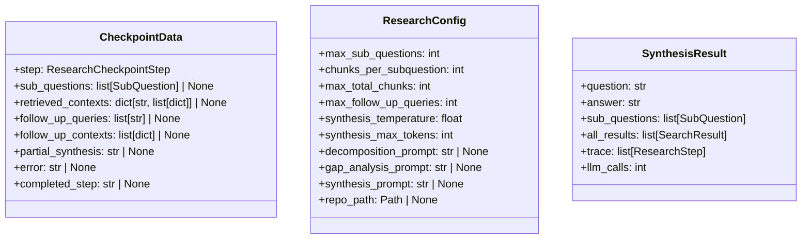

# File: `src/local_deepwiki/core/deep_research/config.py`

## File Overview

This file defines configuration and data structures used throughout the deep research pipeline. It centralizes immutable configuration parameters and data snapshots for checkpointing and synthesis, ensuring consistency and clarity in how research parameters are managed and passed between components.

The file is designed to support a modular, extensible research workflow by providing clear interfaces for configuration, intermediate checkpoint data, and final synthesis results. These abstractions allow for better testability, debuggability, and maintainability of the research pipeline.

## Key Concepts

### Immutable Dataclasses for Configuration and State

The core design decision is to use `dataclass`-decorated classes to define configuration and data structures. This choice provides:

- **Immutability**: Ensures that once a configuration or checkpoint is created, it cannot be accidentally modified, which is critical for reproducibility and correctness in a research pipeline.
- **Clarity and Readability**: Each class explicitly defines its fields and their types, making it easy to understand what data is expected or stored at each stage.
- **Type Safety**: With `typing` and `TYPE_CHECKING`, the classes are well-typed, which helps catch errors at development time.

### Separation of Concerns

- `ResearchConfig`: Encapsulates pipeline-wide parameters such as maximum sub-questions, chunk limits, and temperature settings. This ensures that all pipeline components can access these parameters without needing to pass them individually.
- `CheckpointData`: Represents a snapshot of the pipeline's state at a specific checkpoint. It allows for resuming or restarting research from a known point, supporting robustness in long-running or interrupted research tasks.
- `SynthesisResult`: Encapsulates the final output of the synthesis step, making it easy to pass results from the synthesis phase to the final result generation.

These abstractions reflect a design choice to keep pipeline stages decoupled while ensuring that data flow is explicit and predictable.

## Integration

This file is used by several modules within the `local_deepwiki` project:

- `ResearchConfig` is used by `models_wiki` and `__init__`, indicating that it is a foundational configuration object for the research pipeline.
- `CheckpointData` is used by `checkpoints` and `pipeline`, showing its role in persisting and restoring pipeline state during execution.
- The file imports from `local_deepwiki.models`, which suggests a shared model layer that supports cross-cutting concerns like [`ResearchCheckpointStep`](../../models/research.md), [`ResearchStep`](../../models/research.md), [`SearchResult`](../../handlers/types.md), and [`SubQuestion`](../../models/research.md).

The file is also closely related to CLI tools (`cli/config_validator.py`, `cli/main.py`) and generation modules (`generators/analysis/api_docs.py`, `generators/analysis/tours.py`, `generators/diagrams/_utils.py`), which likely use these data structures to drive pipeline behavior or validate configurations.

## Design Notes

### Why Dataclasses?

Using dataclasses instead of plain dictionaries or named tuples ensures that:
- The structure of configuration and data is explicit.
- Default values are clearly defined and can be overridden.
- Type hints are enforced, aiding in code correctness and IDE support.

### Type Hinting with `TYPE_CHECKING`

The use of `TYPE_CHECKING` ensures that imports are only evaluated at type-checking time, which helps avoid circular import issues in complex codebases.

### Checkpointing and Resumability

`CheckpointData` is designed to be a minimal snapshot of the pipeline's state. It includes:
- The current research step
- Sub-questions and their contexts
- Follow-up queries and their results
- Partial synthesis and error information

This structure supports the ability to resume research from any checkpoint, which is essential for robustness in long-running or resource-constrained environments.

### Synthesis Result Bundling

`SynthesisResult` bundles all the necessary information to finalize a research result. This approach avoids passing large numbers of parameters between functions, instead encapsulating the result in a single, immutable object. This makes the interface for finalizing research clean and predictable.

### Configuration Defaults

The `ResearchConfig` class provides sensible defaults for all parameters, making it easy to start a pipeline without specifying every detail. This balances ease of use with configurability, allowing users to override only the settings they need to change.

## API Reference

### class `ResearchConfig`

Immutable configuration for [DeepResearchPipeline](pipeline.md).  Consolidates the 12 keyword arguments of ``__init__`` into a single object.


<details>
<summary>View Source (lines 19-34) | <a href="https://github.com/UrbanDiver/local-deepwiki-mcp/blob/main/src/local_deepwiki/core/deep_research/config.py#L19-L34">GitHub</a></summary>

```python
class ResearchConfig:
    """Immutable configuration for DeepResearchPipeline.

    Consolidates the 12 keyword arguments of ``__init__`` into a single object.
    """

    max_sub_questions: int = 4
    chunks_per_subquestion: int = 5
    max_total_chunks: int = 30
    max_follow_up_queries: int = 3
    synthesis_temperature: float = 0.5
    synthesis_max_tokens: int = 4096
    decomposition_prompt: str | None = None
    gap_analysis_prompt: str | None = None
    synthesis_prompt: str | None = None
    repo_path: Path | None = None
```

</details>

### class `CheckpointData`

Immutable snapshot of data to persist in a checkpoint save.


<details>
<summary>View Source (lines 38-48) | <a href="https://github.com/UrbanDiver/local-deepwiki-mcp/blob/main/src/local_deepwiki/core/deep_research/config.py#L38-L48">GitHub</a></summary>

```python
class CheckpointData:
    """Immutable snapshot of data to persist in a checkpoint save."""

    step: ResearchCheckpointStep
    sub_questions: list[SubQuestion] | None = None
    retrieved_contexts: dict[str, list[dict]] | None = None
    follow_up_queries: list[str] | None = None
    follow_up_contexts: list[dict] | None = None
    partial_synthesis: str | None = None
    error: str | None = None
    completed_step: str | None = None
```

</details>

### class `SynthesisResult`

Immutable result of the research synthesis step.  Bundles all the data needed by :meth:`_finalize_research` to produce the final :class:[`DeepResearchResult`](../../models/research.md).


<details>
<summary>View Source (lines 52-64) | <a href="https://github.com/UrbanDiver/local-deepwiki-mcp/blob/main/src/local_deepwiki/core/deep_research/config.py#L52-L64">GitHub</a></summary>

```python
class SynthesisResult:
    """Immutable result of the research synthesis step.

    Bundles all the data needed by :meth:`_finalize_research` to produce
    the final :class:`DeepResearchResult`.
    """

    question: str
    answer: str
    sub_questions: list[SubQuestion]
    all_results: list[SearchResult]
    trace: list[ResearchStep]
    llm_calls: int
```

</details>

## Class Diagram



## Usage Examples

*Examples extracted from test files*

### Test default configuration values

From `test_config.py::TestConfig::test_default_config`:

```python
config = Config()

assert config.embedding.provider == "local"
assert config.llm.provider == "ollama"
assert "python" in config.parsing.languages
assert config.chunking.max_chunk_tokens == 512
```

### Test with_preset(None) returns unchanged copy

From `test_config.py::TestResearchPresets::test_with_preset_none_returns_copy`:

```python
config = DeepResearchConfig()
result = config.with_preset(None)

assert result.max_sub_questions == config.max_sub_questions
assert result.chunks_per_subquestion == config.chunks_per_subquestion
```

### Test with_preset('default') returns unchanged copy

From `test_config.py::TestResearchPresets::test_with_preset_default_returns_copy`:

```python
config = DeepResearchConfig()
result = config.with_preset("default")

assert result.max_sub_questions == config.max_sub_questions
assert result is not config
```

### Test get_config returns default config when none is set

From `test_config_loader.py::TestConfigSingleton::test_get_config_returns_default_when_none_set`:

```python
reset_config()
config = get_config()

assert config is not None
assert isinstance(config, Config)
```

### Test initialization without a config path

From `test_config_cli.py::TestConfigValidatorInit::test_init_without_config_path`:

```python
validator = ConfigValidator()
assert validator.config_path is None
assert validator.issues == []
assert validator.config is None
assert validator.raw_config is None
```


## Last Modified

| Entity | Type | Author | Date | Commit |
|--------|------|--------|------|--------|
| `CheckpointData` | class | Brian Breidenbach | yesterday | `1eef062` refactor: complete Grade A ... |
| `SynthesisResult` | class | Brian Breidenbach | yesterday | `1eef062` refactor: complete Grade A ... |
| `ResearchConfig` | class | Brian Breidenbach | 2 days ago | `c091977` refactor: introduce Researc... |

## Relevant Source Files

- `src/local_deepwiki/core/deep_research/config.py:19-34`
