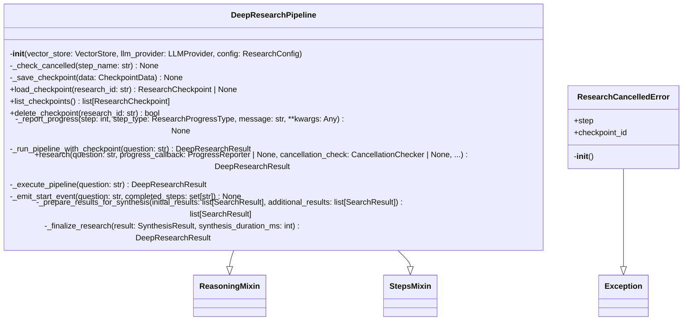

# File: `src/local_deepwiki/core/deep_research/pipeline.py`

## File Overview

This module implements the core `DeepResearchPipeline` class, which orchestrates a multi-step research process for answering complex questions about codebases. It integrates semantic search via a [`VectorStore`](../vectorstore/store.md), LLM reasoning through an [`LLMProvider`](../../providers/base.md), and checkpointing for resumable research sessions.

The pipeline follows a structured workflow:
1. **Decomposition**: Breaks down the question into sub-questions.
2. **Retrieval**: Gathers relevant chunks for each sub-question.
3. **Gap Analysis**: Identifies knowledge gaps and formulates follow-up queries.
4. **Follow-up Retrieval**: Executes additional retrieval based on gap analysis.
5. **Synthesis**: Combines all retrieved information into a final answer.

The design supports asynchronous execution and cancellation handling, making it suitable for long-running operations. Checkpointing allows users to resume interrupted research sessions.

## Key Concepts

### Multi-Step Orchestration
The pipeline is built around a step-by-step execution model. Each major phase (decomposition, retrieval, etc.) is encapsulated in its own method (`_execute_decomposition_step`, `_execute_retrieval_step`, etc.), promoting modularity and testability. This approach allows the system to maintain a clear progression of logic while enabling fine-grained control over individual components.

### Checkpointing for Resumability
The pipeline supports checkpointing via [`CheckpointManager`](checkpoints.md). This enables users to interrupt and later resume research from where they left off, improving usability for long-running or resource-intensive tasks. The system saves checkpoints at various stages and cleans them up upon successful completion or logs errors if a step fails.

### Cancellation Handling
A dual cancellation mechanism ensures flexibility:
- A [`CancellationChecker`](../../models/foundation.md) callback that returns `True` if cancellation is requested.
- An [`asyncio.Event`](../../events.md) that can be set externally to signal cancellation.

Both mechanisms are checked in `_check_cancelled` before critical steps to allow graceful termination without leaving partial state.

### Progress Reporting
Progress is reported through a [`ProgressReporter`](../../models/foundation.md) callback. This enables UIs or logging systems to track the pipeline's status in real time. Events are also emitted via `get_event_emitter()` to support broader event-driven architectures within the application.

### Deduplication and Chunk Limiting
Results from multiple retrieval steps are deduplicated and limited to `max_total_chunks` to prevent overwhelming the synthesis step with too much data. This helps balance thoroughness with computational efficiency.

## Integration

### With Core Components
- **[`VectorStore`](../vectorstore/store.md)**: Used in retrieval steps to find relevant chunks for sub-questions.
- **[`LLMProvider`](../../providers/base.md)**: Provides reasoning capabilities for decomposition, gap analysis, and synthesis.
- **[`CheckpointManager`](checkpoints.md)**: Manages checkpoint persistence and restoration, integrating with [`ResearchCheckpoint`](../../models/research.md) and [`CheckpointData`](config.md).
- **`get_event_emitter()`**: Emits events like `RESEARCH_START` and `RESEARCH_COMPLETE` for integration into larger systems.
- **`get_logger()`**: Logs internal states and actions for debugging and monitoring.

### With Test Infrastructure
- The `ResearchCancelledError` is used in tests (`test_deep_research_progress`) to simulate cancellation behavior.
- The `DeepResearchPipeline` is instantiated and tested directly in `test_deep_research_pipeline` and `test_deep_research_progress`.

### Related Files
- **`src/local_deepwiki/cli/config_validator.py`** and **`src/local_deepwiki/cli/main.py`**: Likely consume or configure [`ResearchConfig`](config.md) and pass it to the pipeline.
- **`src/local_deepwiki/core/rate_limiter.py`**: May be used to manage LLM API calls or rate limits.
- **`src/local_deepwiki/generators/analysis/api_docs.py`**: Could integrate with this pipeline to generate documentation from codebase research.
- **`src/local_deepwiki/handlers/agentic.py`**: May leverage this pipeline for agent-based research workflows.

## Design Notes

### Asynchronous Execution
All major steps (`_execute_pipeline`, `_execute_decomposition_step`, etc.) are async, allowing for non-blocking operations during LLM calls and vector store queries. This is crucial for responsiveness in UIs or server environments.

### Modular Step Execution
Each step is isolated in its own method, which promotes:
- Easier testing (each step can be mocked or unit-tested independently).
- Clear separation of concerns.
- Extensibility for future steps or variations in logic.

### Graceful Failure and Cleanup
The `_run_pipeline_with_checkpoint` method wraps execution in a try/except block to:
- Delete checkpoints on success.
- Save error or cancellation states on failure.
This ensures that even if a step fails mid-pipeline, users can resume or inspect what went wrong.

### Checkpoint Restoration Logic
When resuming from a checkpoint, the pipeline skips already completed steps. This is handled by checking `checkpoint.completed_steps` and only running steps not yet done.

### Event-Driven Progress Tracking
Progress and research lifecycle events are emitted using the global event emitter. This decouples the pipeline from UI or logging systems, making it adaptable to different contexts.

### Deduplication Strategy
Deduplication is performed using `_deduplicate_results`, which ensures that no duplicate chunks are passed to synthesis. This prevents redundant processing and improves answer quality.

### LLM Prompt Customization
Users can override system prompts for decomposition, gap analysis, and synthesis. If no custom prompt is provided, default ones are used. This balances ease-of-use with customization capability.

### Error Propagation
Errors during pipeline execution are propagated upward, including `ResearchCancelledError`, which is raised after saving the appropriate checkpoint state. This ensures that cancellation is handled cleanly and consistently.

## API Reference

### class `ResearchCancelledError`

**Inherits from:** `Exception`

Raised when a deep research operation is cancelled.

**Methods:**


<details>
<summary>View Source (lines 43-52) | <a href="https://github.com/UrbanDiver/local-deepwiki-mcp/blob/main/src/local_deepwiki/core/deep_research/pipeline.py#L43-L52">GitHub</a></summary>

```python
class ResearchCancelledError(Exception):
    """Raised when a deep research operation is cancelled."""

    def __init__(self, step: str = "unknown", checkpoint_id: str | None = None):
        self.step = step
        self.checkpoint_id = checkpoint_id
        msg = f"Research cancelled during {step}"
        if checkpoint_id:
            msg += f" (checkpoint: {checkpoint_id})"
        super().__init__(msg)
```

</details>

#### `__init__`

```python
def __init__(step: str = "unknown", checkpoint_id: str | None = None)
```


| Parameter | Type | Default | Description |
|-----------|------|---------|-------------|
| `step` | `str` | `"unknown"` | - |
| `checkpoint_id` | `str | None` | `None` | - |


<details>
<summary>View Source (lines 43-52) | <a href="https://github.com/UrbanDiver/local-deepwiki-mcp/blob/main/src/local_deepwiki/core/deep_research/pipeline.py#L43-L52">GitHub</a></summary>

```python
class ResearchCancelledError(Exception):
    """Raised when a deep research operation is cancelled."""

    def __init__(self, step: str = "unknown", checkpoint_id: str | None = None):
        self.step = step
        self.checkpoint_id = checkpoint_id
        msg = f"Research cancelled during {step}"
        if checkpoint_id:
            msg += f" (checkpoint: {checkpoint_id})"
        super().__init__(msg)
```

</details>

### class `DeepResearchPipeline`

**Inherits from:** [`ReasoningMixin`](reasoning.md), [`StepsMixin`](steps.md)

Multi-step research pipeline for complex codebase questions.  This pipeline performs: 1. Query decomposition - breaks question into sub-questions 2. Parallel retrieval - searches for each sub-question 3. Gap analysis - identifies missing context 4. Follow-up retrieval - targeted search for gaps 5. Synthesis - combines context into comprehensive answer

**Methods:**


<details>
<summary>View Source (lines 55-476) | <a href="https://github.com/UrbanDiver/local-deepwiki-mcp/blob/main/src/local_deepwiki/core/deep_research/pipeline.py#L55-L476">GitHub</a></summary>

```python
class DeepResearchPipeline(ReasoningMixin, StepsMixin):
    # Methods: __init__, _check_cancelled, _save_checkpoint, load_checkpoint, list_checkpoints, delete_checkpoint, _report_progress, _run_pipeline_with_checkpoint, research, _execute_pipeline, _emit_start_event, _prepare_results_for_synthesis, _finalize_research
```

</details>

#### `__init__`

```python
def __init__(vector_store: VectorStore, llm_provider: LLMProvider, config: ResearchConfig)
```

Initialize the deep research pipeline.


| Parameter | Type | Default | Description |
|-----------|------|---------|-------------|
| `vector_store` | `VectorStore` | - | Vector store for semantic search. |
| `llm_provider` | `LLMProvider` | - | LLM provider for reasoning. |
| `config` | `ResearchConfig` | - | Research configuration consolidating all tuneable parameters (max sub-questions, chunk limits, prompts, etc.). |


<details>
<summary>View Source (lines 66-108) | <a href="https://github.com/UrbanDiver/local-deepwiki-mcp/blob/main/src/local_deepwiki/core/deep_research/pipeline.py#L66-L108">GitHub</a></summary>

```python
def __init__(
        self,
        vector_store: VectorStore,
        llm_provider: LLMProvider,
        config: ResearchConfig,
    ):
        """Initialize the deep research pipeline.

        Args:
            vector_store: Vector store for semantic search.
            llm_provider: LLM provider for reasoning.
            config: Research configuration consolidating all tuneable
                parameters (max sub-questions, chunk limits, prompts, etc.).
        """
        self.vector_store = vector_store
        self.llm = llm_provider
        self.max_sub_questions = config.max_sub_questions
        self.chunks_per_subquestion = config.chunks_per_subquestion
        self.max_total_chunks = config.max_total_chunks
        self.max_follow_up_queries = config.max_follow_up_queries
        self.synthesis_temperature = config.synthesis_temperature
        self.synthesis_max_tokens = config.synthesis_max_tokens

        # Use custom prompts if provided, otherwise use defaults
        self.decomposition_prompt = (
            config.decomposition_prompt or DECOMPOSITION_SYSTEM_PROMPT
        )
        self.gap_analysis_prompt = (
            config.gap_analysis_prompt or GAP_ANALYSIS_SYSTEM_PROMPT
        )
        self.synthesis_prompt = config.synthesis_prompt or SYNTHESIS_SYSTEM_PROMPT

        # Repository path for checkpointing
        self.repo_path = config.repo_path
        self._checkpoint_manager: CheckpointManager | None = None
        if config.repo_path:
            self._checkpoint_manager = CheckpointManager(config.repo_path)

        # Runtime state (set during research())
        self._progress_callback: ProgressReporter | None = None
        self._cancellation_check: CancellationChecker | None = None
        self._current_checkpoint: ResearchCheckpoint | None = None
        self._cancellation_event: asyncio.Event | None = None
```

</details>

#### `load_checkpoint`

```python
def load_checkpoint(research_id: str) -> ResearchCheckpoint | None
```

Load a checkpoint by ID.


| Parameter | Type | Default | Description |
|-----------|------|---------|-------------|
| `research_id` | `str` | - | The research session ID. |


<details>
<summary>View Source (lines 151-162) | <a href="https://github.com/UrbanDiver/local-deepwiki-mcp/blob/main/src/local_deepwiki/core/deep_research/pipeline.py#L151-L162">GitHub</a></summary>

```python
def load_checkpoint(self, research_id: str) -> ResearchCheckpoint | None:
        """Load a checkpoint by ID.

        Args:
            research_id: The research session ID.

        Returns:
            The loaded checkpoint, or None if not found.
        """
        if not self._checkpoint_manager:
            return None
        return self._checkpoint_manager.load_checkpoint(research_id)
```

</details>

#### `list_checkpoints`

```python
def list_checkpoints() -> list[ResearchCheckpoint]
```

List all checkpoints for this repository.


<details>
<summary>View Source (lines 164-172) | <a href="https://github.com/UrbanDiver/local-deepwiki-mcp/blob/main/src/local_deepwiki/core/deep_research/pipeline.py#L164-L172">GitHub</a></summary>

```python
def list_checkpoints(self) -> list[ResearchCheckpoint]:
        """List all checkpoints for this repository.

        Returns:
            List of checkpoints.
        """
        if not self._checkpoint_manager:
            return []
        return self._checkpoint_manager.list_checkpoints()
```

</details>

#### `delete_checkpoint`

```python
def delete_checkpoint(research_id: str) -> bool
```

Delete a checkpoint.


| Parameter | Type | Default | Description |
|-----------|------|---------|-------------|
| `research_id` | `str` | - | The research session ID. |


<details>
<summary>View Source (lines 174-185) | <a href="https://github.com/UrbanDiver/local-deepwiki-mcp/blob/main/src/local_deepwiki/core/deep_research/pipeline.py#L174-L185">GitHub</a></summary>

```python
def delete_checkpoint(self, research_id: str) -> bool:
        """Delete a checkpoint.

        Args:
            research_id: The research session ID.

        Returns:
            True if deleted, False if not found.
        """
        if not self._checkpoint_manager:
            return False
        return self._checkpoint_manager.delete_checkpoint(research_id)
```

</details>

#### `research`

```python
async def research(question: str, progress_callback: ProgressReporter | None = None, cancellation_check: CancellationChecker | None = None, resume_id: str | None = None, cancellation_event: asyncio.Event | None = None) -> DeepResearchResult
```

Execute the full research pipeline.


| Parameter | Type | Default | Description |
|-----------|------|---------|-------------|
| `question` | `str` | - | The complex question to research. |
| `progress_callback` | `ProgressReporter | None` | `None` | Optional async callback for progress updates. |
| `cancellation_check` | `CancellationChecker | None` | `None` | Optional callback that returns True if cancelled. |
| `resume_id` | `str | None` | `None` | Optional checkpoint ID to resume from. |
| `cancellation_event` | `asyncio.Event | None` | `None` | Optional asyncio.Event for cancellation signaling. |


<details>
<summary>View Source (lines 258-299) | <a href="https://github.com/UrbanDiver/local-deepwiki-mcp/blob/main/src/local_deepwiki/core/deep_research/pipeline.py#L258-L299">GitHub</a></summary>

```python
async def research(
        self,
        question: str,
        progress_callback: ProgressReporter | None = None,
        cancellation_check: CancellationChecker | None = None,
        resume_id: str | None = None,
        cancellation_event: asyncio.Event | None = None,
    ) -> DeepResearchResult:
        """Execute the full research pipeline.

        Args:
            question: The complex question to research.
            progress_callback: Optional async callback for progress updates.
            cancellation_check: Optional callback that returns True if cancelled.
            resume_id: Optional checkpoint ID to resume from.
            cancellation_event: Optional asyncio.Event for cancellation signaling.

        Returns:
            DeepResearchResult with answer, sources, and reasoning trace.

        Raises:
            ResearchCancelledError: If the operation is cancelled.
        """
        self._progress_callback = progress_callback
        self._cancellation_check = cancellation_check
        self._cancellation_event = cancellation_event

        # Initialize or restore checkpoint
        if self._checkpoint_manager:
            self._current_checkpoint = self._checkpoint_manager.init_or_restore(
                question, resume_id
            )
        else:
            self._current_checkpoint = None

        try:
            return await self._run_pipeline_with_checkpoint(question)
        finally:
            self._progress_callback = None
            self._cancellation_check = None
            self._cancellation_event = None
            self._current_checkpoint = None
```

</details>

## Class Diagram



## Call Graph

```mermaid
flowchart TD
    N0[CheckpointData]
    N1[CheckpointManager]
    N2[DeepResearchPipeline.__init__]
    N3[DeepResearchPipeline._check...]
    N4[DeepResearchPipeline._emit_...]
    N5[DeepResearchPipeline._execu...]
    N6[DeepResearchPipeline._final...]
    N7[DeepResearchPipeline._repor...]
    N8[DeepResearchPipeline._run_p...]
    N9[DeepResearchPipeline._save_...]
    N10[DeepResearchPipeline.delete...]
    N11[DeepResearchPipeline.list_c...]
    N12[DeepResearchPipeline.load_c...]
    N13[DeepResearchPipeline.research]
    N14[ResearchCancelledError]
    N15[ResearchCancelledError.__in...]
    N16[ResearchProgress]
    N17[__init__]
    N18[_cancellation_check]
    N19[_execute_pipeline]
    N20[_progress_callback]
    N21[_report_progress]
    N22[_save_checkpoint]
    N23[delete_checkpoint]
    N24[emit]
    N25[get_event_emitter]
    N26[is_set]
    N27[list_checkpoints]
    N28[load_checkpoint]
    N29[update_checkpoint]
    N15 --> N17
    N2 --> N1
    N3 --> N26
    N3 --> N14
    N3 --> N18
    N9 --> N29
    N12 --> N28
    N11 --> N27
    N10 --> N23
    N7 --> N20
    N7 --> N16
    N8 --> N19
    N8 --> N23
    N8 --> N22
    N8 --> N0
    N4 --> N25
    N4 --> N24
    N4 --> N21
    N6 --> N22
    N6 --> N0
    N6 --> N21
    N6 --> N25
    N6 --> N24
    classDef func fill:#e1f5fe
    class N0,N1,N14,N16,N17,N18,N19,N20,N21,N22,N23,N24,N25,N26,N27,N28,N29 func
    classDef method fill:#fff3e0
    class N2,N3,N4,N5,N6,N7,N8,N9,N10,N11,N12,N13,N15 method
```



## Used By

Functions and methods in this file and their callers:

- **[`CheckpointData`](config.md)**: called by `DeepResearchPipeline._finalize_research`, `DeepResearchPipeline._run_pipeline_with_checkpoint`
- **[`CheckpointManager`](checkpoints.md)**: called by `DeepResearchPipeline.__init__`
- **[`DeepResearchResult`](../../models/research.md)**: called by `DeepResearchPipeline._finalize_research`
- **`ResearchCancelledError`**: called by `DeepResearchPipeline._check_cancelled`
- **[`ResearchProgress`](../../models/research.md)**: called by `DeepResearchPipeline._report_progress`
- **[`SynthesisResult`](config.md)**: called by `DeepResearchPipeline._execute_pipeline`
- **`__init__`**: called by `ResearchCancelledError.__init__`
- **`_build_sources`**: called by `DeepResearchPipeline._finalize_research`
- **`_cancellation_check`**: called by `DeepResearchPipeline._check_cancelled`
- **`_deduplicate_results`**: called by `DeepResearchPipeline._prepare_results_for_synthesis`
- **`_emit_start_event`**: called by `DeepResearchPipeline._execute_pipeline`
- **`_execute_decomposition_step`**: called by `DeepResearchPipeline._execute_pipeline`
- **`_execute_follow_up_step`**: called by `DeepResearchPipeline._execute_pipeline`
- **`_execute_gap_analysis_step`**: called by `DeepResearchPipeline._execute_pipeline`
- **`_execute_pipeline`**: called by `DeepResearchPipeline._run_pipeline_with_checkpoint`
- **`_execute_retrieval_step`**: called by `DeepResearchPipeline._execute_pipeline`
- **`_finalize_research`**: called by `DeepResearchPipeline._execute_pipeline`
- **`_prepare_results_for_synthesis`**: called by `DeepResearchPipeline._execute_pipeline`
- **`_progress_callback`**: called by `DeepResearchPipeline._report_progress`
- **`_report_progress`**: called by `DeepResearchPipeline._emit_start_event`, `DeepResearchPipeline._finalize_research`
- **`_run_pipeline_with_checkpoint`**: called by `DeepResearchPipeline.research`
- **`_save_checkpoint`**: called by `DeepResearchPipeline._finalize_research`, `DeepResearchPipeline._run_pipeline_with_checkpoint`
- **`_step_synthesize`**: called by `DeepResearchPipeline._execute_pipeline`
- **`delete_checkpoint`**: called by `DeepResearchPipeline._run_pipeline_with_checkpoint`, `DeepResearchPipeline.delete_checkpoint`
- **`emit`**: called by `DeepResearchPipeline._emit_start_event`, `DeepResearchPipeline._finalize_research`
- **[`get_event_emitter`](../../events.md)**: called by `DeepResearchPipeline._emit_start_event`, `DeepResearchPipeline._finalize_research`
- **`init_or_restore`**: called by `DeepResearchPipeline.research`
- **`is_set`**: called by `DeepResearchPipeline._check_cancelled`
- **`list_checkpoints`**: called by `DeepResearchPipeline.list_checkpoints`
- **`load_checkpoint`**: called by `DeepResearchPipeline.load_checkpoint`
- **`update_checkpoint`**: called by `DeepResearchPipeline._save_checkpoint`

## Last Modified

| Entity | Type | Author | Date | Commit |
|--------|------|--------|------|--------|
| `DeepResearchPipeline` | class | Brian Breidenbach | yesterday | `1eef062` refactor: complete Grade A ... |
| `__init__` | method | Brian Breidenbach | yesterday | `1eef062` refactor: complete Grade A ... |
| `_save_checkpoint` | method | Brian Breidenbach | yesterday | `1eef062` refactor: complete Grade A ... |
| `_run_pipeline_with_checkpoint` | method | Brian Breidenbach | yesterday | `1eef062` refactor: complete Grade A ... |
| `research` | method | Brian Breidenbach | yesterday | `1eef062` refactor: complete Grade A ... |
| `_execute_pipeline` | method | Brian Breidenbach | yesterday | `1eef062` refactor: complete Grade A ... |
| `_finalize_research` | method | Brian Breidenbach | yesterday | `1eef062` refactor: complete Grade A ... |
| `_check_cancelled` | method | Brian Breidenbach | Feb 11, 2026 | `ba96da1` fix: publication plan P0-P2... |
| `_prepare_results_for_synthesis` | method | Brian Breidenbach | Feb 11, 2026 | `ba96da1` fix: publication plan P0-P2... |
| `ResearchCancelledError` | class | Brian Breidenbach | Feb 09, 2026 | `99410a9` refactor: split 4 large fil... |
| `load_checkpoint` | method | Brian Breidenbach | Feb 09, 2026 | `99410a9` refactor: split 4 large fil... |
| `list_checkpoints` | method | Brian Breidenbach | Feb 09, 2026 | `99410a9` refactor: split 4 large fil... |
| `delete_checkpoint` | method | Brian Breidenbach | Feb 09, 2026 | `99410a9` refactor: split 4 large fil... |
| `_report_progress` | method | Brian Breidenbach | Feb 09, 2026 | `99410a9` refactor: split 4 large fil... |
| `_emit_start_event` | method | Brian Breidenbach | Feb 09, 2026 | `99410a9` refactor: split 4 large fil... |

## Additional Source Code

Source code for functions and methods not listed in the API Reference above.

#### `_check_cancelled`

<details>
<summary>View Source (lines 110-137) | <a href="https://github.com/UrbanDiver/local-deepwiki-mcp/blob/main/src/local_deepwiki/core/deep_research/pipeline.py#L110-L137">GitHub</a></summary>

```python
def _check_cancelled(self, step_name: str) -> None:
        """Check if research was cancelled and raise if so.

        Args:
            step_name: Name of the current step for error message.

        Raises:
            ResearchCancelledError: If cancellation was requested.
        """
        # Check the cancellation event first
        if self._cancellation_event and self._cancellation_event.is_set():
            logger.info("Research cancelled via event during %s", step_name)
            checkpoint_id = (
                self._current_checkpoint.research_id
                if self._current_checkpoint
                else None
            )
            raise ResearchCancelledError(step_name, checkpoint_id)

        # Then check the callback
        if self._cancellation_check and self._cancellation_check():
            logger.info("Research cancelled during %s", step_name)
            checkpoint_id = (
                self._current_checkpoint.research_id
                if self._current_checkpoint
                else None
            )
            raise ResearchCancelledError(step_name, checkpoint_id)
```

</details>


#### `_save_checkpoint`

<details>
<summary>View Source (lines 139-149) | <a href="https://github.com/UrbanDiver/local-deepwiki-mcp/blob/main/src/local_deepwiki/core/deep_research/pipeline.py#L139-L149">GitHub</a></summary>

```python
def _save_checkpoint(self, data: CheckpointData) -> None:
        """Save the current research state as a checkpoint.

        Delegates to :meth:`CheckpointManager.update_checkpoint`.

        Args:
            data: Immutable snapshot of checkpoint fields to persist.
        """
        if not self._checkpoint_manager or not self._current_checkpoint:
            return
        self._checkpoint_manager.update_checkpoint(self._current_checkpoint, data)
```

</details>


#### `_report_progress`

<details>
<summary>View Source (lines 187-210) | <a href="https://github.com/UrbanDiver/local-deepwiki-mcp/blob/main/src/local_deepwiki/core/deep_research/pipeline.py#L187-L210">GitHub</a></summary>

```python
async def _report_progress(
        self,
        step: int,
        step_type: ResearchProgressType,
        message: str,
        **kwargs: Any,
    ) -> None:
        """Report progress to the callback if set.

        Args:
            step: Current step number.
            step_type: Type of progress event.
            message: Human-readable progress message.
            **kwargs: Additional progress data.
        """
        if self._progress_callback:
            await self._progress_callback(
                ResearchProgress(
                    step=step,
                    step_type=step_type,
                    message=message,
                    **kwargs,
                )
            )
```

</details>


#### `_run_pipeline_with_checkpoint`

<details>
<summary>View Source (lines 212-256) | <a href="https://github.com/UrbanDiver/local-deepwiki-mcp/blob/main/src/local_deepwiki/core/deep_research/pipeline.py#L212-L256">GitHub</a></summary>

```python
async def _run_pipeline_with_checkpoint(self, question: str) -> DeepResearchResult:
        """Run the pipeline and manage checkpoint lifecycle on success or error.

        Deletes the checkpoint on success; saves an error/cancelled checkpoint
        on failure before re-raising.

        Args:
            question: The research question.

        Returns:
            DeepResearchResult from the pipeline.

        Raises:
            ResearchCancelledError: Propagated from the pipeline.
            Exception: Any other pipeline error is re-raised after saving state.
        """
        try:
            result = await self._execute_pipeline(question)

            if self._current_checkpoint and self._checkpoint_manager:
                self._checkpoint_manager.delete_checkpoint(
                    self._current_checkpoint.research_id
                )

            return result

        except ResearchCancelledError:
            if self._current_checkpoint:
                self._save_checkpoint(
                    CheckpointData(
                        step=ResearchCheckpointStep.CANCELLED,
                        error="Research was cancelled by user",
                    )
                )
            raise

        except Exception as e:  # noqa: BLE001 — checkpoint boundary
            if self._current_checkpoint:
                self._save_checkpoint(
                    CheckpointData(
                        step=ResearchCheckpointStep.ERROR,
                        error=str(e),
                    )
                )
            raise
```

</details>


#### `_execute_pipeline`

<details>
<summary>View Source (lines 301-373) | <a href="https://github.com/UrbanDiver/local-deepwiki-mcp/blob/main/src/local_deepwiki/core/deep_research/pipeline.py#L301-L373">GitHub</a></summary>

```python
async def _execute_pipeline(self, question: str) -> DeepResearchResult:
        """Execute the research pipeline steps.

        This is a high-level orchestrator that coordinates the research steps,
        delegating checkpoint restoration and step execution to helper methods.

        Args:
            question: The complex question to research.

        Returns:
            DeepResearchResult with answer, sources, and reasoning trace.
        """
        trace: list[ResearchStep] = []
        llm_calls = 0

        # Determine what steps to skip based on checkpoint
        checkpoint = self._current_checkpoint
        completed_steps = set(checkpoint.completed_steps) if checkpoint else set()

        # Emit start event and report progress
        await self._emit_start_event(question, completed_steps)

        # Step 1: Decompose question
        sub_questions, step, calls = await self._execute_decomposition_step(
            question, completed_steps
        )
        trace.append(step)
        llm_calls += calls

        # Step 2: Parallel retrieval
        initial_results, step = await self._execute_retrieval_step(
            sub_questions, completed_steps
        )
        trace.append(step)

        # Step 3: Gap analysis
        follow_up_queries, step, calls = await self._execute_gap_analysis_step(
            question, sub_questions, initial_results, completed_steps
        )
        trace.append(step)
        llm_calls += calls

        # Step 4: Follow-up retrieval (if needed)
        additional_results, follow_up_step = await self._execute_follow_up_step(
            follow_up_queries, len(initial_results), completed_steps
        )
        if follow_up_step:
            trace.append(follow_up_step)

        # Prepare results for synthesis
        all_results = self._prepare_results_for_synthesis(
            initial_results, additional_results
        )

        # Step 5: Synthesis
        answer, step, calls = await self._step_synthesize(
            question, sub_questions, all_results
        )
        trace.append(step)
        llm_calls += calls

        # Finalize and build result
        return await self._finalize_research(
            SynthesisResult(
                question=question,
                answer=answer,
                sub_questions=sub_questions,
                all_results=all_results,
                trace=trace,
                llm_calls=llm_calls,
            ),
            step.duration_ms,
        )
```

</details>


#### `_emit_start_event`

<details>
<summary>View Source (lines 375-402) | <a href="https://github.com/UrbanDiver/local-deepwiki-mcp/blob/main/src/local_deepwiki/core/deep_research/pipeline.py#L375-L402">GitHub</a></summary>

```python
async def _emit_start_event(
        self,
        question: str,
        completed_steps: set[str],
    ) -> None:
        """Emit the research start event and report initial progress.

        Args:
            question: The research question.
            completed_steps: Set of already completed step names.
        """
        emitter = get_event_emitter()
        is_resuming = bool(completed_steps)

        if not is_resuming:
            await emitter.emit(
                EventType.RESEARCH_START,
                {"question": question},
            )
            await self._report_progress(
                0, ResearchProgressType.STARTED, "Starting deep research..."
            )
        else:
            await self._report_progress(
                0,
                ResearchProgressType.STARTED,
                f"Resuming deep research from checkpoint (completed: {', '.join(completed_steps)})",
            )
```

</details>


#### `_prepare_results_for_synthesis`

<details>
<summary>View Source (lines 404-420) | <a href="https://github.com/UrbanDiver/local-deepwiki-mcp/blob/main/src/local_deepwiki/core/deep_research/pipeline.py#L404-L420">GitHub</a></summary>

```python
def _prepare_results_for_synthesis(
        self,
        initial_results: list[SearchResult],
        additional_results: list[SearchResult],
    ) -> list[SearchResult]:
        """Deduplicate and limit results for synthesis.

        Returns:
            Prepared list of search results.
        """
        all_results = self._deduplicate_results(initial_results + additional_results)

        if len(all_results) > self.max_total_chunks:
            all_results = all_results[: self.max_total_chunks]
            logger.info("Limited to %s chunks for synthesis", self.max_total_chunks)

        return all_results
```

</details>


#### `_finalize_research`

<details>
<summary>View Source (lines 422-476) | <a href="https://github.com/UrbanDiver/local-deepwiki-mcp/blob/main/src/local_deepwiki/core/deep_research/pipeline.py#L422-L476">GitHub</a></summary>

```python
async def _finalize_research(
        self,
        result: SynthesisResult,
        synthesis_duration_ms: int,
    ) -> DeepResearchResult:
        """Finalize the research by saving checkpoint and emitting completion events.

        Args:
            result: Immutable synthesis result with question, answer,
                sub-questions, search results, trace, and LLM call count.
            synthesis_duration_ms: Duration of the synthesis step.

        Returns:
            The final DeepResearchResult.
        """
        # Mark checkpoint as complete
        self._save_checkpoint(
            CheckpointData(
                step=ResearchCheckpointStep.COMPLETE,
                partial_synthesis=result.answer,
                completed_step="synthesis",
            )
        )

        # Report completion
        await self._report_progress(
            5,
            ResearchProgressType.COMPLETE,
            f"Research complete: {len(result.all_results)} chunks analyzed, "
            f"{result.llm_calls} LLM calls",
            chunks_retrieved=len(result.all_results),
            duration_ms=synthesis_duration_ms,
        )

        # Emit RESEARCH_COMPLETE event
        emitter = get_event_emitter()
        await emitter.emit(
            EventType.RESEARCH_COMPLETE,
            {
                "question": result.question,
                "sub_question_count": len(result.sub_questions),
                "chunks_analyzed": len(result.all_results),
                "llm_calls": result.llm_calls,
            },
        )

        return DeepResearchResult(
            question=result.question,
            answer=result.answer,
            sub_questions=result.sub_questions,
            sources=self._build_sources(result.all_results),
            reasoning_trace=result.trace,
            total_chunks_analyzed=len(result.all_results),
            total_llm_calls=result.llm_calls,
        )
```

</details>

## Relevant Source Files

- `src/local_deepwiki/core/deep_research/pipeline.py:43-52`
