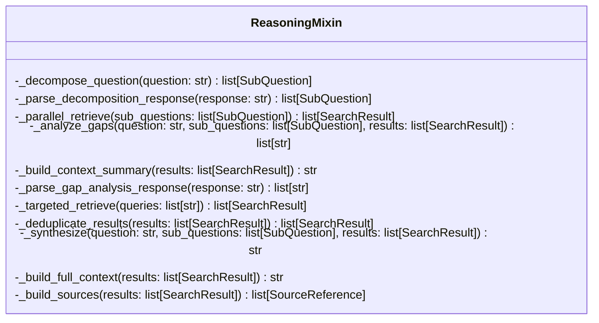

# File: `src/local_deepwiki/core/deep_research/reasoning.py`

## File Overview

This file implements the core reasoning logic for the deep research pipeline. It provides methods for decomposing complex questions, retrieving relevant code context, analyzing gaps in retrieved information, and synthesizing a comprehensive answer. The `ReasoningMixin` class encapsulates this functionality, making it reusable across different research workflows.

The design rationale centers on breaking down complex questions into manageable sub-questions, leveraging vector search for efficient code retrieval, and using LLMs to analyze and synthesize information while respecting rate limits and handling potential errors gracefully.

## Key Concepts

### Decomposition and Sub-Question Generation
The system uses LLM-driven decomposition to break complex questions into structured sub-questions. This approach allows for targeted retrieval of relevant code chunks and ensures that all aspects of the original question are addressed.

### Gap Analysis
After initial retrieval, the system performs a gap analysis to identify missing information. This involves summarizing the retrieved context and asking follow-up queries to fill identified gaps, enhancing the completeness of the final answer.

### Parallel Retrieval
To optimize performance, the system retrieves code chunks for each sub-question in parallel using `asyncio.gather`. This minimizes wait times and improves throughput during the research process.

### Deduplication
Duplicate code chunks are removed based on their unique identifiers, keeping only the highest-scoring versions. This ensures that the synthesis step operates on a clean, non-redundant dataset.

### Context Synthesis
The final synthesis step combines all retrieved context into a coherent answer. It formats the context in a structured way and provides metadata (like file paths and relevance scores) for traceability.

## Integration

This file is part of the core deep research functionality and integrates with:
- `local_deepwiki.core.rate_limiter`: Ensures LLM calls respect rate limits.
- `local_deepwiki.logging`: Provides logging for warnings and debug information.
- `local_deepwiki.models`: Uses [`SearchResult`](../../handlers/types.md), [`SourceReference`](../../models/research.md), and [`SubQuestion`](../../models/research.md) for data structures.

The `ReasoningMixin` class is designed to be inherited by other classes that implement the full research pipeline, such as those found in CLI modules like `check_cli.py`, `main.py`, or `status_cli.py`. This mixin approach promotes code reuse and separation of concerns.

## Design Notes

### Rate Limiting
All LLM calls are wrapped with `async with get_rate_limiter():` to ensure compliance with API limits. This prevents overwhelming external services and ensures stable operation.

### Error Handling
The system handles various failure modes:
- JSON parsing errors in LLM responses are caught and logged.
- Exceptions during parallel search tasks are caught and logged, allowing the pipeline to continue processing other queries.
- Empty or invalid responses are gracefully handled, ensuring that the pipeline does not crash.

### Response Parsing
LLM responses are parsed using regex to extract JSON content. This robust approach handles cases where LLMs return additional text before or after the JSON structure.

### Chunk Limiting
To prevent overwhelming the LLM with too much context, the system limits:
- Number of sub-questions
- Number of follow-up queries
- Number of chunks per file in context summaries
- Number of chunks per query in follow-up searches

These limits balance thoroughness with computational efficiency and LLM context window constraints.

## API Reference

### class `ReasoningMixin`

Mixin providing core reasoning methods for [DeepResearchPipeline](pipeline.md).  These methods handle LLM interactions for question decomposition, gap analysis, synthesis, and vector store retrieval operations.  Expects the following attributes on the host class: - llm: [LLMProvider](../../providers/base.md) - vector_store: [VectorStore](../vectorstore/store.md) - decomposition_prompt: str - gap_analysis_prompt: str - synthesis_prompt: str - max_sub_questions: int - max_follow_up_queries: int - chunks_per_subquestion: int - max_total_chunks: int - synthesis_temperature: float - synthesis_max_tokens: int


<details>
<summary>View Source (lines 91-470) | <a href="https://github.com/UrbanDiver/local-deepwiki-mcp/blob/main/src/local_deepwiki/core/deep_research/reasoning.py#L91-L470">GitHub</a></summary>

```python
class ReasoningMixin:
    # Methods: _decompose_question, _parse_decomposition_response, _parallel_retrieve, _analyze_gaps, _build_context_summary, _parse_gap_analysis_response, _targeted_retrieve, _deduplicate_results, _synthesize, _build_full_context, _build_sources
```

</details>

## Class Diagram



## Call Graph

```mermaid
flowchart TD
    N0[ReasoningMixin._analyze_gaps]
    N1[ReasoningMixin._build_sources]
    N2[ReasoningMixin._decompose_q...]
    N3[ReasoningMixin._parallel_re...]
    N4[ReasoningMixin._parse_decom...]
    N5[ReasoningMixin._parse_gap_a...]
    N6[ReasoningMixin._synthesize]
    N7[ReasoningMixin._targeted_re...]
    N8[SourceReference]
    N9[SubQuestion]
    N10[_build_context_summary]
    N11[_build_full_context]
    N12[_parse_decomposition_response]
    N13[_parse_gap_analysis_response]
    N14[gather]
    N15[generate]
    N16[get_rate_limiter]
    N17[group]
    N18[loads]
    N19[search]
    N2 --> N16
    N2 --> N15
    N2 --> N12
    N4 --> N19
    N4 --> N18
    N4 --> N17
    N4 --> N9
    N3 --> N19
    N3 --> N14
    N0 --> N10
    N0 --> N16
    N0 --> N15
    N0 --> N13
    N5 --> N19
    N5 --> N18
    N5 --> N17
    N7 --> N19
    N7 --> N14
    N6 --> N11
    N6 --> N16
    N6 --> N15
    N1 --> N8
    classDef func fill:#e1f5fe
    class N8,N9,N10,N11,N12,N13,N14,N15,N16,N17,N18,N19 func
    classDef method fill:#fff3e0
    class N0,N1,N2,N3,N4,N5,N6,N7 method
```



## Used By

Functions and methods in this file and their callers:

- **[`SourceReference`](../../models/research.md)**: called by `ReasoningMixin._build_sources`
- **[`SubQuestion`](../../models/research.md)**: called by `ReasoningMixin._parse_decomposition_response`
- **`_build_context_summary`**: called by `ReasoningMixin._analyze_gaps`
- **`_build_full_context`**: called by `ReasoningMixin._synthesize`
- **`_parse_decomposition_response`**: called by `ReasoningMixin._decompose_question`
- **`_parse_gap_analysis_response`**: called by `ReasoningMixin._analyze_gaps`
- **`gather`**: called by `ReasoningMixin._parallel_retrieve`, `ReasoningMixin._targeted_retrieve`
- **`generate`**: called by `ReasoningMixin._analyze_gaps`, `ReasoningMixin._decompose_question`, `ReasoningMixin._synthesize`
- **[`get_rate_limiter`](../rate_limiter.md)**: called by `ReasoningMixin._analyze_gaps`, `ReasoningMixin._decompose_question`, `ReasoningMixin._synthesize`
- **`group`**: called by `ReasoningMixin._parse_decomposition_response`, `ReasoningMixin._parse_gap_analysis_response`
- **`loads`**: called by `ReasoningMixin._parse_decomposition_response`, `ReasoningMixin._parse_gap_analysis_response`
- **`search`**: called by `ReasoningMixin._parallel_retrieve`, `ReasoningMixin._parse_decomposition_response`, `ReasoningMixin._parse_gap_analysis_response`, `ReasoningMixin._targeted_retrieve`

## Last Modified

| Entity | Type | Author | Date | Commit |
|--------|------|--------|------|--------|
| `ReasoningMixin` | class | Brian Breidenbach | Feb 20, 2026 | `b807417` refactor: high-priority Pyt... |
| `_parallel_retrieve` | method | Brian Breidenbach | Feb 20, 2026 | `b807417` refactor: high-priority Pyt... |
| `_targeted_retrieve` | method | Brian Breidenbach | Feb 20, 2026 | `b807417` refactor: high-priority Pyt... |
| `_parse_decomposition_response` | method | Brian Breidenbach | Feb 11, 2026 | `ba96da1` fix: publication plan P0-P2... |
| `_parse_gap_analysis_response` | method | Brian Breidenbach | Feb 11, 2026 | `ba96da1` fix: publication plan P0-P2... |
| `_decompose_question` | method | Brian Breidenbach | Feb 09, 2026 | `99410a9` refactor: split 4 large fil... |
| `_analyze_gaps` | method | Brian Breidenbach | Feb 09, 2026 | `99410a9` refactor: split 4 large fil... |
| `_build_context_summary` | method | Brian Breidenbach | Feb 09, 2026 | `99410a9` refactor: split 4 large fil... |
| `_deduplicate_results` | method | Brian Breidenbach | Feb 09, 2026 | `99410a9` refactor: split 4 large fil... |
| `_synthesize` | method | Brian Breidenbach | Feb 09, 2026 | `99410a9` refactor: split 4 large fil... |
| `_build_full_context` | method | Brian Breidenbach | Feb 09, 2026 | `99410a9` refactor: split 4 large fil... |
| `_build_sources` | method | Brian Breidenbach | Feb 09, 2026 | `99410a9` refactor: split 4 large fil... |

## Additional Source Code

Source code for functions and methods not listed in the API Reference above.

#### `_decompose_question`

<details>
<summary>View Source (lines 111-137) | <a href="https://github.com/UrbanDiver/local-deepwiki-mcp/blob/main/src/local_deepwiki/core/deep_research/reasoning.py#L111-L137">GitHub</a></summary>

```python
async def _decompose_question(self, question: str) -> list[SubQuestion]:
        """Decompose a complex question into sub-questions.

        Args:
            question: The original question.

        Returns:
            List of sub-questions to investigate.
        """
        prompt = DECOMPOSITION_USER_PROMPT.format(question=question)

        # Acquire rate limit before LLM call
        async with get_rate_limiter():
            response = await self.llm.generate(
                prompt=prompt,
                system_prompt=self.decomposition_prompt,
                temperature=0.3,  # Lower temperature for structured output
            )

        # Parse JSON response
        sub_questions = self._parse_decomposition_response(response)

        # Limit to max
        if len(sub_questions) > self.max_sub_questions:
            sub_questions = sub_questions[: self.max_sub_questions]

        return sub_questions
```

</details>


#### `_parse_decomposition_response`

<details>
<summary>View Source (lines 139-179) | <a href="https://github.com/UrbanDiver/local-deepwiki-mcp/blob/main/src/local_deepwiki/core/deep_research/reasoning.py#L139-L179">GitHub</a></summary>

```python
def _parse_decomposition_response(self, response: str) -> list[SubQuestion]:
        """Parse the LLM decomposition response.

        Args:
            response: Raw LLM response.

        Returns:
            List of parsed SubQuestions.
        """
        try:
            # Try to extract JSON from the response
            json_match = re.search(r"\{[\s\S]*\}", response)
            if not json_match:
                logger.warning("No JSON found in decomposition response")
                return []

            data = json.loads(json_match.group())
            sub_questions = []

            for item in data.get("sub_questions", []):
                if isinstance(item, dict) and "question" in item:
                    category = item.get("category", "structure")
                    # Validate category
                    valid_categories = {
                        "structure",
                        "flow",
                        "dependencies",
                        "impact",
                        "comparison",
                    }
                    if category not in valid_categories:
                        category = "structure"
                    sub_questions.append(
                        SubQuestion(question=item["question"], category=category)
                    )

            return sub_questions

        except json.JSONDecodeError as e:
            logger.warning("Failed to parse decomposition JSON: %s", e)
            return []
```

</details>


#### `_parallel_retrieve`

<details>
<summary>View Source (lines 181-218) | <a href="https://github.com/UrbanDiver/local-deepwiki-mcp/blob/main/src/local_deepwiki/core/deep_research/reasoning.py#L181-L218">GitHub</a></summary>

```python
async def _parallel_retrieve(
        self, sub_questions: list[SubQuestion]
    ) -> list[SearchResult]:
        """Retrieve code chunks for each sub-question in parallel.

        Args:
            sub_questions: List of sub-questions to search for.

        Returns:
            Combined list of search results.
        """
        if not sub_questions:
            return []

        # Create search tasks
        tasks = [
            self.vector_store.search(sq.question, limit=self.chunks_per_subquestion)
            for sq in sub_questions
        ]

        # Execute in parallel
        results_lists = await asyncio.gather(*tasks, return_exceptions=True)

        # Combine results
        all_results: list[SearchResult] = []
        for i, result_or_exc in enumerate(results_lists):
            if isinstance(
                result_or_exc, (asyncio.CancelledError, KeyboardInterrupt, SystemExit)
            ):
                raise result_or_exc
            if isinstance(result_or_exc, BaseException):
                logger.warning(
                    "Search failed for sub-question %s: %s", i, result_or_exc
                )
                continue
            all_results.extend(result_or_exc)

        return all_results
```

</details>


#### `_analyze_gaps`

<details>
<summary>View Source (lines 220-267) | <a href="https://github.com/UrbanDiver/local-deepwiki-mcp/blob/main/src/local_deepwiki/core/deep_research/reasoning.py#L220-L267">GitHub</a></summary>

```python
async def _analyze_gaps(
        self,
        question: str,
        sub_questions: list[SubQuestion],
        results: list[SearchResult],
    ) -> list[str]:
        """Analyze retrieved context for gaps.

        Args:
            question: Original question.
            sub_questions: Sub-questions investigated.
            results: Retrieved search results.

        Returns:
            List of follow-up queries to fill gaps.
        """
        if not results:
            # No results, generate basic follow-up
            return [question]

        # Build context summary
        context_summary = self._build_context_summary(results)
        sub_q_text = "\n".join(
            f"- [{sq.category}] {sq.question}" for sq in sub_questions
        )

        prompt = GAP_ANALYSIS_USER_PROMPT.format(
            question=question,
            sub_questions=sub_q_text,
            context_summary=context_summary,
        )

        # Acquire rate limit before LLM call
        async with get_rate_limiter():
            response = await self.llm.generate(
                prompt=prompt,
                system_prompt=self.gap_analysis_prompt,
                temperature=0.3,
            )

        # Parse response
        follow_ups = self._parse_gap_analysis_response(response)

        # Limit follow-up queries
        if len(follow_ups) > self.max_follow_up_queries:
            follow_ups = follow_ups[: self.max_follow_up_queries]

        return follow_ups
```

</details>


#### `_build_context_summary`

<details>
<summary>View Source (lines 269-297) | <a href="https://github.com/UrbanDiver/local-deepwiki-mcp/blob/main/src/local_deepwiki/core/deep_research/reasoning.py#L269-L297">GitHub</a></summary>

```python
def _build_context_summary(self, results: list[SearchResult]) -> str:
        """Build a summary of retrieved context for gap analysis.

        Args:
            results: Search results to summarize.

        Returns:
            String summary of the context.
        """
        if not results:
            return "No code context retrieved."

        # Group by file
        files: dict[str, list[SearchResult]] = {}
        for r in results:
            path = r.chunk.file_path
            if path not in files:
                files[path] = []
            files[path].append(r)

        summary_parts = []
        for path, file_results in files.items():
            chunks = ", ".join(
                f"{r.chunk.chunk_type.value} '{r.chunk.name or 'unnamed'}'"
                for r in file_results[:3]  # Limit per file
            )
            summary_parts.append(f"- {path}: {chunks}")

        return "\n".join(summary_parts[:10])  # Limit total files
```

</details>


#### `_parse_gap_analysis_response`

<details>
<summary>View Source (lines 299-321) | <a href="https://github.com/UrbanDiver/local-deepwiki-mcp/blob/main/src/local_deepwiki/core/deep_research/reasoning.py#L299-L321">GitHub</a></summary>

```python
def _parse_gap_analysis_response(self, response: str) -> list[str]:
        """Parse the LLM gap analysis response.

        Args:
            response: Raw LLM response.

        Returns:
            List of follow-up queries.
        """
        try:
            json_match = re.search(r"\{[\s\S]*\}", response)
            if not json_match:
                return []

            data = json.loads(json_match.group())
            follow_ups = data.get("follow_up_queries", [])

            # Filter out empty strings
            return [q for q in follow_ups if q and isinstance(q, str)]

        except json.JSONDecodeError as e:
            logger.warning("Failed to parse gap analysis JSON: %s", e)
            return []
```

</details>


#### `_targeted_retrieve`

<details>
<summary>View Source (lines 323-358) | <a href="https://github.com/UrbanDiver/local-deepwiki-mcp/blob/main/src/local_deepwiki/core/deep_research/reasoning.py#L323-L358">GitHub</a></summary>

```python
async def _targeted_retrieve(self, queries: list[str]) -> list[SearchResult]:
        """Perform targeted retrieval for follow-up queries.

        Args:
            queries: List of search queries.

        Returns:
            Combined search results.
        """
        if not queries:
            return []

        # Use slightly fewer chunks per query for follow-ups
        chunks_per_query = max(3, self.chunks_per_subquestion - 2)

        tasks = [
            self.vector_store.search(query, limit=chunks_per_query) for query in queries
        ]

        results_lists = await asyncio.gather(*tasks, return_exceptions=True)

        all_results: list[SearchResult] = []
        for i, result_or_exc in enumerate(results_lists):
            if isinstance(
                result_or_exc,
                (asyncio.CancelledError, KeyboardInterrupt, SystemExit),
            ):
                raise result_or_exc
            if isinstance(result_or_exc, BaseException):
                logger.warning(
                    "Follow-up search failed for query %d: %s", i, result_or_exc
                )
                continue
            all_results.extend(result_or_exc)

        return all_results
```

</details>


#### `_deduplicate_results`

<details>
<summary>View Source (lines 360-377) | <a href="https://github.com/UrbanDiver/local-deepwiki-mcp/blob/main/src/local_deepwiki/core/deep_research/reasoning.py#L360-L377">GitHub</a></summary>

```python
def _deduplicate_results(self, results: list[SearchResult]) -> list[SearchResult]:
        """Remove duplicate chunks, keeping highest-scoring ones.

        Args:
            results: List of search results.

        Returns:
            Deduplicated list sorted by score.
        """
        seen: dict[str, SearchResult] = {}

        for r in results:
            chunk_id = r.chunk.id
            if chunk_id not in seen or r.score > seen[chunk_id].score:
                seen[chunk_id] = r

        # Sort by score descending
        return sorted(seen.values(), key=lambda x: x.score, reverse=True)
```

</details>


#### `_synthesize`

<details>
<summary>View Source (lines 379-427) | <a href="https://github.com/UrbanDiver/local-deepwiki-mcp/blob/main/src/local_deepwiki/core/deep_research/reasoning.py#L379-L427">GitHub</a></summary>

```python
async def _synthesize(
        self,
        question: str,
        sub_questions: list[SubQuestion],
        results: list[SearchResult],
    ) -> str:
        """Synthesize a comprehensive answer from all context.

        Args:
            question: Original question.
            sub_questions: Sub-questions investigated.
            results: All retrieved search results.

        Returns:
            Comprehensive answer string.
        """
        if not results:
            return (
                "I couldn't find relevant code context to answer this question. "
                "Please ensure the repository has been indexed."
            )

        # Build full context
        full_context = self._build_full_context(results)
        sub_q_text = "\n".join(
            f"- [{sq.category}] {sq.question}" for sq in sub_questions
        )

        # Count unique files
        unique_files = len(set(r.chunk.file_path for r in results))

        prompt = SYNTHESIS_USER_PROMPT.format(
            question=question,
            sub_questions=sub_q_text,
            num_files=unique_files,
            num_chunks=len(results),
            full_context=full_context,
        )

        # Acquire rate limit before LLM call
        async with get_rate_limiter():
            answer = await self.llm.generate(
                prompt=prompt,
                system_prompt=self.synthesis_prompt,
                temperature=self.synthesis_temperature,
                max_tokens=self.synthesis_max_tokens,
            )

        return answer
```

</details>


#### `_build_full_context`

<details>
<summary>View Source (lines 429-449) | <a href="https://github.com/UrbanDiver/local-deepwiki-mcp/blob/main/src/local_deepwiki/core/deep_research/reasoning.py#L429-L449">GitHub</a></summary>

```python
def _build_full_context(self, results: list[SearchResult]) -> str:
        """Build full context string for synthesis.

        Args:
            results: Search results to include.

        Returns:
            Formatted context string.
        """
        context_parts = []

        for r in results:
            chunk = r.chunk
            header = f"File: {chunk.file_path}:{chunk.start_line}-{chunk.end_line}"
            header += f" | Type: {chunk.chunk_type.value}"
            if chunk.name:
                header += f" | Name: {chunk.name}"

            context_parts.append(f"{header}\n```\n{chunk.content}\n```")

        return "\n\n---\n\n".join(context_parts)
```

</details>


#### `_build_sources`

<details>
<summary>View Source (lines 451-470) | <a href="https://github.com/UrbanDiver/local-deepwiki-mcp/blob/main/src/local_deepwiki/core/deep_research/reasoning.py#L451-L470">GitHub</a></summary>

```python
def _build_sources(self, results: list[SearchResult]) -> list[SourceReference]:
        """Build source references from search results.

        Args:
            results: Search results to convert.

        Returns:
            List of SourceReference objects.
        """
        return [
            SourceReference(
                file_path=r.chunk.file_path,
                start_line=r.chunk.start_line,
                end_line=r.chunk.end_line,
                chunk_type=r.chunk.chunk_type.value,
                name=r.chunk.name,
                relevance_score=r.score,
            )
            for r in results
        ]
```

</details>

## Relevant Source Files

- `src/local_deepwiki/core/deep_research/reasoning.py:91-470`
