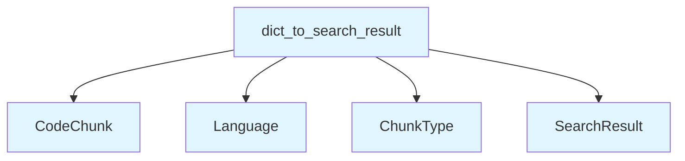

# File: `src/local_deepwiki/core/deep_research/serialization.py`

## File Overview

This file provides serialization utilities for converting [`SearchResult`](../../handlers/types.md) objects to and from dictionaries. The primary purpose of this module is to support checkpoint persistence and data exchange in the deep research pipeline. It bridges domain objects (like [`SearchResult`](../../handlers/types.md), [`CodeChunk`](../../models/chunks.md), etc.) with JSON-serializable formats, enabling storage and transmission of search results in a structured way.

The module is designed to be lightweight and focused, containing only two core functions: `search_result_to_dict` and `dict_to_search_result`. These functions handle the conversion of rich domain objects into a dictionary representation suitable for serialization and back again.

## Key Concepts

### Serialization Pattern
The module implements a standard serialization pattern for domain objects, where complex objects are flattened into dictionaries and then reconstructed. This approach is chosen for its simplicity and compatibility with JSON-based storage or communication protocols.

### Domain Object Mapping
The [`SearchResult`](../../handlers/types.md) object contains a [`CodeChunk`](../../models/chunks.md) and metadata like `score` and `highlights`. The functions map these fields directly into dictionary keys, preserving the structure and data types for accurate reconstruction.

### Type Safety and Enum Handling
The module leverages type hints and enum values ([`Language`](../../models/foundation.md), [`ChunkType`](../../models/foundation.md)) for type safety and clarity. When reconstructing objects, enums are explicitly cast using their constructor (e.g., `Language(chunk_data["language"])`), ensuring that invalid values are handled gracefully.

## Integration

This module is part of the core deep research functionality and integrates with several other components in the codebase:

- **Called by**: The `search_result_to_dict` function is used by checkpoints, indicating that this module supports persistent storage of search results.
- **Imports from**: It depends on models defined in `local_deepwiki.models`, such as [`SearchResult`](../../handlers/types.md), [`CodeChunk`](../../models/chunks.md), [`Language`](../../models/foundation.md), and [`ChunkType`](../../models/foundation.md), which are foundational to the deep research pipeline.
- **Related files**: It interacts with CLI tools (`cli/main.py`, `cli/config_validator.py`), analysis generators (`generators/analysis/api_docs.py`), and handlers (`handlers/types.py`) that may need to serialize or deserialize search results during processing.

This module is foundational for any part of the system that needs to persist or transmit search results, making it a key piece in enabling data flow and state management.

## Design Notes

### Trade-offs
- **Flexibility vs. Simplicity**: The design assumes that all fields in [`CodeChunk`](../../models/chunks.md) and [`SearchResult`](../../handlers/types.md) can be serialized directly. If more complex nested structures were introduced, a more sophisticated serialization strategy might be needed.
- **Error Handling**: The functions do not perform extensive validation or error handling. It is assumed that input data is valid, and invalid data will cause exceptions during reconstruction.

### Edge Cases
- **Optional Fields**: Fields like `name`, `docstring`, `parent_name`, and `metadata` in [`CodeChunk`](../../models/chunks.md) are handled using `.get()` to support optional values.
- **Default Values**: The `highlights` field in [`SearchResult`](../../handlers/types.md) defaults to an empty list if not present in the dictionary, ensuring robustness when reconstructing results.

### Non-Obvious Choices
- **Direct Mapping**: The functions use a direct mapping approach for fields, avoiding complex transformation logic. This keeps the code simple and readable.
- **Enum Reconstruction**: Enums are reconstructed using their constructor (`Language(...)`, `ChunkType(...)`), which allows for easy conversion from serialized string representations while maintaining type safety.

This approach ensures that the serialization logic is both performant and maintainable, aligning with the broader goals of the deep research pipeline to be efficient and robust.

## API Reference

### Functions

#### `search_result_to_dict`

```python
def search_result_to_dict(result: SearchResult) -> dict[str, Any]
```

Convert a [SearchResult](../../handlers/types.md) to a serializable dictionary.


| Parameter | Type | Default | Description |
|-----------|------|---------|-------------|
| `result` | `SearchResult` | - | The search result to convert. |

**Returns:** `dict[str, Any]`


<details>
<summary>View Source (lines 14-39) | <a href="https://github.com/UrbanDiver/local-deepwiki-mcp/blob/main/src/local_deepwiki/core/deep_research/serialization.py#L14-L39">GitHub</a></summary>

```python
def search_result_to_dict(result: SearchResult) -> dict[str, Any]:
    """Convert a SearchResult to a serializable dictionary.

    Args:
        result: The search result to convert.

    Returns:
        Dictionary representation suitable for JSON serialization.
    """
    return {
        "chunk": {
            "id": result.chunk.id,
            "file_path": result.chunk.file_path,
            "language": result.chunk.language.value,
            "chunk_type": result.chunk.chunk_type.value,
            "name": result.chunk.name,
            "content": result.chunk.content,
            "start_line": result.chunk.start_line,
            "end_line": result.chunk.end_line,
            "docstring": result.chunk.docstring,
            "parent_name": result.chunk.parent_name,
            "metadata": result.chunk.metadata,
        },
        "score": result.score,
        "highlights": result.highlights,
    }
```

</details>

#### `dict_to_search_result`

```python
def dict_to_search_result(data: dict[str, Any]) -> SearchResult
```

Convert a dictionary back to a [SearchResult](../../handlers/types.md).


| Parameter | Type | Default | Description |
|-----------|------|---------|-------------|
| `data` | `dict[str, Any]` | - | Dictionary representation of a search result. |

**Returns:** [`SearchResult`](../../handlers/types.md)


<details>
<summary>View Source (lines 42-69) | <a href="https://github.com/UrbanDiver/local-deepwiki-mcp/blob/main/src/local_deepwiki/core/deep_research/serialization.py#L42-L69">GitHub</a></summary>

```python
def dict_to_search_result(data: dict[str, Any]) -> SearchResult:
    """Convert a dictionary back to a SearchResult.

    Args:
        data: Dictionary representation of a search result.

    Returns:
        Reconstructed SearchResult object.
    """
    chunk_data = data["chunk"]
    chunk = CodeChunk(
        id=chunk_data["id"],
        file_path=chunk_data["file_path"],
        language=Language(chunk_data["language"]),
        chunk_type=ChunkType(chunk_data["chunk_type"]),
        name=chunk_data.get("name"),
        content=chunk_data["content"],
        start_line=chunk_data["start_line"],
        end_line=chunk_data["end_line"],
        docstring=chunk_data.get("docstring"),
        parent_name=chunk_data.get("parent_name"),
        metadata=chunk_data.get("metadata", {}),
    )
    return SearchResult(
        chunk=chunk,
        score=data["score"],
        highlights=data.get("highlights", []),
    )
```

</details>

## Call Graph



## Used By

Functions and methods in this file and their callers:

- **[`ChunkType`](../../models/foundation.md)**: called by `dict_to_search_result`
- **[`CodeChunk`](../../models/chunks.md)**: called by `dict_to_search_result`
- **[`Language`](../../models/foundation.md)**: called by `dict_to_search_result`
- **[`SearchResult`](../../handlers/types.md)**: called by `dict_to_search_result`

## Last Modified

| Entity | Type | Author | Date | Commit |
|--------|------|--------|------|--------|
| `search_result_to_dict` | function | Brian Breidenbach | Feb 09, 2026 | `99410a9` refactor: split 4 large fil... |
| `dict_to_search_result` | function | Brian Breidenbach | Feb 09, 2026 | `99410a9` refactor: split 4 large fil... |

## Relevant Source Files

- `src/local_deepwiki/core/deep_research/serialization.py:14-39`
