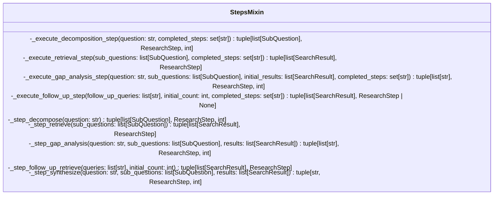

# File: `src/local_deepwiki/core/deep_research/steps.py`

## File Overview

This file implements the orchestration logic for the deep research pipeline, defining how each step of the research process is executed. It encapsulates the core workflow of decomposing a research question, retrieving relevant information, analyzing gaps, performing follow-up searches, and synthesizing a final answer.

The module is designed to support resumable research processes through checkpointing, allowing the system to recover from interruptions or failures without restarting the entire pipeline. Each step is implemented as an asynchronous method, supporting concurrent execution where appropriate.

## Key Concepts

### Research Pipeline Steps
The research process is broken down into a sequence of well-defined steps:
1. **Decomposition**: Breaking a complex question into sub-questions.
2. **Initial Retrieval**: Fetching initial results for the sub-questions.
3. **Gap Analysis**: Identifying areas not covered by initial results.
4. **Follow-up Retrieval**: Searching for additional information based on identified gaps.
5. **Synthesis**: Combining all retrieved information into a coherent answer.

Each step is implemented in both a "step" method (which executes the logic) and an "execute" method (which handles checkpointing and state management).

### Checkpointing
Checkpointing allows the research process to be resumed from where it left off. This is implemented using [`CheckpointData`](config.md) and related helper functions like [`checkpoint_to_results`](checkpoints.md) and [`results_to_checkpoint_format`](checkpoints.md). The system saves checkpoints after each major step, enabling recovery from interruptions.

### Asynchronous Execution and Progress Tracking
All research steps are implemented as asynchronous functions to support non-blocking operations, particularly for I/O-bound tasks like search and LLM calls. Progress tracking is handled via `_report_progress`, which emits events and updates internal state, ensuring visibility into the research workflow.

### Event Emission
The system emits `EventType.RESEARCH_QUERY` events for each sub-question during decomposition. This allows external components to monitor or react to the generation of sub-questions, supporting integration with monitoring or UI systems.

## Integration

This file is part of the `local_deepwiki` core research engine and integrates with several other modules:

- **[Event](../../events.md) System**: Uses [`get_event_emitter`](../../events.md) and [`EventType`](../../events.md) to emit events, particularly for research queries.
- **Logging**: Leverages [`get_logger`](../../logging.md) for structured logging of step execution and progress.
- **Models**: Depends on various research-related models such as [`ResearchStep`](../../models/research.md), [`SearchResult`](../../handlers/types.md), [`SubQuestion`](../../models/research.md), etc.
- **Checkpointing**: Works with `checkpoints.py` to manage saving and restoring state.
- **Serialization**: Uses `serialization.py` for converting between dictionary and model representations.
- **Configuration**: Integrates with `config.py` for managing checkpoint data structures.

This module is likely used by the main research executor (e.g., in `cli/main.py`) to drive the full research workflow, and it may be extended or composed by other modules like `progress_tracker.py` or `rate_limiter.py`.

## Design Notes

### Why Checkpointing?
Checkpointing was chosen to support long-running research processes that may be interrupted due to timeouts, system issues, or user cancellation. It ensures that partial progress is not lost and allows for resumption.

### Why Asynchronous Step Execution?
Asynchronous execution allows for concurrent processing of steps (e.g., parallel retrieval of sub-questions) and better handling of I/O-bound operations, improving overall throughput and responsiveness.

### Why Separate Execution and Step Methods?
Separating execution logic (`_execute_*`) from the core step logic (`_step_*`) allows for:
- Clear separation of concerns: checkpointing, progress reporting, and state management vs. actual algorithmic logic.
- Reusability: The step methods can be used in different contexts or with different checkpointing strategies.
- Testability: Each component can be tested independently.

### Progress Reporting and Event Emission
Progress reporting is tightly coupled with event emission. This design choice ensures that progress updates are not only tracked internally but also propagated to external systems that may be monitoring or visualizing the research process.

### LLM Call Counting
Each step method returns an LLM call count, which supports resource tracking and optimization. This is particularly useful for rate limiting or cost estimation.

### Handling Empty Follow-Up Queries
The system gracefully handles cases where no follow-up queries are generated during gap analysis, transitioning directly to the synthesis step without performing unnecessary retrieval.

## API Reference

### class `StepsMixin`

Mixin providing step execution methods for [DeepResearchPipeline](pipeline.md).  Each method handles both fresh execution and checkpoint restoration.  Expects the following attributes/methods on the host class: - _current_checkpoint: [ResearchCheckpoint](../../models/research.md) | None - _check_cancelled(step_name: str) -> None - _save_checkpoint(...) -> None - _report_progress(...) -> None - _decompose_question(question: str) -> list[[SubQuestion](../../models/research.md)] - _parallel_retrieve(sub_questions) -> list[[SearchResult](../../handlers/types.md)] - _analyze_gaps(question, sub_questions, results) -> list[str] - _targeted_retrieve(queries) -> list[[SearchResult](../../handlers/types.md)] - _deduplicate_results(results) -> list[[SearchResult](../../handlers/types.md)] - _synthesize(question, sub_questions, results) -> str - _build_sources(results) -> list[[SourceReference](../../models/research.md)] - max_total_chunks: int


<details>
<summary>View Source (lines 30-423) | <a href="https://github.com/UrbanDiver/local-deepwiki-mcp/blob/main/src/local_deepwiki/core/deep_research/steps.py#L30-L423">GitHub</a></summary>

```python
class StepsMixin:
    # Methods: _execute_decomposition_step, _execute_retrieval_step, _execute_gap_analysis_step, _execute_follow_up_step, _step_decompose, _step_retrieve, _step_gap_analysis, _step_follow_up_retrieve, _step_synthesize
```

</details>

## Class Diagram



## Call Graph

```mermaid
flowchart TD
    N0[CheckpointData]
    N1[ResearchStep]
    N2[StepsMixin._execute_decompo...]
    N3[StepsMixin._execute_follow_...]
    N4[StepsMixin._execute_gap_ana...]
    N5[StepsMixin._execute_retriev...]
    N6[StepsMixin._step_decompose]
    N7[StepsMixin._step_follow_up_...]
    N8[StepsMixin._step_gap_analysis]
    N9[StepsMixin._step_retrieve]
    N10[StepsMixin._step_synthesize]
    N11[_analyze_gaps]
    N12[_check_cancelled]
    N13[_decompose_question]
    N14[_parallel_retrieve]
    N15[_report_progress]
    N16[_save_checkpoint]
    N17[_step_decompose]
    N18[_step_follow_up_retrieve]
    N19[_step_gap_analysis]
    N20[_step_retrieve]
    N21[_synthesize]
    N22[_targeted_retrieve]
    N23[checkpoint_to_results]
    N24[dict_to_search_result]
    N25[emit]
    N26[get_event_emitter]
    N27[results_to_checkpoint_format]
    N28[search_result_to_dict]
    N29[time]
    N2 --> N1
    N2 --> N17
    N2 --> N16
    N2 --> N0
    N5 --> N23
    N5 --> N1
    N5 --> N20
    N5 --> N16
    N5 --> N0
    N5 --> N27
    N4 --> N1
    N4 --> N19
    N4 --> N16
    N4 --> N0
    N3 --> N24
    N3 --> N1
    N3 --> N18
    N3 --> N16
    N3 --> N0
    N3 --> N28
    N6 --> N12
    N6 --> N29
    N6 --> N13
    N6 --> N1
    N6 --> N26
    N6 --> N25
    N6 --> N15
    N9 --> N12
    N9 --> N29
    N9 --> N14
    N9 --> N1
    N9 --> N15
    N8 --> N12
    N8 --> N29
    N8 --> N11
    N8 --> N1
    N8 --> N15
    N7 --> N12
    N7 --> N29
    N7 --> N22
    N7 --> N1
    N7 --> N15
    N10 --> N15
    N10 --> N12
    N10 --> N29
    N10 --> N21
    N10 --> N1
    classDef func fill:#e1f5fe
    class N0,N1,N11,N12,N13,N14,N15,N16,N17,N18,N19,N20,N21,N22,N23,N24,N25,N26,N27,N28,N29 func
    classDef method fill:#fff3e0
    class N2,N3,N4,N5,N6,N7,N8,N9,N10 method
```



## Used By

Functions and methods in this file and their callers:

- **[`CheckpointData`](config.md)**: called by `StepsMixin._execute_decomposition_step`, `StepsMixin._execute_follow_up_step`, `StepsMixin._execute_gap_analysis_step`, `StepsMixin._execute_retrieval_step`
- **[`ResearchStep`](../../models/research.md)**: called by `StepsMixin._execute_decomposition_step`, `StepsMixin._execute_follow_up_step`, `StepsMixin._execute_gap_analysis_step`, `StepsMixin._execute_retrieval_step`, `StepsMixin._step_decompose`, `StepsMixin._step_follow_up_retrieve`, `StepsMixin._step_gap_analysis`, `StepsMixin._step_retrieve`, `StepsMixin._step_synthesize`
- **`_analyze_gaps`**: called by `StepsMixin._step_gap_analysis`
- **`_check_cancelled`**: called by `StepsMixin._step_decompose`, `StepsMixin._step_follow_up_retrieve`, `StepsMixin._step_gap_analysis`, `StepsMixin._step_retrieve`, `StepsMixin._step_synthesize`
- **`_decompose_question`**: called by `StepsMixin._step_decompose`
- **`_parallel_retrieve`**: called by `StepsMixin._step_retrieve`
- **`_report_progress`**: called by `StepsMixin._step_decompose`, `StepsMixin._step_follow_up_retrieve`, `StepsMixin._step_gap_analysis`, `StepsMixin._step_retrieve`, `StepsMixin._step_synthesize`
- **`_save_checkpoint`**: called by `StepsMixin._execute_decomposition_step`, `StepsMixin._execute_follow_up_step`, `StepsMixin._execute_gap_analysis_step`, `StepsMixin._execute_retrieval_step`
- **`_step_decompose`**: called by `StepsMixin._execute_decomposition_step`
- **`_step_follow_up_retrieve`**: called by `StepsMixin._execute_follow_up_step`
- **`_step_gap_analysis`**: called by `StepsMixin._execute_gap_analysis_step`
- **`_step_retrieve`**: called by `StepsMixin._execute_retrieval_step`
- **`_synthesize`**: called by `StepsMixin._step_synthesize`
- **`_targeted_retrieve`**: called by `StepsMixin._step_follow_up_retrieve`
- **[`checkpoint_to_results`](checkpoints.md)**: called by `StepsMixin._execute_retrieval_step`
- **[`dict_to_search_result`](serialization.md)**: called by `StepsMixin._execute_follow_up_step`
- **`emit`**: called by `StepsMixin._step_decompose`
- **[`get_event_emitter`](../../events.md)**: called by `StepsMixin._step_decompose`
- **[`results_to_checkpoint_format`](checkpoints.md)**: called by `StepsMixin._execute_retrieval_step`
- **[`search_result_to_dict`](serialization.md)**: called by `StepsMixin._execute_follow_up_step`
- **`time`**: called by `StepsMixin._step_decompose`, `StepsMixin._step_follow_up_retrieve`, `StepsMixin._step_gap_analysis`, `StepsMixin._step_retrieve`, `StepsMixin._step_synthesize`

## Last Modified

| Entity | Type | Author | Date | Commit |
|--------|------|--------|------|--------|
| `StepsMixin` | class | Brian Breidenbach | yesterday | `1eef062` refactor: complete Grade A ... |
| `_execute_decomposition_step` | method | Brian Breidenbach | yesterday | `1eef062` refactor: complete Grade A ... |
| `_execute_retrieval_step` | method | Brian Breidenbach | yesterday | `1eef062` refactor: complete Grade A ... |
| `_execute_gap_analysis_step` | method | Brian Breidenbach | yesterday | `1eef062` refactor: complete Grade A ... |
| `_execute_follow_up_step` | method | Brian Breidenbach | yesterday | `1eef062` refactor: complete Grade A ... |
| `_step_gap_analysis` | method | Brian Breidenbach | Feb 20, 2026 | `b807417` refactor: high-priority Pyt... |
| `_step_decompose` | method | Brian Breidenbach | Feb 11, 2026 | `ba96da1` fix: publication plan P0-P2... |
| `_step_retrieve` | method | Brian Breidenbach | Feb 11, 2026 | `ba96da1` fix: publication plan P0-P2... |
| `_step_follow_up_retrieve` | method | Brian Breidenbach | Feb 11, 2026 | `ba96da1` fix: publication plan P0-P2... |
| `_step_synthesize` | method | Brian Breidenbach | Feb 09, 2026 | `99410a9` refactor: split 4 large fil... |

## Additional Source Code

Source code for functions and methods not listed in the API Reference above.

#### `_execute_decomposition_step`

<details>
<summary>View Source (lines 50-91) | <a href="https://github.com/UrbanDiver/local-deepwiki-mcp/blob/main/src/local_deepwiki/core/deep_research/steps.py#L50-L91">GitHub</a></summary>

```python
async def _execute_decomposition_step(
        self,
        question: str,
        completed_steps: set[str],
    ) -> tuple[list[SubQuestion], ResearchStep, int]:
        """Execute or restore the decomposition step.

        Args:
            question: The research question.
            completed_steps: Set of already completed step names.

        Returns:
            Tuple of (sub_questions, trace_step, llm_call_count).
        """
        checkpoint = self._current_checkpoint

        if (
            "decomposition" in completed_steps
            and checkpoint
            and checkpoint.sub_questions
        ):
            # Restore from checkpoint
            sub_questions = checkpoint.sub_questions
            logger.info("Restored %s sub-questions from checkpoint", len(sub_questions))
            step = ResearchStep(
                step_type=ResearchStepType.DECOMPOSITION,
                description=f"Restored {len(sub_questions)} sub-questions from checkpoint",
                duration_ms=0,
            )
            return sub_questions, step, 0

        # Execute the step
        sub_questions, step, calls = await self._step_decompose(question)
        # Save checkpoint after decomposition
        self._save_checkpoint(
            CheckpointData(
                step=ResearchCheckpointStep.RETRIEVAL,
                sub_questions=sub_questions,
                completed_step="decomposition",
            )
        )
        return sub_questions, step, calls
```

</details>


#### `_execute_retrieval_step`

<details>
<summary>View Source (lines 93-136) | <a href="https://github.com/UrbanDiver/local-deepwiki-mcp/blob/main/src/local_deepwiki/core/deep_research/steps.py#L93-L136">GitHub</a></summary>

```python
async def _execute_retrieval_step(
        self,
        sub_questions: list[SubQuestion],
        completed_steps: set[str],
    ) -> tuple[list[SearchResult], ResearchStep]:
        """Execute or restore the initial retrieval step.

        Args:
            sub_questions: The decomposed sub-questions.
            completed_steps: Set of already completed step names.

        Returns:
            Tuple of (search_results, trace_step).
        """
        checkpoint = self._current_checkpoint

        if (
            "retrieval" in completed_steps
            and checkpoint
            and checkpoint.retrieved_contexts
        ):
            # Restore from checkpoint
            initial_results = checkpoint_to_results(checkpoint.retrieved_contexts)
            logger.info("Restored %s chunks from checkpoint", len(initial_results))
            step = ResearchStep(
                step_type=ResearchStepType.RETRIEVAL,
                description=f"Restored {len(initial_results)} chunks from checkpoint",
                duration_ms=0,
            )
            return initial_results, step

        # Execute the step
        initial_results, step = await self._step_retrieve(sub_questions)
        # Save checkpoint after retrieval
        self._save_checkpoint(
            CheckpointData(
                step=ResearchCheckpointStep.GAP_ANALYSIS,
                retrieved_contexts=results_to_checkpoint_format(
                    initial_results, "initial"
                ),
                completed_step="retrieval",
            )
        )
        return initial_results, step
```

</details>


#### `_execute_gap_analysis_step`

<details>
<summary>View Source (lines 138-190) | <a href="https://github.com/UrbanDiver/local-deepwiki-mcp/blob/main/src/local_deepwiki/core/deep_research/steps.py#L138-L190">GitHub</a></summary>

```python
async def _execute_gap_analysis_step(
        self,
        question: str,
        sub_questions: list[SubQuestion],
        initial_results: list[SearchResult],
        completed_steps: set[str],
    ) -> tuple[list[str], ResearchStep, int]:
        """Execute or restore the gap analysis step.

        Args:
            question: The original research question.
            sub_questions: The decomposed sub-questions.
            initial_results: Results from initial retrieval.
            completed_steps: Set of already completed step names.

        Returns:
            Tuple of (follow_up_queries, trace_step, llm_call_count).
        """
        checkpoint = self._current_checkpoint

        if (
            "gap_analysis" in completed_steps
            and checkpoint
            and checkpoint.follow_up_queries is not None
        ):
            # Restore from checkpoint
            follow_up_queries = checkpoint.follow_up_queries
            logger.info(
                "Restored %d follow-up queries from checkpoint",
                len(follow_up_queries),
            )
            step = ResearchStep(
                step_type=ResearchStepType.GAP_ANALYSIS,
                description=f"Restored {len(follow_up_queries)} follow-up queries from checkpoint",
                duration_ms=0,
            )
            return follow_up_queries, step, 0

        # Execute the step
        follow_up_queries, step, calls = await self._step_gap_analysis(
            question, sub_questions, initial_results
        )
        # Save checkpoint after gap analysis
        self._save_checkpoint(
            CheckpointData(
                step=ResearchCheckpointStep.FOLLOW_UP_RETRIEVAL
                if follow_up_queries
                else ResearchCheckpointStep.SYNTHESIS,
                follow_up_queries=follow_up_queries,
                completed_step="gap_analysis",
            )
        )
        return follow_up_queries, step, calls
```

</details>


#### `_execute_follow_up_step`

<details>
<summary>View Source (lines 192-247) | <a href="https://github.com/UrbanDiver/local-deepwiki-mcp/blob/main/src/local_deepwiki/core/deep_research/steps.py#L192-L247">GitHub</a></summary>

```python
async def _execute_follow_up_step(
        self,
        follow_up_queries: list[str],
        initial_count: int,
        completed_steps: set[str],
    ) -> tuple[list[SearchResult], ResearchStep | None]:
        """Execute or restore the follow-up retrieval step.

        Args:
            follow_up_queries: Queries from gap analysis.
            initial_count: Number of results from initial retrieval.
            completed_steps: Set of already completed step names.

        Returns:
            Tuple of (additional_results, trace_step or None if no follow-up needed).
        """
        if not follow_up_queries:
            return [], None

        checkpoint = self._current_checkpoint

        if (
            "follow_up_retrieval" in completed_steps
            and checkpoint
            and checkpoint.follow_up_contexts
        ):
            # Restore from checkpoint
            additional_results = [
                dict_to_search_result(d) for d in checkpoint.follow_up_contexts
            ]
            logger.info(
                "Restored %d follow-up chunks from checkpoint",
                len(additional_results),
            )
            step = ResearchStep(
                step_type=ResearchStepType.RETRIEVAL,
                description=f"Restored {len(additional_results)} follow-up chunks from checkpoint",
                duration_ms=0,
            )
            return additional_results, step

        # Execute the step
        additional_results, step = await self._step_follow_up_retrieve(
            follow_up_queries, initial_count
        )
        # Save checkpoint after follow-up retrieval
        self._save_checkpoint(
            CheckpointData(
                step=ResearchCheckpointStep.SYNTHESIS,
                follow_up_contexts=[
                    search_result_to_dict(r) for r in additional_results
                ],
                completed_step="follow_up_retrieval",
            )
        )
        return additional_results, step
```

</details>


#### `_step_decompose`

<details>
<summary>View Source (lines 249-290) | <a href="https://github.com/UrbanDiver/local-deepwiki-mcp/blob/main/src/local_deepwiki/core/deep_research/steps.py#L249-L290">GitHub</a></summary>

```python
async def _step_decompose(
        self, question: str
    ) -> tuple[list[SubQuestion], ResearchStep, int]:
        """Execute the decomposition step.

        Returns:
            Tuple of (sub_questions, trace_step, llm_call_count).
        """
        self._check_cancelled("decomposition")
        start_time = time.time()

        sub_questions = await self._decompose_question(question)
        duration_ms = int((time.time() - start_time) * 1000)

        step = ResearchStep(
            step_type=ResearchStepType.DECOMPOSITION,
            description=f"Decomposed into {len(sub_questions)} sub-questions",
            duration_ms=duration_ms,
        )

        logger.info("Decomposed question into %s sub-questions", len(sub_questions))

        # Emit RESEARCH_QUERY events for each sub-question
        emitter = get_event_emitter()
        for sq in sub_questions:
            await emitter.emit(
                EventType.RESEARCH_QUERY,
                {
                    "question": sq.question,
                    "category": sq.category,
                },
            )

        await self._report_progress(
            1,
            ResearchProgressType.DECOMPOSITION_COMPLETE,
            f"Decomposed into {len(sub_questions)} sub-questions",
            sub_questions=sub_questions,
            duration_ms=duration_ms,
        )

        return sub_questions, step, 1
```

</details>


#### `_step_retrieve`

<details>
<summary>View Source (lines 292-321) | <a href="https://github.com/UrbanDiver/local-deepwiki-mcp/blob/main/src/local_deepwiki/core/deep_research/steps.py#L292-L321">GitHub</a></summary>

```python
async def _step_retrieve(
        self, sub_questions: list[SubQuestion]
    ) -> tuple[list[SearchResult], ResearchStep]:
        """Execute the initial retrieval step.

        Returns:
            Tuple of (search_results, trace_step).
        """
        self._check_cancelled("retrieval")
        start_time = time.time()

        results = await self._parallel_retrieve(sub_questions)
        duration_ms = int((time.time() - start_time) * 1000)

        step = ResearchStep(
            step_type=ResearchStepType.RETRIEVAL,
            description=f"Retrieved {len(results)} code chunks",
            duration_ms=duration_ms,
        )

        logger.info("Initial retrieval found %s chunks", len(results))
        await self._report_progress(
            2,
            ResearchProgressType.RETRIEVAL_COMPLETE,
            f"Retrieved {len(results)} code chunks",
            chunks_retrieved=len(results),
            duration_ms=duration_ms,
        )

        return results, step
```

</details>


#### `_step_gap_analysis`

<details>
<summary>View Source (lines 323-357) | <a href="https://github.com/UrbanDiver/local-deepwiki-mcp/blob/main/src/local_deepwiki/core/deep_research/steps.py#L323-L357">GitHub</a></summary>

```python
async def _step_gap_analysis(
        self,
        question: str,
        sub_questions: list[SubQuestion],
        results: list[SearchResult],
    ) -> tuple[list[str], ResearchStep, int]:
        """Execute the gap analysis step.

        Returns:
            Tuple of (follow_up_queries, trace_step, llm_call_count).
        """
        self._check_cancelled("gap_analysis")
        start_time = time.time()

        follow_up_queries = await self._analyze_gaps(question, sub_questions, results)
        duration_ms = int((time.time() - start_time) * 1000)

        step = ResearchStep(
            step_type=ResearchStepType.GAP_ANALYSIS,
            description=f"Identified {len(follow_up_queries)} gaps to fill",
            duration_ms=duration_ms,
        )

        logger.info(
            "Gap analysis generated %d follow-up queries", len(follow_up_queries)
        )
        await self._report_progress(
            3,
            ResearchProgressType.GAP_ANALYSIS_COMPLETE,
            f"Identified {len(follow_up_queries)} follow-up queries",
            follow_up_queries=follow_up_queries if follow_up_queries else None,
            duration_ms=duration_ms,
        )

        return follow_up_queries, step, 1
```

</details>


#### `_step_follow_up_retrieve`

<details>
<summary>View Source (lines 359-388) | <a href="https://github.com/UrbanDiver/local-deepwiki-mcp/blob/main/src/local_deepwiki/core/deep_research/steps.py#L359-L388">GitHub</a></summary>

```python
async def _step_follow_up_retrieve(
        self, queries: list[str], initial_count: int
    ) -> tuple[list[SearchResult], ResearchStep]:
        """Execute the follow-up retrieval step.

        Returns:
            Tuple of (search_results, trace_step).
        """
        self._check_cancelled("follow_up_retrieval")
        start_time = time.time()

        results = await self._targeted_retrieve(queries)
        duration_ms = int((time.time() - start_time) * 1000)

        step = ResearchStep(
            step_type=ResearchStepType.RETRIEVAL,
            description=f"Follow-up retrieved {len(results)} chunks",
            duration_ms=duration_ms,
        )

        logger.info("Follow-up retrieval found %s chunks", len(results))
        await self._report_progress(
            4,
            ResearchProgressType.FOLLOWUP_COMPLETE,
            f"Follow-up retrieved {len(results)} additional chunks",
            chunks_retrieved=initial_count + len(results),
            duration_ms=duration_ms,
        )

        return results, step
```

</details>


#### `_step_synthesize`

<details>
<summary>View Source (lines 390-423) | <a href="https://github.com/UrbanDiver/local-deepwiki-mcp/blob/main/src/local_deepwiki/core/deep_research/steps.py#L390-L423">GitHub</a></summary>

```python
async def _step_synthesize(
        self,
        question: str,
        sub_questions: list[SubQuestion],
        results: list[SearchResult],
    ) -> tuple[str, ResearchStep, int]:
        """Execute the synthesis step.

        Returns:
            Tuple of (answer, trace_step, llm_call_count).
        """
        # Notify synthesis is starting (it's the longest step)
        await self._report_progress(
            4,
            ResearchProgressType.SYNTHESIS_STARTED,
            f"Synthesizing answer from {len(results)} chunks...",
            chunks_retrieved=len(results),
        )

        self._check_cancelled("synthesis")
        start_time = time.time()

        answer = await self._synthesize(question, sub_questions, results)
        duration_ms = int((time.time() - start_time) * 1000)

        step = ResearchStep(
            step_type=ResearchStepType.SYNTHESIS,
            description=f"Synthesized answer from {len(results)} chunks",
            duration_ms=duration_ms,
        )

        logger.info("Synthesis complete")

        return answer, step, 1
```

</details>

## Relevant Source Files

- `src/local_deepwiki/core/deep_research/steps.py:30-423`
