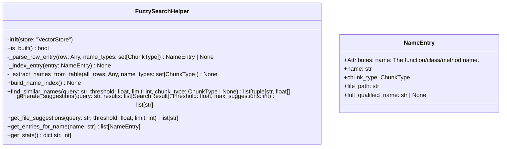

# File: `src/local_deepwiki/core/fuzzy_search.py`

## File Overview

This file provides fuzzy text matching capabilities to enhance code search functionality, particularly in conjunction with vector similarity search. It enables more robust and user-friendly search by leveraging fuzzy algorithms to match queries against code identifiers and content, improving result relevance.

The module supports:
- Fuzzy matching of function, class, and method names
- Generating "Did you mean?" suggestions
- Re-ranking search results using a combination of vector similarity and fuzzy scores
- Filtering results by file path patterns
- Extracting highlight snippets around matches

The design rationale is to improve search quality when exact matches are not found, especially in large codebases where typos, naming variations, or partial matches are common.

## Key Concepts

### Fuzzy Matching Algorithms
The module uses `rapidfuzz` for efficient fuzzy string matching. It combines multiple algorithms:
- `token_set_ratio`: Handles word order and duplicates well
- `partial_ratio`: Good for substring matching
- `WRatio`: A weighted combination that balances various fuzzy matching aspects

These are chosen for their performance and ability to handle real-world code search scenarios, including typos, naming variations, and partial matches.

### Name Indexing and Caching
The `FuzzySearchHelper` class builds an internal index of function/class/method names from the vector store. This index is cached and optimized for fast lookup, enabling efficient fuzzy matching across large codebases. The index supports:
- Lookup by chunk type (function, class, etc.)
- Fully qualified names for methods
- Efficient name-to-entry mapping

This caching strategy trades memory for speed, which is crucial for interactive search experiences.

### Re-ranking with Fuzzy Scores
The `rerank_with_fuzzy` function combines vector similarity scores with fuzzy scores from:
- Code name matching
- Content matching (first 500 characters)
- Docstring matching

This approach ensures that even if vector search doesn't find the exact match, results that are semantically close or have strong name/content matches are boosted in rank.

### Path Pattern Matching
The `matches_path_pattern` function supports glob-like patterns with support for `**` (recursive directory matching). This allows users to filter search results by file paths, enhancing the precision of search results.

## Integration

This module is a core part of the search infrastructure, integrating with:
- [`VectorStore`](vectorstore/store.md) (via `FuzzySearchHelper`) to build name indexes
- [`SearchResult`](../handlers/types.md) and [`ChunkType`](../models/foundation.md) models for result handling
- `search_engine`, `search_postprocess`, and other search components that call `FuzzySearchHelper` methods

The `FuzzySearchHelper` class is used by `FuzzySearchHelper` and is called by search components to:
- Build name indexes
- Generate suggestions
- Re-rank results
- Filter by path patterns

Functions like `fuzzy_score`, `fuzzy_match_name`, and `rerank_with_fuzzy` are used by search logic and tests to improve search quality and handle edge cases.

## Design Notes

### Trade-offs
- **Memory vs. Speed**: The name index uses multiple internal data structures (`_name_cache`, `_name_to_entries`, `_all_names`) to balance lookup performance and memory usage. This is a trade-off to ensure fast fuzzy matching without excessive memory consumption.
- **Fuzzy Scoring Weighting**: The `rerank_with_fuzzy` function weights different fuzzy components differently:
  - Name match gets full weight (1.0)
  - Docstring match gets 0.8 weight
  - Content match gets 0.7 weight
  This prioritizes identifier matching, which is often more meaningful in code search.

### Edge Cases Handled
- **Empty or invalid inputs**: Functions like `fuzzy_score` and `fuzzy_match_name` check for empty inputs and return 0.0 to avoid errors.
- **Invalid chunk types**: During indexing, [`ChunkType`](../models/foundation.md) conversion is wrapped in a try-except to skip invalid rows.
- **Path pattern matching**: The `matches_path_pattern` function handles `**` patterns using regex, ensuring recursive directory matching works correctly.
- **Duplicate results**: In `find_similar_names`, results are deduplicated using a `seen_names` set to prevent repeated suggestions.

### Non-obvious Implementation Choices
- **Fuzzy score normalization**: All `rapidfuzz` scores are normalized from 0-100 to 0.0-1.0 to maintain consistent scoring across functions.
- **Content length limits**: In `rerank_with_fuzzy`, content is limited to 500 characters to balance performance and relevance.
- **Weighted scoring in `fuzzy_match_name`**: A fallback to `fuzzy_score` is used with a reduced weight (0.6) to ensure that even non-ideal matches are considered.
- **Placeholder replacement for regex**: In `matches_path_pattern`, `**` patterns are converted to regex using placeholders to avoid replacement conflicts with `*` patterns.

## API Reference

### class `NameEntry`

An indexed name entry for fuzzy matching.  Attributes: name: The function/class/method name. chunk_type: The type of chunk (function, class, method, etc.). file_path: Path to the file containing this name. full_qualified_name: Optional fully qualified name (e.g., "ClassName.method_name").


<details>
<summary>View Source (lines 287-300) | <a href="https://github.com/UrbanDiver/local-deepwiki-mcp/blob/main/src/local_deepwiki/core/fuzzy_search.py#L287-L300">GitHub</a></summary>

```python
class NameEntry:
    """An indexed name entry for fuzzy matching.

    Attributes:
        name: The function/class/method name.
        chunk_type: The type of chunk (function, class, method, etc.).
        file_path: Path to the file containing this name.
        full_qualified_name: Optional fully qualified name (e.g., "ClassName.method_name").
    """

    name: str
    chunk_type: ChunkType
    file_path: str
    full_qualified_name: str | None = None
```

</details>

### class `FuzzySearchHelper`

Helper class for fuzzy code search with "Did you mean?" suggestions.  This class maintains an index of all function/class/method names in the codebase and provides fast fuzzy matching using Levenshtein distance.

**Methods:**


<details>
<summary>View Source (lines 303-687) | <a href="https://github.com/UrbanDiver/local-deepwiki-mcp/blob/main/src/local_deepwiki/core/fuzzy_search.py#L303-L687">GitHub</a></summary>

```python
class FuzzySearchHelper:
    # Methods: __init__, is_built, _parse_row_entry, _index_entry, _extract_names_from_table, build_name_index, find_similar_names, generate_suggestions, get_file_suggestions, get_entries_for_name, get_stats
```

</details>

#### `__init__`

```python
def __init__(store: "VectorStore")
```

Initialize the fuzzy search helper.


| Parameter | Type | Default | Description |
|-----------|------|---------|-------------|
| `store` | `"VectorStore"` | - | The VectorStore instance to index names from. |


<details>
<summary>View Source (lines 324-338) | <a href="https://github.com/UrbanDiver/local-deepwiki-mcp/blob/main/src/local_deepwiki/core/fuzzy_search.py#L324-L338">GitHub</a></summary>

```python
def __init__(self, store: "VectorStore"):
        """Initialize the fuzzy search helper.

        Args:
            store: The VectorStore instance to index names from.
        """
        self._store = store
        self._name_cache: dict[str, list[NameEntry]] = {}  # chunk_type -> entries
        self._all_names: list[
            str
        ] = []  # Flat list of all names for rapid fuzzy matching
        self._name_to_entries: dict[
            str, list[NameEntry]
        ] = {}  # name -> entries mapping
        self._is_built = False
```

</details>

#### `is_built`

```python
def is_built() -> bool
```

Check if the name index has been built.


<details>
<summary>View Source (lines 341-343) | <a href="https://github.com/UrbanDiver/local-deepwiki-mcp/blob/main/src/local_deepwiki/core/fuzzy_search.py#L341-L343">GitHub</a></summary>

```python
def is_built(self) -> bool:
        """Check if the name index has been built."""
        return self._is_built
```

</details>

#### `build_name_index`

```python
async def build_name_index() -> None
```

Build an index of all function/class/method names for fuzzy matching.  This method iterates over all chunks in the vector store and extracts names for functions, classes, methods, and modules. The index is used for fast fuzzy matching and suggestion generation.


<details>
<summary>View Source (lines 424-455) | <a href="https://github.com/UrbanDiver/local-deepwiki-mcp/blob/main/src/local_deepwiki/core/fuzzy_search.py#L424-L455">GitHub</a></summary>

```python
async def build_name_index(self) -> None:
        """Build an index of all function/class/method names for fuzzy matching.

        This method iterates over all chunks in the vector store and extracts
        names for functions, classes, methods, and modules. The index is used
        for fast fuzzy matching and suggestion generation.
        """
        self._name_cache.clear()
        self._all_names.clear()
        self._name_to_entries.clear()

        table = self._store._get_table()
        if table is None:
            self._is_built = True
            return

        name_types = {
            ChunkType.FUNCTION,
            ChunkType.CLASS,
            ChunkType.METHOD,
            ChunkType.MODULE,
        }

        try:
            all_rows = table.to_pandas()
            self._extract_names_from_table(all_rows, name_types)
        except (ImportError, ValueError, RuntimeError, OSError) as e:
            logger.warning("Failed to build fuzzy search index: %s", e)
            self._is_built = False
            return

        self._is_built = True
```

</details>

#### `find_similar_names`

```python
def find_similar_names(query: str, threshold: float = 0.6, limit: int = 5, chunk_type: ChunkType | None = None) -> list[tuple[str, float]]
```

Find similar names using Levenshtein distance.  Uses rapidfuzz for efficient fuzzy string matching.


| Parameter | Type | Default | Description |
|-----------|------|---------|-------------|
| `query` | `str` | - | The query string to match against. |
| `threshold` | `float` | `0.6` | Minimum similarity score (0.0-1.0) for inclusion. |
| `limit` | `int` | `5` | Maximum number of results to return. |
| `chunk_type` | `ChunkType | None` | `None` | Optional filter by chunk type. |


<details>
<summary>View Source (lines 457-533) | <a href="https://github.com/UrbanDiver/local-deepwiki-mcp/blob/main/src/local_deepwiki/core/fuzzy_search.py#L457-L533">GitHub</a></summary>

```python
def find_similar_names(
        self,
        query: str,
        threshold: float = 0.6,
        limit: int = 5,
        chunk_type: ChunkType | None = None,
    ) -> list[tuple[str, float]]:
        """Find similar names using Levenshtein distance.

        Uses rapidfuzz for efficient fuzzy string matching.

        Args:
            query: The query string to match against.
            threshold: Minimum similarity score (0.0-1.0) for inclusion.
            limit: Maximum number of results to return.
            chunk_type: Optional filter by chunk type.

        Returns:
            List of (name, score) tuples sorted by score descending.
            Scores are normalized to 0.0-1.0 range.
        """
        if not query or not self._all_names:
            return []

        # Get the candidates to search
        if chunk_type is not None and chunk_type.value in self._name_cache:
            candidates = [e.name for e in self._name_cache[chunk_type.value]]
            # Also include fully qualified names for methods
            if chunk_type == ChunkType.METHOD:
                candidates.extend(
                    e.full_qualified_name
                    for e in self._name_cache.get(chunk_type.value, [])
                    if e.full_qualified_name
                )
        else:
            candidates = self._all_names

        if not candidates:
            return []

        # Use rapidfuzz's extract function for efficient batch matching
        # The scorer uses a combination of token_set_ratio and partial_ratio
        # which handles typos well
        query_lower = query.lower()

        # Use process.extract with custom scorer
        matches = process.extract(
            query_lower,
            [c.lower() for c in candidates],
            scorer=fuzz.WRatio,  # Weighted ratio - good for typos
            limit=limit * 2,  # Get more results to filter by threshold
        )

        # Map back to original case and filter by threshold
        results: list[tuple[str, float]] = []
        seen_names: set[str] = set()

        for match in matches:
            matched_lower, score, idx = match
            # Normalize score to 0-1 range (rapidfuzz returns 0-100)
            normalized_score = score / 100.0

            if normalized_score < threshold:
                continue

            # Get original case name
            original_name = candidates[idx]
            if original_name in seen_names:
                continue

            seen_names.add(original_name)
            results.append((original_name, normalized_score))

            if len(results) >= limit:
                break

        return results
```

</details>

#### `generate_suggestions`

```python
def generate_suggestions(query: str, results: list[SearchResult], threshold: float = 0.6, max_suggestions: int = 3) -> list[str]
```

Generate 'Did you mean?' suggestions based on the query.  This method analyzes the query and current results to suggest alternative names that the user might have meant to search for.


| Parameter | Type | Default | Description |
|-----------|------|---------|-------------|
| `query` | `str` | - | The original search query. |
| `results` | `list[SearchResult]` | - | The current search results (may be empty or low-quality). |
| `threshold` | `float` | `0.6` | Minimum similarity for suggestions. |
| `max_suggestions` | `int` | `3` | Maximum number of suggestions to return. |


<details>
<summary>View Source (lines 535-604) | <a href="https://github.com/UrbanDiver/local-deepwiki-mcp/blob/main/src/local_deepwiki/core/fuzzy_search.py#L535-L604">GitHub</a></summary>

```python
def generate_suggestions(
        self,
        query: str,
        results: list[SearchResult],
        threshold: float = 0.6,
        max_suggestions: int = 3,
    ) -> list[str]:
        """Generate 'Did you mean?' suggestions based on the query.

        This method analyzes the query and current results to suggest
        alternative names that the user might have meant to search for.

        Args:
            query: The original search query.
            results: The current search results (may be empty or low-quality).
            threshold: Minimum similarity for suggestions.
            max_suggestions: Maximum number of suggestions to return.

        Returns:
            List of suggested names, ordered by relevance.
        """
        if not query:
            return []

        # Extract key terms from the query
        # Split on common delimiters and filter short words
        query_terms = re.split(r"[\s_\-\.]+", query.lower())
        query_terms = [t for t in query_terms if len(t) >= 2]

        if not query_terms:
            query_terms = [query.lower()]

        suggestions: list[tuple[str, float]] = []
        seen: set[str] = set()

        # Get names from current results to exclude
        result_names = {r.chunk.name for r in results if r.chunk.name}

        # Find similar names for each query term
        for term in query_terms:
            similar = self.find_similar_names(
                term,
                threshold=threshold,
                limit=max_suggestions * 2,
            )

            for name, score in similar:
                # Skip names already in results or already suggested
                if name in result_names or name in seen:
                    continue

                seen.add(name)
                suggestions.append((name, score))

        # Also try the full query as a single term
        full_query_similar = self.find_similar_names(
            query,
            threshold=threshold,
            limit=max_suggestions,
        )

        for name, score in full_query_similar:
            if name not in result_names and name not in seen:
                seen.add(name)
                # Boost score for full query matches
                suggestions.append((name, score * 1.1))

        # Sort by score descending and limit
        suggestions = sorted(suggestions, key=itemgetter(1), reverse=True)
        return [name for name, _ in suggestions[:max_suggestions]]
```

</details>

#### `get_file_suggestions`

```python
def get_file_suggestions(query: str, threshold: float = 0.6, limit: int = 3) -> list[str]
```

Get file path suggestions based on a query.  Useful when the user might be searching for a specific file.


| Parameter | Type | Default | Description |
|-----------|------|---------|-------------|
| `query` | `str` | - | The query to match against file paths. |
| `threshold` | `float` | `0.6` | Minimum similarity for suggestions. |
| `limit` | `int` | `3` | Maximum number of suggestions. |


<details>
<summary>View Source (lines 606-660) | <a href="https://github.com/UrbanDiver/local-deepwiki-mcp/blob/main/src/local_deepwiki/core/fuzzy_search.py#L606-L660">GitHub</a></summary>

```python
def get_file_suggestions(
        self,
        query: str,
        threshold: float = 0.6,
        limit: int = 3,
    ) -> list[str]:
        """Get file path suggestions based on a query.

        Useful when the user might be searching for a specific file.

        Args:
            query: The query to match against file paths.
            threshold: Minimum similarity for suggestions.
            limit: Maximum number of suggestions.

        Returns:
            List of suggested file paths.
        """
        if not self._name_to_entries:
            return []

        # Collect unique file paths
        file_paths = {
            entry.file_path
            for entry in chain.from_iterable(self._name_to_entries.values())
            if entry.file_path
        }

        if not file_paths:
            return []

        # Extract filename from query if it looks like a path
        query_name = Path(query).name if "/" in query or "\\" in query else query
        query_lower = query_name.lower()

        # Match against file names
        matches = process.extract(
            query_lower,
            [Path(fp).name.lower() for fp in file_paths],
            scorer=fuzz.WRatio,
            limit=limit * 2,
        )

        # Map back to full paths
        file_paths_list = list(file_paths)
        results: list[str] = []

        for match in matches:
            _, score, idx = match
            if score / 100.0 >= threshold:
                results.append(file_paths_list[idx])
                if len(results) >= limit:
                    break

        return results
```

</details>

#### `get_entries_for_name`

```python
def get_entries_for_name(name: str) -> list[NameEntry]
```

Get all entries for a given name.


| Parameter | Type | Default | Description |
|-----------|------|---------|-------------|
| `name` | `str` | - | The name to look up. |


<details>
<summary>View Source (lines 662-671) | <a href="https://github.com/UrbanDiver/local-deepwiki-mcp/blob/main/src/local_deepwiki/core/fuzzy_search.py#L662-L671">GitHub</a></summary>

```python
def get_entries_for_name(self, name: str) -> list[NameEntry]:
        """Get all entries for a given name.

        Args:
            name: The name to look up.

        Returns:
            List of NameEntry objects for this name, or empty list if not found.
        """
        return self._name_to_entries.get(name, [])
```

</details>

#### `get_stats`

```python
def get_stats() -> dict[str, int]
```

Get statistics about the name index.


---


<details>
<summary>View Source (lines 673-687) | <a href="https://github.com/UrbanDiver/local-deepwiki-mcp/blob/main/src/local_deepwiki/core/fuzzy_search.py#L673-L687">GitHub</a></summary>

```python
def get_stats(self) -> dict[str, int]:
        """Get statistics about the name index.

        Returns:
            Dictionary with counts of indexed names by type.
        """
        stats = {
            "total_names": len(self._all_names),
            "unique_names": len(self._name_to_entries),
        }

        for chunk_type, entries in self._name_cache.items():
            stats[f"{chunk_type}_count"] = len(entries)

        return stats
```

</details>

### Functions

#### `fuzzy_score`

```python
def fuzzy_score(query: str, text: str) -> float
```

Calculate fuzzy match score between query and text.  Uses a combination of fuzzy matching algorithms for best results: - token_set_ratio: Good for matching when words are out of order - partial_ratio: Good for matching substrings


| Parameter | Type | Default | Description |
|-----------|------|---------|-------------|
| `query` | `str` | - | The search query. |
| `text` | `str` | - | The text to match against. |

**Returns:** `float`


<details>
<summary>View Source (lines 34-63) | <a href="https://github.com/UrbanDiver/local-deepwiki-mcp/blob/main/src/local_deepwiki/core/fuzzy_search.py#L34-L63">GitHub</a></summary>

```python
def fuzzy_score(query: str, text: str) -> float:
    """Calculate fuzzy match score between query and text.

    Uses a combination of fuzzy matching algorithms for best results:
    - token_set_ratio: Good for matching when words are out of order
    - partial_ratio: Good for matching substrings

    Args:
        query: The search query.
        text: The text to match against.

    Returns:
        Similarity score between 0.0 and 1.0.
    """
    if not query or not text:
        return 0.0

    # Normalize inputs
    query_lower = query.lower()
    text_lower = text.lower()

    # Use weighted combination of fuzzy algorithms
    # token_set_ratio handles word order and duplicates well
    token_score = fuzz.token_set_ratio(query_lower, text_lower)
    # partial_ratio handles substring matching well
    partial_score = fuzz.partial_ratio(query_lower, text_lower)

    # Combine scores (weighted average, partial gets more weight for code search)
    combined = (token_score * 0.4 + partial_score * 0.6) / 100.0
    return combined
```

</details>

#### `fuzzy_match_name`

```python
def fuzzy_match_name(query: str, name: str | None) -> float
```

Calculate fuzzy match score for function/class names.  Optimized for code identifier matching with special handling for: - snake_case and camelCase names - Exact prefix matches - Word boundary matches


| Parameter | Type | Default | Description |
|-----------|------|---------|-------------|
| `query` | `str` | - | The search query. |
| `name` | `str | None` | - | The name to match (function, class, method name). |

**Returns:** `float`


<details>
<summary>View Source (lines 66-111) | <a href="https://github.com/UrbanDiver/local-deepwiki-mcp/blob/main/src/local_deepwiki/core/fuzzy_search.py#L66-L111">GitHub</a></summary>

```python
def fuzzy_match_name(query: str, name: str | None) -> float:
    """Calculate fuzzy match score for function/class names.

    Optimized for code identifier matching with special handling for:
    - snake_case and camelCase names
    - Exact prefix matches
    - Word boundary matches

    Args:
        query: The search query.
        name: The name to match (function, class, method name).

    Returns:
        Similarity score between 0.0 and 1.0.
    """
    if not name or not query:
        return 0.0

    query_lower = query.lower()
    name_lower = name.lower()

    # Exact match gets highest score
    if query_lower == name_lower:
        return 1.0

    # Prefix match gets high score
    if name_lower.startswith(query_lower):
        return 0.95

    # Contains match gets good score
    if query_lower in name_lower:
        return 0.85

    # Split name by common separators (snake_case, camelCase)
    name_parts = re.split(r"[_\-\s]|(?<=[a-z])(?=[A-Z])", name)
    name_parts_lower = [p.lower() for p in name_parts if p]

    # Check if query matches any part
    for part in name_parts_lower:
        if part.startswith(query_lower):
            return 0.8
        if query_lower in part:
            return 0.7

    # Fall back to fuzzy matching
    return fuzzy_score(query, name) * 0.6
```

</details>

#### `matches_path_pattern`

```python
def matches_path_pattern(file_path: str, pattern: str) -> bool
```

Check if a file path matches a glob-like pattern.  Supports patterns like: - "*.py" - matches Python files - "src/**/*.py" - matches Python files in src and subdirectories - "tests/*" - matches files directly in tests directory


| Parameter | Type | Default | Description |
|-----------|------|---------|-------------|
| `file_path` | `str` | - | The file path to check. |
| `pattern` | `str` | - | Glob-like pattern to match against. |

**Returns:** `bool`


<details>
<summary>View Source (lines 114-152) | <a href="https://github.com/UrbanDiver/local-deepwiki-mcp/blob/main/src/local_deepwiki/core/fuzzy_search.py#L114-L152">GitHub</a></summary>

```python
def matches_path_pattern(file_path: str, pattern: str) -> bool:
    """Check if a file path matches a glob-like pattern.

    Supports patterns like:
    - "*.py" - matches Python files
    - "src/**/*.py" - matches Python files in src and subdirectories
    - "tests/*" - matches files directly in tests directory

    Args:
        file_path: The file path to check.
        pattern: Glob-like pattern to match against.

    Returns:
        True if the path matches the pattern.
    """
    if not pattern:
        return True

    # Normalize path separators
    file_path = file_path.replace("\\", "/")
    pattern = pattern.replace("\\", "/")

    # Handle ** (match any number of directories)
    if "**" in pattern:
        # Convert to regex using placeholders to avoid replacement conflicts
        regex_pattern = pattern.replace(".", r"\.")
        # Use placeholders for ** patterns before replacing single *
        regex_pattern = regex_pattern.replace("**/", "\x00DSTAR_SLASH\x00")
        regex_pattern = regex_pattern.replace("**", "\x00DSTAR\x00")
        # Now safely replace single * (won't affect placeholders)
        regex_pattern = regex_pattern.replace("*", "[^/]*")
        # Replace placeholders with actual regex
        regex_pattern = regex_pattern.replace("\x00DSTAR_SLASH\x00", "(?:.*/)?")
        regex_pattern = regex_pattern.replace("\x00DSTAR\x00", ".*")
        regex_pattern = f"^{regex_pattern}$"
        return bool(re.match(regex_pattern, file_path))

    # Use fnmatch for simple patterns
    return fnmatch.fnmatch(file_path, pattern)
```

</details>

#### `rerank_with_fuzzy`

```python
def rerank_with_fuzzy(results: list[SearchResult], query: str, fuzzy_weight: float = 0.3) -> list[SearchResult]
```

Re-rank search results by combining vector similarity with fuzzy matching.  This improves search results by boosting results where the query matches the code name or content more precisely.


| Parameter | Type | Default | Description |
|-----------|------|---------|-------------|
| `results` | `list[SearchResult]` | - | List of search results from vector search. |
| `query` | `str` | - | The original search query. |
| `fuzzy_weight` | `float` | `0.3` | Weight for fuzzy score (0.0-1.0). Vector score gets (1 - fuzzy_weight). |

**Returns:** `list[SearchResult]`


<details>
<summary>View Source (lines 155-216) | <a href="https://github.com/UrbanDiver/local-deepwiki-mcp/blob/main/src/local_deepwiki/core/fuzzy_search.py#L155-L216">GitHub</a></summary>

```python
def rerank_with_fuzzy(
    results: list[SearchResult],
    query: str,
    fuzzy_weight: float = 0.3,
) -> list[SearchResult]:
    """Re-rank search results by combining vector similarity with fuzzy matching.

    This improves search results by boosting results where the query
    matches the code name or content more precisely.

    Args:
        results: List of search results from vector search.
        query: The original search query.
        fuzzy_weight: Weight for fuzzy score (0.0-1.0). Vector score gets (1 - fuzzy_weight).

    Returns:
        Re-ranked list of search results with updated scores.
    """
    if not results:
        return results

    if fuzzy_weight <= 0:
        # No fuzzy reranking, but still ensure sorted by original score
        return sorted(results, key=lambda r: r.score, reverse=True)

    reranked = []
    for result in results:
        chunk = result.chunk
        vector_score = result.score

        # Calculate fuzzy scores
        name_fuzzy = fuzzy_match_name(query, chunk.name)

        # Also check content for the query
        content_fuzzy = fuzzy_score(query, chunk.content[:500])  # Limit content length

        # Also check docstring if present
        docstring_fuzzy = (
            fuzzy_score(query, chunk.docstring or "") if chunk.docstring else 0.0
        )

        # Combined fuzzy score (weighted)
        fuzzy_combined = max(
            name_fuzzy * 1.0,  # Name match is most important
            content_fuzzy * 0.7,  # Content match
            docstring_fuzzy * 0.8,  # Docstring match
        )

        # Combine vector and fuzzy scores
        final_score = (1 - fuzzy_weight) * vector_score + fuzzy_weight * fuzzy_combined

        reranked.append(
            SearchResult(
                chunk=chunk,
                score=final_score,
                highlights=result.highlights,
            )
        )

    # Sort by combined score (descending)
    reranked = sorted(reranked, key=attrgetter("score"), reverse=True)
    return reranked
```

</details>

#### `extract_highlights`

```python
def extract_highlights(content: str, query: str, context_chars: int = 50) -> list[str]
```

Extract highlighted snippets around query matches.


| Parameter | Type | Default | Description |
|-----------|------|---------|-------------|
| `content` | `str` | - | The content to search in. |
| `query` | `str` | - | The search query. |
| `context_chars` | `int` | `50` | Number of characters to include around each match. |

**Returns:** `list[str]`


<details>
<summary>View Source (lines 219-264) | <a href="https://github.com/UrbanDiver/local-deepwiki-mcp/blob/main/src/local_deepwiki/core/fuzzy_search.py#L219-L264">GitHub</a></summary>

```python
def extract_highlights(content: str, query: str, context_chars: int = 50) -> list[str]:
    """Extract highlighted snippets around query matches.

    Args:
        content: The content to search in.
        query: The search query.
        context_chars: Number of characters to include around each match.

    Returns:
        List of highlight snippets with matches marked.
    """
    if not query or not content:
        return []

    highlights = []
    query_lower = query.lower()
    content_lower = content.lower()

    # Find all occurrences
    start = 0
    while True:
        pos = content_lower.find(query_lower, start)
        if pos == -1:
            break

        # Extract context around the match
        ctx_start = max(0, pos - context_chars)
        ctx_end = min(len(content), pos + len(query) + context_chars)

        # Build highlight
        snippet = content[ctx_start:ctx_end]

        # Add ellipsis if truncated
        if ctx_start > 0:
            snippet = "..." + snippet
        if ctx_end < len(content):
            snippet = snippet + "..."

        highlights.append(snippet)
        start = pos + 1

        # Limit number of highlights
        if len(highlights) >= 3:
            break

    return highlights
```

</details>

#### `filter_by_path`

```python
def filter_by_path(results: list[SearchResult], path_pattern: str | None) -> list[SearchResult]
```

Filter search results by file path pattern.


| Parameter | Type | Default | Description |
|-----------|------|---------|-------------|
| `results` | `list[SearchResult]` | - | List of search results. |
| `path_pattern` | `str | None` | - | Glob-like pattern to filter by (e.g., "src/**/*.py"). |

**Returns:** `list[SearchResult]`


<details>
<summary>View Source (lines 267-283) | <a href="https://github.com/UrbanDiver/local-deepwiki-mcp/blob/main/src/local_deepwiki/core/fuzzy_search.py#L267-L283">GitHub</a></summary>

```python
def filter_by_path(
    results: list[SearchResult],
    path_pattern: str | None,
) -> list[SearchResult]:
    """Filter search results by file path pattern.

    Args:
        results: List of search results.
        path_pattern: Glob-like pattern to filter by (e.g., "src/**/*.py").

    Returns:
        Filtered list of search results.
    """
    if not path_pattern:
        return results

    return [r for r in results if matches_path_pattern(r.chunk.file_path, path_pattern)]
```

</details>

#### `should_auto_enable_fuzzy`

```python
def should_auto_enable_fuzzy(results: list[SearchResult], threshold: float = 0.5) -> bool
```

Determine if fuzzy matching should be auto-enabled based on result quality.


| Parameter | Type | Default | Description |
|-----------|------|---------|-------------|
| `results` | `list[SearchResult]` | - | Current search results. |
| `threshold` | `float` | `0.5` | Score threshold below which to enable fuzzy. |

**Returns:** `bool`


<details>
<summary>View Source (lines 690-708) | <a href="https://github.com/UrbanDiver/local-deepwiki-mcp/blob/main/src/local_deepwiki/core/fuzzy_search.py#L690-L708">GitHub</a></summary>

```python
def should_auto_enable_fuzzy(
    results: list[SearchResult],
    threshold: float = 0.5,
) -> bool:
    """Determine if fuzzy matching should be auto-enabled based on result quality.

    Args:
        results: Current search results.
        threshold: Score threshold below which to enable fuzzy.

    Returns:
        True if fuzzy should be enabled (results are poor quality).
    """
    if not results:
        return True

    # Check if the best result score is below threshold
    best_score = max(r.score for r in results)
    return best_score < threshold
```

</details>

## Class Diagram



## Call Graph

```mermaid
flowchart TD
    N0[ChunkType]
    N1[FuzzySearchHelper._extract_...]
    N2[FuzzySearchHelper._parse_ro...]
    N3[FuzzySearchHelper.build_nam...]
    N4[FuzzySearchHelper.find_simi...]
    N5[FuzzySearchHelper.generate_...]
    N6[FuzzySearchHelper.get_file_...]
    N7[NameEntry]
    N8[SearchResult]
    N9[_extract_names_from_table]
    N10[_get_table]
    N11[_index_entry]
    N12[_parse_row_entry]
    N13[add]
    N14[attrgetter]
    N15[extract]
    N16[filter_by_path]
    N17[find_similar_names]
    N18[fnmatch]
    N19[from_iterable]
    N20[fuzzy_match_name]
    N21[fuzzy_score]
    N22[itemgetter]
    N23[iterrows]
    N24[match]
    N25[matches_path_pattern]
    N26[partial_ratio]
    N27[rerank_with_fuzzy]
    N28[to_pandas]
    N29[token_set_ratio]
    N21 --> N29
    N21 --> N26
    N20 --> N21
    N25 --> N24
    N25 --> N18
    N27 --> N20
    N27 --> N21
    N27 --> N8
    N27 --> N14
    N16 --> N25
    N2 --> N0
    N2 --> N7
    N1 --> N23
    N1 --> N12
    N1 --> N11
    N3 --> N10
    N3 --> N28
    N3 --> N9
    N4 --> N15
    N4 --> N13
    N5 --> N17
    N5 --> N13
    N5 --> N22
    N6 --> N19
    N6 --> N15
    classDef func fill:#e1f5fe
    class N0,N7,N8,N9,N10,N11,N12,N13,N14,N15,N16,N17,N18,N19,N20,N21,N22,N23,N24,N25,N26,N27,N28,N29 func
    classDef method fill:#fff3e0
    class N1,N2,N3,N4,N5,N6 method
```



## Used By

Functions and methods in this file and their callers:

- **[`ChunkType`](../models/foundation.md)**: called by `FuzzySearchHelper._parse_row_entry`
- **`NameEntry`**: called by `FuzzySearchHelper._parse_row_entry`
- **`Path`**: called by `FuzzySearchHelper.get_file_suggestions`
- **[`SearchResult`](../handlers/types.md)**: called by `rerank_with_fuzzy`
- **`_extract_names_from_table`**: called by `FuzzySearchHelper.build_name_index`
- **`_get_table`**: called by `FuzzySearchHelper.build_name_index`
- **`_index_entry`**: called by `FuzzySearchHelper._extract_names_from_table`
- **`_parse_row_entry`**: called by `FuzzySearchHelper._extract_names_from_table`
- **`add`**: called by `FuzzySearchHelper.find_similar_names`, [`FuzzySearchHelper.generate_suggestions`](vectorstore/search_postprocess.md)
- **`attrgetter`**: called by `rerank_with_fuzzy`
- **`extract`**: called by `FuzzySearchHelper.find_similar_names`, `FuzzySearchHelper.get_file_suggestions`
- **`find_similar_names`**: called by [`FuzzySearchHelper.generate_suggestions`](vectorstore/search_postprocess.md)
- **`fnmatch`**: called by `matches_path_pattern`
- **`from_iterable`**: called by `FuzzySearchHelper.get_file_suggestions`
- **`fuzzy_match_name`**: called by `rerank_with_fuzzy`
- **`fuzzy_score`**: called by `fuzzy_match_name`, `rerank_with_fuzzy`
- **`itemgetter`**: called by [`FuzzySearchHelper.generate_suggestions`](vectorstore/search_postprocess.md)
- **`iterrows`**: called by `FuzzySearchHelper._extract_names_from_table`
- **`match`**: called by `matches_path_pattern`
- **`matches_path_pattern`**: called by `filter_by_path`
- **`partial_ratio`**: called by `fuzzy_score`
- **`to_pandas`**: called by `FuzzySearchHelper.build_name_index`
- **`token_set_ratio`**: called by `fuzzy_score`

## Usage Examples

*Examples extracted from test files*

### Test exact match returns high score

From `test_fuzzy_search.py::TestFuzzyScore::test_exact_match`:

```python
score = fuzzy_score("calculate", "calculate")
assert score >= 0.9
```

### Test partial match returns good score

From `test_fuzzy_search.py::TestFuzzyScore::test_partial_match`:

```python
score = fuzzy_score("calc", "calculate the sum")
assert score >= 0.5
```

### Test exact match returns 1.0

From `test_fuzzy_search.py::TestFuzzyMatchName::test_exact_match`:

```python
assert fuzzy_match_name("calculate", "calculate") == 1.0
```

### Test prefix match returns high score

From `test_fuzzy_search.py::TestFuzzyMatchName::test_prefix_match`:

```python
score = fuzzy_match_name("calc", "calculate_sum")
assert score >= 0.8
```

### Test simple glob pattern

From `test_fuzzy_search.py::TestMatchesPathPattern::test_simple_glob`:

```python
assert matches_path_pattern("test.py", "*.py")
assert not matches_path_pattern("test.js", "*.py")
```


## Last Modified

| Entity | Type | Author | Date | Commit |
|--------|------|--------|------|--------|
| `FuzzySearchHelper` | class | Brian Breidenbach | 2 days ago | `d9b4ec4` refactor: decompose CC > 15... |
| `_parse_row_entry` | method | Brian Breidenbach | 2 days ago | `d9b4ec4` refactor: decompose CC > 15... |
| `_index_entry` | method | Brian Breidenbach | 2 days ago | `d9b4ec4` refactor: decompose CC > 15... |
| `_extract_names_from_table` | method | Brian Breidenbach | 2 days ago | `d9b4ec4` refactor: decompose CC > 15... |
| `build_name_index` | method | Brian Breidenbach | 1 week ago | `af244a5` refactor: split core hotspo... |
| `generate_suggestions` | method | Brian Breidenbach | Feb 21, 2026 | `e45a53a` refactor: apply Pythonic id... |
| `rerank_with_fuzzy` | function | Brian Breidenbach | Feb 21, 2026 | `e45a53a` refactor: apply Pythonic id... |
| `get_file_suggestions` | method | Brian Breidenbach | Feb 20, 2026 | `6be69f5` refactor: low-priority Pyth... |
| `__init__` | method | Brian Breidenbach | Feb 07, 2026 | `eb18eee` refactor: Fix remaining inc... |
| `get_entries_for_name` | method | Brian Breidenbach | Feb 07, 2026 | `eb18eee` refactor: Fix remaining inc... |
| `NameEntry` | class | Brian Breidenbach | Jan 26, 2026 | `dc57a7b` Add low-priority enhancemen... |
| `is_built` | method | Brian Breidenbach | Jan 26, 2026 | `dc57a7b` Add low-priority enhancemen... |
| `find_similar_names` | method | Brian Breidenbach | Jan 26, 2026 | `dc57a7b` Add low-priority enhancemen... |
| `get_stats` | method | Brian Breidenbach | Jan 26, 2026 | `dc57a7b` Add low-priority enhancemen... |
| `should_auto_enable_fuzzy` | function | Brian Breidenbach | Jan 26, 2026 | `dc57a7b` Add low-priority enhancemen... |
| `fuzzy_score` | function | Brian Breidenbach | Jan 24, 2026 | `fa2feb8` Add CLI progress bars and f... |
| `fuzzy_match_name` | function | Brian Breidenbach | Jan 24, 2026 | `fa2feb8` Add CLI progress bars and f... |
| `matches_path_pattern` | function | Brian Breidenbach | Jan 24, 2026 | `fa2feb8` Add CLI progress bars and f... |
| `extract_highlights` | function | Brian Breidenbach | Jan 24, 2026 | `fa2feb8` Add CLI progress bars and f... |
| `filter_by_path` | function | Brian Breidenbach | Jan 24, 2026 | `fa2feb8` Add CLI progress bars and f... |

## Additional Source Code

Source code for functions and methods not listed in the API Reference above.

#### `_parse_row_entry`

<details>
<summary>View Source (lines 345-384) | <a href="https://github.com/UrbanDiver/local-deepwiki-mcp/blob/main/src/local_deepwiki/core/fuzzy_search.py#L345-L384">GitHub</a></summary>

```python
def _parse_row_entry(
        self,
        row: Any,
        name_types: set[ChunkType],
    ) -> NameEntry | None:
        """Parse a single table row into a NameEntry, or return None to skip.

        Args:
            row: A pandas Series representing one table row.
            name_types: Set of ChunkTypes whose names should be indexed.

        Returns:
            A NameEntry if the row should be indexed, or None to skip.
        """
        name = row.get("name")
        if not name or not isinstance(name, str) or not name.strip():
            return None

        chunk_type_str = row.get("chunk_type", "")
        try:
            chunk_type = ChunkType(chunk_type_str)
        except ValueError:
            return None

        if chunk_type not in name_types:
            return None

        file_path = row.get("file_path", "")
        parent_name = row.get("parent_name")
        full_qualified_name = (
            f"{parent_name}.{name}"
            if chunk_type == ChunkType.METHOD and parent_name
            else None
        )
        return NameEntry(
            name=name,
            chunk_type=chunk_type,
            file_path=file_path,
            full_qualified_name=full_qualified_name,
        )
```

</details>


#### `_index_entry`

<details>
<summary>View Source (lines 386-406) | <a href="https://github.com/UrbanDiver/local-deepwiki-mcp/blob/main/src/local_deepwiki/core/fuzzy_search.py#L386-L406">GitHub</a></summary>

```python
def _index_entry(self, entry: NameEntry) -> None:
        """Add a NameEntry to all internal index structures.

        Args:
            entry: The entry to register in _name_cache, _name_to_entries,
                and _all_names.
        """
        type_key = entry.chunk_type.value
        if type_key not in self._name_cache:
            self._name_cache[type_key] = []
        self._name_cache[type_key].append(entry)

        if entry.name not in self._name_to_entries:
            self._name_to_entries[entry.name] = []
            self._all_names.append(entry.name)
        self._name_to_entries[entry.name].append(entry)

        fqn = entry.full_qualified_name
        if fqn and fqn not in self._name_to_entries:
            self._name_to_entries[fqn] = [entry]
            self._all_names.append(fqn)
```

</details>


#### `_extract_names_from_table`

<details>
<summary>View Source (lines 408-422) | <a href="https://github.com/UrbanDiver/local-deepwiki-mcp/blob/main/src/local_deepwiki/core/fuzzy_search.py#L408-L422">GitHub</a></summary>

```python
def _extract_names_from_table(
        self,
        all_rows: Any,
        name_types: set[ChunkType],
    ) -> None:
        """Scan pandas rows and populate the internal name indexes.

        Args:
            all_rows: Pandas DataFrame returned by ``table.to_pandas()``.
            name_types: Set of ChunkTypes whose names should be indexed.
        """
        for _, row in all_rows.iterrows():
            entry = self._parse_row_entry(row, name_types)
            if entry is not None:
                self._index_entry(entry)
```

</details>

## Relevant Source Files

- `src/local_deepwiki/core/fuzzy_search.py:287-300`
