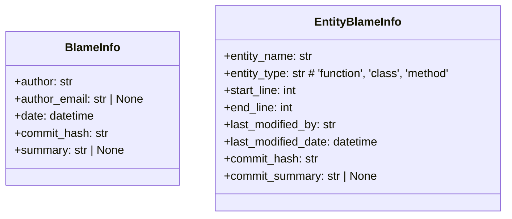
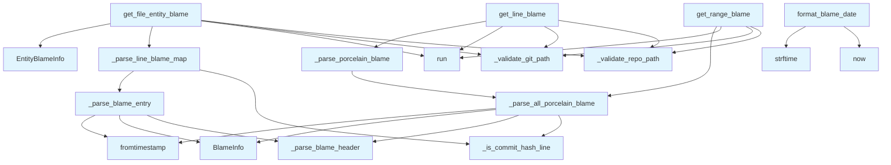

# File Overview

This file, `src/local_deepwiki/core/git_blame.py`, provides core functionality for retrieving and parsing Git blame information. It serves as a bridge between Git's blame command and the application's internal data structures, enabling features such as tracking code authorship, identifying last modified lines, and associating blame data with code entities.

The module is designed to integrate seamlessly with the broader `local_deepwiki` codebase, particularly in tools that analyze repository history or generate documentation that requires knowledge of code ownership and modification timelines.

# Key Concepts

## Blame Data Structures

The module defines two primary data classes:

- **`BlameInfo`**: Represents the metadata for a single line of code, including author, timestamp, commit hash, and commit summary.
- **`EntityBlameInfo`**: Encapsulates blame information for a code entity (e.g., function or class), providing start/end line numbers and the most recent modification details.

These structures are chosen to maintain a clean separation between raw Git data and the application's needs, enabling consistent data handling across different blame retrieval methods.

## Git Porcelain Parsing

The module relies on Git's `--porcelain` output format, which provides machine-readable blame data. This choice was made for robustness and consistency, as the porcelain format is designed to be stable and parseable, unlike the human-readable output.

The parsing logic handles both full and abbreviated commit headers. When a commit hash appears multiple times in the output (indicating multiple lines from the same commit), the module caches the full blame info and reuses it for subsequent lines, optimizing performance and avoiding redundant parsing.

## Efficient Batch Processing

The `get_file_entity_blame` function is designed to be more efficient than repeatedly calling `get_range_blame` for each entity. It performs a single Git blame command for the entire file and then maps line numbers to blame information, allowing for quick lookups when determining the most recent modification for each entity.

This approach reduces the number of subprocess calls and is especially beneficial when analyzing large files with many entities.

## Date Formatting

The `format_blame_date` utility provides a user-friendly way to display dates, converting timestamps into relative terms like "today", "yesterday", or "2 weeks ago" for recent dates, and falling back to formatted dates for older entries. This improves readability in user-facing interfaces.

# Integration

This file integrates with the `local_deepwiki.core.git_utils` module, which provides shared constants and validation utilities for Git paths and repositories. It also uses `local_deepwiki.logging` for debug-level logging.

The functions in this module are called by:
- `get_file_entity_blame` is used by `source_formatter`, suggesting it plays a role in generating source code documentation or annotations.
- `format_blame_date` is used by both `source_formatter` and `test_git_utils`, indicating it's part of the core formatting and testing infrastructure.
- Other functions like `_parse_all_porcelain_blame` and `_parse_line_blame_map` are used by `test_git_utils`, showing their role in unit testing Git parsing logic.

This integration supports the broader functionality of `local_deepwiki` by enabling features that require Git history analysis, such as source code documentation generation, code ownership tracking, and historical analysis tools.

# Design Notes

## Timeout Handling

Each Git subprocess call includes a timeout to prevent hanging on large repositories or slow systems. The timeouts are configurable via constants imported from `git_utils`:
- `GIT_BLAME_FILE_TIMEOUT` for full-file blame operations
- `GIT_BLAME_LINE_TIMEOUT` for single-line blame
- `GIT_BLAME_RANGE_TIMEOUT` for range-based blame

This ensures that the application remains responsive even under adverse conditions.

## Validation and Error Handling

The module validates both repository and file paths using functions from `git_utils`. This prevents accidental access to non-Git directories or invalid file paths. Errors during subprocess execution, timeouts, or path validation are caught and logged at the debug level, returning `None` or an empty list to indicate failure.

## Parsing Robustness

The parsing functions are designed to gracefully handle malformed or unexpected Git blame output. For example, if a commit header is missing expected fields, the parser skips that entry rather than crashing. This robustness is crucial when working with Git history from various sources or repositories with unusual configurations.

## Caching for Performance

In `_parse_line_blame_map`, a `commit_cache` is used to store previously parsed `BlameInfo` objects for reuse. This is essential because Git's porcelain output uses abbreviated headers for subsequent lines of the same commit, avoiding redundant parsing and improving performance for large files.

## Relative vs Absolute Paths

All file paths are validated relative to the repository root, ensuring that the module works correctly regardless of the current working directory when called. This design choice promotes reliability and prevents path-related bugs.

## API Reference

### class `BlameInfo`

Git blame information for a line or range.


<details>
<summary>View Source (lines 28-35) | <a href="https://github.com/UrbanDiver/local-deepwiki-mcp/blob/main/src/local_deepwiki/core/git_blame.py#L28-L35">GitHub</a></summary>

```python
class BlameInfo:
    """Git blame information for a line or range."""

    author: str
    author_email: str | None
    date: datetime
    commit_hash: str
    summary: str | None = None  # Commit message summary
```

</details>

### class `EntityBlameInfo`

Blame information for a code entity (function, class, method).

---


<details>
<summary>View Source (lines 39-49) | <a href="https://github.com/UrbanDiver/local-deepwiki-mcp/blob/main/src/local_deepwiki/core/git_blame.py#L39-L49">GitHub</a></summary>

```python
class EntityBlameInfo:
    """Blame information for a code entity (function, class, method)."""

    entity_name: str
    entity_type: str  # 'function', 'class', 'method'
    start_line: int
    end_line: int
    last_modified_by: str
    last_modified_date: datetime
    commit_hash: str
    commit_summary: str | None = None
```

</details>

### Functions

#### `get_line_blame`

```python
def get_line_blame(repo_path: Path, file_path: str, line_number: int) -> BlameInfo | None
```

Get git blame information for a specific line.


| Parameter | Type | Default | Description |
|-----------|------|---------|-------------|
| `repo_path` | `Path` | - | Path to the repository root. |
| `file_path` | `str` | - | Relative path to the file. |
| `line_number` | `int` | - | Line number to blame (1-indexed). |

**Returns:** `BlameInfo | None`


<details>
<summary>View Source (lines 52-102) | <a href="https://github.com/UrbanDiver/local-deepwiki-mcp/blob/main/src/local_deepwiki/core/git_blame.py#L52-L102">GitHub</a></summary>

```python
def get_line_blame(
    repo_path: Path,
    file_path: str,
    line_number: int,
) -> BlameInfo | None:
    """Get git blame information for a specific line.

    Args:
        repo_path: Path to the repository root.
        file_path: Relative path to the file.
        line_number: Line number to blame (1-indexed).

    Returns:
        BlameInfo or None if blame fails.
    """
    try:
        validated_repo = _validate_repo_path(repo_path)
        # Validate file_path relative to repo (construct full path for validation)
        full_file_path = validated_repo / file_path
        _validate_git_path(full_file_path)

        # Use porcelain format for easy parsing
        # Use -- separator to prevent option injection from file_path
        result = subprocess.run(
            [
                "git",
                "blame",
                "-L",
                f"{line_number},{line_number}",
                "--porcelain",
                "--",
                file_path,
            ],
            cwd=validated_repo,
            capture_output=True,
            text=True,
            timeout=GIT_BLAME_LINE_TIMEOUT,
        )
        if result.returncode != 0:
            return None

        return _parse_porcelain_blame(result.stdout)

    except (
        subprocess.TimeoutExpired,
        FileNotFoundError,
        OSError,
        GitPathValidationError,
    ) as e:
        logger.debug("Failed to get git blame: %s", e)
        return None
```

</details>

#### `get_range_blame`

```python
def get_range_blame(repo_path: Path, file_path: str, start_line: int, end_line: int) -> BlameInfo | None
```

Get the most recent blame information for a line range.  Returns the blame info for the most recently modified line in the range.


| Parameter | Type | Default | Description |
|-----------|------|---------|-------------|
| `repo_path` | `Path` | - | Path to the repository root. |
| `file_path` | `str` | - | Relative path to the file. |
| `start_line` | `int` | - | Starting line number (1-indexed). |
| `end_line` | `int` | - | Ending line number (1-indexed). |

**Returns:** `BlameInfo | None`


<details>
<summary>View Source (lines 105-164) | <a href="https://github.com/UrbanDiver/local-deepwiki-mcp/blob/main/src/local_deepwiki/core/git_blame.py#L105-L164">GitHub</a></summary>

```python
def get_range_blame(
    repo_path: Path,
    file_path: str,
    start_line: int,
    end_line: int,
) -> BlameInfo | None:
    """Get the most recent blame information for a line range.

    Returns the blame info for the most recently modified line in the range.

    Args:
        repo_path: Path to the repository root.
        file_path: Relative path to the file.
        start_line: Starting line number (1-indexed).
        end_line: Ending line number (1-indexed).

    Returns:
        BlameInfo for the most recently modified line, or None.
    """
    try:
        validated_repo = _validate_repo_path(repo_path)
        # Validate file_path relative to repo
        full_file_path = validated_repo / file_path
        _validate_git_path(full_file_path)

        # Use -- separator to prevent option injection from file_path
        result = subprocess.run(
            [
                "git",
                "blame",
                "-L",
                f"{start_line},{end_line}",
                "--porcelain",
                "--",
                file_path,
            ],
            cwd=validated_repo,
            capture_output=True,
            text=True,
            timeout=GIT_BLAME_RANGE_TIMEOUT,
        )
        if result.returncode != 0:
            return None

        # Parse all blame entries and find the most recent
        entries = _parse_all_porcelain_blame(result.stdout)
        if not entries:
            return None

        # Return the most recently modified entry
        return max(entries, key=lambda e: e.date)

    except (
        subprocess.TimeoutExpired,
        FileNotFoundError,
        OSError,
        GitPathValidationError,
    ) as e:
        logger.debug("Failed to get git blame for range: %s", e)
        return None
```

</details>

#### `get_file_entity_blame`

```python
def get_file_entity_blame(repo_path: Path, file_path: str, entities: list[tuple[str, str, int, int]]) -> list[EntityBlameInfo]
```

Get blame information for multiple code entities in a file.  This is more efficient than calling get_range_blame for each entity, as it runs a single git blame command for the entire file.


| Parameter | Type | Default | Description |
|-----------|------|---------|-------------|
| `repo_path` | `Path` | - | Path to the repository root. |
| `file_path` | `str` | - | Relative path to the file. |
| `entities` | `list[tuple[str, str, int, int]]` | - | List of (entity_name, entity_type, start_line, end_line) tuples. |

**Returns:** `list[EntityBlameInfo]`


<details>
<summary>View Source (lines 269-348) | <a href="https://github.com/UrbanDiver/local-deepwiki-mcp/blob/main/src/local_deepwiki/core/git_blame.py#L269-L348">GitHub</a></summary>

```python
def get_file_entity_blame(
    repo_path: Path,
    file_path: str,
    entities: list[tuple[str, str, int, int]],  # [(name, type, start, end), ...]
) -> list[EntityBlameInfo]:
    """Get blame information for multiple code entities in a file.

    This is more efficient than calling get_range_blame for each entity,
    as it runs a single git blame command for the entire file.

    Args:
        repo_path: Path to the repository root.
        file_path: Relative path to the file.
        entities: List of (entity_name, entity_type, start_line, end_line) tuples.

    Returns:
        List of EntityBlameInfo objects.
    """
    if not entities:
        return []

    try:
        validated_repo = _validate_repo_path(repo_path)
        # Validate file_path relative to repo
        full_file_path = validated_repo / file_path
        _validate_git_path(full_file_path)

        # Get blame for entire file
        # Use -- separator to prevent option injection from file_path
        result = subprocess.run(
            ["git", "blame", "--porcelain", "--", file_path],
            cwd=validated_repo,
            capture_output=True,
            text=True,
            timeout=GIT_BLAME_FILE_TIMEOUT,
        )
        if result.returncode != 0:
            return []

        # Parse blame output - build line -> BlameInfo mapping
        line_blame = _parse_line_blame_map(result.stdout)
        if not line_blame:
            return []

        # For each entity, find the most recently modified line
        entity_blames: list[EntityBlameInfo] = []

        for name, entity_type, start, end in entities:
            # Get blame entries for this range
            range_blames: list[BlameInfo] = []
            for line_num in range(start, end + 1):
                if line_num in line_blame:
                    range_blames.append(line_blame[line_num])

            if range_blames:
                # Find most recently modified
                most_recent = max(range_blames, key=lambda b: b.date)
                entity_blames.append(
                    EntityBlameInfo(
                        entity_name=name,
                        entity_type=entity_type,
                        start_line=start,
                        end_line=end,
                        last_modified_by=most_recent.author,
                        last_modified_date=most_recent.date,
                        commit_hash=most_recent.commit_hash,
                        commit_summary=most_recent.summary,
                    )
                )

        return entity_blames

    except (
        subprocess.TimeoutExpired,
        FileNotFoundError,
        OSError,
        GitPathValidationError,
    ) as e:
        logger.debug("Failed to get file entity blame: %s", e)
        return []
```

</details>

#### `format_blame_date`

```python
def format_blame_date(dt: datetime) -> str
```

Format a blame date for display.


| Parameter | Type | Default | Description |
|-----------|------|---------|-------------|
| `dt` | `datetime` | - | Datetime object. |

**Returns:** `str`


<details>
<summary>View Source (lines 424-451) | <a href="https://github.com/UrbanDiver/local-deepwiki-mcp/blob/main/src/local_deepwiki/core/git_blame.py#L424-L451">GitHub</a></summary>

```python
def format_blame_date(dt: datetime) -> str:
    """Format a blame date for display.

    Args:
        dt: Datetime object.

    Returns:
        Formatted date string like "Jan 15, 2025" or "2 days ago" for recent dates.
    """
    now = datetime.now(tz=timezone.utc)
    # Handle naive datetimes by assuming UTC
    if dt.tzinfo is None:
        dt = dt.replace(tzinfo=timezone.utc)
    diff = now - dt

    if diff.days == 0:
        return "today"
    elif diff.days == 1:
        return "yesterday"
    elif diff.days < 7:
        return f"{diff.days} days ago"
    elif diff.days < 30:
        weeks = diff.days // 7
        return f"{weeks} week{'s' if weeks > 1 else ''} ago"
    elif diff.days < 365:
        return dt.strftime("%b %d, %Y")
    else:
        return dt.strftime("%b %d, %Y")
```

</details>

## Class Diagram



## Call Graph



## Used By

Functions and methods in this file and their callers:

- **`BlameInfo`**: called by `_parse_all_porcelain_blame`, `_parse_blame_entry`
- **`EntityBlameInfo`**: called by `get_file_entity_blame`
- **`_is_commit_hash_line`**: called by `_parse_all_porcelain_blame`, `_parse_line_blame_map`
- **`_parse_all_porcelain_blame`**: called by `_parse_porcelain_blame`, `get_range_blame`
- **`_parse_blame_entry`**: called by `_parse_line_blame_map`
- **`_parse_blame_header`**: called by `_parse_all_porcelain_blame`, `_parse_blame_entry`
- **`_parse_line_blame_map`**: called by `get_file_entity_blame`
- **`_parse_porcelain_blame`**: called by `get_line_blame`
- **`_validate_git_path`**: called by `get_file_entity_blame`, `get_line_blame`, `get_range_blame`
- **`_validate_repo_path`**: called by `get_file_entity_blame`, `get_line_blame`, `get_range_blame`
- **`fromtimestamp`**: called by `_parse_all_porcelain_blame`, `_parse_blame_entry`
- **`now`**: called by `format_blame_date`
- **`run`**: called by `get_file_entity_blame`, `get_line_blame`, `get_range_blame`
- **`strftime`**: called by `format_blame_date`

## Last Modified

| Entity | Type | Author | Date | Commit |
|--------|------|--------|------|--------|
| `_is_commit_hash_line` | function | Brian Breidenbach | 1 week ago | `af244a5` refactor: split core hotspo... |
| `_parse_blame_header` | function | Brian Breidenbach | 1 week ago | `af244a5` refactor: split core hotspo... |
| `_parse_all_porcelain_blame` | function | Brian Breidenbach | 1 week ago | `af244a5` refactor: split core hotspo... |
| `_parse_blame_entry` | function | Brian Breidenbach | 1 week ago | `af244a5` refactor: split core hotspo... |
| `_parse_line_blame_map` | function | Brian Breidenbach | 1 week ago | `af244a5` refactor: split core hotspo... |
| `format_blame_date` | function | Brian Breidenbach | 1 week ago | `fd8bb32` fix: code quality — consoli... |
| `BlameInfo` | class | Brian Breidenbach | Feb 21, 2026 | `aad50cb` refactor: split 9 files (80... |
| `EntityBlameInfo` | class | Brian Breidenbach | Feb 21, 2026 | `aad50cb` refactor: split 9 files (80... |
| `get_line_blame` | function | Brian Breidenbach | Feb 21, 2026 | `aad50cb` refactor: split 9 files (80... |
| `get_range_blame` | function | Brian Breidenbach | Feb 21, 2026 | `aad50cb` refactor: split 9 files (80... |
| `_parse_porcelain_blame` | function | Brian Breidenbach | Feb 21, 2026 | `aad50cb` refactor: split 9 files (80... |
| `get_file_entity_blame` | function | Brian Breidenbach | Feb 21, 2026 | `aad50cb` refactor: split 9 files (80... |

## Additional Source Code

Source code for functions and methods not listed in the API Reference above.

#### `_parse_porcelain_blame`

<details>
<summary>View Source (lines 167-177) | <a href="https://github.com/UrbanDiver/local-deepwiki-mcp/blob/main/src/local_deepwiki/core/git_blame.py#L167-L177">GitHub</a></summary>

```python
def _parse_porcelain_blame(output: str) -> BlameInfo | None:
    """Parse git blame porcelain format output for a single entry.

    Args:
        output: Git blame porcelain output.

    Returns:
        BlameInfo or None if parsing fails.
    """
    entries = _parse_all_porcelain_blame(output)
    return entries[0] if entries else None
```

</details>


#### `_is_commit_hash_line`

<details>
<summary>View Source (lines 180-182) | <a href="https://github.com/UrbanDiver/local-deepwiki-mcp/blob/main/src/local_deepwiki/core/git_blame.py#L180-L182">GitHub</a></summary>

```python
def _is_commit_hash_line(line: str) -> bool:
    """Return True if the line starts with a 40-char hex commit hash."""
    return len(line) >= 40 and all(c in "0123456789abcdef" for c in line[:40])
```

</details>


#### `_parse_blame_header`

<details>
<summary>View Source (lines 185-226) | <a href="https://github.com/UrbanDiver/local-deepwiki-mcp/blob/main/src/local_deepwiki/core/git_blame.py#L185-L226">GitHub</a></summary>

```python
def _parse_blame_header(
    lines: list[str], start: int
) -> tuple[str | None, str | None, int | None, str | None, int]:
    """Parse blame header lines starting at *start* (after the commit-hash line).

    Reads lines until it hits a tab (source line) and returns the parsed
    author fields plus the new line index.

    Args:
        lines: All split lines of the porcelain output.
        start: Index of the first header line (the line after the hash line).

    Returns:
        Tuple of (author, author_email, author_time, summary, new_index)
        where new_index points past the source line.
    """
    author: str | None = None
    author_email: str | None = None
    author_time: int | None = None
    summary: str | None = None

    i = start
    while i < len(lines) and not lines[i].startswith("\t"):
        header_line = lines[i]
        if header_line.startswith("author "):
            author = header_line[7:]
        elif header_line.startswith("author-mail "):
            author_email = header_line[12:].strip("<>")
        elif header_line.startswith("author-time "):
            try:
                author_time = int(header_line[12:])
            except ValueError:
                pass
        elif header_line.startswith("summary "):
            summary = header_line[8:]
        i += 1

    # Skip the source line (starts with tab)
    if i < len(lines) and lines[i].startswith("\t"):
        i += 1

    return author, author_email, author_time, summary, i
```

</details>


#### `_parse_all_porcelain_blame`

<details>
<summary>View Source (lines 229-266) | <a href="https://github.com/UrbanDiver/local-deepwiki-mcp/blob/main/src/local_deepwiki/core/git_blame.py#L229-L266">GitHub</a></summary>

```python
def _parse_all_porcelain_blame(output: str) -> list[BlameInfo]:
    """Parse git blame porcelain format output for multiple entries.

    Porcelain format has header lines followed by the actual source line.
    Header includes: commit hash, author, author-mail, author-time, etc.

    Args:
        output: Git blame porcelain output.

    Returns:
        List of BlameInfo objects.
    """
    entries: list[BlameInfo] = []
    lines = output.strip().split("\n")

    i = 0
    while i < len(lines):
        line = lines[i]

        if _is_commit_hash_line(line):
            commit_hash = line[:40]
            author, author_email, author_time, summary, i = _parse_blame_header(
                lines, i + 1
            )
            if author and author_time:
                entries.append(
                    BlameInfo(
                        author=author,
                        author_email=author_email,
                        date=datetime.fromtimestamp(author_time, tz=timezone.utc),
                        commit_hash=commit_hash,
                        summary=summary,
                    )
                )
        else:
            i += 1

    return entries
```

</details>


#### `_parse_blame_entry`

<details>
<summary>View Source (lines 351-389) | <a href="https://github.com/UrbanDiver/local-deepwiki-mcp/blob/main/src/local_deepwiki/core/git_blame.py#L351-L389">GitHub</a></summary>

```python
def _parse_blame_entry(
    lines: list[str],
    hash_line: str,
    start: int,
    commit_cache: dict[str, BlameInfo],
) -> tuple[int, BlameInfo | None, int]:
    """Parse a single blame entry from the porcelain output.

    Args:
        lines: All split lines of the porcelain output.
        hash_line: The commit-hash line (first line of this entry).
        start: Index of the first header line after the hash line.
        commit_cache: Cache mapping commit hash -> BlameInfo for abbreviated entries.

    Returns:
        Tuple of (final_line, blame_info_or_None, new_index).
    """
    parts = hash_line.split()
    commit_hash = parts[0]
    final_line = int(parts[2]) if len(parts) >= 3 else 0

    author, author_email, author_time, summary, new_index = _parse_blame_header(
        lines, start
    )

    blame_info: BlameInfo | None = None
    if author and author_time and final_line > 0:
        blame_info = BlameInfo(
            author=author,
            author_email=author_email,
            date=datetime.fromtimestamp(author_time, tz=timezone.utc),
            commit_hash=commit_hash,
            summary=summary,
        )
        commit_cache[commit_hash] = blame_info
    elif final_line > 0 and commit_hash in commit_cache:
        blame_info = commit_cache[commit_hash]

    return final_line, blame_info, new_index
```

</details>


#### `_parse_line_blame_map`

<details>
<summary>View Source (lines 392-421) | <a href="https://github.com/UrbanDiver/local-deepwiki-mcp/blob/main/src/local_deepwiki/core/git_blame.py#L392-L421">GitHub</a></summary>

```python
def _parse_line_blame_map(output: str) -> dict[int, BlameInfo]:
    """Parse git blame porcelain output into a line number -> BlameInfo map.

    Git blame porcelain format only includes full author info for the first
    occurrence of each commit hash. Subsequent lines from the same commit
    have abbreviated headers. We cache blame info per commit to handle this.

    Args:
        output: Git blame porcelain output for entire file.

    Returns:
        Dictionary mapping line numbers to BlameInfo.
    """
    line_blame: dict[int, BlameInfo] = {}
    commit_cache: dict[str, BlameInfo] = {}
    lines = output.strip().split("\n")

    i = 0
    while i < len(lines):
        line = lines[i]
        if _is_commit_hash_line(line):
            final_line, blame_info, i = _parse_blame_entry(
                lines, line, i + 1, commit_cache
            )
            if blame_info is not None and final_line > 0:
                line_blame[final_line] = blame_info
        else:
            i += 1

    return line_blame
```

</details>

## Relevant Source Files

- `src/local_deepwiki/core/git_blame.py:28-35`
