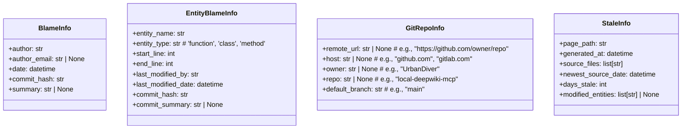
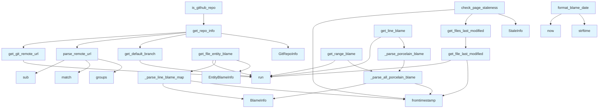

# git_utils.py

## File Overview

This module provides data structures for representing Git repository information. It contains classes that store metadata about Git repositories, including remote URLs, hosting information, and repository details.

## Classes

### GitRepoInfo

A data class that holds information about a Git repository.

**Purpose**: Stores structured information about a Git repository, including its remote location, hosting service details, and default branch.

**Attributes**:
- `remote_url` (str | None): The full remote URL of the repository (e.g., "https://github.com/owner/repo")
- `host` (str | None): The hosting service domain (e.g., "github.com", "gitlab.com")
- `owner` (str | None): The repository owner or organization name (e.g., "UrbanDiver")
- `repo` (str | None): The repository name (e.g., "local-deepwiki-mcp")
- `default_branch` (str): The default branch name (e.g., "[main](../export/pdf.md)")

## Usage Examples

```python
# Create a GitRepoInfo instance
repo_info = GitRepoInfo()
repo_info.remote_url = "https://github.com/UrbanDiver/local-deepwiki-mcp"
repo_info.host = "github.com"
repo_info.owner = "UrbanDiver"
repo_info.repo = "local-deepwiki-mcp"
repo_info.default_branch = "main"
```

## Related Components

Based on the code provided, this file defines foundational data structures that would typically be used by other components in the system for Git repository operations and metadata management.

## API Reference

### class `GitRepoInfo`

Information about a git repository.


<details>
<summary>View Source (lines 20-27) | <a href="https://github.com/UrbanDiver/local-deepwiki-mcp/blob/[main](../export/pdf.md)/src/local_deepwiki/core/git_utils.py#L20-L27">GitHub</a></summary>

```python
class GitRepoInfo:
    """Information about a git repository."""

    remote_url: str | None  # e.g., "https://github.com/owner/repo"
    host: str | None  # e.g., "github.com", "gitlab.com"
    owner: str | None  # e.g., "UrbanDiver"
    repo: str | None  # e.g., "local-deepwiki-mcp"
    default_branch: str  # e.g., "main"
```

</details>

### class `BlameInfo`

Git blame information for a line or range.


<details>
<summary>View Source (lines 235-242) | <a href="https://github.com/UrbanDiver/local-deepwiki-mcp/blob/[main](../export/pdf.md)/src/local_deepwiki/core/git_utils.py#L235-L242">GitHub</a></summary>

```python
class BlameInfo:
    """Git blame information for a line or range."""

    author: str
    author_email: str | None
    date: datetime
    commit_hash: str
    summary: str | None = None  # Commit message summary
```

</details>

### class `EntityBlameInfo`

Blame information for a code entity (function, class, method).


<details>
<summary>View Source (lines 246-256) | <a href="https://github.com/UrbanDiver/local-deepwiki-mcp/blob/[main](../export/pdf.md)/src/local_deepwiki/core/git_utils.py#L246-L256">GitHub</a></summary>

```python
class EntityBlameInfo:
    """Blame information for a code entity (function, class, method)."""

    entity_name: str
    entity_type: str  # 'function', 'class', 'method'
    start_line: int
    end_line: int
    last_modified_by: str
    last_modified_date: datetime
    commit_hash: str
    commit_summary: str | None = None
```

</details>

### class `StaleInfo`

Information about a potentially stale wiki page.

---


<details>
<summary>View Source (lines 645-653) | <a href="https://github.com/UrbanDiver/local-deepwiki-mcp/blob/[main](../export/pdf.md)/src/local_deepwiki/core/git_utils.py#L645-L653">GitHub</a></summary>

```python
class StaleInfo:
    """Information about a potentially stale wiki page."""

    page_path: str
    generated_at: datetime
    source_files: list[str]
    newest_source_date: datetime
    days_stale: int
    modified_entities: list[str] | None = None  # Entities modified after doc generation
```

</details>

### Functions

#### `get_git_remote_url`

```python
def get_git_remote_url(repo_path: Path) -> str | None
```

Get the remote origin URL from git config.


| [Parameter](../generators/api_docs.md) | Type | Default | Description |
|-----------|------|---------|-------------|
| `repo_path` | `Path` | - | Path to the repository. |

**Returns:** `str | None`


<details>
<summary>View Source (lines 30-51) | <a href="https://github.com/UrbanDiver/local-deepwiki-mcp/blob/[main](../export/pdf.md)/src/local_deepwiki/core/git_utils.py#L30-L51">GitHub</a></summary>

```python
def get_git_remote_url(repo_path: Path) -> str | None:
    """Get the remote origin URL from git config.

    Args:
        repo_path: Path to the repository.

    Returns:
        Remote URL string or None if not a git repo or no remote.
    """
    try:
        result = subprocess.run(
            ["git", "config", "--get", "remote.origin.url"],
            cwd=repo_path,
            capture_output=True,
            text=True,
            timeout=5,
        )
        if result.returncode == 0:
            return result.stdout.strip()
    except (subprocess.TimeoutExpired, FileNotFoundError, OSError) as e:
        logger.debug(f"Failed to get git remote URL: {e}")
    return None
```

</details>

#### `parse_remote_url`

```python
def parse_remote_url(url: str) -> tuple[str, str, str] | None
```

Parse remote URL to extract host, owner, and repo name.  Handles various URL formats: - https://github.com/owner/repo.git - https://github.com/owner/repo - git@github.com:owner/repo.git - git@github.com:owner/repo - ssh://git@github.com/owner/repo.git


| [Parameter](../generators/api_docs.md) | Type | Default | Description |
|-----------|------|---------|-------------|
| `url` | `str` | - | Git remote URL. |

**Returns:** `tuple[str, str, str] | None`


<details>
<summary>View Source (lines 54-91) | <a href="https://github.com/UrbanDiver/local-deepwiki-mcp/blob/[main](../export/pdf.md)/src/local_deepwiki/core/git_utils.py#L54-L91">GitHub</a></summary>

```python
def parse_remote_url(url: str) -> tuple[str, str, str] | None:
    """Parse remote URL to extract host, owner, and repo name.

    Handles various URL formats:
    - https://github.com/owner/repo.git
    - https://github.com/owner/repo
    - git@github.com:owner/repo.git
    - git@github.com:owner/repo
    - ssh://git@github.com/owner/repo.git

    Args:
        url: Git remote URL.

    Returns:
        Tuple of (host, owner, repo) or None if parsing fails.
    """
    # Remove trailing .git
    url = re.sub(r"\.git$", "", url)

    # SSH format: git@host:owner/repo
    ssh_match = re.match(r"^git@([^:]+):(.+)/([^/]+)$", url)
    if ssh_match:
        host, owner, repo = ssh_match.groups()
        return host, owner, repo

    # SSH URL format: ssh://git@host/owner/repo
    ssh_url_match = re.match(r"^ssh://git@([^/]+)/(.+)/([^/]+)$", url)
    if ssh_url_match:
        host, owner, repo = ssh_url_match.groups()
        return host, owner, repo

    # HTTPS format: https://host/owner/repo
    https_match = re.match(r"^https?://([^/]+)/(.+)/([^/]+)$", url)
    if https_match:
        host, owner, repo = https_match.groups()
        return host, owner, repo

    return None
```

</details>

#### `get_default_branch`

```python
def get_default_branch(repo_path: Path) -> str
```

Get the default branch name for the repository.  Tries to detect the default branch from: 1. Current HEAD if on a branch 2. Remote HEAD reference 3. Falls back to '[main](../export/pdf.md)'


| [Parameter](../generators/api_docs.md) | Type | Default | Description |
|-----------|------|---------|-------------|
| `repo_path` | `Path` | - | Path to the repository. |

**Returns:** `str`


<details>
<summary>View Source (lines 94-142) | <a href="https://github.com/UrbanDiver/local-deepwiki-mcp/blob/[main](../export/pdf.md)/src/local_deepwiki/core/git_utils.py#L94-L142">GitHub</a></summary>

```python
def get_default_branch(repo_path: Path) -> str:
    """Get the default branch name for the repository.

    Tries to detect the default branch from:
    1. Current HEAD if on a branch
    2. Remote HEAD reference
    3. Falls back to 'main'

    Args:
        repo_path: Path to the repository.

    Returns:
        Branch name string.
    """
    # Try to get current branch
    try:
        result = subprocess.run(
            ["git", "rev-parse", "--abbrev-ref", "HEAD"],
            cwd=repo_path,
            capture_output=True,
            text=True,
            timeout=5,
        )
        if result.returncode == 0:
            branch = result.stdout.strip()
            if branch and branch != "HEAD":  # Not in detached HEAD
                return branch
    except (subprocess.TimeoutExpired, FileNotFoundError, OSError):
        pass

    # Try to get default branch from remote
    try:
        result = subprocess.run(
            ["git", "symbolic-ref", "refs/remotes/origin/HEAD"],
            cwd=repo_path,
            capture_output=True,
            text=True,
            timeout=5,
        )
        if result.returncode == 0:
            # Output like: refs/remotes/origin/main
            ref = result.stdout.strip()
            if ref:
                return ref.split("/")[-1]
    except (subprocess.TimeoutExpired, FileNotFoundError, OSError):
        pass

    # Default fallback
    return "main"
```

</details>

#### `get_repo_info`

```python
def get_repo_info(repo_path: Path) -> GitRepoInfo
```

Get complete git repository information.


| [Parameter](../generators/api_docs.md) | Type | Default | Description |
|-----------|------|---------|-------------|
| `repo_path` | `Path` | - | Path to the repository. |

**Returns:** `GitRepoInfo`


<details>
<summary>View Source (lines 145-172) | <a href="https://github.com/UrbanDiver/local-deepwiki-mcp/blob/[main](../export/pdf.md)/src/local_deepwiki/core/git_utils.py#L145-L172">GitHub</a></summary>

```python
def get_repo_info(repo_path: Path) -> GitRepoInfo:
    """Get complete git repository information.

    Args:
        repo_path: Path to the repository.

    Returns:
        GitRepoInfo with available information.
    """
    remote_url = get_git_remote_url(repo_path)
    host = None
    owner = None
    repo = None

    if remote_url:
        parsed = parse_remote_url(remote_url)
        if parsed:
            host, owner, repo = parsed

    default_branch = get_default_branch(repo_path)

    return GitRepoInfo(
        remote_url=remote_url,
        host=host,
        owner=owner,
        repo=repo,
        default_branch=default_branch,
    )
```

</details>

#### `is_github_repo`

```python
def is_github_repo(repo_path: Path) -> bool
```

Check if a repository is hosted on GitHub.


| [Parameter](../generators/api_docs.md) | Type | Default | Description |
|-----------|------|---------|-------------|
| `repo_path` | `Path` | - | Path to the repository. |

**Returns:** `bool`


<details>
<summary>View Source (lines 175-187) | <a href="https://github.com/UrbanDiver/local-deepwiki-mcp/blob/[main](../export/pdf.md)/src/local_deepwiki/core/git_utils.py#L175-L187">GitHub</a></summary>

```python
def is_github_repo(repo_path: Path) -> bool:
    """Check if a repository is hosted on GitHub.

    Args:
        repo_path: Path to the repository.

    Returns:
        True if the repo has a GitHub remote, False otherwise.
    """
    repo_info = get_repo_info(repo_path)
    if repo_info.host:
        return "github.com" in repo_info.host.lower()
    return False
```

</details>

#### `build_source_url`

```python
def build_source_url(repo_info: GitRepoInfo, file_path: str, start_line: int | None = None, end_line: int | None = None) -> str | None
```

Build a URL to the source file on GitHub/GitLab.


| [Parameter](../generators/api_docs.md) | Type | Default | Description |
|-----------|------|---------|-------------|
| `repo_info` | `GitRepoInfo` | - | Repository information from get_repo_info(). |
| `file_path` | `str` | - | Relative path to the source file. |
| `start_line` | `int | None` | `None` | Optional starting line number. |
| `end_line` | `int | None` | `None` | Optional ending line number. |

**Returns:** `str | None`


<details>
<summary>View Source (lines 190-231) | <a href="https://github.com/UrbanDiver/local-deepwiki-mcp/blob/[main](../export/pdf.md)/src/local_deepwiki/core/git_utils.py#L190-L231">GitHub</a></summary>

```python
def build_source_url(
    repo_info: GitRepoInfo,
    file_path: str,
    start_line: int | None = None,
    end_line: int | None = None,
) -> str | None:
    """Build a URL to the source file on GitHub/GitLab.

    Args:
        repo_info: Repository information from get_repo_info().
        file_path: Relative path to the source file.
        start_line: Optional starting line number.
        end_line: Optional ending line number.

    Returns:
        URL string like https://github.com/owner/repo/blob/main/path/file.py#L10-L20
        Or None if repo_info doesn't have remote information.
    """
    if not repo_info.host or not repo_info.owner or not repo_info.repo:
        return None

    # Determine URL format based on host
    host = repo_info.host.lower()

    if "gitlab" in host:
        # GitLab uses /-/blob/ format
        base_url = f"https://{repo_info.host}/{repo_info.owner}/{repo_info.repo}/-/blob/{repo_info.default_branch}/{file_path}"
        if start_line is not None:
            if end_line is not None and end_line != start_line:
                return f"{base_url}#L{start_line}-{end_line}"
            else:
                return f"{base_url}#L{start_line}"
        return base_url
    else:
        # GitHub and others use /blob/ format
        base_url = f"https://{repo_info.host}/{repo_info.owner}/{repo_info.repo}/blob/{repo_info.default_branch}/{file_path}"
        if start_line is not None:
            if end_line is not None and end_line != start_line:
                return f"{base_url}#L{start_line}-L{end_line}"
            else:
                return f"{base_url}#L{start_line}"
        return base_url
```

</details>

#### `get_line_blame`

```python
def get_line_blame(repo_path: Path, file_path: str, line_number: int) -> BlameInfo | None
```

Get git blame information for a specific line.


| [Parameter](../generators/api_docs.md) | Type | Default | Description |
|-----------|------|---------|-------------|
| `repo_path` | `Path` | - | Path to the repository root. |
| `file_path` | `str` | - | Relative path to the file. |
| `line_number` | `int` | - | Line number to blame (1-indexed). |

**Returns:** `BlameInfo | None`


<details>
<summary>View Source (lines 259-293) | <a href="https://github.com/UrbanDiver/local-deepwiki-mcp/blob/[main](../export/pdf.md)/src/local_deepwiki/core/git_utils.py#L259-L293">GitHub</a></summary>

```python
def get_line_blame(
    repo_path: Path,
    file_path: str,
    line_number: int,
) -> BlameInfo | None:
    """Get git blame information for a specific line.

    Args:
        repo_path: Path to the repository root.
        file_path: Relative path to the file.
        line_number: Line number to blame (1-indexed).

    Returns:
        BlameInfo or None if blame fails.
    """
    try:
        # Use porcelain format for easy parsing
        result = subprocess.run(
            [
                "git", "blame", "-L", f"{line_number},{line_number}",
                "--porcelain", file_path
            ],
            cwd=repo_path,
            capture_output=True,
            text=True,
            timeout=10,
        )
        if result.returncode != 0:
            return None

        return _parse_porcelain_blame(result.stdout)

    except (subprocess.TimeoutExpired, FileNotFoundError, OSError) as e:
        logger.debug(f"Failed to get git blame: {e}")
        return None
```

</details>

#### `get_range_blame`

```python
def get_range_blame(repo_path: Path, file_path: str, start_line: int, end_line: int) -> BlameInfo | None
```

Get the most recent blame information for a line range.  Returns the blame info for the most recently modified line in the range.


| [Parameter](../generators/api_docs.md) | Type | Default | Description |
|-----------|------|---------|-------------|
| `repo_path` | `Path` | - | Path to the repository root. |
| `file_path` | `str` | - | Relative path to the file. |
| `start_line` | `int` | - | Starting line number (1-indexed). |
| `end_line` | `int` | - | Ending line number (1-indexed). |

**Returns:** `BlameInfo | None`


<details>
<summary>View Source (lines 296-339) | <a href="https://github.com/UrbanDiver/local-deepwiki-mcp/blob/[main](../export/pdf.md)/src/local_deepwiki/core/git_utils.py#L296-L339">GitHub</a></summary>

```python
def get_range_blame(
    repo_path: Path,
    file_path: str,
    start_line: int,
    end_line: int,
) -> BlameInfo | None:
    """Get the most recent blame information for a line range.

    Returns the blame info for the most recently modified line in the range.

    Args:
        repo_path: Path to the repository root.
        file_path: Relative path to the file.
        start_line: Starting line number (1-indexed).
        end_line: Ending line number (1-indexed).

    Returns:
        BlameInfo for the most recently modified line, or None.
    """
    try:
        result = subprocess.run(
            [
                "git", "blame", "-L", f"{start_line},{end_line}",
                "--porcelain", file_path
            ],
            cwd=repo_path,
            capture_output=True,
            text=True,
            timeout=30,
        )
        if result.returncode != 0:
            return None

        # Parse all blame entries and find the most recent
        entries = _parse_all_porcelain_blame(result.stdout)
        if not entries:
            return None

        # Return the most recently modified entry
        return max(entries, key=lambda e: e.date)

    except (subprocess.TimeoutExpired, FileNotFoundError, OSError) as e:
        logger.debug(f"Failed to get git blame for range: {e}")
        return None
```

</details>

#### `get_file_entity_blame`

```python
def get_file_entity_blame(repo_path: Path, file_path: str, entities: list[tuple[str, str, int, int]]) -> list[EntityBlameInfo]
```

Get blame information for multiple code entities in a file.  This is more efficient than calling get_range_blame for each entity, as it runs a single git blame command for the entire file.


| [Parameter](../generators/api_docs.md) | Type | Default | Description |
|-----------|------|---------|-------------|
| `repo_path` | `Path` | - | Path to the repository root. |
| `file_path` | `str` | - | Relative path to the file. |
| `entities` | `list[tuple[str, str, int, int]]` | - | List of (entity_name, entity_type, start_line, end_line) tuples. |

**Returns:** `list[EntityBlameInfo]`


<details>
<summary>View Source (lines 418-484) | <a href="https://github.com/UrbanDiver/local-deepwiki-mcp/blob/[main](../export/pdf.md)/src/local_deepwiki/core/git_utils.py#L418-L484">GitHub</a></summary>

```python
def get_file_entity_blame(
    repo_path: Path,
    file_path: str,
    entities: list[tuple[str, str, int, int]],  # [(name, type, start, end), ...]
) -> list[EntityBlameInfo]:
    """Get blame information for multiple code entities in a file.

    This is more efficient than calling get_range_blame for each entity,
    as it runs a single git blame command for the entire file.

    Args:
        repo_path: Path to the repository root.
        file_path: Relative path to the file.
        entities: List of (entity_name, entity_type, start_line, end_line) tuples.

    Returns:
        List of EntityBlameInfo objects.
    """
    if not entities:
        return []

    try:
        # Get blame for entire file
        result = subprocess.run(
            ["git", "blame", "--porcelain", file_path],
            cwd=repo_path,
            capture_output=True,
            text=True,
            timeout=60,
        )
        if result.returncode != 0:
            return []

        # Parse blame output - build line -> BlameInfo mapping
        line_blame = _parse_line_blame_map(result.stdout)
        if not line_blame:
            return []

        # For each entity, find the most recently modified line
        entity_blames: list[EntityBlameInfo] = []

        for name, entity_type, start, end in entities:
            # Get blame entries for this range
            range_blames: list[BlameInfo] = []
            for line_num in range(start, end + 1):
                if line_num in line_blame:
                    range_blames.append(line_blame[line_num])

            if range_blames:
                # Find most recently modified
                most_recent = max(range_blames, key=lambda b: b.date)
                entity_blames.append(EntityBlameInfo(
                    entity_name=name,
                    entity_type=entity_type,
                    start_line=start,
                    end_line=end,
                    last_modified_by=most_recent.author,
                    last_modified_date=most_recent.date,
                    commit_hash=most_recent.commit_hash,
                    commit_summary=most_recent.summary,
                ))

        return entity_blames

    except (subprocess.TimeoutExpired, FileNotFoundError, OSError) as e:
        logger.debug(f"Failed to get file entity blame: {e}")
        return []
```

</details>

#### `format_blame_date`

```python
def format_blame_date(dt: datetime) -> str
```

Format a blame date for display.


| [Parameter](../generators/api_docs.md) | Type | Default | Description |
|-----------|------|---------|-------------|
| `dt` | `datetime` | - | Datetime object. |

**Returns:** `str`


<details>
<summary>View Source (lines 562-586) | <a href="https://github.com/UrbanDiver/local-deepwiki-mcp/blob/[main](../export/pdf.md)/src/local_deepwiki/core/git_utils.py#L562-L586">GitHub</a></summary>

```python
def format_blame_date(dt: datetime) -> str:
    """Format a blame date for display.

    Args:
        dt: Datetime object.

    Returns:
        Formatted date string like "Jan 15, 2025" or "2 days ago" for recent dates.
    """
    now = datetime.now()
    diff = now - dt

    if diff.days == 0:
        return "today"
    elif diff.days == 1:
        return "yesterday"
    elif diff.days < 7:
        return f"{diff.days} days ago"
    elif diff.days < 30:
        weeks = diff.days // 7
        return f"{weeks} week{'s' if weeks > 1 else ''} ago"
    elif diff.days < 365:
        return dt.strftime("%b %d, %Y")
    else:
        return dt.strftime("%b %d, %Y")
```

</details>

#### `get_file_last_modified`

```python
def get_file_last_modified(repo_path: Path, file_path: str) -> datetime | None
```

Get the last modification date of a file from git history.


| [Parameter](../generators/api_docs.md) | Type | Default | Description |
|-----------|------|---------|-------------|
| `repo_path` | `Path` | - | Path to the repository root. |
| `file_path` | `str` | - | Relative path to the file. |

**Returns:** `datetime | None`


<details>
<summary>View Source (lines 589-612) | <a href="https://github.com/UrbanDiver/local-deepwiki-mcp/blob/[main](../export/pdf.md)/src/local_deepwiki/core/git_utils.py#L589-L612">GitHub</a></summary>

```python
def get_file_last_modified(repo_path: Path, file_path: str) -> datetime | None:
    """Get the last modification date of a file from git history.

    Args:
        repo_path: Path to the repository root.
        file_path: Relative path to the file.

    Returns:
        datetime of last modification, or None if not in git or error.
    """
    try:
        result = subprocess.run(
            ["git", "log", "-1", "--format=%ct", "--", file_path],
            cwd=repo_path,
            capture_output=True,
            text=True,
            timeout=10,
        )
        if result.returncode == 0 and result.stdout.strip():
            timestamp = int(result.stdout.strip())
            return datetime.fromtimestamp(timestamp)
    except (subprocess.TimeoutExpired, FileNotFoundError, OSError, ValueError) as e:
        logger.debug(f"Failed to get last modified date for {file_path}: {e}")
    return None
```

</details>

#### `get_files_last_modified`

```python
def get_files_last_modified(repo_path: Path, file_paths: list[str]) -> dict[str, datetime]
```

Get last modification dates for multiple files efficiently.  Uses a single git log command to get dates for all files.


| [Parameter](../generators/api_docs.md) | Type | Default | Description |
|-----------|------|---------|-------------|
| `repo_path` | `Path` | - | Path to the repository root. |
| `file_paths` | `list[str]` | - | List of relative file paths. |

**Returns:** `dict[str, datetime]`


<details>
<summary>View Source (lines 615-641) | <a href="https://github.com/UrbanDiver/local-deepwiki-mcp/blob/[main](../export/pdf.md)/src/local_deepwiki/core/git_utils.py#L615-L641">GitHub</a></summary>

```python
def get_files_last_modified(
    repo_path: Path,
    file_paths: list[str],
) -> dict[str, datetime]:
    """Get last modification dates for multiple files efficiently.

    Uses a single git log command to get dates for all files.

    Args:
        repo_path: Path to the repository root.
        file_paths: List of relative file paths.

    Returns:
        Dictionary mapping file paths to their last modification datetime.
    """
    if not file_paths:
        return {}

    result: dict[str, datetime] = {}

    # Get dates for each file (git log doesn't support bulk queries well)
    for file_path in file_paths:
        mod_date = get_file_last_modified(repo_path, file_path)
        if mod_date:
            result[file_path] = mod_date

    return result
```

</details>

#### `check_page_staleness`

```python
def check_page_staleness(repo_path: Path, page_path: str, generated_at: float, source_files: list[str], stale_threshold_days: int = 0) -> StaleInfo | None
```

Check if a wiki page is potentially stale.  A page is considered stale if any of its source files have been modified after the page was generated.


| [Parameter](../generators/api_docs.md) | Type | Default | Description |
|-----------|------|---------|-------------|
| `repo_path` | `Path` | - | Path to the repository root. |
| `page_path` | `str` | - | Wiki page path. |
| `generated_at` | `float` | - | Timestamp when the page was generated. |
| `source_files` | `list[str]` | - | Source files that contributed to the page. |
| `stale_threshold_days` | `int` | `0` | Minimum days difference to consider stale. |

**Returns:** `StaleInfo | None`


<details>
<summary>View Source (lines 656-705) | <a href="https://github.com/UrbanDiver/local-deepwiki-mcp/blob/[main](../export/pdf.md)/src/local_deepwiki/core/git_utils.py#L656-L705">GitHub</a></summary>

```python
def check_page_staleness(
    repo_path: Path,
    page_path: str,
    generated_at: float,
    source_files: list[str],
    stale_threshold_days: int = 0,
) -> StaleInfo | None:
    """Check if a wiki page is potentially stale.

    A page is considered stale if any of its source files have been
    modified after the page was generated.

    Args:
        repo_path: Path to the repository root.
        page_path: Wiki page path.
        generated_at: Timestamp when the page was generated.
        source_files: Source files that contributed to the page.
        stale_threshold_days: Minimum days difference to consider stale.

    Returns:
        StaleInfo if the page is stale, None otherwise.
    """
    if not source_files:
        return None

    doc_date = datetime.fromtimestamp(generated_at)
    mod_dates = get_files_last_modified(repo_path, source_files)

    if not mod_dates:
        return None

    # Find the newest source modification
    newest_file = max(mod_dates.items(), key=lambda x: x[1])
    newest_date = newest_file[1]

    # Check if source is newer than doc
    if newest_date <= doc_date:
        return None

    days_stale = (newest_date - doc_date).days
    if days_stale < stale_threshold_days:
        return None

    return StaleInfo(
        page_path=page_path,
        generated_at=doc_date,
        source_files=source_files,
        newest_source_date=newest_date,
        days_stale=days_stale,
    )
```

</details>

## Class Diagram



## Call Graph



## Used By

Functions and methods in this file and their callers:

- **`BlameInfo`**: called by `_parse_all_porcelain_blame`, `_parse_line_blame_map`
- **`EntityBlameInfo`**: called by `get_file_entity_blame`
- **`GitRepoInfo`**: called by `get_repo_info`
- **`StaleInfo`**: called by `check_page_staleness`
- **`_parse_all_porcelain_blame`**: called by `_parse_porcelain_blame`, `get_range_blame`
- **`_parse_line_blame_map`**: called by `get_file_entity_blame`
- **`_parse_porcelain_blame`**: called by `get_line_blame`
- **`fromtimestamp`**: called by `_parse_all_porcelain_blame`, `_parse_line_blame_map`, `check_page_staleness`, `get_file_last_modified`
- **`get_default_branch`**: called by `get_repo_info`
- **`get_file_last_modified`**: called by `get_files_last_modified`
- **`get_files_last_modified`**: called by `check_page_staleness`
- **`get_git_remote_url`**: called by `get_repo_info`
- **`get_repo_info`**: called by `is_github_repo`
- **`groups`**: called by `parse_remote_url`
- **`match`**: called by `parse_remote_url`
- **`now`**: called by `format_blame_date`
- **`parse_remote_url`**: called by `get_repo_info`
- **`run`**: called by `get_default_branch`, `get_file_entity_blame`, `get_file_last_modified`, `get_git_remote_url`, `get_line_blame`, `get_range_blame`
- **`strftime`**: called by `format_blame_date`
- **`sub`**: called by `parse_remote_url`

## Usage Examples

*Examples extracted from test files*

### Test parsing GitHub HTTPS URL

From `test_git_utils.py::TestParseRemoteUrl::test_github_https`:

```python
result = parse_remote_url("https://github.com/owner/repo")
assert result == ("github.com", "owner", "repo")
```

### Test parsing GitHub HTTPS URL with .git suffix

From `test_git_utils.py::TestParseRemoteUrl::test_github_https_with_git_suffix`:

```python
result = parse_remote_url("https://github.com/owner/repo.git")
assert result == ("github.com", "owner", "repo")
```

### Test building GitHub URL without line numbers

From `test_git_utils.py::TestBuildSourceUrl::test_github_url_without_lines`:

```python
repo_info = GitRepoInfo(
    remote_url="https://github.com/owner/repo",
    host="github.com",
    owner="owner",
    repo="repo",
    default_branch="main",
)
result = build_source_url(repo_info, "src/file.py")
assert result == "https://github.com/owner/repo/blob/main/src/file.py"
```

### Test building GitHub URL without line numbers

From `test_git_utils.py::TestBuildSourceUrl::test_github_url_without_lines`:

```python
repo_info = GitRepoInfo(
    remote_url="https://github.com/owner/repo",
    host="github.com",
    owner="owner",
    repo="repo",
    default_branch="main",
)
result = build_source_url(repo_info, "src/file.py")
assert result == "https://github.com/owner/repo/blob/main/src/file.py"
```

### Test building GitHub URL with single line number

From `test_git_utils.py::TestBuildSourceUrl::test_github_url_with_single_line`:

```python
repo_info = GitRepoInfo(
    remote_url="https://github.com/owner/repo",
    host="github.com",
    owner="owner",
    repo="repo",
    default_branch="main",
)
result = build_source_url(repo_info, "src/file.py", start_line=42)
assert result == "https://github.com/owner/repo/blob/main/src/file.py#L42"
```


## Last Modified

| Entity | Type | Author | Date | Commit |
|--------|------|--------|------|--------|
| `StaleInfo` | class | Not Committed Yet | today | `0000000` Version of src/local_deepwi... |
| `get_file_last_modified` | function | Not Committed Yet | today | `0000000` Version of src/local_deepwi... |
| `get_files_last_modified` | function | Not Committed Yet | today | `0000000` Version of src/local_deepwi... |
| `check_page_staleness` | function | Not Committed Yet | today | `0000000` Version of src/local_deepwi... |
| `BlameInfo` | class | Brian Breidenbach | today | `37aec0f` Add git blame integration t... |
| `EntityBlameInfo` | class | Brian Breidenbach | today | `37aec0f` Add git blame integration t... |
| `get_line_blame` | function | Brian Breidenbach | today | `37aec0f` Add git blame integration t... |
| `get_range_blame` | function | Brian Breidenbach | today | `37aec0f` Add git blame integration t... |
| `_parse_porcelain_blame` | function | Brian Breidenbach | today | `37aec0f` Add git blame integration t... |
| `_parse_all_porcelain_blame` | function | Brian Breidenbach | today | `37aec0f` Add git blame integration t... |
| `get_file_entity_blame` | function | Brian Breidenbach | today | `37aec0f` Add git blame integration t... |
| `_parse_line_blame_map` | function | Brian Breidenbach | today | `37aec0f` Add git blame integration t... |
| `format_blame_date` | function | Brian Breidenbach | today | `37aec0f` Add git blame integration t... |
| `is_github_repo` | function | Brian Breidenbach | 2 days ago | `52202b9` Add automatic cloud provide... |
| `GitRepoInfo` | class | Brian Breidenbach | 2 days ago | `2708dc5` Add GitHub/GitLab links to ... |
| `get_git_remote_url` | function | Brian Breidenbach | 2 days ago | `2708dc5` Add GitHub/GitLab links to ... |
| `parse_remote_url` | function | Brian Breidenbach | 2 days ago | `2708dc5` Add GitHub/GitLab links to ... |
| `get_default_branch` | function | Brian Breidenbach | 2 days ago | `2708dc5` Add GitHub/GitLab links to ... |
| `get_repo_info` | function | Brian Breidenbach | 2 days ago | `2708dc5` Add GitHub/GitLab links to ... |
| `build_source_url` | function | Brian Breidenbach | 2 days ago | `2708dc5` Add GitHub/GitLab links to ... |

## Additional Source Code

Source code for functions and methods not listed in the API Reference above.

#### `_parse_porcelain_blame`

<details>
<summary>View Source (lines 342-352) | <a href="https://github.com/UrbanDiver/local-deepwiki-mcp/blob/[main](../export/pdf.md)/src/local_deepwiki/core/git_utils.py#L342-L352">GitHub</a></summary>

```python
def _parse_porcelain_blame(output: str) -> BlameInfo | None:
    """Parse git blame porcelain format output for a single entry.

    Args:
        output: Git blame porcelain output.

    Returns:
        BlameInfo or None if parsing fails.
    """
    entries = _parse_all_porcelain_blame(output)
    return entries[0] if entries else None
```

</details>


#### `_parse_all_porcelain_blame`

<details>
<summary>View Source (lines 355-415) | <a href="https://github.com/UrbanDiver/local-deepwiki-mcp/blob/[main](../export/pdf.md)/src/local_deepwiki/core/git_utils.py#L355-L415">GitHub</a></summary>

```python
def _parse_all_porcelain_blame(output: str) -> list[BlameInfo]:
    """Parse git blame porcelain format output for multiple entries.

    Porcelain format has header lines followed by the actual source line.
    Header includes: commit hash, author, author-mail, author-time, etc.

    Args:
        output: Git blame porcelain output.

    Returns:
        List of BlameInfo objects.
    """
    entries: list[BlameInfo] = []
    lines = output.strip().split("\n")

    i = 0
    while i < len(lines):
        line = lines[i]

        # First line of each entry starts with the commit hash (40 hex chars)
        if len(line) >= 40 and all(c in "0123456789abcdef" for c in line[:40]):
            commit_hash = line[:40]
            author = None
            author_email = None
            author_time = None
            summary = None

            # Parse header lines until we hit a tab (the source line)
            i += 1
            while i < len(lines) and not lines[i].startswith("\t"):
                header_line = lines[i]
                if header_line.startswith("author "):
                    author = header_line[7:]
                elif header_line.startswith("author-mail "):
                    # Remove angle brackets: <email@example.com> -> email@example.com
                    author_email = header_line[12:].strip("<>")
                elif header_line.startswith("author-time "):
                    try:
                        author_time = int(header_line[12:])
                    except ValueError:
                        pass
                elif header_line.startswith("summary "):
                    summary = header_line[8:]
                i += 1

            # Skip the source line (starts with tab)
            if i < len(lines) and lines[i].startswith("\t"):
                i += 1

            if author and author_time:
                entries.append(BlameInfo(
                    author=author,
                    author_email=author_email,
                    date=datetime.fromtimestamp(author_time),
                    commit_hash=commit_hash,
                    summary=summary,
                ))
        else:
            i += 1

    return entries
```

</details>


#### `_parse_line_blame_map`

<details>
<summary>View Source (lines 487-559) | <a href="https://github.com/UrbanDiver/local-deepwiki-mcp/blob/[main](../export/pdf.md)/src/local_deepwiki/core/git_utils.py#L487-L559">GitHub</a></summary>

```python
def _parse_line_blame_map(output: str) -> dict[int, BlameInfo]:
    """Parse git blame porcelain output into a line number -> BlameInfo map.

    Git blame porcelain format only includes full author info for the first
    occurrence of each commit hash. Subsequent lines from the same commit
    have abbreviated headers. We cache blame info per commit to handle this.

    Args:
        output: Git blame porcelain output for entire file.

    Returns:
        Dictionary mapping line numbers to BlameInfo.
    """
    line_blame: dict[int, BlameInfo] = {}
    # Cache of commit hash -> BlameInfo for reusing info on subsequent lines
    commit_cache: dict[str, BlameInfo] = {}
    lines = output.strip().split("\n")

    i = 0
    while i < len(lines):
        line = lines[i]

        # First line of each entry: <hash> <orig_line> <final_line> [<num_lines>]
        if len(line) >= 40 and all(c in "0123456789abcdef" for c in line[:40]):
            parts = line.split()
            commit_hash = parts[0]
            # final_line is the line number in the current file
            final_line = int(parts[2]) if len(parts) >= 3 else 0

            author = None
            author_email = None
            author_time = None
            summary = None

            # Parse header lines
            i += 1
            while i < len(lines) and not lines[i].startswith("\t"):
                header_line = lines[i]
                if header_line.startswith("author "):
                    author = header_line[7:]
                elif header_line.startswith("author-mail "):
                    author_email = header_line[12:].strip("<>")
                elif header_line.startswith("author-time "):
                    try:
                        author_time = int(header_line[12:])
                    except ValueError:
                        pass
                elif header_line.startswith("summary "):
                    summary = header_line[8:]
                i += 1

            # Skip source line
            if i < len(lines) and lines[i].startswith("\t"):
                i += 1

            if author and author_time and final_line > 0:
                # Full info available - create new BlameInfo and cache it
                blame_info = BlameInfo(
                    author=author,
                    author_email=author_email,
                    date=datetime.fromtimestamp(author_time),
                    commit_hash=commit_hash,
                    summary=summary,
                )
                commit_cache[commit_hash] = blame_info
                line_blame[final_line] = blame_info
            elif final_line > 0 and commit_hash in commit_cache:
                # Abbreviated entry - reuse cached info for this commit
                line_blame[final_line] = commit_cache[commit_hash]
        else:
            i += 1

    return line_blame
```

</details>

## Relevant Source Files

- `src/local_deepwiki/core/git_utils.py:20-27`
