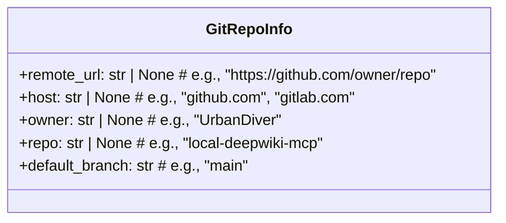
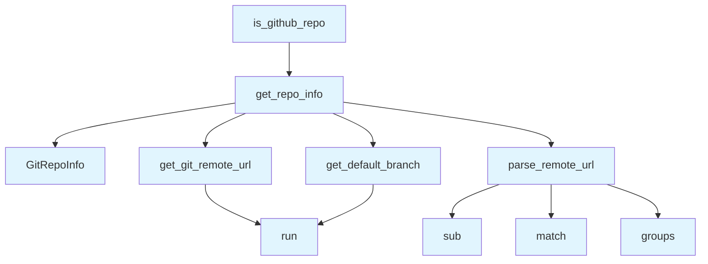

# Git Utilities Module

## File Overview

The `git_utils.py` module provides utilities for working with Git repositories, including extracting repository information, parsing remote URLs, and building source URLs. It focuses on gathering metadata about Git repositories to support documentation generation workflows.

## Classes

### GitRepoInfo

A data class that stores information about a Git repository.

**Attributes:**
- `remote_url` (str | None): The remote repository URL (e.g., "https://github.com/owner/repo")
- `host` (str | None): The Git hosting service domain (e.g., "github.com", "gitlab.com")
- `owner` (str | None): The repository owner or organization name (e.g., "UrbanDiver")
- `repo` (str | None): The repository name (e.g., "local-deepwiki-mcp")
- `default_branch` (str): The default branch name (e.g., "[main](../export/pdf.md)")

## Functions

Based on the module structure shown, this file contains the following functions:

### get_git_remote_url

Retrieves the remote URL of a Git repository.

### parse_remote_url

Parses a Git remote URL to extract host, owner, and repository information.

### get_default_branch

Determines the default branch of a Git repository.

### get_repo_info

Gathers comprehensive repository information and returns a GitRepoInfo instance.

### is_github_repo

Checks whether a repository is hosted on GitHub.

### build_source_url

Constructs source URLs for files within the repository.

## Usage Examples

```python
from local_deepwiki.core.git_utils import GitRepoInfo, get_repo_info

# Get repository information
repo_info = get_repo_info()

# Access repository details
if repo_info.remote_url:
    print(f"Repository: {repo_info.owner}/{repo_info.repo}")
    print(f"Host: {repo_info.host}")
    print(f"Default branch: {repo_info.default_branch}")
```

## Dependencies

This module relies on:
- Standard library modules: `re`, `subprocess`, `dataclasses`, `pathlib`
- Internal logging utility: [`local_deepwiki.logging.get_logger`](../logging.md)

The module uses subprocess calls to interact with the Git command-line interface for repository operations.

## API Reference

### class `GitRepoInfo`

Information about a git repository.

---


<details>
<summary>View Source (lines 18-25) | <a href="https://github.com/UrbanDiver/local-deepwiki-mcp/blob/feature/better-search/src/local_deepwiki/core/git_utils.py#L18-L25">GitHub</a></summary>

```python
class GitRepoInfo:
    """Information about a git repository."""

    remote_url: str | None  # e.g., "https://github.com/owner/repo"
    host: str | None  # e.g., "github.com", "gitlab.com"
    owner: str | None  # e.g., "UrbanDiver"
    repo: str | None  # e.g., "local-deepwiki-mcp"
    default_branch: str  # e.g., "main"
```

</details>

### Functions

#### `get_git_remote_url`

```python
def get_git_remote_url(repo_path: Path) -> str | None
```

Get the remote origin URL from git config.


| [Parameter](../generators/api_docs.md) | Type | Default | Description |
|-----------|------|---------|-------------|
| `repo_path` | `Path` | - | Path to the repository. |

**Returns:** `str | None`


<details>
<summary>View Source (lines 28-49) | <a href="https://github.com/UrbanDiver/local-deepwiki-mcp/blob/feature/better-search/src/local_deepwiki/core/git_utils.py#L28-L49">GitHub</a></summary>

```python
def get_git_remote_url(repo_path: Path) -> str | None:
    """Get the remote origin URL from git config.

    Args:
        repo_path: Path to the repository.

    Returns:
        Remote URL string or None if not a git repo or no remote.
    """
    try:
        result = subprocess.run(
            ["git", "config", "--get", "remote.origin.url"],
            cwd=repo_path,
            capture_output=True,
            text=True,
            timeout=5,
        )
        if result.returncode == 0:
            return result.stdout.strip()
    except (subprocess.TimeoutExpired, FileNotFoundError, OSError) as e:
        logger.debug(f"Failed to get git remote URL: {e}")
    return None
```

</details>

#### `parse_remote_url`

```python
def parse_remote_url(url: str) -> tuple[str, str, str] | None
```

Parse remote URL to extract host, owner, and repo name.  Handles various URL formats: - https://github.com/owner/repo.git - https://github.com/owner/repo - git@github.com:owner/repo.git - git@github.com:owner/repo - ssh://git@github.com/owner/repo.git


| [Parameter](../generators/api_docs.md) | Type | Default | Description |
|-----------|------|---------|-------------|
| `url` | `str` | - | Git remote URL. |

**Returns:** `tuple[str, str, str] | None`


<details>
<summary>View Source (lines 52-89) | <a href="https://github.com/UrbanDiver/local-deepwiki-mcp/blob/feature/better-search/src/local_deepwiki/core/git_utils.py#L52-L89">GitHub</a></summary>

```python
def parse_remote_url(url: str) -> tuple[str, str, str] | None:
    """Parse remote URL to extract host, owner, and repo name.

    Handles various URL formats:
    - https://github.com/owner/repo.git
    - https://github.com/owner/repo
    - git@github.com:owner/repo.git
    - git@github.com:owner/repo
    - ssh://git@github.com/owner/repo.git

    Args:
        url: Git remote URL.

    Returns:
        Tuple of (host, owner, repo) or None if parsing fails.
    """
    # Remove trailing .git
    url = re.sub(r"\.git$", "", url)

    # SSH format: git@host:owner/repo
    ssh_match = re.match(r"^git@([^:]+):(.+)/([^/]+)$", url)
    if ssh_match:
        host, owner, repo = ssh_match.groups()
        return host, owner, repo

    # SSH URL format: ssh://git@host/owner/repo
    ssh_url_match = re.match(r"^ssh://git@([^/]+)/(.+)/([^/]+)$", url)
    if ssh_url_match:
        host, owner, repo = ssh_url_match.groups()
        return host, owner, repo

    # HTTPS format: https://host/owner/repo
    https_match = re.match(r"^https?://([^/]+)/(.+)/([^/]+)$", url)
    if https_match:
        host, owner, repo = https_match.groups()
        return host, owner, repo

    return None
```

</details>

#### `get_default_branch`

```python
def get_default_branch(repo_path: Path) -> str
```

Get the default branch name for the repository.  Tries to detect the default branch from: 1. Current HEAD if on a branch 2. Remote HEAD reference 3. Falls back to '[main](../export/pdf.md)'


| [Parameter](../generators/api_docs.md) | Type | Default | Description |
|-----------|------|---------|-------------|
| `repo_path` | `Path` | - | Path to the repository. |

**Returns:** `str`


<details>
<summary>View Source (lines 92-140) | <a href="https://github.com/UrbanDiver/local-deepwiki-mcp/blob/feature/better-search/src/local_deepwiki/core/git_utils.py#L92-L140">GitHub</a></summary>

```python
def get_default_branch(repo_path: Path) -> str:
    """Get the default branch name for the repository.

    Tries to detect the default branch from:
    1. Current HEAD if on a branch
    2. Remote HEAD reference
    3. Falls back to 'main'

    Args:
        repo_path: Path to the repository.

    Returns:
        Branch name string.
    """
    # Try to get current branch
    try:
        result = subprocess.run(
            ["git", "rev-parse", "--abbrev-ref", "HEAD"],
            cwd=repo_path,
            capture_output=True,
            text=True,
            timeout=5,
        )
        if result.returncode == 0:
            branch = result.stdout.strip()
            if branch and branch != "HEAD":  # Not in detached HEAD
                return branch
    except (subprocess.TimeoutExpired, FileNotFoundError, OSError):
        pass

    # Try to get default branch from remote
    try:
        result = subprocess.run(
            ["git", "symbolic-ref", "refs/remotes/origin/HEAD"],
            cwd=repo_path,
            capture_output=True,
            text=True,
            timeout=5,
        )
        if result.returncode == 0:
            # Output like: refs/remotes/origin/main
            ref = result.stdout.strip()
            if ref:
                return ref.split("/")[-1]
    except (subprocess.TimeoutExpired, FileNotFoundError, OSError):
        pass

    # Default fallback
    return "main"
```

</details>

#### `get_repo_info`

```python
def get_repo_info(repo_path: Path) -> GitRepoInfo
```

Get complete git repository information.


| [Parameter](../generators/api_docs.md) | Type | Default | Description |
|-----------|------|---------|-------------|
| `repo_path` | `Path` | - | Path to the repository. |

**Returns:** `GitRepoInfo`


<details>
<summary>View Source (lines 143-170) | <a href="https://github.com/UrbanDiver/local-deepwiki-mcp/blob/feature/better-search/src/local_deepwiki/core/git_utils.py#L143-L170">GitHub</a></summary>

```python
def get_repo_info(repo_path: Path) -> GitRepoInfo:
    """Get complete git repository information.

    Args:
        repo_path: Path to the repository.

    Returns:
        GitRepoInfo with available information.
    """
    remote_url = get_git_remote_url(repo_path)
    host = None
    owner = None
    repo = None

    if remote_url:
        parsed = parse_remote_url(remote_url)
        if parsed:
            host, owner, repo = parsed

    default_branch = get_default_branch(repo_path)

    return GitRepoInfo(
        remote_url=remote_url,
        host=host,
        owner=owner,
        repo=repo,
        default_branch=default_branch,
    )
```

</details>

#### `is_github_repo`

```python
def is_github_repo(repo_path: Path) -> bool
```

Check if a repository is hosted on GitHub.


| [Parameter](../generators/api_docs.md) | Type | Default | Description |
|-----------|------|---------|-------------|
| `repo_path` | `Path` | - | Path to the repository. |

**Returns:** `bool`


<details>
<summary>View Source (lines 173-185) | <a href="https://github.com/UrbanDiver/local-deepwiki-mcp/blob/feature/better-search/src/local_deepwiki/core/git_utils.py#L173-L185">GitHub</a></summary>

```python
def is_github_repo(repo_path: Path) -> bool:
    """Check if a repository is hosted on GitHub.

    Args:
        repo_path: Path to the repository.

    Returns:
        True if the repo has a GitHub remote, False otherwise.
    """
    repo_info = get_repo_info(repo_path)
    if repo_info.host:
        return "github.com" in repo_info.host.lower()
    return False
```

</details>

#### `build_source_url`

```python
def build_source_url(repo_info: GitRepoInfo, file_path: str, start_line: int | None = None, end_line: int | None = None) -> str | None
```

Build a URL to the source file on GitHub/GitLab.


| [Parameter](../generators/api_docs.md) | Type | Default | Description |
|-----------|------|---------|-------------|
| `repo_info` | `GitRepoInfo` | - | Repository information from get_repo_info(). |
| `file_path` | `str` | - | Relative path to the source file. |
| `start_line` | `int | None` | `None` | Optional starting line number. |
| `end_line` | `int | None` | `None` | Optional ending line number. |

**Returns:** `str | None`


<details>
<summary>View Source (lines 188-229) | <a href="https://github.com/UrbanDiver/local-deepwiki-mcp/blob/feature/better-search/src/local_deepwiki/core/git_utils.py#L188-L229">GitHub</a></summary>

```python
def build_source_url(
    repo_info: GitRepoInfo,
    file_path: str,
    start_line: int | None = None,
    end_line: int | None = None,
) -> str | None:
    """Build a URL to the source file on GitHub/GitLab.

    Args:
        repo_info: Repository information from get_repo_info().
        file_path: Relative path to the source file.
        start_line: Optional starting line number.
        end_line: Optional ending line number.

    Returns:
        URL string like https://github.com/owner/repo/blob/main/path/file.py#L10-L20
        Or None if repo_info doesn't have remote information.
    """
    if not repo_info.host or not repo_info.owner or not repo_info.repo:
        return None

    # Determine URL format based on host
    host = repo_info.host.lower()

    if "gitlab" in host:
        # GitLab uses /-/blob/ format
        base_url = f"https://{repo_info.host}/{repo_info.owner}/{repo_info.repo}/-/blob/{repo_info.default_branch}/{file_path}"
        if start_line is not None:
            if end_line is not None and end_line != start_line:
                return f"{base_url}#L{start_line}-{end_line}"
            else:
                return f"{base_url}#L{start_line}"
        return base_url
    else:
        # GitHub and others use /blob/ format
        base_url = f"https://{repo_info.host}/{repo_info.owner}/{repo_info.repo}/blob/{repo_info.default_branch}/{file_path}"
        if start_line is not None:
            if end_line is not None and end_line != start_line:
                return f"{base_url}#L{start_line}-L{end_line}"
            else:
                return f"{base_url}#L{start_line}"
        return base_url
```

</details>

## Class Diagram



## Call Graph



## Used By

Functions and methods in this file and their callers:

- **`GitRepoInfo`**: called by `get_repo_info`
- **`get_default_branch`**: called by `get_repo_info`
- **`get_git_remote_url`**: called by `get_repo_info`
- **`get_repo_info`**: called by `is_github_repo`
- **`groups`**: called by `parse_remote_url`
- **`match`**: called by `parse_remote_url`
- **`parse_remote_url`**: called by `get_repo_info`
- **`run`**: called by `get_default_branch`, `get_git_remote_url`
- **`sub`**: called by `parse_remote_url`

## Usage Examples

*Examples extracted from test files*

### Test parsing GitHub HTTPS URL

From `test_git_utils.py::test_github_https`:

```python
result = parse_remote_url("https://github.com/owner/repo")
assert result == ("github.com", "owner", "repo")
```

### Test parsing GitHub HTTPS URL with .git suffix

From `test_git_utils.py::test_github_https_with_git_suffix`:

```python
result = parse_remote_url("https://github.com/owner/repo.git")
assert result == ("github.com", "owner", "repo")
```

### Test building GitHub URL without line numbers

From `test_git_utils.py::test_github_url_without_lines`:

```python
repo_info = GitRepoInfo(
    remote_url="https://github.com/owner/repo",
    host="github.com",
    owner="owner",
    repo="repo",
    default_branch="main",
)
result = build_source_url(repo_info, "src/file.py")
assert result == "https://github.com/owner/repo/blob/main/src/file.py"
```

### Test building GitHub URL without line numbers

From `test_git_utils.py::test_github_url_without_lines`:

```python
result = build_source_url(repo_info, "src/file.py")
assert result == "https://github.com/owner/repo/blob/main/src/file.py"
```

### Test building GitHub URL with single line number

From `test_git_utils.py::test_github_url_with_single_line`:

```python
repo_info = GitRepoInfo(
    remote_url="https://github.com/owner/repo",
    host="github.com",
    owner="owner",
    repo="repo",
    default_branch="main",
)
result = build_source_url(repo_info, "src/file.py", start_line=42)
assert result == "https://github.com/owner/repo/blob/main/src/file.py#L42"
```

## Relevant Source Files

- `src/local_deepwiki/core/git_utils.py:18-25`

## See Also

- [wiki](../generators/wiki.md) - uses this
- [logging](../logging.md) - dependency
- [crosslinks](../generators/crosslinks.md) - shares 3 dependencies
- [see_also](../generators/see_also.md) - shares 3 dependencies
- [diagrams](../generators/diagrams.md) - shares 3 dependencies
