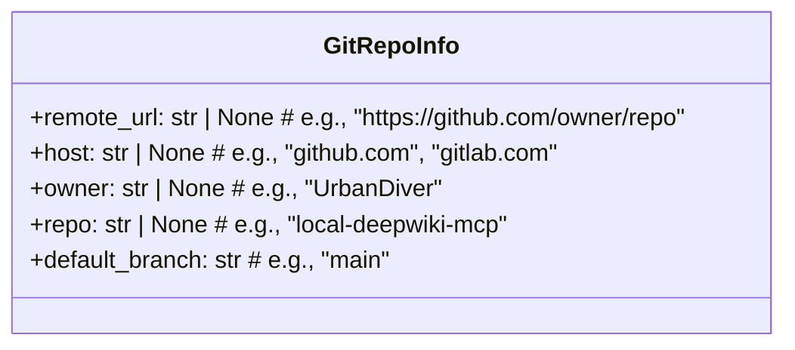
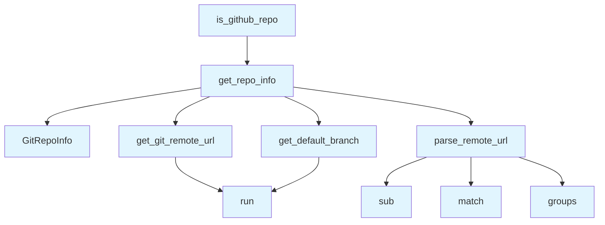

# Git Utilities Module

## File Overview

The `git_utils.py` module provides utilities for extracting information from Git repositories. It focuses on parsing Git remote URLs, determining repository metadata, and building source URLs for linking to remote repositories.

## Classes

### GitRepoInfo

A dataclass that stores information about a Git repository.

**Attributes:**
- `remote_url`: The remote repository URL (e.g., "https://github.com/owner/repo")
- `host`: The hosting service domain (e.g., "github.com", "gitlab.com") 
- `owner`: The repository owner or organization name (e.g., "UrbanDiver")
- `repo`: The repository name (e.g., "local-deepwiki-mcp")
- `default_branch`: The default branch name (e.g., "[main](../export/html.md)")

## Functions

Based on the module structure, this file contains the following functions:

### get_git_remote_url
Retrieves the remote URL from a Git repository.

### parse_remote_url
Parses a Git remote URL to extract host, owner, and repository information.

### get_default_branch
Determines the default branch of a Git repository.

### get_repo_info
Gathers comprehensive repository information and returns a GitRepoInfo instance.

### is_github_repo
Checks if a repository is hosted on GitHub.

### build_source_url
Constructs URLs for linking to source files in the remote repository.

## Usage Examples

```python
from local_deepwiki.core.git_utils import GitRepoInfo, get_repo_info

# Get repository information
repo_info = get_repo_info(Path("/path/to/repo"))

# Access repository details
if repo_info:
    print(f"Repository: {repo_info.owner}/{repo_info.repo}")
    print(f"Host: {repo_info.host}")
    print(f"Default branch: {repo_info.default_branch}")
```

## Related Components

This module integrates with the local_deepwiki logging system through the [`get_logger`](../logging.md) function. It uses standard Python libraries including `subprocess` for Git command execution, `re` for URL parsing, and `pathlib` for file system operations.

## API Reference

### class `GitRepoInfo`

Information about a git repository.

---

### Functions

#### `get_git_remote_url`

```python
def get_git_remote_url(repo_path: Path) -> str | None
```

Get the remote origin URL from git config.


| [Parameter](../generators/api_docs.md) | Type | Default | Description |
|-----------|------|---------|-------------|
| `repo_path` | `Path` | - | Path to the repository. |

**Returns:** `str | None`


#### `parse_remote_url`

```python
def parse_remote_url(url: str) -> tuple[str, str, str] | None
```

Parse remote URL to extract host, owner, and repo name.  Handles various URL formats: - https://github.com/owner/repo.git - https://github.com/owner/repo - git@github.com:owner/repo.git - git@github.com:owner/repo - ssh://git@github.com/owner/repo.git


| [Parameter](../generators/api_docs.md) | Type | Default | Description |
|-----------|------|---------|-------------|
| `url` | `str` | - | Git remote URL. |

**Returns:** `tuple[str, str, str] | None`


#### `get_default_branch`

```python
def get_default_branch(repo_path: Path) -> str
```

Get the default branch name for the repository.  Tries to detect the default branch from: 1. Current HEAD if on a branch 2. Remote HEAD reference 3. Falls back to '[main](../export/html.md)'


| [Parameter](../generators/api_docs.md) | Type | Default | Description |
|-----------|------|---------|-------------|
| `repo_path` | `Path` | - | Path to the repository. |

**Returns:** `str`


#### `get_repo_info`

```python
def get_repo_info(repo_path: Path) -> GitRepoInfo
```

Get complete git repository information.


| [Parameter](../generators/api_docs.md) | Type | Default | Description |
|-----------|------|---------|-------------|
| `repo_path` | `Path` | - | Path to the repository. |

**Returns:** `GitRepoInfo`


#### `is_github_repo`

```python
def is_github_repo(repo_path: Path) -> bool
```

Check if a repository is hosted on GitHub.


| [Parameter](../generators/api_docs.md) | Type | Default | Description |
|-----------|------|---------|-------------|
| `repo_path` | `Path` | - | Path to the repository. |

**Returns:** `bool`


#### `build_source_url`

```python
def build_source_url(repo_info: GitRepoInfo, file_path: str, start_line: int | None = None, end_line: int | None = None) -> str | None
```

Build a URL to the source file on GitHub/GitLab.


| [Parameter](../generators/api_docs.md) | Type | Default | Description |
|-----------|------|---------|-------------|
| `repo_info` | `GitRepoInfo` | - | Repository information from get_repo_info(). |
| `file_path` | `str` | - | Relative path to the source file. |
| `start_line` | `int | None` | `None` | Optional starting line number. |
| `end_line` | `int | None` | `None` | Optional ending line number. |

**Returns:** `str | None`


## Class Diagram



## Call Graph



## Usage Examples

*Examples extracted from test files*

### Test parsing GitHub HTTPS URL

From `test_git_utils.py::test_github_https`:

```python
result = parse_remote_url("https://github.com/owner/repo")
assert result == ("github.com", "owner", "repo")
```

### Test parsing GitHub HTTPS URL with .git suffix

From `test_git_utils.py::test_github_https_with_git_suffix`:

```python
result = parse_remote_url("https://github.com/owner/repo.git")
assert result == ("github.com", "owner", "repo")
```

### Test building GitHub URL without line numbers

From `test_git_utils.py::test_github_url_without_lines`:

```python
repo_info = GitRepoInfo(
    remote_url="https://github.com/owner/repo",
    host="github.com",
    owner="owner",
    repo="repo",
    default_branch="main",
)
result = build_source_url(repo_info, "src/file.py")
assert result == "https://github.com/owner/repo/blob/main/src/file.py"
```

### Test building GitHub URL without line numbers

From `test_git_utils.py::test_github_url_without_lines`:

```python
result = build_source_url(repo_info, "src/file.py")
assert result == "https://github.com/owner/repo/blob/main/src/file.py"
```

### Test building GitHub URL with single line number

From `test_git_utils.py::test_github_url_with_single_line`:

```python
repo_info = GitRepoInfo(
    remote_url="https://github.com/owner/repo",
    host="github.com",
    owner="owner",
    repo="repo",
    default_branch="main",
)
result = build_source_url(repo_info, "src/file.py", start_line=42)
assert result == "https://github.com/owner/repo/blob/main/src/file.py#L42"
```

## Relevant Source Files

- `src/local_deepwiki/core/git_utils.py:18-25`

## See Also

- [wiki](../generators/wiki.md) - uses this
- [logging](../logging.md) - dependency
- [crosslinks](../generators/crosslinks.md) - shares 3 dependencies
- [diagrams](../generators/diagrams.md) - shares 3 dependencies
- [see_also](../generators/see_also.md) - shares 3 dependencies
