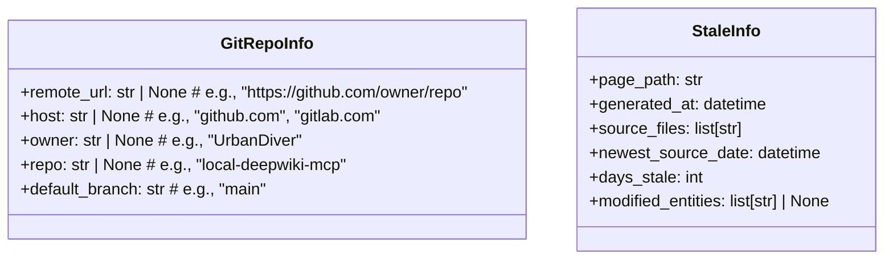
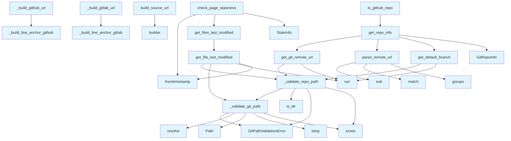

# File: `src/local_deepwiki/core/git_utils.py`

## File Overview

This module provides utilities for interacting with Git repositories, including path validation, repository information retrieval, source URL construction, and staleness detection. It is designed to support the core functionality of the `local_deepwiki` tool by enabling safe Git operations, linking to source files, and determining if documentation pages are stale based on source file changes.

The module centralizes Git-related logic to avoid duplication and ensure consistent behavior across different parts of the application, such as source formatting and staleness checks.

## Key Concepts

### Path Validation
The `_validate_git_path` and `_validate_repo_path` functions provide robust validation for paths used in Git commands. They guard against:
- Null bytes in paths, which can be exploited in C-based tools like Git.
- Option injection by rejecting paths starting with `-`.
- Ensuring paths exist and are within Git repositories.

This approach prevents security vulnerabilities and ensures predictable Git behavior.

### Remote URL Parsing and Repository Info
The `parse_remote_url` function supports multiple Git URL formats (SSH, HTTPS) to extract host, owner, and repository name. This enables building correct source URLs for various Git hosting platforms.

The `get_repo_info` function aggregates remote URL, host, owner, repo, and default branch into a structured `GitRepoInfo` object, centralizing repository metadata access.

### Source URL Construction
The `build_source_url` function dynamically selects the appropriate URL builder based on the repository's hosting platform (e.g., GitHub or GitLab). This is done using a mapping of host keywords to URL-building functions, allowing extensibility.

### Staleness Detection
The `check_page_staleness` function compares the modification timestamps of source files with the timestamp of a generated wiki page. If any source file has been modified more recently than the page was generated, and the difference exceeds a threshold, it flags the page as stale.

This mechanism helps maintain documentation quality by alerting users when documentation may be outdated.

## Integration

This file is used across multiple modules in the `local_deepwiki` project:

- **`source_formatter`** uses `build_source_url` to generate source links in documentation.
- **`stale_detection`** and **`test_stale_detection`** rely on `check_page_staleness` to detect stale pages.
- **`test_git_utils`** directly tests functions like `_validate_git_path`, `parse_remote_url`, and `get_file_last_modified`.

It integrates with the logging system via [`get_logger`](../logging.md) for debugging Git operations and with core data structures like `GitRepoInfo` and `StaleInfo` to pass around repository and staleness data.

## Design Notes

### Security Considerations
Path validation is crucial in Git operations to prevent option injection and other path-based exploits. The validation functions (`_validate_git_path`, `_validate_repo_path`) are designed to be strict and defensive, ensuring that inputs are safe for use with Git commands.

### Performance and Efficiency
The `get_files_last_modified` function avoids multiple Git subprocess calls by iterating through files and fetching dates one by one. While not optimal for large numbers of files, it is simple and reliable. For performance-critical scenarios, a batched Git log approach could be considered.

### Extensibility
URL building is implemented using a registry pattern (`_URL_BUILDERS`) that allows adding support for new Git hosting platforms without modifying core logic. This makes it easy to extend support for services like GitLab, Gitea, etc.

### Error Handling
Git operations are wrapped in try-except blocks to gracefully handle timeouts, missing files, or permission errors. When Git commands fail, the module logs debug messages and returns sensible defaults (e.g., `"main"` as default branch) to avoid breaking the application.

### Fallback Behavior
When repository information is incomplete (e.g., no remote URL or no default branch), the module falls back to sensible defaults. For example, `get_default_branch` defaults to `"main"` if no branch can be detected, and `build_source_url` returns `None` if the repository lacks remote information.

### Timezone Handling
All datetime objects are handled in UTC timezone to ensure consistency across different environments and avoid timezone-related issues in staleness calculations.

## API Reference

### class `GitPathValidationError`

**Inherits from:** `ValueError`

Raised when a path fails git-specific validation.


<details>
<summary>View Source (lines 28-31) | <a href="https://github.com/UrbanDiver/local-deepwiki-mcp/blob/main/src/local_deepwiki/core/git_utils.py#L28-L31">GitHub</a></summary>

```python
class GitPathValidationError(ValueError):
    """Raised when a path fails git-specific validation."""

    pass
```

</details>

### class `GitRepoInfo`

Information about a git repository.


<details>
<summary>View Source (lines 109-116) | <a href="https://github.com/UrbanDiver/local-deepwiki-mcp/blob/main/src/local_deepwiki/core/git_utils.py#L109-L116">GitHub</a></summary>

```python
class GitRepoInfo:
    """Information about a git repository."""

    remote_url: str | None  # e.g., "https://github.com/owner/repo"
    host: str | None  # e.g., "github.com", "gitlab.com"
    owner: str | None  # e.g., "UrbanDiver"
    repo: str | None  # e.g., "local-deepwiki-mcp"
    default_branch: str  # e.g., "main"
```

</details>

### class `StaleInfo`

Information about a potentially stale wiki page.

---


<details>
<summary>View Source (lines 453-461) | <a href="https://github.com/UrbanDiver/local-deepwiki-mcp/blob/main/src/local_deepwiki/core/git_utils.py#L453-L461">GitHub</a></summary>

```python
class StaleInfo:
    """Information about a potentially stale wiki page."""

    page_path: str
    generated_at: datetime
    source_files: list[str]
    newest_source_date: datetime
    days_stale: int
    modified_entities: list[str] | None = None  # Entities modified after doc generation
```

</details>

### Functions

#### `get_git_remote_url`

```python
def get_git_remote_url(repo_path: Path) -> str | None
```

Get the remote origin URL from git config.


| Parameter | Type | Default | Description |
|-----------|------|---------|-------------|
| `repo_path` | `Path` | - | Path to the repository. |

**Returns:** `str | None`


<details>
<summary>View Source (lines 119-146) | <a href="https://github.com/UrbanDiver/local-deepwiki-mcp/blob/main/src/local_deepwiki/core/git_utils.py#L119-L146">GitHub</a></summary>

```python
def get_git_remote_url(repo_path: Path) -> str | None:
    """Get the remote origin URL from git config.

    Args:
        repo_path: Path to the repository.

    Returns:
        Remote URL string or None if not a git repo or no remote.
    """
    try:
        validated_repo = _validate_repo_path(repo_path)
        result = subprocess.run(
            ["git", "config", "--get", "remote.origin.url"],
            cwd=validated_repo,
            capture_output=True,
            text=True,
            timeout=GIT_CONFIG_TIMEOUT,
        )
        if result.returncode == 0:
            return result.stdout.strip()
    except (
        subprocess.TimeoutExpired,
        FileNotFoundError,
        OSError,
        GitPathValidationError,
    ) as e:
        logger.debug("Failed to get git remote URL: %s", e)
    return None
```

</details>

#### `parse_remote_url`

```python
def parse_remote_url(url: str) -> tuple[str, str, str] | None
```

Parse remote URL to extract host, owner, and repo name.  Handles various URL formats: - https://github.com/owner/repo.git - https://github.com/owner/repo - git@github.com:owner/repo.git - git@github.com:owner/repo - ssh://git@github.com/owner/repo.git


| Parameter | Type | Default | Description |
|-----------|------|---------|-------------|
| `url` | `str` | - | Git remote URL. |

**Returns:** `tuple[str, str, str] | None`


<details>
<summary>View Source (lines 149-186) | <a href="https://github.com/UrbanDiver/local-deepwiki-mcp/blob/main/src/local_deepwiki/core/git_utils.py#L149-L186">GitHub</a></summary>

```python
def parse_remote_url(url: str) -> tuple[str, str, str] | None:
    """Parse remote URL to extract host, owner, and repo name.

    Handles various URL formats:
    - https://github.com/owner/repo.git
    - https://github.com/owner/repo
    - git@github.com:owner/repo.git
    - git@github.com:owner/repo
    - ssh://git@github.com/owner/repo.git

    Args:
        url: Git remote URL.

    Returns:
        Tuple of (host, owner, repo) or None if parsing fails.
    """
    # Remove trailing .git
    url = re.sub(r"\.git$", "", url)

    # SSH format: git@host:owner/repo
    ssh_match = re.match(r"^git@([^:]+):(.+)/([^/]+)$", url)
    if ssh_match:
        host, owner, repo = ssh_match.groups()
        return host, owner, repo

    # SSH URL format: ssh://git@host/owner/repo
    ssh_url_match = re.match(r"^ssh://git@([^/]+)/(.+)/([^/]+)$", url)
    if ssh_url_match:
        host, owner, repo = ssh_url_match.groups()
        return host, owner, repo

    # HTTPS format: https://host/owner/repo
    https_match = re.match(r"^https?://([^/]+)/(.+)/([^/]+)$", url)
    if https_match:
        host, owner, repo = https_match.groups()
        return host, owner, repo

    return None
```

</details>

#### `get_default_branch`

```python
def get_default_branch(repo_path: Path) -> str
```

Get the default branch name for the repository.  Tries to detect the default branch from: 1. Current HEAD if on a branch 2. Remote HEAD reference 3. Falls back to 'main'


| Parameter | Type | Default | Description |
|-----------|------|---------|-------------|
| `repo_path` | `Path` | - | Path to the repository. |

**Returns:** `str`


<details>
<summary>View Source (lines 189-243) | <a href="https://github.com/UrbanDiver/local-deepwiki-mcp/blob/main/src/local_deepwiki/core/git_utils.py#L189-L243">GitHub</a></summary>

```python
def get_default_branch(repo_path: Path) -> str:
    """Get the default branch name for the repository.

    Tries to detect the default branch from:
    1. Current HEAD if on a branch
    2. Remote HEAD reference
    3. Falls back to 'main'

    Args:
        repo_path: Path to the repository.

    Returns:
        Branch name string.
    """
    # Validate repo path once for both operations
    try:
        validated_repo = _validate_repo_path(repo_path)
    except GitPathValidationError:
        return "main"

    # Try to get current branch
    try:
        result = subprocess.run(
            ["git", "rev-parse", "--abbrev-ref", "HEAD"],
            cwd=validated_repo,
            capture_output=True,
            text=True,
            timeout=GIT_CONFIG_TIMEOUT,
        )
        if result.returncode == 0:
            branch = result.stdout.strip()
            if branch and branch != "HEAD":  # Not in detached HEAD
                return branch
    except (subprocess.TimeoutExpired, FileNotFoundError, OSError):
        pass

    # Try to get default branch from remote
    try:
        result = subprocess.run(
            ["git", "symbolic-ref", "refs/remotes/origin/HEAD"],
            cwd=validated_repo,
            capture_output=True,
            text=True,
            timeout=GIT_CONFIG_TIMEOUT,
        )
        if result.returncode == 0:
            # Output like: refs/remotes/origin/main
            ref = result.stdout.strip()
            if ref:
                return ref.split("/")[-1]
    except (subprocess.TimeoutExpired, FileNotFoundError, OSError):
        pass

    # Default fallback
    return "main"
```

</details>

#### `get_repo_info`

```python
def get_repo_info(repo_path: Path) -> GitRepoInfo
```

Get complete git repository information.


| Parameter | Type | Default | Description |
|-----------|------|---------|-------------|
| `repo_path` | `Path` | - | Path to the repository. |

**Returns:** `GitRepoInfo`


<details>
<summary>View Source (lines 246-273) | <a href="https://github.com/UrbanDiver/local-deepwiki-mcp/blob/main/src/local_deepwiki/core/git_utils.py#L246-L273">GitHub</a></summary>

```python
def get_repo_info(repo_path: Path) -> GitRepoInfo:
    """Get complete git repository information.

    Args:
        repo_path: Path to the repository.

    Returns:
        GitRepoInfo with available information.
    """
    remote_url = get_git_remote_url(repo_path)
    host = None
    owner = None
    repo = None

    if remote_url:
        parsed = parse_remote_url(remote_url)
        if parsed:
            host, owner, repo = parsed

    default_branch = get_default_branch(repo_path)

    return GitRepoInfo(
        remote_url=remote_url,
        host=host,
        owner=owner,
        repo=repo,
        default_branch=default_branch,
    )
```

</details>

#### `is_github_repo`

```python
def is_github_repo(repo_path: Path) -> bool
```

Check if a repository is hosted on GitHub.


| Parameter | Type | Default | Description |
|-----------|------|---------|-------------|
| `repo_path` | `Path` | - | Path to the repository. |

**Returns:** `bool`


<details>
<summary>View Source (lines 276-288) | <a href="https://github.com/UrbanDiver/local-deepwiki-mcp/blob/main/src/local_deepwiki/core/git_utils.py#L276-L288">GitHub</a></summary>

```python
def is_github_repo(repo_path: Path) -> bool:
    """Check if a repository is hosted on GitHub.

    Args:
        repo_path: Path to the repository.

    Returns:
        True if the repo has a GitHub remote, False otherwise.
    """
    repo_info = get_repo_info(repo_path)
    if repo_info.host:
        return "github.com" in repo_info.host.lower()
    return False
```

</details>

#### `build_source_url`

```python
def build_source_url(repo_info: "GitRepoInfo", file_path: str, start_line: int | None = None, end_line: int | None = None) -> str | None
```

Build a URL to the source file on GitHub/GitLab.


| Parameter | Type | Default | Description |
|-----------|------|---------|-------------|
| `repo_info` | `"GitRepoInfo"` | - | Repository information from get_repo_info(). |
| `file_path` | `str` | - | Relative path to the source file. |
| `start_line` | `int | None` | `None` | Optional starting line number. |
| `end_line` | `int | None` | `None` | Optional ending line number. |

**Returns:** `str | None`


<details>
<summary>View Source (lines 357-382) | <a href="https://github.com/UrbanDiver/local-deepwiki-mcp/blob/main/src/local_deepwiki/core/git_utils.py#L357-L382">GitHub</a></summary>

```python
def build_source_url(
    repo_info: "GitRepoInfo",
    file_path: str,
    start_line: int | None = None,
    end_line: int | None = None,
) -> str | None:
    """Build a URL to the source file on GitHub/GitLab.

    Args:
        repo_info: Repository information from get_repo_info().
        file_path: Relative path to the source file.
        start_line: Optional starting line number.
        end_line: Optional ending line number.

    Returns:
        URL string like https://github.com/owner/repo/blob/main/path/file.py#L10-L20
        Or None if repo_info doesn't have remote information.
    """
    if not repo_info.host or not repo_info.owner or not repo_info.repo:
        return None

    host = repo_info.host.lower()
    for keyword, builder in _URL_BUILDERS:
        if keyword is None or keyword in host:
            return builder(repo_info, file_path, start_line, end_line)  # type: ignore[operator]
    return None  # unreachable, but satisfies type checker
```

</details>

#### `get_file_last_modified`

```python
def get_file_last_modified(repo_path: Path, file_path: str) -> datetime | None
```

Get the last modification date of a file from git history.


| Parameter | Type | Default | Description |
|-----------|------|---------|-------------|
| `repo_path` | `Path` | - | Path to the repository root. |
| `file_path` | `str` | - | Relative path to the file. |

**Returns:** `datetime | None`


<details>
<summary>View Source (lines 385-420) | <a href="https://github.com/UrbanDiver/local-deepwiki-mcp/blob/main/src/local_deepwiki/core/git_utils.py#L385-L420">GitHub</a></summary>

```python
def get_file_last_modified(repo_path: Path, file_path: str) -> datetime | None:
    """Get the last modification date of a file from git history.

    Args:
        repo_path: Path to the repository root.
        file_path: Relative path to the file.

    Returns:
        datetime of last modification, or None if not in git or error.
    """
    try:
        validated_repo = _validate_repo_path(repo_path)
        # Validate file_path relative to repo
        full_file_path = validated_repo / file_path
        _validate_git_path(full_file_path)

        # Use -- separator to prevent option injection from file_path
        result = subprocess.run(
            ["git", "log", "-1", "--format=%ct", "--", file_path],
            cwd=validated_repo,
            capture_output=True,
            text=True,
            timeout=GIT_LOG_TIMEOUT,
        )
        if result.returncode == 0 and result.stdout.strip():
            timestamp = int(result.stdout.strip())
            return datetime.fromtimestamp(timestamp, tz=timezone.utc)
    except (
        subprocess.TimeoutExpired,
        FileNotFoundError,
        OSError,
        ValueError,
        GitPathValidationError,
    ) as e:
        logger.debug("Failed to get last modified date for %s: %s", file_path, e)
    return None
```

</details>

#### `get_files_last_modified`

```python
def get_files_last_modified(repo_path: Path, file_paths: list[str]) -> dict[str, datetime]
```

Get last modification dates for multiple files efficiently.  Uses a single git log command to get dates for all files.


| Parameter | Type | Default | Description |
|-----------|------|---------|-------------|
| `repo_path` | `Path` | - | Path to the repository root. |
| `file_paths` | `list[str]` | - | List of relative file paths. |

**Returns:** `dict[str, datetime]`


<details>
<summary>View Source (lines 423-449) | <a href="https://github.com/UrbanDiver/local-deepwiki-mcp/blob/main/src/local_deepwiki/core/git_utils.py#L423-L449">GitHub</a></summary>

```python
def get_files_last_modified(
    repo_path: Path,
    file_paths: list[str],
) -> dict[str, datetime]:
    """Get last modification dates for multiple files efficiently.

    Uses a single git log command to get dates for all files.

    Args:
        repo_path: Path to the repository root.
        file_paths: List of relative file paths.

    Returns:
        Dictionary mapping file paths to their last modification datetime.
    """
    if not file_paths:
        return {}

    result: dict[str, datetime] = {}

    # Get dates for each file (git log doesn't support bulk queries well)
    for file_path in file_paths:
        mod_date = get_file_last_modified(repo_path, file_path)
        if mod_date:
            result[file_path] = mod_date

    return result
```

</details>

#### `check_page_staleness`

```python
def check_page_staleness(repo_path: Path, page_path: str, generated_at: float, source_files: list[str], stale_threshold_days: int = 0) -> StaleInfo | None
```

Check if a wiki page is potentially stale.  A page is considered stale if any of its source files have been modified after the page was generated.


| Parameter | Type | Default | Description |
|-----------|------|---------|-------------|
| `repo_path` | `Path` | - | Path to the repository root. |
| `page_path` | `str` | - | Wiki page path. |
| `generated_at` | `float` | - | Timestamp when the page was generated. |
| `source_files` | `list[str]` | - | Source files that contributed to the page. |
| `stale_threshold_days` | `int` | `0` | Minimum days difference to consider stale. |

**Returns:** `StaleInfo | None`


<details>
<summary>View Source (lines 464-513) | <a href="https://github.com/UrbanDiver/local-deepwiki-mcp/blob/main/src/local_deepwiki/core/git_utils.py#L464-L513">GitHub</a></summary>

```python
def check_page_staleness(
    repo_path: Path,
    page_path: str,
    generated_at: float,
    source_files: list[str],
    stale_threshold_days: int = 0,
) -> StaleInfo | None:
    """Check if a wiki page is potentially stale.

    A page is considered stale if any of its source files have been
    modified after the page was generated.

    Args:
        repo_path: Path to the repository root.
        page_path: Wiki page path.
        generated_at: Timestamp when the page was generated.
        source_files: Source files that contributed to the page.
        stale_threshold_days: Minimum days difference to consider stale.

    Returns:
        StaleInfo if the page is stale, None otherwise.
    """
    if not source_files:
        return None

    doc_date = datetime.fromtimestamp(generated_at, tz=timezone.utc)
    mod_dates = get_files_last_modified(repo_path, source_files)

    if not mod_dates:
        return None

    # Find the newest source modification
    newest_file = max(mod_dates.items(), key=lambda x: x[1])
    newest_date = newest_file[1]

    # Check if source is newer than doc
    if newest_date <= doc_date:
        return None

    days_stale = (newest_date - doc_date).days
    if days_stale < stale_threshold_days:
        return None

    return StaleInfo(
        page_path=page_path,
        generated_at=doc_date,
        source_files=source_files,
        newest_source_date=newest_date,
        days_stale=days_stale,
    )
```

</details>

## Class Diagram


```mermaid
classDiagram
    class GitRepoInfo {
        +remote_url: str | None  # e.g., "https://github.com/owner/repo"
        +host: str | None  # e.g., "github.com", "gitlab.com"
        +owner: str | None  # e.g., "UrbanDiver"
        +repo: str | None  # e.g., "local-deepwiki-mcp"
        +default_branch: str  # e.g., "main"
    }
    class StaleInfo {
        +page_path: str
        +generated_at: datetime
        +source_files: list[str]
        +newest_source_date: datetime
        +days_stale: int
        +modified_entities: list[str] | None
    }
```

## Call Graph


```mermaid
flowchart TD
    N0[GitPathValidationError]
    N1[GitRepoInfo]
    N2[Path]
    N3[StaleInfo]
    N4[_build_github_url]
    N5[_build_gitlab_url]
    N6[_build_line_anchor_github]
    N7[_build_line_anchor_gitlab]
    N8[_validate_git_path]
    N9[_validate_repo_path]
    N10[build_source_url]
    N11[builder]
    N12[check_page_staleness]
    N13[exists]
    N14[fromtimestamp]
    N15[get_default_branch]
    N16[get_file_last_modified]
    N17[get_files_last_modified]
    N18[get_git_remote_url]
    N19[get_repo_info]
    N20[groups]
    N21[is_dir]
    N22[is_github_repo]
    N23[lstrip]
    N24[match]
    N25[parse_remote_url]
    N26[resolve]
    N27[run]
    N28[sub]
    N8 --> N0
    N8 --> N26
    N8 --> N2
    N8 --> N23
    N8 --> N13
    N9 --> N8
    N9 --> N21
    N9 --> N0
    N9 --> N13
    N18 --> N9
    N18 --> N27
    N25 --> N28
    N25 --> N24
    N25 --> N20
    N15 --> N9
    N15 --> N27
    N19 --> N18
    N19 --> N25
    N19 --> N15
    N19 --> N1
    N22 --> N19
    N5 --> N7
    N4 --> N6
    N10 --> N11
    N16 --> N9
    N16 --> N8
    N16 --> N27
    N16 --> N14
    N17 --> N16
    N12 --> N14
    N12 --> N17
    N12 --> N3
    classDef func fill:#e1f5fe
    class N0,N1,N2,N3,N4,N5,N6,N7,N8,N9,N10,N11,N12,N13,N14,N15,N16,N17,N18,N19,N20,N21,N22,N23,N24,N25,N26,N27,N28 func
```

## Used By

Functions and methods in this file and their callers:

- **`GitPathValidationError`**: called by `_validate_git_path`, `_validate_repo_path`
- **`GitRepoInfo`**: called by `get_repo_info`
- **`Path`**: called by `_validate_git_path`
- **`StaleInfo`**: called by `check_page_staleness`
- **`_build_line_anchor_github`**: called by `_build_github_url`
- **`_build_line_anchor_gitlab`**: called by `_build_gitlab_url`
- **`_validate_git_path`**: called by `_validate_repo_path`, `get_file_last_modified`
- **`_validate_repo_path`**: called by `get_default_branch`, `get_file_last_modified`, `get_git_remote_url`
- **`builder`**: called by `build_source_url`
- **`exists`**: called by `_validate_git_path`, `_validate_repo_path`
- **`fromtimestamp`**: called by `check_page_staleness`, `get_file_last_modified`
- **`get_default_branch`**: called by `get_repo_info`
- **`get_file_last_modified`**: called by `get_files_last_modified`
- **`get_files_last_modified`**: called by `check_page_staleness`
- **`get_git_remote_url`**: called by `get_repo_info`
- **`get_repo_info`**: called by `is_github_repo`
- **`groups`**: called by `parse_remote_url`
- **`is_dir`**: called by `_validate_repo_path`
- **`lstrip`**: called by `_validate_git_path`
- **`match`**: called by `parse_remote_url`
- **`parse_remote_url`**: called by `get_repo_info`
- **`resolve`**: called by `_validate_git_path`
- **`run`**: called by `get_default_branch`, `get_file_last_modified`, `get_git_remote_url`
- **`sub`**: called by `parse_remote_url`

## Usage Examples

*Examples extracted from test files*

### Test valid path returns absolute Path object

From `test_git_utils.py::TestValidateGitPath::test_valid_path_returns_resolved_path`:

```python
test_file = tmp_path / "test.txt"
test_file.write_text("test")
result = _validate_git_path(test_file)
assert result.is_absolute()
assert result.exists()
```

### Test rejects paths starting with dash (option injection prevention)

From `test_git_utils.py::TestValidateGitPath::test_rejects_path_starting_with_dash`:

```python
with pytest.raises(GitPathValidationError, match="starts with '-'"):
    _validate_git_path("-malicious")
```

### Test rejects paths starting with dash (option injection prevention)

From `test_git_utils.py::TestValidateGitPath::test_rejects_path_starting_with_dash`:

```python
with pytest.raises(GitPathValidationError, match="starts with '-'"):
    _validate_git_path("-malicious")
```

### Test rejects paths containing null bytes

From `test_git_utils.py::TestValidateGitPath::test_rejects_path_with_null_byte`:

```python
with pytest.raises(GitPathValidationError, match="null byte"):
    _validate_git_path("path\x00with_null")
```

### Test valid git repo returns absolute Path object

From `test_git_utils.py::TestValidateRepoPath::test_valid_repo_returns_resolved_path`:

```python
(tmp_path / ".git").mkdir()
result = _validate_repo_path(tmp_path)
assert result.is_absolute()
assert result.exists()
```


## Last Modified

| Entity | Type | Author | Date | Commit |
|--------|------|--------|------|--------|
| `_build_line_anchor_gitlab` | function | Brian Breidenbach | 2 days ago | `d9b4ec4` refactor: decompose CC > 15... |
| `_build_line_anchor_github` | function | Brian Breidenbach | 2 days ago | `d9b4ec4` refactor: decompose CC > 15... |
| `_build_gitlab_url` | function | Brian Breidenbach | 2 days ago | `d9b4ec4` refactor: decompose CC > 15... |
| `_build_github_url` | function | Brian Breidenbach | 2 days ago | `d9b4ec4` refactor: decompose CC > 15... |
| `build_source_url` | function | Brian Breidenbach | 2 days ago | `d9b4ec4` refactor: decompose CC > 15... |
| `get_file_last_modified` | function | Brian Breidenbach | 1 week ago | `fd8bb32` fix: code quality — consoli... |
| `check_page_staleness` | function | Brian Breidenbach | 1 week ago | `fd8bb32` fix: code quality — consoli... |
| `get_git_remote_url` | function | Brian Breidenbach | Feb 11, 2026 | `ba96da1` fix: publication plan P0-P2... |
| `get_default_branch` | function | Brian Breidenbach | Feb 09, 2026 | `ac01653` refactor: extract magic num... |
| `GitPathValidationError` | class | Brian Breidenbach | Jan 26, 2026 | `7f23c3c` Security fixes: Git command... |
| `_validate_git_path` | function | Brian Breidenbach | Jan 26, 2026 | `7f23c3c` Security fixes: Git command... |
| `_validate_repo_path` | function | Brian Breidenbach | Jan 26, 2026 | `7f23c3c` Security fixes: Git command... |
| `StaleInfo` | class | Brian Breidenbach | Jan 16, 2026 | `59bad6c` Add stale documentation det... |
| `get_files_last_modified` | function | Brian Breidenbach | Jan 16, 2026 | `59bad6c` Add stale documentation det... |
| `is_github_repo` | function | Brian Breidenbach | Jan 14, 2026 | `52202b9` Add automatic cloud provide... |
| `GitRepoInfo` | class | Brian Breidenbach | Jan 14, 2026 | `2708dc5` Add GitHub/GitLab links to ... |
| `parse_remote_url` | function | Brian Breidenbach | Jan 14, 2026 | `2708dc5` Add GitHub/GitLab links to ... |
| `get_repo_info` | function | Brian Breidenbach | Jan 14, 2026 | `2708dc5` Add GitHub/GitLab links to ... |

## Additional Source Code

Source code for functions and methods not listed in the API Reference above.

#### `_validate_git_path`

<details>
<summary>View Source (lines 34-67) | <a href="https://github.com/UrbanDiver/local-deepwiki-mcp/blob/main/src/local_deepwiki/core/git_utils.py#L34-L67">GitHub</a></summary>

```python
def _validate_git_path(path: str | Path) -> Path:
    """Validate a path for safe use in git commands.

    Prevents git option injection and other path-based attacks.

    Args:
        path: Path to validate.

    Returns:
        Validated absolute Path object.

    Raises:
        GitPathValidationError: If the path fails validation.
    """
    # Check for null bytes first (could truncate path in C-based git)
    # Must check before Path operations since they raise ValueError on null bytes
    if "\x00" in str(path):
        raise GitPathValidationError(f"Path contains null byte: {path!r}")

    # Convert to Path and resolve to absolute
    path_obj = Path(path).resolve()

    # Check for option injection (paths starting with -)
    # After resolve(), check both the full path and the original input
    if str(path).lstrip().startswith("-"):
        raise GitPathValidationError(
            f"Path starts with '-' which could be interpreted as git option: {path!r}"
        )

    # Check that the path exists
    if not path_obj.exists():
        raise GitPathValidationError(f"Path does not exist: {path_obj}")

    return path_obj
```

</details>


#### `_validate_repo_path`

<details>
<summary>View Source (lines 70-105) | <a href="https://github.com/UrbanDiver/local-deepwiki-mcp/blob/main/src/local_deepwiki/core/git_utils.py#L70-L105">GitHub</a></summary>

```python
def _validate_repo_path(repo_path: str | Path) -> Path:
    """Validate a repository path for safe use in git commands.

    Performs all checks from _validate_git_path plus repository-specific checks.

    Args:
        repo_path: Path to the repository root.

    Returns:
        Validated absolute Path object.

    Raises:
        GitPathValidationError: If the path fails validation.
    """
    validated = _validate_git_path(repo_path)

    # Must be a directory
    if not validated.is_dir():
        raise GitPathValidationError(f"Repository path is not a directory: {validated}")

    # Check if it's a git repository (has .git or is inside one)
    # Walk up to find .git directory
    check_path = validated
    found_git = False
    while check_path != check_path.parent:
        if (check_path / ".git").exists():
            found_git = True
            break
        check_path = check_path.parent

    if not found_git:
        raise GitPathValidationError(
            f"Path is not inside a git repository: {validated}"
        )

    return validated
```

</details>


#### `_build_line_anchor_gitlab`

<details>
<summary>View Source (lines 291-303) | <a href="https://github.com/UrbanDiver/local-deepwiki-mcp/blob/main/src/local_deepwiki/core/git_utils.py#L291-L303">GitHub</a></summary>

```python
def _build_line_anchor_gitlab(
    start_line: int | None,
    end_line: int | None,
) -> str:
    """Return a GitLab-style line anchor fragment, e.g. ``#L5-10``.

    Returns an empty string when no line is specified.
    """
    if start_line is None:
        return ""
    if end_line is not None and end_line != start_line:
        return f"#L{start_line}-{end_line}"
    return f"#L{start_line}"
```

</details>


#### `_build_line_anchor_github`

<details>
<summary>View Source (lines 306-318) | <a href="https://github.com/UrbanDiver/local-deepwiki-mcp/blob/main/src/local_deepwiki/core/git_utils.py#L306-L318">GitHub</a></summary>

```python
def _build_line_anchor_github(
    start_line: int | None,
    end_line: int | None,
) -> str:
    """Return a GitHub-style line anchor fragment, e.g. ``#L5-L10``.

    Returns an empty string when no line is specified.
    """
    if start_line is None:
        return ""
    if end_line is not None and end_line != start_line:
        return f"#L{start_line}-L{end_line}"
    return f"#L{start_line}"
```

</details>


#### `_build_gitlab_url`

<details>
<summary>View Source (lines 321-332) | <a href="https://github.com/UrbanDiver/local-deepwiki-mcp/blob/main/src/local_deepwiki/core/git_utils.py#L321-L332">GitHub</a></summary>

```python
def _build_gitlab_url(
    repo_info: "GitRepoInfo",
    file_path: str,
    start_line: int | None,
    end_line: int | None,
) -> str:
    """Build a GitLab source URL (uses ``/-/blob/`` path prefix)."""
    base_url = (
        f"https://{repo_info.host}/{repo_info.owner}/{repo_info.repo}"
        f"/-/blob/{repo_info.default_branch}/{file_path}"
    )
    return base_url + _build_line_anchor_gitlab(start_line, end_line)
```

</details>


#### `_build_github_url`

<details>
<summary>View Source (lines 335-346) | <a href="https://github.com/UrbanDiver/local-deepwiki-mcp/blob/main/src/local_deepwiki/core/git_utils.py#L335-L346">GitHub</a></summary>

```python
def _build_github_url(
    repo_info: "GitRepoInfo",
    file_path: str,
    start_line: int | None,
    end_line: int | None,
) -> str:
    """Build a GitHub-style source URL (also used as the default fallback)."""
    base_url = (
        f"https://{repo_info.host}/{repo_info.owner}/{repo_info.repo}"
        f"/blob/{repo_info.default_branch}/{file_path}"
    )
    return base_url + _build_line_anchor_github(start_line, end_line)
```

</details>

## Relevant Source Files

- `src/local_deepwiki/core/git_utils.py:28-31`
