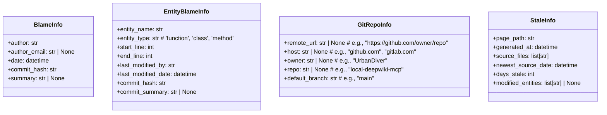
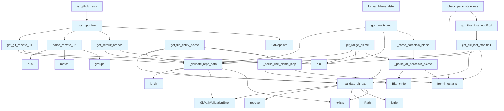

# File Overview

This file, `src/local_deepwiki/core/git_utils.py`, provides utilities for interacting with Git repositories. It includes functions for validating paths, retrieving repository information, parsing remote URLs, and obtaining blame information for code lines or ranges. The module is designed to support safe and consistent Git operations within the `local_deepwiki` project, particularly for generating documentation and tracking source file changes.

## Dependencies

This file imports:
- `re` for regular expression operations
- `subprocess` for executing Git commands
- `dataclass` from `dataclasses` for defining structured data classes
- `datetime` for date and time handling
- `Path` from `pathlib` for path manipulation
- `get_logger` from `local_deepwiki.logging` for logging

## Related Files

This file is used by:
- `tests/test_plugins.py` (via `test_git_utils`)
- `src/local_deepwiki/cli/__init__.py`
- `src/local_deepwiki/core/__init__.py`
- `src/local_deepwiki/generators/source_refs.py`
- `src/local_deepwiki/generators/wiki.py`

# Classes

## GitPathValidationError

Raised when a path fails Git-specific validation.

## GitRepoInfo

Information about a Git repository.

### Attributes
- `remote_url`: str | None - e.g., "https://github.com/owner/repo"
- `host`: str | None - e.g., "github.com", "gitlab.com"
- `owner`: str | None - e.g., "UrbanDiver"
- `repo`: str | None - e.g., "local-deepwiki-mcp"
- `default_branch`: str - e.g., "main"

## BlameInfo

Git blame information for a line or range.

### Attributes
- `author`: str
- `author_email`: str | None
- `date`: datetime
- `commit_hash`: str
- `summary`: str | None - Commit message summary

## EntityBlameInfo

Blame information for a code entity (function, class, method).

### Attributes
- `entity_name`: str
- `entity_type`: str - 'function', 'class', 'method'
- `start_line`: int
- `end_line`: int
- `last_modified_by`: str
- `last_modified_date`: datetime
- `commit_hash`: str
- `commit_summary`: str | None

## StaleInfo

Information about a potentially stale wiki page.

### Attributes
- `page_path`: str
- `generated_at`: datetime
- `source_files`: list[str]
- `newest_source_date`: datetime
- `days_stale`: int
- `modified_entities`: list[str] | None - Entities modified after doc generation

# Functions

## _validate_git_path

Validate a path for safe use in Git commands.

### Parameters
- `path`: str | Path - Path to validate.

### Returns
- `Path` - Validated absolute Path object.

### Raises
- `GitPathValidationError` - If the path fails validation.

## _validate_repo_path

Validate a repository path for safe use in Git commands.

### Parameters
- `repo_path`: str | Path - Path to the repository root.

### Returns
- `Path` - Validated absolute Path object.

### Raises
- `GitPathValidationError` - If the path fails validation.

## get_git_remote_url

Get the remote origin URL from Git config.

### Parameters
- `repo_path`: Path - Path to the repository.

### Returns
- `str | None` - Remote URL string or None if not a Git repo or no remote.

## parse_remote_url

Parse remote URL to extract host, owner, and repo name.

### Parameters
- `url`: str - Git remote URL.

### Returns
- `tuple[str, str, str] | None` - Tuple of (host, owner, repo) or None if parsing fails.

## get_default_branch

Get the default branch name for the repository.

### Parameters
- `repo_path`: Path - Path to the repository.

### Returns
- `str` - Branch name string.

## get_repo_info

Get complete Git repository information.

### Parameters
- `repo_path`: Path - Path to the repository.

### Returns
- `GitRepoInfo` - GitRepoInfo with available information.

## is_github_repo

Check if a repository is hosted on GitHub.

### Parameters
- `repo_path`: Path - Path to the repository.

### Returns
- `bool` - True if the repo has a GitHub remote, False otherwise.

## build_source_url

Build a URL to the source file on GitHub/GitLab.

### Parameters
- `repo_info`: GitRepoInfo - Repository information from `get_repo_info()`.
- `file_path`: str - Relative path to the source file.
- `start_line`: int | None - Optional starting line number.
- `end_line`: int | None - Optional ending line number.

### Returns
- `str | None` - URL string like `https://github.com/owner/repo/blob/main/path/file.py#L10-L20` or None if repo_info doesn't have remote information.

## get_line_blame

Get blame information for a specific line in a file.

### Parameters
- `repo_path`: Path - Path to the repository.
- `file_path`: str - Path to the file.
- `line_number`: int - Line number to get blame for.

### Returns
- `BlameInfo` - Blame information for the line.

## get_range_blame

Get blame information for a range of lines in a file.

### Parameters
- `repo_path`: Path - Path to the repository.
- `file_path`: str - Path to the file.
- `start_line`: int - Starting line number.
- `end_line`: int - Ending line number.

### Returns
- `list[BlameInfo]` - List of blame information for the lines.

## _parse_porcelain_blame

Parse porcelain format blame output.

### Parameters
- `output`: str - Raw blame output from Git.

### Returns
- `list[BlameInfo]` - List of parsed `BlameInfo` objects.

## _parse_all_porcelain_blame

Parse all blame lines from a porcelain output.

### Parameters
- `output`: str - Raw blame output from Git.

### Returns
- `list[BlameInfo]` - List of parsed `BlameInfo` objects.

## get_file_entity_blame

Get blame information for all entities in a file.

### Parameters
- `repo_path`: Path - Path to the repository.
- `file_path`: str - Path to the file.
- `entity_type`: str - Type of entity to find ('function', 'class', 'method').

### Returns
- `list[EntityBlameInfo]` - List of entity blame information.

## _parse_line_blame_map

Parse a blame map for a line.

### Parameters
- `line`: str - Line from Git blame output.

### Returns
- `BlameInfo` - Parsed `BlameInfo` object.

## format_blame_date

Format a Git blame date string.

### Parameters
- `date_str`: str - Date string from Git.

### Returns
- `datetime` - Formatted datetime object.

## get_file_last_modified

Get the last modified date of a file.

### Parameters
- `repo_path`: Path - Path to the repository.
- `file_path`: str - Path to the file.

### Returns
- `datetime` - Last modified date of the file.

## check_stale_pages

Check if wiki pages are stale.

### Parameters
- `repo_path`: Path - Path to the repository.
- `page_path`: str - Path to the wiki page.
- `source_files`: list[str] - List of source files.

### Returns
- `StaleInfo` - Information about whether the page is stale.

# Integration

This file integrates with the larger `local_deepwiki` project by providing core Git utilities needed for documentation generation and source tracking. It is used by CLI components, core modules, and documentation generators to fetch repository metadata, blame information, and source URLs. The functions and classes defined here support features such as:
- Generating source links in documentation
- Tracking when source files were last modified
- Identifying stale documentation pages
- Validating paths before Git operations

# Usage Examples

```python
from local_deepwiki.core.git_utils import get_repo_info, is_github_repo, build_source_url

# Get repository information
repo_info = get_repo_info("/path/to/repo")
print(repo_info.host)  # e.g., "github.com"

# Check if repository is on GitHub
is_github = is_github_repo("/path/to/repo")
print(is_github)  # True or False

# Build a source URL
url = build_source_url(repo_info, "src/main.py", start_line=10, end_line=20)
print(url)  # e.g., "https://github.com/user/repo/blob/main/src/main.py#L10-L20"
```

## API Reference

### class `GitPathValidationError`

**Inherits from:** `ValueError`

Raised when a path fails git-specific validation.


<details>
<summary>View Source (lines 19-22) | <a href="https://github.com/UrbanDiver/local-deepwiki-mcp/blob/main/src/local_deepwiki/core/git_utils.py#L19-L22">GitHub</a></summary>

```python
class GitPathValidationError(ValueError):
    """Raised when a path fails git-specific validation."""

    pass
```

</details>

### class `GitRepoInfo`

Information about a git repository.


<details>
<summary>View Source (lines 100-107) | <a href="https://github.com/UrbanDiver/local-deepwiki-mcp/blob/main/src/local_deepwiki/core/git_utils.py#L100-L107">GitHub</a></summary>

```python
class GitRepoInfo:
    """Information about a git repository."""

    remote_url: str | None  # e.g., "https://github.com/owner/repo"
    host: str | None  # e.g., "github.com", "gitlab.com"
    owner: str | None  # e.g., "UrbanDiver"
    repo: str | None  # e.g., "local-deepwiki-mcp"
    default_branch: str  # e.g., "main"
```

</details>

### class `BlameInfo`

Git blame information for a line or range.


<details>
<summary>View Source (lines 322-329) | <a href="https://github.com/UrbanDiver/local-deepwiki-mcp/blob/main/src/local_deepwiki/core/git_utils.py#L322-L329">GitHub</a></summary>

```python
class BlameInfo:
    """Git blame information for a line or range."""

    author: str
    author_email: str | None
    date: datetime
    commit_hash: str
    summary: str | None = None  # Commit message summary
```

</details>

### class `EntityBlameInfo`

Blame information for a code entity (function, class, method).


<details>
<summary>View Source (lines 333-343) | <a href="https://github.com/UrbanDiver/local-deepwiki-mcp/blob/main/src/local_deepwiki/core/git_utils.py#L333-L343">GitHub</a></summary>

```python
class EntityBlameInfo:
    """Blame information for a code entity (function, class, method)."""

    entity_name: str
    entity_type: str  # 'function', 'class', 'method'
    start_line: int
    end_line: int
    last_modified_by: str
    last_modified_date: datetime
    commit_hash: str
    commit_summary: str | None = None
```

</details>

### class `StaleInfo`

Information about a potentially stale wiki page.

---


<details>
<summary>View Source (lines 756-764) | <a href="https://github.com/UrbanDiver/local-deepwiki-mcp/blob/main/src/local_deepwiki/core/git_utils.py#L756-L764">GitHub</a></summary>

```python
class StaleInfo:
    """Information about a potentially stale wiki page."""

    page_path: str
    generated_at: datetime
    source_files: list[str]
    newest_source_date: datetime
    days_stale: int
    modified_entities: list[str] | None = None  # Entities modified after doc generation
```

</details>

### Functions

#### `get_git_remote_url`

```python
def get_git_remote_url(repo_path: Path) -> str | None
```

Get the remote origin URL from git config.


| Parameter | Type | Default | Description |
|-----------|------|---------|-------------|
| `repo_path` | `Path` | - | Path to the repository. |

**Returns:** `str | None`


<details>
<summary>View Source (lines 110-132) | <a href="https://github.com/UrbanDiver/local-deepwiki-mcp/blob/main/src/local_deepwiki/core/git_utils.py#L110-L132">GitHub</a></summary>

```python
def get_git_remote_url(repo_path: Path) -> str | None:
    """Get the remote origin URL from git config.

    Args:
        repo_path: Path to the repository.

    Returns:
        Remote URL string or None if not a git repo or no remote.
    """
    try:
        validated_repo = _validate_repo_path(repo_path)
        result = subprocess.run(
            ["git", "config", "--get", "remote.origin.url"],
            cwd=validated_repo,
            capture_output=True,
            text=True,
            timeout=5,
        )
        if result.returncode == 0:
            return result.stdout.strip()
    except (subprocess.TimeoutExpired, FileNotFoundError, OSError, GitPathValidationError) as e:
        logger.debug(f"Failed to get git remote URL: {e}")
    return None
```

</details>

#### `parse_remote_url`

```python
def parse_remote_url(url: str) -> tuple[str, str, str] | None
```

Parse remote URL to extract host, owner, and repo name.  Handles various URL formats: - https://github.com/owner/repo.git - https://github.com/owner/repo - git@github.com:owner/repo.git - git@github.com:owner/repo - ssh://git@github.com/owner/repo.git


| Parameter | Type | Default | Description |
|-----------|------|---------|-------------|
| `url` | `str` | - | Git remote URL. |

**Returns:** `tuple[str, str, str] | None`


<details>
<summary>View Source (lines 135-172) | <a href="https://github.com/UrbanDiver/local-deepwiki-mcp/blob/main/src/local_deepwiki/core/git_utils.py#L135-L172">GitHub</a></summary>

```python
def parse_remote_url(url: str) -> tuple[str, str, str] | None:
    """Parse remote URL to extract host, owner, and repo name.

    Handles various URL formats:
    - https://github.com/owner/repo.git
    - https://github.com/owner/repo
    - git@github.com:owner/repo.git
    - git@github.com:owner/repo
    - ssh://git@github.com/owner/repo.git

    Args:
        url: Git remote URL.

    Returns:
        Tuple of (host, owner, repo) or None if parsing fails.
    """
    # Remove trailing .git
    url = re.sub(r"\.git$", "", url)

    # SSH format: git@host:owner/repo
    ssh_match = re.match(r"^git@([^:]+):(.+)/([^/]+)$", url)
    if ssh_match:
        host, owner, repo = ssh_match.groups()
        return host, owner, repo

    # SSH URL format: ssh://git@host/owner/repo
    ssh_url_match = re.match(r"^ssh://git@([^/]+)/(.+)/([^/]+)$", url)
    if ssh_url_match:
        host, owner, repo = ssh_url_match.groups()
        return host, owner, repo

    # HTTPS format: https://host/owner/repo
    https_match = re.match(r"^https?://([^/]+)/(.+)/([^/]+)$", url)
    if https_match:
        host, owner, repo = https_match.groups()
        return host, owner, repo

    return None
```

</details>

#### `get_default_branch`

```python
def get_default_branch(repo_path: Path) -> str
```

Get the default branch name for the repository.  Tries to detect the default branch from: 1. Current HEAD if on a branch 2. Remote HEAD reference 3. Falls back to 'main'


| Parameter | Type | Default | Description |
|-----------|------|---------|-------------|
| `repo_path` | `Path` | - | Path to the repository. |

**Returns:** `str`


<details>
<summary>View Source (lines 175-229) | <a href="https://github.com/UrbanDiver/local-deepwiki-mcp/blob/main/src/local_deepwiki/core/git_utils.py#L175-L229">GitHub</a></summary>

```python
def get_default_branch(repo_path: Path) -> str:
    """Get the default branch name for the repository.

    Tries to detect the default branch from:
    1. Current HEAD if on a branch
    2. Remote HEAD reference
    3. Falls back to 'main'

    Args:
        repo_path: Path to the repository.

    Returns:
        Branch name string.
    """
    # Validate repo path once for both operations
    try:
        validated_repo = _validate_repo_path(repo_path)
    except GitPathValidationError:
        return "main"

    # Try to get current branch
    try:
        result = subprocess.run(
            ["git", "rev-parse", "--abbrev-ref", "HEAD"],
            cwd=validated_repo,
            capture_output=True,
            text=True,
            timeout=5,
        )
        if result.returncode == 0:
            branch = result.stdout.strip()
            if branch and branch != "HEAD":  # Not in detached HEAD
                return branch
    except (subprocess.TimeoutExpired, FileNotFoundError, OSError):
        pass

    # Try to get default branch from remote
    try:
        result = subprocess.run(
            ["git", "symbolic-ref", "refs/remotes/origin/HEAD"],
            cwd=validated_repo,
            capture_output=True,
            text=True,
            timeout=5,
        )
        if result.returncode == 0:
            # Output like: refs/remotes/origin/main
            ref = result.stdout.strip()
            if ref:
                return ref.split("/")[-1]
    except (subprocess.TimeoutExpired, FileNotFoundError, OSError):
        pass

    # Default fallback
    return "main"
```

</details>

#### `get_repo_info`

```python
def get_repo_info(repo_path: Path) -> GitRepoInfo
```

Get complete git repository information.


| Parameter | Type | Default | Description |
|-----------|------|---------|-------------|
| `repo_path` | `Path` | - | Path to the repository. |

**Returns:** `GitRepoInfo`


<details>
<summary>View Source (lines 232-259) | <a href="https://github.com/UrbanDiver/local-deepwiki-mcp/blob/main/src/local_deepwiki/core/git_utils.py#L232-L259">GitHub</a></summary>

```python
def get_repo_info(repo_path: Path) -> GitRepoInfo:
    """Get complete git repository information.

    Args:
        repo_path: Path to the repository.

    Returns:
        GitRepoInfo with available information.
    """
    remote_url = get_git_remote_url(repo_path)
    host = None
    owner = None
    repo = None

    if remote_url:
        parsed = parse_remote_url(remote_url)
        if parsed:
            host, owner, repo = parsed

    default_branch = get_default_branch(repo_path)

    return GitRepoInfo(
        remote_url=remote_url,
        host=host,
        owner=owner,
        repo=repo,
        default_branch=default_branch,
    )
```

</details>

#### `is_github_repo`

```python
def is_github_repo(repo_path: Path) -> bool
```

Check if a repository is hosted on GitHub.


| Parameter | Type | Default | Description |
|-----------|------|---------|-------------|
| `repo_path` | `Path` | - | Path to the repository. |

**Returns:** `bool`


<details>
<summary>View Source (lines 262-274) | <a href="https://github.com/UrbanDiver/local-deepwiki-mcp/blob/main/src/local_deepwiki/core/git_utils.py#L262-L274">GitHub</a></summary>

```python
def is_github_repo(repo_path: Path) -> bool:
    """Check if a repository is hosted on GitHub.

    Args:
        repo_path: Path to the repository.

    Returns:
        True if the repo has a GitHub remote, False otherwise.
    """
    repo_info = get_repo_info(repo_path)
    if repo_info.host:
        return "github.com" in repo_info.host.lower()
    return False
```

</details>

#### `build_source_url`

```python
def build_source_url(repo_info: GitRepoInfo, file_path: str, start_line: int | None = None, end_line: int | None = None) -> str | None
```

Build a URL to the source file on GitHub/GitLab.


| Parameter | Type | Default | Description |
|-----------|------|---------|-------------|
| `repo_info` | `GitRepoInfo` | - | Repository information from get_repo_info(). |
| `file_path` | `str` | - | Relative path to the source file. |
| `start_line` | `int | None` | `None` | Optional starting line number. |
| `end_line` | `int | None` | `None` | Optional ending line number. |

**Returns:** `str | None`


<details>
<summary>View Source (lines 277-318) | <a href="https://github.com/UrbanDiver/local-deepwiki-mcp/blob/main/src/local_deepwiki/core/git_utils.py#L277-L318">GitHub</a></summary>

```python
def build_source_url(
    repo_info: GitRepoInfo,
    file_path: str,
    start_line: int | None = None,
    end_line: int | None = None,
) -> str | None:
    """Build a URL to the source file on GitHub/GitLab.

    Args:
        repo_info: Repository information from get_repo_info().
        file_path: Relative path to the source file.
        start_line: Optional starting line number.
        end_line: Optional ending line number.

    Returns:
        URL string like https://github.com/owner/repo/blob/main/path/file.py#L10-L20
        Or None if repo_info doesn't have remote information.
    """
    if not repo_info.host or not repo_info.owner or not repo_info.repo:
        return None

    # Determine URL format based on host
    host = repo_info.host.lower()

    if "gitlab" in host:
        # GitLab uses /-/blob/ format
        base_url = f"https://{repo_info.host}/{repo_info.owner}/{repo_info.repo}/-/blob/{repo_info.default_branch}/{file_path}"
        if start_line is not None:
            if end_line is not None and end_line != start_line:
                return f"{base_url}#L{start_line}-{end_line}"
            else:
                return f"{base_url}#L{start_line}"
        return base_url
    else:
        # GitHub and others use /blob/ format
        base_url = f"https://{repo_info.host}/{repo_info.owner}/{repo_info.repo}/blob/{repo_info.default_branch}/{file_path}"
        if start_line is not None:
            if end_line is not None and end_line != start_line:
                return f"{base_url}#L{start_line}-L{end_line}"
            else:
                return f"{base_url}#L{start_line}"
        return base_url
```

</details>

#### `get_line_blame`

```python
def get_line_blame(repo_path: Path, file_path: str, line_number: int) -> BlameInfo | None
```

Get git blame information for a specific line.


| Parameter | Type | Default | Description |
|-----------|------|---------|-------------|
| `repo_path` | `Path` | - | Path to the repository root. |
| `file_path` | `str` | - | Relative path to the file. |
| `line_number` | `int` | - | Line number to blame (1-indexed). |

**Returns:** `BlameInfo | None`


<details>
<summary>View Source (lines 346-386) | <a href="https://github.com/UrbanDiver/local-deepwiki-mcp/blob/main/src/local_deepwiki/core/git_utils.py#L346-L386">GitHub</a></summary>

```python
def get_line_blame(
    repo_path: Path,
    file_path: str,
    line_number: int,
) -> BlameInfo | None:
    """Get git blame information for a specific line.

    Args:
        repo_path: Path to the repository root.
        file_path: Relative path to the file.
        line_number: Line number to blame (1-indexed).

    Returns:
        BlameInfo or None if blame fails.
    """
    try:
        validated_repo = _validate_repo_path(repo_path)
        # Validate file_path relative to repo (construct full path for validation)
        full_file_path = validated_repo / file_path
        _validate_git_path(full_file_path)

        # Use porcelain format for easy parsing
        # Use -- separator to prevent option injection from file_path
        result = subprocess.run(
            [
                "git", "blame", "-L", f"{line_number},{line_number}",
                "--porcelain", "--", file_path
            ],
            cwd=validated_repo,
            capture_output=True,
            text=True,
            timeout=10,
        )
        if result.returncode != 0:
            return None

        return _parse_porcelain_blame(result.stdout)

    except (subprocess.TimeoutExpired, FileNotFoundError, OSError, GitPathValidationError) as e:
        logger.debug(f"Failed to get git blame: {e}")
        return None
```

</details>

#### `get_range_blame`

```python
def get_range_blame(repo_path: Path, file_path: str, start_line: int, end_line: int) -> BlameInfo | None
```

Get the most recent blame information for a line range.  Returns the blame info for the most recently modified line in the range.


| Parameter | Type | Default | Description |
|-----------|------|---------|-------------|
| `repo_path` | `Path` | - | Path to the repository root. |
| `file_path` | `str` | - | Relative path to the file. |
| `start_line` | `int` | - | Starting line number (1-indexed). |
| `end_line` | `int` | - | Ending line number (1-indexed). |

**Returns:** `BlameInfo | None`


<details>
<summary>View Source (lines 389-438) | <a href="https://github.com/UrbanDiver/local-deepwiki-mcp/blob/main/src/local_deepwiki/core/git_utils.py#L389-L438">GitHub</a></summary>

```python
def get_range_blame(
    repo_path: Path,
    file_path: str,
    start_line: int,
    end_line: int,
) -> BlameInfo | None:
    """Get the most recent blame information for a line range.

    Returns the blame info for the most recently modified line in the range.

    Args:
        repo_path: Path to the repository root.
        file_path: Relative path to the file.
        start_line: Starting line number (1-indexed).
        end_line: Ending line number (1-indexed).

    Returns:
        BlameInfo for the most recently modified line, or None.
    """
    try:
        validated_repo = _validate_repo_path(repo_path)
        # Validate file_path relative to repo
        full_file_path = validated_repo / file_path
        _validate_git_path(full_file_path)

        # Use -- separator to prevent option injection from file_path
        result = subprocess.run(
            [
                "git", "blame", "-L", f"{start_line},{end_line}",
                "--porcelain", "--", file_path
            ],
            cwd=validated_repo,
            capture_output=True,
            text=True,
            timeout=30,
        )
        if result.returncode != 0:
            return None

        # Parse all blame entries and find the most recent
        entries = _parse_all_porcelain_blame(result.stdout)
        if not entries:
            return None

        # Return the most recently modified entry
        return max(entries, key=lambda e: e.date)

    except (subprocess.TimeoutExpired, FileNotFoundError, OSError, GitPathValidationError) as e:
        logger.debug(f"Failed to get git blame for range: {e}")
        return None
```

</details>

#### `get_file_entity_blame`

```python
def get_file_entity_blame(repo_path: Path, file_path: str, entities: list[tuple[str, str, int, int]]) -> list[EntityBlameInfo]
```

Get blame information for multiple code entities in a file.  This is more efficient than calling get_range_blame for each entity, as it runs a single git blame command for the entire file.


| Parameter | Type | Default | Description |
|-----------|------|---------|-------------|
| `repo_path` | `Path` | - | Path to the repository root. |
| `file_path` | `str` | - | Relative path to the file. |
| `entities` | `list[tuple[str, str, int, int]]` | - | List of (entity_name, entity_type, start_line, end_line) tuples. |

**Returns:** `list[EntityBlameInfo]`


<details>
<summary>View Source (lines 517-589) | <a href="https://github.com/UrbanDiver/local-deepwiki-mcp/blob/main/src/local_deepwiki/core/git_utils.py#L517-L589">GitHub</a></summary>

```python
def get_file_entity_blame(
    repo_path: Path,
    file_path: str,
    entities: list[tuple[str, str, int, int]],  # [(name, type, start, end), ...]
) -> list[EntityBlameInfo]:
    """Get blame information for multiple code entities in a file.

    This is more efficient than calling get_range_blame for each entity,
    as it runs a single git blame command for the entire file.

    Args:
        repo_path: Path to the repository root.
        file_path: Relative path to the file.
        entities: List of (entity_name, entity_type, start_line, end_line) tuples.

    Returns:
        List of EntityBlameInfo objects.
    """
    if not entities:
        return []

    try:
        validated_repo = _validate_repo_path(repo_path)
        # Validate file_path relative to repo
        full_file_path = validated_repo / file_path
        _validate_git_path(full_file_path)

        # Get blame for entire file
        # Use -- separator to prevent option injection from file_path
        result = subprocess.run(
            ["git", "blame", "--porcelain", "--", file_path],
            cwd=validated_repo,
            capture_output=True,
            text=True,
            timeout=60,
        )
        if result.returncode != 0:
            return []

        # Parse blame output - build line -> BlameInfo mapping
        line_blame = _parse_line_blame_map(result.stdout)
        if not line_blame:
            return []

        # For each entity, find the most recently modified line
        entity_blames: list[EntityBlameInfo] = []

        for name, entity_type, start, end in entities:
            # Get blame entries for this range
            range_blames: list[BlameInfo] = []
            for line_num in range(start, end + 1):
                if line_num in line_blame:
                    range_blames.append(line_blame[line_num])

            if range_blames:
                # Find most recently modified
                most_recent = max(range_blames, key=lambda b: b.date)
                entity_blames.append(EntityBlameInfo(
                    entity_name=name,
                    entity_type=entity_type,
                    start_line=start,
                    end_line=end,
                    last_modified_by=most_recent.author,
                    last_modified_date=most_recent.date,
                    commit_hash=most_recent.commit_hash,
                    commit_summary=most_recent.summary,
                ))

        return entity_blames

    except (subprocess.TimeoutExpired, FileNotFoundError, OSError, GitPathValidationError) as e:
        logger.debug(f"Failed to get file entity blame: {e}")
        return []
```

</details>

#### `format_blame_date`

```python
def format_blame_date(dt: datetime) -> str
```

Format a blame date for display.


| Parameter | Type | Default | Description |
|-----------|------|---------|-------------|
| `dt` | `datetime` | - | Datetime object. |

**Returns:** `str`


<details>
<summary>View Source (lines 667-691) | <a href="https://github.com/UrbanDiver/local-deepwiki-mcp/blob/main/src/local_deepwiki/core/git_utils.py#L667-L691">GitHub</a></summary>

```python
def format_blame_date(dt: datetime) -> str:
    """Format a blame date for display.

    Args:
        dt: Datetime object.

    Returns:
        Formatted date string like "Jan 15, 2025" or "2 days ago" for recent dates.
    """
    now = datetime.now()
    diff = now - dt

    if diff.days == 0:
        return "today"
    elif diff.days == 1:
        return "yesterday"
    elif diff.days < 7:
        return f"{diff.days} days ago"
    elif diff.days < 30:
        weeks = diff.days // 7
        return f"{weeks} week{'s' if weeks > 1 else ''} ago"
    elif diff.days < 365:
        return dt.strftime("%b %d, %Y")
    else:
        return dt.strftime("%b %d, %Y")
```

</details>

#### `get_file_last_modified`

```python
def get_file_last_modified(repo_path: Path, file_path: str) -> datetime | None
```

Get the last modification date of a file from git history.


| Parameter | Type | Default | Description |
|-----------|------|---------|-------------|
| `repo_path` | `Path` | - | Path to the repository root. |
| `file_path` | `str` | - | Relative path to the file. |

**Returns:** `datetime | None`


<details>
<summary>View Source (lines 694-723) | <a href="https://github.com/UrbanDiver/local-deepwiki-mcp/blob/main/src/local_deepwiki/core/git_utils.py#L694-L723">GitHub</a></summary>

```python
def get_file_last_modified(repo_path: Path, file_path: str) -> datetime | None:
    """Get the last modification date of a file from git history.

    Args:
        repo_path: Path to the repository root.
        file_path: Relative path to the file.

    Returns:
        datetime of last modification, or None if not in git or error.
    """
    try:
        validated_repo = _validate_repo_path(repo_path)
        # Validate file_path relative to repo
        full_file_path = validated_repo / file_path
        _validate_git_path(full_file_path)

        # Use -- separator to prevent option injection from file_path
        result = subprocess.run(
            ["git", "log", "-1", "--format=%ct", "--", file_path],
            cwd=validated_repo,
            capture_output=True,
            text=True,
            timeout=10,
        )
        if result.returncode == 0 and result.stdout.strip():
            timestamp = int(result.stdout.strip())
            return datetime.fromtimestamp(timestamp)
    except (subprocess.TimeoutExpired, FileNotFoundError, OSError, ValueError, GitPathValidationError) as e:
        logger.debug(f"Failed to get last modified date for {file_path}: {e}")
    return None
```

</details>

#### `get_files_last_modified`

```python
def get_files_last_modified(repo_path: Path, file_paths: list[str]) -> dict[str, datetime]
```

Get last modification dates for multiple files efficiently.  Uses a single git log command to get dates for all files.


| Parameter | Type | Default | Description |
|-----------|------|---------|-------------|
| `repo_path` | `Path` | - | Path to the repository root. |
| `file_paths` | `list[str]` | - | List of relative file paths. |

**Returns:** `dict[str, datetime]`


<details>
<summary>View Source (lines 726-752) | <a href="https://github.com/UrbanDiver/local-deepwiki-mcp/blob/main/src/local_deepwiki/core/git_utils.py#L726-L752">GitHub</a></summary>

```python
def get_files_last_modified(
    repo_path: Path,
    file_paths: list[str],
) -> dict[str, datetime]:
    """Get last modification dates for multiple files efficiently.

    Uses a single git log command to get dates for all files.

    Args:
        repo_path: Path to the repository root.
        file_paths: List of relative file paths.

    Returns:
        Dictionary mapping file paths to their last modification datetime.
    """
    if not file_paths:
        return {}

    result: dict[str, datetime] = {}

    # Get dates for each file (git log doesn't support bulk queries well)
    for file_path in file_paths:
        mod_date = get_file_last_modified(repo_path, file_path)
        if mod_date:
            result[file_path] = mod_date

    return result
```

</details>

#### `check_page_staleness`

```python
def check_page_staleness(repo_path: Path, page_path: str, generated_at: float, source_files: list[str], stale_threshold_days: int = 0) -> StaleInfo | None
```

Check if a wiki page is potentially stale.  A page is considered stale if any of its source files have been modified after the page was generated.


| Parameter | Type | Default | Description |
|-----------|------|---------|-------------|
| `repo_path` | `Path` | - | Path to the repository root. |
| `page_path` | `str` | - | Wiki page path. |
| `generated_at` | `float` | - | Timestamp when the page was generated. |
| `source_files` | `list[str]` | - | Source files that contributed to the page. |
| `stale_threshold_days` | `int` | `0` | Minimum days difference to consider stale. |

**Returns:** `StaleInfo | None`


<details>
<summary>View Source (lines 767-816) | <a href="https://github.com/UrbanDiver/local-deepwiki-mcp/blob/main/src/local_deepwiki/core/git_utils.py#L767-L816">GitHub</a></summary>

```python
def check_page_staleness(
    repo_path: Path,
    page_path: str,
    generated_at: float,
    source_files: list[str],
    stale_threshold_days: int = 0,
) -> StaleInfo | None:
    """Check if a wiki page is potentially stale.

    A page is considered stale if any of its source files have been
    modified after the page was generated.

    Args:
        repo_path: Path to the repository root.
        page_path: Wiki page path.
        generated_at: Timestamp when the page was generated.
        source_files: Source files that contributed to the page.
        stale_threshold_days: Minimum days difference to consider stale.

    Returns:
        StaleInfo if the page is stale, None otherwise.
    """
    if not source_files:
        return None

    doc_date = datetime.fromtimestamp(generated_at)
    mod_dates = get_files_last_modified(repo_path, source_files)

    if not mod_dates:
        return None

    # Find the newest source modification
    newest_file = max(mod_dates.items(), key=lambda x: x[1])
    newest_date = newest_file[1]

    # Check if source is newer than doc
    if newest_date <= doc_date:
        return None

    days_stale = (newest_date - doc_date).days
    if days_stale < stale_threshold_days:
        return None

    return StaleInfo(
        page_path=page_path,
        generated_at=doc_date,
        source_files=source_files,
        newest_source_date=newest_date,
        days_stale=days_stale,
    )
```

</details>

## Class Diagram


```mermaid
classDiagram
    class BlameInfo {
        +author: str
        +author_email: str | None
        +date: datetime
        +commit_hash: str
        +summary: str | None
    }
    class EntityBlameInfo {
        +entity_name: str
        +entity_type: str  # 'function', 'class', 'method'
        +start_line: int
        +end_line: int
        +last_modified_by: str
        +last_modified_date: datetime
        +commit_hash: str
        +commit_summary: str | None
    }
    class GitRepoInfo {
        +remote_url: str | None  # e.g., "https://github.com/owner/repo"
        +host: str | None  # e.g., "github.com", "gitlab.com"
        +owner: str | None  # e.g., "UrbanDiver"
        +repo: str | None  # e.g., "local-deepwiki-mcp"
        +default_branch: str  # e.g., "main"
    }
    class StaleInfo {
        +page_path: str
        +generated_at: datetime
        +source_files: list[str]
        +newest_source_date: datetime
        +days_stale: int
        +modified_entities: list[str] | None
    }
```

## Call Graph


```mermaid
flowchart TD
    N0[BlameInfo]
    N1[GitPathValidationError]
    N2[GitRepoInfo]
    N3[Path]
    N4[_parse_all_porcelain_blame]
    N5[_parse_line_blame_map]
    N6[_parse_porcelain_blame]
    N7[_validate_git_path]
    N8[_validate_repo_path]
    N9[check_page_staleness]
    N10[exists]
    N11[format_blame_date]
    N12[fromtimestamp]
    N13[get_default_branch]
    N14[get_file_entity_blame]
    N15[get_file_last_modified]
    N16[get_files_last_modified]
    N17[get_git_remote_url]
    N18[get_line_blame]
    N19[get_range_blame]
    N20[get_repo_info]
    N21[groups]
    N22[is_dir]
    N23[is_github_repo]
    N24[lstrip]
    N25[match]
    N26[parse_remote_url]
    N27[resolve]
    N28[run]
    N29[sub]
    N7 --> N1
    N7 --> N27
    N7 --> N3
    N7 --> N24
    N7 --> N10
    N8 --> N7
    N8 --> N22
    N8 --> N1
    N8 --> N10
    N17 --> N8
    N17 --> N28
    N26 --> N29
    N26 --> N25
    N26 --> N21
    N13 --> N8
    N13 --> N28
    N20 --> N17
    N20 --> N26
    N20 --> N13
    N20 --> N2
    N23 --> N20
    N18 --> N8
    N18 --> N7
    N18 --> N28
    N18 --> N6
    N19 --> N8
    N19 --> N7
    N19 --> N28
    N19 --> N4
    N6 --> N4
    N4 --> N0
    N4 --> N12
    N14 --> N8
    N14 --> N7
    N14 --> N28
    N14 --> N5
    N5 --> N0
    N5 --> N12
    N15 --> N8
    N15 --> N7
    N15 --> N28
    N15 --> N12
    N16 --> N15
    N9 --> N12
    N9 --> N16
    classDef func fill:#e1f5fe
    class N0,N1,N2,N3,N4,N5,N6,N7,N8,N9,N10,N11,N12,N13,N14,N15,N16,N17,N18,N19,N20,N21,N22,N23,N24,N25,N26,N27,N28,N29 func
```

## Used By

Functions and methods in this file and their callers:

- **`BlameInfo`**: called by `_parse_all_porcelain_blame`, `_parse_line_blame_map`
- **`EntityBlameInfo`**: called by `get_file_entity_blame`
- **`GitPathValidationError`**: called by `_validate_git_path`, `_validate_repo_path`
- **`GitRepoInfo`**: called by `get_repo_info`
- **`Path`**: called by `_validate_git_path`
- **`StaleInfo`**: called by `check_page_staleness`
- **`_parse_all_porcelain_blame`**: called by `_parse_porcelain_blame`, `get_range_blame`
- **`_parse_line_blame_map`**: called by `get_file_entity_blame`
- **`_parse_porcelain_blame`**: called by `get_line_blame`
- **`_validate_git_path`**: called by `_validate_repo_path`, `get_file_entity_blame`, `get_file_last_modified`, `get_line_blame`, `get_range_blame`
- **`_validate_repo_path`**: called by `get_default_branch`, `get_file_entity_blame`, `get_file_last_modified`, `get_git_remote_url`, `get_line_blame`, `get_range_blame`
- **`exists`**: called by `_validate_git_path`, `_validate_repo_path`
- **`fromtimestamp`**: called by `_parse_all_porcelain_blame`, `_parse_line_blame_map`, `check_page_staleness`, `get_file_last_modified`
- **`get_default_branch`**: called by `get_repo_info`
- **`get_file_last_modified`**: called by `get_files_last_modified`
- **`get_files_last_modified`**: called by `check_page_staleness`
- **`get_git_remote_url`**: called by `get_repo_info`
- **`get_repo_info`**: called by `is_github_repo`
- **`groups`**: called by `parse_remote_url`
- **`is_dir`**: called by `_validate_repo_path`
- **`lstrip`**: called by `_validate_git_path`
- **`match`**: called by `parse_remote_url`
- **`now`**: called by `format_blame_date`
- **`parse_remote_url`**: called by `get_repo_info`
- **`resolve`**: called by `_validate_git_path`
- **`run`**: called by `get_default_branch`, `get_file_entity_blame`, `get_file_last_modified`, `get_git_remote_url`, `get_line_blame`, `get_range_blame`
- **`strftime`**: called by `format_blame_date`
- **`sub`**: called by `parse_remote_url`

## Usage Examples

*Examples extracted from test files*

### Test valid path returns absolute Path object

From `test_git_utils.py::TestValidateGitPath::test_valid_path_returns_resolved_path`:

```python
test_file = tmp_path / "test.txt"
test_file.write_text("test")
result = _validate_git_path(test_file)
assert result.is_absolute()
assert result.exists()
```

### Test rejects paths starting with dash (option injection prevention)

From `test_git_utils.py::TestValidateGitPath::test_rejects_path_starting_with_dash`:

```python
with pytest.raises(GitPathValidationError, match="starts with '-'"):
    _validate_git_path("-malicious")
```

### Test rejects paths starting with dash (option injection prevention)

From `test_git_utils.py::TestValidateGitPath::test_rejects_path_starting_with_dash`:

```python
with pytest.raises(GitPathValidationError, match="starts with '-'"):
    _validate_git_path("-malicious")
```

### Test rejects paths containing null bytes

From `test_git_utils.py::TestValidateGitPath::test_rejects_path_with_null_byte`:

```python
with pytest.raises(GitPathValidationError, match="null byte"):
    _validate_git_path("path\x00with_null")
```

### Test valid git repo returns absolute Path object

From `test_git_utils.py::TestValidateRepoPath::test_valid_repo_returns_resolved_path`:

```python
(tmp_path / ".git").mkdir()
result = _validate_repo_path(tmp_path)
assert result.is_absolute()
assert result.exists()
```


## Last Modified

| Entity | Type | Author | Date | Commit |
|--------|------|--------|------|--------|
| `GitPathValidationError` | class | Brian Breidenbach | 1 week ago | `7f23c3c` Security fixes: Git command... |
| `_validate_git_path` | function | Brian Breidenbach | 1 week ago | `7f23c3c` Security fixes: Git command... |
| `_validate_repo_path` | function | Brian Breidenbach | 1 week ago | `7f23c3c` Security fixes: Git command... |
| `get_git_remote_url` | function | Brian Breidenbach | 1 week ago | `7f23c3c` Security fixes: Git command... |
| `get_default_branch` | function | Brian Breidenbach | 1 week ago | `7f23c3c` Security fixes: Git command... |
| `get_line_blame` | function | Brian Breidenbach | 1 week ago | `7f23c3c` Security fixes: Git command... |
| `get_range_blame` | function | Brian Breidenbach | 1 week ago | `7f23c3c` Security fixes: Git command... |
| `get_file_entity_blame` | function | Brian Breidenbach | 1 week ago | `7f23c3c` Security fixes: Git command... |
| `get_file_last_modified` | function | Brian Breidenbach | 1 week ago | `7f23c3c` Security fixes: Git command... |
| `StaleInfo` | class | Brian Breidenbach | 2 weeks ago | `59bad6c` Add stale documentation det... |
| `get_files_last_modified` | function | Brian Breidenbach | 2 weeks ago | `59bad6c` Add stale documentation det... |
| `check_page_staleness` | function | Brian Breidenbach | 2 weeks ago | `59bad6c` Add stale documentation det... |
| `BlameInfo` | class | Brian Breidenbach | 3 weeks ago | `37aec0f` Add git blame integration t... |
| `EntityBlameInfo` | class | Brian Breidenbach | 3 weeks ago | `37aec0f` Add git blame integration t... |
| `_parse_porcelain_blame` | function | Brian Breidenbach | 3 weeks ago | `37aec0f` Add git blame integration t... |
| `_parse_all_porcelain_blame` | function | Brian Breidenbach | 3 weeks ago | `37aec0f` Add git blame integration t... |
| `_parse_line_blame_map` | function | Brian Breidenbach | 3 weeks ago | `37aec0f` Add git blame integration t... |
| `format_blame_date` | function | Brian Breidenbach | 3 weeks ago | `37aec0f` Add git blame integration t... |
| `is_github_repo` | function | Brian Breidenbach | 3 weeks ago | `52202b9` Add automatic cloud provide... |
| `GitRepoInfo` | class | Brian Breidenbach | 3 weeks ago | `2708dc5` Add GitHub/GitLab links to ... |
| `parse_remote_url` | function | Brian Breidenbach | 3 weeks ago | `2708dc5` Add GitHub/GitLab links to ... |
| `get_repo_info` | function | Brian Breidenbach | 3 weeks ago | `2708dc5` Add GitHub/GitLab links to ... |
| `build_source_url` | function | Brian Breidenbach | 3 weeks ago | `2708dc5` Add GitHub/GitLab links to ... |

## Additional Source Code

Source code for functions and methods not listed in the API Reference above.

#### `_validate_git_path`

<details>
<summary>View Source (lines 25-58) | <a href="https://github.com/UrbanDiver/local-deepwiki-mcp/blob/main/src/local_deepwiki/core/git_utils.py#L25-L58">GitHub</a></summary>

```python
def _validate_git_path(path: str | Path) -> Path:
    """Validate a path for safe use in git commands.

    Prevents git option injection and other path-based attacks.

    Args:
        path: Path to validate.

    Returns:
        Validated absolute Path object.

    Raises:
        GitPathValidationError: If the path fails validation.
    """
    # Check for null bytes first (could truncate path in C-based git)
    # Must check before Path operations since they raise ValueError on null bytes
    if "\x00" in str(path):
        raise GitPathValidationError(f"Path contains null byte: {path!r}")

    # Convert to Path and resolve to absolute
    path_obj = Path(path).resolve()

    # Check for option injection (paths starting with -)
    # After resolve(), check both the full path and the original input
    if str(path).lstrip().startswith("-"):
        raise GitPathValidationError(
            f"Path starts with '-' which could be interpreted as git option: {path!r}"
        )

    # Check that the path exists
    if not path_obj.exists():
        raise GitPathValidationError(f"Path does not exist: {path_obj}")

    return path_obj
```

</details>


#### `_validate_repo_path`

<details>
<summary>View Source (lines 61-96) | <a href="https://github.com/UrbanDiver/local-deepwiki-mcp/blob/main/src/local_deepwiki/core/git_utils.py#L61-L96">GitHub</a></summary>

```python
def _validate_repo_path(repo_path: str | Path) -> Path:
    """Validate a repository path for safe use in git commands.

    Performs all checks from _validate_git_path plus repository-specific checks.

    Args:
        repo_path: Path to the repository root.

    Returns:
        Validated absolute Path object.

    Raises:
        GitPathValidationError: If the path fails validation.
    """
    validated = _validate_git_path(repo_path)

    # Must be a directory
    if not validated.is_dir():
        raise GitPathValidationError(f"Repository path is not a directory: {validated}")

    # Check if it's a git repository (has .git or is inside one)
    # Walk up to find .git directory
    check_path = validated
    found_git = False
    while check_path != check_path.parent:
        if (check_path / ".git").exists():
            found_git = True
            break
        check_path = check_path.parent

    if not found_git:
        raise GitPathValidationError(
            f"Path is not inside a git repository: {validated}"
        )

    return validated
```

</details>


#### `_parse_porcelain_blame`

<details>
<summary>View Source (lines 441-451) | <a href="https://github.com/UrbanDiver/local-deepwiki-mcp/blob/main/src/local_deepwiki/core/git_utils.py#L441-L451">GitHub</a></summary>

```python
def _parse_porcelain_blame(output: str) -> BlameInfo | None:
    """Parse git blame porcelain format output for a single entry.

    Args:
        output: Git blame porcelain output.

    Returns:
        BlameInfo or None if parsing fails.
    """
    entries = _parse_all_porcelain_blame(output)
    return entries[0] if entries else None
```

</details>


#### `_parse_all_porcelain_blame`

<details>
<summary>View Source (lines 454-514) | <a href="https://github.com/UrbanDiver/local-deepwiki-mcp/blob/main/src/local_deepwiki/core/git_utils.py#L454-L514">GitHub</a></summary>

```python
def _parse_all_porcelain_blame(output: str) -> list[BlameInfo]:
    """Parse git blame porcelain format output for multiple entries.

    Porcelain format has header lines followed by the actual source line.
    Header includes: commit hash, author, author-mail, author-time, etc.

    Args:
        output: Git blame porcelain output.

    Returns:
        List of BlameInfo objects.
    """
    entries: list[BlameInfo] = []
    lines = output.strip().split("\n")

    i = 0
    while i < len(lines):
        line = lines[i]

        # First line of each entry starts with the commit hash (40 hex chars)
        if len(line) >= 40 and all(c in "0123456789abcdef" for c in line[:40]):
            commit_hash = line[:40]
            author = None
            author_email = None
            author_time = None
            summary = None

            # Parse header lines until we hit a tab (the source line)
            i += 1
            while i < len(lines) and not lines[i].startswith("\t"):
                header_line = lines[i]
                if header_line.startswith("author "):
                    author = header_line[7:]
                elif header_line.startswith("author-mail "):
                    # Remove angle brackets: <email@example.com> -> email@example.com
                    author_email = header_line[12:].strip("<>")
                elif header_line.startswith("author-time "):
                    try:
                        author_time = int(header_line[12:])
                    except ValueError:
                        pass
                elif header_line.startswith("summary "):
                    summary = header_line[8:]
                i += 1

            # Skip the source line (starts with tab)
            if i < len(lines) and lines[i].startswith("\t"):
                i += 1

            if author and author_time:
                entries.append(BlameInfo(
                    author=author,
                    author_email=author_email,
                    date=datetime.fromtimestamp(author_time),
                    commit_hash=commit_hash,
                    summary=summary,
                ))
        else:
            i += 1

    return entries
```

</details>


#### `_parse_line_blame_map`

<details>
<summary>View Source (lines 592-664) | <a href="https://github.com/UrbanDiver/local-deepwiki-mcp/blob/main/src/local_deepwiki/core/git_utils.py#L592-L664">GitHub</a></summary>

```python
def _parse_line_blame_map(output: str) -> dict[int, BlameInfo]:
    """Parse git blame porcelain output into a line number -> BlameInfo map.

    Git blame porcelain format only includes full author info for the first
    occurrence of each commit hash. Subsequent lines from the same commit
    have abbreviated headers. We cache blame info per commit to handle this.

    Args:
        output: Git blame porcelain output for entire file.

    Returns:
        Dictionary mapping line numbers to BlameInfo.
    """
    line_blame: dict[int, BlameInfo] = {}
    # Cache of commit hash -> BlameInfo for reusing info on subsequent lines
    commit_cache: dict[str, BlameInfo] = {}
    lines = output.strip().split("\n")

    i = 0
    while i < len(lines):
        line = lines[i]

        # First line of each entry: <hash> <orig_line> <final_line> [<num_lines>]
        if len(line) >= 40 and all(c in "0123456789abcdef" for c in line[:40]):
            parts = line.split()
            commit_hash = parts[0]
            # final_line is the line number in the current file
            final_line = int(parts[2]) if len(parts) >= 3 else 0

            author = None
            author_email = None
            author_time = None
            summary = None

            # Parse header lines
            i += 1
            while i < len(lines) and not lines[i].startswith("\t"):
                header_line = lines[i]
                if header_line.startswith("author "):
                    author = header_line[7:]
                elif header_line.startswith("author-mail "):
                    author_email = header_line[12:].strip("<>")
                elif header_line.startswith("author-time "):
                    try:
                        author_time = int(header_line[12:])
                    except ValueError:
                        pass
                elif header_line.startswith("summary "):
                    summary = header_line[8:]
                i += 1

            # Skip source line
            if i < len(lines) and lines[i].startswith("\t"):
                i += 1

            if author and author_time and final_line > 0:
                # Full info available - create new BlameInfo and cache it
                blame_info = BlameInfo(
                    author=author,
                    author_email=author_email,
                    date=datetime.fromtimestamp(author_time),
                    commit_hash=commit_hash,
                    summary=summary,
                )
                commit_cache[commit_hash] = blame_info
                line_blame[final_line] = blame_info
            elif final_line > 0 and commit_hash in commit_cache:
                # Abbreviated entry - reuse cached info for this commit
                line_blame[final_line] = commit_cache[commit_hash]
        else:
            i += 1

    return line_blame
```

</details>

