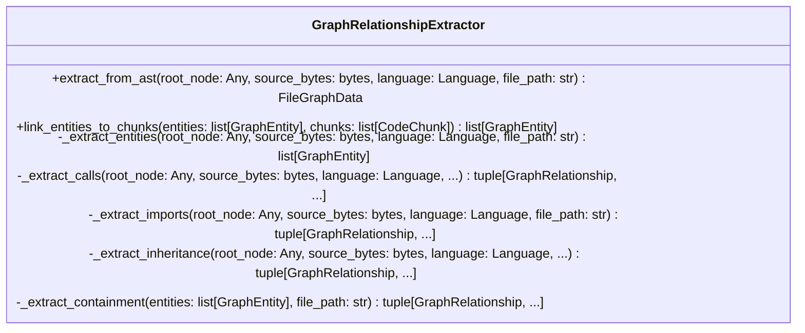

# File: `src/local_deepwiki/core/graph_rag/extractor.py`

## File Overview

This file is responsible for extracting semantic entities and relationships from source code represented as tree-sitter abstract syntax trees (ASTs). It serves as a core component in the graph-based RAG (Retrieval-Augmented Generation) pipeline, enabling the construction of code knowledge graphs.

The main entry point is the `GraphRelationshipExtractor` class, which processes ASTs to identify functions, classes, methods, and their relationships such as calls, imports, inheritance, and containment. The extracted data is structured into immutable [`FileGraphData`](models.md) objects, which are used downstream by indexing and analysis systems.

## Key Concepts

### Entity and Relationship Extraction

The file implements a multi-pass AST traversal to extract entities and relationships:

1. **Entities** are identified from function, class, and method definitions.
2. **Relationships** are extracted for:
   - Calls between functions/methods (`CALLS`)
   - Import statements (`IMPORTS`)
   - Inheritance between classes (`INHERITS_FROM`)
   - Containment of methods within classes (`CONTAINS`)

This approach allows for rich semantic understanding of code structure and interdependencies.

### Language-Aware Parsing

The extractor supports multiple programming languages (Python, JavaScript, TypeScript, Go, Rust, Java) by delegating import parsing to language-specific handlers. This modular design allows for accurate extraction tailored to each language's syntax.

### Deterministic ID Generation

Entity and relationship IDs are generated deterministically using `entity_id()` and `relationship_id()` functions. This ensures consistency across runs and enables reliable graph linking.

### Chunk Linking

The `link_entities_to_chunks` method connects extracted entities to their corresponding [`CodeChunk`](../../models/chunks.md) objects based on file path, name, and line number. This facilitates mapping graph entities back to source code segments.

## Integration

### External Usage

The `GraphRelationshipExtractor` class is used by:
- `indexer_graph`: For building the code graph during indexing
- `test_graph_rag_extractor`: For testing graph extraction logic

### Dependencies

This file integrates with:
- `local_deepwiki.core.chunk_extractors`: Provides language-specific node types for class, function, and import detection.
- `local_deepwiki.core.parser`: Offers utilities for traversing and extracting text from AST nodes.
- `local_deepwiki.core.graph_rag.models`: Defines the data models ([`FileGraphData`](models.md), [`GraphEntity`](models.md), [`GraphRelationship`](models.md)) used throughout the graph RAG system.
- `local_deepwiki.generators.analysis.callgraph`: Supplies call node types and name extraction logic for function calls.
- `local_deepwiki.models`: Includes [`CodeChunk`](../../models/chunks.md) and [`Language`](../../models/foundation.md) types for type safety and chunk linking.

The integration enables a cohesive workflow from raw source code to structured knowledge graphs, supporting downstream tasks like documentation generation and code analysis.

## Design Notes

### Modular Import Extraction

The `_extract_import_module` function delegates to language-specific parsers (`_extract_python_import`, etc.) to handle syntax variations. This design choice ensures correctness for each language's import semantics while maintaining a clean interface.

### Call Resolution Strategy

When resolving call targets (`_resolve_callee`), the extractor follows a prioritized lookup order:
1. Qualified name within the same class
2. Qualified name globally
3. Simple name

This prioritization aligns with Python's scoping rules and provides a realistic resolution mechanism.

### Fallback Handling

For cases where exact matches are not found (e.g., during chunk linking or import parsing), the system falls back gracefully:
- For chunk matching, it uses the first candidate if no exact line match exists.
- For import module extraction, it falls back to raw text extraction.

These fallbacks ensure robustness against edge cases in the AST or source code.

### Exception Safety

All major extraction methods (`_extract_entities`, `_extract_calls`, etc.) wrap their logic in try-except blocks to prevent a single failure from halting the entire extraction process. Exceptions are logged but not re-raised, ensuring partial results can still be returned.

### Deterministic Graph IDs

The use of deterministic ID generation ([`entity_id`](models.md), [`relationship_id`](models.md)) is crucial for maintaining graph consistency across multiple runs or environments. This is especially important in a RAG context where reproducible entity references are necessary for accurate retrieval and linking.

## API Reference

### class `GraphRelationshipExtractor`

Extract entities and relationships from a tree-sitter AST.  Walks the AST once for each extraction phase (entities, calls, imports, inheritance, containment) and aggregates the results into a single `[`FileGraphData`](models.md)`.

**Methods:**


<details>
<summary>View Source (lines 39-431) | <a href="https://github.com/UrbanDiver/local-deepwiki-mcp/blob/main/src/local_deepwiki/core/graph_rag/extractor.py#L39-L431">GitHub</a></summary>

```python
class GraphRelationshipExtractor:
    # Methods: extract_from_ast, link_entities_to_chunks, _extract_entities, _extract_calls, _extract_imports, _extract_inheritance, _extract_containment
```

</details>

#### `extract_from_ast`

```python
def extract_from_ast(root_node: Any, source_bytes: bytes, language: Language, file_path: str) -> FileGraphData
```

Extract entities and relationships from a parsed AST.


| Parameter | Type | Default | Description |
|-----------|------|---------|-------------|
| `root_node` | `Any` | - | tree-sitter root ``Node``. |
| `source_bytes` | `bytes` | - | Original source bytes used for text extraction. |
| `language` | `Language` | - | The ``Language`` enum value for this file. |
| `file_path` | `str` | - | Repository-relative path for deterministic IDs. |


<details>
<summary>View Source (lines 51-104) | <a href="https://github.com/UrbanDiver/local-deepwiki-mcp/blob/main/src/local_deepwiki/core/graph_rag/extractor.py#L51-L104">GitHub</a></summary>

```python
def extract_from_ast(
        self,
        root_node: Any,
        source_bytes: bytes,
        language: Language,
        file_path: str,
    ) -> FileGraphData:
        """Extract entities and relationships from a parsed AST.

        Args:
            root_node: tree-sitter root ``Node``.
            source_bytes: Original source bytes used for text extraction.
            language: The ``Language`` enum value for this file.
            file_path: Repository-relative path for deterministic IDs.

        Returns:
            ``FileGraphData`` with extracted entities and relationships.
        """
        entities = self._extract_entities(root_node, source_bytes, language, file_path)

        # Build a lookup for quick entity resolution by name
        entity_map: dict[str, GraphEntity] = {e.name: e for e in entities}
        qualified_map: dict[str, GraphEntity] = {e.qualified_name: e for e in entities}

        calls = self._extract_calls(
            root_node,
            source_bytes,
            language,
            file_path,
            entity_map,
            qualified_map,
        )
        imports = self._extract_imports(
            root_node,
            source_bytes,
            language,
            file_path,
        )
        inheritance = self._extract_inheritance(
            root_node,
            source_bytes,
            language,
            file_path,
            entity_map,
        )
        containment = self._extract_containment(entities, file_path)

        all_relationships = (*calls, *imports, *inheritance, *containment)

        return FileGraphData(
            file_path=file_path,
            entities=tuple(entities),
            relationships=all_relationships,
        )
```

</details>

#### `link_entities_to_chunks`

```python
def link_entities_to_chunks(entities: list[GraphEntity], chunks: list[CodeChunk]) -> list[GraphEntity]
```

Match entities to `[`CodeChunk`](../../models/chunks.md)` objects by file path, name, and start line.  Returns new `[`GraphEntity`](models.md)` instances with ``chunk_id`` set for every entity that could be matched.  Entities without a matching chunk are returned unchanged.


| Parameter | Type | Default | Description |
|-----------|------|---------|-------------|
| `entities` | `list[GraphEntity]` | - | Entities to link. |
| `chunks` | `list[CodeChunk]` | - | Available code chunks. |


<details>
<summary>View Source (lines 107-137) | <a href="https://github.com/UrbanDiver/local-deepwiki-mcp/blob/main/src/local_deepwiki/core/graph_rag/extractor.py#L107-L137">GitHub</a></summary>

```python
def link_entities_to_chunks(
        entities: list[GraphEntity],
        chunks: list[CodeChunk],
    ) -> list[GraphEntity]:
        """Match entities to ``CodeChunk`` objects by file path, name, and start line.

        Returns new ``GraphEntity`` instances with ``chunk_id`` set for every
        entity that could be matched.  Entities without a matching chunk are
        returned unchanged.

        Args:
            entities: Entities to link.
            chunks: Available code chunks.

        Returns:
            New list of entities with ``chunk_id`` populated where possible.
        """
        # Index chunks by (file_path, name) for O(1) lookups
        chunk_index: dict[tuple[str, str | None], list[CodeChunk]] = {}
        for chunk in chunks:
            key = (chunk.file_path, chunk.name)
            chunk_index.setdefault(key, []).append(chunk)

        result: list[GraphEntity] = []
        for ent in entities:
            matched_chunk_id = _find_matching_chunk_id(ent, chunk_index)
            if matched_chunk_id:
                result.append(replace(ent, chunk_id=matched_chunk_id))
            else:
                result.append(ent)
        return result
```

</details>

## Class Diagram



## Call Graph

```mermaid
flowchart TD
    N0[FileGraphData]
    N1[GraphRelationship]
    N2[GraphRelationshipExtractor....]
    N3[GraphRelationshipExtractor....]
    N4[GraphRelationshipExtractor....]
    N5[GraphRelationshipExtractor....]
    N6[GraphRelationshipExtractor....]
    N7[GraphRelationshipExtractor....]
    N8[GraphRelationshipExtractor....]
    N9[_extract_calls]
    N10[_extract_containment]
    N11[_extract_entities]
    N12[_extract_go_import]
    N13[_extract_import_module]
    N14[_extract_imports]
    N15[_extract_inheritance]
    N16[_extract_java_import]
    N17[_extract_js_import]
    N18[_extract_python_import]
    N19[_extract_rust_import]
    N20[_find_matching_chunk_id]
    N21[_get_enclosing_class_name]
    N22[child_by_field_name]
    N23[entity_id]
    N24[exception]
    N25[find_nodes_by_type]
    N26[get_node_name]
    N27[get_node_text]
    N28[relationship_id]
    N29[setdefault]
    N21 --> N26
    N13 --> N18
    N13 --> N17
    N13 --> N12
    N13 --> N19
    N13 --> N16
    N13 --> N27
    N18 --> N22
    N18 --> N27
    N17 --> N22
    N17 --> N27
    N12 --> N22
    N12 --> N27
    N19 --> N27
    N16 --> N27
    N7 --> N11
    N7 --> N9
    N7 --> N14
    N7 --> N15
    N7 --> N10
    N7 --> N0
    N8 --> N29
    N8 --> N20
    N4 --> N25
    N4 --> N26
    N4 --> N23
    N4 --> N24
    N2 --> N25
    N2 --> N26
    N2 --> N21
    N2 --> N23
    N2 --> N28
    N2 --> N1
    N2 --> N24
    N5 --> N23
    N5 --> N25
    N5 --> N13
    N5 --> N28
    N5 --> N1
    N5 --> N24
    N6 --> N25
    N6 --> N26
    N6 --> N23
    N6 --> N28
    N6 --> N1
    N6 --> N24
    N3 --> N28
    N3 --> N1
    N3 --> N24
    classDef func fill:#e1f5fe
    class N0,N1,N9,N10,N11,N12,N13,N14,N15,N16,N17,N18,N19,N20,N21,N22,N23,N24,N25,N26,N27,N28,N29 func
    classDef method fill:#fff3e0
    class N2,N3,N4,N5,N6,N7,N8 method
```



## Used By

Functions and methods in this file and their callers:

- **[`FileGraphData`](models.md)**: called by `GraphRelationshipExtractor.extract_from_ast`
- **[`GraphEntity`](models.md)**: called by `GraphRelationshipExtractor._extract_entities`
- **[`GraphRelationship`](models.md)**: called by `GraphRelationshipExtractor._extract_calls`, `GraphRelationshipExtractor._extract_containment`, `GraphRelationshipExtractor._extract_imports`, `GraphRelationshipExtractor._extract_inheritance`
- **`_extract_calls`**: called by `GraphRelationshipExtractor.extract_from_ast`
- **`_extract_containment`**: called by `GraphRelationshipExtractor.extract_from_ast`
- **`_extract_entities`**: called by `GraphRelationshipExtractor.extract_from_ast`
- **`_extract_go_import`**: called by `_extract_import_module`
- **`_extract_import_module`**: called by `GraphRelationshipExtractor._extract_imports`
- **`_extract_imports`**: called by `GraphRelationshipExtractor.extract_from_ast`
- **`_extract_inheritance`**: called by `GraphRelationshipExtractor.extract_from_ast`
- **`_extract_java_import`**: called by `_extract_import_module`
- **`_extract_js_import`**: called by `_extract_import_module`
- **`_extract_python_import`**: called by `_extract_import_module`
- **`_extract_rust_import`**: called by `_extract_import_module`
- **`_find_matching_chunk_id`**: called by `GraphRelationshipExtractor.link_entities_to_chunks`
- **`_get_enclosing_class_name`**: called by `GraphRelationshipExtractor._extract_calls`
- **`_is_inside_class`**: called by `GraphRelationshipExtractor._extract_entities`
- **`_resolve_callee`**: called by `GraphRelationshipExtractor._extract_calls`
- **`add`**: called by `GraphRelationshipExtractor._extract_calls`
- **`child_by_field_name`**: called by `_extract_go_import`, `_extract_js_import`, `_extract_python_import`
- **[`entity_id`](models.md)**: called by `GraphRelationshipExtractor._extract_calls`, `GraphRelationshipExtractor._extract_entities`, `GraphRelationshipExtractor._extract_imports`, `GraphRelationshipExtractor._extract_inheritance`
- **`exception`**: called by `GraphRelationshipExtractor._extract_calls`, `GraphRelationshipExtractor._extract_containment`, `GraphRelationshipExtractor._extract_entities`, `GraphRelationshipExtractor._extract_imports`, `GraphRelationshipExtractor._extract_inheritance`
- **[`extract_call_name`](../../generators/analysis/callgraph.md)**: called by `GraphRelationshipExtractor._extract_calls`
- **[`find_nodes_by_type`](../parser/ast_utils.md)**: called by `GraphRelationshipExtractor._extract_calls`, `GraphRelationshipExtractor._extract_entities`, `GraphRelationshipExtractor._extract_imports`, `GraphRelationshipExtractor._extract_inheritance`
- **[`get_node_name`](../parser/ast_utils.md)**: called by `GraphRelationshipExtractor._extract_calls`, `GraphRelationshipExtractor._extract_entities`, `GraphRelationshipExtractor._extract_inheritance`, `_get_enclosing_class_name`
- **[`get_node_text`](../parser/ast_utils.md)**: called by `_extract_go_import`, `_extract_import_module`, `_extract_java_import`, `_extract_js_import`, `_extract_python_import`, `_extract_rust_import`
- **[`get_parent_classes`](../chunk_extractors.md)**: called by `GraphRelationshipExtractor._extract_inheritance`
- **[`relationship_id`](models.md)**: called by `GraphRelationshipExtractor._extract_calls`, `GraphRelationshipExtractor._extract_containment`, `GraphRelationshipExtractor._extract_imports`, `GraphRelationshipExtractor._extract_inheritance`
- **`setdefault`**: called by `GraphRelationshipExtractor.link_entities_to_chunks`

## Last Modified

| Entity | Type | Author | Date | Commit |
|--------|------|--------|------|--------|
| `GraphRelationshipExtractor` | class | Brian Breidenbach | 2 weeks ago | `ee9eebf` feat: add GraphRAG knowledg... |
| `extract_from_ast` | method | Brian Breidenbach | 2 weeks ago | `ee9eebf` feat: add GraphRAG knowledg... |
| `link_entities_to_chunks` | method | Brian Breidenbach | 2 weeks ago | `ee9eebf` feat: add GraphRAG knowledg... |
| `_extract_entities` | method | Brian Breidenbach | 2 weeks ago | `ee9eebf` feat: add GraphRAG knowledg... |
| `_extract_calls` | method | Brian Breidenbach | 2 weeks ago | `ee9eebf` feat: add GraphRAG knowledg... |
| `_extract_imports` | method | Brian Breidenbach | 2 weeks ago | `ee9eebf` feat: add GraphRAG knowledg... |
| `_extract_inheritance` | method | Brian Breidenbach | 2 weeks ago | `ee9eebf` feat: add GraphRAG knowledg... |
| `_extract_containment` | method | Brian Breidenbach | 2 weeks ago | `ee9eebf` feat: add GraphRAG knowledg... |
| `_is_inside_class` | function | Brian Breidenbach | 2 weeks ago | `ee9eebf` feat: add GraphRAG knowledg... |
| `_get_enclosing_class_name` | function | Brian Breidenbach | 2 weeks ago | `ee9eebf` feat: add GraphRAG knowledg... |
| `_resolve_callee` | function | Brian Breidenbach | 2 weeks ago | `ee9eebf` feat: add GraphRAG knowledg... |
| `_extract_import_module` | function | Brian Breidenbach | 2 weeks ago | `ee9eebf` feat: add GraphRAG knowledg... |
| `_extract_python_import` | function | Brian Breidenbach | 2 weeks ago | `ee9eebf` feat: add GraphRAG knowledg... |
| `_extract_js_import` | function | Brian Breidenbach | 2 weeks ago | `ee9eebf` feat: add GraphRAG knowledg... |
| `_extract_go_import` | function | Brian Breidenbach | 2 weeks ago | `ee9eebf` feat: add GraphRAG knowledg... |
| `_extract_rust_import` | function | Brian Breidenbach | 2 weeks ago | `ee9eebf` feat: add GraphRAG knowledg... |
| `_extract_java_import` | function | Brian Breidenbach | 2 weeks ago | `ee9eebf` feat: add GraphRAG knowledg... |
| `_find_matching_chunk_id` | function | Brian Breidenbach | 2 weeks ago | `ee9eebf` feat: add GraphRAG knowledg... |

## Additional Source Code

Source code for functions and methods not listed in the API Reference above.

#### `_extract_entities`

<details>
<summary>View Source (lines 143-214) | <a href="https://github.com/UrbanDiver/local-deepwiki-mcp/blob/main/src/local_deepwiki/core/graph_rag/extractor.py#L143-L214">GitHub</a></summary>

```python
def _extract_entities(
        self,
        root_node: Any,
        source_bytes: bytes,
        language: Language,
        file_path: str,
    ) -> list[GraphEntity]:
        """Extract function, class, and method entities from the AST."""
        entities: list[GraphEntity] = []

        func_types = FUNCTION_NODE_TYPES.get(language, set())
        class_types = CLASS_NODE_TYPES.get(language, set())

        try:
            # --- Classes ---
            for class_node in find_nodes_by_type(root_node, class_types):
                class_name = get_node_name(class_node, source_bytes, language)
                if not class_name:
                    continue
                entities.append(
                    GraphEntity(
                        id=entity_id(file_path, class_name),
                        name=class_name,
                        qualified_name=class_name,
                        entity_type=EntityType.CLASS,
                        file_path=file_path,
                        start_line=class_node.start_point[0] + 1,
                        end_line=class_node.end_point[0] + 1,
                    )
                )

                # --- Methods (functions nested inside this class) ---
                for method_node in find_nodes_by_type(class_node, func_types):
                    method_name = get_node_name(method_node, source_bytes, language)
                    if not method_name:
                        continue
                    qualified = f"{class_name}.{method_name}"
                    entities.append(
                        GraphEntity(
                            id=entity_id(file_path, qualified),
                            name=method_name,
                            qualified_name=qualified,
                            entity_type=EntityType.METHOD,
                            file_path=file_path,
                            start_line=method_node.start_point[0] + 1,
                            end_line=method_node.end_point[0] + 1,
                            metadata={"parent_name": class_name},
                        )
                    )

            # --- Top-level functions (not inside a class) ---
            for func_node in find_nodes_by_type(root_node, func_types):
                if _is_inside_class(func_node, class_types):
                    continue
                func_name = get_node_name(func_node, source_bytes, language)
                if not func_name:
                    continue
                entities.append(
                    GraphEntity(
                        id=entity_id(file_path, func_name),
                        name=func_name,
                        qualified_name=func_name,
                        entity_type=EntityType.FUNCTION,
                        file_path=file_path,
                        start_line=func_node.start_point[0] + 1,
                        end_line=func_node.end_point[0] + 1,
                    )
                )
        except Exception:
            logger.exception("Failed to extract entities from %s", file_path)

        return entities
```

</details>


#### `_extract_calls`

<details>
<summary>View Source (lines 216-295) | <a href="https://github.com/UrbanDiver/local-deepwiki-mcp/blob/main/src/local_deepwiki/core/graph_rag/extractor.py#L216-L295">GitHub</a></summary>

```python
def _extract_calls(
        self,
        root_node: Any,
        source_bytes: bytes,
        language: Language,
        file_path: str,
        entity_map: dict[str, GraphEntity],
        qualified_map: dict[str, GraphEntity],
    ) -> tuple[GraphRelationship, ...]:
        """Extract *calls* relationships from function/method bodies."""
        relationships: list[GraphRelationship] = []

        func_types = FUNCTION_NODE_TYPES.get(language, set())
        class_types = CLASS_NODE_TYPES.get(language, set())
        call_types = CALL_NODE_TYPES.get(language, set())
        if not call_types:
            return ()

        try:
            all_func_nodes = find_nodes_by_type(root_node, func_types)
            for func_node in all_func_nodes:
                caller_name = get_node_name(func_node, source_bytes, language)
                if not caller_name:
                    continue

                # Determine qualified name
                parent_class = _get_enclosing_class_name(
                    func_node,
                    class_types,
                    source_bytes,
                    language,
                )
                qualified_caller = (
                    f"{parent_class}.{caller_name}" if parent_class else caller_name
                )

                source_entity = qualified_map.get(qualified_caller)
                if source_entity is None:
                    continue

                # Find calls within this function
                call_nodes = find_nodes_by_type(func_node, call_types)
                seen: set[str] = set()
                for call_node in call_nodes:
                    callee_name = extract_call_name(call_node, source_bytes, language)
                    if not callee_name or callee_name in seen:
                        continue
                    seen.add(callee_name)

                    # Resolve the target entity (try qualified first, then simple)
                    target_entity = _resolve_callee(
                        callee_name,
                        parent_class,
                        entity_map,
                        qualified_map,
                    )
                    target_id_str = (
                        target_entity.id
                        if target_entity
                        else entity_id(file_path, callee_name)
                    )

                    rel_id = relationship_id(
                        source_entity.id,
                        RelationshipType.CALLS,
                        target_id_str,
                    )
                    relationships.append(
                        GraphRelationship(
                            id=rel_id,
                            source_id=source_entity.id,
                            target_id=target_id_str,
                            relationship=RelationshipType.CALLS,
                            file_path=file_path,
                        )
                    )
        except Exception:
            logger.exception("Failed to extract calls from %s", file_path)

        return tuple(relationships)
```

</details>


#### `_extract_imports`

<details>
<summary>View Source (lines 297-341) | <a href="https://github.com/UrbanDiver/local-deepwiki-mcp/blob/main/src/local_deepwiki/core/graph_rag/extractor.py#L297-L341">GitHub</a></summary>

```python
def _extract_imports(
        self,
        root_node: Any,
        source_bytes: bytes,
        language: Language,
        file_path: str,
    ) -> tuple[GraphRelationship, ...]:
        """Extract *imports* relationships from import statements."""
        relationships: list[GraphRelationship] = []

        import_types = IMPORT_NODE_TYPES.get(language, set())
        if not import_types:
            return ()

        try:
            file_entity_id = entity_id(file_path, file_path)

            for import_node in find_nodes_by_type(root_node, import_types):
                module_name = _extract_import_module(
                    import_node,
                    source_bytes,
                    language,
                )
                if not module_name:
                    continue

                target_id_str = entity_id(module_name, module_name)
                rel_id = relationship_id(
                    file_entity_id,
                    RelationshipType.IMPORTS,
                    target_id_str,
                )
                relationships.append(
                    GraphRelationship(
                        id=rel_id,
                        source_id=file_entity_id,
                        target_id=target_id_str,
                        relationship=RelationshipType.IMPORTS,
                        file_path=file_path,
                    )
                )
        except Exception:
            logger.exception("Failed to extract imports from %s", file_path)

        return tuple(relationships)
```

</details>


#### `_extract_inheritance`

<details>
<summary>View Source (lines 343-390) | <a href="https://github.com/UrbanDiver/local-deepwiki-mcp/blob/main/src/local_deepwiki/core/graph_rag/extractor.py#L343-L390">GitHub</a></summary>

```python
def _extract_inheritance(
        self,
        root_node: Any,
        source_bytes: bytes,
        language: Language,
        file_path: str,
        entity_map: dict[str, GraphEntity],
    ) -> tuple[GraphRelationship, ...]:
        """Extract *inherits_from* relationships from class definitions."""
        relationships: list[GraphRelationship] = []
        class_types = CLASS_NODE_TYPES.get(language, set())

        try:
            for class_node in find_nodes_by_type(root_node, class_types):
                class_name = get_node_name(class_node, source_bytes, language)
                if not class_name:
                    continue

                parents = get_parent_classes(class_node, source_bytes, language)
                child_entity = entity_map.get(class_name)
                if child_entity is None:
                    continue

                for parent_name in parents:
                    parent_entity = entity_map.get(parent_name)
                    target_id_str = (
                        parent_entity.id
                        if parent_entity
                        else entity_id(file_path, parent_name)
                    )
                    rel_id = relationship_id(
                        child_entity.id,
                        RelationshipType.INHERITS_FROM,
                        target_id_str,
                    )
                    relationships.append(
                        GraphRelationship(
                            id=rel_id,
                            source_id=child_entity.id,
                            target_id=target_id_str,
                            relationship=RelationshipType.INHERITS_FROM,
                            file_path=file_path,
                        )
                    )
        except Exception:
            logger.exception("Failed to extract inheritance from %s", file_path)

        return tuple(relationships)
```

</details>


#### `_extract_containment`

<details>
<summary>View Source (lines 392-431) | <a href="https://github.com/UrbanDiver/local-deepwiki-mcp/blob/main/src/local_deepwiki/core/graph_rag/extractor.py#L392-L431">GitHub</a></summary>

```python
def _extract_containment(
        self,
        entities: list[GraphEntity],
        file_path: str,
    ) -> tuple[GraphRelationship, ...]:
        """Extract *contains* relationships for methods inside classes."""
        relationships: list[GraphRelationship] = []

        # Build a set of class entity ids for quick lookup
        class_entities: dict[str, GraphEntity] = {
            e.name: e for e in entities if e.entity_type == EntityType.CLASS
        }

        try:
            for ent in entities:
                if ent.entity_type != EntityType.METHOD:
                    continue
                parent_name = ent.metadata.get("parent_name", "")
                parent_entity = class_entities.get(parent_name)
                if parent_entity is None:
                    continue

                rel_id = relationship_id(
                    parent_entity.id,
                    RelationshipType.CONTAINS,
                    ent.id,
                )
                relationships.append(
                    GraphRelationship(
                        id=rel_id,
                        source_id=parent_entity.id,
                        target_id=ent.id,
                        relationship=RelationshipType.CONTAINS,
                        file_path=file_path,
                    )
                )
        except Exception:
            logger.exception("Failed to extract containment from %s", file_path)

        return tuple(relationships)
```

</details>


#### `_is_inside_class`

<details>
<summary>View Source (lines 439-446) | <a href="https://github.com/UrbanDiver/local-deepwiki-mcp/blob/main/src/local_deepwiki/core/graph_rag/extractor.py#L439-L446">GitHub</a></summary>

```python
def _is_inside_class(node: Any, class_types: set[str]) -> bool:
    """Return ``True`` if *node* is nested inside a class node."""
    parent = node.parent
    while parent:
        if parent.type in class_types:
            return True
        parent = parent.parent
    return False
```

</details>


#### `_get_enclosing_class_name`

<details>
<summary>View Source (lines 449-461) | <a href="https://github.com/UrbanDiver/local-deepwiki-mcp/blob/main/src/local_deepwiki/core/graph_rag/extractor.py#L449-L461">GitHub</a></summary>

```python
def _get_enclosing_class_name(
    node: Any,
    class_types: set[str],
    source_bytes: bytes,
    language: Language,
) -> str | None:
    """Return the name of the class enclosing *node*, or ``None``."""
    parent = node.parent
    while parent:
        if parent.type in class_types:
            return get_node_name(parent, source_bytes, language)
        parent = parent.parent
    return None
```

</details>


#### `_resolve_callee`

<details>
<summary>View Source (lines 464-485) | <a href="https://github.com/UrbanDiver/local-deepwiki-mcp/blob/main/src/local_deepwiki/core/graph_rag/extractor.py#L464-L485">GitHub</a></summary>

```python
def _resolve_callee(
    callee_name: str,
    parent_class: str | None,
    entity_map: dict[str, GraphEntity],
    qualified_map: dict[str, GraphEntity],
) -> GraphEntity | None:
    """Try to resolve a callee name to a known entity."""
    # Try qualified name within same class first
    if parent_class:
        qualified = f"{parent_class}.{callee_name}"
        if qualified in qualified_map:
            return qualified_map[qualified]

    # Try as a qualified name directly
    if callee_name in qualified_map:
        return qualified_map[callee_name]

    # Try simple name
    if callee_name in entity_map:
        return entity_map[callee_name]

    return None
```

</details>


#### `_extract_import_module`

<details>
<summary>View Source (lines 488-514) | <a href="https://github.com/UrbanDiver/local-deepwiki-mcp/blob/main/src/local_deepwiki/core/graph_rag/extractor.py#L488-L514">GitHub</a></summary>

```python
def _extract_import_module(
    import_node: Any,
    source_bytes: bytes,
    language: Language,
) -> str | None:
    """Extract the module/package name from an import AST node.

    Returns the top-level module name (e.g. ``os`` from ``import os.path``
    or ``flask`` from ``from flask import Flask``).
    """
    try:
        if language == Language.PYTHON:
            return _extract_python_import(import_node, source_bytes)
        if language in (Language.JAVASCRIPT, Language.TYPESCRIPT):
            return _extract_js_import(import_node, source_bytes)
        if language == Language.GO:
            return _extract_go_import(import_node, source_bytes)
        if language == Language.RUST:
            return _extract_rust_import(import_node, source_bytes)
        if language == Language.JAVA:
            return _extract_java_import(import_node, source_bytes)
        # Fallback: extract raw text from the node
        text = get_node_text(import_node, source_bytes).strip()
        return text if text else None
    except Exception:
        logger.debug("Failed to extract import module from node", exc_info=True)
        return None
```

</details>


#### `_extract_python_import`

<details>
<summary>View Source (lines 517-537) | <a href="https://github.com/UrbanDiver/local-deepwiki-mcp/blob/main/src/local_deepwiki/core/graph_rag/extractor.py#L517-L537">GitHub</a></summary>

```python
def _extract_python_import(node: Any, source_bytes: bytes) -> str | None:
    """Handle ``import X`` and ``from X import Y``."""
    if node.type == "import_from_statement":
        # from X import Y  -> module_name child is typically "dotted_name"
        module_node = node.child_by_field_name("module_name")
        if module_node:
            return get_node_text(module_node, source_bytes)
        # Fallback: look for dotted_name child
        for child in node.children:
            if child.type == "dotted_name":
                return get_node_text(child, source_bytes)
    elif node.type == "import_statement":
        # import X  or  import X.Y
        for child in node.children:
            if child.type == "dotted_name":
                return get_node_text(child, source_bytes)
            if child.type == "aliased_import":
                name_node = child.child_by_field_name("name")
                if name_node:
                    return get_node_text(name_node, source_bytes)
    return None
```

</details>


#### `_extract_js_import`

<details>
<summary>View Source (lines 540-552) | <a href="https://github.com/UrbanDiver/local-deepwiki-mcp/blob/main/src/local_deepwiki/core/graph_rag/extractor.py#L540-L552">GitHub</a></summary>

```python
def _extract_js_import(node: Any, source_bytes: bytes) -> str | None:
    """Handle JS/TS import statements."""
    # import ... from "module"
    source_node = node.child_by_field_name("source")
    if source_node:
        raw = get_node_text(source_node, source_bytes)
        return raw.strip("\"'")
    # Fallback: look for string children
    for child in node.children:
        if child.type == "string":
            raw = get_node_text(child, source_bytes)
            return raw.strip("\"'")
    return None
```

</details>


#### `_extract_go_import`

<details>
<summary>View Source (lines 555-571) | <a href="https://github.com/UrbanDiver/local-deepwiki-mcp/blob/main/src/local_deepwiki/core/graph_rag/extractor.py#L555-L571">GitHub</a></summary>

```python
def _extract_go_import(node: Any, source_bytes: bytes) -> str | None:
    """Handle Go import declarations."""
    for child in node.children:
        if child.type == "import_spec":
            path_node = child.child_by_field_name("path")
            if path_node:
                raw = get_node_text(path_node, source_bytes)
                return raw.strip('"')
        if child.type == "import_spec_list":
            # First spec in a grouped import
            for spec in child.children:
                if spec.type == "import_spec":
                    path_node = spec.child_by_field_name("path")
                    if path_node:
                        raw = get_node_text(path_node, source_bytes)
                        return raw.strip('"')
    return None
```

</details>


#### `_extract_rust_import`

<details>
<summary>View Source (lines 574-585) | <a href="https://github.com/UrbanDiver/local-deepwiki-mcp/blob/main/src/local_deepwiki/core/graph_rag/extractor.py#L574-L585">GitHub</a></summary>

```python
def _extract_rust_import(node: Any, source_bytes: bytes) -> str | None:
    """Handle Rust ``use`` declarations."""
    # use crate_name::module::item;
    for child in node.children:
        if child.type in ("scoped_identifier", "identifier", "use_wildcard"):
            text = get_node_text(child, source_bytes)
            # Return the top-level crate/module
            return text.split("::")[0] if "::" in text else text
        if child.type == "scoped_use_list":
            text = get_node_text(child, source_bytes)
            return text.split("::")[0] if "::" in text else text
    return None
```

</details>


#### `_extract_java_import`

<details>
<summary>View Source (lines 588-595) | <a href="https://github.com/UrbanDiver/local-deepwiki-mcp/blob/main/src/local_deepwiki/core/graph_rag/extractor.py#L588-L595">GitHub</a></summary>

```python
def _extract_java_import(node: Any, source_bytes: bytes) -> str | None:
    """Handle Java ``import`` declarations."""
    for child in node.children:
        if child.type == "scoped_identifier":
            text = get_node_text(child, source_bytes)
            # Return the full dotted path
            return text
    return None
```

</details>


#### `_find_matching_chunk_id`

<details>
<summary>View Source (lines 598-613) | <a href="https://github.com/UrbanDiver/local-deepwiki-mcp/blob/main/src/local_deepwiki/core/graph_rag/extractor.py#L598-L613">GitHub</a></summary>

```python
def _find_matching_chunk_id(
    entity: GraphEntity,
    chunk_index: dict[tuple[str, str | None], list[CodeChunk]],
) -> str | None:
    """Find a matching chunk ID for an entity, preferring exact line match."""
    candidates = chunk_index.get((entity.file_path, entity.name), [])
    if not candidates:
        return None

    # Prefer a chunk whose start_line matches exactly
    for chunk in candidates:
        if chunk.start_line == entity.start_line:
            return chunk.id

    # Fall back to the first candidate
    return candidates[0].id
```

</details>

## Relevant Source Files

- `src/local_deepwiki/core/graph_rag/extractor.py:39-431`
