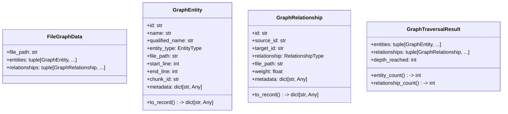
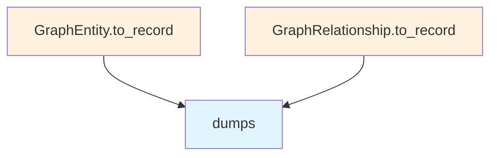

# File: `src/local_deepwiki/core/graph_rag/models.py`

## File Overview

This file defines the core data models used in the GraphRAG knowledge graph system. It provides structured representations of code entities, their relationships, and traversal results, enabling the graph-based retrieval and analysis of code knowledge.

The models are designed to support storage in LanceDB, with serialization methods that convert objects into dictionaries suitable for database insertion. These models are central to the graph-based reasoning and retrieval workflows in the `graph_rag` package.

## Key Concepts

### Data Models for Code Knowledge Graph

The file defines several key abstractions:

- **`EntityType`** and **`RelationshipType`**: Enumerations that define the types of entities and relationships in the knowledge graph. These are chosen to be `StrEnum` to ensure type safety and to support string-based serialization.

- **`GraphEntity`**: Represents a node in the knowledge graph, such as a function, class, or module. It includes metadata and line number information to support code analysis and visualization.

- **`GraphRelationship`**: Represents a directed edge in the knowledge graph, such as a function calling another function or a class inheriting from another. Relationships are weighted and support metadata.

- **`GraphTraversalResult`**: Encapsulates the result of a graph traversal, such as a breadth-first search from seed entities. This is used to return the set of entities and relationships found during a retrieval operation.

- **`FileGraphData`**: A container for graph data extracted from a single source file, aggregating entities and relationships found within that file.

### Deterministic ID Generation

Two utility functions, `entity_id` and `relationship_id`, generate deterministic string IDs for entities and relationships. These IDs are crucial for ensuring consistent graph representation and avoiding duplicates during graph construction and retrieval.

## Integration

This file is a core dependency for several components in the `graph_rag` package:

- **`GraphEntity`**, **`GraphRelationship`**, and **`GraphTraversalResult`** are used by the `store` module and various test modules (`test_graph_rag_models`, `test_graph_rag_store`, `test_graph_rag_retriever`), indicating their role in graph storage and retrieval.

- **`RelationshipType`** is used by the `extractor` and test modules, suggesting it's central to how relationships are identified and extracted from source code.

- **`FileGraphData`** is used by the `extractor` and `indexer_graph`, showing its role in the data extraction and indexing pipeline.

The `entity_id` and `relationship_id` functions are used by the `store` module and the `extractor`, ensuring consistent identification of entities and relationships during graph construction.

## Design Notes

### Serialization for Storage

Both `GraphEntity` and `GraphRelationship` include a `to_record()` method that serializes the object into a dictionary. This design choice supports seamless integration with LanceDB, which expects structured data. The use of `json.dumps()` for metadata ensures that complex nested structures are preserved during storage.

### Immutable Data Models

While not explicitly enforced, the use of `dataclass` with `field(default_factory=dict)` and the general structure of the models suggest an intent toward immutability, which is critical for maintaining consistency in a knowledge graph system.

### Deterministic ID Generation

The `entity_id` and `relationship_id` functions use string concatenation with `::` as a separator. This approach ensures deterministic, human-readable IDs that are easy to debug and maintain. It also allows for straightforward parsing and reconstruction of identifiers.

### Enumerations for Type Safety

`EntityType` and `RelationshipType` are defined as `StrEnum` to provide both type safety and the ability to serialize enum values as strings, which is required for database storage and JSON interchange.

### Metadata Support

Both `GraphEntity` and `GraphRelationship` include a `metadata` field. This allows for extensibility, enabling additional information to be attached to graph elements without modifying the core schema. This is especially useful in a research or analysis context where extra context is often needed.

## API Reference

### class `EntityType`

**Inherits from:** `StrEnum`

Types of code entities in the knowledge graph.


<details>
<summary>View Source (lines 15-22) | <a href="https://github.com/UrbanDiver/local-deepwiki-mcp/blob/main/src/local_deepwiki/core/graph_rag/models.py#L15-L22">GitHub</a></summary>

```python
class EntityType(StrEnum):
    """Types of code entities in the knowledge graph."""

    FUNCTION = "function"
    CLASS = "class"
    METHOD = "method"
    MODULE = "module"
    VARIABLE = "variable"
```

</details>

### class `RelationshipType`

**Inherits from:** `StrEnum`

Types of relationships between code entities.


<details>
<summary>View Source (lines 25-32) | <a href="https://github.com/UrbanDiver/local-deepwiki-mcp/blob/main/src/local_deepwiki/core/graph_rag/models.py#L25-L32">GitHub</a></summary>

```python
class RelationshipType(StrEnum):
    """Types of relationships between code entities."""

    CALLS = "calls"
    IMPORTS = "imports"
    INHERITS_FROM = "inherits_from"
    CONTAINS = "contains"
    REFERENCES = "references"
```

</details>

### class `GraphEntity`

A code entity node in the knowledge graph.

**Methods:**


<details>
<summary>View Source (lines 65-92) | <a href="https://github.com/UrbanDiver/local-deepwiki-mcp/blob/main/src/local_deepwiki/core/graph_rag/models.py#L65-L92">GitHub</a></summary>

```python
class GraphEntity:
    """A code entity node in the knowledge graph."""

    id: str
    name: str
    qualified_name: str
    entity_type: EntityType
    file_path: str
    start_line: int
    end_line: int
    chunk_id: str = ""
    metadata: dict[str, Any] = field(default_factory=dict)

    def to_record(self) -> dict[str, Any]:
        """Serialize to a dict suitable for LanceDB storage."""
        import json

        return {
            "id": self.id,
            "name": self.name,
            "qualified_name": self.qualified_name,
            "entity_type": self.entity_type.value,
            "file_path": self.file_path,
            "start_line": self.start_line,
            "end_line": self.end_line,
            "chunk_id": self.chunk_id,
            "metadata": json.dumps(self.metadata),
        }
```

</details>

#### `to_record`

```python
def to_record() -> dict[str, Any]
```

Serialize to a dict suitable for LanceDB storage.


<details>
<summary>View Source (lines 65-92) | <a href="https://github.com/UrbanDiver/local-deepwiki-mcp/blob/main/src/local_deepwiki/core/graph_rag/models.py#L65-L92">GitHub</a></summary>

```python
class GraphEntity:
    """A code entity node in the knowledge graph."""

    id: str
    name: str
    qualified_name: str
    entity_type: EntityType
    file_path: str
    start_line: int
    end_line: int
    chunk_id: str = ""
    metadata: dict[str, Any] = field(default_factory=dict)

    def to_record(self) -> dict[str, Any]:
        """Serialize to a dict suitable for LanceDB storage."""
        import json

        return {
            "id": self.id,
            "name": self.name,
            "qualified_name": self.qualified_name,
            "entity_type": self.entity_type.value,
            "file_path": self.file_path,
            "start_line": self.start_line,
            "end_line": self.end_line,
            "chunk_id": self.chunk_id,
            "metadata": json.dumps(self.metadata),
        }
```

</details>

### class `GraphRelationship`

A directed relationship edge in the knowledge graph.

**Methods:**


<details>
<summary>View Source (lines 96-119) | <a href="https://github.com/UrbanDiver/local-deepwiki-mcp/blob/main/src/local_deepwiki/core/graph_rag/models.py#L96-L119">GitHub</a></summary>

```python
class GraphRelationship:
    """A directed relationship edge in the knowledge graph."""

    id: str
    source_id: str
    target_id: str
    relationship: RelationshipType
    file_path: str
    weight: float = 1.0
    metadata: dict[str, Any] = field(default_factory=dict)

    def to_record(self) -> dict[str, Any]:
        """Serialize to a dict suitable for LanceDB storage."""
        import json

        return {
            "id": self.id,
            "source_id": self.source_id,
            "target_id": self.target_id,
            "relationship": self.relationship.value,
            "file_path": self.file_path,
            "weight": self.weight,
            "metadata": json.dumps(self.metadata),
        }
```

</details>

#### `to_record`

```python
def to_record() -> dict[str, Any]
```

Serialize to a dict suitable for LanceDB storage.


<details>
<summary>View Source (lines 96-119) | <a href="https://github.com/UrbanDiver/local-deepwiki-mcp/blob/main/src/local_deepwiki/core/graph_rag/models.py#L96-L119">GitHub</a></summary>

```python
class GraphRelationship:
    """A directed relationship edge in the knowledge graph."""

    id: str
    source_id: str
    target_id: str
    relationship: RelationshipType
    file_path: str
    weight: float = 1.0
    metadata: dict[str, Any] = field(default_factory=dict)

    def to_record(self) -> dict[str, Any]:
        """Serialize to a dict suitable for LanceDB storage."""
        import json

        return {
            "id": self.id,
            "source_id": self.source_id,
            "target_id": self.target_id,
            "relationship": self.relationship.value,
            "file_path": self.file_path,
            "weight": self.weight,
            "metadata": json.dumps(self.metadata),
        }
```

</details>

### class `GraphTraversalResult`

Result of a graph traversal (BFS from seed entities).

**Methods:**


<details>
<summary>View Source (lines 123-136) | <a href="https://github.com/UrbanDiver/local-deepwiki-mcp/blob/main/src/local_deepwiki/core/graph_rag/models.py#L123-L136">GitHub</a></summary>

```python
class GraphTraversalResult:
    """Result of a graph traversal (BFS from seed entities)."""

    entities: tuple[GraphEntity, ...] = ()
    relationships: tuple[GraphRelationship, ...] = ()
    depth_reached: int = 0

    @property
    def entity_count(self) -> int:
        return len(self.entities)

    @property
    def relationship_count(self) -> int:
        return len(self.relationships)
```

</details>

#### `entity_count`

```python
def entity_count() -> int
```


<details>
<summary>View Source (lines 123-136) | <a href="https://github.com/UrbanDiver/local-deepwiki-mcp/blob/main/src/local_deepwiki/core/graph_rag/models.py#L123-L136">GitHub</a></summary>

```python
class GraphTraversalResult:
    """Result of a graph traversal (BFS from seed entities)."""

    entities: tuple[GraphEntity, ...] = ()
    relationships: tuple[GraphRelationship, ...] = ()
    depth_reached: int = 0

    @property
    def entity_count(self) -> int:
        return len(self.entities)

    @property
    def relationship_count(self) -> int:
        return len(self.relationships)
```

</details>

#### `relationship_count`

```python
def relationship_count() -> int
```


<details>
<summary>View Source (lines 123-136) | <a href="https://github.com/UrbanDiver/local-deepwiki-mcp/blob/main/src/local_deepwiki/core/graph_rag/models.py#L123-L136">GitHub</a></summary>

```python
class GraphTraversalResult:
    """Result of a graph traversal (BFS from seed entities)."""

    entities: tuple[GraphEntity, ...] = ()
    relationships: tuple[GraphRelationship, ...] = ()
    depth_reached: int = 0

    @property
    def entity_count(self) -> int:
        return len(self.entities)

    @property
    def relationship_count(self) -> int:
        return len(self.relationships)
```

</details>

### class `FileGraphData`

Extracted graph data from a single source file.

---


<details>
<summary>View Source (lines 140-145) | <a href="https://github.com/UrbanDiver/local-deepwiki-mcp/blob/main/src/local_deepwiki/core/graph_rag/models.py#L140-L145">GitHub</a></summary>

```python
class FileGraphData:
    """Extracted graph data from a single source file."""

    file_path: str
    entities: tuple[GraphEntity, ...] = ()
    relationships: tuple[GraphRelationship, ...] = ()
```

</details>

### Functions

#### `entity_id`

```python
def entity_id(file_path: str, qualified_name: str) -> str
```

Generate a deterministic entity ID.


| Parameter | Type | Default | Description |
|-----------|------|---------|-------------|
| `file_path` | `str` | - | Source file path. |
| `qualified_name` | `str` | - | Fully qualified entity name (e.g. "MyClass.my_method"). |

**Returns:** `str`


<details>
<summary>View Source (lines 35-45) | <a href="https://github.com/UrbanDiver/local-deepwiki-mcp/blob/main/src/local_deepwiki/core/graph_rag/models.py#L35-L45">GitHub</a></summary>

```python
def entity_id(file_path: str, qualified_name: str) -> str:
    """Generate a deterministic entity ID.

    Args:
        file_path: Source file path.
        qualified_name: Fully qualified entity name (e.g. "MyClass.my_method").

    Returns:
        Deterministic string ID in the form ``file_path::qualified_name``.
    """
    return f"{file_path}::{qualified_name}"
```

</details>

#### `relationship_id`

```python
def relationship_id(source_id: str, rel_type: str | RelationshipType, target_id: str) -> str
```

Generate a deterministic relationship ID.


| Parameter | Type | Default | Description |
|-----------|------|---------|-------------|
| `source_id` | `str` | - | Source entity ID. |
| `rel_type` | `str | RelationshipType` | - | Relationship type. |
| `target_id` | `str` | - | Target entity ID. |

**Returns:** `str`


<details>
<summary>View Source (lines 48-61) | <a href="https://github.com/UrbanDiver/local-deepwiki-mcp/blob/main/src/local_deepwiki/core/graph_rag/models.py#L48-L61">GitHub</a></summary>

```python
def relationship_id(
    source_id: str, rel_type: str | RelationshipType, target_id: str
) -> str:
    """Generate a deterministic relationship ID.

    Args:
        source_id: Source entity ID.
        rel_type: Relationship type.
        target_id: Target entity ID.

    Returns:
        Deterministic string ID in the form ``source_id::rel_type::target_id``.
    """
    return f"{source_id}::{rel_type}::{target_id}"
```

</details>

## Class Diagram



## Call Graph



## Used By

Functions and methods in this file and their callers:

- **`dumps`**: called by `GraphEntity.to_record`, `GraphRelationship.to_record`

## Last Modified

| Entity | Type | Author | Date | Commit |
|--------|------|--------|------|--------|
| `EntityType` | class | Brian Breidenbach | 2 weeks ago | `ee9eebf` feat: add GraphRAG knowledg... |
| `RelationshipType` | class | Brian Breidenbach | 2 weeks ago | `ee9eebf` feat: add GraphRAG knowledg... |
| `GraphEntity` | class | Brian Breidenbach | 2 weeks ago | `ee9eebf` feat: add GraphRAG knowledg... |
| `GraphRelationship` | class | Brian Breidenbach | 2 weeks ago | `ee9eebf` feat: add GraphRAG knowledg... |
| `GraphTraversalResult` | class | Brian Breidenbach | 2 weeks ago | `ee9eebf` feat: add GraphRAG knowledg... |
| `FileGraphData` | class | Brian Breidenbach | 2 weeks ago | `ee9eebf` feat: add GraphRAG knowledg... |
| `entity_id` | function | Brian Breidenbach | 2 weeks ago | `ee9eebf` feat: add GraphRAG knowledg... |
| `relationship_id` | function | Brian Breidenbach | 2 weeks ago | `ee9eebf` feat: add GraphRAG knowledg... |

## Relevant Source Files

- `src/local_deepwiki/core/graph_rag/models.py:15-22`
