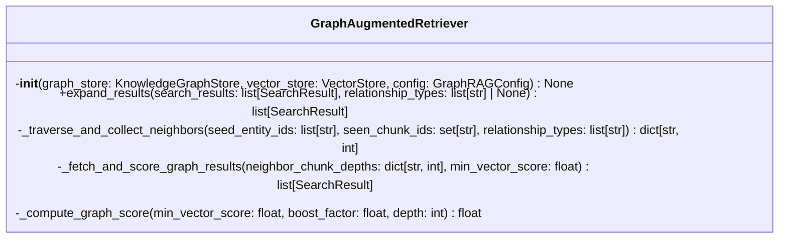
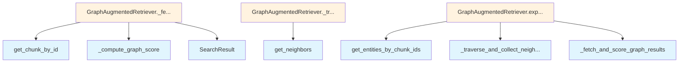

# File: `src/local_deepwiki/core/graph_rag/retriever.py`

## File Overview

This file implements the `GraphAugmentedRetriever` class, which enhances vector search results by leveraging a knowledge graph to discover structurally related code chunks. It bridges the gap between semantic similarity (from vector search) and structural relationships (from the knowledge graph) to improve the relevance of retrieved results.

The primary responsibility of this module is to:
- Expand initial vector search results with graph-discovered chunks.
- Traverse the knowledge graph using BFS to find neighbors of entities.
- Score graph-discovered chunks using a depth-decaying formula to ensure they rank below vector results.
- Integrate with both a [`KnowledgeGraphStore`](store.md) and a [`VectorStore`](../vectorstore/store.md) to fetch and score results.

This design allows the system to provide more contextually rich results by incorporating both semantic and structural relationships, enhancing the accuracy of code retrieval in a knowledge graph-based RAG setup.

## Key Concepts

### Graph-Augmented Retrieval Algorithm
The core algorithm implemented in `expand_results` follows a well-defined process:
1. **Extract chunk IDs** from initial vector search results.
2. **Map to graph entities** using the [`KnowledgeGraphStore`](store.md).
3. **Traverse neighbors** in the knowledge graph using BFS, respecting a maximum traversal depth.
4. **Collect unique neighbor chunks**, excluding those already in vector results.
5. **Fetch neighbor chunks** from the [`VectorStore`](../vectorstore/store.md).
6. **Score graph chunks** using a depth-decaying formula to ensure they are ranked below vector results.
7. **Return combined results**, capped by `max_graph_neighbors`.

This algorithm is chosen for its balance between computational efficiency and relevance, ensuring that the most structurally related code is found without excessive traversal.

### Depth-Decaying Scoring
Graph-discovered chunks are scored using `_compute_graph_score`, which applies a decaying function based on traversal depth:
```python
score = min_vector_score * boost_factor * (1 / depth)
```
This ensures that:
- Closer neighbors (shallower depth) are ranked higher.
- Graph results are always ranked below vector results (assuming `boost_factor < 1`).
- Graph results still contribute to relevance, avoiding noise.

This scoring method is chosen to maintain a clear hierarchy between vector and graph results while preserving the structural signal from the knowledge graph.

### BFS Traversal
The traversal of the knowledge graph is implemented using a breadth-first search (BFS) strategy, where neighbors are discovered level-by-level. This ensures:
- Shallow neighbors are preferred.
- The traversal is bounded by `max_traversal_depth`.
- Efficient exploration of the graph structure without getting lost in deep, irrelevant paths.

## Integration

This module is tightly integrated with:
- [`KnowledgeGraphStore`](store.md): Used to fetch entities and traverse neighbors.
- [`VectorStore`](../vectorstore/store.md): Used to fetch graph-discovered chunks and their content.
- [`GraphRAGConfig`](../../config/models_search.md): Provides configuration values such as `max_traversal_depth`, `max_graph_neighbors`, and `score_boost_factor`.

The `GraphAugmentedRetriever` is used by:
- `__init__`: Initializes the retriever with stores and configuration.
- `graph_expansion`: Likely a method or function that orchestrates graph expansion.
- `test_graph_rag_retriever`: A test function that validates the behavior of this class.

The integration with [`KnowledgeGraphStore`](store.md) and [`VectorStore`](../vectorstore/store.md) is central to its design, as it enables the system to move seamlessly between vector and graph representations of code.

## Design Notes

### Why BFS Instead of DFS?
BFS is chosen for traversal to prioritize closer neighbors, which aligns with the design goal of giving more weight to structurally related code that is immediately adjacent in the knowledge graph. DFS might lead to deeper, less relevant results and is less predictable in ranking.

### Handling Missing Chunks
When a chunk is not found in the [`VectorStore`](../vectorstore/store.md), it is skipped with a debug log. This design choice ensures robustness in case of inconsistencies between the graph and vector stores, without failing the entire retrieval process.

### Score Capping and Ranking
Graph results are capped by `max_graph_neighbors` and ranked based on depth. This prevents an explosion of results while ensuring that the most relevant graph-discovered chunks are prioritized.

### Depth Handling
The `_compute_graph_score` method ensures that `depth` is at least 1 to avoid division by zero or incorrect scoring, demonstrating robustness in edge cases.

### Configuration-Driven Behavior
The behavior of the retriever is heavily driven by [`GraphRAGConfig`](../../config/models_search.md), which allows for easy tuning and experimentation without modifying the core logic. This modular design supports different retrieval strategies and performance trade-offs.

## API Reference

### class `GraphAugmentedRetriever`

Expand vector search results by traversing the knowledge graph.  The retriever sits between the vector store search and the caller, enriching results with structurally related code discovered via graph traversal (calls, imports, inheritance, containment, references).  Graph-discovered chunks are scored below the minimum vector result using a depth-decaying formula so they supplement -- but never outrank -- direct semantic matches.

**Methods:**


<details>
<summary>View Source (lines 24-232) | <a href="https://github.com/UrbanDiver/local-deepwiki-mcp/blob/main/src/local_deepwiki/core/graph_rag/retriever.py#L24-L232">GitHub</a></summary>

```python
class GraphAugmentedRetriever:
    # Methods: __init__, expand_results, _traverse_and_collect_neighbors, _fetch_and_score_graph_results, _compute_graph_score
```

</details>

#### `__init__`

```python
def __init__(graph_store: KnowledgeGraphStore, vector_store: VectorStore, config: GraphRAGConfig) -> None
```


| Parameter | Type | Default | Description |
|-----------|------|---------|-------------|
| `graph_store` | `KnowledgeGraphStore` | - | - |
| `vector_store` | `VectorStore` | - | - |
| `config` | `GraphRAGConfig` | - | - |


<details>
<summary>View Source (lines 38-46) | <a href="https://github.com/UrbanDiver/local-deepwiki-mcp/blob/main/src/local_deepwiki/core/graph_rag/retriever.py#L38-L46">GitHub</a></summary>

```python
def __init__(
        self,
        graph_store: KnowledgeGraphStore,
        vector_store: VectorStore,
        config: GraphRAGConfig,
    ) -> None:
        self._graph_store = graph_store
        self._vector_store = vector_store
        self._config = config
```

</details>

#### `expand_results`

```python
async def expand_results(search_results: list[SearchResult], relationship_types: list[str] | None = None) -> list[SearchResult]
```

Expand vector search results with graph-discovered chunks.  Algorithm: 1. Extract ``chunk_id`` values from *search_results*. 2. Look up corresponding graph entities via the graph store. 3. For each entity, traverse neighbors via ``graph_store.get_neighbors()`` using ``config.max_traversal_depth`` and *relationship_types*. 4. Collect unique neighbor ``chunk_id`` values (excluding chunks already present in the vector results). 5. Fetch neighbor chunks from the vector store by ID. 6. Score each graph chunk with :meth:`_compute_graph_score`. 7. Return original results + graph results, capped by ``config.max_graph_neighbors``.


| Parameter | Type | Default | Description |
|-----------|------|---------|-------------|
| `search_results` | `list[SearchResult]` | - | Vector search results to expand. |
| `relationship_types` | `list[str] | None` | `None` | Relationship types to traverse.  Falls back to ``config.relationship_types`` when *None*. |


<details>
<summary>View Source (lines 48-120) | <a href="https://github.com/UrbanDiver/local-deepwiki-mcp/blob/main/src/local_deepwiki/core/graph_rag/retriever.py#L48-L120">GitHub</a></summary>

```python
async def expand_results(
        self,
        search_results: list[SearchResult],
        relationship_types: list[str] | None = None,
    ) -> list[SearchResult]:
        """Expand vector search results with graph-discovered chunks.

        Algorithm:
        1. Extract ``chunk_id`` values from *search_results*.
        2. Look up corresponding graph entities via the graph store.
        3. For each entity, traverse neighbors via
           ``graph_store.get_neighbors()`` using
           ``config.max_traversal_depth`` and *relationship_types*.
        4. Collect unique neighbor ``chunk_id`` values (excluding chunks
           already present in the vector results).
        5. Fetch neighbor chunks from the vector store by ID.
        6. Score each graph chunk with :meth:`_compute_graph_score`.
        7. Return original results + graph results, capped by
           ``config.max_graph_neighbors``.

        Args:
            search_results: Vector search results to expand.
            relationship_types: Relationship types to traverse.  Falls back
                to ``config.relationship_types`` when *None*.

        Returns:
            The original results followed by graph-discovered results,
            deduplicated by ``chunk_id``.
        """
        if not search_results:
            return list(search_results)

        effective_rel_types = (
            relationship_types
            if relationship_types is not None
            else list(self._config.relationship_types)
        )

        # Step 1 — collect chunk IDs already in vector results
        seen_chunk_ids: set[str] = {r.chunk.id for r in search_results}
        original_chunk_ids = list(seen_chunk_ids)

        # Step 2 — map chunks to graph entities
        entities = await self._graph_store.get_entities_by_chunk_ids(original_chunk_ids)
        if not entities:
            logger.debug(
                "No graph entities found for %d chunks", len(original_chunk_ids)
            )
            return list(search_results)

        # Steps 3-4 — BFS traversal and neighbor collection
        seed_entity_ids = [e.id for e in entities]
        neighbor_chunk_depths = await self._traverse_and_collect_neighbors(
            seed_entity_ids, seen_chunk_ids, effective_rel_types
        )

        if not neighbor_chunk_depths:
            logger.debug("Graph traversal found no new neighbors")
            return list(search_results)

        # Steps 5-6 — fetch chunks from vector store and score them
        min_vector_score = min(r.score for r in search_results)
        graph_results = await self._fetch_and_score_graph_results(
            neighbor_chunk_depths, min_vector_score
        )

        logger.debug(
            "Graph expansion: %d vector results + %d graph results",
            len(search_results),
            len(graph_results),
        )

        return list(search_results) + graph_results
```

</details>

## Class Diagram



## Call Graph



## Used By

Functions and methods in this file and their callers:

- **[`SearchResult`](../../handlers/types.md)**: called by `GraphAugmentedRetriever._fetch_and_score_graph_results`
- **`_compute_graph_score`**: called by `GraphAugmentedRetriever._fetch_and_score_graph_results`
- **`_fetch_and_score_graph_results`**: called by `GraphAugmentedRetriever.expand_results`
- **`_traverse_and_collect_neighbors`**: called by `GraphAugmentedRetriever.expand_results`
- **`get_chunk_by_id`**: called by `GraphAugmentedRetriever._fetch_and_score_graph_results`
- **`get_entities_by_chunk_ids`**: called by `GraphAugmentedRetriever.expand_results`
- **`get_neighbors`**: called by `GraphAugmentedRetriever._traverse_and_collect_neighbors`

## Last Modified

| Entity | Type | Author | Date | Commit |
|--------|------|--------|------|--------|
| `GraphAugmentedRetriever` | class | Brian Breidenbach | 1 week ago | `67aa04f` refactor: extract helpers f... |
| `expand_results` | method | Brian Breidenbach | 1 week ago | `67aa04f` refactor: extract helpers f... |
| `_traverse_and_collect_neighbors` | method | Brian Breidenbach | 1 week ago | `67aa04f` refactor: extract helpers f... |
| `_fetch_and_score_graph_results` | method | Brian Breidenbach | 1 week ago | `67aa04f` refactor: extract helpers f... |
| `__init__` | method | Brian Breidenbach | 2 weeks ago | `ee9eebf` feat: add GraphRAG knowledg... |
| `_compute_graph_score` | method | Brian Breidenbach | 2 weeks ago | `ee9eebf` feat: add GraphRAG knowledg... |

## Additional Source Code

Source code for functions and methods not listed in the API Reference above.

#### `_traverse_and_collect_neighbors`

<details>
<summary>View Source (lines 122-161) | <a href="https://github.com/UrbanDiver/local-deepwiki-mcp/blob/main/src/local_deepwiki/core/graph_rag/retriever.py#L122-L161">GitHub</a></summary>

```python
async def _traverse_and_collect_neighbors(
        self,
        seed_entity_ids: list[str],
        seen_chunk_ids: set[str],
        relationship_types: list[str],
    ) -> dict[str, int]:
        """BFS traversal to discover neighbor chunk IDs and their shallowest depth.

        Calls ``graph_store.get_neighbors`` once per depth level, collecting
        every new chunk ID encountered.  Chunk IDs already present in
        *seen_chunk_ids* are skipped.

        Args:
            seed_entity_ids: Entity IDs from which to start traversal.
            seen_chunk_ids: Chunk IDs already in the vector results (excluded).
            relationship_types: Edge types to follow during traversal.

        Returns:
            Mapping of ``chunk_id`` -> shallowest depth at which it was found.
        """
        neighbor_chunk_depths: dict[str, int] = {}

        for depth in range(1, self._config.max_traversal_depth + 1):
            traversal = await self._graph_store.get_neighbors(
                seed_entity_ids,
                relationship_types=relationship_types,
                max_depth=depth,
            )
            for neighbor in traversal.entities:
                cid = neighbor.chunk_id
                if not cid or cid in seen_chunk_ids:
                    continue
                # Keep the shallowest depth at which we discovered this chunk
                if (
                    cid not in neighbor_chunk_depths
                    or depth < neighbor_chunk_depths[cid]
                ):
                    neighbor_chunk_depths[cid] = depth

        return neighbor_chunk_depths
```

</details>


#### `_fetch_and_score_graph_results`

<details>
<summary>View Source (lines 163-204) | <a href="https://github.com/UrbanDiver/local-deepwiki-mcp/blob/main/src/local_deepwiki/core/graph_rag/retriever.py#L163-L204">GitHub</a></summary>

```python
async def _fetch_and_score_graph_results(
        self,
        neighbor_chunk_depths: dict[str, int],
        min_vector_score: float,
    ) -> list[SearchResult]:
        """Fetch neighbor chunks from the vector store and compute their scores.

        Caps the number of graph neighbors at ``config.max_graph_neighbors``,
        preferring shallower (closer) neighbors.  Each fetched chunk is scored
        with :meth:`_compute_graph_score`.

        Args:
            neighbor_chunk_depths: Mapping of ``chunk_id`` -> discovery depth.
            min_vector_score: Lowest score among the original vector results.

        Returns:
            List of :class:`~local_deepwiki.models.chunks.SearchResult` for
            graph-discovered chunks, tagged with ``highlights=["graph-expanded"]``.
        """
        # Prefer shallower (closer) neighbors by sorting on depth
        sorted_neighbors = sorted(
            neighbor_chunk_depths.items(), key=lambda item: item[1]
        )
        capped = sorted_neighbors[: self._config.max_graph_neighbors]

        graph_results: list[SearchResult] = []
        for chunk_id, depth in capped:
            chunk = await self._vector_store.get_chunk_by_id(chunk_id)
            if chunk is None:
                logger.debug("Chunk %s not found in vector store, skipping", chunk_id)
                continue

            score = self._compute_graph_score(
                min_vector_score,
                self._config.score_boost_factor,
                depth,
            )
            graph_results.append(
                SearchResult(chunk=chunk, score=score, highlights=["graph-expanded"])
            )

        return graph_results
```

</details>


#### `_compute_graph_score`

<details>
<summary>View Source (lines 207-232) | <a href="https://github.com/UrbanDiver/local-deepwiki-mcp/blob/main/src/local_deepwiki/core/graph_rag/retriever.py#L207-L232">GitHub</a></summary>

```python
def _compute_graph_score(
        min_vector_score: float,
        boost_factor: float,
        depth: int,
    ) -> float:
        """Compute score for a graph-discovered chunk.

        The score decays with traversal depth so that closer neighbors rank
        higher::

            score = min_vector_score * boost_factor * (1 / depth)

        This ensures graph results always rank below vector results (assuming
        ``boost_factor < 1``) while remaining above random noise.

        Args:
            min_vector_score: Lowest score among the original vector results.
            boost_factor: Multiplier from ``GraphRAGConfig.score_boost_factor``.
            depth: BFS depth at which the neighbor was discovered (>= 1).

        Returns:
            Non-negative float score.
        """
        if depth < 1:
            depth = 1
        return min_vector_score * boost_factor * (1.0 / depth)
```

</details>

## Relevant Source Files

- `src/local_deepwiki/core/graph_rag/retriever.py:24-232`
