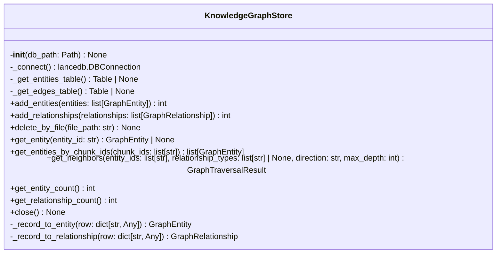

# File: `src/local_deepwiki/core/graph_rag/store.py`

## File Overview

This file provides a LanceDB-backed storage layer for the GraphRAG knowledge graph. It manages two primary tables — `graph_entities` and `graph_edges` — which store code entities (functions, classes, modules) and the relationships between them (e.g., calls, imports, inherits_from, contains, references).

The design follows a lazy connection pattern and uses thread-safe access via `threading.RLock`, similar to the [`VectorStore`](../vectorstore/store.md) in the vectorstore module. This allows for efficient, concurrent access to the graph data while ensuring that database connections are only opened when needed.

## Key Concepts

### Thread-Safe Lazy Connection Pattern
The `KnowledgeGraphStore` uses a lazy connection approach to access the underlying LanceDB database. This pattern ensures that the database is only initialized when first accessed, improving startup performance and reducing resource consumption.

### Table Management
Two main tables are maintained:
- `graph_entities`: Stores entities (code elements) with metadata.
- `graph_edges`: Stores relationships (edges) between entities.

Each table is accessed through dedicated methods that ensure indexes are created on relevant columns upon first access, optimizing query performance.

### Graph Traversal
The implementation supports graph traversal using a breadth-first search (BFS) algorithm, allowing users to explore neighbors of entities based on specified relationship types and traversal depth. This is central to how GraphRAG retrieves contextual information from the knowledge graph.

### Indexing Strategy
The `_create_index_safe` helper function creates scalar indexes on key columns for performance. It silently ignores failures to avoid breaking operations if indexing fails due to internal constraints or permissions.

## Integration

This file is part of the `local_deepwiki.core.graph_rag` module and integrates closely with other components of the system:

- **Imports**:
  - Uses `LanceDB` for database operations.
  - Relies on `_sanitize_string_value` from `local_deepwiki.core.vectorstore.utils` to prevent injection issues in queries.
  - Imports logging via [`local_deepwiki.logging.get_logger`](../../logging.md).
  - Uses models defined in `src/local_deepwiki/core/graph_rag/models.py` for data representation ([`GraphEntity`](models.md), [`GraphRelationship`](models.md), etc.).

- **Called by**:
  - `KnowledgeGraphStore` itself, used in `__init__`, `indexer_graph`, and `test_graph_rag_store`.
  - `_create_index_safe` is used by `test_graph_rag_store` and `test_vectorstore_indexes`.

- **Related Files**:
  - The CLI modules (`cache_cli.py`, `check_cli.py`, etc.) likely use this store for retrieving or updating graph data during processing steps.
  - The `processing_models.py` config file may influence how entities and relationships are structured or indexed.

## Design Notes

### Why LanceDB?
LanceDB was chosen for its ability to handle large-scale tabular data with efficient querying and indexing capabilities. It supports vector search and scalar indexing, making it well-suited for hybrid retrieval systems like GraphRAG where both structural and semantic information is important.

### Why Two Separate Tables?
Separating entities and relationships into distinct tables allows for:
- Clear semantic distinction.
- Efficient querying of either entities or relationships.
- Easier schema evolution and maintenance.

### Indexing Approach
Indexes are created only on first access to optimize startup time. This approach avoids unnecessary overhead if certain tables are not used immediately after initialization.

### Query Sanitization
All queries use `_sanitize_string_value` to prevent SQL injection-like issues when constructing filter expressions. This is critical for maintaining data integrity and security.

### Thread Safety
The use of `threading.RLock` ensures that multiple threads can safely access the store without causing race conditions. This is especially important in async environments where multiple concurrent operations might occur.

### BFS Traversal
The traversal logic is designed to be flexible, allowing filtering by relationship type and direction (`outgoing`, `incoming`, `both`). This enables rich graph exploration tailored to specific use cases within the GraphRAG pipeline.

### Resource Cleanup
The `close` method safely releases all resources, ensuring that database connections and table references are properly cleaned up. It is safe to call multiple times, which is useful in test environments or when managing lifecycle manually.

## API Reference

### class `KnowledgeGraphStore`

LanceDB-backed store for code entities and relationships.  Parameters ---------- db_path: Path to the LanceDB database directory (same path used by :class:`~local_deepwiki.core.vectorstore.store.VectorStore`).

**Methods:**


<details>
<summary>View Source (lines 44-411) | <a href="https://github.com/UrbanDiver/local-deepwiki-mcp/blob/main/src/local_deepwiki/core/graph_rag/store.py#L44-L411">GitHub</a></summary>

```python
class KnowledgeGraphStore:
    # Methods: __init__, _connect, _get_entities_table, _get_edges_table, add_entities, add_relationships, delete_by_file, get_entity, get_entities_by_chunk_ids, get_neighbors, get_entity_count, get_relationship_count, close, _record_to_entity, _record_to_relationship, _fetch_edges, _fetch_entities_by_ids
```

</details>

#### `__init__`

```python
def __init__(db_path: Path) -> None
```


| Parameter | Type | Default | Description |
|-----------|------|---------|-------------|
| `db_path` | `Path` | - | - |


<details>
<summary>View Source (lines 57-62) | <a href="https://github.com/UrbanDiver/local-deepwiki-mcp/blob/main/src/local_deepwiki/core/graph_rag/store.py#L57-L62">GitHub</a></summary>

```python
def __init__(self, db_path: Path) -> None:
        self.db_path = db_path
        self._db: lancedb.DBConnection | None = None
        self._entities_table: Table | None = None
        self._edges_table: Table | None = None
        self._lock = threading.RLock()
```

</details>

#### `add_entities`

```python
async def add_entities(entities: list[GraphEntity]) -> int
```

Batch-insert entities into the graph.  Returns the number of entities added.


| Parameter | Type | Default | Description |
|-----------|------|---------|-------------|
| `entities` | `list[GraphEntity]` | - | - |


<details>
<summary>View Source (lines 108-130) | <a href="https://github.com/UrbanDiver/local-deepwiki-mcp/blob/main/src/local_deepwiki/core/graph_rag/store.py#L108-L130">GitHub</a></summary>

```python
async def add_entities(self, entities: list[GraphEntity]) -> int:
        """Batch-insert entities into the graph.

        Returns the number of entities added.
        """
        if not entities:
            return 0

        records = [e.to_record() for e in entities]
        db = self._connect()

        with self._lock:
            table = self._get_entities_table()
            if table is None:
                self._entities_table = db.create_table(self.ENTITIES_TABLE, records)
                _create_index_safe(self._entities_table, "id")
                _create_index_safe(self._entities_table, "file_path")
                _create_index_safe(self._entities_table, "chunk_id")
            else:
                table.add(records)

        logger.debug("Added %d entities", len(records))
        return len(records)
```

</details>

#### `add_relationships`

```python
async def add_relationships(relationships: list[GraphRelationship]) -> int
```

Batch-insert relationships (edges) into the graph.  Returns the number of relationships added.


| Parameter | Type | Default | Description |
|-----------|------|---------|-------------|
| `relationships` | `list[GraphRelationship]` | - | - |


<details>
<summary>View Source (lines 132-155) | <a href="https://github.com/UrbanDiver/local-deepwiki-mcp/blob/main/src/local_deepwiki/core/graph_rag/store.py#L132-L155">GitHub</a></summary>

```python
async def add_relationships(self, relationships: list[GraphRelationship]) -> int:
        """Batch-insert relationships (edges) into the graph.

        Returns the number of relationships added.
        """
        if not relationships:
            return 0

        records = [r.to_record() for r in relationships]
        db = self._connect()

        with self._lock:
            table = self._get_edges_table()
            if table is None:
                self._edges_table = db.create_table(self.EDGES_TABLE, records)
                _create_index_safe(self._edges_table, "id")
                _create_index_safe(self._edges_table, "source_id")
                _create_index_safe(self._edges_table, "target_id")
                _create_index_safe(self._edges_table, "file_path")
            else:
                table.add(records)

        logger.debug("Added %d relationships", len(records))
        return len(records)
```

</details>

#### `delete_by_file`

```python
async def delete_by_file(file_path: str) -> None
```

Delete all entities *and* edges associated with *file_path*.  Used for incremental re-indexing of a single file.


| Parameter | Type | Default | Description |
|-----------|------|---------|-------------|
| `file_path` | `str` | - | - |


<details>
<summary>View Source (lines 157-173) | <a href="https://github.com/UrbanDiver/local-deepwiki-mcp/blob/main/src/local_deepwiki/core/graph_rag/store.py#L157-L173">GitHub</a></summary>

```python
async def delete_by_file(self, file_path: str) -> None:
        """Delete all entities *and* edges associated with *file_path*.

        Used for incremental re-indexing of a single file.
        """
        safe_path = _sanitize_string_value(file_path)
        filter_expr = f"file_path = '{safe_path}'"

        entities_table = self._get_entities_table()
        if entities_table is not None:
            entities_table.delete(filter_expr)

        edges_table = self._get_edges_table()
        if edges_table is not None:
            edges_table.delete(filter_expr)

        logger.debug("Deleted graph data for file: %s", file_path)
```

</details>

#### `get_entity`

```python
async def get_entity(entity_id: str) -> GraphEntity | None
```

Look up a single entity by its deterministic ID.


| Parameter | Type | Default | Description |
|-----------|------|---------|-------------|
| `entity_id` | `str` | - | - |


<details>
<summary>View Source (lines 179-189) | <a href="https://github.com/UrbanDiver/local-deepwiki-mcp/blob/main/src/local_deepwiki/core/graph_rag/store.py#L179-L189">GitHub</a></summary>

```python
async def get_entity(self, entity_id: str) -> GraphEntity | None:
        """Look up a single entity by its deterministic ID."""
        table = self._get_entities_table()
        if table is None:
            return None

        safe_id = _sanitize_string_value(entity_id)
        rows = table.search().where(f"id = '{safe_id}'").limit(1).to_list()
        if not rows:
            return None
        return self._record_to_entity(rows[0])
```

</details>

#### `get_entities_by_chunk_ids`

```python
async def get_entities_by_chunk_ids(chunk_ids: list[str]) -> list[GraphEntity]
```

Return all entities whose ``chunk_id`` is in *chunk_ids*.


| Parameter | Type | Default | Description |
|-----------|------|---------|-------------|
| `chunk_ids` | `list[str]` | - | - |


<details>
<summary>View Source (lines 191-212) | <a href="https://github.com/UrbanDiver/local-deepwiki-mcp/blob/main/src/local_deepwiki/core/graph_rag/store.py#L191-L212">GitHub</a></summary>

```python
async def get_entities_by_chunk_ids(
        self, chunk_ids: list[str]
    ) -> list[GraphEntity]:
        """Return all entities whose ``chunk_id`` is in *chunk_ids*."""
        if not chunk_ids:
            return []

        table = self._get_entities_table()
        if table is None:
            return []

        safe_ids = [_sanitize_string_value(cid) for cid in chunk_ids]
        in_clause = ", ".join(f"'{cid}'" for cid in safe_ids)
        filter_expr = f"chunk_id IN ({in_clause})"

        rows = (
            table.search()
            .where(filter_expr)
            .limit(len(chunk_ids) * 10)  # generous upper bound
            .to_list()
        )
        return [self._record_to_entity(r) for r in rows]
```

</details>

#### `get_neighbors`

```python
async def get_neighbors(entity_ids: list[str], relationship_types: list[str] | None = None, direction: str = "both", max_depth: int = 1) -> GraphTraversalResult
```

BFS traversal from *entity_ids*.  Parameters ---------- entity_ids: Seed entity IDs to start traversal from. relationship_types: If provided, only follow edges whose ``relationship`` is in the list.  ``None`` means follow all relationship types. direction: ``"outgoing"`` — entity is ``source_id``. ``"incoming"`` — entity is ``target_id``. ``"both"`` — follow edges in either direction. max_depth: Maximum number of hops (BFS levels).  Returns ------- [GraphTraversalResult](models.md) All discovered entities and relationships within *max_depth* hops.


| Parameter | Type | Default | Description |
|-----------|------|---------|-------------|
| `entity_ids` | `list[str]` | - | - |
| `relationship_types` | `list[str] | None` | `None` | - |
| `direction` | `str` | `"both"` | - |
| `max_depth` | `int` | `1` | - |


<details>
<summary>View Source (lines 214-287) | <a href="https://github.com/UrbanDiver/local-deepwiki-mcp/blob/main/src/local_deepwiki/core/graph_rag/store.py#L214-L287">GitHub</a></summary>

```python
async def get_neighbors(
        self,
        entity_ids: list[str],
        relationship_types: list[str] | None = None,
        direction: str = "both",
        max_depth: int = 1,
    ) -> GraphTraversalResult:
        """BFS traversal from *entity_ids*.

        Parameters
        ----------
        entity_ids:
            Seed entity IDs to start traversal from.
        relationship_types:
            If provided, only follow edges whose ``relationship`` is in the
            list.  ``None`` means follow all relationship types.
        direction:
            ``"outgoing"`` — entity is ``source_id``.
            ``"incoming"`` — entity is ``target_id``.
            ``"both"`` — follow edges in either direction.
        max_depth:
            Maximum number of hops (BFS levels).

        Returns
        -------
        GraphTraversalResult
            All discovered entities and relationships within *max_depth* hops.
        """
        edges_table = self._get_edges_table()
        entities_table = self._get_entities_table()
        if edges_table is None or entities_table is None:
            return GraphTraversalResult()

        visited_entity_ids: set[str] = set(entity_ids)
        all_relationships: list[GraphRelationship] = []
        frontier: set[str] = set(entity_ids)
        depth_reached = 0

        for depth in range(1, max_depth + 1):
            if not frontier:
                break

            edges = self._fetch_edges(
                edges_table, frontier, relationship_types, direction
            )
            if not edges:
                break

            depth_reached = depth
            next_frontier: set[str] = set()
            for edge in edges:
                all_relationships.append(edge)
                # Determine the "other side" entity ID
                neighbor_ids_for_edge: set[str] = set()
                if edge.source_id in frontier:
                    neighbor_ids_for_edge.add(edge.target_id)
                if edge.target_id in frontier:
                    neighbor_ids_for_edge.add(edge.source_id)

                for nid in neighbor_ids_for_edge:
                    if nid not in visited_entity_ids:
                        visited_entity_ids.add(nid)
                        next_frontier.add(nid)

            frontier = next_frontier

        # Fetch all discovered entity objects
        all_entities = self._fetch_entities_by_ids(entities_table, visited_entity_ids)

        return GraphTraversalResult(
            entities=tuple(all_entities),
            relationships=tuple(all_relationships),
            depth_reached=depth_reached,
        )
```

</details>

#### `get_entity_count`

```python
async def get_entity_count() -> int
```

Return the total number of entities in the graph.


<details>
<summary>View Source (lines 293-298) | <a href="https://github.com/UrbanDiver/local-deepwiki-mcp/blob/main/src/local_deepwiki/core/graph_rag/store.py#L293-L298">GitHub</a></summary>

```python
async def get_entity_count(self) -> int:
        """Return the total number of entities in the graph."""
        table = self._get_entities_table()
        if table is None:
            return 0
        return table.count_rows()
```

</details>

#### `get_relationship_count`

```python
async def get_relationship_count() -> int
```

Return the total number of relationships in the graph.


<details>
<summary>View Source (lines 300-305) | <a href="https://github.com/UrbanDiver/local-deepwiki-mcp/blob/main/src/local_deepwiki/core/graph_rag/store.py#L300-L305">GitHub</a></summary>

```python
async def get_relationship_count(self) -> int:
        """Return the total number of relationships in the graph."""
        table = self._get_edges_table()
        if table is None:
            return 0
        return table.count_rows()
```

</details>

#### `close`

```python
def close() -> None
```

Release all resources.  Safe to call multiple times.


<details>
<summary>View Source (lines 311-316) | <a href="https://github.com/UrbanDiver/local-deepwiki-mcp/blob/main/src/local_deepwiki/core/graph_rag/store.py#L311-L316">GitHub</a></summary>

```python
def close(self) -> None:
        """Release all resources.  Safe to call multiple times."""
        with self._lock:
            self._entities_table = None
            self._edges_table = None
            self._db = None
```

</details>

## Class Diagram



## Call Graph

```mermaid
flowchart TD
    N0[KnowledgeGraphStore._connect]
    N1[KnowledgeGraphStore._fetch_...]
    N2[KnowledgeGraphStore._fetch_...]
    N3[KnowledgeGraphStore._get_ed...]
    N4[KnowledgeGraphStore._get_en...]
    N5[KnowledgeGraphStore._record...]
    N6[KnowledgeGraphStore._record...]
    N7[KnowledgeGraphStore.add_ent...]
    N8[KnowledgeGraphStore.add_rel...]
    N9[KnowledgeGraphStore.delete_...]
    N10[KnowledgeGraphStore.get_ent...]
    N11[KnowledgeGraphStore.get_entity]
    N12[KnowledgeGraphStore.get_ent...]
    N13[KnowledgeGraphStore.get_nei...]
    N14[_connect]
    N15[_create_index_safe]
    N16[_get_edges_table]
    N17[_get_entities_table]
    N18[_record_to_entity]
    N19[_sanitize_string_value]
    N20[add]
    N21[count_rows]
    N22[create_table]
    N23[limit]
    N24[list_tables]
    N25[open_table]
    N26[search]
    N27[to_list]
    N28[to_record]
    N29[where]
    N4 --> N14
    N4 --> N24
    N4 --> N25
    N4 --> N15
    N3 --> N14
    N3 --> N24
    N3 --> N25
    N3 --> N15
    N7 --> N28
    N7 --> N14
    N7 --> N17
    N7 --> N22
    N7 --> N15
    N7 --> N20
    N8 --> N28
    N8 --> N14
    N8 --> N16
    N8 --> N22
    N8 --> N15
    N8 --> N20
    N9 --> N19
    N9 --> N17
    N9 --> N16
    N11 --> N17
    N11 --> N19
    N11 --> N27
    N11 --> N23
    N11 --> N29
    N11 --> N26
    N11 --> N18
    N10 --> N17
    N10 --> N19
    N10 --> N27
    N10 --> N23
    N10 --> N29
    N10 --> N26
    N10 --> N18
    N13 --> N16
    N13 --> N17
    N13 --> N20
    N12 --> N17
    N12 --> N21
    N1 --> N19
    N1 --> N27
    N1 --> N23
    N1 --> N29
    N1 --> N26
    N2 --> N19
    N2 --> N27
    N2 --> N23
    N2 --> N29
    N2 --> N26
    N2 --> N18
    classDef func fill:#e1f5fe
    class N14,N15,N16,N17,N18,N19,N20,N21,N22,N23,N24,N25,N26,N27,N28,N29 func
    classDef method fill:#fff3e0
    class N0,N1,N2,N3,N4,N5,N6,N7,N8,N9,N10,N11,N12,N13 method
```



## Used By

Functions and methods in this file and their callers:

- **[`EntityType`](models.md)**: called by `KnowledgeGraphStore._record_to_entity`
- **[`GraphEntity`](models.md)**: called by `KnowledgeGraphStore._record_to_entity`
- **[`GraphRelationship`](models.md)**: called by `KnowledgeGraphStore._record_to_relationship`
- **[`GraphTraversalResult`](models.md)**: called by `KnowledgeGraphStore.get_neighbors`
- **`RLock`**: called by `KnowledgeGraphStore.__init__`
- **[`RelationshipType`](models.md)**: called by `KnowledgeGraphStore._record_to_relationship`
- **`_connect`**: called by `KnowledgeGraphStore._get_edges_table`, `KnowledgeGraphStore._get_entities_table`, `KnowledgeGraphStore.add_entities`, `KnowledgeGraphStore.add_relationships`
- **`_create_index_safe`**: called by `KnowledgeGraphStore._get_edges_table`, `KnowledgeGraphStore._get_entities_table`, `KnowledgeGraphStore.add_entities`, `KnowledgeGraphStore.add_relationships`
- **`_fetch_edges`**: called by `KnowledgeGraphStore.get_neighbors`
- **`_fetch_entities_by_ids`**: called by `KnowledgeGraphStore.get_neighbors`
- **`_get_edges_table`**: called by `KnowledgeGraphStore.add_relationships`, `KnowledgeGraphStore.delete_by_file`, `KnowledgeGraphStore.get_neighbors`, `KnowledgeGraphStore.get_relationship_count`
- **`_get_entities_table`**: called by `KnowledgeGraphStore.add_entities`, `KnowledgeGraphStore.delete_by_file`, `KnowledgeGraphStore.get_entities_by_chunk_ids`, `KnowledgeGraphStore.get_entity`, `KnowledgeGraphStore.get_entity_count`, `KnowledgeGraphStore.get_neighbors`
- **`_record_to_entity`**: called by `KnowledgeGraphStore._fetch_entities_by_ids`, `KnowledgeGraphStore.get_entities_by_chunk_ids`, `KnowledgeGraphStore.get_entity`
- **`_record_to_relationship`**: called by `KnowledgeGraphStore._fetch_edges`
- **`_sanitize_string_value`**: called by `KnowledgeGraphStore._fetch_edges`, `KnowledgeGraphStore._fetch_entities_by_ids`, `KnowledgeGraphStore.delete_by_file`, `KnowledgeGraphStore.get_entities_by_chunk_ids`, `KnowledgeGraphStore.get_entity`
- **`add`**: called by `KnowledgeGraphStore.add_entities`, `KnowledgeGraphStore.add_relationships`, `KnowledgeGraphStore.get_neighbors`
- **`connect`**: called by `KnowledgeGraphStore._connect`
- **`count_rows`**: called by `KnowledgeGraphStore.get_entity_count`, `KnowledgeGraphStore.get_relationship_count`
- **`create_scalar_index`**: called by `_create_index_safe`
- **`create_table`**: called by `KnowledgeGraphStore.add_entities`, `KnowledgeGraphStore.add_relationships`
- **`delete`**: called by `KnowledgeGraphStore.delete_by_file`
- **`limit`**: called by `KnowledgeGraphStore._fetch_edges`, `KnowledgeGraphStore._fetch_entities_by_ids`, `KnowledgeGraphStore.get_entities_by_chunk_ids`, `KnowledgeGraphStore.get_entity`
- **`list_tables`**: called by `KnowledgeGraphStore._get_edges_table`, `KnowledgeGraphStore._get_entities_table`
- **`loads`**: called by `KnowledgeGraphStore._record_to_entity`, `KnowledgeGraphStore._record_to_relationship`
- **`mkdir`**: called by `KnowledgeGraphStore._connect`
- **`open_table`**: called by `KnowledgeGraphStore._get_edges_table`, `KnowledgeGraphStore._get_entities_table`
- **`search`**: called by `KnowledgeGraphStore._fetch_edges`, `KnowledgeGraphStore._fetch_entities_by_ids`, `KnowledgeGraphStore.get_entities_by_chunk_ids`, `KnowledgeGraphStore.get_entity`
- **`to_list`**: called by `KnowledgeGraphStore._fetch_edges`, `KnowledgeGraphStore._fetch_entities_by_ids`, `KnowledgeGraphStore.get_entities_by_chunk_ids`, `KnowledgeGraphStore.get_entity`
- **`to_record`**: called by `KnowledgeGraphStore.add_entities`, `KnowledgeGraphStore.add_relationships`
- **`where`**: called by `KnowledgeGraphStore._fetch_edges`, `KnowledgeGraphStore._fetch_entities_by_ids`, `KnowledgeGraphStore.get_entities_by_chunk_ids`, `KnowledgeGraphStore.get_entity`

## Last Modified

| Entity | Type | Author | Date | Commit |
|--------|------|--------|------|--------|
| `KnowledgeGraphStore` | class | Brian Breidenbach | 2 weeks ago | `ee9eebf` feat: add GraphRAG knowledg... |
| `__init__` | method | Brian Breidenbach | 2 weeks ago | `ee9eebf` feat: add GraphRAG knowledg... |
| `_connect` | method | Brian Breidenbach | 2 weeks ago | `ee9eebf` feat: add GraphRAG knowledg... |
| `_get_entities_table` | method | Brian Breidenbach | 2 weeks ago | `ee9eebf` feat: add GraphRAG knowledg... |
| `_get_edges_table` | method | Brian Breidenbach | 2 weeks ago | `ee9eebf` feat: add GraphRAG knowledg... |
| `add_entities` | method | Brian Breidenbach | 2 weeks ago | `ee9eebf` feat: add GraphRAG knowledg... |
| `add_relationships` | method | Brian Breidenbach | 2 weeks ago | `ee9eebf` feat: add GraphRAG knowledg... |
| `delete_by_file` | method | Brian Breidenbach | 2 weeks ago | `ee9eebf` feat: add GraphRAG knowledg... |
| `get_entity` | method | Brian Breidenbach | 2 weeks ago | `ee9eebf` feat: add GraphRAG knowledg... |
| `get_entities_by_chunk_ids` | method | Brian Breidenbach | 2 weeks ago | `ee9eebf` feat: add GraphRAG knowledg... |
| `get_neighbors` | method | Brian Breidenbach | 2 weeks ago | `ee9eebf` feat: add GraphRAG knowledg... |
| `get_entity_count` | method | Brian Breidenbach | 2 weeks ago | `ee9eebf` feat: add GraphRAG knowledg... |
| `get_relationship_count` | method | Brian Breidenbach | 2 weeks ago | `ee9eebf` feat: add GraphRAG knowledg... |
| `close` | method | Brian Breidenbach | 2 weeks ago | `ee9eebf` feat: add GraphRAG knowledg... |
| `_record_to_entity` | method | Brian Breidenbach | 2 weeks ago | `ee9eebf` feat: add GraphRAG knowledg... |
| `_record_to_relationship` | method | Brian Breidenbach | 2 weeks ago | `ee9eebf` feat: add GraphRAG knowledg... |
| `_fetch_edges` | method | Brian Breidenbach | 2 weeks ago | `ee9eebf` feat: add GraphRAG knowledg... |
| `_fetch_entities_by_ids` | method | Brian Breidenbach | 2 weeks ago | `ee9eebf` feat: add GraphRAG knowledg... |
| `_create_index_safe` | function | Brian Breidenbach | 2 weeks ago | `ee9eebf` feat: add GraphRAG knowledg... |

## Additional Source Code

Source code for functions and methods not listed in the API Reference above.

#### `_create_index_safe`

<details>
<summary>View Source (lines 35-41) | <a href="https://github.com/UrbanDiver/local-deepwiki-mcp/blob/main/src/local_deepwiki/core/graph_rag/store.py#L35-L41">GitHub</a></summary>

```python
def _create_index_safe(table: Table, column: str) -> None:
    """Create a scalar index on *column*, silently ignoring failures."""
    try:
        table.create_scalar_index(column)
        logger.debug("Created scalar index on '%s'", column)
    except (ValueError, RuntimeError, OSError) as exc:
        logger.debug("Could not create index on '%s': %s", column, exc)
```

</details>


#### `_connect`

<details>
<summary>View Source (lines 68-75) | <a href="https://github.com/UrbanDiver/local-deepwiki-mcp/blob/main/src/local_deepwiki/core/graph_rag/store.py#L68-L75">GitHub</a></summary>

```python
def _connect(self) -> lancedb.DBConnection:
        """Lazy, thread-safe database connection."""
        if self._db is None:
            with self._lock:
                if self._db is None:
                    self.db_path.parent.mkdir(parents=True, exist_ok=True)
                    self._db = lancedb.connect(str(self.db_path))
        return self._db
```

</details>


#### `_get_entities_table`

<details>
<summary>View Source (lines 77-88) | <a href="https://github.com/UrbanDiver/local-deepwiki-mcp/blob/main/src/local_deepwiki/core/graph_rag/store.py#L77-L88">GitHub</a></summary>

```python
def _get_entities_table(self) -> Table | None:
        """Return the entities table if it exists, creating indexes on first access."""
        if self._entities_table is None:
            with self._lock:
                if self._entities_table is None:
                    db = self._connect()
                    if self.ENTITIES_TABLE in db.list_tables().tables:
                        self._entities_table = db.open_table(self.ENTITIES_TABLE)
                        _create_index_safe(self._entities_table, "id")
                        _create_index_safe(self._entities_table, "file_path")
                        _create_index_safe(self._entities_table, "chunk_id")
        return self._entities_table
```

</details>


#### `_get_edges_table`

<details>
<summary>View Source (lines 90-102) | <a href="https://github.com/UrbanDiver/local-deepwiki-mcp/blob/main/src/local_deepwiki/core/graph_rag/store.py#L90-L102">GitHub</a></summary>

```python
def _get_edges_table(self) -> Table | None:
        """Return the edges table if it exists, creating indexes on first access."""
        if self._edges_table is None:
            with self._lock:
                if self._edges_table is None:
                    db = self._connect()
                    if self.EDGES_TABLE in db.list_tables().tables:
                        self._edges_table = db.open_table(self.EDGES_TABLE)
                        _create_index_safe(self._edges_table, "id")
                        _create_index_safe(self._edges_table, "source_id")
                        _create_index_safe(self._edges_table, "target_id")
                        _create_index_safe(self._edges_table, "file_path")
        return self._edges_table
```

</details>


#### `_record_to_entity`

<details>
<summary>View Source (lines 323-340) | <a href="https://github.com/UrbanDiver/local-deepwiki-mcp/blob/main/src/local_deepwiki/core/graph_rag/store.py#L323-L340">GitHub</a></summary>

```python
def _record_to_entity(row: dict[str, Any]) -> GraphEntity:
        """Deserialize a LanceDB row dict into a :class:`GraphEntity`."""
        metadata_raw = row.get("metadata", "{}")
        metadata = (
            json.loads(metadata_raw) if isinstance(metadata_raw, str) else metadata_raw
        )

        return GraphEntity(
            id=row["id"],
            name=row["name"],
            qualified_name=row["qualified_name"],
            entity_type=EntityType(row["entity_type"]),
            file_path=row["file_path"],
            start_line=int(row["start_line"]),
            end_line=int(row["end_line"]),
            chunk_id=row.get("chunk_id", ""),
            metadata=metadata if metadata else {},
        )
```

</details>


#### `_record_to_relationship`

<details>
<summary>View Source (lines 343-358) | <a href="https://github.com/UrbanDiver/local-deepwiki-mcp/blob/main/src/local_deepwiki/core/graph_rag/store.py#L343-L358">GitHub</a></summary>

```python
def _record_to_relationship(row: dict[str, Any]) -> GraphRelationship:
        """Deserialize a LanceDB row dict into a :class:`GraphRelationship`."""
        metadata_raw = row.get("metadata", "{}")
        metadata = (
            json.loads(metadata_raw) if isinstance(metadata_raw, str) else metadata_raw
        )

        return GraphRelationship(
            id=row["id"],
            source_id=row["source_id"],
            target_id=row["target_id"],
            relationship=RelationshipType(row["relationship"]),
            file_path=row["file_path"],
            weight=float(row.get("weight", 1.0)),
            metadata=metadata if metadata else {},
        )
```

</details>


#### `_fetch_edges`

<details>
<summary>View Source (lines 364-392) | <a href="https://github.com/UrbanDiver/local-deepwiki-mcp/blob/main/src/local_deepwiki/core/graph_rag/store.py#L364-L392">GitHub</a></summary>

```python
def _fetch_edges(
        self,
        edges_table: Table,
        frontier_ids: set[str],
        relationship_types: list[str] | None,
        direction: str,
    ) -> list[GraphRelationship]:
        """Fetch all edges touching *frontier_ids* in the given *direction*."""
        safe_ids = [_sanitize_string_value(eid) for eid in frontier_ids]
        id_list = ", ".join(f"'{eid}'" for eid in safe_ids)

        clauses: list[str] = []
        if direction in ("outgoing", "both"):
            clauses.append(f"source_id IN ({id_list})")
        if direction in ("incoming", "both"):
            clauses.append(f"target_id IN ({id_list})")

        if not clauses:
            return []

        filter_expr = " OR ".join(clauses)

        if relationship_types:
            safe_types = [_sanitize_string_value(rt) for rt in relationship_types]
            types_list = ", ".join(f"'{rt}'" for rt in safe_types)
            filter_expr = f"({filter_expr}) AND relationship IN ({types_list})"

        rows = edges_table.search().where(filter_expr).limit(10_000).to_list()
        return [self._record_to_relationship(r) for r in rows]
```

</details>


#### `_fetch_entities_by_ids`

<details>
<summary>View Source (lines 394-411) | <a href="https://github.com/UrbanDiver/local-deepwiki-mcp/blob/main/src/local_deepwiki/core/graph_rag/store.py#L394-L411">GitHub</a></summary>

```python
def _fetch_entities_by_ids(
        self, entities_table: Table, entity_ids: set[str]
    ) -> list[GraphEntity]:
        """Fetch entities whose ``id`` is in *entity_ids*."""
        if not entity_ids:
            return []

        safe_ids = [_sanitize_string_value(eid) for eid in entity_ids]
        id_list = ", ".join(f"'{eid}'" for eid in safe_ids)
        filter_expr = f"id IN ({id_list})"

        rows = (
            entities_table.search()
            .where(filter_expr)
            .limit(len(entity_ids) + 10)
            .to_list()
        )
        return [self._record_to_entity(r) for r in rows]
```

</details>

## Relevant Source Files

- `src/local_deepwiki/core/graph_rag/store.py:44-411`
