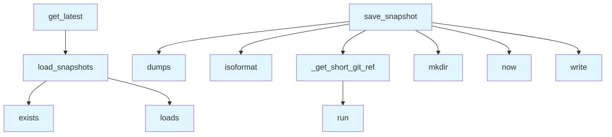

# File: `src/local_deepwiki/core/health_history.py`

## File Overview

This file implements a simple, append-only storage mechanism for architecture health snapshots. It is designed to persist health data over time, enabling trend analysis and historical tracking. The data is stored in a JSONL (JSON Lines) format, where each line is a self-contained JSON object representing a single snapshot.

The core responsibility of this module is to:
- Save health snapshots to disk with metadata such as timestamp and git reference
- Load previously saved snapshots, optionally filtered by a timestamp
- Retrieve the most recent snapshot

This approach is suitable for systems where health data is collected periodically and needs to be stored in a durable, version-controlled, and easily parseable format.

## Key Concepts

### JSONL Storage Format
The module uses a JSONL (JSON Lines) format for storing health history. Each line in the file is a complete JSON object, making it safe for concurrent appends and allowing for efficient incremental parsing. This format is chosen for its simplicity, robustness, and compatibility with streaming data.

### Git Reference Tracking
Each snapshot includes a short git reference (`git_ref`) to associate the health data with a specific revision of the repository. This is crucial for understanding how health metrics evolve over time and across code changes.

### Timestamped Snapshots
Snapshots are timestamped using UTC time. This ensures consistent ordering and enables filtering by time range, which is important for trend analysis.

### Graceful Degradation
When git is unavailable or the path is not within a git repository, the module gracefully falls back to `"unknown"` for the git reference, ensuring that health data can still be collected and stored without interruption.

## Integration

This module is used by the CLI components of the application, particularly in:

- `check_cli`: The `save_snapshot` function is used to persist health data after a check is performed.
- `test_health_history`: The `load_snapshots` function is used to verify the integrity and content of stored snapshots.

The module integrates with the broader codebase by relying on:
- [`local_deepwiki.logging.get_logger`](../logging.md): For logging debug messages when git operations fail.
- `Path` from `pathlib`: For path manipulation and file system operations.
- `subprocess`: To execute git commands for retrieving the current commit hash.

It is also closely related to:
- `git_blame`: Likely used in conjunction for gathering detailed health data.
- CLI modules (`check_cli`, `status_cli`, etc.): These are the primary consumers of this module's functionality.

## Design Notes

### Append-Only Storage
The design assumes an append-only pattern for writing snapshots. This is a deliberate choice to avoid race conditions and simplify concurrent access. The JSONL format naturally supports this pattern, as appending lines to a file is atomic and safe.

### Filtering by Timestamp
The `load_snapshots` function supports filtering snapshots by a `since` timestamp. This filtering is done using lexicographic comparison, which works correctly for ISO-8601-formatted timestamps. This approach is simple and efficient, allowing for quick filtering without complex date parsing.

### Handling Malformed Data
When loading snapshots, the module gracefully skips malformed JSON lines and logs a debug message. This ensures that a single corrupted line does not prevent the entire history from being loaded.

### Default Behavior for Missing Data
If `health_data` lacks an `"overall"` key, `save_snapshot` returns early without saving anything. This is a defensive measure to ensure that incomplete or invalid health data is not persisted.

### Timeout for Git Operations
The `_get_short_git_ref` function uses a timeout when executing git commands. This prevents the application from hanging indefinitely if git is unresponsive or if the repository is corrupted.

### Sorting Snapshots
Snapshots are sorted by timestamp in ascending order when loaded. This allows for straightforward chronological analysis and ensures that the most recent snapshot can be accessed efficiently using `snapshots[-1]`.

## API Reference

### Functions

#### `save_snapshot`

```python
def save_snapshot(wiki_path: Path, health_data: dict) -> None
```

Persist a health snapshot as a single JSONL line.  Extracts the overall score, grade, and per-dimension scores from *health_data* (stripping verbose ``factors`` / ``weights`` keys) and appends the result to ``wiki_path / HISTORY_FILENAME``.  No-op when *health_data* lacks an ``"overall"`` key.


| Parameter | Type | Default | Description |
|-----------|------|---------|-------------|
| `wiki_path` | `Path` | - | - |
| `health_data` | `dict` | - | - |

**Returns:** `None`


<details>
<summary>View Source (lines 45-73) | <a href="https://github.com/UrbanDiver/local-deepwiki-mcp/blob/main/src/local_deepwiki/core/health_history.py#L45-L73">GitHub</a></summary>

```python
def save_snapshot(wiki_path: Path, health_data: dict) -> None:
    """Persist a health snapshot as a single JSONL line.

    Extracts the overall score, grade, and per-dimension scores from
    *health_data* (stripping verbose ``factors`` / ``weights`` keys)
    and appends the result to ``wiki_path / HISTORY_FILENAME``.

    No-op when *health_data* lacks an ``"overall"`` key.
    """
    overall = health_data.get("overall")
    if overall is None:
        return

    snapshot = {
        "timestamp": datetime.now(timezone.utc).isoformat(),
        "git_ref": _get_short_git_ref(wiki_path),
        "score": overall["score"],
        "grade": overall["grade"],
        "dimensions": {
            name: {"score": dim["score"], "grade": dim["grade"]}
            for name, dim in overall.get("dimensions", {}).items()
        },
    }

    wiki_path.mkdir(parents=True, exist_ok=True)
    history_file = wiki_path / HISTORY_FILENAME

    with open(history_file, "a", encoding="utf-8") as fh:
        fh.write(json.dumps(snapshot) + "\n")
```

</details>

#### `load_snapshots`

```python
def load_snapshots(wiki_path: Path, since: str | None = None) -> list[dict]
```

Load snapshots from the JSONL history file.


| Parameter | Type | Default | Description |
|-----------|------|---------|-------------|
| `wiki_path` | `Path` | - | Directory containing the history file. |
| `since` | `str | None` | `None` | Optional ISO-8601 timestamp string.  Only snapshots whose ``timestamp`` is >= *since* are returned.  Works via lexicographic comparison (ISO-8601 sorts correctly). |

**Returns:** `list[dict]`


<details>
<summary>View Source (lines 76-113) | <a href="https://github.com/UrbanDiver/local-deepwiki-mcp/blob/main/src/local_deepwiki/core/health_history.py#L76-L113">GitHub</a></summary>

```python
def load_snapshots(
    wiki_path: Path,
    *,
    since: str | None = None,
) -> list[dict]:
    """Load snapshots from the JSONL history file.

    Args:
        wiki_path: Directory containing the history file.
        since: Optional ISO-8601 timestamp string.  Only snapshots
            whose ``timestamp`` is >= *since* are returned.  Works via
            lexicographic comparison (ISO-8601 sorts correctly).

    Returns:
        A list of snapshot dicts sorted by timestamp ascending.
        Returns an empty list when the history file does not exist.
    """
    history_file = wiki_path / HISTORY_FILENAME
    if not history_file.exists():
        return []

    snapshots: list[dict] = []
    with open(history_file, encoding="utf-8") as fh:
        for line in fh:
            stripped = line.strip()
            if not stripped:
                continue
            try:
                entry = json.loads(stripped)
            except json.JSONDecodeError:
                logger.debug("Skipping malformed JSONL line: %s", stripped)
                continue

            if since is not None and entry.get("timestamp", "") < since:
                continue
            snapshots.append(entry)

    return sorted(snapshots, key=lambda s: s.get("timestamp", ""))
```

</details>

#### `get_latest`

```python
def get_latest(wiki_path: Path) -> dict | None
```

Return the most recent snapshot, or ``None`` if no history exists.


| Parameter | Type | Default | Description |
|-----------|------|---------|-------------|
| `wiki_path` | `Path` | - | - |

**Returns:** `dict | None`


<details>
<summary>View Source (lines 116-121) | <a href="https://github.com/UrbanDiver/local-deepwiki-mcp/blob/main/src/local_deepwiki/core/health_history.py#L116-L121">GitHub</a></summary>

```python
def get_latest(wiki_path: Path) -> dict | None:
    """Return the most recent snapshot, or ``None`` if no history exists."""
    snapshots = load_snapshots(wiki_path)
    if not snapshots:
        return None
    return snapshots[-1]
```

</details>

## Call Graph



## Used By

Functions and methods in this file and their callers:

- **`_get_short_git_ref`**: called by `save_snapshot`
- **`dumps`**: called by `save_snapshot`
- **`exists`**: called by `load_snapshots`
- **`isoformat`**: called by `save_snapshot`
- **`load_snapshots`**: called by `get_latest`
- **`loads`**: called by `load_snapshots`
- **`mkdir`**: called by `save_snapshot`
- **`now`**: called by `save_snapshot`
- **`run`**: called by `_get_short_git_ref`
- **`write`**: called by `save_snapshot`

## Usage Examples

*Examples extracted from test files*

### Creates JSONL file with correct shape, factors stripped

From `test_health_history.py::TestSaveSnapshot::test_save_snapshot_creates_file`:

```python
save_snapshot(wiki_path, health_data)

history_file = wiki_path / HISTORY_FILENAME
assert history_file.exists()

lines = history_file.read_text().strip().splitlines()
assert len(lines) == 1
```

### Two saves produce two JSONL lines

From `test_health_history.py::TestSaveSnapshot::test_save_snapshot_appends`:

```python
save_snapshot(wiki_path, _make_health_data(70.0, "C"))
save_snapshot(wiki_path, _make_health_data(80.0, "B"))

lines = (wiki_path / HISTORY_FILENAME).read_text().strip().splitlines()
assert len(lines) == 2

first = json.loads(lines[0])
second = json.loads(lines[1])
assert first["score"] == 70.0
```

### Returns empty list when no history file exists

From `test_health_history.py::TestLoadSnapshots::test_load_snapshots_empty`:

```python
result = load_snapshots(tmp_path / "nonexistent")
assert result == []
```

### Returns all snapshots in chronological order

From `test_health_history.py::TestLoadSnapshots::test_load_snapshots_returns_all`:

```python
history_file = tmp_path / HISTORY_FILENAME
entries = [
    {"timestamp": "2026-03-01T00:00:00+00:00", "score": 60.0, "grade": "C"},
    {"timestamp": "2026-03-02T00:00:00+00:00", "score": 70.0, "grade": "B"},
    {"timestamp": "2026-03-03T00:00:00+00:00", "score": 80.0, "grade": "A"},
]
history_file.write_text("\n".join(json.dumps(e) for e in entries) + "\n")

result = load_snapshots(tmp_path)
assert len(result) == 3
assert result[0]["score"] == 60.0
assert result[1]["score"] == 70.0
assert result[2]["score"] == 80.0
```

### Returns the most recent snapshot

From `test_health_history.py::TestGetLatest::test_get_latest`:

```python
history_file = tmp_path / HISTORY_FILENAME
entries = [
    {"timestamp": "2026-03-01T00:00:00+00:00", "score": 60.0, "grade": "C"},
    {"timestamp": "2026-03-10T00:00:00+00:00", "score": 80.0, "grade": "B"},
]
history_file.write_text("\n".join(json.dumps(e) for e in entries) + "\n")

result = get_latest(tmp_path)
assert result is not None
assert result["score"] == 80.0
assert result["grade"] == "B"
```


## Last Modified

| Entity | Type | Author | Date | Commit |
|--------|------|--------|------|--------|
| `_get_short_git_ref` | function | Brian Breidenbach | 3 days ago | `f279ef2` feat: add health history JS... |
| `save_snapshot` | function | Brian Breidenbach | 3 days ago | `f279ef2` feat: add health history JS... |
| `load_snapshots` | function | Brian Breidenbach | 3 days ago | `f279ef2` feat: add health history JS... |
| `get_latest` | function | Brian Breidenbach | 3 days ago | `f279ef2` feat: add health history JS... |

## Additional Source Code

Source code for functions and methods not listed in the API Reference above.

#### `_get_short_git_ref`

<details>
<summary>View Source (lines 24-42) | <a href="https://github.com/UrbanDiver/local-deepwiki-mcp/blob/main/src/local_deepwiki/core/health_history.py#L24-L42">GitHub</a></summary>

```python
def _get_short_git_ref(wiki_path: Path) -> str:
    """Return the short HEAD ref for the repo containing *wiki_path*.

    Falls back to ``"unknown"`` when git is unavailable or the path is
    not inside a git repository.
    """
    try:
        result = subprocess.run(
            ["git", "rev-parse", "--short", "HEAD"],
            capture_output=True,
            text=True,
            cwd=str(wiki_path),
            timeout=GIT_REV_PARSE_TIMEOUT,
        )
        if result.returncode == 0:
            return result.stdout.strip()
    except (OSError, subprocess.TimeoutExpired) as exc:
        logger.debug("Could not determine git ref: %s", exc)
    return "unknown"
```

</details>

## Relevant Source Files

- `src/local_deepwiki/core/health_history.py:24-42`
