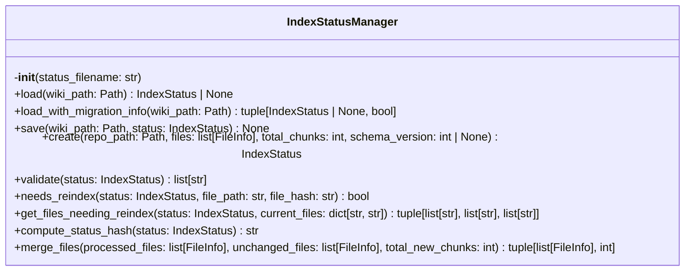

# File Overview

This file, `src/local_deepwiki/core/index_manager.py`, manages the index status for a wiki, including loading, saving, validating, and migrating index status files. It is responsible for tracking the state of indexed files and determining whether reindexing is required. The module uses [`FileInfo`](../models.md) and [`IndexStatus`](../models.md) models for data representation and relies on [`get_logger`](../logging.md) for logging.

# Classes

## IndexStatusManager

The `IndexStatusManager` class provides functionality for managing the index status of a wiki. It handles loading, saving, creating, validating, and checking whether reindexing is needed for specific files or entire sets of files.

### Methods

#### `__init__`
```python
def __init__(self, status_filename: str = INDEX_STATUS_FILE):
```
Initialize the index status manager.

- **Parameters:**
  - `status_filename`: Name of the index status file (default: `index_status.json`).

#### `load`
```python
def load(self, wiki_path: Path) -> IndexStatus | None:
```
Load index status from a wiki directory.

- **Parameters:**
  - `wiki_path`: Path to the wiki directory containing the index status file.
- **Returns:**
  - [`IndexStatus`](../models.md) if found and valid, `None` otherwise.

#### `load_with_migration_info`
```python
def load_with_migration_info(self, wiki_path: Path) -> tuple[IndexStatus | None, bool]:
```
Load index status and return migration information.

- **Parameters:**
  - `wiki_path`: Path to the wiki directory containing the index status file.
- **Returns:**
  - Tuple of `(IndexStatus or None, requires_rebuild)`. `requires_rebuild` is `True` if the index should be fully rebuilt.

#### `save`
```python
def save(self, wiki_path: Path, status: IndexStatus) -> None:
```
Save index status to a wiki directory.

- **Parameters:**
  - `wiki_path`: Path to the wiki directory.
  - `status`: The [`IndexStatus`](../models.md) to save.

#### `create`
```python
def create(
        self,
        repo_path: Path,
        files: list[FileInfo],
        total_chunks: int,
        schema_version: int | None = None,
    ) -> IndexStatus:
```
Create a new index status with calculated statistics.

- **Parameters:**
  - `repo_path`: Path to the repository being indexed.
  - `files`: List of [`FileInfo`](../models.md) objects for all indexed files.
  - `total_chunks`: Total number of chunks across all files.
  - `schema_version`: Optional schema version (defaults to `CURRENT_SCHEMA_VERSION`).
- **Returns:**
  - A new [`IndexStatus`](../models.md) instance with calculated statistics.

#### `validate`
```python
def validate(self, status: IndexStatus) -> list[str]:
```
Validate an index status and return a list of errors.

- **Parameters:**
  - `status`: The [`IndexStatus`](../models.md) to validate.
- **Returns:**
  - List of validation error messages. Empty list means valid.

#### `needs_reindex`
```python
def needs_reindex(
        self,
        status: IndexStatus,
        file_path: str,
        file_hash: str,
    ) -> bool:
```
Check if a specific file needs reindexing.

- **Parameters:**
  - `status`: The current index status.
  - `file_path`: Relative path to the file from repo root.
  - `file_hash`: Current hash of the file content.
- **Returns:**
  - `True` if the file needs reindexing (new or changed), `False` otherwise.

#### `get_files_needing_reindex`
```python
def get_files_needing_reindex(
        self,
        status: IndexStatus,
        current_files: dict[str, str],
    ) -> tuple[list[str], list[str], list[str]]:
```
Get lists of files that need processing.

- **Parameters:**
  - `status`: The current index status.
  - `current_files`: Dict mapping file paths to their current hashes.
- **Returns:**
  - Tuple of `(new_files, modified_files, deleted_files)`.

#### `compute_status_hash`
```python
def compute_status_hash(self, status: IndexStatus) -> str:
```
Compute a hash of the index status for change detection.

- **Parameters:**
  - `status`: The [`IndexStatus`](../models.md) to hash.
- **Returns:**
  - SHA-256 hex digest of the status.

#### `merge_files`
```python
def merge_files(
        self,
        processed_files: list[FileInfo],
        unchanged_files: list[FileInfo],
        total_new_chunks: int,
    ) -> tuple[list[FileInfo], int]:
```
Merge processed files with unchanged files for final status.

- **Parameters:**
  - `processed_files`: Files that were newly processed.
  - `unchanged_files`: Files that were unchanged from previous index.
  - `total_new_chunks`: Number of chunks from newly processed files.
- **Returns:**
  - Tuple of `(all_files, total_chunks)`.

# Functions

## `_needs_migration`
```python
def _needs_migration(status: IndexStatus) -> bool:
```
Check if an index status needs migration to the current schema version.

- **Parameters:**
  - `status`: The loaded index status.
- **Returns:**
  - `True` if the schema version is older than current and needs migration.

## `_migrate_status`
```python
def _migrate_status(status: IndexStatus) -> tuple[IndexStatus, bool]:
```
Migrate an index status to the current schema version.

- **Parameters:**
  - `status`: The index status to migrate.
- **Returns:**
  - Tuple of `(migrated status, requires_rebuild)`. `requires_rebuild` is `True` if the vector store needs to be rebuilt.

# Integration

This file is part of the `local_deepwiki.core` module and integrates with:

- [`local_deepwiki.logging.get_logger`](../logging.md) for logging purposes.
- [`local_deepwiki.models.FileInfo`](../models.md) and [`local_deepwiki.models.IndexStatus`](../models.md) for data models.
- Other components in the `local_deepwiki.core` package, such as `source_refs.py` and `base.py`.

It is used by components that manage or interact with the index status of a wiki, such as the [`WikiGenerator`](../generators/wiki.md) and plugin systems.

# Usage Examples

### Initialize IndexStatusManager
```python
from local_deepwiki.core.index_manager import IndexStatusManager

status_manager = IndexStatusManager()
```

### Load Index Status
```python
from pathlib import Path

wiki_path = Path("/path/to/wiki")
status = status_manager.load(wiki_path)
```

### Create New Index Status
```python
from local_deepwiki.models import FileInfo

files = [FileInfo(path="file1.md", hash="abc123"), FileInfo(path="file2.md", hash="def456")]
status = status_manager.create(
    repo_path=Path("/path/to/repo"),
    files=files,
    total_chunks=100
)
```

### Validate Index Status
```python
errors = status_manager.validate(status)
if errors:
    print("Validation errors:", errors)
```

### Check if File Needs Reindexing
```python
needs_reindex = status_manager.needs_reindex(status, "file1.md", "new_hash")
```

### Get Files Needing Reindexing
```python
current_files = {"file1.md": "abc123", "file2.md": "def456"}
new_files, modified_files, deleted_files = status_manager.get_files_needing_reindex(status, current_files)
```

## API Reference

### class `IndexStatusManager`

Manages index status operations including load, save, create, and validate.  This class consolidates all index status management logic that was previously spread across [RepositoryIndexer](indexer.md) and handlers. It provides a single point of responsibility for: - Loading index status from manifest files - Saving index status to manifest files - Creating new index status instances - Validating index status integrity - Checking if files need reindexing

**Methods:**


<details>
<summary>View Source (lines 65-364) | <a href="https://github.com/UrbanDiver/local-deepwiki-mcp/blob/[main](../export/pdf.md)/src/local_deepwiki/core/index_manager.py#L65-L364">GitHub</a></summary>

```python
class IndexStatusManager:
    # Methods: __init__, load, load_with_migration_info, save, create, validate, needs_reindex, get_files_needing_reindex, compute_status_hash, merge_files
```

</details>

#### `__init__`

```python
def __init__(status_filename: str = INDEX_STATUS_FILE)
```

Initialize the index status manager.


| [Parameter](../generators/api_docs.md) | Type | Default | Description |
|-----------|------|---------|-------------|
| `status_filename` | `str` | `INDEX_STATUS_FILE` | Name of the index status file (default: index_status.json). |


<details>
<summary>View Source (lines 78-84) | <a href="https://github.com/UrbanDiver/local-deepwiki-mcp/blob/[main](../export/pdf.md)/src/local_deepwiki/core/index_manager.py#L78-L84">GitHub</a></summary>

```python
def __init__(self, status_filename: str = INDEX_STATUS_FILE):
        """Initialize the index status manager.

        Args:
            status_filename: Name of the index status file (default: index_status.json).
        """
        self.status_filename = status_filename
```

</details>

#### `load`

```python
def load(wiki_path: Path) -> IndexStatus | None
```

Load index status from a wiki directory.  Handles legacy files without schema_version and performs migration if needed.


| [Parameter](../generators/api_docs.md) | Type | Default | Description |
|-----------|------|---------|-------------|
| `wiki_path` | `Path` | - | Path to the wiki directory containing the index status file. |


<details>
<summary>View Source (lines 86-99) | <a href="https://github.com/UrbanDiver/local-deepwiki-mcp/blob/[main](../export/pdf.md)/src/local_deepwiki/core/index_manager.py#L86-L99">GitHub</a></summary>

```python
def load(self, wiki_path: Path) -> IndexStatus | None:
        """Load index status from a wiki directory.

        Handles legacy files without schema_version and performs migration
        if needed.

        Args:
            wiki_path: Path to the wiki directory containing the index status file.

        Returns:
            IndexStatus if found and valid, None otherwise.
        """
        status, _ = self.load_with_migration_info(wiki_path)
        return status
```

</details>

#### `load_with_migration_info`

```python
def load_with_migration_info(wiki_path: Path) -> tuple[IndexStatus | None, bool]
```

Load index status and return migration information.


| [Parameter](../generators/api_docs.md) | Type | Default | Description |
|-----------|------|---------|-------------|
| `wiki_path` | `Path` | - | Path to the wiki directory containing the index status file. |


<details>
<summary>View Source (lines 101-138) | <a href="https://github.com/UrbanDiver/local-deepwiki-mcp/blob/[main](../export/pdf.md)/src/local_deepwiki/core/index_manager.py#L101-L138">GitHub</a></summary>

```python
def load_with_migration_info(self, wiki_path: Path) -> tuple[IndexStatus | None, bool]:
        """Load index status and return migration information.

        Args:
            wiki_path: Path to the wiki directory containing the index status file.

        Returns:
            Tuple of (IndexStatus or None, requires_rebuild).
            requires_rebuild is True if the index should be fully rebuilt.
        """
        status_path = wiki_path / self.status_filename
        if not status_path.exists():
            return None, False

        try:
            with open(status_path) as f:
                data = json.load(f)

            # Handle legacy status files without schema_version
            if "schema_version" not in data:
                data["schema_version"] = 1

            status = IndexStatus.model_validate(data)

            # Check if migration is needed
            if _needs_migration(status):
                status, requires_rebuild = _migrate_status(status)
                # Save the migrated status
                self.save(wiki_path, status)
                return status, requires_rebuild

            return status, False
        except (json.JSONDecodeError, OSError, ValueError) as e:
            # json.JSONDecodeError: Corrupted or invalid JSON
            # OSError: File read issues
            # ValueError: Pydantic validation failure
            logger.warning(f"Failed to load index status from {status_path}: {e}")
            return None, False
```

</details>

#### `save`

```python
def save(wiki_path: Path, status: IndexStatus) -> None
```

Save index status to a wiki directory.  Creates the wiki directory if it doesn't exist.


| [Parameter](../generators/api_docs.md) | Type | Default | Description |
|-----------|------|---------|-------------|
| `wiki_path` | `Path` | - | Path to the wiki directory. |
| `status` | [`IndexStatus`](../models.md) | - | The [IndexStatus](../models.md) to save. |


<details>
<summary>View Source (lines 140-152) | <a href="https://github.com/UrbanDiver/local-deepwiki-mcp/blob/[main](../export/pdf.md)/src/local_deepwiki/core/index_manager.py#L140-L152">GitHub</a></summary>

```python
def save(self, wiki_path: Path, status: IndexStatus) -> None:
        """Save index status to a wiki directory.

        Creates the wiki directory if it doesn't exist.

        Args:
            wiki_path: Path to the wiki directory.
            status: The IndexStatus to save.
        """
        wiki_path.mkdir(parents=True, exist_ok=True)
        status_path = wiki_path / self.status_filename
        with open(status_path, "w") as f:
            json.dump(status.model_dump(), f, indent=2)
```

</details>

#### `create`

```python
def create(repo_path: Path, files: list[FileInfo], total_chunks: int, schema_version: int | None = None) -> IndexStatus
```

Create a new index status with calculated statistics.


| [Parameter](../generators/api_docs.md) | Type | Default | Description |
|-----------|------|---------|-------------|
| `repo_path` | `Path` | - | Path to the repository being indexed. |
| `files` | `list[FileInfo]` | - | List of [FileInfo](../models.md) objects for all indexed files. |
| `total_chunks` | `int` | - | Total number of chunks across all files. |
| `schema_version` | `int | None` | `None` | Optional schema version (defaults to CURRENT_SCHEMA_VERSION). |


<details>
<summary>View Source (lines 154-187) | <a href="https://github.com/UrbanDiver/local-deepwiki-mcp/blob/[main](../export/pdf.md)/src/local_deepwiki/core/index_manager.py#L154-L187">GitHub</a></summary>

```python
def create(
        self,
        repo_path: Path,
        files: list[FileInfo],
        total_chunks: int,
        schema_version: int | None = None,
    ) -> IndexStatus:
        """Create a new index status with calculated statistics.

        Args:
            repo_path: Path to the repository being indexed.
            files: List of FileInfo objects for all indexed files.
            total_chunks: Total number of chunks across all files.
            schema_version: Optional schema version (defaults to CURRENT_SCHEMA_VERSION).

        Returns:
            A new IndexStatus instance with calculated language statistics.
        """
        # Calculate language statistics
        languages: dict[str, int] = {}
        for file_info in files:
            if file_info.language:
                lang = file_info.language.value
                languages[lang] = languages.get(lang, 0) + 1

        return IndexStatus(
            repo_path=str(repo_path),
            indexed_at=time.time(),
            total_files=len(files),
            total_chunks=total_chunks,
            languages=languages,
            files=files,
            schema_version=schema_version or CURRENT_SCHEMA_VERSION,
        )
```

</details>

#### `validate`

```python
def validate(status: IndexStatus) -> list[str]
```

Validate an index status and return a list of errors.  Checks for: - Valid repo_path - Positive indexed_at timestamp - Consistent file counts - Valid schema version - File integrity (hashes present, etc.)


| [Parameter](../generators/api_docs.md) | Type | Default | Description |
|-----------|------|---------|-------------|
| `status` | [`IndexStatus`](../models.md) | - | The [IndexStatus](../models.md) to validate. |


<details>
<summary>View Source (lines 189-259) | <a href="https://github.com/UrbanDiver/local-deepwiki-mcp/blob/[main](../export/pdf.md)/src/local_deepwiki/core/index_manager.py#L189-L259">GitHub</a></summary>

```python
def validate(self, status: IndexStatus) -> list[str]:
        """Validate an index status and return a list of errors.

        Checks for:
        - Valid repo_path
        - Positive indexed_at timestamp
        - Consistent file counts
        - Valid schema version
        - File integrity (hashes present, etc.)

        Args:
            status: The IndexStatus to validate.

        Returns:
            List of validation error messages. Empty list means valid.
        """
        errors: list[str] = []

        # Check repo_path
        if not status.repo_path:
            errors.append("repo_path is empty")
        elif not Path(status.repo_path).is_absolute():
            # repo_path should be absolute for clarity
            pass  # This is a warning, not an error

        # Check indexed_at timestamp
        if status.indexed_at <= 0:
            errors.append("indexed_at must be a positive timestamp")

        # Check file count consistency
        if status.total_files != len(status.files):
            errors.append(
                f"total_files ({status.total_files}) does not match "
                f"number of files ({len(status.files)})"
            )

        # Check chunk count consistency
        actual_chunks = sum(f.chunk_count for f in status.files)
        if status.total_chunks != actual_chunks:
            errors.append(
                f"total_chunks ({status.total_chunks}) does not match "
                f"sum of file chunk counts ({actual_chunks})"
            )

        # Check schema version
        if status.schema_version < 1:
            errors.append("schema_version must be at least 1")
        elif status.schema_version > CURRENT_SCHEMA_VERSION:
            errors.append(
                f"schema_version ({status.schema_version}) is newer than "
                f"current version ({CURRENT_SCHEMA_VERSION})"
            )

        # Check language statistics consistency
        language_counts: dict[str, int] = {}
        for file_info in status.files:
            if file_info.language:
                lang = file_info.language.value
                language_counts[lang] = language_counts.get(lang, 0) + 1

        if language_counts != status.languages:
            errors.append("languages statistics do not match file languages")

        # Check file integrity
        for file_info in status.files:
            if not file_info.hash:
                errors.append(f"File {file_info.path} is missing a content hash")
            if not file_info.path:
                errors.append("Found a file with empty path")

        return errors
```

</details>

#### `needs_reindex`

```python
def needs_reindex(status: IndexStatus, file_path: str, file_hash: str) -> bool
```

Check if a specific file needs reindexing.  Compares the current file hash with the stored hash to determine if the file has changed since last indexing.


| [Parameter](../generators/api_docs.md) | Type | Default | Description |
|-----------|------|---------|-------------|
| `status` | [`IndexStatus`](../models.md) | - | The current index status. |
| `file_path` | `str` | - | Relative path to the file from repo root. |
| `file_hash` | `str` | - | Current hash of the file content. |


<details>
<summary>View Source (lines 261-289) | <a href="https://github.com/UrbanDiver/local-deepwiki-mcp/blob/[main](../export/pdf.md)/src/local_deepwiki/core/index_manager.py#L261-L289">GitHub</a></summary>

```python
def needs_reindex(
        self,
        status: IndexStatus,
        file_path: str,
        file_hash: str,
    ) -> bool:
        """Check if a specific file needs reindexing.

        Compares the current file hash with the stored hash to determine
        if the file has changed since last indexing.

        Args:
            status: The current index status.
            file_path: Relative path to the file from repo root.
            file_hash: Current hash of the file content.

        Returns:
            True if the file needs reindexing (new or changed), False otherwise.
        """
        # Build lookup map for efficient access
        files_by_path = {f.path: f for f in status.files}

        prev_file = files_by_path.get(file_path)
        if prev_file is None:
            # New file
            return True

        # File exists - check if hash changed
        return prev_file.hash != file_hash
```

</details>

#### `get_files_needing_reindex`

```python
def get_files_needing_reindex(status: IndexStatus, current_files: dict[str, str]) -> tuple[list[str], list[str], list[str]]
```

Get lists of files that need processing.  Compares current files with the index status to identify: - New files (not in previous index) - Modified files (hash changed) - Deleted files (in previous index but not in current)


| [Parameter](../generators/api_docs.md) | Type | Default | Description |
|-----------|------|---------|-------------|
| `status` | [`IndexStatus`](../models.md) | - | The current index status. |
| `current_files` | `dict[str, str]` | - | Dict mapping file paths to their current hashes. |


<details>
<summary>View Source (lines 291-328) | <a href="https://github.com/UrbanDiver/local-deepwiki-mcp/blob/[main](../export/pdf.md)/src/local_deepwiki/core/index_manager.py#L291-L328">GitHub</a></summary>

```python
def get_files_needing_reindex(
        self,
        status: IndexStatus,
        current_files: dict[str, str],
    ) -> tuple[list[str], list[str], list[str]]:
        """Get lists of files that need processing.

        Compares current files with the index status to identify:
        - New files (not in previous index)
        - Modified files (hash changed)
        - Deleted files (in previous index but not in current)

        Args:
            status: The current index status.
            current_files: Dict mapping file paths to their current hashes.

        Returns:
            Tuple of (new_files, modified_files, deleted_files).
        """
        prev_files = {f.path: f.hash for f in status.files}

        new_files: list[str] = []
        modified_files: list[str] = []
        deleted_files: list[str] = []

        # Check current files
        for path, current_hash in current_files.items():
            if path not in prev_files:
                new_files.append(path)
            elif prev_files[path] != current_hash:
                modified_files.append(path)

        # Check for deleted files
        for path in prev_files:
            if path not in current_files:
                deleted_files.append(path)

        return new_files, modified_files, deleted_files
```

</details>

#### `compute_status_hash`

```python
def compute_status_hash(status: IndexStatus) -> str
```

Compute a hash of the index status for change detection.  This hash can be used to detect if the index has changed since last wiki generation.


| [Parameter](../generators/api_docs.md) | Type | Default | Description |
|-----------|------|---------|-------------|
| `status` | [`IndexStatus`](../models.md) | - | The [IndexStatus](../models.md) to hash. |


<details>
<summary>View Source (lines 330-344) | <a href="https://github.com/UrbanDiver/local-deepwiki-mcp/blob/[main](../export/pdf.md)/src/local_deepwiki/core/index_manager.py#L330-L344">GitHub</a></summary>

```python
def compute_status_hash(self, status: IndexStatus) -> str:
        """Compute a hash of the index status for change detection.

        This hash can be used to detect if the index has changed since
        last wiki generation.

        Args:
            status: The IndexStatus to hash.

        Returns:
            SHA-256 hex digest of the status.
        """
        return hashlib.sha256(
            json.dumps(status.model_dump(), sort_keys=True).encode()
        ).hexdigest()
```

</details>

#### `merge_files`

```python
def merge_files(processed_files: list[FileInfo], unchanged_files: list[FileInfo], total_new_chunks: int) -> tuple[list[FileInfo], int]
```

Merge processed files with unchanged files for final status.


| [Parameter](../generators/api_docs.md) | Type | Default | Description |
|-----------|------|---------|-------------|
| `processed_files` | `list[FileInfo]` | - | Files that were newly processed. |
| `unchanged_files` | `list[FileInfo]` | - | Files that were unchanged from previous index. |
| `total_new_chunks` | `int` | - | Number of chunks from newly processed files. |


<details>
<summary>View Source (lines 346-364) | <a href="https://github.com/UrbanDiver/local-deepwiki-mcp/blob/[main](../export/pdf.md)/src/local_deepwiki/core/index_manager.py#L346-L364">GitHub</a></summary>

```python
def merge_files(
        self,
        processed_files: list[FileInfo],
        unchanged_files: list[FileInfo],
        total_new_chunks: int,
    ) -> tuple[list[FileInfo], int]:
        """Merge processed files with unchanged files for final status.

        Args:
            processed_files: Files that were newly processed.
            unchanged_files: Files that were unchanged from previous index.
            total_new_chunks: Number of chunks from newly processed files.

        Returns:
            Tuple of (all_files, total_chunks).
        """
        all_files = processed_files + unchanged_files
        total_chunks = total_new_chunks + sum(f.chunk_count for f in unchanged_files)
        return all_files, total_chunks
```

</details>

## Class Diagram



## Call Graph

```mermaid
flowchart TD
    N0[IndexStatus]
    N1[IndexStatusManager.compute_...]
    N2[IndexStatusManager.create]
    N3[IndexStatusManager.load]
    N4[IndexStatusManager.load_wit...]
    N5[IndexStatusManager.save]
    N6[IndexStatusManager.validate]
    N7[Path]
    N8[_migrate_status]
    N9[_needs_migration]
    N10[dump]
    N11[dumps]
    N12[encode]
    N13[exists]
    N14[hexdigest]
    N15[is_absolute]
    N16[load]
    N17[load_with_migration_info]
    N18[mkdir]
    N19[model_dump]
    N20[model_validate]
    N21[save]
    N22[sha256]
    N23[time]
    N3 --> N17
    N4 --> N13
    N4 --> N16
    N4 --> N20
    N4 --> N9
    N4 --> N8
    N4 --> N21
    N5 --> N18
    N5 --> N10
    N5 --> N19
    N2 --> N0
    N2 --> N23
    N6 --> N15
    N6 --> N7
    N1 --> N14
    N1 --> N22
    N1 --> N12
    N1 --> N11
    N1 --> N19
    classDef func fill:#e1f5fe
    class N0,N7,N8,N9,N10,N11,N12,N13,N14,N15,N16,N17,N18,N19,N20,N21,N22,N23 func
    classDef method fill:#fff3e0
    class N1,N2,N3,N4,N5,N6 method
```



## Used By

Functions and methods in this file and their callers:

- **[`IndexStatus`](../models.md)**: called by `IndexStatusManager.create`
- **`Path`**: called by `IndexStatusManager.validate`
- **`_migrate_status`**: called by `IndexStatusManager.load_with_migration_info`
- **`_needs_migration`**: called by `IndexStatusManager.load_with_migration_info`
- **`dump`**: called by `IndexStatusManager.save`
- **`dumps`**: called by `IndexStatusManager.compute_status_hash`
- **`encode`**: called by `IndexStatusManager.compute_status_hash`
- **`exists`**: called by `IndexStatusManager.load_with_migration_info`
- **`hexdigest`**: called by `IndexStatusManager.compute_status_hash`
- **`is_absolute`**: called by `IndexStatusManager.validate`
- **`load`**: called by `IndexStatusManager.load_with_migration_info`
- **`load_with_migration_info`**: called by `IndexStatusManager.load`
- **`mkdir`**: called by `IndexStatusManager.save`
- **`model_dump`**: called by `IndexStatusManager.compute_status_hash`, `IndexStatusManager.save`
- **`model_validate`**: called by `IndexStatusManager.load_with_migration_info`
- **`save`**: called by `IndexStatusManager.load_with_migration_info`
- **`sha256`**: called by `IndexStatusManager.compute_status_hash`
- **`time`**: called by `IndexStatusManager.create`

## Usage Examples

*Examples extracted from test files*

### Test that load returns None when status file doesn't exist

From `test_index_manager.py::TestIndexStatusManagerLoad::test_load_returns_none_when_file_missing`:

```python
manager = IndexStatusManager()
result = manager.load(tmp_path)
assert result is None
```

### Test that load returns None when status file doesn't exist

From `test_index_manager.py::TestIndexStatusManagerLoad::test_load_returns_none_when_file_missing`:

```python
manager = IndexStatusManager()
result = manager.load(tmp_path)
assert result is None
```

### Test that load returns a valid IndexStatus from file

From `test_index_manager.py::TestIndexStatusManagerLoad::test_load_returns_valid_status`:

```python
manager = IndexStatusManager()

status_data = {
    "repo_path": "/test/repo",
    "indexed_at": 1234567890.0,
    "total_files": 5,
    "total_chunks": 50,
    "languages": {"python": 5},
    "files": [],
    "schema_version": CURRENT_SCHEMA_VERSION,
}
status_path = tmp_path / INDEX_STATUS_FILE
status_path.write_text(json.dumps(status_data))

result = manager.load(tmp_path)

assert result is not None
assert result.repo_path == "/test/repo"
```

### Test that load returns a valid IndexStatus from file

From `test_index_manager.py::TestIndexStatusManagerLoad::test_load_returns_valid_status`:

```python
manager = IndexStatusManager()

status_data = {
    "repo_path": "/test/repo",
    "indexed_at": 1234567890.0,
    "total_files": 5,
    "total_chunks": 50,
    "languages": {"python": 5},
    "files": [],
    "schema_version": CURRENT_SCHEMA_VERSION,
}
status_path = tmp_path / INDEX_STATUS_FILE
status_path.write_text(json.dumps(status_data))

result = manager.load(tmp_path)

assert result is not None
assert result.repo_path == "/test/repo"
assert result.total_files == 5
assert result.total_chunks == 50
```

### Test that load_with_migration_info returns (None, False) when missing

From `test_index_manager.py::TestIndexStatusManagerLoadWithMigrationInfo::test_load_with_migration_info_returns_none_when_missing`:

```python
manager = IndexStatusManager()
status, requires_rebuild = manager.load_with_migration_info(tmp_path)

assert status is None
assert requires_rebuild is False
```


## Last Modified

| Entity | Type | Author | Date | Commit |
|--------|------|--------|------|--------|
| `IndexStatusManager` | class | Brian Breidenbach | 1 week ago | `d7c79d3` Add three quick-win enhance... |
| `__init__` | method | Brian Breidenbach | 1 week ago | `d7c79d3` Add three quick-win enhance... |
| `load` | method | Brian Breidenbach | 1 week ago | `d7c79d3` Add three quick-win enhance... |
| `load_with_migration_info` | method | Brian Breidenbach | 1 week ago | `d7c79d3` Add three quick-win enhance... |
| `save` | method | Brian Breidenbach | 1 week ago | `d7c79d3` Add three quick-win enhance... |
| `create` | method | Brian Breidenbach | 1 week ago | `d7c79d3` Add three quick-win enhance... |
| `validate` | method | Brian Breidenbach | 1 week ago | `d7c79d3` Add three quick-win enhance... |
| `needs_reindex` | method | Brian Breidenbach | 1 week ago | `d7c79d3` Add three quick-win enhance... |
| `get_files_needing_reindex` | method | Brian Breidenbach | 1 week ago | `d7c79d3` Add three quick-win enhance... |
| `compute_status_hash` | method | Brian Breidenbach | 1 week ago | `d7c79d3` Add three quick-win enhance... |
| `merge_files` | method | Brian Breidenbach | 1 week ago | `d7c79d3` Add three quick-win enhance... |
| `_needs_migration` | function | Brian Breidenbach | 1 week ago | `d7c79d3` Add three quick-win enhance... |
| `_migrate_status` | function | Brian Breidenbach | 1 week ago | `d7c79d3` Add three quick-win enhance... |

## Additional Source Code

Source code for functions and methods not listed in the API Reference above.

#### `_needs_migration`

<details>
<summary>View Source (lines 23-32) | <a href="https://github.com/UrbanDiver/local-deepwiki-mcp/blob/[main](../export/pdf.md)/src/local_deepwiki/core/index_manager.py#L23-L32">GitHub</a></summary>

```python
def _needs_migration(status: IndexStatus) -> bool:
    """Check if an index status needs migration to the current schema version.

    Args:
        status: The loaded index status.

    Returns:
        True if the schema version is older than current and needs migration.
    """
    return status.schema_version < CURRENT_SCHEMA_VERSION
```

</details>


#### `_migrate_status`

<details>
<summary>View Source (lines 35-62) | <a href="https://github.com/UrbanDiver/local-deepwiki-mcp/blob/[main](../export/pdf.md)/src/local_deepwiki/core/index_manager.py#L35-L62">GitHub</a></summary>

```python
def _migrate_status(status: IndexStatus) -> tuple[IndexStatus, bool]:
    """Migrate an index status to the current schema version.

    This function handles migrations between schema versions. Each migration
    step should be idempotent and handle the transition from version N to N+1.

    Args:
        status: The index status to migrate.

    Returns:
        Tuple of (migrated status, requires_rebuild).
        requires_rebuild is True if the vector store needs to be rebuilt.
    """
    requires_rebuild = False
    current_version = status.schema_version

    # Migration from version 1 to 2
    # Version 2 added scalar indexes - the index data is compatible but
    # indexes need to be created (handled by _ensure_scalar_indexes in VectorStore)
    if current_version < 2:
        logger.info("Migrating index status from schema version 1 to 2")
        # No data migration needed - indexes are created on table open
        current_version = 2

    # Update schema version
    status.schema_version = current_version

    return status, requires_rebuild
```

</details>

## Relevant Source Files

- `src/local_deepwiki/core/index_manager.py:65-364`
