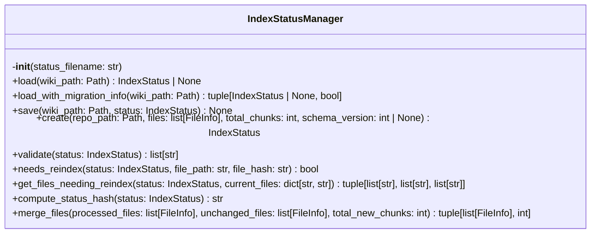

# File: `src/local_deepwiki/core/index_manager.py`

## File Overview

This file provides centralized management of index status for a wiki repository, including loading, saving, validation, and migration logic. It encapsulates the `IndexStatusManager` class and helper functions to ensure consistent handling of index metadata across the application.

The `IndexStatusManager` is responsible for persisting and retrieving index state information such as file lists, language statistics, and schema version. It supports migration of legacy index files to newer schema versions, ensuring backward compatibility.

## Key Concepts

### Index Status Management
The core abstraction is the [`IndexStatus`](../models/wiki.md) model, which represents the metadata of an indexed repository. The `IndexStatusManager` handles all operations related to this data, including atomic writes to prevent corruption and validation to ensure integrity.

### Atomic File Writes
To prevent data corruption during writes, the `save` method uses an atomic write pattern: it writes to a temporary file first and then renames it to the target file. This approach is robust against crashes or interruptions during file I/O.

### Schema Migration
The system supports schema versioning for index status files. The `_needs_migration` and `_migrate_status` functions handle upgrading older index files to the current schema. This ensures that the application can evolve its internal data format without breaking existing installations.

### Change Detection
The `compute_status_hash` function computes a SHA-256 hash of the index status, which can be used to detect changes in the index. This is useful for determining whether a wiki rebuild is necessary.

### File Change Tracking
The `needs_reindex` and `get_files_needing_reindex` methods allow for efficient incremental indexing by comparing current file hashes against those stored in the index status. This avoids full reindexing when only a few files have changed.

## Integration

This file integrates deeply with other components in the `local_deepwiki` system:

- **Models**: Uses [`FileInfo`](../models/chunks.md) and [`IndexStatus`](../models/wiki.md) from `local_deepwiki.models` to define and validate index metadata.
- **Logging**: Utilizes [`get_logger`](../logging.md) from `local_deepwiki.logging` for warning and info messages during index loading and migration.
- **CLI Components**: The `IndexStatusManager` is used by various CLI modules like `check_cli.py`, `status_cli.py`, and `main.py` to manage index state during operations.
- **Core Services**: It is used by the [`IndexingService`](../services/indexing_service.md) (in `src/local_deepwiki/core/indexer.py`) and [`VectorStore`](vectorstore/store.md) (in `src/local_deepwiki/core/vector_store.py`) to track index state and manage incremental updates.

The functions `_needs_migration` and `_migrate_status` are also tested via `test_index_manager` and `test_indexer_config`, indicating their role in maintaining compatibility and correctness across schema versions.

## Design Notes

### Why Centralized Index Management?
By centralizing index status management, the system avoids duplication of logic for loading, saving, and validating index data. This reduces the risk of inconsistencies and makes it easier to extend or modify how index state is handled.

### Handling Legacy Files
Legacy index files without a `schema_version` field are handled gracefully by defaulting to version 1. This allows the system to support older index files without requiring manual intervention.

### Validation and Error Handling
The `validate` method performs comprehensive checks to ensure index integrity, including:
- Consistency between `total_files` and the actual number of files
- Matching between `total_chunks` and the sum of chunk counts
- Validity of `repo_path` and `indexed_at`
- Presence of required fields like `hash` and `path` in [`FileInfo`](../models/chunks.md)

### Migration Idempotency
The migration logic in `_migrate_status` is designed to be idempotent. This means that running the migration multiple times on the same status will not cause issues, which is critical for robustness in production environments.

### Hash Computation for Change Detection
Using `json.dumps(..., sort_keys=True)` before hashing ensures that the same index status always produces the same hash, regardless of the order of keys in the dictionary. This is essential for reliable change detection.

### File Change Detection Efficiency
The `get_files_needing_reindex` method uses a dictionary lookup for efficient comparison between current and previous files. This avoids O(n²) comparisons and scales well with large numbers of files.

### Atomic Write Pattern
The atomic write mechanism in `save` ensures that even if the application crashes during a write, the index file will either be fully updated or remain in a consistent state, avoiding partial writes that could lead to corruption.

## API Reference

### class `IndexStatusManager`

Manages index status operations including load, save, create, and validate.  This class consolidates all index status management logic that was previously spread across [RepositoryIndexer](indexer.md) and handlers. It provides a single point of responsibility for: - Loading index status from manifest files - Saving index status to manifest files - Creating new index status instances - Validating index status integrity - Checking if files need reindexing

**Methods:**


<details>
<summary>View Source (lines 67-380) | <a href="https://github.com/UrbanDiver/local-deepwiki-mcp/blob/main/src/local_deepwiki/core/index_manager.py#L67-L380">GitHub</a></summary>

```python
class IndexStatusManager:
    # Methods: __init__, load, load_with_migration_info, save, create, validate, needs_reindex, get_files_needing_reindex, compute_status_hash, merge_files
```

</details>

#### `__init__`

```python
def __init__(status_filename: str = INDEX_STATUS_FILE)
```

Initialize the index status manager.


| Parameter | Type | Default | Description |
|-----------|------|---------|-------------|
| `status_filename` | `str` | `INDEX_STATUS_FILE` | Name of the index status file (default: index_status.json). |


<details>
<summary>View Source (lines 80-86) | <a href="https://github.com/UrbanDiver/local-deepwiki-mcp/blob/main/src/local_deepwiki/core/index_manager.py#L80-L86">GitHub</a></summary>

```python
def __init__(self, status_filename: str = INDEX_STATUS_FILE):
        """Initialize the index status manager.

        Args:
            status_filename: Name of the index status file (default: index_status.json).
        """
        self.status_filename = status_filename
```

</details>

#### `load`

```python
def load(wiki_path: Path) -> IndexStatus | None
```

Load index status from a wiki directory.  Handles legacy files without schema_version and performs migration if needed.


| Parameter | Type | Default | Description |
|-----------|------|---------|-------------|
| `wiki_path` | `Path` | - | Path to the wiki directory containing the index status file. |


<details>
<summary>View Source (lines 88-101) | <a href="https://github.com/UrbanDiver/local-deepwiki-mcp/blob/main/src/local_deepwiki/core/index_manager.py#L88-L101">GitHub</a></summary>

```python
def load(self, wiki_path: Path) -> IndexStatus | None:
        """Load index status from a wiki directory.

        Handles legacy files without schema_version and performs migration
        if needed.

        Args:
            wiki_path: Path to the wiki directory containing the index status file.

        Returns:
            IndexStatus if found and valid, None otherwise.
        """
        status, _ = self.load_with_migration_info(wiki_path)
        return status
```

</details>

#### `load_with_migration_info`

```python
def load_with_migration_info(wiki_path: Path) -> tuple[IndexStatus | None, bool]
```

Load index status and return migration information.


| Parameter | Type | Default | Description |
|-----------|------|---------|-------------|
| `wiki_path` | `Path` | - | Path to the wiki directory containing the index status file. |


<details>
<summary>View Source (lines 103-142) | <a href="https://github.com/UrbanDiver/local-deepwiki-mcp/blob/main/src/local_deepwiki/core/index_manager.py#L103-L142">GitHub</a></summary>

```python
def load_with_migration_info(
        self, wiki_path: Path
    ) -> tuple[IndexStatus | None, bool]:
        """Load index status and return migration information.

        Args:
            wiki_path: Path to the wiki directory containing the index status file.

        Returns:
            Tuple of (IndexStatus or None, requires_rebuild).
            requires_rebuild is True if the index should be fully rebuilt.
        """
        status_path = wiki_path / self.status_filename
        if not status_path.exists():
            return None, False

        try:
            with open(status_path) as f:
                data = json.load(f)

            # Handle legacy status files without schema_version
            if "schema_version" not in data:
                data["schema_version"] = 1

            status = IndexStatus.model_validate(data)

            # Check if migration is needed
            if _needs_migration(status):
                status, requires_rebuild = _migrate_status(status)
                # Save the migrated status
                self.save(wiki_path, status)
                return status, requires_rebuild

            return status, False
        except (json.JSONDecodeError, OSError, ValueError) as e:
            # json.JSONDecodeError: Corrupted or invalid JSON
            # OSError: File read issues
            # ValueError: Pydantic validation failure
            logger.warning("Failed to load index status from %s: %s", status_path, e)
            return None, False
```

</details>

#### `save`

```python
def save(wiki_path: Path, status: IndexStatus) -> None
```

Save index status to a wiki directory.  Creates the wiki directory if it doesn't exist.


| Parameter | Type | Default | Description |
|-----------|------|---------|-------------|
| `wiki_path` | `Path` | - | Path to the wiki directory. |
| `status` | `IndexStatus` | - | The IndexStatus to save. |


<details>
<summary>View Source (lines 144-166) | <a href="https://github.com/UrbanDiver/local-deepwiki-mcp/blob/main/src/local_deepwiki/core/index_manager.py#L144-L166">GitHub</a></summary>

```python
def save(self, wiki_path: Path, status: IndexStatus) -> None:
        """Save index status to a wiki directory.

        Creates the wiki directory if it doesn't exist.

        Args:
            wiki_path: Path to the wiki directory.
            status: The IndexStatus to save.
        """
        wiki_path.mkdir(parents=True, exist_ok=True)
        status_path = wiki_path / self.status_filename
        # Atomic write: write to temp file then rename to avoid corruption on crash
        tmp_path = status_path.with_suffix(".tmp")
        try:
            with open(tmp_path, "w") as f:
                json.dump(status.model_dump(), f, indent=2)
                f.flush()
            tmp_path.replace(status_path)
        except (OSError, TypeError, ValueError) as e:
            # OSError: File write/rename failures
            # TypeError/ValueError: JSON serialization issues (e.g., non-serializable data)
            tmp_path.unlink(missing_ok=True)
            raise
```

</details>

#### `create`

```python
def create(repo_path: Path, files: list[FileInfo], total_chunks: int, schema_version: int | None = None) -> IndexStatus
```

Create a new index status with calculated statistics.


| Parameter | Type | Default | Description |
|-----------|------|---------|-------------|
| `repo_path` | `Path` | - | Path to the repository being indexed. |
| `files` | `list[FileInfo]` | - | List of FileInfo objects for all indexed files. |
| `total_chunks` | `int` | - | Total number of chunks across all files. |
| `schema_version` | `int | None` | `None` | Optional schema version (defaults to CURRENT_SCHEMA_VERSION). |


<details>
<summary>View Source (lines 169-201) | <a href="https://github.com/UrbanDiver/local-deepwiki-mcp/blob/main/src/local_deepwiki/core/index_manager.py#L169-L201">GitHub</a></summary>

```python
def create(
        repo_path: Path,
        files: list[FileInfo],
        total_chunks: int,
        schema_version: int | None = None,
    ) -> IndexStatus:
        """Create a new index status with calculated statistics.

        Args:
            repo_path: Path to the repository being indexed.
            files: List of FileInfo objects for all indexed files.
            total_chunks: Total number of chunks across all files.
            schema_version: Optional schema version (defaults to CURRENT_SCHEMA_VERSION).

        Returns:
            A new IndexStatus instance with calculated language statistics.
        """
        # Calculate language statistics
        languages: dict[str, int] = {}
        for file_info in files:
            if file_info.language:
                lang = file_info.language.value
                languages[lang] = languages.get(lang, 0) + 1

        return IndexStatus(
            repo_path=str(repo_path),
            indexed_at=time.time(),
            total_files=len(files),
            total_chunks=total_chunks,
            languages=languages,
            files=files,
            schema_version=schema_version or CURRENT_SCHEMA_VERSION,
        )
```

</details>

#### `validate`

```python
def validate(status: IndexStatus) -> list[str]
```

Validate an index status and return a list of errors.  Checks for: - Valid repo_path - Positive indexed_at timestamp - Consistent file counts - Valid schema version - File integrity (hashes present, etc.)


| Parameter | Type | Default | Description |
|-----------|------|---------|-------------|
| `status` | `IndexStatus` | - | The IndexStatus to validate. |


<details>
<summary>View Source (lines 204-274) | <a href="https://github.com/UrbanDiver/local-deepwiki-mcp/blob/main/src/local_deepwiki/core/index_manager.py#L204-L274">GitHub</a></summary>

```python
def validate(status: IndexStatus) -> list[str]:
        """Validate an index status and return a list of errors.

        Checks for:
        - Valid repo_path
        - Positive indexed_at timestamp
        - Consistent file counts
        - Valid schema version
        - File integrity (hashes present, etc.)

        Args:
            status: The IndexStatus to validate.

        Returns:
            List of validation error messages. Empty list means valid.
        """
        errors: list[str] = []

        # Check repo_path
        if not status.repo_path:
            errors.append("repo_path is empty")
        elif not Path(status.repo_path).is_absolute():
            # repo_path should be absolute for clarity
            pass  # This is a warning, not an error

        # Check indexed_at timestamp
        if status.indexed_at <= 0:
            errors.append("indexed_at must be a positive timestamp")

        # Check file count consistency
        if status.total_files != len(status.files):
            errors.append(
                f"total_files ({status.total_files}) does not match "
                f"number of files ({len(status.files)})"
            )

        # Check chunk count consistency
        actual_chunks = sum(f.chunk_count for f in status.files)
        if status.total_chunks != actual_chunks:
            errors.append(
                f"total_chunks ({status.total_chunks}) does not match "
                f"sum of file chunk counts ({actual_chunks})"
            )

        # Check schema version
        if status.schema_version < 1:
            errors.append("schema_version must be at least 1")
        elif status.schema_version > CURRENT_SCHEMA_VERSION:
            errors.append(
                f"schema_version ({status.schema_version}) is newer than "
                f"current version ({CURRENT_SCHEMA_VERSION})"
            )

        # Check language statistics consistency
        language_counts: dict[str, int] = {}
        for file_info in status.files:
            if file_info.language:
                lang = file_info.language.value
                language_counts[lang] = language_counts.get(lang, 0) + 1

        if language_counts != status.languages:
            errors.append("languages statistics do not match file languages")

        # Check file integrity
        for file_info in status.files:
            if not file_info.hash:
                errors.append(f"File {file_info.path} is missing a content hash")
            if not file_info.path:
                errors.append("Found a file with empty path")

        return errors
```

</details>

#### `needs_reindex`

```python
def needs_reindex(status: IndexStatus, file_path: str, file_hash: str) -> bool
```

Check if a specific file needs reindexing.  Compares the current file hash with the stored hash to determine if the file has changed since last indexing.


| Parameter | Type | Default | Description |
|-----------|------|---------|-------------|
| `status` | `IndexStatus` | - | The current index status. |
| `file_path` | `str` | - | Relative path to the file from repo root. |
| `file_hash` | `str` | - | Current hash of the file content. |


<details>
<summary>View Source (lines 277-304) | <a href="https://github.com/UrbanDiver/local-deepwiki-mcp/blob/main/src/local_deepwiki/core/index_manager.py#L277-L304">GitHub</a></summary>

```python
def needs_reindex(
        status: IndexStatus,
        file_path: str,
        file_hash: str,
    ) -> bool:
        """Check if a specific file needs reindexing.

        Compares the current file hash with the stored hash to determine
        if the file has changed since last indexing.

        Args:
            status: The current index status.
            file_path: Relative path to the file from repo root.
            file_hash: Current hash of the file content.

        Returns:
            True if the file needs reindexing (new or changed), False otherwise.
        """
        # Build lookup map for efficient access
        files_by_path = {f.path: f for f in status.files}

        prev_file = files_by_path.get(file_path)
        if prev_file is None:
            # New file
            return True

        # File exists - check if hash changed
        return prev_file.hash != file_hash
```

</details>

#### `get_files_needing_reindex`

```python
def get_files_needing_reindex(status: IndexStatus, current_files: dict[str, str]) -> tuple[list[str], list[str], list[str]]
```

Get lists of files that need processing.  Compares current files with the index status to identify: - New files (not in previous index) - Modified files (hash changed) - Deleted files (in previous index but not in current)


| Parameter | Type | Default | Description |
|-----------|------|---------|-------------|
| `status` | `IndexStatus` | - | The current index status. |
| `current_files` | `dict[str, str]` | - | Dict mapping file paths to their current hashes. |


<details>
<summary>View Source (lines 307-343) | <a href="https://github.com/UrbanDiver/local-deepwiki-mcp/blob/main/src/local_deepwiki/core/index_manager.py#L307-L343">GitHub</a></summary>

```python
def get_files_needing_reindex(
        status: IndexStatus,
        current_files: dict[str, str],
    ) -> tuple[list[str], list[str], list[str]]:
        """Get lists of files that need processing.

        Compares current files with the index status to identify:
        - New files (not in previous index)
        - Modified files (hash changed)
        - Deleted files (in previous index but not in current)

        Args:
            status: The current index status.
            current_files: Dict mapping file paths to their current hashes.

        Returns:
            Tuple of (new_files, modified_files, deleted_files).
        """
        prev_files = {f.path: f.hash for f in status.files}

        new_files: list[str] = []
        modified_files: list[str] = []
        deleted_files: list[str] = []

        # Check current files
        for path, current_hash in current_files.items():
            if path not in prev_files:
                new_files.append(path)
            elif prev_files[path] != current_hash:
                modified_files.append(path)

        # Check for deleted files
        for path in prev_files:
            if path not in current_files:
                deleted_files.append(path)

        return new_files, modified_files, deleted_files
```

</details>

#### `compute_status_hash`

```python
def compute_status_hash(status: IndexStatus) -> str
```

Compute a hash of the index status for change detection.  This hash can be used to detect if the index has changed since last wiki generation.


| Parameter | Type | Default | Description |
|-----------|------|---------|-------------|
| `status` | `IndexStatus` | - | The IndexStatus to hash. |


<details>
<summary>View Source (lines 346-360) | <a href="https://github.com/UrbanDiver/local-deepwiki-mcp/blob/main/src/local_deepwiki/core/index_manager.py#L346-L360">GitHub</a></summary>

```python
def compute_status_hash(status: IndexStatus) -> str:
        """Compute a hash of the index status for change detection.

        This hash can be used to detect if the index has changed since
        last wiki generation.

        Args:
            status: The IndexStatus to hash.

        Returns:
            SHA-256 hex digest of the status.
        """
        return hashlib.sha256(
            json.dumps(status.model_dump(), sort_keys=True).encode()
        ).hexdigest()
```

</details>

#### `merge_files`

```python
def merge_files(processed_files: list[FileInfo], unchanged_files: list[FileInfo], total_new_chunks: int) -> tuple[list[FileInfo], int]
```

Merge processed files with unchanged files for final status.


| Parameter | Type | Default | Description |
|-----------|------|---------|-------------|
| `processed_files` | `list[FileInfo]` | - | Files that were newly processed. |
| `unchanged_files` | `list[FileInfo]` | - | Files that were unchanged from previous index. |
| `total_new_chunks` | `int` | - | Number of chunks from newly processed files. |


<details>
<summary>View Source (lines 363-380) | <a href="https://github.com/UrbanDiver/local-deepwiki-mcp/blob/main/src/local_deepwiki/core/index_manager.py#L363-L380">GitHub</a></summary>

```python
def merge_files(
        processed_files: list[FileInfo],
        unchanged_files: list[FileInfo],
        total_new_chunks: int,
    ) -> tuple[list[FileInfo], int]:
        """Merge processed files with unchanged files for final status.

        Args:
            processed_files: Files that were newly processed.
            unchanged_files: Files that were unchanged from previous index.
            total_new_chunks: Number of chunks from newly processed files.

        Returns:
            Tuple of (all_files, total_chunks).
        """
        all_files = processed_files + unchanged_files
        total_chunks = total_new_chunks + sum(f.chunk_count for f in unchanged_files)
        return all_files, total_chunks
```

</details>

## Class Diagram



## Call Graph

```mermaid
flowchart TD
    N0[IndexStatus]
    N1[IndexStatusManager.compute_...]
    N2[IndexStatusManager.create]
    N3[IndexStatusManager.load]
    N4[IndexStatusManager.load_wit...]
    N5[IndexStatusManager.save]
    N6[IndexStatusManager.validate]
    N7[Path]
    N8[_migrate_status]
    N9[_needs_migration]
    N10[dump]
    N11[dumps]
    N12[encode]
    N13[exists]
    N14[flush]
    N15[hexdigest]
    N16[is_absolute]
    N17[load]
    N18[load_with_migration_info]
    N19[mkdir]
    N20[model_dump]
    N21[model_validate]
    N22[save]
    N23[sha256]
    N24[time]
    N25[unlink]
    N26[with_suffix]
    N3 --> N18
    N4 --> N13
    N4 --> N17
    N4 --> N21
    N4 --> N9
    N4 --> N8
    N4 --> N22
    N5 --> N19
    N5 --> N26
    N5 --> N10
    N5 --> N20
    N5 --> N14
    N5 --> N25
    N2 --> N0
    N2 --> N24
    N6 --> N16
    N6 --> N7
    N1 --> N15
    N1 --> N23
    N1 --> N12
    N1 --> N11
    N1 --> N20
    classDef func fill:#e1f5fe
    class N0,N7,N8,N9,N10,N11,N12,N13,N14,N15,N16,N17,N18,N19,N20,N21,N22,N23,N24,N25,N26 func
    classDef method fill:#fff3e0
    class N1,N2,N3,N4,N5,N6 method
```



## Used By

Functions and methods in this file and their callers:

- **[`IndexStatus`](../models/wiki.md)**: called by `IndexStatusManager.create`
- **`Path`**: called by `IndexStatusManager.validate`
- **`_migrate_status`**: called by `IndexStatusManager.load_with_migration_info`
- **`_needs_migration`**: called by `IndexStatusManager.load_with_migration_info`
- **`dump`**: called by `IndexStatusManager.save`
- **`dumps`**: called by `IndexStatusManager.compute_status_hash`
- **`encode`**: called by `IndexStatusManager.compute_status_hash`
- **`exists`**: called by `IndexStatusManager.load_with_migration_info`
- **`flush`**: called by `IndexStatusManager.save`
- **`hexdigest`**: called by `IndexStatusManager.compute_status_hash`
- **`is_absolute`**: called by `IndexStatusManager.validate`
- **`load`**: called by `IndexStatusManager.load_with_migration_info`
- **`load_with_migration_info`**: called by `IndexStatusManager.load`
- **`mkdir`**: called by `IndexStatusManager.save`
- **`model_dump`**: called by `IndexStatusManager.compute_status_hash`, `IndexStatusManager.save`
- **`model_validate`**: called by `IndexStatusManager.load_with_migration_info`
- **`save`**: called by `IndexStatusManager.load_with_migration_info`
- **`sha256`**: called by `IndexStatusManager.compute_status_hash`
- **`time`**: called by `IndexStatusManager.create`
- **`unlink`**: called by `IndexStatusManager.save`
- **`with_suffix`**: called by `IndexStatusManager.save`

## Usage Examples

*Examples extracted from test files*

### Test that load returns None when status file doesn't exist

From `test_index_manager.py::TestIndexStatusManagerLoad::test_load_returns_none_when_file_missing`:

```python
manager = IndexStatusManager()
result = manager.load(tmp_path)
assert result is None
```

### Test that load returns None when status file doesn't exist

From `test_index_manager.py::TestIndexStatusManagerLoad::test_load_returns_none_when_file_missing`:

```python
manager = IndexStatusManager()
result = manager.load(tmp_path)
assert result is None
```

### Test that load returns a valid IndexStatus from file

From `test_index_manager.py::TestIndexStatusManagerLoad::test_load_returns_valid_status`:

```python
manager = IndexStatusManager()

status_data = {
    "repo_path": "/test/repo",
    "indexed_at": 1234567890.0,
    "total_files": 5,
    "total_chunks": 50,
    "languages": {"python": 5},
    "files": [],
    "schema_version": CURRENT_SCHEMA_VERSION,
}
status_path = tmp_path / INDEX_STATUS_FILE
status_path.write_text(json.dumps(status_data))

result = manager.load(tmp_path)

assert result is not None
assert result.repo_path == "/test/repo"
```

### Test that load returns a valid IndexStatus from file

From `test_index_manager.py::TestIndexStatusManagerLoad::test_load_returns_valid_status`:

```python
manager = IndexStatusManager()

status_data = {
    "repo_path": "/test/repo",
    "indexed_at": 1234567890.0,
    "total_files": 5,
    "total_chunks": 50,
    "languages": {"python": 5},
    "files": [],
    "schema_version": CURRENT_SCHEMA_VERSION,
}
status_path = tmp_path / INDEX_STATUS_FILE
status_path.write_text(json.dumps(status_data))

result = manager.load(tmp_path)

assert result is not None
assert result.repo_path == "/test/repo"
assert result.total_files == 5
assert result.total_chunks == 50
```

### Test that load_with_migration_info returns (None, False) when missing

From `test_index_manager.py::TestIndexStatusManagerLoadWithMigrationInfo::test_load_with_migration_info_returns_none_when_missing`:

```python
manager = IndexStatusManager()
status, requires_rebuild = manager.load_with_migration_info(tmp_path)

assert status is None
assert requires_rebuild is False
```


## Last Modified

| Entity | Type | Author | Date | Commit |
|--------|------|--------|------|--------|
| `IndexStatusManager` | class | Brian Breidenbach | Feb 21, 2026 | `e45a53a` refactor: apply Pythonic id... |
| `save` | method | Brian Breidenbach | Feb 21, 2026 | `e45a53a` refactor: apply Pythonic id... |
| `validate` | method | Brian Breidenbach | Feb 20, 2026 | `6be69f5` refactor: low-priority Pyth... |
| `compute_status_hash` | method | Brian Breidenbach | Feb 20, 2026 | `6be69f5` refactor: low-priority Pyth... |
| `load_with_migration_info` | method | Brian Breidenbach | Feb 11, 2026 | `ba96da1` fix: publication plan P0-P2... |
| `__init__` | method | Brian Breidenbach | Jan 26, 2026 | `d7c79d3` Add three quick-win enhance... |
| `load` | method | Brian Breidenbach | Jan 26, 2026 | `d7c79d3` Add three quick-win enhance... |
| `create` | method | Brian Breidenbach | Jan 26, 2026 | `d7c79d3` Add three quick-win enhance... |
| `needs_reindex` | method | Brian Breidenbach | Jan 26, 2026 | `d7c79d3` Add three quick-win enhance... |
| `get_files_needing_reindex` | method | Brian Breidenbach | Jan 26, 2026 | `d7c79d3` Add three quick-win enhance... |
| `merge_files` | method | Brian Breidenbach | Jan 26, 2026 | `d7c79d3` Add three quick-win enhance... |
| `_needs_migration` | function | Brian Breidenbach | Jan 26, 2026 | `d7c79d3` Add three quick-win enhance... |
| `_migrate_status` | function | Brian Breidenbach | Jan 26, 2026 | `d7c79d3` Add three quick-win enhance... |

## Additional Source Code

Source code for functions and methods not listed in the API Reference above.

#### `_needs_migration`

<details>
<summary>View Source (lines 25-34) | <a href="https://github.com/UrbanDiver/local-deepwiki-mcp/blob/main/src/local_deepwiki/core/index_manager.py#L25-L34">GitHub</a></summary>

```python
def _needs_migration(status: IndexStatus) -> bool:
    """Check if an index status needs migration to the current schema version.

    Args:
        status: The loaded index status.

    Returns:
        True if the schema version is older than current and needs migration.
    """
    return status.schema_version < CURRENT_SCHEMA_VERSION
```

</details>


#### `_migrate_status`

<details>
<summary>View Source (lines 37-64) | <a href="https://github.com/UrbanDiver/local-deepwiki-mcp/blob/main/src/local_deepwiki/core/index_manager.py#L37-L64">GitHub</a></summary>

```python
def _migrate_status(status: IndexStatus) -> tuple[IndexStatus, bool]:
    """Migrate an index status to the current schema version.

    This function handles migrations between schema versions. Each migration
    step should be idempotent and handle the transition from version N to N+1.

    Args:
        status: The index status to migrate.

    Returns:
        Tuple of (migrated status, requires_rebuild).
        requires_rebuild is True if the vector store needs to be rebuilt.
    """
    requires_rebuild = False
    current_version = status.schema_version

    # Migration from version 1 to 2
    # Version 2 added scalar indexes - the index data is compatible but
    # indexes need to be created (handled by _ensure_scalar_indexes in VectorStore)
    if current_version < 2:
        logger.info("Migrating index status from schema version 1 to 2")
        # No data migration needed - indexes are created on table open
        current_version = 2

    # Update schema version
    status.schema_version = current_version

    return status, requires_rebuild
```

</details>

## Relevant Source Files

- `src/local_deepwiki/core/index_manager.py:67-380`
