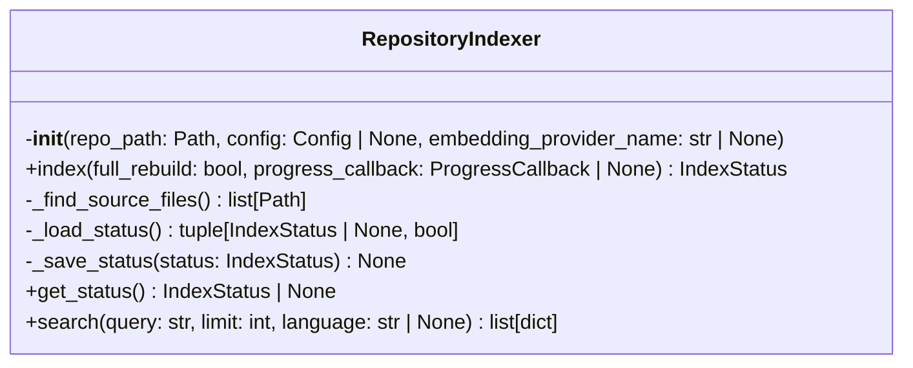

# indexer.py

## File Overview

The `indexer.py` module provides repository indexing functionality for the local_deepwiki system. It handles the process of parsing, chunking, and vectorizing code files to create searchable indexes. The module includes migration capabilities for handling changes to the indexing format over time.

## Classes

### RepositoryIndexer

The RepositoryIndexer class manages the indexing process for code repositories, coordinating between parsing, chunking, and vector storage components.

**Key Dependencies:**
- [CodeParser](parser.md) for parsing source code files
- [CodeChunker](chunker.md) for breaking code into manageable chunks
- [VectorStore](vectorstore.md) for storing and retrieving vectorized code representations
- Embedding providers for generating vector representations

## Functions

### _needs_migration

Determines whether the existing index requires migration to a newer format.

**Parameters:**
- Based on the code structure, this function likely takes parameters related to index status checking

**Returns:**
- Boolean indicating whether migration is needed

### _migrate_status

Handles the migration of index status data to newer formats.

**Parameters:**
- Based on the code structure, this function likely takes parameters related to status migration

**Returns:**
- Updated status information after migration

## Related Components

This module integrates with several other components of the local_deepwiki system:

- **[Config](../config.md)**: Uses configuration management through the [Config](../config.md) class and [get_config](../config.md) function
- **[CodeChunker](chunker.md)**: Breaks parsed code into chunks suitable for vectorization
- **[CodeParser](parser.md)**: Handles parsing of various programming languages
- **[VectorStore](vectorstore.md)**: Manages storage and retrieval of vectorized code representations
- **Embedding Providers**: Generates vector embeddings for code chunks
- **Models**: Uses data models including [CodeChunk](../models.md), [FileInfo](../models.md), [IndexStatus](../models.md), and [ProgressCallback](../models.md)
- **Logging**: Integrates with the logging system for operation tracking

## Usage Context

The indexer module serves as a central coordination point for the indexing pipeline, managing the flow from raw source code files through parsing, chunking, and vectorization to create searchable indexes. It includes built-in migration support to handle evolving index formats and maintains progress tracking through callback mechanisms.

The module uses file pattern matching through `fnmatch` for selective file processing and includes JSON serialization capabilities for persisting index metadata and status information.

## API Reference

### class `RepositoryIndexer`

Orchestrates repository indexing with incremental update support.

**Methods:**


<details>
<summary>View Source (lines 68-396)</summary>

```python
class RepositoryIndexer:
    # Methods: __init__, index, _find_source_files, _load_status, _save_status, get_status, search
```

</details>

#### `__init__`

```python
def __init__(repo_path: Path, config: Config | None = None, embedding_provider_name: str | None = None)
```

Initialize the indexer.


| [Parameter](../generators/api_docs.md) | Type | Default | Description |
|-----------|------|---------|-------------|
| `repo_path` | `Path` | - | Path to the repository root. |
| `config` | `Config | None` | `None` | Optional configuration. |
| `embedding_provider_name` | `str | None` | `None` | Override embedding provider ("local" or "openai"). |


<details>
<summary>View Source (lines 73-99)</summary>

```python
def __init__(
        self,
        repo_path: Path,
        config: Config | None = None,
        embedding_provider_name: str | None = None,
    ):
        """Initialize the indexer.

        Args:
            repo_path: Path to the repository root.
            config: Optional configuration.
            embedding_provider_name: Override embedding provider ("local" or "openai").
        """
        self.repo_path = repo_path.resolve()
        self.config = config or get_config()

        # Override embedding provider if specified
        if embedding_provider_name:
            self.config.embedding.provider = embedding_provider_name  # type: ignore

        self.wiki_path = self.config.get_wiki_path(self.repo_path)
        self.vector_db_path = self.config.get_vector_db_path(self.repo_path)

        self.parser = CodeParser()
        self.chunker = CodeChunker(self.config.chunking)
        self.embedding_provider = get_embedding_provider(self.config.embedding)
        self.vector_store = VectorStore(self.vector_db_path, self.embedding_provider)
```

</details>

#### `index`

```python
async def index(full_rebuild: bool = False, progress_callback: ProgressCallback | None = None) -> IndexStatus
```

Index the repository.


| [Parameter](../generators/api_docs.md) | Type | Default | Description |
|-----------|------|---------|-------------|
| `full_rebuild` | `bool` | `False` | If True, rebuild entire index. Otherwise, incremental update. |
| [`progress_callback`](../watcher.md) | `ProgressCallback | None` | `None` | Optional callback for progress updates (message, current, total). |


<details>
<summary>View Source (lines 101-269)</summary>

```python
async def index(
        self,
        full_rebuild: bool = False,
        progress_callback: ProgressCallback | None = None,
    ) -> IndexStatus:
        """Index the repository.

        Args:
            full_rebuild: If True, rebuild entire index. Otherwise, incremental update.
            progress_callback: Optional callback for progress updates (message, current, total).

        Returns:
            IndexStatus with indexing results.
        """
        # Ensure wiki directory exists
        self.wiki_path.mkdir(parents=True, exist_ok=True)

        logger.info(f"Starting indexing for repository: {self.repo_path}")
        logger.debug(f"Wiki path: {self.wiki_path}, Full rebuild: {full_rebuild}")

        # Load previous status for incremental updates
        previous_status = None
        if not full_rebuild:
            previous_status, requires_rebuild = self._load_status()
            if requires_rebuild:
                logger.info("Schema migration requires full rebuild")
                full_rebuild = True
                previous_status = None

        if previous_status:
            logger.debug(f"Loaded previous index status: {previous_status.total_files} files")

        # Find all source files
        source_files = list(self._find_source_files())
        logger.info(f"Found {len(source_files)} source files to consider")

        if progress_callback:
            progress_callback("Found source files", len(source_files), len(source_files))

        # Determine which files need processing
        files_to_process: list[Path] = []
        files_unchanged: list[FileInfo] = []

        for file_path in source_files:
            file_info = self.parser.get_file_info(file_path, self.repo_path)

            if previous_status and not full_rebuild:
                # Check if file has changed
                prev_file = next(
                    (f for f in previous_status.files if f.path == file_info.path), None
                )
                if prev_file and prev_file.hash == file_info.hash:
                    files_unchanged.append(prev_file)
                    continue

            files_to_process.append(file_path)

        if progress_callback:
            progress_callback(
                f"Processing {len(files_to_process)} files ({len(files_unchanged)} unchanged)",
                0,
                len(files_to_process),
            )

        # Process files and collect chunks in batches for memory efficiency
        batch_size = self.config.chunking.batch_size
        chunk_batch: list[CodeChunk] = []
        processed_files: list[FileInfo] = []
        total_chunks_processed = 0
        is_first_batch = True

        for i, file_path in enumerate(files_to_process):
            if progress_callback:
                progress_callback(f"Parsing {file_path.name}", i, len(files_to_process))

            try:
                # Get file info
                file_info = self.parser.get_file_info(file_path, self.repo_path)

                # If incremental, delete old chunks for this file before adding new ones
                if not full_rebuild and previous_status:
                    await self.vector_store.delete_chunks_by_file(file_info.path)

                # Extract chunks
                chunks = list(self.chunker.chunk_file(file_path, self.repo_path))
                file_info.chunk_count = len(chunks)

                chunk_batch.extend(chunks)
                processed_files.append(file_info)

                # Process batch if it reaches the batch size
                if len(chunk_batch) >= batch_size:
                    if progress_callback:
                        progress_callback(
                            f"Storing batch of {len(chunk_batch)} chunks...",
                            i,
                            len(files_to_process),
                        )

                    if full_rebuild and is_first_batch:
                        await self.vector_store.create_or_update_table(chunk_batch)
                        is_first_batch = False
                    else:
                        await self.vector_store.add_chunks(chunk_batch)

                    total_chunks_processed += len(chunk_batch)
                    chunk_batch = []  # Clear batch to free memory

            except (OSError, ValueError, RuntimeError, UnicodeDecodeError) as e:
                # OSError: File read/write issues
                # ValueError: Parsing or chunking errors
                # RuntimeError: Vector store operation failures
                # UnicodeDecodeError: File encoding issues
                # Log error but continue with other files
                logger.warning(f"Error processing {file_path}: {e}")
                if progress_callback:
                    progress_callback(
                        f"Error processing {file_path}: {e}", i, len(files_to_process)
                    )

        # Process any remaining chunks in the final batch
        if chunk_batch:
            if progress_callback:
                progress_callback(
                    f"Storing final batch of {len(chunk_batch)} chunks...",
                    len(files_to_process),
                    len(files_to_process),
                )

            if full_rebuild and is_first_batch:
                await self.vector_store.create_or_update_table(chunk_batch)
            else:
                await self.vector_store.add_chunks(chunk_batch)

            total_chunks_processed += len(chunk_batch)

        # Combine processed and unchanged files
        all_files = processed_files + files_unchanged

        # Calculate language statistics
        languages: dict[str, int] = {}
        for file_info in all_files:
            if file_info.language:
                lang = file_info.language.value
                languages[lang] = languages.get(lang, 0) + 1

        # Create status with current schema version
        status = IndexStatus(
            repo_path=str(self.repo_path),
            indexed_at=time.time(),
            total_files=len(all_files),
            total_chunks=total_chunks_processed + sum(f.chunk_count for f in files_unchanged),
            languages=languages,
            files=all_files,
            schema_version=CURRENT_SCHEMA_VERSION,
        )

        # Save status
        self._save_status(status)

        logger.info(
            f"Indexing complete: {status.total_files} files, "
            f"{status.total_chunks} chunks, languages: {list(status.languages.keys())}"
        )

        if progress_callback:
            progress_callback("Indexing complete", 1, 1)

        return status
```

</details>

#### `get_status`

```python
def get_status() -> IndexStatus | None
```

Get the current indexing status.


<details>
<summary>View Source (lines 356-363)</summary>

```python
def get_status(self) -> IndexStatus | None:
        """Get the current indexing status.

        Returns:
            IndexStatus or None if not indexed.
        """
        status, _ = self._load_status()
        return status
```

</details>

#### `search`

```python
async def search(query: str, limit: int = 10, language: str | None = None) -> list[dict]
```

Search the indexed repository.


| [Parameter](../generators/api_docs.md) | Type | Default | Description |
|-----------|------|---------|-------------|
| `query` | `str` | - | Search query. |
| `limit` | `int` | `10` | Maximum results. |
| `language` | `str | None` | `None` | Optional language filter. |


<details>
<summary>View Source (lines 365-396)</summary>

```python
async def search(
        self,
        query: str,
        limit: int = 10,
        language: str | None = None,
    ) -> list[dict]:
        """Search the indexed repository.

        Args:
            query: Search query.
            limit: Maximum results.
            language: Optional language filter.

        Returns:
            List of search result dictionaries.
        """
        results = await self.vector_store.search(query, limit=limit, language=language)
        return [
            {
                "file_path": r.chunk.file_path,
                "name": r.chunk.name,
                "type": r.chunk.chunk_type.value,
                "language": r.chunk.language.value,
                "lines": f"{r.chunk.start_line}-{r.chunk.end_line}",
                "score": r.score,
                "content": (
                    r.chunk.content[:500] + "..." if len(r.chunk.content) > 500 else r.chunk.content
                ),
                "docstring": r.chunk.docstring,
            }
            for r in results
        ]
```

</details>

## Class Diagram



## Call Graph

```mermaid
flowchart TD
    N0[CodeChunker]
    N1[CodeParser]
    N2[IndexStatus]
    N3[RepositoryIndexer.__init__]
    N4[RepositoryIndexer._find_sou...]
    N5[RepositoryIndexer._load_status]
    N6[RepositoryIndexer._save_status]
    N7[RepositoryIndexer.index]
    N8[VectorStore]
    N9[_find_source_files]
    N10[_load_status]
    N11[_save_status]
    N12[add_chunks]
    N13[chunk_file]
    N14[create_or_update_table]
    N15[delete_chunks_by_file]
    N16[fnmatch]
    N17[get_config]
    N18[get_embedding_provider]
    N19[get_file_info]
    N20[get_vector_db_path]
    N21[get_wiki_path]
    N22[is_file]
    N23[mkdir]
    N24[progress_callback]
    N25[relative_to]
    N26[resolve]
    N27[rglob]
    N28[stat]
    N29[time]
    N3 --> N26
    N3 --> N17
    N3 --> N21
    N3 --> N20
    N3 --> N1
    N3 --> N0
    N3 --> N18
    N3 --> N8
    N7 --> N23
    N7 --> N10
    N7 --> N9
    N7 --> N24
    N7 --> N19
    N7 --> N15
    N7 --> N13
    N7 --> N14
    N7 --> N12
    N7 --> N2
    N7 --> N29
    N7 --> N11
    N4 --> N27
    N4 --> N22
    N4 --> N25
    N4 --> N16
    N4 --> N28
    N5 --> N11
    classDef func fill:#e1f5fe
    class N0,N1,N2,N8,N9,N10,N11,N12,N13,N14,N15,N16,N17,N18,N19,N20,N21,N22,N23,N24,N25,N26,N27,N28,N29 func
    classDef method fill:#fff3e0
    class N3,N4,N5,N6,N7 method
```



## Usage Examples

*Examples extracted from test files*

### Test that old schema versions need migration

From `test_indexer.py::test_needs_migration_old_version`:

```python
indexed_at=1.0,
    total_files=10,
    total_chunks=100,
    schema_version=1,
)
# If current version is > 1, migration is needed
if CURRENT_SCHEMA_VERSION > 1:
    assert _needs_migration(status) is True
```

### Test that old schema versions need migration

From `test_indexer.py::test_needs_migration_old_version`:

```python
assert _needs_migration(status) is True
```

### Test that current schema version doesn't need migration

From `test_indexer.py::test_needs_migration_current_version`:

```python
indexed_at=1.0,
    total_files=10,
    total_chunks=100,
    schema_version=CURRENT_SCHEMA_VERSION,
)
assert _needs_migration(status) is False
```

### Test that current schema version doesn't need migration

From `test_indexer.py::test_needs_migration_current_version`:

```python
assert _needs_migration(status) is False
```

### Test that migration updates the schema version

From `test_indexer.py::test_migrate_status_updates_version`:

```python
migrated, requires_rebuild = _migrate_status(status)
assert migrated.schema_version == CURRENT_SCHEMA_VERSION
```


## Additional Source Code

Source code for functions and methods not listed in the API Reference above.

#### `_needs_migration`

<details>
<summary>View Source (lines 26-35)</summary>

```python
def _needs_migration(status: IndexStatus) -> bool:
    """Check if an index status needs migration to the current schema version.

    Args:
        status: The loaded index status.

    Returns:
        True if the schema version is older than current and needs migration.
    """
    return status.schema_version < CURRENT_SCHEMA_VERSION
```

</details>


#### `_migrate_status`

<details>
<summary>View Source (lines 38-65)</summary>

```python
def _migrate_status(status: IndexStatus) -> tuple[IndexStatus, bool]:
    """Migrate an index status to the current schema version.

    This function handles migrations between schema versions. Each migration
    step should be idempotent and handle the transition from version N to N+1.

    Args:
        status: The index status to migrate.

    Returns:
        Tuple of (migrated status, requires_rebuild).
        requires_rebuild is True if the vector store needs to be rebuilt.
    """
    requires_rebuild = False
    current_version = status.schema_version

    # Migration from version 1 to 2
    # Version 2 added scalar indexes - the index data is compatible but
    # indexes need to be created (handled by _ensure_scalar_indexes in VectorStore)
    if current_version < 2:
        logger.info("Migrating index status from schema version 1 to 2")
        # No data migration needed - indexes are created on table open
        current_version = 2

    # Update schema version
    status.schema_version = current_version

    return status, requires_rebuild
```

</details>


#### `_find_source_files`

<details>
<summary>View Source (lines 271-308)</summary>

```python
def _find_source_files(self) -> list[Path]:
        """Find all source files in the repository.

        Yields:
            Paths to source files.
        """
        files = []
        exclude_patterns = self.config.parsing.exclude_patterns
        max_size = self.config.parsing.max_file_size

        for file_path in self.repo_path.rglob("*"):
            if not file_path.is_file():
                continue

            # Check against exclude patterns
            rel_path = str(file_path.relative_to(self.repo_path))
            if any(fnmatch.fnmatch(rel_path, pattern) for pattern in exclude_patterns):
                continue

            # Check file size
            try:
                if file_path.stat().st_size > max_size:
                    continue
            except OSError:
                continue

            # Check if language is supported
            language = self.parser.detect_language(file_path)
            if language is None:
                continue

            # Check if language is in configured list
            if language.value not in self.config.parsing.languages:
                continue

            files.append(file_path)

        return files
```

</details>


#### `_load_status`

<details>
<summary>View Source (lines 310-344)</summary>

```python
def _load_status(self) -> tuple[IndexStatus | None, bool]:
        """Load previous indexing status and check for migration needs.

        Returns:
            Tuple of (IndexStatus or None, requires_rebuild).
            requires_rebuild is True if the index should be fully rebuilt.
        """
        status_path = self.wiki_path / self.INDEX_STATUS_FILE
        if not status_path.exists():
            return None, False

        try:
            with open(status_path) as f:
                data = json.load(f)

            # Handle legacy status files without schema_version
            if "schema_version" not in data:
                data["schema_version"] = 1

            status = IndexStatus.model_validate(data)

            # Check if migration is needed
            if _needs_migration(status):
                status, requires_rebuild = _migrate_status(status)
                # Save the migrated status
                self._save_status(status)
                return status, requires_rebuild

            return status, False
        except (json.JSONDecodeError, OSError, ValueError) as e:
            # json.JSONDecodeError: Corrupted or invalid JSON
            # OSError: File read issues
            # ValueError: Pydantic validation failure
            logger.warning(f"Failed to load index status from {status_path}: {e}")
            return None, False
```

</details>


#### `_save_status`

<details>
<summary>View Source (lines 346-354)</summary>

```python
def _save_status(self, status: IndexStatus) -> None:
        """Save indexing status.

        Args:
            status: The IndexStatus to save.
        """
        status_path = self.wiki_path / self.INDEX_STATUS_FILE
        with open(status_path, "w") as f:
            json.dump(status.model_dump(), f, indent=2)
```

</details>

## Relevant Source Files

- `src/local_deepwiki/core/indexer.py:68-396`
