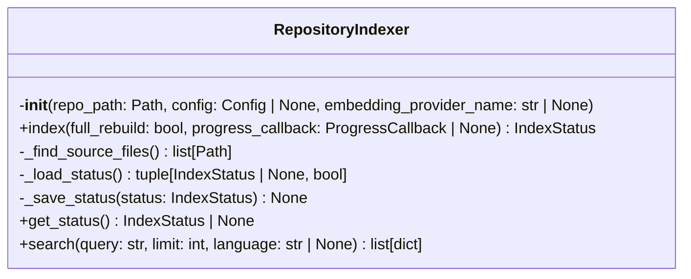

# indexer.py

## File Overview

The indexer module provides repository indexing functionality for the local_deepwiki system. It handles the process of scanning, parsing, and vectorizing code files in a repository to enable semantic search and documentation generation.

## Classes

### RepositoryIndexer

The RepositoryIndexer class manages the complete indexing workflow for a code repository. It coordinates file scanning, parsing, chunking, and vector storage operations while providing progress tracking and status management.

**Key Responsibilities:**
- Scanning repository files based on configuration patterns
- Parsing code files into structured representations
- Breaking code into semantic chunks for processing
- Generating and storing vector embeddings
- Managing indexing status and progress tracking
- Handling incremental updates and migrations

**Dependencies:**
- Works with [CodeParser](parser.md) for file parsing
- Uses [CodeChunker](chunker.md) for breaking code into chunks
- Integrates with [VectorStore](vectorstore.md) for embedding storage
- Utilizes embedding providers for vector generation
- Manages [FileInfo](../models.md) and [IndexStatus](../models.md) models

## Functions

### _needs_migration

Determines whether the indexing system requires migration based on stored metadata.

**Parameters:**
- Takes parameters related to migration checking (specific signature not fully visible)

**Returns:**
- Boolean indicating if migration is needed

### _migrate_status

Handles the migration of indexing status data to newer formats or schemas.

**Parameters:**
- Takes parameters for status migration (specific signature not fully visible)

**Returns:**
- Migration result (specific return type not fully visible)

## Related Components

The indexer module integrates with several other components:

- **[Config](../config.md)**: Uses configuration settings to determine indexing behavior
- **[CodeParser](parser.md)**: Parses individual code files into structured format
- **[CodeChunker](chunker.md)**: Breaks parsed code into semantic chunks
- **[VectorStore](vectorstore.md)**: Stores and manages vector embeddings
- **[CodeChunk](../models.md)**: Represents individual code chunks
- **[FileInfo](../models.md)**: Stores metadata about indexed files
- **[IndexStatus](../models.md)**: Tracks indexing progress and status
- **[ProgressCallback](../models.md)**: Provides progress reporting interface

## Usage Context

The RepositoryIndexer serves as the central orchestrator for the indexing pipeline, coordinating between parsing, chunking, and vector storage components to build a searchable index of repository code. It provides progress tracking through Rich progress bars and maintains persistent status information for incremental updates.

## API Reference

### class `RepositoryIndexer`

Orchestrates repository indexing with incremental update support.

**Methods:**

#### `__init__`

```python
def __init__(repo_path: Path, config: Config | None = None, embedding_provider_name: str | None = None)
```

Initialize the indexer.


| [Parameter](../generators/api_docs.md) | Type | Default | Description |
|-----------|------|---------|-------------|
| `repo_path` | `Path` | - | Path to the repository root. |
| `config` | `Config | None` | `None` | Optional configuration. |
| `embedding_provider_name` | `str | None` | `None` | Override embedding provider ("local" or "openai"). |

#### `index`

```python
async def index(full_rebuild: bool = False, progress_callback: ProgressCallback | None = None) -> IndexStatus
```

Index the repository.


| [Parameter](../generators/api_docs.md) | Type | Default | Description |
|-----------|------|---------|-------------|
| `full_rebuild` | `bool` | `False` | If True, rebuild entire index. Otherwise, incremental update. |
| [`progress_callback`](../handlers.md) | `ProgressCallback | None` | `None` | Optional callback for progress updates (message, current, total). |

#### `get_status`

```python
def get_status() -> IndexStatus | None
```

Get the current indexing status.

#### `search`

```python
async def search(query: str, limit: int = 10, language: str | None = None) -> list[dict]
```

Search the indexed repository.


| [Parameter](../generators/api_docs.md) | Type | Default | Description |
|-----------|------|---------|-------------|
| `query` | `str` | - | Search query. |
| `limit` | `int` | `10` | Maximum results. |
| `language` | `str | None` | `None` | Optional language filter. |


## Class Diagram



## Call Graph

```mermaid
flowchart TD
    N0[CodeChunker]
    N1[CodeParser]
    N2[IndexStatus]
    N3[RepositoryIndexer.__init__]
    N4[RepositoryIndexer._find_sou...]
    N5[RepositoryIndexer._load_status]
    N6[RepositoryIndexer._save_status]
    N7[RepositoryIndexer.index]
    N8[VectorStore]
    N9[_find_source_files]
    N10[_load_status]
    N11[_save_status]
    N12[add_chunks]
    N13[chunk_file]
    N14[create_or_update_table]
    N15[delete_chunks_by_file]
    N16[fnmatch]
    N17[get_config]
    N18[get_embedding_provider]
    N19[get_file_info]
    N20[get_vector_db_path]
    N21[get_wiki_path]
    N22[is_file]
    N23[mkdir]
    N24[progress_callback]
    N25[relative_to]
    N26[resolve]
    N27[rglob]
    N28[stat]
    N29[time]
    N3 --> N26
    N3 --> N17
    N3 --> N21
    N3 --> N20
    N3 --> N1
    N3 --> N0
    N3 --> N18
    N3 --> N8
    N7 --> N23
    N7 --> N10
    N7 --> N9
    N7 --> N24
    N7 --> N19
    N7 --> N15
    N7 --> N13
    N7 --> N14
    N7 --> N12
    N7 --> N2
    N7 --> N29
    N7 --> N11
    N4 --> N27
    N4 --> N22
    N4 --> N25
    N4 --> N16
    N4 --> N28
    N5 --> N11
    classDef func fill:#e1f5fe
    class N0,N1,N2,N8,N9,N10,N11,N12,N13,N14,N15,N16,N17,N18,N19,N20,N21,N22,N23,N24,N25,N26,N27,N28,N29 func
    classDef method fill:#fff3e0
    class N3,N4,N5,N6,N7 method
```



## Usage Examples

*Examples extracted from test files*

### Test that old schema versions need migration

From `test_indexer.py::test_needs_migration_old_version`:

```python
indexed_at=1.0,
    total_files=10,
    total_chunks=100,
    schema_version=1,
)
# If current version is > 1, migration is needed
if CURRENT_SCHEMA_VERSION > 1:
    assert _needs_migration(status) is True
```

### Test that old schema versions need migration

From `test_indexer.py::test_needs_migration_old_version`:

```python
assert _needs_migration(status) is True
```

### Test that current schema version doesn't need migration

From `test_indexer.py::test_needs_migration_current_version`:

```python
indexed_at=1.0,
    total_files=10,
    total_chunks=100,
    schema_version=CURRENT_SCHEMA_VERSION,
)
assert _needs_migration(status) is False
```

### Test that current schema version doesn't need migration

From `test_indexer.py::test_needs_migration_current_version`:

```python
assert _needs_migration(status) is False
```

### Test that migration updates the schema version

From `test_indexer.py::test_migrate_status_updates_version`:

```python
migrated, requires_rebuild = _migrate_status(status)
assert migrated.schema_version == CURRENT_SCHEMA_VERSION
```

## Relevant Source Files

- `src/local_deepwiki/core/indexer.py:70-391`
