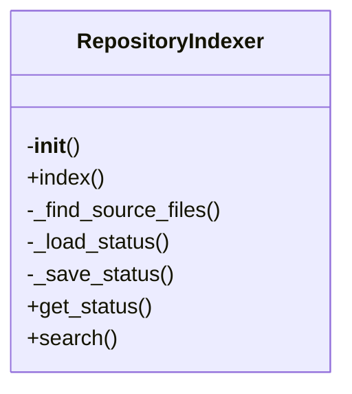

# local_deepwiki.core.indexer

## File Overview

The `indexer.py` file implements the core indexing functionality for the local_deepwiki system. It provides the main `RepositoryIndexer` class responsible for processing code repositories, parsing source files, chunking code into manageable pieces, and storing vector representations for semantic search capabilities.

## Classes

### RepositoryIndexer

The `RepositoryIndexer` class orchestrates the entire indexing process for a code repository. It handles file discovery, parsing, chunking, and vector storage operations.

#### Key Methods

- `__init__(self, config: Config = None)`: Initializes the indexer with optional configuration
- `index_repository(self, progress_callback: Callable[[str, int], None] = None)`: Main method to index an entire repository
- `process_file(self, file_path: Path, progress: Progress, task_id: TaskID)`: Processes individual files
- `chunk_file(self, file_info: FileInfo) -> list[CodeChunk]`: Splits files into code chunks
- `store_chunks(self, chunks: list[CodeChunk])`: Stores chunks in vector database

#### Usage Example

```python
from local_deepwiki.core.indexer import RepositoryIndexer

# Initialize indexer
indexer = RepositoryIndexer()

# Index repository with progress tracking
indexer.index_repository()
```

## Functions

### index_repository

**Signature**: `index_repository(self, progress_callback: Callable[[str, int], None] = None)`

**Parameters**:
- `progress_callback`: Optional function to track indexing progress with (message, percentage) parameters

**Returns**: None

**Purpose**: Main entry point for repository indexing. Discovers files, processes each file through parsing and chunking, then stores vectors in the database.

### process_file

**Signature**: `process_file(self, file_path: Path, progress: Progress, task_id: TaskID)`

**Parameters**:
- `file_path`: Path to the source file to process
- `progress`: Rich progress tracking object
- `task_id`: Task identifier for progress tracking

**Returns**: None

**Purpose**: Processes individual files by parsing them, creating code chunks, and storing them in the vector database.

### chunk_file

**Signature**: `chunk_file(self, file_info: FileInfo) -> list[CodeChunk]`

**Parameters**:
- `file_info`: FileInfo object containing file metadata and content

**Returns**: List of CodeChunk objects representing the file's content

**Purpose**: Splits a parsed file into logical code chunks suitable for vector storage and semantic search.

### store_chunks

**Signature**: `store_chunks(self, chunks: list[CodeChunk])`

**Parameters**:
- `chunks`: List of CodeChunk objects to store

**Returns**: None

**Purpose**: Stores code chunks in the vector database with their corresponding embeddings.

## Usage Examples

### Basic Indexing

```python
from local_deepwiki.core.indexer import RepositoryIndexer

# Create indexer instance
indexer = RepositoryIndexer()

# Index current repository
indexer.index_repository()
```

### Indexing with Progress Tracking

```python
from local_deepwiki.core.indexer import RepositoryIndexer

def progress_callback(message: str, percentage: int):
    print(f"{message}: {percentage}%")

indexer = RepositoryIndexer()
indexer.index_repository(progress_callback=progress_callback)
```

### Custom Configuration

```python
from local_deepwiki.core.indexer import RepositoryIndexer
from local_deepwiki.config import Config

config = Config(
    repo_path="/path/to/repo",
    chunk_size=1000,
    chunk_overlap=100
)

indexer = RepositoryIndexer(config=config)
indexer.index_repository()
```

## Dependencies

This file imports the following components:

### Standard Library
- `fnmatch`: Pattern matching for file discovery
- `json`: JSON serialization for configuration
- `time`: Timing measurements
- `pathlib.Path`: Path manipulation utilities
- `typing.Callable`: Type hints for callback functions

### Third-party Libraries
- `rich.progress`: Progress tracking UI components
- `local_deepwiki.config`: Configuration management
- `local_deepwiki.core.chunker`: Code chunking functionality
- `local_deepwiki.core.parser`: Source code parsing
- `local_deepwiki.core.vectorstore`: Vector database operations
- `local_deepwiki.models`: Data models (CodeChunk, FileInfo, IndexStatus)
- `local_deepwiki.providers.embeddings`: Embedding provider interface

## Class Diagram



## See Also

- [server](../server.md) - uses this
- [vectorstore](vectorstore.md) - dependency
- [parser](parser.md) - dependency
- [chunker](chunker.md) - dependency
- [models](../models.md) - dependency
