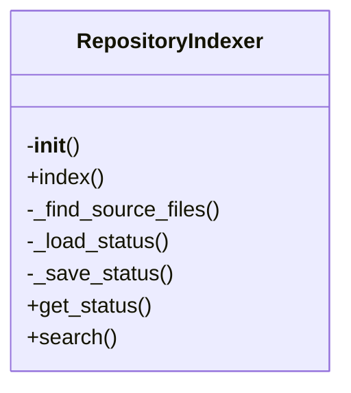

# Indexer Module Documentation

## File Overview

The indexer.py file is responsible for indexing code repositories by parsing source files, chunking code into manageable segments, and storing embeddings in a vector database. It serves as the core component that transforms raw code into searchable semantic representations. This module works closely with the chunker to break down code into chunks, the parser to understand code structure, and the vectorstore to persist embeddings for similarity search.

The indexer integrates with the configuration system to determine indexing behavior and works with embedding providers to generate semantic representations of code chunks. It coordinates progress tracking through the rich library for user feedback during long-running indexing operations.

## Classes

### RepositoryIndexer

The RepositoryIndexer class orchestrates the complete indexing process for a code repository. It handles parsing source files, chunking code into semantic units, generating embeddings, and storing these embeddings in a vector database.

Key methods:
- `index_repository`: Main method that performs the complete indexing workflow
- `process_file`: Handles individual file processing including parsing and chunking
- `update_index_status`: Updates the indexing status for tracking progress

**Usage Example:**
```python
from local_deepwiki.core.indexer import RepositoryIndexer
from local_deepwiki.config import get_config

config = get_config()
indexer = RepositoryIndexer(config)
indexer.index_repository()
```

## Functions

### index_repository

The index_repository function is the [main](../web/app.md) entry point for the indexing process. It iterates through all files matching the configured patterns, processes each file through the parsing and chunking pipeline, and stores the resulting embeddings in the vector database.

**Parameters:**
- config ([Config](../config.md)): Configuration object containing indexing settings
- progress (Progress): Progress tracking object for user feedback
- task_id (TaskID): Current task identifier for progress updates

**Return Value:**
- None

**Usage Example:**
```python
from local_deepwiki.core.indexer import index_repository
from local_deepwiki.config import get_config

config = get_config()
index_repository(config)
```

### process_file

The process_file function handles the processing of individual files within the repository. It parses the file content, chunks it into semantic units, and generates embeddings for each chunk.

**Parameters:**
- file_path (Path): Path to the file being processed
- config ([Config](../config.md)): Configuration object for indexing behavior
- progress (Progress): Progress tracking object
- task_id (TaskID): Current task identifier

**Return Value:**
- List[[CodeChunk](../models.md)]: List of code chunks generated from the file

### update_index_status

The update_index_status function updates the indexing status for tracking progress and monitoring the indexing workflow.

**Parameters:**
- file_path (Path): Path to the file being processed
- status ([IndexStatus](../models.md)): Current indexing status
- progress (Progress): Progress tracking object
- task_id (TaskID): Current task identifier

**Return Value:**
- None

## Usage Examples

### Basic Indexing Workflow

```python
from local_deepwiki.core.indexer import RepositoryIndexer
from local_deepwiki.config import get_config

# Get configuration
config = get_config()

# Initialize indexer
indexer = RepositoryIndexer(config)

# Start indexing
indexer.index_repository()
```

### Custom Indexing with Progress Tracking

```python
from local_deepwiki.core.indexer import RepositoryIndexer
from local_deepwiki.config import get_config
from rich.progress import Progress

config = get_config()
indexer = RepositoryIndexer(config)

with Progress() as progress:
    task = progress.add_task("Indexing repository...", total=100)
    indexer.index_repository(progress, task)
```

## Related Components

This class works with [VectorStore](vectorstore.md) to store embeddings and retrieve similar code chunks. It integrates with [CodeChunker](chunker.md) to break down source code into semantic units and with [CodeParser](parser.md) to understand code structure. The indexer relies on get_embedding_provider to generate semantic representations of code chunks. It also uses the [Config](../config.md) system to determine indexing patterns and behavior, and the [FileInfo](../models.md) model to track file information during indexing.

## API Reference

### class `RepositoryIndexer`

Orchestrates repository indexing with incremental update support.

**Methods:**

#### `__init__`

```python
def __init__(repo_path: Path, config: Config | None = None, embedding_provider_name: str | None = None)
```

Initialize the indexer.


| [Parameter](../generators/api_docs.md) | Type | Default | Description |
|-----------|------|---------|-------------|
| `repo_path` | `Path` | - | Path to the repository root. |
| `config` | `Config | None` | `None` | Optional configuration. |
| `embedding_provider_name` | `str | None` | `None` | Override embedding provider ("local" or "openai"). |

#### `index`

```python
async def index(full_rebuild: bool = False, progress_callback: Callable[[str, int, int], None] | None = None) -> IndexStatus
```

Index the repository.


| [Parameter](../generators/api_docs.md) | Type | Default | Description |
|-----------|------|---------|-------------|
| `full_rebuild` | `bool` | `False` | If True, rebuild entire index. Otherwise, incremental update. |
| [`progress_callback`](../server.md) | `Callable[[str, int, int], None] | None` | `None` | Optional callback for progress updates (message, current, total). |

#### `get_status`

```python
def get_status() -> IndexStatus | None
```

Get the current indexing status.

#### `search`

```python
async def search(query: str, limit: int = 10, language: str | None = None) -> list[dict]
```

Search the indexed repository.


| [Parameter](../generators/api_docs.md) | Type | Default | Description |
|-----------|------|---------|-------------|
| `query` | `str` | - | Search query. |
| `limit` | `int` | `10` | Maximum results. |
| `language` | `str | None` | `None` | Optional language filter. |


## Class Diagram



## Call Graph

```mermaid
flowchart TD
    N0[CodeChunker]
    N1[CodeParser]
    N2[IndexStatus]
    N3[RepositoryIndexer.__init__]
    N4[RepositoryIndexer._find_sou...]
    N5[RepositoryIndexer._load_status]
    N6[RepositoryIndexer._save_status]
    N7[RepositoryIndexer.index]
    N8[VectorStore]
    N9[_find_source_files]
    N10[_load_status]
    N11[_save_status]
    N12[add_chunks]
    N13[chunk_file]
    N14[create_or_update_table]
    N15[delete_chunks_by_file]
    N16[fnmatch]
    N17[get_config]
    N18[get_embedding_provider]
    N19[get_file_info]
    N20[get_vector_db_path]
    N21[get_wiki_path]
    N22[is_file]
    N23[mkdir]
    N24[progress_callback]
    N25[relative_to]
    N26[resolve]
    N27[rglob]
    N28[stat]
    N29[time]
    N3 --> N26
    N3 --> N17
    N3 --> N21
    N3 --> N20
    N3 --> N1
    N3 --> N0
    N3 --> N18
    N3 --> N8
    N7 --> N23
    N7 --> N10
    N7 --> N9
    N7 --> N24
    N7 --> N19
    N7 --> N13
    N7 --> N15
    N7 --> N14
    N7 --> N12
    N7 --> N2
    N7 --> N29
    N7 --> N11
    N4 --> N27
    N4 --> N22
    N4 --> N25
    N4 --> N16
    N4 --> N28
    classDef func fill:#e1f5fe
    class N0,N1,N2,N8,N9,N10,N11,N12,N13,N14,N15,N16,N17,N18,N19,N20,N21,N22,N23,N24,N25,N26,N27,N28,N29 func
    classDef method fill:#fff3e0
    class N3,N4,N5,N6,N7 method
```



## See Also

- [server](../server.md) - uses this
- [watcher](../watcher.md) - uses this
- [chunker](chunker.md) - dependency
- [models](../models.md) - dependency
- [config](../config.md) - dependency
