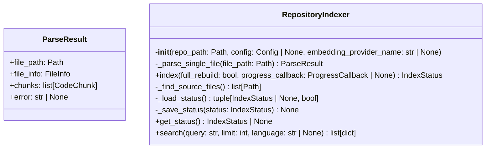

# Documentation for `src/local_deepwiki/core/indexer.py`

## File Overview

The `indexer.py` file is a core module within the `local_deepwiki` system responsible for managing and indexing code repositories. It leverages various components such as [`CodeChunker`](chunker.md), [`CodeParser`](parser.md), and other utilities to parse, process, and index code files. The module includes classes like `ParseResult` and `RepositoryIndexer`, as well as utility functions like `_needs_migration` and `_migrate_status`.

## Classes

### ParseResult

**Purpose:**
The `ParseResult` class is a data structure used to store the results of parsing code files. It contains information about the parsed content, which can be used for further processing or indexing.

**Key Methods:**
- `__init__(self, file_path: Path, chunks: List[CodeChunk])`: Initializes a new `ParseResult` instance with the path to the file and a list of parsed code chunks.
- `to_json(self) -> str`: Converts the parse result into a JSON string for easy serialization.

### RepositoryIndexer

**Purpose:**
The `RepositoryIndexer` class is responsible for indexing all files within a specified repository. It uses asynchronous processing to handle multiple files concurrently and provides methods to check if migration is needed, perform the migration, and index individual files.

**Key Methods:**
- `__init__(self, config: Config)`: Initializes the indexer with the provided configuration.
- `_needs_migration(self, file_path: Path) -> bool`: Determines if a file requires migration based on its current status.
- `_migrate_status(self, file_path: Path) -> None`: Migrates the status of a file to the latest version.
- `index_file(self, file_path: Path) -> ParseResult`: Parses and indexes a single file, returning a `ParseResult` object.
- `index_repository(self) -> List[ParseResult]`: Indexes all files in the repository, returning a list of `ParseResult` objects for each indexed file.

## Functions

### `_needs_migration`

**Parameters:**
- `file_path (Path)`: The path to the file being checked.

**Return Value:**
- `bool`: Returns `True` if the file requires migration, otherwise `False`.

**Purpose:**
The `_needs_migration` function checks whether a given file needs to be migrated. This is typically based on the file's current status or metadata.


<details>
<summary>View Source (lines 40-49) | <a href="https://github.com/UrbanDiver/local-deepwiki-mcp/blob/[main](../export/html.md)/src/local_deepwiki/core/indexer.py#L40-L49">GitHub</a></summary>

```python
def _needs_migration(status: IndexStatus) -> bool:
    """Check if an index status needs migration to the current schema version.

    Args:
        status: The loaded index status.

    Returns:
        True if the schema version is older than current and needs migration.
    """
    return status.schema_version < CURRENT_SCHEMA_VERSION
```

</details>

### `_migrate_status`

**Parameters:**
- `file_path (Path)`: The path to the file whose status needs migration.

**Return Value:**
- `None`: The function does not return any value; it performs the migration in place.

**Purpose:**
The `_migrate_status` function updates the status of a file to the latest version. This is used to ensure that all files are consistent with the current system requirements.


<details>
<summary>View Source (lines 52-79) | <a href="https://github.com/UrbanDiver/local-deepwiki-mcp/blob/[main](../export/html.md)/src/local_deepwiki/core/indexer.py#L52-L79">GitHub</a></summary>

```python
def _migrate_status(status: IndexStatus) -> tuple[IndexStatus, bool]:
    """Migrate an index status to the current schema version.

    This function handles migrations between schema versions. Each migration
    step should be idempotent and handle the transition from version N to N+1.

    Args:
        status: The index status to migrate.

    Returns:
        Tuple of (migrated status, requires_rebuild).
        requires_rebuild is True if the vector store needs to be rebuilt.
    """
    requires_rebuild = False
    current_version = status.schema_version

    # Migration from version 1 to 2
    # Version 2 added scalar indexes - the index data is compatible but
    # indexes need to be created (handled by _ensure_scalar_indexes in VectorStore)
    if current_version < 2:
        logger.info("Migrating index status from schema version 1 to 2")
        # No data migration needed - indexes are created on table open
        current_version = 2

    # Update schema version
    status.schema_version = current_version

    return status, requires_rebuild
```

</details>

## Integration

The `indexer.py` module integrates closely with other components of the `local_deepwiki` system, specifically:

- **[CodeChunker](chunker.md)**: Used by `RepositoryIndexer` to split code files into manageable chunks.
- **[CodeParser](parser.md)**: Utilized to parse individual code chunks into structured data.
- **[Config](../config.md)**: Provides configuration settings for indexing operations.

The module depends on various other libraries such as `asyncio`, `ThreadPoolExecutor`, and `pathlib` to handle asynchronous processing, multi-threading, and file path management, respectively.

## Usage Examples

### Indexing a Single File

```python
from local_deepwiki.config import get_config
from local_deepwiki.core.indexer import RepositoryIndexer
from pathlib import Path

# Get configuration
config = get_config()

# Initialize the indexer
indexer = RepositoryIndexer(config)

# Define the path to the file
file_path = Path('/path/to/your/code/file.py')

# Index the file
parse_result = indexer.index_file(file_path)
print(parse_result.to_json())
```

### Indexing an Entire Repository

```python
from local_deepwiki.config import get_config
from local_deepwiki.core.indexer import RepositoryIndexer

# Get configuration
config = get_config()

# Initialize the indexer
indexer = RepositoryIndexer(config)

# Index all files in the repository
parse_results = indexer.index_repository()
for result in parse_results:
    print(result.to_json())
```

These examples demonstrate how to use the `RepositoryIndexer` class to index individual files and entire repositories, leveraging the `ParseResult` class to store and serialize the indexing results.

## API Reference

### class `ParseResult`

Result of parsing a single file.


<details>
<summary>View Source (lines 23-29) | <a href="https://github.com/UrbanDiver/local-deepwiki-mcp/blob/[main](../export/html.md)/src/local_deepwiki/core/indexer.py#L23-L29">GitHub</a></summary>

```python
class ParseResult:
    """Result of parsing a single file."""

    file_path: Path
    file_info: FileInfo
    chunks: list[CodeChunk]
    error: str | None = None
```

</details>

### class `RepositoryIndexer`

Orchestrates repository indexing with incremental update support.

**Methods:**


<details>
<summary>View Source (lines 82-472) | <a href="https://github.com/UrbanDiver/local-deepwiki-mcp/blob/[main](../export/html.md)/src/local_deepwiki/core/indexer.py#L82-L472">GitHub</a></summary>

```python
class RepositoryIndexer:
    # Methods: __init__, _parse_single_file, index, _find_source_files, _load_status, _save_status, get_status, search
```

</details>

#### `__init__`

```python
def __init__(repo_path: Path, config: Config | None = None, embedding_provider_name: str | None = None)
```

Initialize the indexer.


| [Parameter](../generators/api_docs.md) | Type | Default | Description |
|-----------|------|---------|-------------|
| `repo_path` | `Path` | - | Path to the repository root. |
| `config` | `Config | None` | `None` | Optional configuration. |
| `embedding_provider_name` | `str | None` | `None` | Override embedding provider ("local" or "openai"). |


<details>
<summary>View Source (lines 87-113) | <a href="https://github.com/UrbanDiver/local-deepwiki-mcp/blob/[main](../export/html.md)/src/local_deepwiki/core/indexer.py#L87-L113">GitHub</a></summary>

```python
def __init__(
        self,
        repo_path: Path,
        config: Config | None = None,
        embedding_provider_name: str | None = None,
    ):
        """Initialize the indexer.

        Args:
            repo_path: Path to the repository root.
            config: Optional configuration.
            embedding_provider_name: Override embedding provider ("local" or "openai").
        """
        self.repo_path = repo_path.resolve()
        self.config = config or get_config()

        # Override embedding provider if specified
        if embedding_provider_name:
            self.config.embedding.provider = embedding_provider_name  # type: ignore

        self.wiki_path = self.config.get_wiki_path(self.repo_path)
        self.vector_db_path = self.config.get_vector_db_path(self.repo_path)

        self.parser = CodeParser()
        self.chunker = CodeChunker(self.config.chunking)
        self.embedding_provider = get_embedding_provider(self.config.embedding)
        self.vector_store = VectorStore(self.vector_db_path, self.embedding_provider)
```

</details>

#### `index`

```python
async def index(full_rebuild: bool = False, progress_callback: ProgressCallback | None = None) -> IndexStatus
```

Index the repository.


| [Parameter](../generators/api_docs.md) | Type | Default | Description |
|-----------|------|---------|-------------|
| `full_rebuild` | `bool` | `False` | If True, rebuild entire index. Otherwise, incremental update. |
| [`progress_callback`](../handlers.md) | `ProgressCallback | None` | `None` | Optional callback for progress updates (message, current, total). |


<details>
<summary>View Source (lines 139-314) | <a href="https://github.com/UrbanDiver/local-deepwiki-mcp/blob/[main](../export/html.md)/src/local_deepwiki/core/indexer.py#L139-L314">GitHub</a></summary>

```python
async def index(
        self,
        full_rebuild: bool = False,
        progress_callback: ProgressCallback | None = None,
    ) -> IndexStatus:
        """Index the repository.

        Args:
            full_rebuild: If True, rebuild entire index. Otherwise, incremental update.
            progress_callback: Optional callback for progress updates (message, current, total).

        Returns:
            IndexStatus with indexing results.
        """
        # Ensure wiki directory exists
        self.wiki_path.mkdir(parents=True, exist_ok=True)

        logger.info(f"Starting indexing for repository: {self.repo_path}")
        logger.debug(f"Wiki path: {self.wiki_path}, Full rebuild: {full_rebuild}")

        # Load previous status for incremental updates
        previous_status = None
        if not full_rebuild:
            previous_status, requires_rebuild = self._load_status()
            if requires_rebuild:
                logger.info("Schema migration requires full rebuild")
                full_rebuild = True
                previous_status = None

        if previous_status:
            logger.debug(f"Loaded previous index status: {previous_status.total_files} files")

        # Find all source files
        source_files = list(self._find_source_files())
        logger.info(f"Found {len(source_files)} source files to consider")

        if progress_callback:
            progress_callback("Found source files", len(source_files), len(source_files))

        # Determine which files need processing
        files_to_process: list[Path] = []
        files_unchanged: list[FileInfo] = []

        for file_path in source_files:
            file_info = self.parser.get_file_info(file_path, self.repo_path)

            if previous_status and not full_rebuild:
                # Check if file has changed
                prev_file = next(
                    (f for f in previous_status.files if f.path == file_info.path), None
                )
                if prev_file and prev_file.hash == file_info.hash:
                    files_unchanged.append(prev_file)
                    continue

            files_to_process.append(file_path)

        if progress_callback:
            progress_callback(
                f"Processing {len(files_to_process)} files ({len(files_unchanged)} unchanged)",
                0,
                len(files_to_process),
            )

        # Process files in parallel using thread pool for CPU-bound parsing
        batch_size = self.config.chunking.batch_size
        parallel_workers = self.config.chunking.parallel_workers
        chunk_batch: list[CodeChunk] = []
        processed_files: list[FileInfo] = []
        total_chunks_processed = 0
        is_first_batch = True

        logger.info(f"Parsing files with {parallel_workers} parallel workers")

        # Use thread pool for parallel parsing (CPU-bound work)
        with ThreadPoolExecutor(max_workers=parallel_workers) as executor:
            # Submit all parsing tasks
            futures = {
                executor.submit(self._parse_single_file, file_path): file_path
                for file_path in files_to_process
            }

            # Process results as they complete
            from concurrent.futures import as_completed

            for i, future in enumerate(as_completed(futures)):
                file_path = futures[future]
                if progress_callback:
                    progress_callback(f"Parsing {file_path.name}", i, len(files_to_process))

                result = future.result()

                if result.error:
                    logger.warning(f"Error processing {result.file_path}: {result.error}")
                    if progress_callback:
                        progress_callback(
                            f"Error processing {result.file_path}: {result.error}",
                            i,
                            len(files_to_process),
                        )
                    continue

                # If incremental, delete old chunks for this file before adding new ones
                if not full_rebuild and previous_status:
                    await self.vector_store.delete_chunks_by_file(result.file_info.path)

                chunk_batch.extend(result.chunks)
                processed_files.append(result.file_info)

                # Process batch if it reaches the batch size
                if len(chunk_batch) >= batch_size:
                    if progress_callback:
                        progress_callback(
                            f"Storing batch of {len(chunk_batch)} chunks...",
                            i,
                            len(files_to_process),
                        )

                    if full_rebuild and is_first_batch:
                        await self.vector_store.create_or_update_table(chunk_batch)
                        is_first_batch = False
                    else:
                        await self.vector_store.add_chunks(chunk_batch)

                    total_chunks_processed += len(chunk_batch)
                    chunk_batch = []  # Clear batch to free memory

        # Process any remaining chunks in the final batch
        if chunk_batch:
            if progress_callback:
                progress_callback(
                    f"Storing final batch of {len(chunk_batch)} chunks...",
                    len(files_to_process),
                    len(files_to_process),
                )

            if full_rebuild and is_first_batch:
                await self.vector_store.create_or_update_table(chunk_batch)
            else:
                await self.vector_store.add_chunks(chunk_batch)

            total_chunks_processed += len(chunk_batch)

        # Combine processed and unchanged files
        all_files = processed_files + files_unchanged

        # Calculate language statistics
        languages: dict[str, int] = {}
        for file_info in all_files:
            if file_info.language:
                lang = file_info.language.value
                languages[lang] = languages.get(lang, 0) + 1

        # Create status with current schema version
        status = IndexStatus(
            repo_path=str(self.repo_path),
            indexed_at=time.time(),
            total_files=len(all_files),
            total_chunks=total_chunks_processed + sum(f.chunk_count for f in files_unchanged),
            languages=languages,
            files=all_files,
            schema_version=CURRENT_SCHEMA_VERSION,
        )

        # Save status
        self._save_status(status)

        logger.info(
            f"Indexing complete: {status.total_files} files, "
            f"{status.total_chunks} chunks, languages: {list(status.languages.keys())}"
        )

        if progress_callback:
            progress_callback("Indexing complete", 1, 1)

        return status
```

</details>

#### `get_status`

```python
def get_status() -> IndexStatus | None
```

Get the current indexing status.


<details>
<summary>View Source (lines 432-439) | <a href="https://github.com/UrbanDiver/local-deepwiki-mcp/blob/[main](../export/html.md)/src/local_deepwiki/core/indexer.py#L432-L439">GitHub</a></summary>

```python
def get_status(self) -> IndexStatus | None:
        """Get the current indexing status.

        Returns:
            IndexStatus or None if not indexed.
        """
        status, _ = self._load_status()
        return status
```

</details>

#### `search`

```python
async def search(query: str, limit: int = 10, language: str | None = None) -> list[dict]
```

Search the indexed repository.


| [Parameter](../generators/api_docs.md) | Type | Default | Description |
|-----------|------|---------|-------------|
| `query` | `str` | - | Search query. |
| `limit` | `int` | `10` | Maximum results. |
| `language` | `str | None` | `None` | Optional language filter. |


<details>
<summary>View Source (lines 441-472) | <a href="https://github.com/UrbanDiver/local-deepwiki-mcp/blob/[main](../export/html.md)/src/local_deepwiki/core/indexer.py#L441-L472">GitHub</a></summary>

```python
async def search(
        self,
        query: str,
        limit: int = 10,
        language: str | None = None,
    ) -> list[dict]:
        """Search the indexed repository.

        Args:
            query: Search query.
            limit: Maximum results.
            language: Optional language filter.

        Returns:
            List of search result dictionaries.
        """
        results = await self.vector_store.search(query, limit=limit, language=language)
        return [
            {
                "file_path": r.chunk.file_path,
                "name": r.chunk.name,
                "type": r.chunk.chunk_type.value,
                "language": r.chunk.language.value,
                "lines": f"{r.chunk.start_line}-{r.chunk.end_line}",
                "score": r.score,
                "content": (
                    r.chunk.content[:500] + "..." if len(r.chunk.content) > 500 else r.chunk.content
                ),
                "docstring": r.chunk.docstring,
            }
            for r in results
        ]
```

</details>

## Class Diagram


```mermaid
classDiagram
    class ParseResult {
        +file_path: Path
        +file_info: FileInfo
        +chunks: list[CodeChunk]
        +error: str | None
    }
    class RepositoryIndexer {
        -__init__(repo_path: Path, config: Config | None, embedding_provider_name: str | None)
        -_parse_single_file(file_path: Path) ParseResult
        +index(full_rebuild: bool, progress_callback: ProgressCallback | None) IndexStatus
        -_find_source_files() list[Path]
        -_load_status() tuple[IndexStatus | None, bool]
        -_save_status(status: IndexStatus) None
        +get_status() IndexStatus | None
        +search(query: str, limit: int, language: str | None) list[dict]
    }
```

## Call Graph


```mermaid
flowchart TD
    N0[CodeChunker]
    N1[CodeParser]
    N2[IndexStatus]
    N3[ParseResult]
    N4[RepositoryIndexer.__init__]
    N5[RepositoryIndexer._find_sou...]
    N6[RepositoryIndexer._load_status]
    N7[RepositoryIndexer._parse_si...]
    N8[RepositoryIndexer._save_status]
    N9[RepositoryIndexer.index]
    N10[ThreadPoolExecutor]
    N11[VectorStore]
    N12[_find_source_files]
    N13[_load_status]
    N14[_save_status]
    N15[add_chunks]
    N16[as_completed]
    N17[chunk_file]
    N18[create_or_update_table]
    N19[delete_chunks_by_file]
    N20[get_config]
    N21[get_embedding_provider]
    N22[get_file_info]
    N23[get_vector_db_path]
    N24[get_wiki_path]
    N25[mkdir]
    N26[progress_callback]
    N27[resolve]
    N28[result]
    N29[submit]
    N4 --> N27
    N4 --> N20
    N4 --> N24
    N4 --> N23
    N4 --> N1
    N4 --> N0
    N4 --> N21
    N4 --> N11
    N7 --> N22
    N7 --> N17
    N7 --> N3
    N9 --> N25
    N9 --> N13
    N9 --> N12
    N9 --> N26
    N9 --> N22
    N9 --> N10
    N9 --> N29
    N9 --> N16
    N9 --> N28
    N9 --> N19
    N9 --> N18
    N9 --> N15
    N9 --> N2
    N9 --> N14
    N6 --> N14
    classDef func fill:#e1f5fe
    class N0,N1,N2,N3,N10,N11,N12,N13,N14,N15,N16,N17,N18,N19,N20,N21,N22,N23,N24,N25,N26,N27,N28,N29 func
    classDef method fill:#fff3e0
    class N4,N5,N6,N7,N8,N9 method
```

## Used By

Functions and methods in this file and their callers:

- **[`CodeChunker`](chunker.md)**: called by `RepositoryIndexer.__init__`
- **[`CodeParser`](parser.md)**: called by `RepositoryIndexer.__init__`
- **[`IndexStatus`](../models.md)**: called by `RepositoryIndexer.index`
- **`ParseResult`**: called by `RepositoryIndexer._parse_single_file`
- **`Path`**: called by `RepositoryIndexer._find_source_files`
- **`ThreadPoolExecutor`**: called by `RepositoryIndexer.index`
- **[`VectorStore`](vectorstore.md)**: called by `RepositoryIndexer.__init__`
- **`_find_source_files`**: called by `RepositoryIndexer.index`
- **`_load_status`**: called by `RepositoryIndexer.get_status`, `RepositoryIndexer.index`
- **`_migrate_status`**: called by `RepositoryIndexer._load_status`
- **`_needs_migration`**: called by `RepositoryIndexer._load_status`
- **`_save_status`**: called by `RepositoryIndexer._load_status`, `RepositoryIndexer.index`
- **`add`**: called by `RepositoryIndexer._find_source_files`
- **`add_chunks`**: called by `RepositoryIndexer.index`
- **`as_completed`**: called by `RepositoryIndexer.index`
- **`chunk_file`**: called by `RepositoryIndexer._parse_single_file`
- **`compile`**: called by `RepositoryIndexer._find_source_files`
- **`create_or_update_table`**: called by `RepositoryIndexer.index`
- **`delete_chunks_by_file`**: called by `RepositoryIndexer.index`
- **`detect_language`**: called by `RepositoryIndexer._find_source_files`
- **`dump`**: called by `RepositoryIndexer._save_status`
- **`exists`**: called by `RepositoryIndexer._load_status`
- **[`get_config`](../config.md)**: called by `RepositoryIndexer.__init__`
- **`get_embedding_provider`**: called by `RepositoryIndexer.__init__`
- **`get_file_info`**: called by `RepositoryIndexer._parse_single_file`, `RepositoryIndexer.index`
- **`get_vector_db_path`**: called by `RepositoryIndexer.__init__`
- **`get_wiki_path`**: called by `RepositoryIndexer.__init__`
- **`load`**: called by `RepositoryIndexer._load_status`
- **`match`**: called by `RepositoryIndexer._find_source_files`
- **`mkdir`**: called by `RepositoryIndexer.index`
- **`model_dump`**: called by `RepositoryIndexer._save_status`
- **`model_validate`**: called by `RepositoryIndexer._load_status`
- **[`progress_callback`](../handlers.md)**: called by `RepositoryIndexer.index`
- **`relative_to`**: called by `RepositoryIndexer._find_source_files`
- **`resolve`**: called by `RepositoryIndexer.__init__`
- **`result`**: called by `RepositoryIndexer.index`
- **`search`**: called by `RepositoryIndexer.search`
- **`stat`**: called by `RepositoryIndexer._find_source_files`
- **`submit`**: called by `RepositoryIndexer.index`
- **`time`**: called by `RepositoryIndexer.index`
- **`translate`**: called by `RepositoryIndexer._find_source_files`
- **[`walk`](../generators/test_examples.md)**: called by `RepositoryIndexer._find_source_files`

## Usage Examples

*Examples extracted from test files*

### Test that old schema versions need migration

From `test_indexer.py::TestSchemaMigration::test_needs_migration_old_version`:

```python
indexed_at=1.0,
    total_files=10,
    total_chunks=100,
    schema_version=1,
)
# If current version is > 1, migration is needed
if CURRENT_SCHEMA_VERSION > 1:
    assert _needs_migration(status) is True
```

### Test that old schema versions need migration

From `test_indexer.py::TestSchemaMigration::test_needs_migration_old_version`:

```python
status = IndexStatus(
    repo_path="/test",
    indexed_at=1.0,
    total_files=10,
    total_chunks=100,
    schema_version=1,
)
# If current version is > 1, migration is needed
if CURRENT_SCHEMA_VERSION > 1:
    assert _needs_migration(status) is True
```

### Test that current schema version doesn't need migration

From `test_indexer.py::TestSchemaMigration::test_needs_migration_current_version`:

```python
indexed_at=1.0,
    total_files=10,
    total_chunks=100,
    schema_version=CURRENT_SCHEMA_VERSION,
)
assert _needs_migration(status) is False
```

### Test that current schema version doesn't need migration

From `test_indexer.py::TestSchemaMigration::test_needs_migration_current_version`:

```python
status = IndexStatus(
    repo_path="/test",
    indexed_at=1.0,
    total_files=10,
    total_chunks=100,
    schema_version=CURRENT_SCHEMA_VERSION,
)
assert _needs_migration(status) is False
```

### Test that migration updates the schema version

From `test_indexer.py::TestSchemaMigration::test_migrate_status_updates_version`:

```python
status = IndexStatus(
    repo_path="/test",
    indexed_at=1.0,
    total_files=10,
    total_chunks=100,
    schema_version=1,
)
migrated, requires_rebuild = _migrate_status(status)
assert migrated.schema_version == CURRENT_SCHEMA_VERSION
```


## Last Modified

| Entity | Type | Author | Date | Commit |
|--------|------|--------|------|--------|
| `ParseResult` | class | Brian Breidenbach | today | `06f832d` Add parallel processing and... |
| `RepositoryIndexer` | class | Brian Breidenbach | today | `06f832d` Add parallel processing and... |
| `_parse_single_file` | method | Brian Breidenbach | today | `06f832d` Add parallel processing and... |
| `index` | method | Brian Breidenbach | today | `06f832d` Add parallel processing and... |
| `_find_source_files` | method | Brian Breidenbach | today | `06f832d` Add parallel processing and... |
| `_load_status` | method | Brian Breidenbach | 2 days ago | `39e8c73` Replace generic except Exce... |
| `get_status` | method | Brian Breidenbach | 3 days ago | `c568951` Add input validation, type ... |
| `search` | method | Brian Breidenbach | 3 days ago | `c568951` Add input validation, type ... |
| `_needs_migration` | function | Brian Breidenbach | 3 days ago | `c568951` Add input validation, type ... |
| `_migrate_status` | function | Brian Breidenbach | 3 days ago | `c568951` Add input validation, type ... |
| `__init__` | method | Brian Breidenbach | 6 days ago | `cdae76f` Initial commit: Local DeepW... |
| `_save_status` | method | Brian Breidenbach | 6 days ago | `cdae76f` Initial commit: Local DeepW... |

## Additional Source Code

Source code for functions and methods not listed in the API Reference above.

#### `_parse_single_file`

<details>
<summary>View Source (lines 115-137) | <a href="https://github.com/UrbanDiver/local-deepwiki-mcp/blob/[main](../export/html.md)/src/local_deepwiki/core/indexer.py#L115-L137">GitHub</a></summary>

```python
def _parse_single_file(self, file_path: Path) -> ParseResult:
        """Parse and chunk a single file (CPU-bound, runs in thread pool).

        Args:
            file_path: Path to the file to parse.

        Returns:
            ParseResult with file info and chunks, or error message.
        """
        try:
            file_info = self.parser.get_file_info(file_path, self.repo_path)
            chunks = list(self.chunker.chunk_file(file_path, self.repo_path))
            file_info.chunk_count = len(chunks)
            return ParseResult(file_path=file_path, file_info=file_info, chunks=chunks)
        except (OSError, ValueError, RuntimeError, UnicodeDecodeError) as e:
            # Return error result instead of raising
            file_info = self.parser.get_file_info(file_path, self.repo_path)
            return ParseResult(
                file_path=file_path,
                file_info=file_info,
                chunks=[],
                error=str(e),
            )
```

</details>


#### `_find_source_files`

<details>
<summary>View Source (lines 316-384) | <a href="https://github.com/UrbanDiver/local-deepwiki-mcp/blob/[main](../export/html.md)/src/local_deepwiki/core/indexer.py#L316-L384">GitHub</a></summary>

```python
def _find_source_files(self) -> list[Path]:
        """Find all source files in the repository.

        Uses os.walk() with early directory filtering to skip excluded
        directories entirely (e.g., node_modules, .git, vendor) instead
        of traversing them and checking each file.

        Returns:
            List of paths to source files.
        """
        import os
        import re

        files = []
        exclude_patterns = self.config.parsing.exclude_patterns
        max_size = self.config.parsing.max_file_size

        # Extract directory names to skip entirely (patterns like "node_modules/**")
        skip_dirs = set()
        file_patterns = []
        for pattern in exclude_patterns:
            # Patterns like "node_modules/**" or ".git/**" -> skip the directory
            if pattern.endswith("/**"):
                skip_dirs.add(pattern[:-3])
            else:
                file_patterns.append(pattern)

        # Compile patterns for faster matching
        compiled_patterns = [re.compile(fnmatch.translate(p)) for p in file_patterns]

        for root, dirs, filenames in os.walk(self.repo_path):
            root_path = Path(root)
            rel_root = root_path.relative_to(self.repo_path)

            # Early directory filtering - modify dirs in-place to skip subdirs
            dirs[:] = [
                d for d in dirs
                if d not in skip_dirs
                and str(rel_root / d) not in skip_dirs
                and not d.startswith(".")  # Skip hidden directories
            ]

            for filename in filenames:
                file_path = root_path / filename
                rel_path = str(file_path.relative_to(self.repo_path))

                # Check against compiled file patterns
                if any(p.match(rel_path) for p in compiled_patterns):
                    continue

                # Check file size
                try:
                    if file_path.stat().st_size > max_size:
                        continue
                except OSError:
                    continue

                # Check if language is supported
                language = self.parser.detect_language(file_path)
                if language is None:
                    continue

                # Check if language is in configured list
                if language.value not in self.config.parsing.languages:
                    continue

                files.append(file_path)

        return files
```

</details>


#### `_load_status`

<details>
<summary>View Source (lines 386-420) | <a href="https://github.com/UrbanDiver/local-deepwiki-mcp/blob/[main](../export/html.md)/src/local_deepwiki/core/indexer.py#L386-L420">GitHub</a></summary>

```python
def _load_status(self) -> tuple[IndexStatus | None, bool]:
        """Load previous indexing status and check for migration needs.

        Returns:
            Tuple of (IndexStatus or None, requires_rebuild).
            requires_rebuild is True if the index should be fully rebuilt.
        """
        status_path = self.wiki_path / self.INDEX_STATUS_FILE
        if not status_path.exists():
            return None, False

        try:
            with open(status_path) as f:
                data = json.load(f)

            # Handle legacy status files without schema_version
            if "schema_version" not in data:
                data["schema_version"] = 1

            status = IndexStatus.model_validate(data)

            # Check if migration is needed
            if _needs_migration(status):
                status, requires_rebuild = _migrate_status(status)
                # Save the migrated status
                self._save_status(status)
                return status, requires_rebuild

            return status, False
        except (json.JSONDecodeError, OSError, ValueError) as e:
            # json.JSONDecodeError: Corrupted or invalid JSON
            # OSError: File read issues
            # ValueError: Pydantic validation failure
            logger.warning(f"Failed to load index status from {status_path}: {e}")
            return None, False
```

</details>


#### `_save_status`

<details>
<summary>View Source (lines 422-430) | <a href="https://github.com/UrbanDiver/local-deepwiki-mcp/blob/[main](../export/html.md)/src/local_deepwiki/core/indexer.py#L422-L430">GitHub</a></summary>

```python
def _save_status(self, status: IndexStatus) -> None:
        """Save indexing status.

        Args:
            status: The IndexStatus to save.
        """
        status_path = self.wiki_path / self.INDEX_STATUS_FILE
        with open(status_path, "w") as f:
            json.dump(status.model_dump(), f, indent=2)
```

</details>

## Relevant Source Files

- `src/local_deepwiki/core/indexer.py:23-29`
