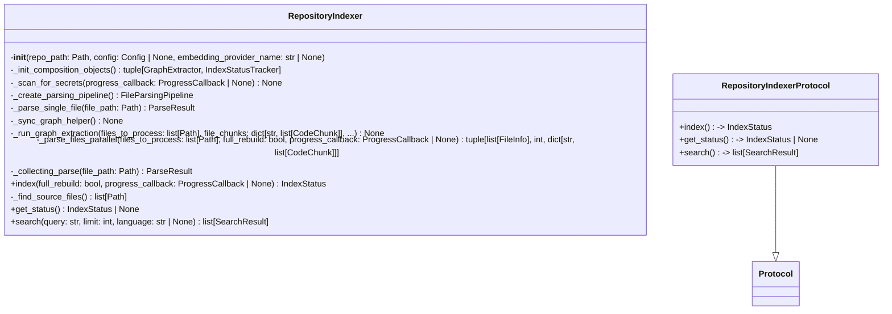

# File: `src/local_deepwiki/core/indexer.py`

## File Overview

This file implements the core repository indexing logic for the `local_deepwiki` project. It orchestrates the process of parsing source files, chunking code, generating embeddings, and storing the results in a vector store for later retrieval. It supports both full rebuilds and incremental updates to optimize performance.

The main entry point is the `RepositoryIndexer` class, which provides a high-level interface for indexing a repository and searching its contents. It integrates with various components like the [`CodeParser`](parser/code_parser.md), [`CodeChunker`](chunker.md), [`VectorStore`](vectorstore/store.md), and optional [`KnowledgeGraphStore`](graph_rag/store.md) for GraphRAG capabilities.

## Key Concepts

### Repository Indexing Pipeline

The indexing process is structured as a multi-phase pipeline:
1. **Security Check**: Scans for hardcoded secrets before proceeding.
2. **Status Management**: Determines which files need processing based on previous index status and file changes.
3. **File Parsing**: Processes source files in parallel using [`FileParsingPipeline`](parsing_pipeline.md).
4. **Chunking & Embedding**: Breaks files into chunks and generates embeddings.
5. **Graph Extraction** (optional): Extracts relationships between entities and stores them in a knowledge graph.
6. **Status Update**: Saves the new index status to track progress and enable future incremental updates.

This design enables efficient handling of large repositories by only reprocessing changed files.

### Incremental Update Strategy

The indexer supports incremental updates through [`IndexStatusTracker`](indexer_status.md) and [`IndexStatusManager`](index_manager.md). It tracks the last known state of the repository and compares it with the current state to determine which files have been added, modified, or deleted. For modified files, old chunks are deleted before reprocessing. For deleted files, stale chunks are also removed.

This approach avoids reprocessing the entire codebase on every run, significantly improving performance for large repositories.

### Protocol-Based Design

The `RepositoryIndexerProtocol` defines a clean interface that allows for dependency injection and mocking during testing. Services that depend on the indexer (like CLI commands or web handlers) can accept this protocol instead of the concrete `RepositoryIndexer` class, promoting testability and flexibility.

### Asynchronous Execution

The indexing process is fully asynchronous using `asyncio`. This allows for concurrent file parsing, vector store operations, and graph extraction, improving throughput when dealing with many files.

## Integration

This file integrates deeply with several other modules in the `local_deepwiki` codebase:

- **Configuration**: Uses `get_config()` and [`Config`](../config/models.md) to access user-defined settings.
- **Parsing Pipeline**: Depends on [`FileParsingPipeline`](parsing_pipeline.md), [`CodeParser`](parser/code_parser.md), and [`CodeChunker`](chunker.md) for parsing and chunking logic.
- **[Vector Store](vectorstore/store.md)**: Integrates with [`VectorStore`](vectorstore/store.md) to store and retrieve embeddings.
- **GraphRAG Components**: Optionally uses [`KnowledgeGraphStore`](graph_rag/store.md) and [`GraphRelationshipExtractor`](graph_rag/extractor.md) for knowledge graph creation.
- **Index Management**: Works with [`IndexStatusManager`](index_manager.md), [`IndexStatusTracker`](indexer_status.md), and [`IndexStatus`](../models/wiki.md) to manage indexing state and perform incremental updates.
- **[Event](../events.md) System**: Emits lifecycle events (`INDEX_START`, `INDEX_COMPLETE`) via `get_event_emitter()` for observability.
- **Secret Detection**: Calls [`scan_repository_for_secrets`](secret_detector.md) from `local_deepwiki.core.secret_detector` to check for hardcoded secrets.
- **CLI Integration**: Used by CLI commands in `src/local_deepwiki/cli/init_cli.py` to drive the indexing process.

## Design Notes

### Exclusion Pattern Compilation

The `compile_exclude_patterns` function pre-processes glob-style exclusion patterns into two structures:
- A set of directory names to skip entirely (`skip_dirs`)
- A list of compiled regexes for file-level filtering

This improves performance by avoiding repeated pattern matching during directory traversal.

### GraphRAG Integration

GraphRAG features are optional and controlled via configuration (`graph_rag.enabled` and `graph_rag.extract_during_index`). When enabled:
- A [`KnowledgeGraphStore`](graph_rag/store.md) is initialized.
- A [`GraphRelationshipExtractor`](graph_rag/extractor.md) is used to extract and store relationships.
- The [`GraphExtractor`](indexer_graph.md) helper is used to coordinate graph extraction steps.

This modular design allows users to opt-in to graph features without affecting basic indexing behavior.

### Thread Safety and Concurrency

The code uses `asyncio.to_thread()` for CPU-bound operations (like file system access and status loading) to avoid blocking the async event loop. This is especially important for operations like [`find_source_files`](indexer_files.md), `load_previous_status`, and `delete_chunks_by_files`.

### Error Handling in Graph Extraction

Graph extraction is wrapped in a try-except block. If it fails, a warning is logged, and indexing continues without graph data. This ensures that issues in graph extraction don't halt the entire indexing process.

### Memory Efficiency in Chunk Collection

When collecting chunks for graph entity-linking, the `_collecting_parse` inner function directly assigns chunks to a shared dictionary (`file_chunks`) keyed by relative file paths. This is safe under CPython's GIL because each thread writes to a unique key, avoiding race conditions. This design avoids copying large data structures and keeps memory usage low.

## API Reference

### class `RepositoryIndexerProtocol`

**Inherits from:** `Protocol`

Protocol defining the public interface for repository indexers.  Handlers and services that drive the indexing pipeline should accept this Protocol rather than the concrete ``RepositoryIndexer`` so that:  - Tests can pass lightweight stubs without constructing a full indexer. - Alternative indexer implementations (e.g. remote, read-only) can satisfy the contract without inheriting from the concrete class.

**Methods:**


<details>
<summary>View Source (lines 233-263) | <a href="https://github.com/UrbanDiver/local-deepwiki-mcp/blob/main/src/local_deepwiki/core/indexer.py#L233-L263">GitHub</a></summary>

```python
class RepositoryIndexerProtocol(Protocol):
    """Protocol defining the public interface for repository indexers.

    Handlers and services that drive the indexing pipeline should accept this
    Protocol rather than the concrete ``RepositoryIndexer`` so that:

    - Tests can pass lightweight stubs without constructing a full indexer.
    - Alternative indexer implementations (e.g. remote, read-only) can satisfy
      the contract without inheriting from the concrete class.
    """

    async def index(
        self,
        full_rebuild: bool = False,
        progress_callback: ProgressCallback | None = None,
    ) -> IndexStatus:
        """Index the repository and return the resulting status."""
        ...

    def get_status(self) -> IndexStatus | None:
        """Return the current index status, or None if not yet indexed."""
        ...

    async def search(
        self,
        query: str,
        limit: int = 10,
        language: str | None = None,
    ) -> list[SearchResult]:
        """Search the indexed repository and return matching chunks."""
        ...
```

</details>

#### `index`

```python
async def index(full_rebuild: bool = False, progress_callback: ProgressCallback | None = None) -> IndexStatus
```

Index the repository and return the resulting status.


| Parameter | Type | Default | Description |
|-----------|------|---------|-------------|
| `full_rebuild` | `bool` | `False` | - |
| `progress_callback` | `ProgressCallback | None` | `None` | - |


<details>
<summary>View Source (lines 233-263) | <a href="https://github.com/UrbanDiver/local-deepwiki-mcp/blob/main/src/local_deepwiki/core/indexer.py#L233-L263">GitHub</a></summary>

```python
class RepositoryIndexerProtocol(Protocol):
    """Protocol defining the public interface for repository indexers.

    Handlers and services that drive the indexing pipeline should accept this
    Protocol rather than the concrete ``RepositoryIndexer`` so that:

    - Tests can pass lightweight stubs without constructing a full indexer.
    - Alternative indexer implementations (e.g. remote, read-only) can satisfy
      the contract without inheriting from the concrete class.
    """

    async def index(
        self,
        full_rebuild: bool = False,
        progress_callback: ProgressCallback | None = None,
    ) -> IndexStatus:
        """Index the repository and return the resulting status."""
        ...

    def get_status(self) -> IndexStatus | None:
        """Return the current index status, or None if not yet indexed."""
        ...

    async def search(
        self,
        query: str,
        limit: int = 10,
        language: str | None = None,
    ) -> list[SearchResult]:
        """Search the indexed repository and return matching chunks."""
        ...
```

</details>

#### `get_status`

```python
def get_status() -> IndexStatus | None
```

Return the current index status, or None if not yet indexed.


<details>
<summary>View Source (lines 233-263) | <a href="https://github.com/UrbanDiver/local-deepwiki-mcp/blob/main/src/local_deepwiki/core/indexer.py#L233-L263">GitHub</a></summary>

```python
class RepositoryIndexerProtocol(Protocol):
    """Protocol defining the public interface for repository indexers.

    Handlers and services that drive the indexing pipeline should accept this
    Protocol rather than the concrete ``RepositoryIndexer`` so that:

    - Tests can pass lightweight stubs without constructing a full indexer.
    - Alternative indexer implementations (e.g. remote, read-only) can satisfy
      the contract without inheriting from the concrete class.
    """

    async def index(
        self,
        full_rebuild: bool = False,
        progress_callback: ProgressCallback | None = None,
    ) -> IndexStatus:
        """Index the repository and return the resulting status."""
        ...

    def get_status(self) -> IndexStatus | None:
        """Return the current index status, or None if not yet indexed."""
        ...

    async def search(
        self,
        query: str,
        limit: int = 10,
        language: str | None = None,
    ) -> list[SearchResult]:
        """Search the indexed repository and return matching chunks."""
        ...
```

</details>

#### `search`

```python
async def search(query: str, limit: int = 10, language: str | None = None) -> list[SearchResult]
```

Search the indexed repository and return matching chunks.


| Parameter | Type | Default | Description |
|-----------|------|---------|-------------|
| `query` | `str` | - | - |
| `limit` | `int` | `10` | - |
| `language` | `str | None` | `None` | - |


<details>
<summary>View Source (lines 233-263) | <a href="https://github.com/UrbanDiver/local-deepwiki-mcp/blob/main/src/local_deepwiki/core/indexer.py#L233-L263">GitHub</a></summary>

```python
class RepositoryIndexerProtocol(Protocol):
    """Protocol defining the public interface for repository indexers.

    Handlers and services that drive the indexing pipeline should accept this
    Protocol rather than the concrete ``RepositoryIndexer`` so that:

    - Tests can pass lightweight stubs without constructing a full indexer.
    - Alternative indexer implementations (e.g. remote, read-only) can satisfy
      the contract without inheriting from the concrete class.
    """

    async def index(
        self,
        full_rebuild: bool = False,
        progress_callback: ProgressCallback | None = None,
    ) -> IndexStatus:
        """Index the repository and return the resulting status."""
        ...

    def get_status(self) -> IndexStatus | None:
        """Return the current index status, or None if not yet indexed."""
        ...

    async def search(
        self,
        query: str,
        limit: int = 10,
        language: str | None = None,
    ) -> list[SearchResult]:
        """Search the indexed repository and return matching chunks."""
        ...
```

</details>

### class `RepositoryIndexer`

Orchestrates repository indexing with incremental update support.

**Methods:**


<details>
<summary>View Source (lines 266-666) | <a href="https://github.com/UrbanDiver/local-deepwiki-mcp/blob/main/src/local_deepwiki/core/indexer.py#L266-L666">GitHub</a></summary>

```python
class RepositoryIndexer:
    # Methods: __init__, _init_composition_objects, _scan_for_secrets, _create_parsing_pipeline, _parse_single_file, _sync_graph_helper, _run_graph_extraction, _parse_files_parallel, _collecting_parse, index, _find_source_files, get_status, search
```

</details>

#### `__init__`

```python
def __init__(repo_path: Path, config: Config | None = None, embedding_provider_name: str | None = None)
```

Initialize the indexer.


| Parameter | Type | Default | Description |
|-----------|------|---------|-------------|
| `repo_path` | `Path` | - | Path to the repository root. |
| `config` | `Config | None` | `None` | Optional configuration. |
| `embedding_provider_name` | `str | None` | `None` | Override embedding provider ("local" or "openai"). |


<details>
<summary>View Source (lines 269-332) | <a href="https://github.com/UrbanDiver/local-deepwiki-mcp/blob/main/src/local_deepwiki/core/indexer.py#L269-L332">GitHub</a></summary>

```python
def __init__(
        self,
        repo_path: Path,
        config: Config | None = None,
        embedding_provider_name: str | None = None,
    ):
        """Initialize the indexer.

        Args:
            repo_path: Path to the repository root.
            config: Optional configuration.
            embedding_provider_name: Override embedding provider ("local" or "openai").
        """
        self.repo_path = repo_path.resolve()
        base_config = config or get_config()

        # Create a copy with overridden embedding provider if specified
        if embedding_provider_name:
            self.config = base_config.with_embedding_provider(embedding_provider_name)
        else:
            # Store a defensive copy to prevent external mutation
            self.config = base_config.model_copy(deep=True)

        self.wiki_path = self.config.get_wiki_path(self.repo_path)
        self.vector_db_path = self.config.get_vector_db_path(self.repo_path)

        # Create AST cache if enabled
        self.ast_cache: ASTCache | None = None
        if self.config.ast_cache.enabled:
            self.ast_cache = ASTCache(
                max_entries=self.config.ast_cache.max_entries,
                ttl_seconds=self.config.ast_cache.ttl_seconds,
            )
            logger.debug(
                "AST cache enabled: max_entries=%d, ttl=%ds",
                self.config.ast_cache.max_entries,
                self.config.ast_cache.ttl_seconds,
            )

        self.parser = CodeParser(cache=self.ast_cache)
        self.chunker = CodeChunker(self.config.chunking)
        self.embedding_provider = get_embedding_provider(self.config.embedding)
        self.vector_store = VectorStore(self.vector_db_path, self.embedding_provider)

        # GraphRAG: optional knowledge graph store and extractor
        self._graph_enabled = (
            self.config.graph_rag.enabled and self.config.graph_rag.extract_during_index
        )
        self.graph_store: KnowledgeGraphStore | None = None
        self._graph_extractor: GraphRelationshipExtractor | None = None
        if self._graph_enabled:
            self.graph_store = KnowledgeGraphStore(self.vector_db_path)
            self._graph_extractor = GraphRelationshipExtractor()
            logger.debug("GraphRAG extraction enabled during indexing")

        # Use IndexStatusManager for all status operations
        self._status_manager = IndexStatusManager()

        # Pre-compile exclude patterns (config is frozen, so these never change)
        self._exclude_skip_dirs, self._exclude_compiled = compile_exclude_patterns(
            self.config.parsing.exclude_patterns
        )

        self._graph_helper, self._status_tracker = self._init_composition_objects()
```

</details>

#### `index`

```python
async def index(full_rebuild: bool = False, progress_callback: ProgressCallback | None = None) -> IndexStatus
```

Index the repository.  This method coordinates the indexing process by delegating to focused private methods for each phase of the operation.


| Parameter | Type | Default | Description |
|-----------|------|---------|-------------|
| `full_rebuild` | `bool` | `False` | If True, rebuild entire index. Otherwise, incremental update. |
| `progress_callback` | `ProgressCallback | None` | `None` | Optional callback for progress updates (message, current, total). |


<details>
<summary>View Source (lines 524-604) | <a href="https://github.com/UrbanDiver/local-deepwiki-mcp/blob/main/src/local_deepwiki/core/indexer.py#L524-L604">GitHub</a></summary>

```python
async def index(
        self,
        full_rebuild: bool = False,
        progress_callback: ProgressCallback | None = None,
    ) -> IndexStatus:
        """Index the repository.

        This method coordinates the indexing process by delegating to
        focused private methods for each phase of the operation.

        Args:
            full_rebuild: If True, rebuild entire index. Otherwise, incremental update.
            progress_callback: Optional callback for progress updates (message, current, total).

        Returns:
            IndexStatus with indexing results.
        """
        # Ensure wiki directory exists
        await asyncio.to_thread(self.wiki_path.mkdir, parents=True, exist_ok=True)

        logger.info("Starting indexing for repository: %s", self.repo_path)
        logger.debug("Wiki path: %s, Full rebuild: %s", self.wiki_path, full_rebuild)

        await emit_index_start(self.repo_path, full_rebuild=full_rebuild)

        # Security: Scan for hardcoded secrets before indexing
        await self._scan_for_secrets(progress_callback)

        (
            full_rebuild,
            files_to_process,
            files_unchanged,
            deleted_file_paths,
            prev_files_by_path,
        ) = await prepare_incremental_update(
            self._status_tracker,
            self.vector_store,
            self.parser,
            self.repo_path,
            full_rebuild,
            progress_callback,
        )

        # Phase 4: Parse files in parallel and store chunks
        (
            processed_files,
            total_chunks_processed,
            file_chunks,
        ) = await self._parse_files_parallel(
            files_to_process, full_rebuild, progress_callback
        )

        # Phase 5: Graph extraction (optional, non-blocking)
        if self._graph_enabled and files_to_process:
            try:
                await self._run_graph_extraction(
                    files_to_process=files_to_process,
                    file_chunks=file_chunks,
                    prev_files_by_path=prev_files_by_path,
                    deleted_file_paths=deleted_file_paths,
                    full_rebuild=full_rebuild,
                    progress_callback=progress_callback,
                )
            except Exception:
                logger.warning(
                    "Graph extraction failed, continuing without graph data",
                    exc_info=True,
                )

        # Phase 6: Create and save index status
        status = self._status_tracker.create_index_status(
            processed_files, files_unchanged, total_chunks_processed
        )
        await asyncio.to_thread(self._status_tracker.save_index_status, status)

        if progress_callback:
            progress_callback("Indexing complete", 1, 1)

        await emit_index_complete(self.repo_path, status)

        return status
```

</details>

#### `get_status`

```python
def get_status() -> IndexStatus | None
```

Get the current indexing status.


<details>
<summary>View Source (lines 625-631) | <a href="https://github.com/UrbanDiver/local-deepwiki-mcp/blob/main/src/local_deepwiki/core/indexer.py#L625-L631">GitHub</a></summary>

```python
def get_status(self) -> IndexStatus | None:
        """Get the current indexing status.

        Returns:
            IndexStatus or None if not indexed.
        """
        return self._status_tracker.get_status()
```

</details>

#### `search`

```python
async def search(query: str, limit: int = 10, language: str | None = None) -> list[SearchResult]
```

Search the indexed repository.


| Parameter | Type | Default | Description |
|-----------|------|---------|-------------|
| `query` | `str` | - | Search query. |
| `limit` | `int` | `10` | Maximum results. |
| `language` | `str | None` | `None` | Optional language filter. |


---


<details>
<summary>View Source (lines 633-666) | <a href="https://github.com/UrbanDiver/local-deepwiki-mcp/blob/main/src/local_deepwiki/core/indexer.py#L633-L666">GitHub</a></summary>

```python
async def search(
        self,
        query: str,
        limit: int = 10,
        language: str | None = None,
    ) -> list[SearchResult]:
        """Search the indexed repository.

        Args:
            query: Search query.
            limit: Maximum results.
            language: Optional language filter.

        Returns:
            List of search result dictionaries.
        """
        results = await self.vector_store.search(query, limit=limit, language=language)
        return [
            {
                "file_path": r.chunk.file_path,
                "name": r.chunk.name or "",
                "type": r.chunk.chunk_type.value,
                "language": r.chunk.language.value,
                "lines": f"{r.chunk.start_line}-{r.chunk.end_line}",
                "score": r.score,
                "content": (
                    r.chunk.content[:500] + "..."
                    if len(r.chunk.content) > 500
                    else r.chunk.content
                ),
                "docstring": r.chunk.docstring,
            }
            for r in results
        ]
```

</details>

### Functions

#### `compile_exclude_patterns`

```python
def compile_exclude_patterns(exclude_patterns: list[str]) -> tuple[set[str], list[re.Pattern[str]]]
```

Pre-compile exclude patterns into skip_dirs and regexes.


| Parameter | Type | Default | Description |
|-----------|------|---------|-------------|
| `exclude_patterns` | `list[str]` | - | Glob-style patterns from config (e.g. ``"node_modules/**"``). |

**Returns:** `tuple[set[str], list[re.Pattern[str]]]`


<details>
<summary>View Source (lines 60-78) | <a href="https://github.com/UrbanDiver/local-deepwiki-mcp/blob/main/src/local_deepwiki/core/indexer.py#L60-L78">GitHub</a></summary>

```python
def compile_exclude_patterns(
    exclude_patterns: list[str],
) -> tuple[set[str], list[re.Pattern[str]]]:
    """Pre-compile exclude patterns into skip_dirs and regexes.

    Args:
        exclude_patterns: Glob-style patterns from config (e.g. ``"node_modules/**"``).

    Returns:
        Tuple of (skip_dirs, compiled_regexes).
    """
    skip_dirs: set[str] = set()
    compiled: list[re.Pattern[str]] = []
    for pattern in exclude_patterns:
        if pattern.endswith("/**"):
            skip_dirs.add(pattern[:-3])
        else:
            compiled.append(re.compile(fnmatch.translate(pattern)))
    return skip_dirs, compiled
```

</details>

#### `emit_index_start`

```python
async def emit_index_start(repo_path: Path, full_rebuild: bool) -> None
```

Emit the INDEX_START lifecycle event.


| Parameter | Type | Default | Description |
|-----------|------|---------|-------------|
| `repo_path` | `Path` | - | Resolved repository path. |
| `full_rebuild` | `bool` | - | Whether this is a full rebuild. |

**Returns:** `None`


<details>
<summary>View Source (lines 81-95) | <a href="https://github.com/UrbanDiver/local-deepwiki-mcp/blob/main/src/local_deepwiki/core/indexer.py#L81-L95">GitHub</a></summary>

```python
async def emit_index_start(repo_path: Path, *, full_rebuild: bool) -> None:
    """Emit the INDEX_START lifecycle event.

    Args:
        repo_path: Resolved repository path.
        full_rebuild: Whether this is a full rebuild.
    """
    emitter = get_event_emitter()
    await emitter.emit(
        EventType.INDEX_START,
        {
            "repo_path": str(repo_path),
            "full_rebuild": full_rebuild,
        },
    )
```

</details>

#### `emit_index_complete`

```python
async def emit_index_complete(repo_path: Path, status: IndexStatus) -> None
```

Emit the INDEX_COMPLETE lifecycle event.


| Parameter | Type | Default | Description |
|-----------|------|---------|-------------|
| `repo_path` | `Path` | - | Resolved repository path. |
| `status` | `IndexStatus` | - | The completed index status. |

**Returns:** `None`


<details>
<summary>View Source (lines 98-114) | <a href="https://github.com/UrbanDiver/local-deepwiki-mcp/blob/main/src/local_deepwiki/core/indexer.py#L98-L114">GitHub</a></summary>

```python
async def emit_index_complete(repo_path: Path, status: IndexStatus) -> None:
    """Emit the INDEX_COMPLETE lifecycle event.

    Args:
        repo_path: Resolved repository path.
        status: The completed index status.
    """
    emitter = get_event_emitter()
    await emitter.emit(
        EventType.INDEX_COMPLETE,
        {
            "repo_path": str(repo_path),
            "total_files": status.total_files,
            "total_chunks": status.total_chunks,
            "languages": list(status.languages.keys()),
        },
    )
```

</details>

#### `prepare_incremental_update`

```python
async def prepare_incremental_update(status_tracker: IndexStatusTracker, vector_store: VectorStore, parser: CodeParser, repo_path: Path, full_rebuild: bool, progress_callback: ProgressCallback | None) -> tuple[bool, list[Path], list[FileInfo], list[str], dict[str, FileInfo]]
```

Load previous status, [collect](../web/routes_chat.md) files, and delete stale chunks.  This is a pipeline step that orchestrates incremental update preparation without requiring ``self`` — it operates on the provided collaborators.


| Parameter | Type | Default | Description |
|-----------|------|---------|-------------|
| `status_tracker` | `IndexStatusTracker` | - | Tracks index status for incremental updates. |
| `vector_store` | `VectorStore` | - | Vector store for deleting old/stale chunks. |
| `parser` | `CodeParser` | - | Code parser for file info lookups. |
| `repo_path` | `Path` | - | Resolved repository path. |
| `full_rebuild` | `bool` | - | Whether to force a full rebuild. |
| `progress_callback` | `ProgressCallback | None` | - | Optional callback for progress updates. |

**Returns:** `tuple[bool, list[Path], list[[FileInfo](../models/chunks.md)], list[str], dict[str, [FileInfo](../models/chunks.md)]]`


<details>
<summary>View Source (lines 117-168) | <a href="https://github.com/UrbanDiver/local-deepwiki-mcp/blob/main/src/local_deepwiki/core/indexer.py#L117-L168">GitHub</a></summary>

```python
async def prepare_incremental_update(
    status_tracker: IndexStatusTracker,
    vector_store: VectorStore,
    parser: CodeParser,
    repo_path: Path,
    full_rebuild: bool,
    progress_callback: ProgressCallback | None,
) -> tuple[bool, list[Path], list[FileInfo], list[str], dict[str, FileInfo]]:
    """Load previous status, collect files, and delete stale chunks.

    This is a pipeline step that orchestrates incremental update preparation
    without requiring ``self`` — it operates on the provided collaborators.

    Args:
        status_tracker: Tracks index status for incremental updates.
        vector_store: Vector store for deleting old/stale chunks.
        parser: Code parser for file info lookups.
        repo_path: Resolved repository path.
        full_rebuild: Whether to force a full rebuild.
        progress_callback: Optional callback for progress updates.

    Returns:
        Tuple of (full_rebuild, files_to_process, files_unchanged,
        deleted_file_paths, prev_files_by_path).
    """
    _previous_status, prev_files_by_path, full_rebuild = await asyncio.to_thread(
        status_tracker.load_previous_status, full_rebuild
    )
    files_to_process, files_unchanged, deleted_file_paths = (
        status_tracker.collect_files_to_process(prev_files_by_path, progress_callback)
    )
    if not full_rebuild and prev_files_by_path:
        if files_to_process:
            await _delete_old_chunks_for_modified_files(
                vector_store,
                parser,
                repo_path,
                files_to_process,
                prev_files_by_path,
                progress_callback,
            )
        if deleted_file_paths:
            await _delete_chunks_for_deleted_files(
                vector_store, deleted_file_paths, progress_callback
            )
    return (
        full_rebuild,
        files_to_process,
        files_unchanged,
        deleted_file_paths,
        prev_files_by_path,
    )
```

</details>

## Class Diagram


```mermaid
classDiagram
    class RepositoryIndexer {
        -__init__(repo_path: Path, config: Config | None, embedding_provider_name: str | None)
        -_init_composition_objects() tuple[GraphExtractor, IndexStatusTracker]
        -_scan_for_secrets(progress_callback: ProgressCallback | None) None
        -_create_parsing_pipeline() FileParsingPipeline
        -_parse_single_file(file_path: Path) ParseResult
        -_sync_graph_helper() None
        -_run_graph_extraction(files_to_process: list[Path], file_chunks: dict[str, list[CodeChunk]], ...) None
        -_parse_files_parallel(files_to_process: list[Path], full_rebuild: bool, progress_callback: ProgressCallback | None) tuple[list[FileInfo], int, dict[str, list[CodeChunk]]]
        -_collecting_parse(file_path: Path) ParseResult
        +index(full_rebuild: bool, progress_callback: ProgressCallback | None) IndexStatus
        -_find_source_files() list[Path]
        +get_status() IndexStatus | None
        +search(query: str, limit: int, language: str | None) list[SearchResult]
    }
    class RepositoryIndexerProtocol {
        +index() -> IndexStatus
        +get_status() -> IndexStatus | None
        +search() -> list[SearchResult]
    }
    RepositoryIndexerProtocol --|> Protocol
```

## Call Graph


```mermaid
flowchart TD
    N0[RepositoryIndexer.__init__]
    N1[RepositoryIndexer._collecti...]
    N2[RepositoryIndexer._create_p...]
    N3[RepositoryIndexer._init_com...]
    N4[RepositoryIndexer._parse_fi...]
    N5[RepositoryIndexer._parse_si...]
    N6[RepositoryIndexer._run_grap...]
    N7[RepositoryIndexer._scan_for...]
    N8[RepositoryIndexer.index]
    N9[_create_parsing_pipeline]
    N10[_delete_chunks_for_deleted_...]
    N11[_delete_old_chunks_for_modi...]
    N12[_parse_single_file]
    N13[add]
    N14[collect_files_to_process]
    N15[compile]
    N16[compile_exclude_patterns]
    N17[delete_chunks_by_files]
    N18[emit]
    N19[emit_index_complete]
    N20[emit_index_start]
    N21[get_config]
    N22[get_event_emitter]
    N23[get_file_info]
    N24[prepare_incremental_update]
    N25[progress_callback]
    N26[relative_to]
    N27[resolve]
    N28[to_thread]
    N29[translate]
    N16 --> N13
    N16 --> N15
    N16 --> N29
    N20 --> N22
    N20 --> N18
    N19 --> N22
    N19 --> N18
    N24 --> N28
    N24 --> N14
    N24 --> N11
    N24 --> N10
    N11 --> N23
    N11 --> N25
    N11 --> N17
    N10 --> N25
    N10 --> N17
    N0 --> N27
    N0 --> N21
    N0 --> N16
    N7 --> N25
    N7 --> N28
    N7 --> N22
    N7 --> N18
    N5 --> N9
    N4 --> N12
    N4 --> N26
    N4 --> N9
    N1 --> N12
    N1 --> N26
    N8 --> N28
    N8 --> N20
    N8 --> N24
    N8 --> N25
    N8 --> N19
    classDef func fill:#e1f5fe
    class N9,N10,N11,N12,N13,N14,N15,N16,N17,N18,N19,N20,N21,N22,N23,N24,N25,N26,N27,N28,N29 func
    classDef method fill:#fff3e0
    class N0,N1,N2,N3,N4,N5,N6,N7,N8 method
```

## Used By

Functions and methods in this file and their callers:

- **[`ASTCache`](parser/ast_cache.md)**: called by `RepositoryIndexer.__init__`
- **[`CodeChunker`](chunker.md)**: called by `RepositoryIndexer.__init__`
- **[`CodeParser`](parser/code_parser.md)**: called by `RepositoryIndexer.__init__`
- **[`FileParsingPipeline`](parsing_pipeline.md)**: called by `RepositoryIndexer._create_parsing_pipeline`
- **[`GraphExtractor`](indexer_graph.md)**: called by `RepositoryIndexer._init_composition_objects`
- **[`GraphRelationshipExtractor`](graph_rag/extractor.md)**: called by `RepositoryIndexer.__init__`
- **[`IndexStatusManager`](index_manager.md)**: called by `RepositoryIndexer.__init__`
- **[`IndexStatusTracker`](indexer_status.md)**: called by `RepositoryIndexer._init_composition_objects`
- **[`IndexerStatusDeps`](indexer_status.md)**: called by `RepositoryIndexer._init_composition_objects`
- **[`KnowledgeGraphStore`](graph_rag/store.md)**: called by `RepositoryIndexer.__init__`
- **[`PipelineContext`](parsing_pipeline.md)**: called by `RepositoryIndexer._create_parsing_pipeline`
- **[`VectorStore`](vectorstore/store.md)**: called by `RepositoryIndexer.__init__`
- **`_create_parsing_pipeline`**: called by `RepositoryIndexer._parse_files_parallel`, `RepositoryIndexer._parse_single_file`
- **`_delete_chunks_for_deleted_files`**: called by `prepare_incremental_update`
- **`_delete_old_chunks_for_modified_files`**: called by `prepare_incremental_update`
- **`_init_composition_objects`**: called by `RepositoryIndexer.__init__`
- **`_parse_files_parallel`**: called by `RepositoryIndexer.index`
- **`_parse_single_file`**: called by `RepositoryIndexer._collecting_parse`, `RepositoryIndexer._parse_files_parallel`
- **`_run_graph_extraction`**: called by `RepositoryIndexer.index`
- **`_scan_for_secrets`**: called by `RepositoryIndexer.index`
- **`_sync_graph_helper`**: called by `RepositoryIndexer._run_graph_extraction`
- **`add`**: called by `compile_exclude_patterns`
- **`collect_files_to_process`**: called by `prepare_incremental_update`
- **`compile`**: called by `compile_exclude_patterns`
- **`compile_exclude_patterns`**: called by `RepositoryIndexer.__init__`
- **`create_index_status`**: called by `RepositoryIndexer.index`
- **`delete_chunks_by_files`**: called by `_delete_chunks_for_deleted_files`, `_delete_old_chunks_for_modified_files`
- **`emit`**: called by `RepositoryIndexer._scan_for_secrets`, `emit_index_complete`, `emit_index_start`
- **`emit_index_complete`**: called by `RepositoryIndexer.index`
- **`emit_index_start`**: called by `RepositoryIndexer.index`
- **[`find_source_files`](indexer_files.md)**: called by `RepositoryIndexer._find_source_files`
- **[`get_config`](../config/loader.md)**: called by `RepositoryIndexer.__init__`
- **`get_embedding_provider`**: called by `RepositoryIndexer.__init__`
- **[`get_event_emitter`](../events.md)**: called by `RepositoryIndexer._scan_for_secrets`, `emit_index_complete`, `emit_index_start`
- **`get_file_info`**: called by `_delete_old_chunks_for_modified_files`
- **`get_status`**: called by `RepositoryIndexer.get_status`
- **`get_vector_db_path`**: called by `RepositoryIndexer.__init__`
- **[`get_wiki_path`](../web/utils.md)**: called by `RepositoryIndexer.__init__`
- **`model_copy`**: called by `RepositoryIndexer.__init__`
- **`parse_files_parallel`**: called by `RepositoryIndexer._parse_files_parallel`
- **`parse_single_file`**: called by `RepositoryIndexer._parse_single_file`
- **`prepare_incremental_update`**: called by `RepositoryIndexer.index`
- **[`progress_callback`](../handlers/research.md)**: called by `RepositoryIndexer._scan_for_secrets`, `RepositoryIndexer.index`, `_delete_chunks_for_deleted_files`, `_delete_old_chunks_for_modified_files`
- **`relative_to`**: called by `RepositoryIndexer._collecting_parse`, `RepositoryIndexer._parse_files_parallel`
- **`resolve`**: called by `RepositoryIndexer.__init__`
- **`run_graph_extraction`**: called by `RepositoryIndexer._run_graph_extraction`
- **`search`**: called by `RepositoryIndexer.search`
- **`to_thread`**: called by `RepositoryIndexer._scan_for_secrets`, `RepositoryIndexer.index`, `prepare_incremental_update`
- **`translate`**: called by `compile_exclude_patterns`
- **`with_embedding_provider`**: called by `RepositoryIndexer.__init__`

## Usage Examples

*Examples extracted from test files*

### Test that _run_graph_extraction exits immediately when graph is disabled

From `test_indexer_graph.py::TestRunGraphExtraction::test_returns_early_when_graph_disabled`:

```python
indexer = _make_indexer(repo_path, config)

indexer._graph_enabled = False
indexer.graph_store = None

# Should complete silently
await indexer._run_graph_extraction([], {}, {}, [], False, None)
```

### Test that _run_graph_extraction exits immediately when graph is disabled

From `test_indexer_graph.py::TestRunGraphExtraction::test_returns_early_when_graph_disabled`:

```python
repo_path = tmp_path / "repo"
repo_path.mkdir()

parsing = ParsingConfig().model_copy(update={"languages": ["python"]})
config = Config().model_copy(update={"parsing": parsing})

indexer = _make_indexer(repo_path, config)

indexer._graph_enabled = False
indexer.graph_store = None

# Should complete silently
await indexer._run_graph_extraction([], {}, {}, [], False, None)
```

### Test that _run_graph_extraction exits immediately when graph is disabled

From `test_indexer_graph.py::TestRunGraphExtraction::test_returns_early_when_graph_disabled`:

```python
indexer = _make_indexer(repo_path, config)

indexer._graph_enabled = False
indexer.graph_store = None

# Should complete silently
await indexer._run_graph_extraction([], {}, {}, [], False, None)
```

### Test that old schema versions need migration

From `test_indexer_config.py::TestSchemaMigration::test_needs_migration_old_version`:

```python
indexed_at=1.0,
    total_files=10,
    total_chunks=100,
    schema_version=1,
)
# If current version is > 1, migration is needed
if CURRENT_SCHEMA_VERSION > 1:
    assert _needs_migration(status) is True
```

### Test that current schema version doesn't need migration

From `test_indexer_config.py::TestSchemaMigration::test_needs_migration_current_version`:

```python
indexed_at=1.0,
    total_files=10,
    total_chunks=100,
    schema_version=CURRENT_SCHEMA_VERSION,
)
assert _needs_migration(status) is False
```


## Last Modified

| Entity | Type | Author | Date | Commit |
|--------|------|--------|------|--------|
| `RepositoryIndexer` | class | Brian Breidenbach | yesterday | `1eef062` refactor: complete Grade A ... |
| `__init__` | method | Brian Breidenbach | yesterday | `1eef062` refactor: complete Grade A ... |
| `_init_composition_objects` | method | Brian Breidenbach | yesterday | `1eef062` refactor: complete Grade A ... |
| `_create_parsing_pipeline` | method | Brian Breidenbach | yesterday | `1eef062` refactor: complete Grade A ... |
| `index` | method | Brian Breidenbach | yesterday | `1eef062` refactor: complete Grade A ... |
| `compile_exclude_patterns` | function | Brian Breidenbach | yesterday | `1eef062` refactor: complete Grade A ... |
| `emit_index_start` | function | Brian Breidenbach | yesterday | `1eef062` refactor: complete Grade A ... |
| `emit_index_complete` | function | Brian Breidenbach | yesterday | `1eef062` refactor: complete Grade A ... |
| `prepare_incremental_update` | function | Brian Breidenbach | yesterday | `1eef062` refactor: complete Grade A ... |
| `_delete_old_chunks_for_modified_files` | function | Brian Breidenbach | yesterday | `1eef062` refactor: complete Grade A ... |
| `_delete_chunks_for_deleted_files` | function | Brian Breidenbach | yesterday | `1eef062` refactor: complete Grade A ... |
| `RepositoryIndexerProtocol` | class | Brian Breidenbach | 2 days ago | `515ba66` refactor: improve coupling ... |
| `_run_graph_extraction` | method | Brian Breidenbach | 1 week ago | `80839fd` refactor: remove Repository... |
| `get_status` | method | Brian Breidenbach | 1 week ago | `80839fd` refactor: remove Repository... |
| `_sync_graph_helper` | method | Brian Breidenbach | 1 week ago | `7604602` refactor: extract GraphExtr... |
| `_find_source_files` | method | Brian Breidenbach | 1 week ago | `fcd1b97` refactor: split RepositoryI... |
| `_scan_for_secrets` | method | Brian Breidenbach | 1 week ago | `66c53d5` refactor: split _run_graph_... |
| `search` | method | Brian Breidenbach | 1 week ago | `66c53d5` refactor: split _run_graph_... |
| `_parse_files_parallel` | method | Brian Breidenbach | 2 weeks ago | `ee9eebf` feat: add GraphRAG knowledg... |
| `_collecting_parse` | method | Brian Breidenbach | 2 weeks ago | `ee9eebf` feat: add GraphRAG knowledg... |
| `_parse_single_file` | method | Brian Breidenbach | Feb 23, 2026 | `3aeaa22` refactor: split _shared.py ... |

## Additional Source Code

Source code for functions and methods not listed in the API Reference above.

#### `_delete_old_chunks_for_modified_files`

<details>
<summary>View Source (lines 171-203) | <a href="https://github.com/UrbanDiver/local-deepwiki-mcp/blob/main/src/local_deepwiki/core/indexer.py#L171-L203">GitHub</a></summary>

```python
async def _delete_old_chunks_for_modified_files(
    vector_store: VectorStore,
    parser: CodeParser,
    repo_path: Path,
    files_to_process: list[Path],
    prev_files_by_path: dict[str, FileInfo],
    progress_callback: ProgressCallback | None,
) -> None:
    """Batch delete old chunks for files being re-processed.

    Args:
        vector_store: Vector store to delete chunks from.
        parser: Code parser for file info lookups.
        repo_path: Resolved repository path.
        files_to_process: List of file paths to be processed.
        prev_files_by_path: Hash map of previous files for O(1) lookup.
        progress_callback: Optional callback for progress updates.
    """
    files_to_delete = []
    for file_path in files_to_process:
        file_info = parser.get_file_info(file_path, repo_path)
        if file_info.path in prev_files_by_path:
            files_to_delete.append(file_info.path)

    if files_to_delete:
        if progress_callback:
            progress_callback(
                f"Removing old chunks for {len(files_to_delete)} modified files...",
                0,
                len(files_to_process),
            )
        await vector_store.delete_chunks_by_files(files_to_delete)
        logger.debug("Batch deleted chunks for %d modified files", len(files_to_delete))
```

</details>


#### `_delete_chunks_for_deleted_files`

<details>
<summary>View Source (lines 206-229) | <a href="https://github.com/UrbanDiver/local-deepwiki-mcp/blob/main/src/local_deepwiki/core/indexer.py#L206-L229">GitHub</a></summary>

```python
async def _delete_chunks_for_deleted_files(
    vector_store: VectorStore,
    deleted_file_paths: list[str],
    progress_callback: ProgressCallback | None,
) -> None:
    """Delete chunks from the vector store for files that no longer exist on disk.

    Args:
        vector_store: Vector store to delete chunks from.
        deleted_file_paths: Relative paths of deleted files.
        progress_callback: Optional callback for progress updates.
    """
    if progress_callback:
        progress_callback(
            f"Removing stale chunks for {len(deleted_file_paths)} deleted file(s)...",
            0,
            len(deleted_file_paths),
        )
    await vector_store.delete_chunks_by_files(deleted_file_paths)
    logger.info(
        "Cleaned up chunks for %d deleted file(s): %s",
        len(deleted_file_paths),
        deleted_file_paths,
    )
```

</details>


#### `_init_composition_objects`

<details>
<summary>View Source (lines 334-365) | <a href="https://github.com/UrbanDiver/local-deepwiki-mcp/blob/main/src/local_deepwiki/core/indexer.py#L334-L365">GitHub</a></summary>

```python
def _init_composition_objects(
        self,
    ) -> tuple[GraphExtractor, IndexStatusTracker]:
        """Build GraphExtractor and IndexStatusTracker helper objects.

        Uses ``sys.modules[__name__]`` so that test patches on module-level
        globals (logger, get_event_emitter) are picked up at call time rather
        than at class definition time.
        """
        import sys

        _this_module = sys.modules[__name__]
        graph_helper = GraphExtractor(
            repo_path=self.repo_path,
            parser=self.parser,
            graph_store=self.graph_store,
            graph_extractor=self._graph_extractor,
            graph_enabled=self._graph_enabled,
            host_module=_this_module,
        )
        status_tracker = IndexStatusTracker(
            wiki_path=self.wiki_path,
            repo_path=self.repo_path,
            deps=IndexerStatusDeps(
                status_manager=self._status_manager,
                find_source_files_fn=self._find_source_files,
                parser=self.parser,
                host_module=_this_module,
                ast_cache=self.ast_cache,
            ),
        )
        return graph_helper, status_tracker
```

</details>


#### `_scan_for_secrets`

<details>
<summary>View Source (lines 367-427) | <a href="https://github.com/UrbanDiver/local-deepwiki-mcp/blob/main/src/local_deepwiki/core/indexer.py#L367-L427">GitHub</a></summary>

```python
async def _scan_for_secrets(
        self,
        progress_callback: ProgressCallback | None,
    ) -> None:
        """Scan repository for hardcoded secrets before indexing.

        This method warns about potential secrets but does not fail indexing.
        Users should remediate the findings, but indexing can proceed.

        Args:
            progress_callback: Optional callback for progress updates.
        """
        if progress_callback:
            progress_callback("Scanning for hardcoded secrets...", 0, 1)

        logger.info("Scanning for hardcoded secrets...")

        secret_findings = await asyncio.to_thread(
            scan_repository_for_secrets, self.repo_path
        )

        if secret_findings:
            total_secrets = sum(len(findings) for findings in secret_findings.values())
            logger.warning(
                "SECURITY WARNING: Found %d potential secret(s) in %d file(s)",
                total_secrets,
                len(secret_findings),
            )

            # Log each finding with recommendations
            for file_path, findings in secret_findings.items():
                for finding in findings:
                    logger.warning(
                        "  [%s] %s:%d (confidence: %.0f%%)",
                        finding.secret_type.value,
                        finding.file_path,
                        finding.line_number,
                        finding.confidence * 100,
                    )
                    logger.warning("    Context: %s", finding.context)
                    logger.warning("    Recommendation: %s", finding.recommendation)

            logger.warning(
                "Please remediate these findings before sharing or deploying this code. "
                "Indexing will continue, but secrets may appear in search results."
            )

            # Emit event for secret detection
            emitter = get_event_emitter()
            await emitter.emit(
                EventType.INDEX_ERROR,
                {
                    "repo_path": str(self.repo_path),
                    "error": f"Found {total_secrets} potential hardcoded secrets",
                    "severity": "warning",
                    "secret_count": total_secrets,
                    "affected_files": len(secret_findings),
                },
            )
        else:
            logger.info("No hardcoded secrets detected")
```

</details>


#### `_create_parsing_pipeline`

<details>
<summary>View Source (lines 429-440) | <a href="https://github.com/UrbanDiver/local-deepwiki-mcp/blob/main/src/local_deepwiki/core/indexer.py#L429-L440">GitHub</a></summary>

```python
def _create_parsing_pipeline(self) -> FileParsingPipeline:
        """Create a FileParsingPipeline from current indexer state."""
        ctx = PipelineContext(
            parser=self.parser,
            chunker=self.chunker,
            repo_path=self.repo_path,
            vector_store=self.vector_store,
            batch_size=self.config.chunking.batch_size,
            parallel_workers=self.config.chunking.parallel_workers,
            pipeline_logger=logger,
        )
        return FileParsingPipeline(ctx)
```

</details>


#### `_parse_single_file`

<details>
<summary>View Source (lines 442-444) | <a href="https://github.com/UrbanDiver/local-deepwiki-mcp/blob/main/src/local_deepwiki/core/indexer.py#L442-L444">GitHub</a></summary>

```python
def _parse_single_file(self, file_path: Path) -> ParseResult:
        """Parse and chunk a single file. Delegates to FileParsingPipeline."""
        return self._create_parsing_pipeline().parse_single_file(file_path)
```

</details>


#### `_sync_graph_helper`

<details>
<summary>View Source (lines 446-456) | <a href="https://github.com/UrbanDiver/local-deepwiki-mcp/blob/main/src/local_deepwiki/core/indexer.py#L446-L456">GitHub</a></summary>

```python
def _sync_graph_helper(self) -> None:
        """Sync mutable graph state to the composed GraphExtractor.

        Tests may mutate ``self.graph_store``, ``self._graph_enabled``, or
        ``self._graph_extractor`` after construction.  This method propagates
        those changes so the helper always operates on the current values.
        """
        helper = self._graph_helper
        helper.graph_store = self.graph_store
        helper._graph_enabled = self._graph_enabled
        helper._graph_extractor = self._graph_extractor
```

</details>


#### `_run_graph_extraction`

<details>
<summary>View Source (lines 458-483) | <a href="https://github.com/UrbanDiver/local-deepwiki-mcp/blob/main/src/local_deepwiki/core/indexer.py#L458-L483">GitHub</a></summary>

```python
async def _run_graph_extraction(
        self,
        files_to_process: list[Path],
        file_chunks: dict[str, list[CodeChunk]],
        prev_files_by_path: dict[str, FileInfo],
        deleted_file_paths: list[str],
        full_rebuild: bool,
        progress_callback: ProgressCallback | None,
    ) -> None:
        """Orchestrate graph extraction via the composed GraphExtractor.

        Syncs mutable state once, then delegates the full pipeline to
        ``GraphExtractor.run_graph_extraction``.
        """
        if not self._graph_enabled or self.graph_store is None:
            return

        self._sync_graph_helper()
        await self._graph_helper.run_graph_extraction(
            files_to_process=files_to_process,
            file_chunks=file_chunks,
            prev_files_by_path=prev_files_by_path,
            deleted_file_paths=deleted_file_paths,
            full_rebuild=full_rebuild,
            progress_callback=progress_callback,
        )
```

</details>


#### `_parse_files_parallel`

<details>
<summary>View Source (lines 485-522) | <a href="https://github.com/UrbanDiver/local-deepwiki-mcp/blob/main/src/local_deepwiki/core/indexer.py#L485-L522">GitHub</a></summary>

```python
async def _parse_files_parallel(
        self,
        files_to_process: list[Path],
        full_rebuild: bool,
        progress_callback: ProgressCallback | None,
    ) -> tuple[list[FileInfo], int, dict[str, list[CodeChunk]]]:
        """Handle parallel file parsing. Delegates to FileParsingPipeline.

        Returns:
            Tuple of (processed_files, total_chunks_processed, file_chunks).
            file_chunks maps relative file paths to their extracted code chunks,
            used by graph extraction to link entities to chunks.
        """
        file_chunks: dict[str, list[CodeChunk]] = {}

        if self._graph_enabled:
            # Collect per-file chunks for graph entity-chunk linking.
            # Dict assignment is atomic under CPython GIL; each thread writes
            # to a unique key so no contention occurs.
            def _collecting_parse(file_path: Path) -> ParseResult:
                result = self._parse_single_file(file_path)
                if not result.error and result.chunks:
                    rel_path = str(file_path.relative_to(self.repo_path))
                    file_chunks[rel_path] = list(result.chunks)
                return result

            parse_fn = _collecting_parse
        else:
            parse_fn = self._parse_single_file

        pipeline = self._create_parsing_pipeline()
        processed_files, total_chunks = await pipeline.parse_files_parallel(
            files_to_process,
            full_rebuild,
            progress_callback,
            parse_fn=parse_fn,
        )
        return processed_files, total_chunks, file_chunks
```

</details>


#### `_collecting_parse`

<details>
<summary>View Source (lines 504-509) | <a href="https://github.com/UrbanDiver/local-deepwiki-mcp/blob/main/src/local_deepwiki/core/indexer.py#L504-L509">GitHub</a></summary>

```python
def _collecting_parse(file_path: Path) -> ParseResult:
                result = self._parse_single_file(file_path)
                if not result.error and result.chunks:
                    rel_path = str(file_path.relative_to(self.repo_path))
                    file_chunks[rel_path] = list(result.chunks)
                return result
```

</details>


#### `_find_source_files`

<details>
<summary>View Source (lines 606-623) | <a href="https://github.com/UrbanDiver/local-deepwiki-mcp/blob/main/src/local_deepwiki/core/indexer.py#L606-L623">GitHub</a></summary>

```python
def _find_source_files(self) -> list[Path]:
        """Find all source files in the repository.

        Uses os.walk() with early directory filtering to skip excluded
        directories entirely (e.g., node_modules, .git, vendor) instead
        of traversing them and checking each file.

        Returns:
            List of paths to source files.
        """
        return find_source_files(
            repo_path=self.repo_path,
            parser=self.parser,
            max_file_size=self.config.parsing.max_file_size,
            skip_dirs=self._exclude_skip_dirs,
            compiled_patterns=self._exclude_compiled,
            languages=self.config.parsing.languages,
        )
```

</details>

## Relevant Source Files

- `src/local_deepwiki/core/indexer.py:233-263`
