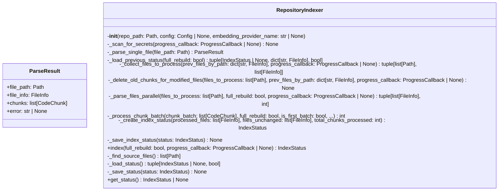

# File Overview

This file, `src/local_deepwiki/core/indexer.py`, implements the core indexing logic for the `local_deepwiki` project. It is responsible for parsing source files, chunking code, and building a searchable vector index from repository contents. The module coordinates the indexing process through a `RepositoryIndexer` class, integrating with file system operations, AST parsing, chunking, and vector storage.

Key dependencies include:
- [`local_deepwiki.config.Config`](../config.md) and [`get_config`](../config.md) for configuration
- [`local_deepwiki.core.chunker.CodeChunker`](chunker.md) for code chunking
- `local_deepwiki.core.index_manager` for managing index status and migrations
- [`local_deepwiki.core.parser.CodeParser`](parser.md) and [`ASTCache`](parser.md) for parsing
- `local_deepwiki.core.vectorstore` for vector storage
- `local_deepwiki.core.secret_detector` for secret scanning

The module also imports `asyncio`, `fnmatch`, `time`, `ThreadPoolExecutor`, `dataclass`, and `Path` from standard libraries.

---

# Classes

## ParseResult

Represents the result of parsing a single file.

### Attributes

- `file_path`: Path to the file.
- `file_info`: [FileInfo](../models.md) object containing metadata.
- `chunks`: List of [`CodeChunk`](../models.md) objects generated from the file.
- `error`: Optional error message if parsing failed.

---

## RepositoryIndexer

The [main](../export/pdf.md) class for indexing a repository. It handles scanning for secrets, parsing files, chunking code, and managing incremental updates.

### Methods

#### `__init__(self, repo_path: Path, config: Config | None = None, embedding_provider_name: str | None = None)`

Initialize the indexer.

- **Parameters**:
  - `repo_path`: Path to the repository root.
  - `config`: Optional configuration.
  - `embedding_provider_name`: Override embedding provider ("local" or "openai").

#### `_scan_for_secrets(self, progress_callback: ProgressCallback | None)`

Scan repository for hardcoded secrets before indexing.

- **Parameters**:
  - [`progress_callback`](../handlers.md): Optional callback for progress updates.

#### `_parse_single_file(self, file_path: Path)`

Parse and chunk a single file (CPU-bound, runs in thread pool).

- **Parameters**:
  - `file_path`: Path to the file to parse.
- **Returns**:
  - `ParseResult` with file info and chunks, or error message.

#### `_load_previous_status(self, full_rebuild: bool)`

Load and validate previous index status for incremental updates.

- **Parameters**:
  - `full_rebuild`: If True, skip loading previous status.
- **Returns**:
  - Tuple of (previous_status, prev_files_by_path, full_rebuild_required).

#### `_collect_files_to_process(self, prev_files_by_path: dict[str, FileInfo], progress_callback: ProgressCallback | None)`

Gather source files and determine what needs processing.

- **Parameters**:
  - `prev_files_by_path`: Hash map of previous files for O(1) lookup.
  - [`progress_callback`](../handlers.md): Optional callback for progress updates.
- **Returns**:
  - Tuple of (files_to_process, files_unchanged).

#### `_delete_old_chunks_for_modified_files(self, files_to_process: list[Path], prev_files_by_path: dict[str, FileInfo], progress_callback: ProgressCallback | None)`

Batch delete old chunks for files being re-processed.

- **Parameters**:
  - `files_to_process`: List of file paths to be processed.
  - `prev_files_by_path`: Hash map of previous files for O(1) lookup.
  - [`progress_callback`](../handlers.md): Optional callback for progress updates.

#### `_parse_files_parallel(self, files_to_process: list[Path], full_rebuild: bool, progress_callback: ProgressCallback | None)`

Handle parallel file parsing with ThreadPoolExecutor.

- **Parameters**:
  - `files_to_process`: List of file paths to parse.
  - `full_rebuild`: If True, this is a full rebuild.
  - [`progress_callback`](../handlers.md): Optional callback for progress updates.
- **Returns**:
  - Tuple of (processed_files, total_chunks_processed).

#### `_process_chunk_batch(self, chunk_batch: list[CodeChunk], full_rebuild: bool, is_first_batch: bool, progress_callback: ProgressCallback | None, current: int, total: int, is_final: bool = False)`

Process a batch of chunks and store in vector store.

- **Parameters**:
  - `chunk_batch`: List of code chunks to store.
  - `full_rebuild`: If True, may need to create table on first batch.
  - `is_first_batch`: True if this is the first batch being processed.
  - [`progress_callback`](../handlers.md): Optional callback for progress updates.
  - `current`: Current batch index.
  - `total`: Total number of batches.
  - `is_final`: Indicates if this is the final batch.
- **Returns**:
  - Number of chunks processed in this batch.

#### `_create_index_status(self, processed_files: list[FileInfo], files_unchanged: list[FileInfo], total_chunks_processed: int)`

Create the final index status with statistics.

- **Parameters**:
  - `processed_files`: List of files that were processed.
  - `files_unchanged`: List of files that were unchanged.
  - `total_chunks_processed`: Number of chunks processed in this run.
- **Returns**:
  - [`IndexStatus`](../models.md) with complete indexing results.

#### `_save_index_status(self, status: IndexStatus)`

Save the final index status and log completion.

- **Parameters**:
  - `status`: The [`IndexStatus`](../models.md) to save.

#### `index(self, full_rebuild: bool = False, progress_callback: ProgressCallback | None = None)`

Index the repository.

- **Parameters**:
  - `full_rebuild`: If True, rebuild entire index. Otherwise, incremental update.
  - [`progress_callback`](../handlers.md): Optional callback for progress updates (message, current, total).
- **Returns**:
  - [`IndexStatus`](../models.md) with indexing results.

#### `_find_source_files(self)`

Find source files in the repository (implementation not shown).

#### `_load_status(self)`

Load index status (implementation not shown).

#### `_save_status(self, status: IndexStatus)`

Save index status (implementation not shown).

#### `get_status(self)`

Get current index status (implementation not shown).

#### `search(self, query: str)`

Search the index (implementation not shown).

---

# Integration

This file integrates with the broader `local_deepwiki` system through:

- Configuration management (`local_deepwiki.config`)
- Parser and AST caching (`local_deepwiki.core.parser`)
- Chunking logic (`local_deepwiki.core.chunker`)
- Index status management (`local_deepwiki.core.index_manager`)
- Vector storage (`local_deepwiki.core.vectorstore`)
- Secret detection (`local_deepwiki.core.secret_detector`)

It is used by higher-level components such as the CLI or web service to perform repository indexing.

---

# Usage Examples

```python
from pathlib import Path
from local_deepwiki.core.indexer import RepositoryIndexer

indexer = RepositoryIndexer(
    repo_path=Path("/path/to/repo"),
    config=None,
    embedding_provider_name="local"
)

status = asyncio.run(indexer.index(full_rebuild=True))
```

## API Reference

### class `ParseResult`

Result of parsing a single file.


<details>
<summary>View Source (lines 31-37) | <a href="https://github.com/UrbanDiver/local-deepwiki-mcp/blob/[main](../export/pdf.md)/src/local_deepwiki/core/indexer.py#L31-L37">GitHub</a></summary>

```python
class ParseResult:
    """Result of parsing a single file."""

    file_path: Path
    file_info: FileInfo
    chunks: list[CodeChunk]
    error: str | None = None
```

</details>

### class `RepositoryIndexer`

Orchestrates repository indexing with incremental update support.

**Methods:**


<details>
<summary>View Source (lines 51-713) | <a href="https://github.com/UrbanDiver/local-deepwiki-mcp/blob/[main](../export/pdf.md)/src/local_deepwiki/core/indexer.py#L51-L713">GitHub</a></summary>

```python
class RepositoryIndexer:
    # Methods: __init__, _scan_for_secrets, _parse_single_file, _load_previous_status, _collect_files_to_process, _delete_old_chunks_for_modified_files, _parse_files_parallel, _process_chunk_batch, _create_index_status, _save_index_status, index, _find_source_files, _load_status, _save_status, get_status, search
```

</details>

#### `__init__`

```python
def __init__(repo_path: Path, config: Config | None = None, embedding_provider_name: str | None = None)
```

Initialize the indexer.


| [Parameter](../generators/api_docs.md) | Type | Default | Description |
|-----------|------|---------|-------------|
| `repo_path` | `Path` | - | Path to the repository root. |
| `config` | `Config | None` | `None` | Optional configuration. |
| `embedding_provider_name` | `str | None` | `None` | Override embedding provider ("local" or "openai"). |


<details>
<summary>View Source (lines 57-101) | <a href="https://github.com/UrbanDiver/local-deepwiki-mcp/blob/[main](../export/pdf.md)/src/local_deepwiki/core/indexer.py#L57-L101">GitHub</a></summary>

```python
def __init__(
        self,
        repo_path: Path,
        config: Config | None = None,
        embedding_provider_name: str | None = None,
    ):
        """Initialize the indexer.

        Args:
            repo_path: Path to the repository root.
            config: Optional configuration.
            embedding_provider_name: Override embedding provider ("local" or "openai").
        """
        self.repo_path = repo_path.resolve()
        base_config = config or get_config()

        # Create a copy with overridden embedding provider if specified
        if embedding_provider_name:
            self.config = base_config.with_embedding_provider(embedding_provider_name)  # type: ignore
        else:
            # Store a defensive copy to prevent external mutation
            self.config = base_config.model_copy(deep=True)

        self.wiki_path = self.config.get_wiki_path(self.repo_path)
        self.vector_db_path = self.config.get_vector_db_path(self.repo_path)

        # Create AST cache if enabled
        self.ast_cache: ASTCache | None = None
        if self.config.ast_cache.enabled:
            self.ast_cache = ASTCache(
                max_entries=self.config.ast_cache.max_entries,
                ttl_seconds=self.config.ast_cache.ttl_seconds,
            )
            logger.debug(
                f"AST cache enabled: max_entries={self.config.ast_cache.max_entries}, "
                f"ttl={self.config.ast_cache.ttl_seconds}s"
            )

        self.parser = CodeParser(cache=self.ast_cache)
        self.chunker = CodeChunker(self.config.chunking)
        self.embedding_provider = get_embedding_provider(self.config.embedding)
        self.vector_store = VectorStore(self.vector_db_path, self.embedding_provider)

        # Use IndexStatusManager for all status operations
        self._status_manager = IndexStatusManager()
```

</details>

#### `index`

```python
async def index(full_rebuild: bool = False, progress_callback: ProgressCallback | None = None) -> IndexStatus
```

Index the repository.  This method coordinates the indexing process by delegating to focused private methods for each phase of the operation.


| [Parameter](../generators/api_docs.md) | Type | Default | Description |
|-----------|------|---------|-------------|
| `full_rebuild` | `bool` | `False` | If True, rebuild entire index. Otherwise, incremental update. |
| [`progress_callback`](../handlers.md) | `ProgressCallback | None` | `None` | Optional callback for progress updates (message, current, total). |


<details>
<summary>View Source (lines 508-585) | <a href="https://github.com/UrbanDiver/local-deepwiki-mcp/blob/[main](../export/pdf.md)/src/local_deepwiki/core/indexer.py#L508-L585">GitHub</a></summary>

```python
async def index(
        self,
        full_rebuild: bool = False,
        progress_callback: ProgressCallback | None = None,
    ) -> IndexStatus:
        """Index the repository.

        This method coordinates the indexing process by delegating to
        focused private methods for each phase of the operation.

        Args:
            full_rebuild: If True, rebuild entire index. Otherwise, incremental update.
            progress_callback: Optional callback for progress updates (message, current, total).

        Returns:
            IndexStatus with indexing results.
        """
        # Ensure wiki directory exists
        self.wiki_path.mkdir(parents=True, exist_ok=True)

        logger.info(f"Starting indexing for repository: {self.repo_path}")
        logger.debug(f"Wiki path: {self.wiki_path}, Full rebuild: {full_rebuild}")

        # Emit INDEX_START event
        emitter = get_event_emitter()
        await emitter.emit(
            EventType.INDEX_START,
            {
                "repo_path": str(self.repo_path),
                "full_rebuild": full_rebuild,
            },
        )

        # Security: Scan for hardcoded secrets before indexing
        await self._scan_for_secrets(progress_callback)

        # Phase 1: Load previous status for incremental updates
        previous_status, prev_files_by_path, full_rebuild = self._load_previous_status(
            full_rebuild
        )

        # Phase 2: Collect files to process
        files_to_process, files_unchanged = self._collect_files_to_process(
            prev_files_by_path, progress_callback
        )

        # Phase 3: Delete old chunks for modified files (incremental only)
        if not full_rebuild and prev_files_by_path and files_to_process:
            await self._delete_old_chunks_for_modified_files(
                files_to_process, prev_files_by_path, progress_callback
            )

        # Phase 4: Parse files in parallel and store chunks
        processed_files, total_chunks_processed = await self._parse_files_parallel(
            files_to_process, full_rebuild, progress_callback
        )

        # Phase 5: Create and save index status
        status = self._create_index_status(
            processed_files, files_unchanged, total_chunks_processed
        )
        self._save_index_status(status)

        if progress_callback:
            progress_callback("Indexing complete", 1, 1)

        # Emit INDEX_COMPLETE event
        await emitter.emit(
            EventType.INDEX_COMPLETE,
            {
                "repo_path": str(self.repo_path),
                "total_files": status.total_files,
                "total_chunks": status.total_chunks,
                "languages": list(status.languages.keys()),
            },
        )

        return status
```

</details>

#### `get_status`

```python
def get_status() -> IndexStatus | None
```

Get the current indexing status.


<details>
<summary>View Source (lines 674-680) | <a href="https://github.com/UrbanDiver/local-deepwiki-mcp/blob/[main](../export/pdf.md)/src/local_deepwiki/core/indexer.py#L674-L680">GitHub</a></summary>

```python
def get_status(self) -> IndexStatus | None:
        """Get the current indexing status.

        Returns:
            IndexStatus or None if not indexed.
        """
        return self._status_manager.load(self.wiki_path)
```

</details>

#### `search`

```python
async def search(query: str, limit: int = 10, language: str | None = None) -> list[dict]
```

Search the indexed repository.


| [Parameter](../generators/api_docs.md) | Type | Default | Description |
|-----------|------|---------|-------------|
| `query` | `str` | - | Search query. |
| `limit` | `int` | `10` | Maximum results. |
| `language` | `str | None` | `None` | Optional language filter. |


<details>
<summary>View Source (lines 682-713) | <a href="https://github.com/UrbanDiver/local-deepwiki-mcp/blob/[main](../export/pdf.md)/src/local_deepwiki/core/indexer.py#L682-L713">GitHub</a></summary>

```python
async def search(
        self,
        query: str,
        limit: int = 10,
        language: str | None = None,
    ) -> list[dict]:
        """Search the indexed repository.

        Args:
            query: Search query.
            limit: Maximum results.
            language: Optional language filter.

        Returns:
            List of search result dictionaries.
        """
        results = await self.vector_store.search(query, limit=limit, language=language)
        return [
            {
                "file_path": r.chunk.file_path,
                "name": r.chunk.name,
                "type": r.chunk.chunk_type.value,
                "language": r.chunk.language.value,
                "lines": f"{r.chunk.start_line}-{r.chunk.end_line}",
                "score": r.score,
                "content": (
                    r.chunk.content[:500] + "..." if len(r.chunk.content) > 500 else r.chunk.content
                ),
                "docstring": r.chunk.docstring,
            }
            for r in results
        ]
```

</details>

## Class Diagram


```mermaid
classDiagram
    class ParseResult {
        +file_path: Path
        +file_info: FileInfo
        +chunks: list[CodeChunk]
        +error: str | None
    }
    class RepositoryIndexer {
        -__init__(repo_path: Path, config: Config | None, embedding_provider_name: str | None)
        -_scan_for_secrets(progress_callback: ProgressCallback | None) None
        -_parse_single_file(file_path: Path) ParseResult
        -_load_previous_status(full_rebuild: bool) tuple[IndexStatus | None, dict[str, FileInfo], bool]
        -_collect_files_to_process(prev_files_by_path: dict[str, FileInfo], progress_callback: ProgressCallback | None) tuple[list[Path], list[FileInfo]]
        -_delete_old_chunks_for_modified_files(files_to_process: list[Path], prev_files_by_path: dict[str, FileInfo], progress_callback: ProgressCallback | None) None
        -_parse_files_parallel(files_to_process: list[Path], full_rebuild: bool, progress_callback: ProgressCallback | None) tuple[list[FileInfo], int]
        -_process_chunk_batch(chunk_batch: list[CodeChunk], full_rebuild: bool, is_first_batch: bool, ...) int
        -_create_index_status(processed_files: list[FileInfo], files_unchanged: list[FileInfo], total_chunks_processed: int) IndexStatus
        -_save_index_status(status: IndexStatus) None
        +index(full_rebuild: bool, progress_callback: ProgressCallback | None) IndexStatus
        -_find_source_files() list[Path]
        -_load_status() tuple[IndexStatus | None, bool]
        -_save_status(status: IndexStatus) None
        +get_status() IndexStatus | None
    }
```

## Call Graph


```mermaid
flowchart TD
    N0[ASTCache]
    N1[CodeChunker]
    N2[CodeParser]
    N3[IndexStatusManager]
    N4[RepositoryIndexer.__init__]
    N5[RepositoryIndexer._collect_...]
    N6[RepositoryIndexer._create_i...]
    N7[RepositoryIndexer._delete_o...]
    N8[RepositoryIndexer._find_sou...]
    N9[RepositoryIndexer._parse_fi...]
    N10[RepositoryIndexer._parse_si...]
    N11[RepositoryIndexer._process_...]
    N12[RepositoryIndexer._save_ind...]
    N13[RepositoryIndexer._scan_for...]
    N14[RepositoryIndexer.index]
    N15[VectorStore]
    N16[emit]
    N17[get_config]
    N18[get_embedding_provider]
    N19[get_event_emitter]
    N20[get_file_info]
    N21[get_vector_db_path]
    N22[get_wiki_path]
    N23[load_with_migration_info]
    N24[model_copy]
    N25[progress_callback]
    N26[resolve]
    N27[save]
    N28[scan_repository_for_secrets]
    N29[with_embedding_provider]
    N4 --> N26
    N4 --> N17
    N4 --> N29
    N4 --> N24
    N4 --> N22
    N4 --> N21
    N4 --> N0
    N4 --> N2
    N4 --> N1
    N4 --> N18
    N4 --> N15
    N4 --> N3
    N13 --> N25
    N13 --> N28
    N13 --> N19
    N13 --> N16
    N10 --> N20
    N5 --> N25
    N5 --> N20
    N7 --> N20
    N7 --> N25
    N9 --> N25
    N9 --> N19
    N9 --> N16
    N11 --> N25
    N12 --> N27
    N14 --> N19
    N14 --> N16
    N14 --> N25
    classDef func fill:#e1f5fe
    class N0,N1,N2,N3,N15,N16,N17,N18,N19,N20,N21,N22,N23,N24,N25,N26,N27,N28,N29 func
    classDef method fill:#fff3e0
    class N4,N5,N6,N7,N8,N9,N10,N11,N12,N13,N14 method
```

## Used By

Functions and methods in this file and their callers:

- **[`ASTCache`](parser.md)**: called by `RepositoryIndexer.__init__`
- **[`CodeChunker`](chunker.md)**: called by `RepositoryIndexer.__init__`
- **[`CodeParser`](parser.md)**: called by `RepositoryIndexer.__init__`
- **[`IndexStatusManager`](index_manager.md)**: called by `RepositoryIndexer.__init__`
- **`ParseResult`**: called by `RepositoryIndexer._parse_single_file`
- **`Path`**: called by `RepositoryIndexer._find_source_files`
- **`ThreadPoolExecutor`**: called by `RepositoryIndexer._parse_files_parallel`
- **[`VectorStore`](vectorstore.md)**: called by `RepositoryIndexer.__init__`
- **`_collect_files_to_process`**: called by `RepositoryIndexer.index`
- **`_create_index_status`**: called by `RepositoryIndexer.index`
- **`_delete_old_chunks_for_modified_files`**: called by `RepositoryIndexer.index`
- **`_find_source_files`**: called by `RepositoryIndexer._collect_files_to_process`
- **`_load_previous_status`**: called by `RepositoryIndexer.index`
- **`_parse_files_parallel`**: called by `RepositoryIndexer.index`
- **`_process_chunk_batch`**: called by `RepositoryIndexer._parse_files_parallel`
- **`_save_index_status`**: called by `RepositoryIndexer.index`
- **`_scan_for_secrets`**: called by `RepositoryIndexer.index`
- **`add`**: called by `RepositoryIndexer._find_source_files`
- **`add_chunks`**: called by `RepositoryIndexer._process_chunk_batch`
- **`as_completed`**: called by `RepositoryIndexer._parse_files_parallel`
- **`chunk_file`**: called by `RepositoryIndexer._parse_single_file`
- **`compile`**: called by `RepositoryIndexer._find_source_files`
- **`create`**: called by `RepositoryIndexer._create_index_status`
- **`create_or_update_table`**: called by `RepositoryIndexer._process_chunk_batch`
- **`delete_chunks_by_files`**: called by `RepositoryIndexer._delete_old_chunks_for_modified_files`
- **`detect_language`**: called by `RepositoryIndexer._find_source_files`
- **`emit`**: called by `RepositoryIndexer._parse_files_parallel`, `RepositoryIndexer._scan_for_secrets`, `RepositoryIndexer.index`
- **[`get_config`](../config.md)**: called by `RepositoryIndexer.__init__`
- **`get_embedding_provider`**: called by `RepositoryIndexer.__init__`
- **[`get_event_emitter`](../events.md)**: called by `RepositoryIndexer._parse_files_parallel`, `RepositoryIndexer._scan_for_secrets`, `RepositoryIndexer.index`
- **`get_file_info`**: called by `RepositoryIndexer._collect_files_to_process`, `RepositoryIndexer._delete_old_chunks_for_modified_files`, `RepositoryIndexer._parse_single_file`
- **`get_stats`**: called by `RepositoryIndexer._save_index_status`
- **`get_vector_db_path`**: called by `RepositoryIndexer.__init__`
- **`get_wiki_path`**: called by `RepositoryIndexer.__init__`
- **`load`**: called by `RepositoryIndexer.get_status`
- **`load_with_migration_info`**: called by `RepositoryIndexer._load_previous_status`, `RepositoryIndexer._load_status`
- **`match`**: called by `RepositoryIndexer._find_source_files`
- **`merge_files`**: called by `RepositoryIndexer._create_index_status`
- **`mkdir`**: called by `RepositoryIndexer.index`
- **`model_copy`**: called by `RepositoryIndexer.__init__`
- **[`progress_callback`](../handlers.md)**: called by `RepositoryIndexer._collect_files_to_process`, `RepositoryIndexer._delete_old_chunks_for_modified_files`, `RepositoryIndexer._parse_files_parallel`, `RepositoryIndexer._process_chunk_batch`, `RepositoryIndexer._scan_for_secrets`, `RepositoryIndexer.index`
- **`relative_to`**: called by `RepositoryIndexer._find_source_files`
- **`resolve`**: called by `RepositoryIndexer.__init__`
- **`result`**: called by `RepositoryIndexer._parse_files_parallel`
- **`save`**: called by `RepositoryIndexer._save_index_status`, `RepositoryIndexer._save_status`
- **[`scan_repository_for_secrets`](secret_detector.md)**: called by `RepositoryIndexer._scan_for_secrets`
- **`search`**: called by `RepositoryIndexer.search`
- **`stat`**: called by `RepositoryIndexer._find_source_files`
- **`submit`**: called by `RepositoryIndexer._parse_files_parallel`
- **`time`**: called by `RepositoryIndexer._parse_files_parallel`
- **`translate`**: called by `RepositoryIndexer._find_source_files`
- **[`walk`](../generators/test_examples.md)**: called by `RepositoryIndexer._find_source_files`
- **`with_embedding_provider`**: called by `RepositoryIndexer.__init__`

## Usage Examples

*Examples extracted from test files*

### Test that old schema versions need migration

From `test_indexer.py::TestSchemaMigration::test_needs_migration_old_version`:

```python
indexed_at=1.0,
    total_files=10,
    total_chunks=100,
    schema_version=1,
)
# If current version is > 1, migration is needed
if CURRENT_SCHEMA_VERSION > 1:
    assert _needs_migration(status) is True
```

### Test that current schema version doesn't need migration

From `test_indexer.py::TestSchemaMigration::test_needs_migration_current_version`:

```python
indexed_at=1.0,
    total_files=10,
    total_chunks=100,
    schema_version=CURRENT_SCHEMA_VERSION,
)
assert _needs_migration(status) is False
```


## Last Modified

| Entity | Type | Author | Date | Commit |
|--------|------|--------|------|--------|
| `RepositoryIndexer` | class | Brian Breidenbach | 1 week ago | `9844731` Phase 3: Implement input va... |
| `_scan_for_secrets` | method | Brian Breidenbach | 1 week ago | `9844731` Phase 3: Implement input va... |
| `index` | method | Brian Breidenbach | 1 week ago | `9844731` Phase 3: Implement input va... |
| `__init__` | method | Brian Breidenbach | 1 week ago | `e899c6c` Add three high-value enhanc... |
| `_save_index_status` | method | Brian Breidenbach | 1 week ago | `e899c6c` Add three high-value enhanc... |
| `_load_previous_status` | method | Brian Breidenbach | 1 week ago | `d7c79d3` Add three quick-win enhance... |
| `_create_index_status` | method | Brian Breidenbach | 1 week ago | `d7c79d3` Add three quick-win enhance... |
| `_load_status` | method | Brian Breidenbach | 1 week ago | `d7c79d3` Add three quick-win enhance... |
| `_save_status` | method | Brian Breidenbach | 1 week ago | `d7c79d3` Add three quick-win enhance... |
| `get_status` | method | Brian Breidenbach | 1 week ago | `d7c79d3` Add three quick-win enhance... |
| `_parse_files_parallel` | method | Brian Breidenbach | 1 week ago | `a0b2f83` Integrate [event](../../../coverage_openai_embeddings/coverage_html_cb_dd2e7eb5.md) system into... |
| `_collect_files_to_process` | method | Brian Breidenbach | 2 weeks ago | `85c8346` Performance optimizations a... |
| `_delete_old_chunks_for_modified_files` | method | Brian Breidenbach | 2 weeks ago | `85c8346` Performance optimizations a... |
| `_process_chunk_batch` | method | Brian Breidenbach | 2 weeks ago | `85c8346` Performance optimizations a... |
| `ParseResult` | class | Brian Breidenbach | 2 weeks ago | `06f832d` Add parallel processing and... |
| `_parse_single_file` | method | Brian Breidenbach | 2 weeks ago | `06f832d` Add parallel processing and... |
| `_find_source_files` | method | Brian Breidenbach | 2 weeks ago | `06f832d` Add parallel processing and... |
| `search` | method | Brian Breidenbach | 3 weeks ago | `c568951` Add input validation, type ... |

## Additional Source Code

Source code for functions and methods not listed in the API Reference above.

#### `_scan_for_secrets`

<details>
<summary>View Source (lines 103-157) | <a href="https://github.com/UrbanDiver/local-deepwiki-mcp/blob/[main](../export/pdf.md)/src/local_deepwiki/core/indexer.py#L103-L157">GitHub</a></summary>

```python
async def _scan_for_secrets(
        self,
        progress_callback: ProgressCallback | None,
    ) -> None:
        """Scan repository for hardcoded secrets before indexing.

        This method warns about potential secrets but does not fail indexing.
        Users should remediate the findings, but indexing can proceed.

        Args:
            progress_callback: Optional callback for progress updates.
        """
        if progress_callback:
            progress_callback("Scanning for hardcoded secrets...", 0, 1)

        logger.info("Scanning for hardcoded secrets...")

        secret_findings = scan_repository_for_secrets(self.repo_path)

        if secret_findings:
            total_secrets = sum(len(findings) for findings in secret_findings.values())
            logger.warning(
                f"SECURITY WARNING: Found {total_secrets} potential secret(s) "
                f"in {len(secret_findings)} file(s)"
            )

            # Log each finding with recommendations
            for file_path, findings in secret_findings.items():
                for finding in findings:
                    logger.warning(
                        f"  [{finding.secret_type.value}] {finding.file_path}:{finding.line_number} "
                        f"(confidence: {finding.confidence:.0%})"
                    )
                    logger.warning(f"    Context: {finding.context}")
                    logger.warning(f"    Recommendation: {finding.recommendation}")

            logger.warning(
                "Please remediate these findings before sharing or deploying this code. "
                "Indexing will continue, but secrets may appear in search results."
            )

            # Emit event for secret detection
            emitter = get_event_emitter()
            await emitter.emit(
                EventType.INDEX_ERROR,
                {
                    "repo_path": str(self.repo_path),
                    "error": f"Found {total_secrets} potential hardcoded secrets",
                    "severity": "warning",
                    "secret_count": total_secrets,
                    "affected_files": len(secret_findings),
                },
            )
        else:
            logger.info("No hardcoded secrets detected")
```

</details>


#### `_parse_single_file`

<details>
<summary>View Source (lines 159-181) | <a href="https://github.com/UrbanDiver/local-deepwiki-mcp/blob/[main](../export/pdf.md)/src/local_deepwiki/core/indexer.py#L159-L181">GitHub</a></summary>

```python
def _parse_single_file(self, file_path: Path) -> ParseResult:
        """Parse and chunk a single file (CPU-bound, runs in thread pool).

        Args:
            file_path: Path to the file to parse.

        Returns:
            ParseResult with file info and chunks, or error message.
        """
        try:
            file_info = self.parser.get_file_info(file_path, self.repo_path)
            chunks = list(self.chunker.chunk_file(file_path, self.repo_path))
            file_info.chunk_count = len(chunks)
            return ParseResult(file_path=file_path, file_info=file_info, chunks=chunks)
        except (OSError, ValueError, RuntimeError, UnicodeDecodeError) as e:
            # Return error result instead of raising
            file_info = self.parser.get_file_info(file_path, self.repo_path)
            return ParseResult(
                file_path=file_path,
                file_info=file_info,
                chunks=[],
                error=str(e),
            )
```

</details>


#### `_load_previous_status`

<details>
<summary>View Source (lines 183-213) | <a href="https://github.com/UrbanDiver/local-deepwiki-mcp/blob/[main](../export/pdf.md)/src/local_deepwiki/core/indexer.py#L183-L213">GitHub</a></summary>

```python
def _load_previous_status(
        self, full_rebuild: bool
    ) -> tuple[IndexStatus | None, dict[str, FileInfo], bool]:
        """Load and validate previous index status for incremental updates.

        Args:
            full_rebuild: If True, skip loading previous status.

        Returns:
            Tuple of (previous_status, prev_files_by_path, full_rebuild_required).
            prev_files_by_path is a hash map for O(1) lookups.
            full_rebuild_required may be True if schema migration requires it.
        """
        if full_rebuild:
            return None, {}, full_rebuild

        previous_status, requires_rebuild = self._status_manager.load_with_migration_info(
            self.wiki_path
        )
        if requires_rebuild:
            logger.info("Schema migration requires full rebuild")
            return None, {}, True

        if previous_status:
            logger.debug(f"Loaded previous index status: {previous_status.total_files} files")
            # Pre-build hash map for O(1) lookups instead of O(N) linear scan per file
            # This reduces O(N*M) to O(N+M) for file comparison
            prev_files_by_path = {f.path: f for f in previous_status.files}
            return previous_status, prev_files_by_path, full_rebuild

        return None, {}, full_rebuild
```

</details>


#### `_collect_files_to_process`

<details>
<summary>View Source (lines 215-257) | <a href="https://github.com/UrbanDiver/local-deepwiki-mcp/blob/[main](../export/pdf.md)/src/local_deepwiki/core/indexer.py#L215-L257">GitHub</a></summary>

```python
def _collect_files_to_process(
        self,
        prev_files_by_path: dict[str, FileInfo],
        progress_callback: ProgressCallback | None,
    ) -> tuple[list[Path], list[FileInfo]]:
        """Gather source files and determine what needs processing.

        Args:
            prev_files_by_path: Hash map of previous files for O(1) lookup.
            progress_callback: Optional callback for progress updates.

        Returns:
            Tuple of (files_to_process, files_unchanged).
        """
        source_files = list(self._find_source_files())
        logger.info(f"Found {len(source_files)} source files to consider")

        if progress_callback:
            progress_callback("Found source files", len(source_files), len(source_files))

        files_to_process: list[Path] = []
        files_unchanged: list[FileInfo] = []

        for file_path in source_files:
            file_info = self.parser.get_file_info(file_path, self.repo_path)

            if prev_files_by_path:
                # Check if file has changed using O(1) dict lookup
                prev_file = prev_files_by_path.get(file_info.path)
                if prev_file and prev_file.hash == file_info.hash:
                    files_unchanged.append(prev_file)
                    continue

            files_to_process.append(file_path)

        if progress_callback:
            progress_callback(
                f"Processing {len(files_to_process)} files ({len(files_unchanged)} unchanged)",
                0,
                len(files_to_process),
            )

        return files_to_process, files_unchanged
```

</details>


#### `_delete_old_chunks_for_modified_files`

<details>
<summary>View Source (lines 259-290) | <a href="https://github.com/UrbanDiver/local-deepwiki-mcp/blob/[main](../export/pdf.md)/src/local_deepwiki/core/indexer.py#L259-L290">GitHub</a></summary>

```python
async def _delete_old_chunks_for_modified_files(
        self,
        files_to_process: list[Path],
        prev_files_by_path: dict[str, FileInfo],
        progress_callback: ProgressCallback | None,
    ) -> None:
        """Batch delete old chunks for files being re-processed.

        This avoids N+1 delete problem by doing a single batch delete upfront.

        Args:
            files_to_process: List of file paths to be processed.
            prev_files_by_path: Hash map of previous files for O(1) lookup.
            progress_callback: Optional callback for progress updates.
        """
        files_to_delete = []
        for file_path in files_to_process:
            file_info = self.parser.get_file_info(file_path, self.repo_path)
            # Only delete if file existed in previous index (was modified, not new)
            # Use O(1) dict lookup instead of O(N) linear scan
            if file_info.path in prev_files_by_path:
                files_to_delete.append(file_info.path)

        if files_to_delete:
            if progress_callback:
                progress_callback(
                    f"Removing old chunks for {len(files_to_delete)} modified files...",
                    0,
                    len(files_to_process),
                )
            await self.vector_store.delete_chunks_by_files(files_to_delete)
            logger.debug(f"Batch deleted chunks for {len(files_to_delete)} modified files")
```

</details>


#### `_parse_files_parallel`

<details>
<summary>View Source (lines 292-420) | <a href="https://github.com/UrbanDiver/local-deepwiki-mcp/blob/[main](../export/pdf.md)/src/local_deepwiki/core/indexer.py#L292-L420">GitHub</a></summary>

```python
async def _parse_files_parallel(
        self,
        files_to_process: list[Path],
        full_rebuild: bool,
        progress_callback: ProgressCallback | None,
    ) -> tuple[list[FileInfo], int]:
        """Handle parallel file parsing with ThreadPoolExecutor.

        Uses multiple threads to parse files concurrently, significantly speeding up
        indexing for large repositories. Embedding generation remains sequential
        to respect API rate limits.

        Args:
            files_to_process: List of file paths to parse.
            full_rebuild: If True, this is a full rebuild (affects table creation).
            progress_callback: Optional callback for progress updates.

        Returns:
            Tuple of (processed_files, total_chunks_processed).
        """
        from concurrent.futures import as_completed

        batch_size = self.config.chunking.batch_size
        parallel_workers = self.config.chunking.parallel_workers
        chunk_batch: list[CodeChunk] = []
        processed_files: list[FileInfo] = []
        total_chunks_processed = 0
        is_first_batch = True
        error_count = 0

        file_count = len(files_to_process)
        if file_count == 0:
            logger.info("No files to parse")
            return processed_files, total_chunks_processed

        logger.info(
            f"Starting parallel file parsing: {file_count} files with "
            f"{parallel_workers} workers"
        )
        parse_start_time = time.time()

        with ThreadPoolExecutor(max_workers=parallel_workers) as executor:
            futures = {
                executor.submit(self._parse_single_file, file_path): file_path
                for file_path in files_to_process
            }

            for i, future in enumerate(as_completed(futures)):
                file_path = futures[future]
                if progress_callback:
                    progress_callback(f"Parsing {file_path.name}", i, file_count)

                result = future.result()

                if result.error:
                    error_count += 1
                    logger.warning(f"Error processing {result.file_path}: {result.error}")
                    if progress_callback:
                        progress_callback(
                            f"Error processing {result.file_path}: {result.error}",
                            i,
                            file_count,
                        )
                    # Emit INDEX_ERROR event for file processing errors
                    emitter = get_event_emitter()
                    await emitter.emit(
                        EventType.INDEX_ERROR,
                        {
                            "file_path": str(result.file_path),
                            "error": result.error,
                        },
                    )
                    continue

                chunk_batch.extend(result.chunks)
                processed_files.append(result.file_info)

                # Emit INDEX_FILE event for successfully parsed file
                emitter = get_event_emitter()
                await emitter.emit(
                    EventType.INDEX_FILE,
                    {
                        "file_path": str(result.file_path),
                        "language": result.file_info.language.value if result.file_info.language else None,
                        "chunk_count": len(result.chunks),
                    },
                )

                # Process batch if it reaches the batch size
                if len(chunk_batch) >= batch_size:
                    chunks_stored = await self._process_chunk_batch(
                        chunk_batch,
                        full_rebuild,
                        is_first_batch,
                        progress_callback,
                        i,
                        file_count,
                    )
                    total_chunks_processed += chunks_stored
                    is_first_batch = False
                    chunk_batch = []

        # Process any remaining chunks in the final batch
        if chunk_batch:
            chunks_stored = await self._process_chunk_batch(
                chunk_batch,
                full_rebuild,
                is_first_batch,
                progress_callback,
                file_count,
                file_count,
                is_final=True,
            )
            total_chunks_processed += chunks_stored

        # Log performance metrics
        parse_duration = time.time() - parse_start_time
        files_parsed = len(processed_files)
        files_per_second = files_parsed / parse_duration if parse_duration > 0 else 0
        chunks_per_second = total_chunks_processed / parse_duration if parse_duration > 0 else 0

        logger.info(
            f"Parallel parsing complete: {files_parsed} files, "
            f"{total_chunks_processed} chunks in {parse_duration:.2f}s "
            f"({files_per_second:.1f} files/s, {chunks_per_second:.1f} chunks/s, "
            f"{parallel_workers} workers, {error_count} errors)"
        )

        return processed_files, total_chunks_processed
```

</details>


#### `_process_chunk_batch`

<details>
<summary>View Source (lines 422-459) | <a href="https://github.com/UrbanDiver/local-deepwiki-mcp/blob/[main](../export/pdf.md)/src/local_deepwiki/core/indexer.py#L422-L459">GitHub</a></summary>

```python
async def _process_chunk_batch(
        self,
        chunk_batch: list[CodeChunk],
        full_rebuild: bool,
        is_first_batch: bool,
        progress_callback: ProgressCallback | None,
        current: int,
        total: int,
        is_final: bool = False,
    ) -> int:
        """Process a batch of chunks and store in vector store.

        Args:
            chunk_batch: List of code chunks to store.
            full_rebuild: If True, may need to create table on first batch.
            is_first_batch: True if this is the first batch being processed.
            progress_callback: Optional callback for progress updates.
            current: Current progress index.
            total: Total number of files being processed.
            is_final: True if this is the final batch.

        Returns:
            Number of chunks processed.
        """
        batch_type = "final batch" if is_final else "batch"
        if progress_callback:
            progress_callback(
                f"Storing {batch_type} of {len(chunk_batch)} chunks...",
                current,
                total,
            )

        if full_rebuild and is_first_batch:
            await self.vector_store.create_or_update_table(chunk_batch)
        else:
            await self.vector_store.add_chunks(chunk_batch)

        return len(chunk_batch)
```

</details>


#### `_create_index_status`

<details>
<summary>View Source (lines 461-485) | <a href="https://github.com/UrbanDiver/local-deepwiki-mcp/blob/[main](../export/pdf.md)/src/local_deepwiki/core/indexer.py#L461-L485">GitHub</a></summary>

```python
def _create_index_status(
        self,
        processed_files: list[FileInfo],
        files_unchanged: list[FileInfo],
        total_chunks_processed: int,
    ) -> IndexStatus:
        """Create the final index status with statistics.

        Args:
            processed_files: List of files that were processed.
            files_unchanged: List of files that were unchanged.
            total_chunks_processed: Number of chunks processed in this run.

        Returns:
            IndexStatus with complete indexing results.
        """
        all_files, total_chunks = self._status_manager.merge_files(
            processed_files, files_unchanged, total_chunks_processed
        )

        return self._status_manager.create(
            repo_path=self.repo_path,
            files=all_files,
            total_chunks=total_chunks,
        )
```

</details>


#### `_save_index_status`

<details>
<summary>View Source (lines 487-506) | <a href="https://github.com/UrbanDiver/local-deepwiki-mcp/blob/[main](../export/pdf.md)/src/local_deepwiki/core/indexer.py#L487-L506">GitHub</a></summary>

```python
def _save_index_status(self, status: IndexStatus) -> None:
        """Save the final index status and log completion.

        Args:
            status: The IndexStatus to save.
        """
        self._status_manager.save(self.wiki_path, status)
        logger.info(
            f"Indexing complete: {status.total_files} files, "
            f"{status.total_chunks} chunks, languages: {list(status.languages.keys())}"
        )

        # Log AST cache statistics if enabled
        if self.ast_cache is not None:
            cache_stats = self.ast_cache.get_stats()
            logger.info(
                f"AST cache stats: hits={cache_stats['hits']}, misses={cache_stats['misses']}, "
                f"hit_rate={cache_stats['hit_rate']:.2%}, entries={cache_stats['total_entries']}, "
                f"memory={cache_stats['estimated_memory_bytes'] / 1024:.1f}KB"
            )
```

</details>


#### `_find_source_files`

<details>
<summary>View Source (lines 587-655) | <a href="https://github.com/UrbanDiver/local-deepwiki-mcp/blob/[main](../export/pdf.md)/src/local_deepwiki/core/indexer.py#L587-L655">GitHub</a></summary>

```python
def _find_source_files(self) -> list[Path]:
        """Find all source files in the repository.

        Uses os.walk() with early directory filtering to skip excluded
        directories entirely (e.g., node_modules, .git, vendor) instead
        of traversing them and checking each file.

        Returns:
            List of paths to source files.
        """
        import os
        import re

        files = []
        exclude_patterns = self.config.parsing.exclude_patterns
        max_size = self.config.parsing.max_file_size

        # Extract directory names to skip entirely (patterns like "node_modules/**")
        skip_dirs = set()
        file_patterns = []
        for pattern in exclude_patterns:
            # Patterns like "node_modules/**" or ".git/**" -> skip the directory
            if pattern.endswith("/**"):
                skip_dirs.add(pattern[:-3])
            else:
                file_patterns.append(pattern)

        # Compile patterns for faster matching
        compiled_patterns = [re.compile(fnmatch.translate(p)) for p in file_patterns]

        for root, dirs, filenames in os.walk(self.repo_path):
            root_path = Path(root)
            rel_root = root_path.relative_to(self.repo_path)

            # Early directory filtering - modify dirs in-place to skip subdirs
            dirs[:] = [
                d for d in dirs
                if d not in skip_dirs
                and str(rel_root / d) not in skip_dirs
                and not d.startswith(".")  # Skip hidden directories
            ]

            for filename in filenames:
                file_path = root_path / filename
                rel_path = str(file_path.relative_to(self.repo_path))

                # Check against compiled file patterns
                if any(p.match(rel_path) for p in compiled_patterns):
                    continue

                # Check file size
                try:
                    if file_path.stat().st_size > max_size:
                        continue
                except OSError:
                    continue

                # Check if language is supported
                language = self.parser.detect_language(file_path)
                if language is None:
                    continue

                # Check if language is in configured list
                if language.value not in self.config.parsing.languages:
                    continue

                files.append(file_path)

        return files
```

</details>


#### `_load_status`

<details>
<summary>View Source (lines 657-664) | <a href="https://github.com/UrbanDiver/local-deepwiki-mcp/blob/[main](../export/pdf.md)/src/local_deepwiki/core/indexer.py#L657-L664">GitHub</a></summary>

```python
def _load_status(self) -> tuple[IndexStatus | None, bool]:
        """Load previous indexing status and check for migration needs.

        Returns:
            Tuple of (IndexStatus or None, requires_rebuild).
            requires_rebuild is True if the index should be fully rebuilt.
        """
        return self._status_manager.load_with_migration_info(self.wiki_path)
```

</details>


#### `_save_status`

<details>
<summary>View Source (lines 666-672) | <a href="https://github.com/UrbanDiver/local-deepwiki-mcp/blob/[main](../export/pdf.md)/src/local_deepwiki/core/indexer.py#L666-L672">GitHub</a></summary>

```python
def _save_status(self, status: IndexStatus) -> None:
        """Save indexing status.

        Args:
            status: The IndexStatus to save.
        """
        self._status_manager.save(self.wiki_path, status)
```

</details>

## Relevant Source Files

- `src/local_deepwiki/core/indexer.py:31-37`
