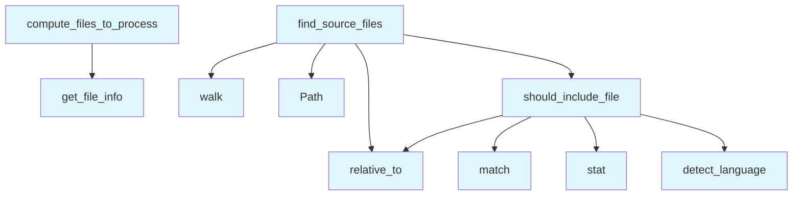

# File: `src/local_deepwiki/core/indexer_files.py`

## File Overview

This file provides core file-processing utilities used by the [`RepositoryIndexer`](indexer.md) to manage source files during indexing. It encapsulates logic for discovering which files to include, determining which files need re-processing, and detecting files that have been deleted since the last index.

The module is designed to be imported and used by the [`RepositoryIndexer`](indexer.md) class, and not intended for direct external use. It handles file traversal, filtering, and comparison logic to support efficient incremental indexing.

## Key Concepts

### File Inclusion Logic
The `should_include_file` function implements a multi-layered filter to determine whether a file should be indexed:
- **Size Check**: Files exceeding a configured maximum size are skipped.
- **Pattern Matching**: Files matching pre-compiled exclusion patterns are excluded.
- **[Language](../models/foundation.md) Detection**: Uses [`CodeParser`](parser/code_parser.md) to detect the file’s language and ensures it is in the configured list of supported languages.

This design allows for efficient early filtering to avoid unnecessary processing of large or unsupported files.

### Incremental Indexing
The `compute_files_to_process` function supports incremental indexing by comparing file hashes:
- It determines which files have changed since the last index.
- Files with matching hashes are considered unchanged and reused from the previous index.
- This avoids redundant parsing and embedding, improving performance.

### Directory Traversal Optimization
The `find_source_files` function uses `os.walk` with early directory filtering:
- It modifies `dirs` in-place to skip directories that are known to be excluded (e.g., `.git`, `node_modules`).
- This avoids descending into directories that are not relevant to indexing, improving traversal speed.

## Integration

This file is used internally by the [`RepositoryIndexer`](indexer.md) class, which coordinates the indexing process. The functions are imported and called by the indexer to:
- Discover source files (`find_source_files`)
- Determine which files need re-processing (`compute_files_to_process`)
- Detect deleted files (`detect_deleted_files`)

It depends on:
- [`CodeParser`](parser/code_parser.md) for language detection and file hashing
- [`FileInfo`](../models/chunks.md) and [`ProgressCallback`](../models/foundation.md) for index metadata and progress tracking

It integrates with the [`Config`](../config/models.md) object to access configuration values like `max_file_size` and `languages`.

## Design Notes

### Why `should_include_file`?
The function centralizes file inclusion logic, ensuring that all indexing logic is consistent. It combines multiple checks to avoid unnecessary work and to support configuration-driven filtering.

### Why `compute_files_to_process`?
This function is critical for performance in large repositories. By comparing file hashes, it avoids reprocessing unchanged files. The use of `prev_files_by_path` as a dictionary allows for fast lookups.

### Why Early Directory Filtering in `find_source_files`?
Early filtering using `dirs[:] = [...]` avoids descending into directories that are known to be irrelevant, such as `.git` or `node_modules`. This improves performance and reduces I/O overhead.

### Handling `OSError` in `should_include_file`
The code catches `OSError` when accessing file stats, which can occur if a file is inaccessible due to permissions or race conditions. Returning `False` in such cases ensures that the indexing process continues without crashing.

### Why Not Direct External Use?
This file is not meant to be imported or used directly by external modules. It's a helper module that is part of the internal logic of [`RepositoryIndexer`](indexer.md), and its functions are designed to be called in a specific sequence as part of the indexing workflow.

## API Reference

### Functions

#### `should_include_file`

```python
def should_include_file(file_path: Path, repo_path: Path, max_file_size: int, compiled_patterns: list, parser: "CodeParser", languages: list[str]) -> bool
```

Return True if the file should be included in the index.  Checks file size, compiled exclude patterns, language support, and whether the language is in the configured list.


| Parameter | Type | Default | Description |
|-----------|------|---------|-------------|
| `file_path` | `Path` | - | Absolute path to the candidate file. |
| `repo_path` | `Path` | - | Root of the repository (used to compute the relative path). |
| `max_file_size` | `int` | - | Maximum file size in bytes; larger files are skipped. |
| `compiled_patterns` | `list` | - | Pre-compiled regex patterns for exclude matching. |
| `parser` | `"CodeParser"` | - | CodeParser used to detect the file's language. |
| `languages` | `list[str]` | - | List of language values that are enabled in config. |

**Returns:** `bool`


<details>
<summary>View Source (lines 21-63) | <a href="https://github.com/UrbanDiver/local-deepwiki-mcp/blob/main/src/local_deepwiki/core/indexer_files.py#L21-L63">GitHub</a></summary>

```python
def should_include_file(
    file_path: Path,
    repo_path: Path,
    max_file_size: int,
    compiled_patterns: list,
    parser: "CodeParser",
    languages: list[str],
) -> bool:
    """Return True if the file should be included in the index.

    Checks file size, compiled exclude patterns, language support, and whether
    the language is in the configured list.

    Args:
        file_path: Absolute path to the candidate file.
        repo_path: Root of the repository (used to compute the relative path).
        max_file_size: Maximum file size in bytes; larger files are skipped.
        compiled_patterns: Pre-compiled regex patterns for exclude matching.
        parser: CodeParser used to detect the file's language.
        languages: List of language values that are enabled in config.

    Returns:
        True if the file passes all checks and should be indexed.
    """
    rel_path = str(file_path.relative_to(repo_path))

    if any(p.match(rel_path) for p in compiled_patterns):
        return False

    try:
        if file_path.stat().st_size > max_file_size:
            return False
    except OSError:
        return False

    language = parser.detect_language(file_path)
    if language is None:
        return False

    if language.value not in languages:
        return False

    return True
```

</details>

#### `find_source_files`

```python
def find_source_files(repo_path: Path, parser: "CodeParser", max_file_size: int, skip_dirs: set[str], compiled_patterns: list, languages: list[str]) -> list[Path]
```

Walk the repository and return all indexable source files.  Uses ``os.walk`` with early directory filtering to avoid traversing excluded directories (e.g. ``node_modules``, ``.git``, ``vendor``) entirely.


| Parameter | Type | Default | Description |
|-----------|------|---------|-------------|
| `repo_path` | `Path` | - | Root of the repository to scan. |
| `parser` | `"CodeParser"` | - | CodeParser used to detect file languages. |
| `max_file_size` | `int` | - | Maximum file size in bytes; larger files are skipped. |
| `skip_dirs` | `set[str]` | - | Directory names (or relative paths) to skip entirely. |
| `compiled_patterns` | `list` | - | Pre-compiled regex patterns for exclude matching. |
| `languages` | `list[str]` | - | List of language values enabled in config. |

**Returns:** `list[Path]`


<details>
<summary>View Source (lines 66-117) | <a href="https://github.com/UrbanDiver/local-deepwiki-mcp/blob/main/src/local_deepwiki/core/indexer_files.py#L66-L117">GitHub</a></summary>

```python
def find_source_files(
    repo_path: Path,
    parser: "CodeParser",
    max_file_size: int,
    skip_dirs: set[str],
    compiled_patterns: list,
    languages: list[str],
) -> list[Path]:
    """Walk the repository and return all indexable source files.

    Uses ``os.walk`` with early directory filtering to avoid traversing excluded
    directories (e.g. ``node_modules``, ``.git``, ``vendor``) entirely.

    Args:
        repo_path: Root of the repository to scan.
        parser: CodeParser used to detect file languages.
        max_file_size: Maximum file size in bytes; larger files are skipped.
        skip_dirs: Directory names (or relative paths) to skip entirely.
        compiled_patterns: Pre-compiled regex patterns for exclude matching.
        languages: List of language values enabled in config.

    Returns:
        List of absolute paths to source files that should be indexed.
    """
    files: list[Path] = []

    for root, dirs, filenames in os.walk(repo_path):
        root_path = Path(root)
        rel_root = root_path.relative_to(repo_path)

        # Early directory filtering — modify dirs in-place to skip subdirs.
        dirs[:] = [
            d
            for d in dirs
            if d not in skip_dirs
            and str(rel_root / d) not in skip_dirs
            and not d.startswith(".")  # Skip hidden directories
        ]

        for filename in filenames:
            file_path = root_path / filename
            if should_include_file(
                file_path,
                repo_path,
                max_file_size,
                compiled_patterns,
                parser,
                languages,
            ):
                files.append(file_path)

    return files
```

</details>

#### `compute_files_to_process`

```python
def compute_files_to_process(source_files: list[Path], parser: "CodeParser", repo_path: Path, prev_files_by_path: dict[str, "FileInfo"]) -> tuple[list[Path], list["FileInfo"]]
```

Determine which source files need (re)processing and which are unchanged.  Compares the current on-disk state with the previous index using file hashes.  Files absent from the previous index or whose hash has changed are returned as ``files_to_process``.


| Parameter | Type | Default | Description |
|-----------|------|---------|-------------|
| `source_files` | `list[Path]` | - | All candidate source files discovered on disk. |
| `parser` | `"CodeParser"` | - | CodeParser used to compute ``FileInfo`` (including hash). |
| `repo_path` | `Path` | - | Root of the repository (for relative path computation). |
| `prev_files_by_path` | `dict[str, "FileInfo"]` | - | Mapping from relative path to ``FileInfo`` from the previous index.  An empty dict means full rebuild. |

**Returns:** `tuple[list[Path], list["[FileInfo](../models/chunks.md)"]]`


<details>
<summary>View Source (lines 120-158) | <a href="https://github.com/UrbanDiver/local-deepwiki-mcp/blob/main/src/local_deepwiki/core/indexer_files.py#L120-L158">GitHub</a></summary>

```python
def compute_files_to_process(
    source_files: list[Path],
    parser: "CodeParser",
    repo_path: Path,
    prev_files_by_path: dict[str, "FileInfo"],
) -> tuple[list[Path], list["FileInfo"]]:
    """Determine which source files need (re)processing and which are unchanged.

    Compares the current on-disk state with the previous index using file
    hashes.  Files absent from the previous index or whose hash has changed are
    returned as ``files_to_process``.

    Args:
        source_files: All candidate source files discovered on disk.
        parser: CodeParser used to compute ``FileInfo`` (including hash).
        repo_path: Root of the repository (for relative path computation).
        prev_files_by_path: Mapping from relative path to ``FileInfo`` from
            the previous index.  An empty dict means full rebuild.

    Returns:
        Tuple of (files_to_process, files_unchanged).
        ``files_to_process`` contains paths that must be parsed and embedded.
        ``files_unchanged`` contains ``FileInfo`` objects for unchanged files.
    """
    files_to_process: list[Path] = []
    files_unchanged: list["FileInfo"] = []

    for file_path in source_files:
        file_info = parser.get_file_info(file_path, repo_path)

        if prev_files_by_path:
            prev_file = prev_files_by_path.get(file_info.path)
            if prev_file and prev_file.hash == file_info.hash:
                files_unchanged.append(prev_file)
                continue

        files_to_process.append(file_path)

    return files_to_process, files_unchanged
```

</details>

#### `detect_deleted_files`

```python
def detect_deleted_files(prev_files_by_path: dict[str, "FileInfo"], current_file_paths: set[str]) -> list[str]
```

Return relative paths of files that existed in the previous index but are gone.


| Parameter | Type | Default | Description |
|-----------|------|---------|-------------|
| `prev_files_by_path` | `dict[str, "FileInfo"]` | - | Mapping from relative path to ``FileInfo`` from the previous index. |
| `current_file_paths` | `set[str]` | - | Set of relative paths discovered on disk in this run. |

**Returns:** `list[str]`


<details>
<summary>View Source (lines 161-175) | <a href="https://github.com/UrbanDiver/local-deepwiki-mcp/blob/main/src/local_deepwiki/core/indexer_files.py#L161-L175">GitHub</a></summary>

```python
def detect_deleted_files(
    prev_files_by_path: dict[str, "FileInfo"],
    current_file_paths: set[str],
) -> list[str]:
    """Return relative paths of files that existed in the previous index but are gone.

    Args:
        prev_files_by_path: Mapping from relative path to ``FileInfo`` from
            the previous index.
        current_file_paths: Set of relative paths discovered on disk in this run.

    Returns:
        List of relative file paths that are no longer present on disk.
    """
    return [path for path in prev_files_by_path if path not in current_file_paths]
```

</details>

## Call Graph



## Used By

Functions and methods in this file and their callers:

- **`Path`**: called by `find_source_files`
- **`detect_language`**: called by `should_include_file`
- **`get_file_info`**: called by `compute_files_to_process`
- **`match`**: called by `should_include_file`
- **`relative_to`**: called by `find_source_files`, `should_include_file`
- **`should_include_file`**: called by `find_source_files`
- **`stat`**: called by `should_include_file`
- **`walk`**: called by `find_source_files`

## Last Modified

| Entity | Type | Author | Date | Commit |
|--------|------|--------|------|--------|
| `should_include_file` | function | Brian Breidenbach | 1 week ago | `fcd1b97` refactor: split RepositoryI... |
| `find_source_files` | function | Brian Breidenbach | 1 week ago | `fcd1b97` refactor: split RepositoryI... |
| `compute_files_to_process` | function | Brian Breidenbach | 1 week ago | `fcd1b97` refactor: split RepositoryI... |
| `detect_deleted_files` | function | Brian Breidenbach | 1 week ago | `fcd1b97` refactor: split RepositoryI... |

## Relevant Source Files

- `src/local_deepwiki/core/indexer_files.py:21-63`
