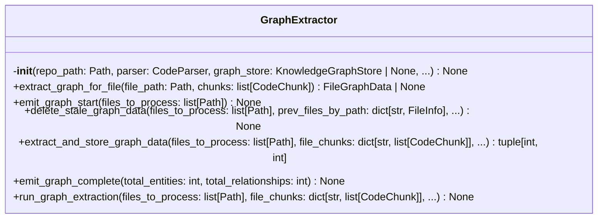

# File: `src/local_deepwiki/core/indexer_graph.py`

## File Overview

This file implements the graph extraction logic used during repository indexing. It is responsible for extracting knowledge-graph entities and relationships from source code files and storing them in a knowledge graph store. The functionality is encapsulated in the `GraphExtractor` class, which integrates with the broader indexing pipeline.

The module was extracted from [`RepositoryIndexer`](indexer.md) to modularize the graph-related logic, improving maintainability and separation of concerns. It handles both full and incremental graph data updates, including deletion of stale data before new data is inserted.

## Key Concepts

### Graph Extraction Pipeline
The core workflow of graph extraction involves:
1. Parsing source files using a [`CodeParser`](parser/code_parser.md).
2. Extracting entities and relationships from the AST using a [`GraphRelationshipExtractor`](graph_rag/extractor.md).
3. Linking extracted entities to existing code chunks.
4. Storing the resulting [`FileGraphData`](graph_rag/models.md) in a [`KnowledgeGraphStore`](graph_rag/store.md).

This process is CPU-bound and is offloaded to a thread pool via `asyncio.to_thread` to prevent blocking the event loop.

### Incremental Indexing Support
The module supports incremental re-indexing by:
- Tracking which files have been modified or deleted since the last index.
- Deleting stale graph data for those files before inserting new data.
- Skipping deletion logic when performing a full rebuild.

This ensures that the knowledge graph remains consistent with the current state of the repository.

### Asynchronous Event Emission
The module emits events (`GRAPH_EXTRACT_START`, `GRAPH_EXTRACT_COMPLETE`) to notify other parts of the system about the progress of graph extraction. These events are handled by the host module, which provides an event emitter via `self._host.get_event_emitter()`.

### Error Handling and Graceful Degradation
Failures during graph extraction or storage are logged as warnings but do not halt the overall indexing process. This allows indexing to continue even if some files fail to produce graph data, ensuring robustness.

## Integration

### External Usage
This module is used by the `GraphExtractor` class, which is a component of the [`RepositoryIndexer`](indexer.md). It is called during the indexing phase to extract and store knowledge graph data for source files.

### Related Files
This module integrates with:
- `local_deepwiki.core.graph_rag.extractor`: Provides the [`GraphRelationshipExtractor`](graph_rag/extractor.md) for extracting entities and relationships.
- `local_deepwiki.core.graph_rag.store`: Provides the [`KnowledgeGraphStore`](graph_rag/store.md) for persisting graph data.
- `local_deepwiki.core.parser`: Supplies the [`CodeParser`](parser/code_parser.md) for parsing source code.
- `local_deepwiki.events`: Used for emitting indexing events.
- `local_deepwiki.models`: Provides [`ProgressCallback`](../models/foundation.md) for progress reporting.

The module is part of a larger indexing pipeline, where it runs after code chunking and before final storage. It depends on the host module to provide:
- A logger for warnings and info.
- An event emitter for signaling start and completion of graph extraction.
- A repository path for resolving relative file paths.

## Design Notes

### Why `asyncio.to_thread`?
Graph extraction involves CPU-bound operations (parsing ASTs and linking entities). These operations are offloaded to a thread pool to avoid blocking the asyncio event loop, which is essential for responsiveness in larger applications.

### Why Not Fail the Entire Index?
Graph extraction failures are treated as warnings. This design choice prioritizes robustness over completeness. If one file fails to produce graph data, it should not prevent the indexing of other files, especially in large repositories where a single malformed file might not be critical to overall indexing success.

### Why Delete Stale Data Before Inserting?
To maintain consistency, stale graph data is deleted before inserting new data. This is especially important in incremental indexing where a file might have been modified, and old relationships or entities should not persist.

### Why Use `Callable` for `extract_fn`?
The `extract_and_store_graph_data` method accepts an optional `extract_fn` parameter, allowing callers to override the default graph extraction logic. This provides flexibility for testing or custom extraction strategies without modifying the core class.

### Why `None` Return for Graph Disabled or Missing Store?
If graph extraction is disabled (`_graph_enabled` is False) or the graph store is not initialized, the `run_graph_extraction` method returns early. This avoids unnecessary processing and ensures the module gracefully handles environments where graph features are not required or available.

## API Reference

### class `GraphExtractor`

Extracts graph entities and relationships from source files.  This class encapsulates the graph extraction concern that was previously part of [RepositoryIndexer](indexer.md), following the Single Responsibility Principle.

**Methods:**


<details>
<summary>View Source (lines 25-295) | <a href="https://github.com/UrbanDiver/local-deepwiki-mcp/blob/main/src/local_deepwiki/core/indexer_graph.py#L25-L295">GitHub</a></summary>

```python
class GraphExtractor:
    # Methods: __init__, extract_graph_for_file, emit_graph_start, delete_stale_graph_data, extract_and_store_graph_data, emit_graph_complete, run_graph_extraction
```

</details>

#### `__init__`

```python
def __init__(repo_path: Path, parser: CodeParser, graph_store: KnowledgeGraphStore | None, graph_extractor: GraphRelationshipExtractor | None, graph_enabled: bool, host_module: ModuleType) -> None
```


| Parameter | Type | Default | Description |
|-----------|------|---------|-------------|
| `repo_path` | `Path` | - | - |
| `parser` | `CodeParser` | - | - |
| `graph_store` | `KnowledgeGraphStore | None` | - | - |
| `graph_extractor` | `GraphRelationshipExtractor | None` | - | - |
| `graph_enabled` | `bool` | - | - |
| `host_module` | `ModuleType` | - | - |


<details>
<summary>View Source (lines 42-56) | <a href="https://github.com/UrbanDiver/local-deepwiki-mcp/blob/main/src/local_deepwiki/core/indexer_graph.py#L42-L56">GitHub</a></summary>

```python
def __init__(
        self,
        repo_path: Path,
        parser: CodeParser,
        graph_store: KnowledgeGraphStore | None,
        graph_extractor: GraphRelationshipExtractor | None,
        graph_enabled: bool,
        host_module: ModuleType,
    ) -> None:
        self.repo_path = repo_path
        self.parser = parser
        self.graph_store = graph_store
        self._graph_extractor = graph_extractor
        self._graph_enabled = graph_enabled
        self._host = host_module
```

</details>

#### `extract_graph_for_file`

```python
def extract_graph_for_file(file_path: Path, chunks: list[CodeChunk]) -> FileGraphData | None
```

Extract graph entities and relationships from a single file.  This is a CPU-bound operation that runs in a thread pool. It parses the file's AST and extracts entities, then links them to existing code chunks.


| Parameter | Type | Default | Description |
|-----------|------|---------|-------------|
| `file_path` | `Path` | - | Absolute path to the source file. |
| `chunks` | `list[CodeChunk]` | - | Code chunks already extracted for this file. |


<details>
<summary>View Source (lines 58-115) | <a href="https://github.com/UrbanDiver/local-deepwiki-mcp/blob/main/src/local_deepwiki/core/indexer_graph.py#L58-L115">GitHub</a></summary>

```python
def extract_graph_for_file(
        self,
        file_path: Path,
        chunks: list[CodeChunk],
    ) -> FileGraphData | None:
        """Extract graph entities and relationships from a single file.

        This is a CPU-bound operation that runs in a thread pool. It parses the
        file's AST and extracts entities, then links them to existing code chunks.

        Args:
            file_path: Absolute path to the source file.
            chunks: Code chunks already extracted for this file.

        Returns:
            FileGraphData with entities and relationships, or None on failure.
        """
        if self._graph_extractor is None:
            return None

        parse_result = self.parser.parse_file(file_path)
        if parse_result is None:
            return None

        root_node, language, source_bytes = parse_result
        rel_path = str(file_path.relative_to(self.repo_path))

        try:
            graph_data = self._graph_extractor.extract_from_ast(
                root_node, source_bytes, language, rel_path
            )
        except Exception:
            self._host.logger.warning(
                "Graph extraction failed for %s, skipping",
                rel_path,
                exc_info=True,
            )
            return None

        # Link entities to their corresponding code chunks
        if graph_data.entities and chunks:
            try:
                linked_entities = GraphRelationshipExtractor.link_entities_to_chunks(
                    list(graph_data.entities), chunks
                )
                return FileGraphData(
                    file_path=graph_data.file_path,
                    entities=tuple(linked_entities),
                    relationships=graph_data.relationships,
                )
            except Exception:
                self._host.logger.warning(
                    "Entity-chunk linking failed for %s, using unlinked entities",
                    rel_path,
                    exc_info=True,
                )

        return graph_data
```

</details>

#### `emit_graph_start`

```python
async def emit_graph_start(files_to_process: list[Path]) -> None
```

Emit the GRAPH_EXTRACT_START event.


| Parameter | Type | Default | Description |
|-----------|------|---------|-------------|
| `files_to_process` | `list[Path]` | - | - |


<details>
<summary>View Source (lines 117-126) | <a href="https://github.com/UrbanDiver/local-deepwiki-mcp/blob/main/src/local_deepwiki/core/indexer_graph.py#L117-L126">GitHub</a></summary>

```python
async def emit_graph_start(self, files_to_process: list[Path]) -> None:
        """Emit the GRAPH_EXTRACT_START event."""
        emitter = self._host.get_event_emitter()
        await emitter.emit(
            EventType.GRAPH_EXTRACT_START,
            {
                "repo_path": str(self.repo_path),
                "file_count": len(files_to_process),
            },
        )
```

</details>

#### `delete_stale_graph_data`

```python
async def delete_stale_graph_data(files_to_process: list[Path], prev_files_by_path: dict[str, FileInfo], deleted_file_paths: list[str], full_rebuild: bool) -> None
```

Delete old graph data for modified and deleted files.


| Parameter | Type | Default | Description |
|-----------|------|---------|-------------|
| `files_to_process` | `list[Path]` | - | Files being re-processed in this run. |
| `prev_files_by_path` | `dict[str, FileInfo]` | - | Previous index state for incremental detection. |
| `deleted_file_paths` | `list[str]` | - | Files removed since last index. |
| `full_rebuild` | `bool` | - | Whether this is a full rebuild (skips incremental deletion). |


<details>
<summary>View Source (lines 128-166) | <a href="https://github.com/UrbanDiver/local-deepwiki-mcp/blob/main/src/local_deepwiki/core/indexer_graph.py#L128-L166">GitHub</a></summary>

```python
async def delete_stale_graph_data(
        self,
        files_to_process: list[Path],
        prev_files_by_path: dict[str, FileInfo],
        deleted_file_paths: list[str],
        full_rebuild: bool,
    ) -> None:
        """Delete old graph data for modified and deleted files.

        Args:
            files_to_process: Files being re-processed in this run.
            prev_files_by_path: Previous index state for incremental detection.
            deleted_file_paths: Files removed since last index.
            full_rebuild: Whether this is a full rebuild (skips incremental deletion).
        """
        # For incremental re-indexing, delete old graph data for modified files
        if not full_rebuild and prev_files_by_path:
            for file_path in files_to_process:
                rel_path = str(file_path.relative_to(self.repo_path))
                if rel_path in prev_files_by_path:
                    try:
                        await self.graph_store.delete_by_file(rel_path)  # type: ignore[union-attr]
                    except Exception:
                        self._host.logger.warning(
                            "Failed to delete old graph data for %s",
                            rel_path,
                            exc_info=True,
                        )

        # Delete graph data for files that no longer exist
        for deleted_path in deleted_file_paths:
            try:
                await self.graph_store.delete_by_file(deleted_path)  # type: ignore[union-attr]
            except Exception:
                self._host.logger.warning(
                    "Failed to delete graph data for deleted file %s",
                    deleted_path,
                    exc_info=True,
                )
```

</details>

#### `extract_and_store_graph_data`

```python
async def extract_and_store_graph_data(files_to_process: list[Path], file_chunks: dict[str, list[CodeChunk]], progress_callback: ProgressCallback | None, extract_fn: Callable[[Path, list[CodeChunk]], FileGraphData | None]
        | None = None) -> tuple[int, int]
```

Extract graph entities/relationships and store them for each file.


| Parameter | Type | Default | Description |
|-----------|------|---------|-------------|
| `files_to_process` | `list[Path]` | - | Files to extract graph data from. |
| `file_chunks` | `dict[str, list[CodeChunk]]` | - | Mapping of relative file path to extracted chunks. |
| `progress_callback` | `ProgressCallback | None` | - | Optional callback for progress updates. |
| `extract_fn` | `Callable[[Path, list[CodeChunk]], FileGraphData | None]
        | None` | `None` | Optional override for the per-file extraction callable. Defaults to ``self.extract_graph_for_file``. |


<details>
<summary>View Source (lines 168-227) | <a href="https://github.com/UrbanDiver/local-deepwiki-mcp/blob/main/src/local_deepwiki/core/indexer_graph.py#L168-L227">GitHub</a></summary>

```python
async def extract_and_store_graph_data(
        self,
        files_to_process: list[Path],
        file_chunks: dict[str, list[CodeChunk]],
        progress_callback: ProgressCallback | None,
        extract_fn: Callable[[Path, list[CodeChunk]], FileGraphData | None]
        | None = None,
    ) -> tuple[int, int]:
        """Extract graph entities/relationships and store them for each file.

        Args:
            files_to_process: Files to extract graph data from.
            file_chunks: Mapping of relative file path to extracted chunks.
            progress_callback: Optional callback for progress updates.
            extract_fn: Optional override for the per-file extraction callable.
                Defaults to ``self.extract_graph_for_file``.

        Returns:
            Tuple of (total_entities, total_relationships) stored.
        """
        _extract = extract_fn or self.extract_graph_for_file
        total_entities = 0
        total_relationships = 0

        for idx, file_path in enumerate(files_to_process):
            rel_path = str(file_path.relative_to(self.repo_path))
            chunks = file_chunks.get(rel_path, [])

            graph_data = await asyncio.to_thread(_extract, file_path, chunks)

            if graph_data is None:
                continue

            try:
                if graph_data.entities:
                    entity_count = await self.graph_store.add_entities(
                        list(graph_data.entities)
                    )  # type: ignore[union-attr]
                    total_entities += entity_count

                if graph_data.relationships:
                    rel_count = await self.graph_store.add_relationships(  # type: ignore[union-attr]
                        list(graph_data.relationships)
                    )
                    total_relationships += rel_count
            except Exception:
                self._host.logger.warning(
                    "Failed to store graph data for %s",
                    rel_path,
                    exc_info=True,
                )

            if progress_callback:
                progress_callback(
                    f"Graph extraction: {rel_path}",
                    idx + 1,
                    len(files_to_process),
                )

        return total_entities, total_relationships
```

</details>

#### `emit_graph_complete`

```python
async def emit_graph_complete(total_entities: int, total_relationships: int) -> None
```

Emit the GRAPH_EXTRACT_COMPLETE event and log summary.


| Parameter | Type | Default | Description |
|-----------|------|---------|-------------|
| `total_entities` | `int` | - | Total number of graph entities stored. |
| `total_relationships` | `int` | - | Total number of graph relationships stored. |


<details>
<summary>View Source (lines 229-252) | <a href="https://github.com/UrbanDiver/local-deepwiki-mcp/blob/main/src/local_deepwiki/core/indexer_graph.py#L229-L252">GitHub</a></summary>

```python
async def emit_graph_complete(
        self, total_entities: int, total_relationships: int
    ) -> None:
        """Emit the GRAPH_EXTRACT_COMPLETE event and log summary.

        Args:
            total_entities: Total number of graph entities stored.
            total_relationships: Total number of graph relationships stored.
        """
        emitter = self._host.get_event_emitter()
        await emitter.emit(
            EventType.GRAPH_EXTRACT_COMPLETE,
            {
                "repo_path": str(self.repo_path),
                "total_entities": total_entities,
                "total_relationships": total_relationships,
            },
        )

        self._host.logger.info(
            "Graph extraction complete: %d entities, %d relationships",
            total_entities,
            total_relationships,
        )
```

</details>

#### `run_graph_extraction`

```python
async def run_graph_extraction(files_to_process: list[Path], file_chunks: dict[str, list[CodeChunk]], prev_files_by_path: dict[str, FileInfo], deleted_file_paths: list[str], full_rebuild: bool, progress_callback: ProgressCallback | None) -> None
```

Run graph entity/relationship extraction for processed files.  This phase runs after file parsing and chunk storage. It extracts entities and relationships from ASTs and stores them in the knowledge graph. Failures are logged but do not fail the overall indexing.


| Parameter | Type | Default | Description |
|-----------|------|---------|-------------|
| `files_to_process` | `list[Path]` | - | Files that were parsed in this indexing run. |
| `file_chunks` | `dict[str, list[CodeChunk]]` | - | Mapping of relative file path to extracted chunks. |
| `prev_files_by_path` | `dict[str, FileInfo]` | - | Previous index state for incremental detection. |
| `deleted_file_paths` | `list[str]` | - | Files removed since last index. |
| `full_rebuild` | `bool` | - | Whether this is a full rebuild. |
| `progress_callback` | `ProgressCallback | None` | - | Optional callback for progress updates. |


<details>
<summary>View Source (lines 254-295) | <a href="https://github.com/UrbanDiver/local-deepwiki-mcp/blob/main/src/local_deepwiki/core/indexer_graph.py#L254-L295">GitHub</a></summary>

```python
async def run_graph_extraction(
        self,
        files_to_process: list[Path],
        file_chunks: dict[str, list[CodeChunk]],
        prev_files_by_path: dict[str, FileInfo],
        deleted_file_paths: list[str],
        full_rebuild: bool,
        progress_callback: ProgressCallback | None,
    ) -> None:
        """Run graph entity/relationship extraction for processed files.

        This phase runs after file parsing and chunk storage. It extracts
        entities and relationships from ASTs and stores them in the knowledge
        graph. Failures are logged but do not fail the overall indexing.

        Args:
            files_to_process: Files that were parsed in this indexing run.
            file_chunks: Mapping of relative file path to extracted chunks.
            prev_files_by_path: Previous index state for incremental detection.
            deleted_file_paths: Files removed since last index.
            full_rebuild: Whether this is a full rebuild.
            progress_callback: Optional callback for progress updates.
        """
        if not self._graph_enabled or self.graph_store is None:
            return

        await self.emit_graph_start(files_to_process)

        if progress_callback:
            progress_callback(
                f"Extracting graph entities from {len(files_to_process)} files...",
                0,
                len(files_to_process),
            )

        await self.delete_stale_graph_data(
            files_to_process, prev_files_by_path, deleted_file_paths, full_rebuild
        )
        total_entities, total_relationships = await self.extract_and_store_graph_data(
            files_to_process, file_chunks, progress_callback
        )
        await self.emit_graph_complete(total_entities, total_relationships)
```

</details>

## Class Diagram



## Call Graph

```mermaid
flowchart TD
    N0[FileGraphData]
    N1[GraphExtractor.delete_stale...]
    N2[GraphExtractor.emit_graph_c...]
    N3[GraphExtractor.emit_graph_s...]
    N4[GraphExtractor.extract_and_...]
    N5[GraphExtractor.extract_grap...]
    N6[GraphExtractor.run_graph_ex...]
    N7[add_entities]
    N8[add_relationships]
    N9[delete_by_file]
    N10[delete_stale_graph_data]
    N11[emit]
    N12[emit_graph_complete]
    N13[emit_graph_start]
    N14[extract_and_store_graph_data]
    N15[extract_from_ast]
    N16[get_event_emitter]
    N17[link_entities_to_chunks]
    N18[parse_file]
    N19[progress_callback]
    N20[relative_to]
    N21[to_thread]
    N5 --> N18
    N5 --> N20
    N5 --> N15
    N5 --> N17
    N5 --> N0
    N3 --> N16
    N3 --> N11
    N1 --> N20
    N1 --> N9
    N4 --> N20
    N4 --> N21
    N4 --> N7
    N4 --> N8
    N4 --> N19
    N2 --> N16
    N2 --> N11
    N6 --> N13
    N6 --> N19
    N6 --> N10
    N6 --> N14
    N6 --> N12
    classDef func fill:#e1f5fe
    class N0,N7,N8,N9,N10,N11,N12,N13,N14,N15,N16,N17,N18,N19,N20,N21 func
    classDef method fill:#fff3e0
    class N1,N2,N3,N4,N5,N6 method
```



## Used By

Functions and methods in this file and their callers:

- **[`FileGraphData`](graph_rag/models.md)**: called by `GraphExtractor.extract_graph_for_file`
- **`add_entities`**: called by `GraphExtractor.extract_and_store_graph_data`
- **`add_relationships`**: called by `GraphExtractor.extract_and_store_graph_data`
- **`delete_by_file`**: called by `GraphExtractor.delete_stale_graph_data`
- **`delete_stale_graph_data`**: called by `GraphExtractor.run_graph_extraction`
- **`emit`**: called by `GraphExtractor.emit_graph_complete`, `GraphExtractor.emit_graph_start`
- **`emit_graph_complete`**: called by `GraphExtractor.run_graph_extraction`
- **`emit_graph_start`**: called by `GraphExtractor.run_graph_extraction`
- **`extract_and_store_graph_data`**: called by `GraphExtractor.run_graph_extraction`
- **`extract_from_ast`**: called by `GraphExtractor.extract_graph_for_file`
- **[`get_event_emitter`](../events.md)**: called by `GraphExtractor.emit_graph_complete`, `GraphExtractor.emit_graph_start`
- **`link_entities_to_chunks`**: called by `GraphExtractor.extract_graph_for_file`
- **`parse_file`**: called by `GraphExtractor.extract_graph_for_file`
- **[`progress_callback`](../handlers/research.md)**: called by `GraphExtractor.extract_and_store_graph_data`, `GraphExtractor.run_graph_extraction`
- **`relative_to`**: called by `GraphExtractor.delete_stale_graph_data`, `GraphExtractor.extract_and_store_graph_data`, `GraphExtractor.extract_graph_for_file`
- **`to_thread`**: called by `GraphExtractor.extract_and_store_graph_data`

## Usage Examples

*Examples extracted from test files*

### Test that _run_graph_extraction exits immediately when graph is disabled

From `test_indexer_graph.py::TestRunGraphExtraction::test_returns_early_when_graph_disabled`:

```python
repo_path = tmp_path / "repo"
repo_path.mkdir()

parsing = ParsingConfig().model_copy(update={"languages": ["python"]})
config = Config().model_copy(update={"parsing": parsing})

indexer = _make_indexer(repo_path, config)

indexer._graph_enabled = False
indexer.graph_store = None

# Should complete silently
await indexer._run_graph_extraction([], {}, {}, [], False, None)
```


## Last Modified

| Entity | Type | Author | Date | Commit |
|--------|------|--------|------|--------|
| `GraphExtractor` | class | Brian Breidenbach | 1 week ago | `7604602` refactor: extract GraphExtr... |
| `__init__` | method | Brian Breidenbach | 1 week ago | `7604602` refactor: extract GraphExtr... |
| `extract_graph_for_file` | method | Brian Breidenbach | 1 week ago | `7604602` refactor: extract GraphExtr... |
| `emit_graph_start` | method | Brian Breidenbach | 1 week ago | `7604602` refactor: extract GraphExtr... |
| `delete_stale_graph_data` | method | Brian Breidenbach | 1 week ago | `7604602` refactor: extract GraphExtr... |
| `extract_and_store_graph_data` | method | Brian Breidenbach | 1 week ago | `7604602` refactor: extract GraphExtr... |
| `emit_graph_complete` | method | Brian Breidenbach | 1 week ago | `7604602` refactor: extract GraphExtr... |
| `run_graph_extraction` | method | Brian Breidenbach | 1 week ago | `7604602` refactor: extract GraphExtr... |

## Relevant Source Files

- `src/local_deepwiki/core/indexer_graph.py:25-295`
