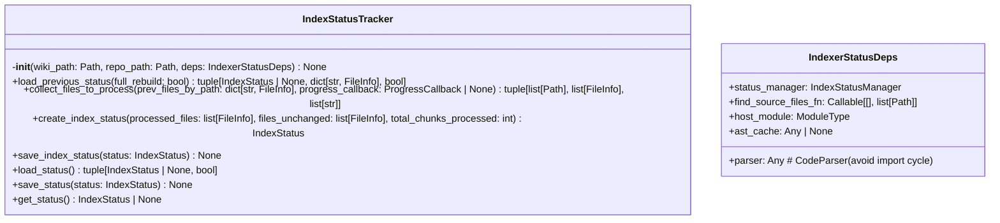

# File: `src/local_deepwiki/core/indexer_status.py`

## File Overview

This file provides functionality for tracking and managing index status during the indexing process. It is designed to support incremental updates by loading previous indexing states, determining which files need reprocessing, and saving updated index information.

The module encapsulates concerns related to index status management, separating them from the core repository indexing logic. This separation promotes modularity and maintainability, allowing for easier testing and extension of indexing behavior.

## Key Concepts

### Index Status Management
The module introduces two core abstractions:
- `IndexerStatusDeps`: A dataclass that bundles dependencies required by `IndexStatusTracker`. This approach avoids parameter bloat in the tracker's constructor and helps manage dependencies cleanly.
- `IndexStatusTracker`: The main class responsible for coordinating index status loading, file processing decisions, and saving the final index state.

### Incremental Update Strategy
The design supports incremental updates by:
1. Loading the previous index status using [`IndexStatusManager`](index_manager.md).
2. Comparing current source files against the previous index to determine which files have changed or been deleted.
3. Using [`compute_files_to_process`](indexer_files.md) to efficiently identify new or modified files.
4. Detecting deleted files using [`detect_deleted_files`](indexer_files.md).

This strategy reduces unnecessary reprocessing by leveraging metadata from prior runs, improving performance and resource usage.

### AST Cache Integration
If an [`ASTCache`](parser/ast_cache.md) is provided, the tracker logs cache statistics at the end of indexing. This supports performance monitoring and optimization of the parsing phase.

## Integration

This module is part of the `local_deepwiki.core` package and integrates with several other components:

- **[IndexStatusManager](index_manager.md)**: Used for loading, saving, and migrating index status.
- **IndexerFiles functions** ([`compute_files_to_process`](indexer_files.md), [`detect_deleted_files`](indexer_files.md)): Provide core file processing logic.
- **[CodeParser](parser/code_parser.md) and [ASTCache](parser/ast_cache.md)**: Used for parsing source files and caching ASTs.
- **[ProgressCallback](../models/foundation.md)**: Allows reporting progress during indexing.
- **[FileInfo](../models/chunks.md) and [IndexStatus](../models/wiki.md) models**: Represent the structure of index data.

It is likely used by the [`RepositoryIndexer`](indexer.md) class (not shown here) to manage index state during indexing operations, and potentially by CLI tools that require index status inspection or rebuilding.

## Design Notes

### Dependency Injection via `IndexerStatusDeps`
The `IndexerStatusDeps` class consolidates dependencies to prevent the `IndexStatusTracker.__init__` method from exceeding the 6-parameter limit. This pattern promotes clean separation of concerns and improves testability by enabling easy mocking of dependencies.

### Efficient File Lookup
When loading previous status, the code builds a dictionary (`prev_files_by_path`) mapping file paths to [`FileInfo`](../models/chunks.md) objects. This transformation changes lookup complexity from O(N*M) to O(N+M), where N is the number of previous files and M is the number of current files. This optimization is crucial for performance as the number of files increases.

### Schema Migration Handling
The `load_previous_status` method checks for schema migration requirements using `IndexStatusManager.load_with_migration_info`. If migration is needed, it returns `full_rebuild_required = True`, ensuring that outdated index states are not used.

### Logging and Progress Reporting
The tracker integrates with a host module's logger and supports optional progress callbacks. This allows for rich diagnostics and user feedback during long-running indexing operations.

### AST Cache Statistics
If an AST cache is present, statistics are logged at the end of indexing. This provides insight into parsing efficiency and cache hit rates, supporting performance tuning and debugging.

### Full Rebuild Handling
When `full_rebuild=True` is passed to `load_previous_status`, the system skips loading previous status entirely, ensuring a clean start. This is useful for scenarios like schema upgrades or manual full rebuilds.

## API Reference

### class `IndexerStatusDeps`

Immutable dependency bundle for :class:`IndexStatusTracker`.  Consolidates injected collaborators so the tracker ``__init__`` stays within the 6-parameter limit.


<details>
<summary>View Source (lines 26-37) | <a href="https://github.com/UrbanDiver/local-deepwiki-mcp/blob/main/src/local_deepwiki/core/indexer_status.py#L26-L37">GitHub</a></summary>

```python
class IndexerStatusDeps:
    """Immutable dependency bundle for :class:`IndexStatusTracker`.

    Consolidates injected collaborators so the tracker ``__init__`` stays
    within the 6-parameter limit.
    """

    status_manager: IndexStatusManager
    find_source_files_fn: Callable[[], list[Path]]
    parser: Any  # CodeParser (avoid import cycle)
    host_module: ModuleType
    ast_cache: Any | None = None  # ASTCache | None
```

</details>

### class `IndexStatusTracker`

Tracks index status for incremental updates.  This class encapsulates the status/file management concern that was previously part of [RepositoryIndexer](indexer.md), following the Single Responsibility Principle.

**Methods:**


<details>
<summary>View Source (lines 40-235) | <a href="https://github.com/UrbanDiver/local-deepwiki-mcp/blob/main/src/local_deepwiki/core/indexer_status.py#L40-L235">GitHub</a></summary>

```python
class IndexStatusTracker:
    # Methods: __init__, load_previous_status, collect_files_to_process, create_index_status, save_index_status, load_status, save_status, get_status
```

</details>

#### `__init__`

```python
def __init__(wiki_path: Path, repo_path: Path, deps: IndexerStatusDeps) -> None
```


| Parameter | Type | Default | Description |
|-----------|------|---------|-------------|
| `wiki_path` | `Path` | - | - |
| `repo_path` | `Path` | - | - |
| `deps` | `IndexerStatusDeps` | - | - |


<details>
<summary>View Source (lines 54-66) | <a href="https://github.com/UrbanDiver/local-deepwiki-mcp/blob/main/src/local_deepwiki/core/indexer_status.py#L54-L66">GitHub</a></summary>

```python
def __init__(
        self,
        wiki_path: Path,
        repo_path: Path,
        deps: IndexerStatusDeps,
    ) -> None:
        self.wiki_path = wiki_path
        self.repo_path = repo_path
        self._status_manager = deps.status_manager
        self._find_source_files = deps.find_source_files_fn
        self.parser = deps.parser
        self._host = deps.host_module
        self.ast_cache = deps.ast_cache
```

</details>

#### `load_previous_status`

```python
def load_previous_status(full_rebuild: bool) -> tuple[IndexStatus | None, dict[str, FileInfo], bool]
```

Load and validate previous index status for incremental updates.


| Parameter | Type | Default | Description |
|-----------|------|---------|-------------|
| `full_rebuild` | `bool` | - | If True, skip loading previous status. |


<details>
<summary>View Source (lines 68-100) | <a href="https://github.com/UrbanDiver/local-deepwiki-mcp/blob/main/src/local_deepwiki/core/indexer_status.py#L68-L100">GitHub</a></summary>

```python
def load_previous_status(
        self, full_rebuild: bool
    ) -> tuple[IndexStatus | None, dict[str, FileInfo], bool]:
        """Load and validate previous index status for incremental updates.

        Args:
            full_rebuild: If True, skip loading previous status.

        Returns:
            Tuple of (previous_status, prev_files_by_path, full_rebuild_required).
            prev_files_by_path is a hash map for O(1) lookups.
            full_rebuild_required may be True if schema migration requires it.
        """
        if full_rebuild:
            return None, {}, full_rebuild

        previous_status, requires_rebuild = (
            self._status_manager.load_with_migration_info(self.wiki_path)
        )
        if requires_rebuild:
            self._host.logger.info("Schema migration requires full rebuild")
            return None, {}, True

        if previous_status:
            self._host.logger.debug(
                "Loaded previous index status: %d files", previous_status.total_files
            )
            # Pre-build hash map for O(1) lookups instead of O(N) linear scan per file
            # This reduces O(N*M) to O(N+M) for file comparison
            prev_files_by_path = {f.path: f for f in previous_status.files}
            return previous_status, prev_files_by_path, full_rebuild

        return None, {}, full_rebuild
```

</details>

#### `collect_files_to_process`

```python
def collect_files_to_process(prev_files_by_path: dict[str, FileInfo], progress_callback: ProgressCallback | None) -> tuple[list[Path], list[FileInfo], list[str]]
```

Gather source files and determine what needs processing.


| Parameter | Type | Default | Description |
|-----------|------|---------|-------------|
| `prev_files_by_path` | `dict[str, FileInfo]` | - | Hash map of previous files for O(1) lookup. |
| `progress_callback` | `ProgressCallback | None` | - | Optional callback for progress updates. |


<details>
<summary>View Source (lines 102-158) | <a href="https://github.com/UrbanDiver/local-deepwiki-mcp/blob/main/src/local_deepwiki/core/indexer_status.py#L102-L158">GitHub</a></summary>

```python
def collect_files_to_process(
        self,
        prev_files_by_path: dict[str, FileInfo],
        progress_callback: ProgressCallback | None,
    ) -> tuple[list[Path], list[FileInfo], list[str]]:
        """Gather source files and determine what needs processing.

        Args:
            prev_files_by_path: Hash map of previous files for O(1) lookup.
            progress_callback: Optional callback for progress updates.

        Returns:
            Tuple of (files_to_process, files_unchanged, deleted_file_paths).
            deleted_file_paths contains relative paths of files that existed in the
            previous index but are no longer present on disk.
        """
        source_files = list(self._find_source_files())
        self._host.logger.info("Found %s source files to consider", len(source_files))

        if progress_callback:
            progress_callback(
                "Found source files", len(source_files), len(source_files)
            )

        files_to_process, files_unchanged = compute_files_to_process(
            source_files=source_files,
            parser=self.parser,
            repo_path=self.repo_path,
            prev_files_by_path=prev_files_by_path,
        )

        # Build the set of current relative paths for deleted file detection
        current_file_paths: set[str] = set()
        for file_path in source_files:
            file_info = self.parser.get_file_info(file_path, self.repo_path)
            current_file_paths.add(file_info.path)

        deleted_file_paths = detect_deleted_files(
            prev_files_by_path, current_file_paths
        )

        if deleted_file_paths:
            self._host.logger.info(
                "Detected %d deleted file(s): %s",
                len(deleted_file_paths),
                deleted_file_paths,
            )

        if progress_callback:
            progress_callback(
                f"Processing {len(files_to_process)} files "
                f"({len(files_unchanged)} unchanged, {len(deleted_file_paths)} deleted)",
                0,
                len(files_to_process),
            )

        return files_to_process, files_unchanged, deleted_file_paths
```

</details>

#### `create_index_status`

```python
def create_index_status(processed_files: list[FileInfo], files_unchanged: list[FileInfo], total_chunks_processed: int) -> IndexStatus
```

Create the final index status with statistics.


| Parameter | Type | Default | Description |
|-----------|------|---------|-------------|
| `processed_files` | `list[FileInfo]` | - | List of files that were processed. |
| `files_unchanged` | `list[FileInfo]` | - | List of files that were unchanged. |
| `total_chunks_processed` | `int` | - | Number of chunks processed in this run. |


<details>
<summary>View Source (lines 160-184) | <a href="https://github.com/UrbanDiver/local-deepwiki-mcp/blob/main/src/local_deepwiki/core/indexer_status.py#L160-L184">GitHub</a></summary>

```python
def create_index_status(
        self,
        processed_files: list[FileInfo],
        files_unchanged: list[FileInfo],
        total_chunks_processed: int,
    ) -> IndexStatus:
        """Create the final index status with statistics.

        Args:
            processed_files: List of files that were processed.
            files_unchanged: List of files that were unchanged.
            total_chunks_processed: Number of chunks processed in this run.

        Returns:
            IndexStatus with complete indexing results.
        """
        all_files, total_chunks = self._status_manager.merge_files(
            processed_files, files_unchanged, total_chunks_processed
        )

        return self._status_manager.create(
            repo_path=self.repo_path,
            files=all_files,
            total_chunks=total_chunks,
        )
```

</details>

#### `save_index_status`

```python
def save_index_status(status: IndexStatus) -> None
```

Save the final index status and log completion.


| Parameter | Type | Default | Description |
|-----------|------|---------|-------------|
| `status` | `IndexStatus` | - | The IndexStatus to save. |


<details>
<summary>View Source (lines 186-210) | <a href="https://github.com/UrbanDiver/local-deepwiki-mcp/blob/main/src/local_deepwiki/core/indexer_status.py#L186-L210">GitHub</a></summary>

```python
def save_index_status(self, status: IndexStatus) -> None:
        """Save the final index status and log completion.

        Args:
            status: The IndexStatus to save.
        """
        self._status_manager.save(self.wiki_path, status)
        self._host.logger.info(
            "Indexing complete: %d files, %d chunks, languages: %s",
            status.total_files,
            status.total_chunks,
            list(status.languages.keys()),
        )

        # Log AST cache statistics if enabled
        if self.ast_cache is not None:
            cache_stats = self.ast_cache.get_stats()
            self._host.logger.info(
                "AST cache stats: hits=%d, misses=%d, hit_rate=%.2f%%, entries=%d, memory=%.1fKB",
                cache_stats["hits"],
                cache_stats["misses"],
                cache_stats["hit_rate"] * 100,
                cache_stats["total_entries"],
                cache_stats["estimated_memory_bytes"] / 1024,
            )
```

</details>

#### `load_status`

```python
def load_status() -> tuple[IndexStatus | None, bool]
```

Load previous indexing status and check for migration needs.


<details>
<summary>View Source (lines 212-219) | <a href="https://github.com/UrbanDiver/local-deepwiki-mcp/blob/main/src/local_deepwiki/core/indexer_status.py#L212-L219">GitHub</a></summary>

```python
def load_status(self) -> tuple[IndexStatus | None, bool]:
        """Load previous indexing status and check for migration needs.

        Returns:
            Tuple of (IndexStatus or None, requires_rebuild).
            requires_rebuild is True if the index should be fully rebuilt.
        """
        return self._status_manager.load_with_migration_info(self.wiki_path)
```

</details>

#### `save_status`

```python
def save_status(status: IndexStatus) -> None
```

Save indexing status.


| Parameter | Type | Default | Description |
|-----------|------|---------|-------------|
| `status` | `IndexStatus` | - | The IndexStatus to save. |


<details>
<summary>View Source (lines 221-227) | <a href="https://github.com/UrbanDiver/local-deepwiki-mcp/blob/main/src/local_deepwiki/core/indexer_status.py#L221-L227">GitHub</a></summary>

```python
def save_status(self, status: IndexStatus) -> None:
        """Save indexing status.

        Args:
            status: The IndexStatus to save.
        """
        self._status_manager.save(self.wiki_path, status)
```

</details>

#### `get_status`

```python
def get_status() -> IndexStatus | None
```

Get the current indexing status.


<details>
<summary>View Source (lines 229-235) | <a href="https://github.com/UrbanDiver/local-deepwiki-mcp/blob/main/src/local_deepwiki/core/indexer_status.py#L229-L235">GitHub</a></summary>

```python
def get_status(self) -> IndexStatus | None:
        """Get the current indexing status.

        Returns:
            IndexStatus or None if not indexed.
        """
        return self._status_manager.load(self.wiki_path)
```

</details>

## Class Diagram



## Call Graph

```mermaid
flowchart TD
    N0[IndexStatusTracker.collect_...]
    N1[IndexStatusTracker.create_i...]
    N2[IndexStatusTracker.get_status]
    N3[IndexStatusTracker.load_pre...]
    N4[IndexStatusTracker.load_status]
    N5[IndexStatusTracker.save_ind...]
    N6[IndexStatusTracker.save_status]
    N7[_find_source_files]
    N8[add]
    N9[compute_files_to_process]
    N10[create]
    N11[detect_deleted_files]
    N12[get_file_info]
    N13[get_stats]
    N14[load]
    N15[load_with_migration_info]
    N16[merge_files]
    N17[progress_callback]
    N18[save]
    N3 --> N15
    N0 --> N7
    N0 --> N17
    N0 --> N9
    N0 --> N12
    N0 --> N8
    N0 --> N11
    N1 --> N16
    N1 --> N10
    N5 --> N18
    N5 --> N13
    N4 --> N15
    N6 --> N18
    N2 --> N14
    classDef func fill:#e1f5fe
    class N7,N8,N9,N10,N11,N12,N13,N14,N15,N16,N17,N18 func
    classDef method fill:#fff3e0
    class N0,N1,N2,N3,N4,N5,N6 method
```



## Used By

Functions and methods in this file and their callers:

- **`_find_source_files`**: called by `IndexStatusTracker.collect_files_to_process`
- **`add`**: called by `IndexStatusTracker.collect_files_to_process`
- **[`compute_files_to_process`](indexer_files.md)**: called by `IndexStatusTracker.collect_files_to_process`
- **`create`**: called by `IndexStatusTracker.create_index_status`
- **[`detect_deleted_files`](indexer_files.md)**: called by `IndexStatusTracker.collect_files_to_process`
- **`get_file_info`**: called by `IndexStatusTracker.collect_files_to_process`
- **`get_stats`**: called by `IndexStatusTracker.save_index_status`
- **`load`**: called by `IndexStatusTracker.get_status`
- **`load_with_migration_info`**: called by `IndexStatusTracker.load_previous_status`, `IndexStatusTracker.load_status`
- **`merge_files`**: called by `IndexStatusTracker.create_index_status`
- **[`progress_callback`](../handlers/research.md)**: called by `IndexStatusTracker.collect_files_to_process`
- **`save`**: called by `IndexStatusTracker.save_index_status`, `IndexStatusTracker.save_status`

## Last Modified

| Entity | Type | Author | Date | Commit |
|--------|------|--------|------|--------|
| `IndexerStatusDeps` | class | Brian Breidenbach | yesterday | `1eef062` refactor: complete Grade A ... |
| `IndexStatusTracker` | class | Brian Breidenbach | yesterday | `1eef062` refactor: complete Grade A ... |
| `__init__` | method | Brian Breidenbach | yesterday | `1eef062` refactor: complete Grade A ... |
| `load_previous_status` | method | Brian Breidenbach | 1 week ago | `7604602` refactor: extract GraphExtr... |
| `collect_files_to_process` | method | Brian Breidenbach | 1 week ago | `7604602` refactor: extract GraphExtr... |
| `create_index_status` | method | Brian Breidenbach | 1 week ago | `7604602` refactor: extract GraphExtr... |
| `save_index_status` | method | Brian Breidenbach | 1 week ago | `7604602` refactor: extract GraphExtr... |
| `load_status` | method | Brian Breidenbach | 1 week ago | `7604602` refactor: extract GraphExtr... |
| `save_status` | method | Brian Breidenbach | 1 week ago | `7604602` refactor: extract GraphExtr... |
| `get_status` | method | Brian Breidenbach | 1 week ago | `7604602` refactor: extract GraphExtr... |

## Relevant Source Files

- `src/local_deepwiki/core/indexer_status.py:26-37`
