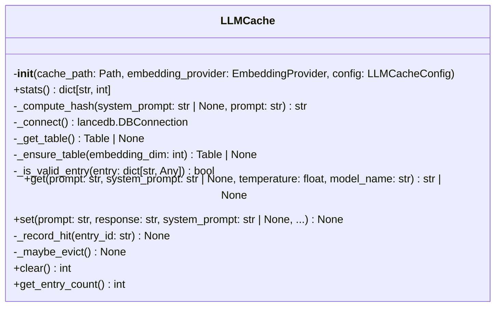

# LLM Cache Module

## File Overview

The `llm_cache.py` module provides caching functionality for Large [Language](../models.md) Model (LLM) operations using LanceDB as the storage backend. This module helps optimize performance by storing and retrieving previously computed results, reducing redundant API calls and computations.

## Dependencies

This module relies on several key components:

- **LanceDB**: Vector database for storing cached results
- **[LLMCacheConfig](../config.md)**: Configuration settings for cache behavior
- **[EmbeddingProvider](../providers/base.md)**: Base provider for embedding operations
- Standard Python libraries for hashing, timing, and path operations

## Classes

### LLMCache

The LLMCache class manages caching operations for LLM-related computations using LanceDB as the storage backend.

**Key Features:**
- Vector-based storage using LanceDB
- Content hashing for cache key generation
- Integration with embedding providers
- Configurable cache behavior through [LLMCacheConfig](../config.md)

**Dependencies:**
- Requires a LanceDB Table instance for storage operations
- Uses [EmbeddingProvider](../providers/base.md) for embedding-related caching
- Configured through [LLMCacheConfig](../config.md) settings

## Usage Context

Based on the imports and class structure, this module is designed to:

1. **Cache LLM Results**: Store computed results to avoid redundant processing
2. **Vector Storage**: Leverage LanceDB's vector capabilities for efficient retrieval
3. **Content-Based Keys**: Use hash-based keys for reliable cache lookups
4. **Provider Integration**: Work with various embedding providers through the base interface

## Related Components

This module integrates with several other components in the system:

- **[LLMCacheConfig](../config.md)**: Provides configuration settings for cache behavior
- **[EmbeddingProvider](../providers/base.md)**: Base interface for embedding operations that may be cached
- **Logging System**: Uses the application's logging infrastructure for monitoring

The module serves as a crucial performance optimization component, particularly for applications that perform repeated LLM operations or embedding computations.

## API Reference

### class `LLMCache`

Vector-based cache for LLM responses with exact and similarity matching.  Uses a hybrid approach: 1. Fast path: Exact SHA256 hash match on (system_prompt + prompt) 2. Slow path: Embedding similarity search for semantic matches  Cache entries expire based on TTL and are evicted using LRU when max_entries is reached.

**Methods:**


<details>
<summary>View Source (lines 19-384)</summary>

```python
class LLMCache:
    # Methods: __init__, stats, _compute_hash, _connect, _get_table, _ensure_table, _is_valid_entry, get, set, _record_hit, _maybe_evict, clear, get_entry_count
```

</details>

#### `__init__`

```python
def __init__(cache_path: Path, embedding_provider: EmbeddingProvider, config: LLMCacheConfig)
```

Initialize the LLM cache.


| [Parameter](../generators/api_docs.md) | Type | Default | Description |
|-----------|------|---------|-------------|
| `cache_path` | `Path` | - | Path to the LanceDB cache database. |
| `embedding_provider` | [`EmbeddingProvider`](../providers/base.md) | - | Provider for generating prompt embeddings. |
| `config` | [`LLMCacheConfig`](../config.md) | - | Cache configuration. |


<details>
<summary>View Source (lines 31-49)</summary>

```python
def __init__(
        self,
        cache_path: Path,
        embedding_provider: EmbeddingProvider,
        config: LLMCacheConfig,
    ):
        """Initialize the LLM cache.

        Args:
            cache_path: Path to the LanceDB cache database.
            embedding_provider: Provider for generating prompt embeddings.
            config: Cache configuration.
        """
        self.cache_path = cache_path
        self.embedding_provider = embedding_provider
        self.config = config
        self._db: lancedb.DBConnection | None = None
        self._table: Table | None = None
        self._stats = {"hits": 0, "misses": 0, "skipped": 0}
```

</details>

#### `stats`

```python
def stats() -> dict[str, int]
```

Get cache statistics.


<details>
<summary>View Source (lines 52-54)</summary>

```python
def stats(self) -> dict[str, int]:
        """Get cache statistics."""
        return self._stats.copy()
```

</details>

#### `get`

```python
async def get(prompt: str, system_prompt: str | None = None, temperature: float = 0.7, model_name: str = "") -> str | None
```

Try to get a cached response.  Strategy: 1. Skip if temperature too high (non-deterministic) 2. Try exact hash match (fast path) 3. If no exact match, try embedding similarity search (slow path) 4. Return None if no suitable cache hit


| [Parameter](../generators/api_docs.md) | Type | Default | Description |
|-----------|------|---------|-------------|
| `prompt` | `str` | - | User prompt. |
| `system_prompt` | `str | None` | `None` | System prompt. |
| `temperature` | `float` | `0.7` | LLM temperature used. |
| `model_name` | `str` | `""` | Name of the LLM model. |


<details>
<summary>View Source (lines 120-208)</summary>

```python
async def get(
        self,
        prompt: str,
        system_prompt: str | None = None,
        temperature: float = 0.7,
        model_name: str = "",
    ) -> str | None:
        """Try to get a cached response.

        Strategy:
        1. Skip if temperature too high (non-deterministic)
        2. Try exact hash match (fast path)
        3. If no exact match, try embedding similarity search (slow path)
        4. Return None if no suitable cache hit

        Args:
            prompt: User prompt.
            system_prompt: System prompt.
            temperature: LLM temperature used.
            model_name: Name of the LLM model.

        Returns:
            Cached response if found and valid, None otherwise.
        """
        # Skip if temperature too high (non-deterministic responses)
        if temperature > self.config.max_cacheable_temperature:
            self._stats["skipped"] += 1
            logger.debug(
                f"Cache skip: temperature {temperature} > max {self.config.max_cacheable_temperature}"
            )
            return None

        table = self._get_table()
        if table is None:
            self._stats["misses"] += 1
            return None

        exact_hash = self._compute_hash(system_prompt, prompt)

        # Fast path: exact hash match
        try:
            # LanceDB filter query for exact hash
            exact_results = table.search().where(f"exact_hash = '{exact_hash}'").limit(1).to_list()

            if exact_results:
                entry = exact_results[0]
                if self._is_valid_entry(entry):
                    self._stats["hits"] += 1
                    logger.debug(f"Cache exact hit: hash={exact_hash[:12]}...")
                    # Update hit tracking
                    await self._record_hit(entry["id"])
                    return cast(str, entry["response"])
        except (KeyError, ValueError, RuntimeError, OSError) as e:
            # KeyError: Missing field in result
            # ValueError: Invalid query or filter expression
            # RuntimeError: LanceDB query execution error
            # OSError: Database file access issues
            logger.debug(f"Exact hash lookup failed: {e}")

        # Slow path: embedding similarity search
        try:
            query_embedding = (await self.embedding_provider.embed([prompt]))[0]

            # Search for similar prompts with same model
            similar_results = table.search(query_embedding).limit(5).to_list()

            for result in similar_results:
                # Calculate similarity from distance
                similarity = 1.0 - result.get("_distance", 1.0)

                if similarity >= self.config.similarity_threshold:
                    # Check model match and validity
                    if result.get("model_name", "") == model_name and self._is_valid_entry(result):
                        self._stats["hits"] += 1
                        logger.debug(
                            f"Cache similarity hit: similarity={similarity:.3f}, "
                            f"entry={result['id'][:8]}..."
                        )
                        await self._record_hit(result["id"])
                        return cast(str, result["response"])
        except (KeyError, ValueError, RuntimeError, OSError) as e:
            # KeyError: Missing field in search result
            # ValueError: Invalid embedding or search parameters
            # RuntimeError: Vector search execution error
            # OSError: Database access issues
            logger.debug(f"Similarity search failed: {e}")

        self._stats["misses"] += 1
        return None
```

</details>

#### `set`

```python
async def set(prompt: str, response: str, system_prompt: str | None = None, temperature: float = 0.7, model_name: str = "", ttl_seconds: int | None = None) -> None
```

Cache an LLM response.


| [Parameter](../generators/api_docs.md) | Type | Default | Description |
|-----------|------|---------|-------------|
| `prompt` | `str` | - | User prompt. |
| `response` | `str` | - | LLM response to cache. |
| `system_prompt` | `str | None` | `None` | System prompt used. |
| `temperature` | `float` | `0.7` | LLM temperature used. |
| `model_name` | `str` | `""` | Name of the LLM model. |
| `ttl_seconds` | `int | None` | `None` | Optional TTL override for this entry. |


<details>
<summary>View Source (lines 210-282)</summary>

```python
async def set(
        self,
        prompt: str,
        response: str,
        system_prompt: str | None = None,
        temperature: float = 0.7,
        model_name: str = "",
        ttl_seconds: int | None = None,
    ) -> None:
        """Cache an LLM response.

        Args:
            prompt: User prompt.
            response: LLM response to cache.
            system_prompt: System prompt used.
            temperature: LLM temperature used.
            model_name: Name of the LLM model.
            ttl_seconds: Optional TTL override for this entry.
        """
        # Skip if temperature too high
        if temperature > self.config.max_cacheable_temperature:
            logger.debug(f"Cache skip set: temperature {temperature} > max")
            return

        try:
            exact_hash = self._compute_hash(system_prompt, prompt)
            prompt_embedding = (await self.embedding_provider.embed([prompt]))[0]
            now = time.time()

            entry_id = str(uuid.uuid4())
            record = {
                "id": entry_id,
                "exact_hash": exact_hash,
                "vector": prompt_embedding,
                "system_prompt": system_prompt or "",
                "prompt": prompt,
                "response": response,
                "temperature": temperature,
                "model_name": model_name,
                "created_at": now,
                "hit_count": 0,
                "last_hit_at": now,
                "ttl_seconds": ttl_seconds or self.config.ttl_seconds,
            }

            db = self._connect()
            if self.TABLE_NAME in db.list_tables().tables:
                table = db.open_table(self.TABLE_NAME)
                table.add([record])
                self._table = table
            else:
                # Create table with first record
                self._table = db.create_table(self.TABLE_NAME, [record])
                # Create index on exact_hash for fast lookups
                try:
                    self._table.create_scalar_index("exact_hash")
                    logger.debug("Created scalar index on exact_hash")
                except (ValueError, RuntimeError, OSError) as e:
                    # ValueError: Index already exists
                    # RuntimeError: Column type not supported
                    # OSError: Storage issues
                    logger.debug(f"Could not create index: {e}")

            logger.debug(f"Cached response: id={entry_id[:8]}..., hash={exact_hash[:12]}...")

            # Check if we need to evict old entries
            await self._maybe_evict()

        except (ValueError, RuntimeError, OSError) as e:
            # ValueError: Invalid data format or embedding failure
            # RuntimeError: Database operation failure
            # OSError: File system or storage issues
            logger.warning(f"Failed to cache response: {e}")
```

</details>

#### `clear`

```python
async def clear() -> int
```

Clear all cache entries.


<details>
<summary>View Source (lines 348-368)</summary>

```python
async def clear(self) -> int:
        """Clear all cache entries.

        Returns:
            Number of entries cleared.
        """
        try:
            db = self._connect()
            if self.TABLE_NAME in db.list_tables().tables:
                table = db.open_table(self.TABLE_NAME)
                count = cast(int, table.count_rows())
                db.drop_table(self.TABLE_NAME)
                self._table = None
                logger.info(f"Cleared {count} cache entries")
                return count
            return 0
        except (RuntimeError, OSError) as e:
            # RuntimeError: Database operation failure
            # OSError: Storage or file system issues
            logger.warning(f"Failed to clear cache: {e}")
            return 0
```

</details>

#### `get_entry_count`

```python
def get_entry_count() -> int
```

Get the number of entries in the cache.


<details>
<summary>View Source (lines 370-384)</summary>

```python
def get_entry_count(self) -> int:
        """Get the number of entries in the cache.

        Returns:
            Number of cache entries.
        """
        try:
            table = self._get_table()
            if table is None:
                return 0
            return cast(int, table.count_rows())
        except (RuntimeError, OSError):
            # RuntimeError: Database query failure
            # OSError: Storage access issues
            return 0
```

</details>

## Class Diagram



## Call Graph

```mermaid
flowchart TD
    N0[LLMCache._compute_hash]
    N1[LLMCache._connect]
    N2[LLMCache._ensure_table]
    N3[LLMCache._get_table]
    N4[LLMCache._is_valid_entry]
    N5[LLMCache._maybe_evict]
    N6[LLMCache.clear]
    N7[LLMCache.get]
    N8[LLMCache.get_entry_count]
    N9[LLMCache.set]
    N10[LLMCache.stats]
    N11[_compute_hash]
    N12[_connect]
    N13[_get_table]
    N14[_is_valid_entry]
    N15[cast]
    N16[connect]
    N17[copy]
    N18[count_rows]
    N19[embed]
    N20[encode]
    N21[hexdigest]
    N22[limit]
    N23[list_tables]
    N24[mkdir]
    N25[open_table]
    N26[search]
    N27[sha256]
    N28[time]
    N29[to_list]
    N10 --> N17
    N0 --> N21
    N0 --> N27
    N0 --> N20
    N1 --> N24
    N1 --> N16
    N3 --> N12
    N3 --> N23
    N3 --> N25
    N2 --> N12
    N2 --> N23
    N2 --> N25
    N4 --> N15
    N4 --> N28
    N7 --> N13
    N7 --> N11
    N7 --> N29
    N7 --> N22
    N7 --> N26
    N7 --> N14
    N7 --> N15
    N7 --> N19
    N9 --> N11
    N9 --> N19
    N9 --> N28
    N9 --> N12
    N9 --> N23
    N9 --> N25
    N5 --> N13
    N5 --> N18
    N5 --> N29
    N5 --> N22
    N5 --> N26
    N5 --> N14
    N6 --> N12
    N6 --> N23
    N6 --> N25
    N6 --> N15
    N6 --> N18
    N8 --> N13
    N8 --> N15
    N8 --> N18
    classDef func fill:#e1f5fe
    class N11,N12,N13,N14,N15,N16,N17,N18,N19,N20,N21,N22,N23,N24,N25,N26,N27,N28,N29 func
    classDef method fill:#fff3e0
    class N0,N1,N2,N3,N4,N5,N6,N7,N8,N9,N10 method
```



## Usage Examples

*Examples extracted from test files*

### Test that empty cache returns None

From `test_llm_cache.py::test_cache_miss_on_empty_cache`:

```python
assert cache.stats["misses"] == 1
```

### Test that empty cache returns None

From `test_llm_cache.py::test_cache_miss_on_empty_cache`:

```python
result = await cache.get(
    prompt="test prompt",
    system_prompt="test system",
    temperature=0.1,
    model_name="test-model",
)
assert result is None
```

### Test that exact same prompt returns cached response

From `test_llm_cache.py::test_cache_set_and_get_exact_match`:

```python
assert cache.stats["hits"] == 1
```

### Test that exact same prompt returns cached response

From `test_llm_cache.py::test_cache_set_and_get_exact_match`:

```python
result = await cache.get(
    prompt=prompt,
    system_prompt=system_prompt,
    temperature=0.1,
    model_name="test-model",
)

assert result == response
```

### Test that exact same prompt returns cached response

From `test_llm_cache.py::test_cache_set_and_get_exact_match`:

```python
await cache.set(
    prompt=prompt,
    response=response,
    system_prompt=system_prompt,
    temperature=0.1,
    model_name="test-model",
)

# Get cache entry
result = await cache.get(
    prompt=prompt,
    system_prompt=system_prompt,
    temperature=0.1,
    model_name="test-model",
)

assert result == response
```


## Additional Source Code

Source code for functions and methods not listed in the API Reference above.

#### `_compute_hash`

<details>
<summary>View Source (lines 56-67)</summary>

```python
def _compute_hash(self, system_prompt: str | None, prompt: str) -> str:
        """Compute exact match hash for fast lookup.

        Args:
            system_prompt: System prompt used.
            prompt: User prompt.

        Returns:
            SHA256 hash of the combined prompts.
        """
        combined = f"{system_prompt or ''}\n---\n{prompt}"
        return hashlib.sha256(combined.encode()).hexdigest()
```

</details>


#### `_connect`

<details>
<summary>View Source (lines 69-74)</summary>

```python
def _connect(self) -> lancedb.DBConnection:
        """Get or create database connection."""
        if self._db is None:
            self.cache_path.parent.mkdir(parents=True, exist_ok=True)
            self._db = lancedb.connect(str(self.cache_path))
        return self._db
```

</details>


#### `_get_table`

<details>
<summary>View Source (lines 76-82)</summary>

```python
def _get_table(self) -> Table | None:
        """Get the cache table if it exists."""
        if self._table is None:
            db = self._connect()
            if self.TABLE_NAME in db.list_tables().tables:
                self._table = db.open_table(self.TABLE_NAME)
        return self._table
```

</details>


#### `_ensure_table`

<details>
<summary>View Source (lines 84-104)</summary>

```python
def _ensure_table(self, embedding_dim: int) -> Table | None:
        """Ensure the cache table exists with proper schema.

        Args:
            embedding_dim: Dimension of embedding vectors (unused, kept for API compat).

        Returns:
            The cache table if it exists, None otherwise.
            Table is created on first insert via get_or_cache().
        """
        if self._table is not None:
            return self._table

        db = self._connect()
        if self.TABLE_NAME in db.list_tables().tables:
            self._table = db.open_table(self.TABLE_NAME)
            return self._table

        # Table doesn't exist yet - will be created on first insert
        logger.debug(f"LLM cache table does not exist yet at {self.cache_path}")
        return None
```

</details>


#### `_is_valid_entry`

<details>
<summary>View Source (lines 106-118)</summary>

```python
def _is_valid_entry(self, entry: dict[str, Any]) -> bool:
        """Check if a cache entry is still valid (not expired).

        Args:
            entry: Cache entry record.

        Returns:
            True if entry is valid, False if expired.
        """
        created_at = cast(float, entry.get("created_at", 0))
        ttl = cast(float, entry.get("ttl_seconds", self.config.ttl_seconds))
        age = time.time() - created_at
        return age < ttl
```

</details>


#### `_record_hit`

<details>
<summary>View Source (lines 284-304)</summary>

```python
async def _record_hit(self, entry_id: str) -> None:
        """Record a cache hit for an entry.

        Args:
            entry_id: ID of the cache entry.
        """
        try:
            table = self._get_table()
            if table is None:
                return

            # Update hit_count and last_hit_at
            # Note: LanceDB doesn't support UPDATE, so we'd need to
            # delete and re-add. For simplicity, we skip this for now.
            # The hit tracking is mainly for future LRU eviction.
            pass
        except (KeyError, RuntimeError, OSError) as e:
            # KeyError: Entry not found
            # RuntimeError: Database operation failure
            # OSError: Storage issues
            logger.debug(f"Failed to record hit: {e}")
```

</details>


#### `_maybe_evict`

<details>
<summary>View Source (lines 306-346)</summary>

```python
async def _maybe_evict(self) -> None:
        """Evict old entries if cache exceeds max_entries."""
        try:
            table = self._get_table()
            if table is None:
                return

            # Count entries (approximate)
            count = table.count_rows()
            if count <= self.config.max_entries:
                return

            logger.info(f"Cache has {count} entries, evicting old entries...")

            # Get oldest entries to delete
            # Note: LanceDB doesn't support ORDER BY + DELETE easily
            # For now, we'll just delete expired entries
            all_entries = table.search().limit(count).to_list()

            expired_ids = []
            for entry in all_entries:
                if not self._is_valid_entry(entry):
                    expired_ids.append(entry["id"])

            if expired_ids:
                # Delete expired entries
                for entry_id in expired_ids[:100]:  # Batch delete
                    try:
                        table.delete(f"id = '{entry_id}'")
                    except (ValueError, RuntimeError, OSError):
                        # Delete may fail for individual entries; continue with others
                        pass

                logger.info(f"Evicted {len(expired_ids)} expired cache entries")

        except (KeyError, ValueError, RuntimeError, OSError) as e:
            # KeyError: Missing fields in entries
            # ValueError: Invalid query during eviction
            # RuntimeError: Database operation failure
            # OSError: Storage issues
            logger.debug(f"Eviction failed: {e}")
```

</details>

## Relevant Source Files

- `src/local_deepwiki/core/llm_cache.py:19-384`
