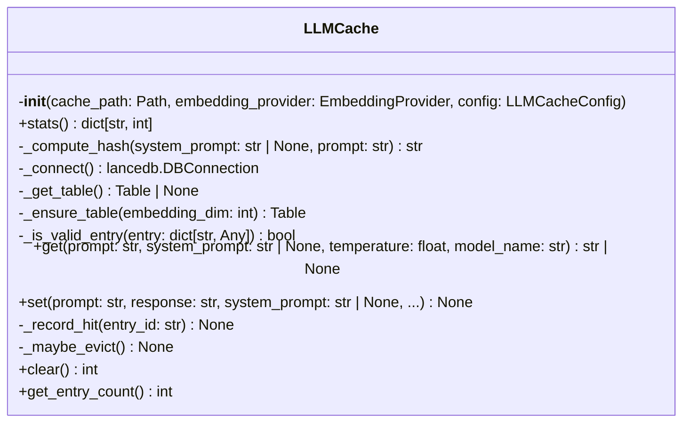

# LLM Cache Module

## File Overview

The `llm_cache.py` module provides caching functionality for Large [Language](../models.md) Model (LLM) operations using LanceDB as the storage backend. This module enables efficient storage and retrieval of LLM responses to avoid redundant API calls and improve performance.

## Dependencies

This module relies on the following components:
- `lancedb` - Vector database for storing cached responses
- [`LLMCacheConfig`](../config.md) - Configuration settings for cache behavior
- [`EmbeddingProvider`](../providers/base.md) - Base class for embedding generation
- Standard library modules for hashing, timing, and file operations

## Classes

### LLMCache

The LLMCache class manages the caching of LLM responses using LanceDB as the storage backend. It provides methods to store and retrieve cached responses based on input hashing and similarity matching.

**Key Features:**
- Persistent storage using LanceDB
- Content-based hashing for cache keys
- Embedding-based similarity search for cache retrieval
- Configurable cache behavior through [LLMCacheConfig](../config.md)

## Related Components

This module integrates with:
- **[LLMCacheConfig](../config.md)**: Provides configuration settings for cache operations
- **[EmbeddingProvider](../providers/base.md)**: Used for generating embeddings for similarity-based cache retrieval
- **LanceDB Table**: Underlying storage mechanism for cached data

## Usage Context

The LLM cache is designed to work within the local_deepwiki system to optimize LLM interactions by:
- Reducing redundant API calls to LLM providers
- Improving response times for similar queries
- Providing persistent storage of LLM responses across sessions

**Note**: This documentation is based on the module structure and imports shown. Detailed method signatures and usage examples would require access to the complete class implementation within the code chunks.

## API Reference

### class `LLMCache`

Vector-based cache for LLM responses with exact and similarity matching.  Uses a hybrid approach: 1. Fast path: Exact SHA256 hash match on (system_prompt + prompt) 2. Slow path: Embedding similarity search for semantic matches  Cache entries expire based on TTL and are evicted using LRU when max_entries is reached.

**Methods:**

#### `__init__`

```python
def __init__(cache_path: Path, embedding_provider: EmbeddingProvider, config: LLMCacheConfig)
```

Initialize the LLM cache.


| [Parameter](../generators/api_docs.md) | Type | Default | Description |
|-----------|------|---------|-------------|
| `cache_path` | `Path` | - | Path to the LanceDB cache database. |
| `embedding_provider` | [`EmbeddingProvider`](../providers/base.md) | - | Provider for generating prompt embeddings. |
| `config` | [`LLMCacheConfig`](../config.md) | - | Cache configuration. |

#### `stats`

```python
def stats() -> dict[str, int]
```

Get cache statistics.

#### `get`

```python
async def get(prompt: str, system_prompt: str | None = None, temperature: float = 0.7, model_name: str = "") -> str | None
```

Try to get a cached response.  Strategy: 1. Skip if temperature too high (non-deterministic) 2. Try exact hash match (fast path) 3. If no exact match, try embedding similarity search (slow path) 4. Return None if no suitable cache hit


| [Parameter](../generators/api_docs.md) | Type | Default | Description |
|-----------|------|---------|-------------|
| `prompt` | `str` | - | User prompt. |
| `system_prompt` | `str | None` | `None` | System prompt. |
| `temperature` | `float` | `0.7` | LLM temperature used. |
| `model_name` | `str` | `""` | Name of the LLM model. |

#### `set`

```python
async def set(prompt: str, response: str, system_prompt: str | None = None, temperature: float = 0.7, model_name: str = "", ttl_seconds: int | None = None) -> None
```

Cache an LLM response.


| [Parameter](../generators/api_docs.md) | Type | Default | Description |
|-----------|------|---------|-------------|
| `prompt` | `str` | - | User prompt. |
| `response` | `str` | - | LLM response to cache. |
| `system_prompt` | `str | None` | `None` | System prompt used. |
| `temperature` | `float` | `0.7` | LLM temperature used. |
| `model_name` | `str` | `""` | Name of the LLM model. |
| `ttl_seconds` | `int | None` | `None` | Optional TTL override for this entry. |

#### `clear`

```python
async def clear() -> int
```

Clear all cache entries.

#### `get_entry_count`

```python
def get_entry_count() -> int
```

Get the number of entries in the cache.


## Class Diagram



## Call Graph

```mermaid
flowchart TD
    N0[LLMCache._compute_hash]
    N1[LLMCache._connect]
    N2[LLMCache._ensure_table]
    N3[LLMCache._get_table]
    N4[LLMCache._is_valid_entry]
    N5[LLMCache._maybe_evict]
    N6[LLMCache.clear]
    N7[LLMCache.get]
    N8[LLMCache.get_entry_count]
    N9[LLMCache.set]
    N10[LLMCache.stats]
    N11[_compute_hash]
    N12[_connect]
    N13[_get_table]
    N14[_is_valid_entry]
    N15[connect]
    N16[copy]
    N17[count_rows]
    N18[embed]
    N19[encode]
    N20[hexdigest]
    N21[limit]
    N22[list_tables]
    N23[mkdir]
    N24[open_table]
    N25[search]
    N26[sha256]
    N27[time]
    N28[to_list]
    N29[where]
    N10 --> N16
    N0 --> N20
    N0 --> N26
    N0 --> N19
    N1 --> N23
    N1 --> N15
    N3 --> N12
    N3 --> N22
    N3 --> N24
    N2 --> N12
    N2 --> N22
    N2 --> N24
    N4 --> N27
    N7 --> N13
    N7 --> N11
    N7 --> N28
    N7 --> N21
    N7 --> N29
    N7 --> N25
    N7 --> N14
    N7 --> N18
    N9 --> N11
    N9 --> N18
    N9 --> N27
    N9 --> N12
    N9 --> N22
    N9 --> N24
    N5 --> N13
    N5 --> N17
    N5 --> N27
    N5 --> N28
    N5 --> N21
    N5 --> N25
    N5 --> N14
    N6 --> N12
    N6 --> N22
    N6 --> N24
    N6 --> N17
    N8 --> N13
    N8 --> N17
    classDef func fill:#e1f5fe
    class N11,N12,N13,N14,N15,N16,N17,N18,N19,N20,N21,N22,N23,N24,N25,N26,N27,N28,N29 func
    classDef method fill:#fff3e0
    class N0,N1,N2,N3,N4,N5,N6,N7,N8,N9,N10 method
```



## Usage Examples

*Examples extracted from test files*

### Test that empty cache returns None

From `test_llm_cache.py::test_cache_miss_on_empty_cache`:

```python
assert cache.stats["misses"] == 1
```

### Test that empty cache returns None

From `test_llm_cache.py::test_cache_miss_on_empty_cache`:

```python
result = await cache.get(
    prompt="test prompt",
    system_prompt="test system",
    temperature=0.1,
    model_name="test-model",
)
assert result is None
```

### Test that exact same prompt returns cached response

From `test_llm_cache.py::test_cache_set_and_get_exact_match`:

```python
assert cache.stats["hits"] == 1
```

### Test that exact same prompt returns cached response

From `test_llm_cache.py::test_cache_set_and_get_exact_match`:

```python
result = await cache.get(
    prompt=prompt,
    system_prompt=system_prompt,
    temperature=0.1,
    model_name="test-model",
)

assert result == response
```

### Test that exact same prompt returns cached response

From `test_llm_cache.py::test_cache_set_and_get_exact_match`:

```python
await cache.set(
    prompt=prompt,
    response=response,
    system_prompt=system_prompt,
    temperature=0.1,
    model_name="test-model",
)

# Get cache entry
result = await cache.get(
    prompt=prompt,
    system_prompt=system_prompt,
    temperature=0.1,
    model_name="test-model",
)

assert result == response
```

## Relevant Source Files

- `src/local_deepwiki/core/llm_cache.py:19-357`

## See Also

- [logging](../logging.md) - dependency
- [vectorstore](vectorstore.md) - shares 6 dependencies
- [chunker](chunker.md) - shares 5 dependencies
