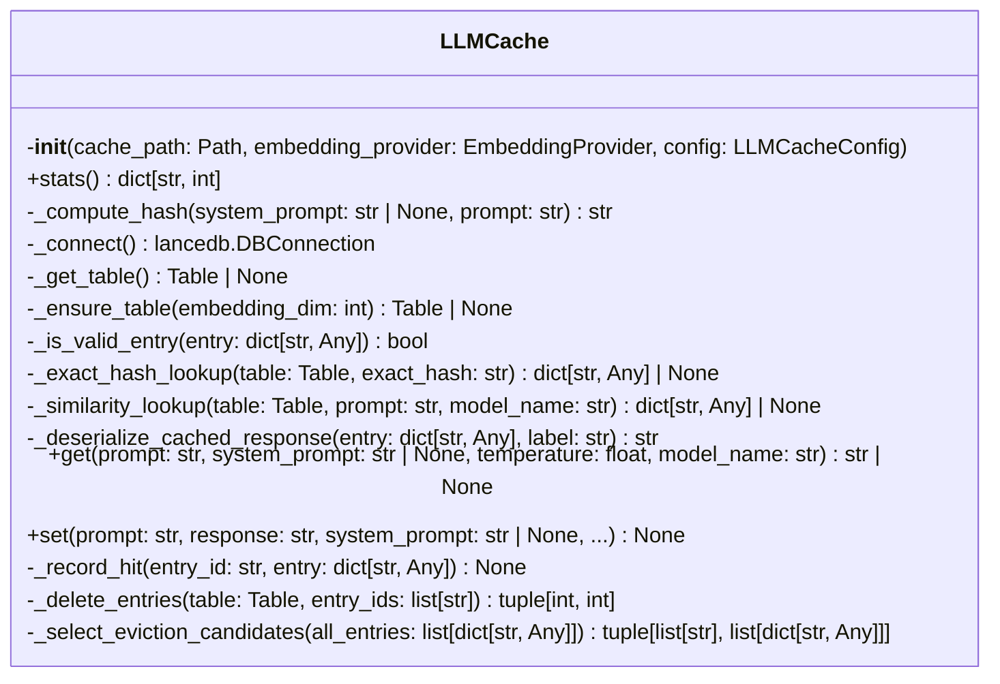

# File Overview

This file implements `LLMCache`, a caching mechanism for LLM responses using LanceDB for vector similarity search. The cache supports both exact hash-based lookups and embedding-based similarity searches to retrieve previously generated responses, improving performance and reducing redundant LLM calls.

The cache is designed to be deterministic, meaning it only caches responses for prompts with low temperatures to ensure reproducibility. It also enforces TTL (time-to-live) and maximum entry limits to manage storage and freshness of cached data.

## Design Rationale

The `LLMCache` uses a two-tiered lookup strategy:
1. **Exact Hash Lookup**: Fast, deterministic match using SHA256 hash of the combined system and user prompt.
2. **Vector Similarity Lookup**: Slower, but more flexible, using embedding vectors to find semantically similar prompts.

This dual approach balances performance and utility, allowing for both exact matches and approximate matches to be cached and reused.

LanceDB is chosen as the backend due to its support for vector similarity search, making it ideal for the embedding-based lookup. It also supports efficient storage and retrieval of structured data, which is used to store metadata about cached entries.

# Key Concepts

## Caching Strategy

The cache employs a hybrid approach combining exact hash matching and vector similarity search:
- **Exact Hash Matching**: For deterministic prompts, a SHA256 hash of the prompt is used to quickly find identical or near-identical entries.
- **Vector Similarity Search**: For non-exact matches, the prompt is embedded and compared using vector similarity to find semantically similar cached responses.

## Entry Management

- **TTL Enforcement**: Each cache entry has a time-to-live (TTL) to ensure stale responses are not returned.
- **Eviction Policy**: The cache implements a two-phase eviction strategy:
  1. Remove expired entries (based on TTL).
  2. If still over the limit, remove the least recently used (LRU) entries.
- **Hit Tracking**: Each cache hit increments a `hit_count` and updates `last_hit_at` for LRU tracking.

## Deterministic Caching

Only responses with a `temperature` below `max_cacheable_temperature` are cached. This ensures that non-deterministic outputs (e.g., high temperature) are not cached, preventing incorrect reuse of stochastic outputs.

# Integration

This file is part of the `local_deepwiki` core module and integrates with:
- [`LLMCacheConfig`](../config/models_llm.md): Provides configuration for cache behavior like TTL, max entries, and similarity thresholds.
- [`EmbeddingProvider`](../providers/base.md): Used to generate embeddings for vector similarity lookups.
- [`get_logger`](../logging.md): Provides logging for cache operations and debug messages.

The `LLMCache` class is used by:
- `models_llm` and `cached` functions (likely in `src/local_deepwiki/core/graph_rag/models.py` or similar), where cached responses are retrieved or stored.
- `test_llm_cache`: Unit tests for the cache functionality.

The cache is intended to be a shared component, likely instantiated once and reused across different LLM calls within the application.

# Design Notes

## Trade-offs

- **Storage vs. Speed**: Using LanceDB allows for both fast hash lookups and vector similarity search, but requires more storage than a simple key-value store.
- **Determinism**: The decision to skip caching for high-temperature prompts ensures deterministic behavior, but may reduce cache hit rates for exploratory or creative prompts.

## Edge Cases Handled

- **Database Connection Errors**: Gracefully handles errors during database connection, lookup, or update operations, logging warnings and continuing execution.
- **Table Creation**: Ensures the cache table is created on first insert, avoiding issues with missing tables.
- **Index Creation Failures**: Attempts to create an index on `exact_hash` but gracefully handles failures (e.g., if index already exists).
- **Entry Deletion Failures**: During eviction, it logs failures to delete entries but continues with the eviction process.

## Implementation Choices

- **UUID for IDs**: Each cache entry is assigned a UUID to ensure uniqueness, even if the same prompt is cached multiple times.
- **No Direct Updates**: Due to LanceDB's lack of UPDATE support, cache hit counts and timestamps are updated by deleting and re-adding the entry.
- **Two-Phase Eviction**: First removes expired entries, then applies LRU eviction to ensure a clean cache without completely discarding recent entries.
- **Batching for Deletion**: When deleting entries, it batches the operations to reduce overhead, though individual deletions are still performed one by one due to limitations in LanceDB.

The use of `async` methods throughout the class supports asynchronous operations, which is crucial for I/O-bound tasks like database queries and embedding generation.

## API Reference

### class `LLMCache`

Vector-based cache for LLM responses with exact and similarity matching.  Uses a hybrid approach: 1. Fast path: Exact SHA256 hash match on (system_prompt + prompt) 2. Slow path: Embedding similarity search for semantic matches  Cache entries expire based on TTL and are evicted using LRU when max_entries is reached.

**Methods:**


<details>
<summary>View Source (lines 21-484) | <a href="https://github.com/UrbanDiver/local-deepwiki-mcp/blob/main/src/local_deepwiki/core/llm_cache.py#L21-L484">GitHub</a></summary>

```python
class LLMCache:
    # Methods: __init__, stats, _compute_hash, _connect, _get_table, _ensure_table, _is_valid_entry, _exact_hash_lookup, _similarity_lookup, _deserialize_cached_response, get, set, _record_hit, _delete_entries, _select_eviction_candidates, _maybe_evict, clear, get_entry_count
```

</details>

#### `__init__`

```python
def __init__(cache_path: Path, embedding_provider: EmbeddingProvider, config: LLMCacheConfig)
```

Initialize the LLM cache.


| Parameter | Type | Default | Description |
|-----------|------|---------|-------------|
| `cache_path` | `Path` | - | Path to the LanceDB cache database. |
| `embedding_provider` | `EmbeddingProvider` | - | Provider for generating prompt embeddings. |
| `config` | `LLMCacheConfig` | - | Cache configuration. |


<details>
<summary>View Source (lines 33-52) | <a href="https://github.com/UrbanDiver/local-deepwiki-mcp/blob/main/src/local_deepwiki/core/llm_cache.py#L33-L52">GitHub</a></summary>

```python
def __init__(
        self,
        cache_path: Path,
        embedding_provider: EmbeddingProvider,
        config: LLMCacheConfig,
    ):
        """Initialize the LLM cache.

        Args:
            cache_path: Path to the LanceDB cache database.
            embedding_provider: Provider for generating prompt embeddings.
            config: Cache configuration.
        """
        self.cache_path = cache_path
        self.embedding_provider = embedding_provider
        # Store a defensive copy to prevent external mutation
        self.config = config.model_copy(deep=True)
        self._db: lancedb.DBConnection | None = None
        self._table: Table | None = None
        self._stats = {"hits": 0, "misses": 0, "skipped": 0}
```

</details>

#### `stats`

```python
def stats() -> dict[str, int]
```

Get cache statistics.


<details>
<summary>View Source (lines 55-57) | <a href="https://github.com/UrbanDiver/local-deepwiki-mcp/blob/main/src/local_deepwiki/core/llm_cache.py#L55-L57">GitHub</a></summary>

```python
def stats(self) -> dict[str, int]:
        """Get cache statistics."""
        return self._stats.copy()
```

</details>

#### `get`

```python
async def get(prompt: str, system_prompt: str | None = None, temperature: float = 0.7, model_name: str = "") -> str | None
```

Try to get a cached response.  Strategy: 1. Skip if temperature too high (non-deterministic) 2. Try exact hash match (fast path) 3. If no exact match, try embedding similarity search (slow path) 4. Return None if no suitable cache hit


| Parameter | Type | Default | Description |
|-----------|------|---------|-------------|
| `prompt` | `str` | - | User prompt. |
| `system_prompt` | `str | None` | `None` | System prompt. |
| `temperature` | `float` | `0.7` | LLM temperature used. |
| `model_name` | `str` | `""` | Name of the LLM model. |


<details>
<summary>View Source (lines 172-221) | <a href="https://github.com/UrbanDiver/local-deepwiki-mcp/blob/main/src/local_deepwiki/core/llm_cache.py#L172-L221">GitHub</a></summary>

```python
async def get(
        self,
        prompt: str,
        system_prompt: str | None = None,
        temperature: float = 0.7,
        model_name: str = "",
    ) -> str | None:
        """Try to get a cached response.

        Strategy:
        1. Skip if temperature too high (non-deterministic)
        2. Try exact hash match (fast path)
        3. If no exact match, try embedding similarity search (slow path)
        4. Return None if no suitable cache hit

        Args:
            prompt: User prompt.
            system_prompt: System prompt.
            temperature: LLM temperature used.
            model_name: Name of the LLM model.

        Returns:
            Cached response if found and valid, None otherwise.
        """
        if temperature > self.config.max_cacheable_temperature:
            self._stats["skipped"] += 1
            logger.debug(
                "Cache skip: temperature %s > max %s",
                temperature,
                self.config.max_cacheable_temperature,
            )
            return None

        table = self._get_table()
        if table is None:
            self._stats["misses"] += 1
            return None

        exact_hash = self._compute_hash(system_prompt, prompt)

        entry = await self._exact_hash_lookup(table, exact_hash)
        if entry is not None:
            return await self._deserialize_cached_response(entry, "exact")

        entry = await self._similarity_lookup(table, prompt, model_name)
        if entry is not None:
            return await self._deserialize_cached_response(entry, "similarity")

        self._stats["misses"] += 1
        return None
```

</details>

#### `set`

```python
async def set(prompt: str, response: str, system_prompt: str | None = None, temperature: float = 0.7, model_name: str = "", ttl_seconds: int | None = None) -> None
```

Cache an LLM response.


| Parameter | Type | Default | Description |
|-----------|------|---------|-------------|
| `prompt` | `str` | - | User prompt. |
| `response` | `str` | - | LLM response to cache. |
| `system_prompt` | `str | None` | `None` | System prompt used. |
| `temperature` | `float` | `0.7` | LLM temperature used. |
| `model_name` | `str` | `""` | Name of the LLM model. |
| `ttl_seconds` | `int | None` | `None` | Optional TTL override for this entry. |


<details>
<summary>View Source (lines 223-297) | <a href="https://github.com/UrbanDiver/local-deepwiki-mcp/blob/main/src/local_deepwiki/core/llm_cache.py#L223-L297">GitHub</a></summary>

```python
async def set(
        self,
        prompt: str,
        response: str,
        system_prompt: str | None = None,
        temperature: float = 0.7,
        model_name: str = "",
        ttl_seconds: int | None = None,
    ) -> None:
        """Cache an LLM response.

        Args:
            prompt: User prompt.
            response: LLM response to cache.
            system_prompt: System prompt used.
            temperature: LLM temperature used.
            model_name: Name of the LLM model.
            ttl_seconds: Optional TTL override for this entry.
        """
        # Skip if temperature too high
        if temperature > self.config.max_cacheable_temperature:
            logger.debug("Cache skip set: temperature %s > max", temperature)
            return

        try:
            exact_hash = self._compute_hash(system_prompt, prompt)
            prompt_embedding = (await self.embedding_provider.embed([prompt]))[0]
            now = time.time()

            entry_id = str(uuid.uuid4())
            record = {
                "id": entry_id,
                "exact_hash": exact_hash,
                "vector": prompt_embedding,
                "system_prompt": system_prompt or "",
                "prompt": prompt,
                "response": response,
                "temperature": temperature,
                "model_name": model_name,
                "created_at": now,
                "hit_count": 0,
                "last_hit_at": now,
                "ttl_seconds": ttl_seconds or self.config.ttl_seconds,
            }

            db = self._connect()
            if self.TABLE_NAME in db.list_tables().tables:
                table = db.open_table(self.TABLE_NAME)
                table.add([record])
                self._table = table
            else:
                # Create table with first record
                self._table = db.create_table(self.TABLE_NAME, [record])
                # Create index on exact_hash for fast lookups
                try:
                    self._table.create_scalar_index("exact_hash")
                    logger.debug("Created scalar index on exact_hash")
                except (ValueError, RuntimeError, OSError) as e:
                    # ValueError: Index already exists
                    # RuntimeError: Column type not supported
                    # OSError: Storage issues
                    logger.debug("Could not create index: %s", e)

            logger.debug(
                "Cached response: id=%s..., hash=%s...", entry_id[:8], exact_hash[:12]
            )

            # Check if we need to evict old entries
            await self._maybe_evict()

        except (ValueError, RuntimeError, OSError) as e:
            # ValueError: Invalid data format or embedding failure
            # RuntimeError: Database operation failure
            # OSError: File system or storage issues
            logger.warning("Failed to cache response: %s", e)
```

</details>

#### `clear`

```python
async def clear() -> int
```

Clear all cache entries.


<details>
<summary>View Source (lines 448-468) | <a href="https://github.com/UrbanDiver/local-deepwiki-mcp/blob/main/src/local_deepwiki/core/llm_cache.py#L448-L468">GitHub</a></summary>

```python
async def clear(self) -> int:
        """Clear all cache entries.

        Returns:
            Number of entries cleared.
        """
        try:
            db = self._connect()
            if self.TABLE_NAME in db.list_tables().tables:
                table = db.open_table(self.TABLE_NAME)
                count = cast(int, table.count_rows())
                db.drop_table(self.TABLE_NAME)
                self._table = None
                logger.info("Cleared %s cache entries", count)
                return count
            return 0
        except (RuntimeError, OSError) as e:
            # RuntimeError: Database operation failure
            # OSError: Storage or file system issues
            logger.warning("Failed to clear cache: %s", e)
            return 0
```

</details>

#### `get_entry_count`

```python
def get_entry_count() -> int
```

Get the number of entries in the cache.


<details>
<summary>View Source (lines 470-484) | <a href="https://github.com/UrbanDiver/local-deepwiki-mcp/blob/main/src/local_deepwiki/core/llm_cache.py#L470-L484">GitHub</a></summary>

```python
def get_entry_count(self) -> int:
        """Get the number of entries in the cache.

        Returns:
            Number of cache entries.
        """
        try:
            table = self._get_table()
            if table is None:
                return 0
            return cast(int, table.count_rows())
        except (RuntimeError, OSError):
            # RuntimeError: Database query failure
            # OSError: Storage access issues
            return 0
```

</details>

## Class Diagram


```mermaid
classDiagram
    class LLMCache {
        -__init__(cache_path: Path, embedding_provider: EmbeddingProvider, config: LLMCacheConfig)
        +stats() dict[str, int]
        -_compute_hash(system_prompt: str | None, prompt: str) str
        -_connect() lancedb.DBConnection
        -_get_table() Table | None
        -_ensure_table(embedding_dim: int) Table | None
        -_is_valid_entry(entry: dict[str, Any]) bool
        -_exact_hash_lookup(table: Table, exact_hash: str) dict[str, Any] | None
        -_similarity_lookup(table: Table, prompt: str, model_name: str) dict[str, Any] | None
        -_deserialize_cached_response(entry: dict[str, Any], label: str) str
        +get(prompt: str, system_prompt: str | None, temperature: float, model_name: str) str | None
        +set(prompt: str, response: str, system_prompt: str | None, ...) None
        -_record_hit(entry_id: str, entry: dict[str, Any]) None
        -_delete_entries(table: Table, entry_ids: list[str]) tuple[int, int]
        -_select_eviction_candidates(all_entries: list[dict[str, Any]]) tuple[list[str], list[dict[str, Any]]]
    }
```

## Call Graph


```mermaid
flowchart TD
    N0[LLMCache.__init__]
    N1[LLMCache._compute_hash]
    N2[LLMCache._connect]
    N3[LLMCache._deserialize_cache...]
    N4[LLMCache._ensure_table]
    N5[LLMCache._exact_hash_lookup]
    N6[LLMCache._get_table]
    N7[LLMCache._is_valid_entry]
    N8[LLMCache._maybe_evict]
    N9[LLMCache._record_hit]
    N10[LLMCache._similarity_lookup]
    N11[LLMCache.clear]
    N12[LLMCache.get]
    N13[LLMCache.get_entry_count]
    N14[LLMCache.set]
    N15[_compute_hash]
    N16[_connect]
    N17[_get_table]
    N18[_is_valid_entry]
    N19[add]
    N20[cast]
    N21[count_rows]
    N22[delete]
    N23[embed]
    N24[limit]
    N25[list_tables]
    N26[open_table]
    N27[search]
    N28[time]
    N29[to_list]
    N6 --> N16
    N6 --> N25
    N6 --> N26
    N4 --> N16
    N4 --> N25
    N4 --> N26
    N7 --> N20
    N7 --> N28
    N5 --> N29
    N5 --> N24
    N5 --> N27
    N5 --> N18
    N10 --> N23
    N10 --> N29
    N10 --> N24
    N10 --> N27
    N10 --> N18
    N3 --> N20
    N12 --> N17
    N12 --> N15
    N14 --> N15
    N14 --> N23
    N14 --> N28
    N14 --> N16
    N14 --> N25
    N14 --> N26
    N14 --> N19
    N9 --> N17
    N9 --> N28
    N9 --> N22
    N9 --> N19
    N8 --> N17
    N8 --> N21
    N8 --> N29
    N8 --> N24
    N8 --> N27
    N11 --> N16
    N11 --> N25
    N11 --> N26
    N11 --> N20
    N11 --> N21
    N13 --> N17
    N13 --> N20
    N13 --> N21
    classDef func fill:#e1f5fe
    class N15,N16,N17,N18,N19,N20,N21,N22,N23,N24,N25,N26,N27,N28,N29 func
    classDef method fill:#fff3e0
    class N0,N1,N2,N3,N4,N5,N6,N7,N8,N9,N10,N11,N12,N13,N14 method
```

## Used By

Functions and methods in this file and their callers:

- **`_compute_hash`**: called by `LLMCache.get`, `LLMCache.set`
- **`_connect`**: called by `LLMCache._ensure_table`, `LLMCache._get_table`, `LLMCache.clear`, `LLMCache.set`
- **`_delete_entries`**: called by `LLMCache._maybe_evict`
- **`_deserialize_cached_response`**: called by `LLMCache.get`
- **`_exact_hash_lookup`**: called by `LLMCache.get`
- **`_get_table`**: called by `LLMCache._maybe_evict`, `LLMCache._record_hit`, `LLMCache.get`, `LLMCache.get_entry_count`
- **`_is_valid_entry`**: called by `LLMCache._exact_hash_lookup`, `LLMCache._select_eviction_candidates`, `LLMCache._similarity_lookup`
- **`_maybe_evict`**: called by `LLMCache.set`
- **`_record_hit`**: called by `LLMCache._deserialize_cached_response`
- **`_select_eviction_candidates`**: called by `LLMCache._maybe_evict`
- **`_similarity_lookup`**: called by `LLMCache.get`
- **`add`**: called by `LLMCache._record_hit`, `LLMCache.set`
- **`cast`**: called by `LLMCache._deserialize_cached_response`, `LLMCache._is_valid_entry`, `LLMCache.clear`, `LLMCache.get_entry_count`
- **`connect`**: called by `LLMCache._connect`
- **`copy`**: called by `LLMCache.stats`
- **`count_rows`**: called by `LLMCache._maybe_evict`, `LLMCache.clear`, `LLMCache.get_entry_count`
- **`create_scalar_index`**: called by `LLMCache.set`
- **`create_table`**: called by `LLMCache.set`
- **`delete`**: called by `LLMCache._delete_entries`, `LLMCache._record_hit`
- **`drop_table`**: called by `LLMCache.clear`
- **`embed`**: called by `LLMCache._similarity_lookup`, `LLMCache.set`
- **`encode`**: called by `LLMCache._compute_hash`
- **`hexdigest`**: called by `LLMCache._compute_hash`
- **`limit`**: called by `LLMCache._exact_hash_lookup`, `LLMCache._maybe_evict`, `LLMCache._similarity_lookup`
- **`list_tables`**: called by `LLMCache._ensure_table`, `LLMCache._get_table`, `LLMCache.clear`, `LLMCache.set`
- **`mkdir`**: called by `LLMCache._connect`
- **`model_copy`**: called by `LLMCache.__init__`
- **`open_table`**: called by `LLMCache._ensure_table`, `LLMCache._get_table`, `LLMCache.clear`, `LLMCache.set`
- **`search`**: called by `LLMCache._exact_hash_lookup`, `LLMCache._maybe_evict`, `LLMCache._similarity_lookup`
- **`select`**: called by `LLMCache._maybe_evict`
- **`sha256`**: called by `LLMCache._compute_hash`
- **`time`**: called by `LLMCache._is_valid_entry`, `LLMCache._record_hit`, `LLMCache.set`
- **`to_list`**: called by `LLMCache._exact_hash_lookup`, `LLMCache._maybe_evict`, `LLMCache._similarity_lookup`
- **`uuid4`**: called by `LLMCache.set`
- **`where`**: called by `LLMCache._exact_hash_lookup`

## Usage Examples

*Examples extracted from test files*

### Test that empty cache returns None

From `test_llm_cache.py::TestLLMCache::test_cache_miss_on_empty_cache`:

```python
result = await cache.get(
    prompt="test prompt",
    system_prompt="test system",
    temperature=0.1,
    model_name="test-model",
)
assert result is None
assert cache.stats["misses"] == 1
```

### Test that empty cache returns None

From `test_llm_cache.py::TestLLMCache::test_cache_miss_on_empty_cache`:

```python
result = await cache.get(
    prompt="test prompt",
    system_prompt="test system",
    temperature=0.1,
    model_name="test-model",
)
assert result is None
assert cache.stats["misses"] == 1
```

### Test that exact same prompt returns cached response

From `test_llm_cache.py::TestLLMCache::test_cache_set_and_get_exact_match`:

```python
prompt = "What is the meaning of life?"
system_prompt = "You are a philosopher"
response = "42"

# Set cache entry
await cache.set(
    prompt=prompt,
    response=response,
    system_prompt=system_prompt,
    temperature=0.1,
    model_name="test-model",
)

# Get cache entry
result = await cache.get(
    prompt=prompt,
    system_prompt=system_prompt,
    temperature=0.1,
    model_name="test-model",
)

assert result == response
assert cache.stats["hits"] == 1
```

### Test that exact same prompt returns cached response

From `test_llm_cache.py::TestLLMCache::test_cache_set_and_get_exact_match`:

```python
result = await cache.get(
    prompt=prompt,
    system_prompt=system_prompt,
    temperature=0.1,
    model_name="test-model",
)

assert result == response
assert cache.stats["hits"] == 1
```

### Test that exact same prompt returns cached response

From `test_llm_cache.py::TestLLMCache::test_cache_set_and_get_exact_match`:

```python
await cache.set(
    prompt=prompt,
    response=response,
    system_prompt=system_prompt,
    temperature=0.1,
    model_name="test-model",
)

# Get cache entry
result = await cache.get(
    prompt=prompt,
    system_prompt=system_prompt,
    temperature=0.1,
    model_name="test-model",
)

assert result == response
assert cache.stats["hits"] == 1
```


## Last Modified

| Entity | Type | Author | Date | Commit |
|--------|------|--------|------|--------|
| `LLMCache` | class | Brian Breidenbach | 1 week ago | `af244a5` refactor: split core hotspo... |
| `_exact_hash_lookup` | method | Brian Breidenbach | 1 week ago | `af244a5` refactor: split core hotspo... |
| `_similarity_lookup` | method | Brian Breidenbach | 1 week ago | `af244a5` refactor: split core hotspo... |
| `_deserialize_cached_response` | method | Brian Breidenbach | 1 week ago | `af244a5` refactor: split core hotspo... |
| `get` | method | Brian Breidenbach | 1 week ago | `af244a5` refactor: split core hotspo... |
| `_delete_entries` | method | Brian Breidenbach | 1 week ago | `af244a5` refactor: split core hotspo... |
| `_select_eviction_candidates` | method | Brian Breidenbach | 1 week ago | `af244a5` refactor: split core hotspo... |
| `_maybe_evict` | method | Brian Breidenbach | 1 week ago | `af244a5` refactor: split core hotspo... |
| `_compute_hash` | method | Brian Breidenbach | Feb 20, 2026 | `6be69f5` refactor: low-priority Pyth... |
| `set` | method | Brian Breidenbach | Feb 20, 2026 | `b807417` refactor: high-priority Pyt... |
| `_ensure_table` | method | Brian Breidenbach | Feb 11, 2026 | `ba96da1` fix: publication plan P0-P2... |
| `_record_hit` | method | Brian Breidenbach | Feb 11, 2026 | `ba96da1` fix: publication plan P0-P2... |
| `clear` | method | Brian Breidenbach | Feb 11, 2026 | `ba96da1` fix: publication plan P0-P2... |
| `__init__` | method | Brian Breidenbach | Jan 22, 2026 | `2f85bf8` Fix critical issues: config... |
| `_is_valid_entry` | method | Brian Breidenbach | Jan 16, 2026 | `0d91a70` Apply Python best practices... |
| `get_entry_count` | method | Brian Breidenbach | Jan 16, 2026 | `0d91a70` Apply Python best practices... |
| `stats` | method | Brian Breidenbach | Jan 14, 2026 | `ac906d4` Add LLM response caching wi... |
| `_connect` | method | Brian Breidenbach | Jan 14, 2026 | `ac906d4` Add LLM response caching wi... |
| `_get_table` | method | Brian Breidenbach | Jan 14, 2026 | `ac906d4` Add LLM response caching wi... |

## Additional Source Code

Source code for functions and methods not listed in the API Reference above.

#### `_compute_hash`

<details>
<summary>View Source (lines 60-71) | <a href="https://github.com/UrbanDiver/local-deepwiki-mcp/blob/main/src/local_deepwiki/core/llm_cache.py#L60-L71">GitHub</a></summary>

```python
def _compute_hash(system_prompt: str | None, prompt: str) -> str:
        """Compute exact match hash for fast lookup.

        Args:
            system_prompt: System prompt used.
            prompt: User prompt.

        Returns:
            SHA256 hash of the combined prompts.
        """
        combined = f"{system_prompt or ''}\n---\n{prompt}"
        return hashlib.sha256(combined.encode()).hexdigest()
```

</details>


#### `_connect`

<details>
<summary>View Source (lines 73-78) | <a href="https://github.com/UrbanDiver/local-deepwiki-mcp/blob/main/src/local_deepwiki/core/llm_cache.py#L73-L78">GitHub</a></summary>

```python
def _connect(self) -> lancedb.DBConnection:
        """Get or create database connection."""
        if self._db is None:
            self.cache_path.parent.mkdir(parents=True, exist_ok=True)
            self._db = lancedb.connect(str(self.cache_path))
        return self._db
```

</details>


#### `_get_table`

<details>
<summary>View Source (lines 80-86) | <a href="https://github.com/UrbanDiver/local-deepwiki-mcp/blob/main/src/local_deepwiki/core/llm_cache.py#L80-L86">GitHub</a></summary>

```python
def _get_table(self) -> Table | None:
        """Get the cache table if it exists."""
        if self._table is None:
            db = self._connect()
            if self.TABLE_NAME in db.list_tables().tables:
                self._table = db.open_table(self.TABLE_NAME)
        return self._table
```

</details>


#### `_ensure_table`

<details>
<summary>View Source (lines 88-108) | <a href="https://github.com/UrbanDiver/local-deepwiki-mcp/blob/main/src/local_deepwiki/core/llm_cache.py#L88-L108">GitHub</a></summary>

```python
def _ensure_table(self, embedding_dim: int) -> Table | None:
        """Ensure the cache table exists with proper schema.

        Args:
            embedding_dim: Dimension of embedding vectors (unused, kept for API compat).

        Returns:
            The cache table if it exists, None otherwise.
            Table is created on first insert via get_or_cache().
        """
        if self._table is not None:
            return self._table

        db = self._connect()
        if self.TABLE_NAME in db.list_tables().tables:
            self._table = db.open_table(self.TABLE_NAME)
            return self._table

        # Table doesn't exist yet - will be created on first insert
        logger.debug("LLM cache table does not exist yet at %s", self.cache_path)
        return None
```

</details>


#### `_is_valid_entry`

<details>
<summary>View Source (lines 110-122) | <a href="https://github.com/UrbanDiver/local-deepwiki-mcp/blob/main/src/local_deepwiki/core/llm_cache.py#L110-L122">GitHub</a></summary>

```python
def _is_valid_entry(self, entry: dict[str, Any]) -> bool:
        """Check if a cache entry is still valid (not expired).

        Args:
            entry: Cache entry record.

        Returns:
            True if entry is valid, False if expired.
        """
        created_at = cast(float, entry.get("created_at", 0))
        ttl = cast(float, entry.get("ttl_seconds", self.config.ttl_seconds))
        age = time.time() - created_at
        return age < ttl
```

</details>


#### `_exact_hash_lookup`

<details>
<summary>View Source (lines 124-136) | <a href="https://github.com/UrbanDiver/local-deepwiki-mcp/blob/main/src/local_deepwiki/core/llm_cache.py#L124-L136">GitHub</a></summary>

```python
async def _exact_hash_lookup(
        self, table: Table, exact_hash: str
    ) -> dict[str, Any] | None:
        """Try an exact hash lookup. Returns the entry dict on hit, or None."""
        try:
            results = (
                table.search().where(f"exact_hash = '{exact_hash}'").limit(1).to_list()
            )
            if results and self._is_valid_entry(results[0]):
                return results[0]
        except (KeyError, ValueError, RuntimeError, OSError) as e:
            logger.debug("Exact hash lookup failed: %s", e)
        return None
```

</details>


#### `_similarity_lookup`

<details>
<summary>View Source (lines 138-159) | <a href="https://github.com/UrbanDiver/local-deepwiki-mcp/blob/main/src/local_deepwiki/core/llm_cache.py#L138-L159">GitHub</a></summary>

```python
async def _similarity_lookup(
        self, table: Table, prompt: str, model_name: str
    ) -> dict[str, Any] | None:
        """Try a vector similarity lookup. Returns the first valid matching entry, or None."""
        try:
            query_embedding = (await self.embedding_provider.embed([prompt]))[0]
            similar_results = table.search(query_embedding).limit(5).to_list()
            for result in similar_results:
                similarity = 1.0 - result.get("_distance", 1.0)
                if similarity >= self.config.similarity_threshold:
                    if result.get(
                        "model_name", ""
                    ) == model_name and self._is_valid_entry(result):
                        logger.debug(
                            "Cache similarity hit: similarity=%.3f, entry=%s...",
                            similarity,
                            result["id"][:8],
                        )
                        return result
        except (KeyError, ValueError, RuntimeError, OSError) as e:
            logger.debug("Similarity search failed: %s", e)
        return None
```

</details>


#### `_deserialize_cached_response`

<details>
<summary>View Source (lines 161-170) | <a href="https://github.com/UrbanDiver/local-deepwiki-mcp/blob/main/src/local_deepwiki/core/llm_cache.py#L161-L170">GitHub</a></summary>

```python
async def _deserialize_cached_response(
        self,
        entry: dict[str, Any],
        label: str,
    ) -> str:
        """Record a hit for *entry* and return its response string."""
        self._stats["hits"] += 1
        logger.debug("Cache %s hit: id=%s...", label, str(entry.get("id", ""))[:8])
        await self._record_hit(entry["id"], entry)
        return cast(str, entry["response"])
```

</details>


#### `_record_hit`

<details>
<summary>View Source (lines 299-340) | <a href="https://github.com/UrbanDiver/local-deepwiki-mcp/blob/main/src/local_deepwiki/core/llm_cache.py#L299-L340">GitHub</a></summary>

```python
async def _record_hit(self, entry_id: str, entry: dict[str, Any]) -> None:
        """Record a cache hit for an entry.

        Updates hit_count and last_hit_at for LRU tracking.
        Since LanceDB doesn't support UPDATE, we delete and re-add the entry.
        The caller passes the already-fetched entry to avoid a redundant query.

        Args:
            entry_id: ID of the cache entry.
            entry: The full cache entry dict (already fetched by get()).
        """
        try:
            table = self._get_table()
            if table is None:
                return

            # Create updated record from the already-fetched entry
            updated_record = {
                "id": entry["id"],
                "exact_hash": entry["exact_hash"],
                "vector": entry["vector"],
                "system_prompt": entry["system_prompt"],
                "prompt": entry["prompt"],
                "response": entry["response"],
                "temperature": entry["temperature"],
                "model_name": entry["model_name"],
                "created_at": entry["created_at"],
                "hit_count": entry.get("hit_count", 0) + 1,
                "last_hit_at": time.time(),
                "ttl_seconds": entry.get("ttl_seconds", self.config.ttl_seconds),
            }

            # Delete old and add updated (LanceDB doesn't support UPDATE)
            table.delete(f"id = '{entry_id}'")
            table.add([updated_record])

        except (KeyError, ValueError, RuntimeError, OSError) as e:
            # KeyError: Entry not found or missing fields
            # ValueError: Invalid query
            # RuntimeError: Database operation failure
            # OSError: Storage issues
            logger.debug("Failed to record hit: %s", e)
```

</details>


#### `_delete_entries`

<details>
<summary>View Source (lines 342-356) | <a href="https://github.com/UrbanDiver/local-deepwiki-mcp/blob/main/src/local_deepwiki/core/llm_cache.py#L342-L356">GitHub</a></summary>

```python
def _delete_entries(self, table: Table, entry_ids: list[str]) -> tuple[int, int]:
        """Delete entries from the table by ID.

        Returns:
            Tuple of (deleted_count, failed_count).
        """
        deleted = 0
        failed = 0
        for entry_id in entry_ids:
            try:
                table.delete(f"id = '{entry_id}'")
                deleted += 1
            except (ValueError, RuntimeError, OSError):
                failed += 1
        return deleted, failed
```

</details>


#### `_select_eviction_candidates`

<details>
<summary>View Source (lines 358-382) | <a href="https://github.com/UrbanDiver/local-deepwiki-mcp/blob/main/src/local_deepwiki/core/llm_cache.py#L358-L382">GitHub</a></summary>

```python
def _select_eviction_candidates(
        self,
        all_entries: list[dict[str, Any]],
    ) -> tuple[list[str], list[dict[str, Any]]]:
        """Partition entries into expired IDs and valid entries for LRU eviction.

        Args:
            all_entries: All fetched entries with eviction-relevant columns.

        Returns:
            Tuple of (expired_ids, valid_entries_sorted_lru).
        """
        expired_ids: list[str] = []
        valid_entries: list[dict[str, Any]] = []
        for entry in all_entries:
            if not self._is_valid_entry(entry):
                expired_ids.append(entry["id"])
            else:
                valid_entries.append(entry)
        # Pre-sort valid entries by LRU order so callers need not sort again
        valid_entries = sorted(
            valid_entries,
            key=lambda e: e.get("last_hit_at", e.get("created_at", 0)),
        )
        return expired_ids, valid_entries
```

</details>


#### `_maybe_evict`

<details>
<summary>View Source (lines 384-446) | <a href="https://github.com/UrbanDiver/local-deepwiki-mcp/blob/main/src/local_deepwiki/core/llm_cache.py#L384-L446">GitHub</a></summary>

```python
async def _maybe_evict(self) -> None:
        """Evict old entries if cache exceeds max_entries.

        Uses a two-phase eviction strategy:
        1. First, remove all expired entries (TTL-based)
        2. If still over limit, remove oldest entries by last_hit_at (LRU)

        Eviction is triggered when entry count exceeds max_entries.
        """
        try:
            table = self._get_table()
            if table is None:
                return

            count = table.count_rows()
            if count <= self.config.max_entries:
                return

            logger.info(
                "Cache has %d entries (max: %d), evicting...",
                count,
                self.config.max_entries,
            )

            eviction_columns = ["id", "created_at", "ttl_seconds", "last_hit_at"]
            fetch_limit = min(count, self.config.max_entries * 2)
            all_entries = (
                table.search().select(eviction_columns).limit(fetch_limit).to_list()
            )

            expired_ids, valid_entries = self._select_eviction_candidates(all_entries)

            # Phase 1: delete expired entries
            deleted_count = 0
            if expired_ids:
                deleted_count, failed_count = self._delete_entries(table, expired_ids)
                logger.info("Evicted %s expired cache entries", deleted_count)
                if failed_count:
                    logger.warning(
                        "Failed to evict %d of %d expired entries",
                        failed_count,
                        len(expired_ids),
                    )

            # Phase 2: LRU eviction if still over limit
            remaining_count = count - deleted_count
            if remaining_count > self.config.max_entries and valid_entries:
                target_count = int(self.config.max_entries * 0.8)
                to_evict = remaining_count - target_count
                if to_evict > 0:
                    lru_deleted, lru_failed = self._delete_entries(
                        table, [e["id"] for e in valid_entries[:to_evict]]
                    )
                    logger.info("Evicted %s LRU cache entries", lru_deleted)
                    if lru_failed:
                        logger.warning(
                            "Failed to evict %d of %d LRU entries",
                            lru_failed,
                            to_evict,
                        )

        except (KeyError, ValueError, RuntimeError, OSError) as e:
            logger.warning("Eviction failed: %s", e)
```

</details>

## Relevant Source Files

- `src/local_deepwiki/core/llm_cache.py:21-484`
