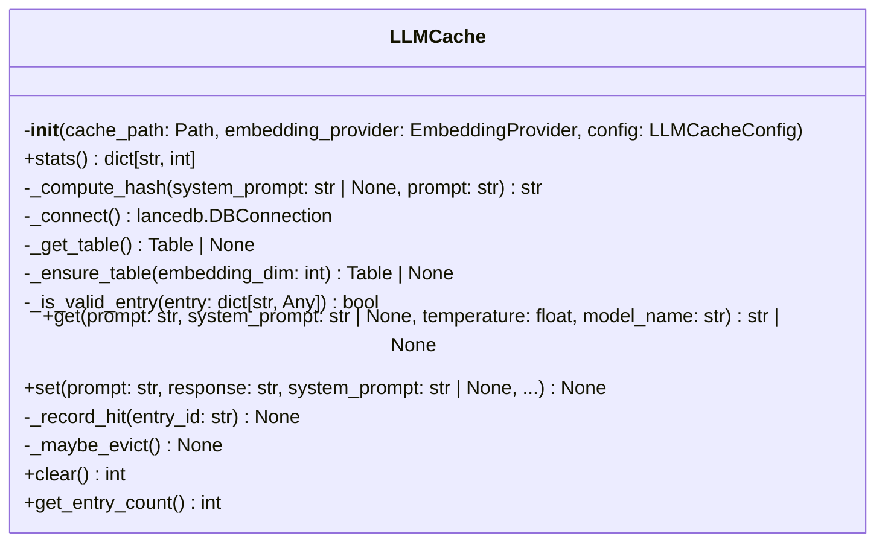

# File Overview

This file defines the `LLMCache` class, which provides a caching mechanism for LLM (Large [Language](../models.md) Model) responses. It uses LanceDB for persistent storage and supports both exact hash-based lookups and embedding-based similarity searches for cache retrieval. The cache supports TTL (time-to-live) expiration and LRU (least recently used) eviction policies.

Dependencies:
- `hashlib`: For computing SHA256 hashes.
- `time`: For managing entry timestamps and TTL checks.
- `uuid`: For generating unique IDs.
- `pathlib.Path`: For handling file paths.
- `typing`: For type hints.
- `lancedb`: For database operations.
- [`local_deepwiki.config.LLMCacheConfig`](../config.md): For cache configuration.
- [`local_deepwiki.logging.get_logger`](../logging.md): For logging.
- [`local_deepwiki.providers.base.EmbeddingProvider`](../providers/base.md): For embedding generation.

# Classes

## LLMCache

The `LLMCache` class provides a persistent, configurable cache for LLM responses. It supports exact match lookups, embedding-based similarity searches, TTL expiration, and LRU eviction.

### Methods

#### `__init__(self, cache_path: Path, embedding_provider: EmbeddingProvider, config: LLMCacheConfig)`

Initialize the LLM cache.

- **Parameters**:
  - `cache_path`: Path to the LanceDB cache database.
  - `embedding_provider`: Provider for generating prompt embeddings.
  - `config`: Cache configuration.

#### `stats(self) -> dict[str, int]`

Get cache statistics.

- **Returns**: A copy of the internal statistics dictionary.

#### `_compute_hash(self, system_prompt: str | None, prompt: str) -> str`

Compute exact match hash for fast lookup.

- **Parameters**:
  - `system_prompt`: System prompt used.
  - `prompt`: User prompt.
- **Returns**: SHA256 hash of the combined prompts.

#### `_connect(self) -> lancedb.DBConnection`

Get or create database connection.

- **Returns**: LanceDB database connection.

#### `_get_table(self) -> Table | None`

Get the cache table if it exists.

- **Returns**: The cache table if it exists, otherwise `None`.

#### `_ensure_table(self, embedding_dim: int) -> Table | None`

Ensure the cache table exists with proper schema.

- **Parameters**:
  - `embedding_dim`: Dimension of embedding vectors (unused, kept for API compat).
- **Returns**: The cache table if it exists, `None` otherwise. Table is created on first insert via `get_or_cache()`.

#### `_is_valid_entry(self, entry: dict[str, Any]) -> bool`

Check if a cache entry is still valid (not expired).

- **Parameters**:
  - `entry`: Cache entry record.
- **Returns**: `True` if entry is valid, `False` if expired.

#### `get(self, prompt: str, system_prompt: str | None = None, temperature: float = 0.7, model_name: str = "") -> str | None`

Try to get a cached response.

Strategy:
1. Skip if temperature too high (non-deterministic)
2. Try exact hash match (fast path)
3. If no exact match, try embedding similarity search (slow path)
4. Return `None` if no suitable cache hit

- **Parameters**:
  - `prompt`: User prompt.
  - `system_prompt`: System prompt.
  - `temperature`: LLM temperature used.
  - `model_name`: Name of the LLM model.
- **Returns**: Cached response if found, otherwise `None`.

#### `set(self, prompt: str, response: str, system_prompt: str | None = None, temperature: float = 0.7, model_name: str = "", ttl_seconds: int | None = None) -> None`

Cache an LLM response.

- **Parameters**:
  - `prompt`: User prompt.
  - `response`: LLM response to cache.
  - `system_prompt`: System prompt used.
  - `temperature`: LLM temperature used.
  - `model_name`: Name of the LLM model.
  - `ttl_seconds`: Optional TTL override for this entry.

#### `_record_hit(self, entry_id: str) -> None`

Record a cache hit for an entry.

Updates `hit_count` and `last_hit_at` for LRU tracking. Since LanceDB doesn't support UPDATE, we delete and re-add the entry.

- **Parameters**:
  - `entry_id`: ID of the cache entry.

#### `_maybe_evict(self) -> None`

Evict old entries if cache exceeds `max_entries`.

Uses a two-phase eviction strategy:
1. First, remove all expired entries (TTL-based)
2. If still over limit, remove oldest entries by `last_hit_at` (LRU)

Eviction is triggered when entry count exceeds `max_entries`.

#### `clear(self) -> int`

Clear all cache entries.

- **Returns**: Number of entries cleared.

#### `get_entry_count(self) -> int`

Get the current number of entries in the cache.

- **Returns**: Number of entries in the cache.

# Integration

This file integrates with:
- [`local_deepwiki.config.LLMCacheConfig`](../config.md): Used for cache configuration.
- [`local_deepwiki.logging.get_logger`](../logging.md): Used for logging cache operations.
- [`local_deepwiki.providers.base.EmbeddingProvider`](../providers/base.md): Used for generating embeddings for similarity search.

It is related to:
- `src/local_deepwiki/core/__init__.py`
- `src/local_deepwiki/generators/source_refs.py`
- `src/local_deepwiki/plugins/base.py`
- `tests/__init__.py`
- `tests/test_plugins.py`

# Usage Examples

```python
from pathlib import Path
from local_deepwiki.config import LLMCacheConfig
from local_deepwiki.core.llm_cache import LLMCache
from local_deepwiki.providers.base import EmbeddingProvider

# Initialize cache
cache_path = Path("cache.db")
config = LLMCacheConfig()
embedding_provider = EmbeddingProvider()  # Assume this is implemented
cache = LLMCache(cache_path, embedding_provider, config)

# Get a cached response
response = await cache.get("What is the capital of France?")

# Set a response in cache
await cache.set("What is the capital of France?", "Paris")
```

## API Reference

### class `LLMCache`

Vector-based cache for LLM responses with exact and similarity matching.  Uses a hybrid approach: 1. Fast path: Exact SHA256 hash match on (system_prompt + prompt) 2. Slow path: Embedding similarity search for semantic matches  Cache entries expire based on TTL and are evicted using LRU when max_entries is reached.

**Methods:**


<details>
<summary>View Source (lines 19-444) | <a href="https://github.com/UrbanDiver/local-deepwiki-mcp/blob/[main](../export/pdf.md)/src/local_deepwiki/core/llm_cache.py#L19-L444">GitHub</a></summary>

```python
class LLMCache:
    # Methods: __init__, stats, _compute_hash, _connect, _get_table, _ensure_table, _is_valid_entry, get, set, _record_hit, _maybe_evict, clear, get_entry_count
```

</details>

#### `__init__`

```python
def __init__(cache_path: Path, embedding_provider: EmbeddingProvider, config: LLMCacheConfig)
```

Initialize the LLM cache.


| [Parameter](../generators/api_docs.md) | Type | Default | Description |
|-----------|------|---------|-------------|
| `cache_path` | `Path` | - | Path to the LanceDB cache database. |
| `embedding_provider` | [`EmbeddingProvider`](../providers/base.md) | - | Provider for generating prompt embeddings. |
| `config` | [`LLMCacheConfig`](../config.md) | - | Cache configuration. |


<details>
<summary>View Source (lines 31-50) | <a href="https://github.com/UrbanDiver/local-deepwiki-mcp/blob/[main](../export/pdf.md)/src/local_deepwiki/core/llm_cache.py#L31-L50">GitHub</a></summary>

```python
def __init__(
        self,
        cache_path: Path,
        embedding_provider: EmbeddingProvider,
        config: LLMCacheConfig,
    ):
        """Initialize the LLM cache.

        Args:
            cache_path: Path to the LanceDB cache database.
            embedding_provider: Provider for generating prompt embeddings.
            config: Cache configuration.
        """
        self.cache_path = cache_path
        self.embedding_provider = embedding_provider
        # Store a defensive copy to prevent external mutation
        self.config = config.model_copy(deep=True)
        self._db: lancedb.DBConnection | None = None
        self._table: Table | None = None
        self._stats = {"hits": 0, "misses": 0, "skipped": 0}
```

</details>

#### `stats`

```python
def stats() -> dict[str, int]
```

Get cache statistics.


<details>
<summary>View Source (lines 53-55) | <a href="https://github.com/UrbanDiver/local-deepwiki-mcp/blob/[main](../export/pdf.md)/src/local_deepwiki/core/llm_cache.py#L53-L55">GitHub</a></summary>

```python
def stats(self) -> dict[str, int]:
        """Get cache statistics."""
        return self._stats.copy()
```

</details>

#### `get`

```python
async def get(prompt: str, system_prompt: str | None = None, temperature: float = 0.7, model_name: str = "") -> str | None
```

Try to get a cached response.  Strategy: 1. Skip if temperature too high (non-deterministic) 2. Try exact hash match (fast path) 3. If no exact match, try embedding similarity search (slow path) 4. Return None if no suitable cache hit


| [Parameter](../generators/api_docs.md) | Type | Default | Description |
|-----------|------|---------|-------------|
| `prompt` | `str` | - | User prompt. |
| `system_prompt` | `str | None` | `None` | System prompt. |
| `temperature` | `float` | `0.7` | LLM temperature used. |
| `model_name` | `str` | `""` | Name of the LLM model. |


<details>
<summary>View Source (lines 121-209) | <a href="https://github.com/UrbanDiver/local-deepwiki-mcp/blob/[main](../export/pdf.md)/src/local_deepwiki/core/llm_cache.py#L121-L209">GitHub</a></summary>

```python
async def get(
        self,
        prompt: str,
        system_prompt: str | None = None,
        temperature: float = 0.7,
        model_name: str = "",
    ) -> str | None:
        """Try to get a cached response.

        Strategy:
        1. Skip if temperature too high (non-deterministic)
        2. Try exact hash match (fast path)
        3. If no exact match, try embedding similarity search (slow path)
        4. Return None if no suitable cache hit

        Args:
            prompt: User prompt.
            system_prompt: System prompt.
            temperature: LLM temperature used.
            model_name: Name of the LLM model.

        Returns:
            Cached response if found and valid, None otherwise.
        """
        # Skip if temperature too high (non-deterministic responses)
        if temperature > self.config.max_cacheable_temperature:
            self._stats["skipped"] += 1
            logger.debug(
                f"Cache skip: temperature {temperature} > max {self.config.max_cacheable_temperature}"
            )
            return None

        table = self._get_table()
        if table is None:
            self._stats["misses"] += 1
            return None

        exact_hash = self._compute_hash(system_prompt, prompt)

        # Fast path: exact hash match
        try:
            # LanceDB filter query for exact hash
            exact_results = table.search().where(f"exact_hash = '{exact_hash}'").limit(1).to_list()

            if exact_results:
                entry = exact_results[0]
                if self._is_valid_entry(entry):
                    self._stats["hits"] += 1
                    logger.debug(f"Cache exact hit: hash={exact_hash[:12]}...")
                    # Update hit tracking
                    await self._record_hit(entry["id"])
                    return cast(str, entry["response"])
        except (KeyError, ValueError, RuntimeError, OSError) as e:
            # KeyError: Missing field in result
            # ValueError: Invalid query or filter expression
            # RuntimeError: LanceDB query execution error
            # OSError: Database file access issues
            logger.debug(f"Exact hash lookup failed: {e}")

        # Slow path: embedding similarity search
        try:
            query_embedding = (await self.embedding_provider.embed([prompt]))[0]

            # Search for similar prompts with same model
            similar_results = table.search(query_embedding).limit(5).to_list()

            for result in similar_results:
                # Calculate similarity from distance
                similarity = 1.0 - result.get("_distance", 1.0)

                if similarity >= self.config.similarity_threshold:
                    # Check model match and validity
                    if result.get("model_name", "") == model_name and self._is_valid_entry(result):
                        self._stats["hits"] += 1
                        logger.debug(
                            f"Cache similarity hit: similarity={similarity:.3f}, "
                            f"entry={result['id'][:8]}..."
                        )
                        await self._record_hit(result["id"])
                        return cast(str, result["response"])
        except (KeyError, ValueError, RuntimeError, OSError) as e:
            # KeyError: Missing field in search result
            # ValueError: Invalid embedding or search parameters
            # RuntimeError: Vector search execution error
            # OSError: Database access issues
            logger.debug(f"Similarity search failed: {e}")

        self._stats["misses"] += 1
        return None
```

</details>

#### `set`

```python
async def set(prompt: str, response: str, system_prompt: str | None = None, temperature: float = 0.7, model_name: str = "", ttl_seconds: int | None = None) -> None
```

Cache an LLM response.


| [Parameter](../generators/api_docs.md) | Type | Default | Description |
|-----------|------|---------|-------------|
| `prompt` | `str` | - | User prompt. |
| `response` | `str` | - | LLM response to cache. |
| `system_prompt` | `str | None` | `None` | System prompt used. |
| `temperature` | `float` | `0.7` | LLM temperature used. |
| `model_name` | `str` | `""` | Name of the LLM model. |
| `ttl_seconds` | `int | None` | `None` | Optional TTL override for this entry. |


<details>
<summary>View Source (lines 211-283) | <a href="https://github.com/UrbanDiver/local-deepwiki-mcp/blob/[main](../export/pdf.md)/src/local_deepwiki/core/llm_cache.py#L211-L283">GitHub</a></summary>

```python
async def set(
        self,
        prompt: str,
        response: str,
        system_prompt: str | None = None,
        temperature: float = 0.7,
        model_name: str = "",
        ttl_seconds: int | None = None,
    ) -> None:
        """Cache an LLM response.

        Args:
            prompt: User prompt.
            response: LLM response to cache.
            system_prompt: System prompt used.
            temperature: LLM temperature used.
            model_name: Name of the LLM model.
            ttl_seconds: Optional TTL override for this entry.
        """
        # Skip if temperature too high
        if temperature > self.config.max_cacheable_temperature:
            logger.debug(f"Cache skip set: temperature {temperature} > max")
            return

        try:
            exact_hash = self._compute_hash(system_prompt, prompt)
            prompt_embedding = (await self.embedding_provider.embed([prompt]))[0]
            now = time.time()

            entry_id = str(uuid.uuid4())
            record = {
                "id": entry_id,
                "exact_hash": exact_hash,
                "vector": prompt_embedding,
                "system_prompt": system_prompt or "",
                "prompt": prompt,
                "response": response,
                "temperature": temperature,
                "model_name": model_name,
                "created_at": now,
                "hit_count": 0,
                "last_hit_at": now,
                "ttl_seconds": ttl_seconds or self.config.ttl_seconds,
            }

            db = self._connect()
            if self.TABLE_NAME in db.list_tables().tables:
                table = db.open_table(self.TABLE_NAME)
                table.add([record])
                self._table = table
            else:
                # Create table with first record
                self._table = db.create_table(self.TABLE_NAME, [record])
                # Create index on exact_hash for fast lookups
                try:
                    self._table.create_scalar_index("exact_hash")
                    logger.debug("Created scalar index on exact_hash")
                except (ValueError, RuntimeError, OSError) as e:
                    # ValueError: Index already exists
                    # RuntimeError: Column type not supported
                    # OSError: Storage issues
                    logger.debug(f"Could not create index: {e}")

            logger.debug(f"Cached response: id={entry_id[:8]}..., hash={exact_hash[:12]}...")

            # Check if we need to evict old entries
            await self._maybe_evict()

        except (ValueError, RuntimeError, OSError) as e:
            # ValueError: Invalid data format or embedding failure
            # RuntimeError: Database operation failure
            # OSError: File system or storage issues
            logger.warning(f"Failed to cache response: {e}")
```

</details>

#### `clear`

```python
async def clear() -> int
```

Clear all cache entries.


<details>
<summary>View Source (lines 408-428) | <a href="https://github.com/UrbanDiver/local-deepwiki-mcp/blob/[main](../export/pdf.md)/src/local_deepwiki/core/llm_cache.py#L408-L428">GitHub</a></summary>

```python
async def clear(self) -> int:
        """Clear all cache entries.

        Returns:
            Number of entries cleared.
        """
        try:
            db = self._connect()
            if self.TABLE_NAME in db.list_tables().tables:
                table = db.open_table(self.TABLE_NAME)
                count = cast(int, table.count_rows())
                db.drop_table(self.TABLE_NAME)
                self._table = None
                logger.info(f"Cleared {count} cache entries")
                return count
            return 0
        except (RuntimeError, OSError) as e:
            # RuntimeError: Database operation failure
            # OSError: Storage or file system issues
            logger.warning(f"Failed to clear cache: {e}")
            return 0
```

</details>

#### `get_entry_count`

```python
def get_entry_count() -> int
```

Get the number of entries in the cache.


<details>
<summary>View Source (lines 430-444) | <a href="https://github.com/UrbanDiver/local-deepwiki-mcp/blob/[main](../export/pdf.md)/src/local_deepwiki/core/llm_cache.py#L430-L444">GitHub</a></summary>

```python
def get_entry_count(self) -> int:
        """Get the number of entries in the cache.

        Returns:
            Number of cache entries.
        """
        try:
            table = self._get_table()
            if table is None:
                return 0
            return cast(int, table.count_rows())
        except (RuntimeError, OSError):
            # RuntimeError: Database query failure
            # OSError: Storage access issues
            return 0
```

</details>

## Class Diagram


```mermaid
classDiagram
    class LLMCache {
        -__init__(cache_path: Path, embedding_provider: EmbeddingProvider, config: LLMCacheConfig)
        +stats() dict[str, int]
        -_compute_hash(system_prompt: str | None, prompt: str) str
        -_connect() lancedb.DBConnection
        -_get_table() Table | None
        -_ensure_table(embedding_dim: int) Table | None
        -_is_valid_entry(entry: dict[str, Any]) bool
        +get(prompt: str, system_prompt: str | None, temperature: float, model_name: str) str | None
        +set(prompt: str, response: str, system_prompt: str | None, ...) None
        -_record_hit(entry_id: str) None
        -_maybe_evict() None
        +clear() int
        +get_entry_count() int
    }
```

## Call Graph


```mermaid
flowchart TD
    N0[LLMCache.__init__]
    N1[LLMCache._compute_hash]
    N2[LLMCache._connect]
    N3[LLMCache._ensure_table]
    N4[LLMCache._get_table]
    N5[LLMCache._is_valid_entry]
    N6[LLMCache._maybe_evict]
    N7[LLMCache._record_hit]
    N8[LLMCache.clear]
    N9[LLMCache.get]
    N10[LLMCache.get_entry_count]
    N11[LLMCache.set]
    N12[LLMCache.stats]
    N13[_compute_hash]
    N14[_connect]
    N15[_get_table]
    N16[_is_valid_entry]
    N17[add]
    N18[cast]
    N19[count_rows]
    N20[delete]
    N21[embed]
    N22[limit]
    N23[list_tables]
    N24[model_copy]
    N25[open_table]
    N26[search]
    N27[time]
    N28[to_list]
    N29[where]
    N0 --> N24
    N4 --> N14
    N4 --> N23
    N4 --> N25
    N3 --> N14
    N3 --> N23
    N3 --> N25
    N5 --> N18
    N5 --> N27
    N9 --> N15
    N9 --> N13
    N9 --> N28
    N9 --> N22
    N9 --> N29
    N9 --> N26
    N9 --> N16
    N9 --> N18
    N9 --> N21
    N11 --> N13
    N11 --> N21
    N11 --> N27
    N11 --> N14
    N11 --> N23
    N11 --> N25
    N11 --> N17
    N7 --> N15
    N7 --> N28
    N7 --> N22
    N7 --> N29
    N7 --> N26
    N7 --> N27
    N7 --> N20
    N7 --> N17
    N6 --> N15
    N6 --> N19
    N6 --> N28
    N6 --> N22
    N6 --> N26
    N6 --> N16
    N6 --> N20
    N8 --> N14
    N8 --> N23
    N8 --> N25
    N8 --> N18
    N8 --> N19
    N10 --> N15
    N10 --> N18
    N10 --> N19
    classDef func fill:#e1f5fe
    class N13,N14,N15,N16,N17,N18,N19,N20,N21,N22,N23,N24,N25,N26,N27,N28,N29 func
    classDef method fill:#fff3e0
    class N0,N1,N2,N3,N4,N5,N6,N7,N8,N9,N10,N11,N12 method
```

## Used By

Functions and methods in this file and their callers:

- **`_compute_hash`**: called by `LLMCache.get`, `LLMCache.set`
- **`_connect`**: called by `LLMCache._ensure_table`, `LLMCache._get_table`, `LLMCache.clear`, `LLMCache.set`
- **`_get_table`**: called by `LLMCache._maybe_evict`, `LLMCache._record_hit`, `LLMCache.get`, `LLMCache.get_entry_count`
- **`_is_valid_entry`**: called by `LLMCache._maybe_evict`, `LLMCache.get`
- **`_maybe_evict`**: called by `LLMCache.set`
- **`_record_hit`**: called by `LLMCache.get`
- **`add`**: called by `LLMCache._record_hit`, `LLMCache.set`
- **`cast`**: called by `LLMCache._is_valid_entry`, `LLMCache.clear`, `LLMCache.get`, `LLMCache.get_entry_count`
- **`connect`**: called by `LLMCache._connect`
- **`copy`**: called by `LLMCache.stats`
- **`count_rows`**: called by `LLMCache._maybe_evict`, `LLMCache.clear`, `LLMCache.get_entry_count`
- **`create_scalar_index`**: called by `LLMCache.set`
- **`create_table`**: called by `LLMCache.set`
- **`delete`**: called by `LLMCache._maybe_evict`, `LLMCache._record_hit`
- **`drop_table`**: called by `LLMCache.clear`
- **`embed`**: called by `LLMCache.get`, `LLMCache.set`
- **`encode`**: called by `LLMCache._compute_hash`
- **`hexdigest`**: called by `LLMCache._compute_hash`
- **`limit`**: called by `LLMCache._maybe_evict`, `LLMCache._record_hit`, `LLMCache.get`
- **`list_tables`**: called by `LLMCache._ensure_table`, `LLMCache._get_table`, `LLMCache.clear`, `LLMCache.set`
- **`mkdir`**: called by `LLMCache._connect`
- **`model_copy`**: called by `LLMCache.__init__`
- **`open_table`**: called by `LLMCache._ensure_table`, `LLMCache._get_table`, `LLMCache.clear`, `LLMCache.set`
- **`search`**: called by `LLMCache._maybe_evict`, `LLMCache._record_hit`, `LLMCache.get`
- **`sha256`**: called by `LLMCache._compute_hash`
- **`sort`**: called by `LLMCache._maybe_evict`
- **`time`**: called by `LLMCache._is_valid_entry`, `LLMCache._record_hit`, `LLMCache.set`
- **`to_list`**: called by `LLMCache._maybe_evict`, `LLMCache._record_hit`, `LLMCache.get`
- **`uuid4`**: called by `LLMCache.set`
- **`where`**: called by `LLMCache._record_hit`, `LLMCache.get`

## Usage Examples

*Examples extracted from test files*

### Test that empty cache returns None

From `test_llm_cache.py::TestLLMCache::test_cache_miss_on_empty_cache`:

```python
result = await cache.get(
    prompt="test prompt",
    system_prompt="test system",
    temperature=0.1,
    model_name="test-model",
)
assert result is None
assert cache.stats["misses"] == 1
```

### Test that empty cache returns None

From `test_llm_cache.py::TestLLMCache::test_cache_miss_on_empty_cache`:

```python
result = await cache.get(
    prompt="test prompt",
    system_prompt="test system",
    temperature=0.1,
    model_name="test-model",
)
assert result is None
assert cache.stats["misses"] == 1
```

### Test that exact same prompt returns cached response

From `test_llm_cache.py::TestLLMCache::test_cache_set_and_get_exact_match`:

```python
prompt = "What is the meaning of life?"
system_prompt = "You are a philosopher"
response = "42"

# Set cache entry
await cache.set(
    prompt=prompt,
    response=response,
    system_prompt=system_prompt,
    temperature=0.1,
    model_name="test-model",
)

# Get cache entry
result = await cache.get(
    prompt=prompt,
    system_prompt=system_prompt,
    temperature=0.1,
    model_name="test-model",
)

assert result == response
assert cache.stats["hits"] == 1
```

### Test that exact same prompt returns cached response

From `test_llm_cache.py::TestLLMCache::test_cache_set_and_get_exact_match`:

```python
result = await cache.get(
    prompt=prompt,
    system_prompt=system_prompt,
    temperature=0.1,
    model_name="test-model",
)

assert result == response
assert cache.stats["hits"] == 1
```

### Test that exact same prompt returns cached response

From `test_llm_cache.py::TestLLMCache::test_cache_set_and_get_exact_match`:

```python
await cache.set(
    prompt=prompt,
    response=response,
    system_prompt=system_prompt,
    temperature=0.1,
    model_name="test-model",
)

# Get cache entry
result = await cache.get(
    prompt=prompt,
    system_prompt=system_prompt,
    temperature=0.1,
    model_name="test-model",
)

assert result == response
assert cache.stats["hits"] == 1
```


## Last Modified

| Entity | Type | Author | Date | Commit |
|--------|------|--------|------|--------|
| `LLMCache` | class | Brian Breidenbach | 1 week ago | `5a8c32b` Implement LRU cache evictio... |
| `_record_hit` | method | Brian Breidenbach | 1 week ago | `5a8c32b` Implement LRU cache evictio... |
| `_maybe_evict` | method | Brian Breidenbach | 1 week ago | `5a8c32b` Implement LRU cache evictio... |
| `__init__` | method | Brian Breidenbach | 2 weeks ago | `2f85bf8` Fix critical issues: config... |
| `_is_valid_entry` | method | Brian Breidenbach | 3 weeks ago | `0d91a70` Apply Python best practices... |
| `get` | method | Brian Breidenbach | 3 weeks ago | `0d91a70` Apply Python best practices... |
| `clear` | method | Brian Breidenbach | 3 weeks ago | `0d91a70` Apply Python best practices... |
| `get_entry_count` | method | Brian Breidenbach | 3 weeks ago | `0d91a70` Apply Python best practices... |
| `_ensure_table` | method | Brian Breidenbach | 3 weeks ago | `65d50b1` Fix remaining pyright type ... |
| `set` | method | Brian Breidenbach | 3 weeks ago | `39e8c73` Replace generic except Exce... |
| `stats` | method | Brian Breidenbach | 3 weeks ago | `ac906d4` Add LLM response caching wi... |
| `_compute_hash` | method | Brian Breidenbach | 3 weeks ago | `ac906d4` Add LLM response caching wi... |
| `_connect` | method | Brian Breidenbach | 3 weeks ago | `ac906d4` Add LLM response caching wi... |
| `_get_table` | method | Brian Breidenbach | 3 weeks ago | `ac906d4` Add LLM response caching wi... |

## Additional Source Code

Source code for functions and methods not listed in the API Reference above.

#### `_compute_hash`

<details>
<summary>View Source (lines 57-68) | <a href="https://github.com/UrbanDiver/local-deepwiki-mcp/blob/[main](../export/pdf.md)/src/local_deepwiki/core/llm_cache.py#L57-L68">GitHub</a></summary>

```python
def _compute_hash(self, system_prompt: str | None, prompt: str) -> str:
        """Compute exact match hash for fast lookup.

        Args:
            system_prompt: System prompt used.
            prompt: User prompt.

        Returns:
            SHA256 hash of the combined prompts.
        """
        combined = f"{system_prompt or ''}\n---\n{prompt}"
        return hashlib.sha256(combined.encode()).hexdigest()
```

</details>


#### `_connect`

<details>
<summary>View Source (lines 70-75) | <a href="https://github.com/UrbanDiver/local-deepwiki-mcp/blob/[main](../export/pdf.md)/src/local_deepwiki/core/llm_cache.py#L70-L75">GitHub</a></summary>

```python
def _connect(self) -> lancedb.DBConnection:
        """Get or create database connection."""
        if self._db is None:
            self.cache_path.parent.mkdir(parents=True, exist_ok=True)
            self._db = lancedb.connect(str(self.cache_path))
        return self._db
```

</details>


#### `_get_table`

<details>
<summary>View Source (lines 77-83) | <a href="https://github.com/UrbanDiver/local-deepwiki-mcp/blob/[main](../export/pdf.md)/src/local_deepwiki/core/llm_cache.py#L77-L83">GitHub</a></summary>

```python
def _get_table(self) -> Table | None:
        """Get the cache table if it exists."""
        if self._table is None:
            db = self._connect()
            if self.TABLE_NAME in db.list_tables().tables:
                self._table = db.open_table(self.TABLE_NAME)
        return self._table
```

</details>


#### `_ensure_table`

<details>
<summary>View Source (lines 85-105) | <a href="https://github.com/UrbanDiver/local-deepwiki-mcp/blob/[main](../export/pdf.md)/src/local_deepwiki/core/llm_cache.py#L85-L105">GitHub</a></summary>

```python
def _ensure_table(self, embedding_dim: int) -> Table | None:
        """Ensure the cache table exists with proper schema.

        Args:
            embedding_dim: Dimension of embedding vectors (unused, kept for API compat).

        Returns:
            The cache table if it exists, None otherwise.
            Table is created on first insert via get_or_cache().
        """
        if self._table is not None:
            return self._table

        db = self._connect()
        if self.TABLE_NAME in db.list_tables().tables:
            self._table = db.open_table(self.TABLE_NAME)
            return self._table

        # Table doesn't exist yet - will be created on first insert
        logger.debug(f"LLM cache table does not exist yet at {self.cache_path}")
        return None
```

</details>


#### `_is_valid_entry`

<details>
<summary>View Source (lines 107-119) | <a href="https://github.com/UrbanDiver/local-deepwiki-mcp/blob/[main](../export/pdf.md)/src/local_deepwiki/core/llm_cache.py#L107-L119">GitHub</a></summary>

```python
def _is_valid_entry(self, entry: dict[str, Any]) -> bool:
        """Check if a cache entry is still valid (not expired).

        Args:
            entry: Cache entry record.

        Returns:
            True if entry is valid, False if expired.
        """
        created_at = cast(float, entry.get("created_at", 0))
        ttl = cast(float, entry.get("ttl_seconds", self.config.ttl_seconds))
        age = time.time() - created_at
        return age < ttl
```

</details>


#### `_record_hit`

<details>
<summary>View Source (lines 285-331) | <a href="https://github.com/UrbanDiver/local-deepwiki-mcp/blob/[main](../export/pdf.md)/src/local_deepwiki/core/llm_cache.py#L285-L331">GitHub</a></summary>

```python
async def _record_hit(self, entry_id: str) -> None:
        """Record a cache hit for an entry.

        Updates hit_count and last_hit_at for LRU tracking.
        Since LanceDB doesn't support UPDATE, we delete and re-add the entry.

        Args:
            entry_id: ID of the cache entry.
        """
        try:
            table = self._get_table()
            if table is None:
                return

            # Find the entry
            results = table.search().where(f"id = '{entry_id}'").limit(1).to_list()
            if not results:
                return

            entry = results[0]

            # Create updated record
            updated_record = {
                "id": entry["id"],
                "exact_hash": entry["exact_hash"],
                "vector": entry["vector"],
                "system_prompt": entry["system_prompt"],
                "prompt": entry["prompt"],
                "response": entry["response"],
                "temperature": entry["temperature"],
                "model_name": entry["model_name"],
                "created_at": entry["created_at"],
                "hit_count": entry.get("hit_count", 0) + 1,
                "last_hit_at": time.time(),
                "ttl_seconds": entry.get("ttl_seconds", self.config.ttl_seconds),
            }

            # Delete old and add updated (LanceDB doesn't support UPDATE)
            table.delete(f"id = '{entry_id}'")
            table.add([updated_record])

        except (KeyError, ValueError, RuntimeError, OSError) as e:
            # KeyError: Entry not found or missing fields
            # ValueError: Invalid query
            # RuntimeError: Database operation failure
            # OSError: Storage issues
            logger.debug(f"Failed to record hit: {e}")
```

</details>


#### `_maybe_evict`

<details>
<summary>View Source (lines 333-406) | <a href="https://github.com/UrbanDiver/local-deepwiki-mcp/blob/[main](../export/pdf.md)/src/local_deepwiki/core/llm_cache.py#L333-L406">GitHub</a></summary>

```python
async def _maybe_evict(self) -> None:
        """Evict old entries if cache exceeds max_entries.

        Uses a two-phase eviction strategy:
        1. First, remove all expired entries (TTL-based)
        2. If still over limit, remove oldest entries by last_hit_at (LRU)

        Eviction is triggered when entry count exceeds max_entries.
        """
        try:
            table = self._get_table()
            if table is None:
                return

            # Count entries
            count = table.count_rows()
            if count <= self.config.max_entries:
                return

            logger.info(f"Cache has {count} entries (max: {self.config.max_entries}), evicting...")

            # Fetch all entries for eviction analysis
            # Limit to 2x max_entries to avoid memory issues on very large caches
            fetch_limit = min(count, self.config.max_entries * 2)
            all_entries = table.search().limit(fetch_limit).to_list()

            # Phase 1: Identify and delete expired entries
            expired_ids = []
            valid_entries = []
            for entry in all_entries:
                if not self._is_valid_entry(entry):
                    expired_ids.append(entry["id"])
                else:
                    valid_entries.append(entry)

            deleted_count = 0
            if expired_ids:
                for entry_id in expired_ids:
                    try:
                        table.delete(f"id = '{entry_id}'")
                        deleted_count += 1
                    except (ValueError, RuntimeError, OSError):
                        pass

                logger.info(f"Evicted {deleted_count} expired cache entries")

            # Phase 2: LRU eviction if still over limit
            remaining_count = count - deleted_count
            if remaining_count > self.config.max_entries:
                # Calculate how many to evict (remove 20% buffer to avoid frequent eviction)
                target_count = int(self.config.max_entries * 0.8)
                to_evict = remaining_count - target_count

                if to_evict > 0 and valid_entries:
                    # Sort by last_hit_at (oldest first = LRU)
                    valid_entries.sort(key=lambda e: e.get("last_hit_at", e.get("created_at", 0)))

                    # Delete oldest entries
                    lru_deleted = 0
                    for entry in valid_entries[:to_evict]:
                        try:
                            table.delete(f"id = '{entry['id']}'")
                            lru_deleted += 1
                        except (ValueError, RuntimeError, OSError):
                            pass

                    logger.info(f"Evicted {lru_deleted} LRU cache entries")

        except (KeyError, ValueError, RuntimeError, OSError) as e:
            # KeyError: Missing fields in entries
            # ValueError: Invalid query during eviction
            # RuntimeError: Database operation failure
            # OSError: Storage issues
            logger.debug(f"Eviction failed: {e}")
```

</details>

## Relevant Source Files

- `src/local_deepwiki/core/llm_cache.py:19-444`
