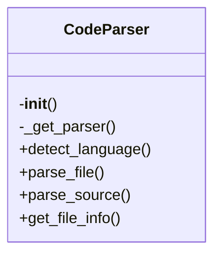

# Code Parser Documentation

## File Overview

This file provides functionality for parsing source code files using the Tree-sitter parsing library. It supports multiple programming languages and offers methods to parse source code strings, files, and extract information such as docstrings and node text. The CodeParser class serves as the [main](../web/app.md) interface for parsing operations and is designed to work with various language modules provided by Tree-sitter.

The parser works with [Language](../models.md) enum values to determine which Tree-sitter language module to use for parsing. It maintains internal caches of parsers and language objects to avoid reinitialization on repeated calls for the same language.

## Classes

### CodeParser

The CodeParser class is responsible for managing and providing parsing capabilities for multiple programming languages using Tree-sitter. It handles the creation and caching of parsers, language detection, and source code parsing operations.

#### Key Methods

- **`__init__`**: Initializes the parser with empty caches for parsers and languages.
- **`_get_parser`**: Retrieves or creates a Tree-sitter parser for a given language.
- **`detect_language`**: Detects the programming language of a file based on its extension.
- **`parse_file`**: Parses a source file and returns the AST root node, language, and source bytes.
- **`parse_source`**: Parses a source code string and returns the AST root node.
- **`get_file_info`**: Retrieves file information including language, file size, and content hash.

#### Usage

```python
from local_deepwiki.core.parser import CodeParser

parser = CodeParser()
# Parse source code
ast_root = parser.parse_source("print('Hello World')", LangEnum.PYTHON)
# Parse a file
result = parser.parse_file(Path("example.py"))
```

## Functions

### get_node_text

Extracts the text content from a Tree-sitter node using the original source bytes.

**Parameters:**
- `node`: The Tree-sitter node to extract text from.
- `source`: The original source bytes.

**Returns:**
- The text content of the node as a string.

### find_nodes_by_type

Finds all nodes in the AST that match a specified node type.

**Parameters:**
- `node`: The root node of the AST.
- `node_type`: The type of node to search for.

**Returns:**
- A list of matching nodes.

### walk

Traverses the AST and yields all nodes in a depth-first manner.

**Parameters:**
- `node`: The root node of the AST.

**Returns:**
- A generator yielding all nodes in the AST.

### get_node_name

Extracts the name of a node from its definition.

**Parameters:**
- `node`: The Tree-sitter node to extract the name from.
- `source`: The original source bytes.

**Returns:**
- The name of the node as a string, or None if not found.

### get_docstring

Extracts docstring from a function or class node.

**Parameters:**
- `node`: The Tree-sitter node.
- `source`: The original source bytes.
- `language`: The programming language.

**Returns:**
- The docstring or None if not found.

## Usage Examples

### Parsing Source Code

```python
from local_deepwiki.core.parser import CodeParser
from local_deepwiki.models import Language as LangEnum

parser = CodeParser()
source_code = "def hello():\n    '''Hello function'''\n    return 'world'"
ast_root = parser.parse_source(source_code, LangEnum.PYTHON)
```

### Parsing a File

```python
from local_deepwiki.core.parser import CodeParser
from pathlib import Path

parser = CodeParser()
result = parser.parse_file(Path("example.py"))
if result:
    ast_root, language, source_bytes = result
```

### Extracting Node Text

```python
from local_deepwiki.core.parser import get_node_text

# Assuming node and source_bytes are available
text = get_node_text(node, source_bytes)
print(text)
```

### Extracting Docstrings

```python
from local_deepwiki.core.parser import get_docstring

# Assuming node and source_bytes are available
docstring = get_docstring(node, source_bytes, LangEnum.PYTHON)
if docstring:
    print(f"Docstring: {docstring}")
```

## Related Components

This parser works with the [Language](../models.md) enum to determine which Tree-sitter language module to use for parsing. It integrates with the [FileInfo](../models.md) model to provide metadata about parsed files. The parser is used by components that require AST traversal or source code analysis, such as [CodeChunker](chunker.md) for splitting code into chunks or [WikiGenerator](../generators/wiki.md) for extracting documentation.

## API Reference

### class `CodeParser`

Multi-language code parser using tree-sitter.

**Methods:**

#### `__init__`

```python
def __init__()
```

Initialize the parser with language support.

#### `detect_language`

```python
def detect_language(file_path: Path) -> LangEnum | None
```

Detect the programming language from file extension.


| [Parameter](../generators/api_docs.md) | Type | Default | Description |
|-----------|------|---------|-------------|
| `file_path` | `Path` | - | Path to the source file. |

#### `parse_file`

```python
def parse_file(file_path: Path) -> tuple[Node, LangEnum, bytes] | None
```

Parse a source file and return the AST root.


| [Parameter](../generators/api_docs.md) | Type | Default | Description |
|-----------|------|---------|-------------|
| `file_path` | `Path` | - | Path to the source file. |

#### `parse_source`

```python
def parse_source(source: str | bytes, language: LangEnum) -> Node
```

Parse source code string and return the AST root.


| [Parameter](../generators/api_docs.md) | Type | Default | Description |
|-----------|------|---------|-------------|
| `source` | `str | bytes` | - | The source code. |
| `language` | `LangEnum` | - | The programming language. |

#### `get_file_info`

```python
def get_file_info(file_path: Path, repo_root: Path) -> FileInfo
```

Get information about a source file.


| [Parameter](../generators/api_docs.md) | Type | Default | Description |
|-----------|------|---------|-------------|
| `file_path` | `Path` | - | Absolute path to the file. |
| `repo_root` | `Path` | - | Root directory of the repository. |


---

### Functions

#### `get_node_text`

```python
def get_node_text(node: Node, source: bytes) -> str
```

Extract text content from a tree-sitter node.


| [Parameter](../generators/api_docs.md) | Type | Default | Description |
|-----------|------|---------|-------------|
| `node` | `Node` | - | The tree-sitter node. |
| `source` | `bytes` | - | The original source bytes. |

**Returns:** `str`


#### `find_nodes_by_type`

```python
def find_nodes_by_type(root: Node, node_types: set[str]) -> list[Node]
```

Find all nodes of specified types in the AST.


| [Parameter](../generators/api_docs.md) | Type | Default | Description |
|-----------|------|---------|-------------|
| `root` | `Node` | - | The root node to search from. |
| `node_types` | `set[str]` | - | Set of node type names to find. |

**Returns:** `list[Node]`


#### `walk`

```python
def walk(node: Node)
```


| [Parameter](../generators/api_docs.md) | Type | Default | Description |
|-----------|------|---------|-------------|
| `node` | `Node` | - | - |


#### `get_node_name`

```python
def get_node_name(node: Node, source: bytes, language: LangEnum) -> str | None
```

Extract the name from a function/class/method node.


| [Parameter](../generators/api_docs.md) | Type | Default | Description |
|-----------|------|---------|-------------|
| `node` | `Node` | - | The tree-sitter node. |
| `source` | `bytes` | - | The original source bytes. |
| `language` | `LangEnum` | - | The programming language. |

**Returns:** `str | None`


#### `get_docstring`

```python
def get_docstring(node: Node, source: bytes, language: LangEnum) -> str | None
```

Extract docstring from a function/class node.


| [Parameter](../generators/api_docs.md) | Type | Default | Description |
|-----------|------|---------|-------------|
| `node` | `Node` | - | The tree-sitter node. |
| `source` | `bytes` | - | The original source bytes. |
| `language` | `LangEnum` | - | The programming language. |

**Returns:** `str | None`


## Class Diagram



## Call Graph

```mermaid
flowchart TD
    N0[CodeParser._get_parser]
    N1[CodeParser.get_file_info]
    N2[CodeParser.parse_file]
    N3[CodeParser.parse_source]
    N4[FileInfo]
    N5[Language]
    N6[Parser]
    N7[ValueError]
    N8[_get_parser]
    N9[child_by_field_name]
    N10[decode]
    N11[detect_language]
    N12[encode]
    N13[find_nodes_by_type]
    N14[get_docstring]
    N15[get_node_name]
    N16[get_node_text]
    N17[hexdigest]
    N18[language]
    N19[lstrip]
    N20[parse]
    N21[read_bytes]
    N22[relative_to]
    N23[rstrip]
    N24[sha256]
    N25[stat]
    N26[walk]
    N16 --> N10
    N13 --> N26
    N26 --> N26
    N15 --> N16
    N15 --> N9
    N14 --> N9
    N14 --> N16
    N14 --> N23
    N14 --> N19
    N0 --> N7
    N0 --> N5
    N0 --> N18
    N0 --> N6
    N2 --> N11
    N2 --> N21
    N2 --> N8
    N2 --> N20
    N3 --> N12
    N3 --> N8
    N3 --> N20
    N1 --> N25
    N1 --> N21
    N1 --> N4
    N1 --> N22
    N1 --> N11
    N1 --> N17
    N1 --> N24
    classDef func fill:#e1f5fe
    class N4,N5,N6,N7,N8,N9,N10,N11,N12,N13,N14,N15,N16,N17,N18,N19,N20,N21,N22,N23,N24,N25,N26 func
    classDef method fill:#fff3e0
    class N0,N1,N2,N3 method
```



## See Also

- [chunker](chunker.md) - uses this
- [watcher](../watcher.md) - uses this
- [test_api_docs](../../../tests/test_api_docs.md) - uses this
- [api_docs](../generators/api_docs.md) - uses this
- [indexer](indexer.md) - uses this
