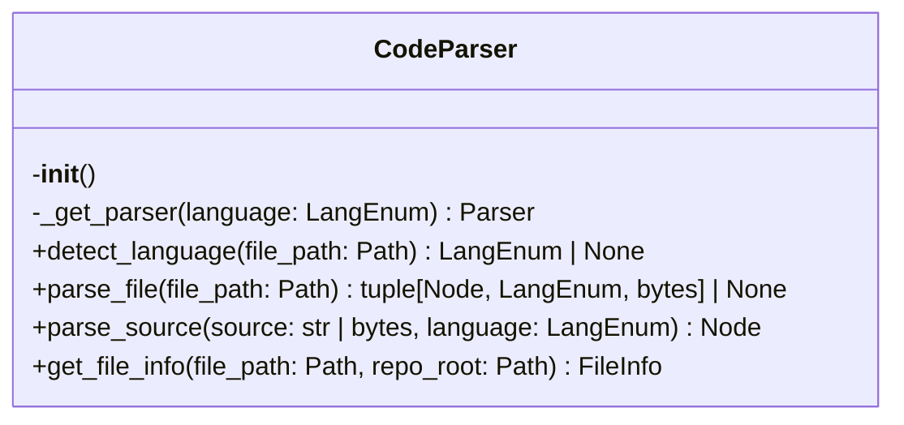

# Parser Module

## File Overview

The parser module provides source code parsing capabilities using tree-sitter parsers for multiple programming languages. It handles file parsing, AST generation, and extraction of code elements like docstrings and comments.

## Classes

### CodeParser

The [main](../watcher.md) parsing class that manages tree-sitter parsers for different programming languages.

**Constructor:**
- `__init__()` - Initializes the parser with empty dictionaries for parsers and languages

**Key Methods:**
- `_get_parser(language: LangEnum) -> Parser` - Gets or creates a parser for the specified language
- `detect_language()` - Detects the programming language (implementation not shown in provided code)
- `parse_file()` - Parses a source file (implementation not shown in provided code)
- `parse_source(source: str | bytes, language: LangEnum) -> Node` - Parses source code string and returns the AST root node
- `get_file_info()` - Retrieves file information (implementation not shown in provided code)

## Functions

### get_node_text

```python
def get_node_text(node: Node, source: bytes) -> str
```

Extracts text content from a tree-sitter node.

**Parameters:**
- `node` - The tree-sitter node
- `source` - The original source bytes

**Returns:**
- The text content of the node as a UTF-8 decoded string

### get_docstring

```python
def get_docstring(node: Node, source: bytes, language: LangEnum) -> str | None
```

Extracts docstring from a function or class node.

**Parameters:**
- `node` - The tree-sitter node
- `source` - The original source bytes  
- `language` - The programming language

**Returns:**
- The docstring text or None if not found

**Note:** The implementation shows Python-specific docstring extraction logic for the first expression statement in a function/class body.

### Additional Utility Functions

The module also includes several other utility functions (implementations not shown in provided code):
- `_read_file_content` - Reads file content
- `_compute_file_hash` - Computes file hash
- `find_nodes_by_type` - Finds nodes by type
- `walk` - Tree walking functionality
- `get_node_name` - Gets node names
- `_collect_preceding_comments` - Collects comments before nodes
- `_strip_line_comment_prefix` - Strips comment prefixes

## Usage Examples

### Basic Source Parsing

```python
from local_deepwiki.core.parser import CodeParser

# Initialize parser
parser = CodeParser()

# Parse Python source code
source_code = """
def hello_world():
    '''This is a docstring'''
    print("Hello, World!")
"""

# Parse and get AST root
root_node = parser.parse_source(source_code, LangEnum.PYTHON)
```

### Extracting Node Text

```python
# Get text content from a node
node_text = get_node_text(some_node, source_bytes)
```

### Extracting Docstrings

```python
# Extract docstring from a function node
docstring = get_docstring(function_node, source_bytes, LangEnum.PYTHON)
if docstring:
    print(f"Found docstring: {docstring}")
```

## Related Components

The parser module works with several language-specific tree-sitter modules imported at the module level:
- `tree_sitter_c`
- `tree_sitter_c_sharp` 
- `tree_sitter_cpp`
- `tree_sitter_go`
- `tree_sitter_java`
- `tree_sitter_javascript`
- And 11 additional language modules

The module also uses a `LangEnum` enumeration for language specification and integrates with the tree-sitter `Parser`, [`Language`](../models.md), and `Node` classes.

## API Reference

### class `CodeParser`

Multi-language code parser using tree-sitter.

**Methods:**

#### `__init__`

```python
def __init__()
```

Initialize the parser with language support.

#### `detect_language`

```python
def detect_language(file_path: Path) -> LangEnum | None
```

Detect the programming language from file extension.


| [Parameter](../generators/api_docs.md) | Type | Default | Description |
|-----------|------|---------|-------------|
| `file_path` | `Path` | - | Path to the source file. |

#### `parse_file`

```python
def parse_file(file_path: Path) -> tuple[Node, LangEnum, bytes] | None
```

Parse a source file and return the AST root.


| [Parameter](../generators/api_docs.md) | Type | Default | Description |
|-----------|------|---------|-------------|
| `file_path` | `Path` | - | Path to the source file. |

#### `parse_source`

```python
def parse_source(source: str | bytes, language: LangEnum) -> Node
```

Parse source code string and return the AST root.


| [Parameter](../generators/api_docs.md) | Type | Default | Description |
|-----------|------|---------|-------------|
| `source` | `str | bytes` | - | The source code. |
| `language` | `LangEnum` | - | The programming language. |

#### `get_file_info`

```python
def get_file_info(file_path: Path, repo_root: Path) -> FileInfo
```

Get information about a source file.  Uses chunked reading for large files to avoid loading the entire file into memory just for hash computation.


| [Parameter](../generators/api_docs.md) | Type | Default | Description |
|-----------|------|---------|-------------|
| `file_path` | `Path` | - | Absolute path to the file. |
| `repo_root` | `Path` | - | Root directory of the repository. |


---

### Functions

#### `get_node_text`

```python
def get_node_text(node: Node, source: bytes) -> str
```

Extract text content from a tree-sitter node.


| [Parameter](../generators/api_docs.md) | Type | Default | Description |
|-----------|------|---------|-------------|
| `node` | `Node` | - | The tree-sitter node. |
| `source` | `bytes` | - | The original source bytes. |

**Returns:** `str`


#### `find_nodes_by_type`

```python
def find_nodes_by_type(root: Node, node_types: set[str]) -> list[Node]
```

Find all nodes of specified types in the AST.


| [Parameter](../generators/api_docs.md) | Type | Default | Description |
|-----------|------|---------|-------------|
| `root` | `Node` | - | The root node to search from. |
| `node_types` | `set[str]` | - | Set of node type names to [find](../generators/manifest.md). |

**Returns:** `list[Node]`


#### `walk`

```python
def walk(node: Node)
```


| [Parameter](../generators/api_docs.md) | Type | Default | Description |
|-----------|------|---------|-------------|
| `node` | `Node` | - | - |


#### `get_node_name`

```python
def get_node_name(node: Node, source: bytes, language: LangEnum) -> str | None
```

Extract the name from a function/class/method node.


| [Parameter](../generators/api_docs.md) | Type | Default | Description |
|-----------|------|---------|-------------|
| `node` | `Node` | - | The tree-sitter node. |
| `source` | `bytes` | - | The original source bytes. |
| `language` | `LangEnum` | - | The programming language. |

**Returns:** `str | None`


#### `get_docstring`

```python
def get_docstring(node: Node, source: bytes, language: LangEnum) -> str | None
```

Extract docstring from a function/class node.


| [Parameter](../generators/api_docs.md) | Type | Default | Description |
|-----------|------|---------|-------------|
| `node` | `Node` | - | The tree-sitter node. |
| `source` | `bytes` | - | The original source bytes. |
| `language` | `LangEnum` | - | The programming language. |

**Returns:** `str | None`


## Class Diagram



## Call Graph

```mermaid
flowchart TD
    N0[CodeParser._get_parser]
    N1[CodeParser.get_file_info]
    N2[CodeParser.parse_file]
    N3[CodeParser.parse_source]
    N4[Language]
    N5[ValueError]
    N6[_collect_preceding_comments]
    N7[_compute_file_hash]
    N8[_get_parser]
    N9[_read_file_content]
    N10[_strip_line_comment_prefix]
    N11[bytes]
    N12[child_by_field_name]
    N13[decode]
    N14[detect_language]
    N15[fileno]
    N16[find_nodes_by_type]
    N17[get_docstring]
    N18[get_node_name]
    N19[get_node_text]
    N20[hexdigest]
    N21[language]
    N22[language_php]
    N23[mmap]
    N24[parse]
    N25[read]
    N26[read_bytes]
    N27[sha256]
    N28[stat]
    N29[walk]
    N9 --> N28
    N9 --> N26
    N9 --> N23
    N9 --> N15
    N9 --> N11
    N7 --> N28
    N7 --> N20
    N7 --> N27
    N7 --> N26
    N7 --> N25
    N19 --> N13
    N16 --> N29
    N29 --> N29
    N18 --> N19
    N18 --> N12
    N6 --> N19
    N17 --> N12
    N17 --> N19
    N17 --> N6
    N17 --> N10
    N0 --> N5
    N0 --> N4
    N0 --> N22
    N0 --> N21
    N2 --> N14
    N2 --> N9
    N2 --> N8
    N2 --> N24
    N3 --> N8
    N3 --> N24
    N1 --> N28
    N1 --> N14
    N1 --> N7
    classDef func fill:#e1f5fe
    class N4,N5,N6,N7,N8,N9,N10,N11,N12,N13,N14,N15,N16,N17,N18,N19,N20,N21,N22,N23,N24,N25,N26,N27,N28,N29 func
    classDef method fill:#fff3e0
    class N0,N1,N2,N3 method
```



## Relevant Source Files

- `src/local_deepwiki/core/parser.py:138-247`

## See Also

- [test_parser](../../../tests/test_parser.md) - uses this
- [test_api_docs](../../../tests/test_api_docs.md) - uses this
- [api_docs](../generators/api_docs.md) - uses this
