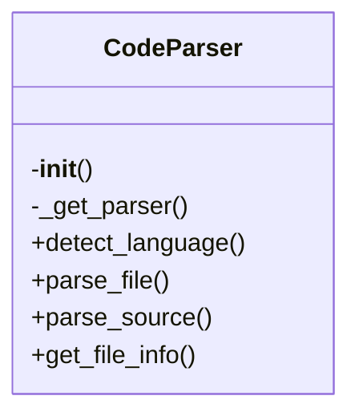

# Code Parser Documentation

## File Overview

This file provides core parsing functionality for source code using the Tree-sitter library. It enables parsing of multiple programming languages into Abstract Syntax Trees (ASTs), which can then be analyzed or processed further. The [main](../web/app.md) class, CodeParser, serves as a central interface for parsing files and source strings, handling language detection and parser initialization.

This module is a key component in the local_deepwiki system, working with other modules like [VectorStore](vectorstore.md) to process and index source code, and with [WikiGenerator](../generators/wiki.md) to extract information for documentation.

## Classes

### CodeParser

The CodeParser class provides methods for parsing source code files and strings into ASTs using Tree-sitter. It manages language-specific parsers and handles language detection for files.

#### Key Methods

- `__init__()`: Initializes the parser with empty dictionaries for storing parsers and languages.
- `_get_parser(language)`: Retrieves or creates a Tree-sitter parser for the specified language.
- `detect_language(file_path)`: Detects the programming language of a file based on its extension.
- `parse_file(file_path)`: Parses a source file and returns the AST root node, language, and source bytes.
- `parse_source(source, language)`: Parses a source code string and returns the AST root node.

#### Usage

```python
from local_deepwiki.core.parser import CodeParser

parser = CodeParser()
file_path = Path("example.py")
result = parser.parse_file(file_path)
if result:
    ast_root, language, source_bytes = result
    print(f"Parsed {language} file")
```

## Functions

### get_node_text

Extracts the text content from a Tree-sitter node using the original source bytes.

**Parameters:**
- `node`: The Tree-sitter node to extract text from
- `source`: The original source bytes

**Returns:**
- The text content of the node as a string

### find_nodes_by_type

Finds all nodes in an AST that match a specific type.

**Parameters:**
- `node`: The root node of the AST to search
- `node_type`: The type of node to [find](../generators/manifest.md)

**Returns:**
- A list of matching nodes

### walk

Recursively traverses an AST and yields all nodes.

**Parameters:**
- `node`: The root node to start traversal from

**Returns:**
- Generator yielding all nodes in the AST

### get_node_name

Extracts the name of a node from a Tree-sitter node.

**Parameters:**
- `node`: The Tree-sitter node
- `source`: The original source bytes

**Returns:**
- The name of the node as a string

### get_docstring

Extracts docstrings from function or class nodes in Python code.

**Parameters:**
- `node`: The Tree-sitter node
- `source`: The original source bytes
- `language`: The programming language

**Returns:**
- The docstring text or None if not found

## Usage Examples

### Parsing a Source File

```python
from local_deepwiki.core.parser import CodeParser
from pathlib import Path

parser = CodeParser()
file_path = Path("example.py")

result = parser.parse_file(file_path)
if result:
    ast_root, language, source_bytes = result
    print(f"Parsed {language} file with {ast_root.child_count} children")
```

### Parsing a Source String

```python
from local_deepwiki.core.parser import CodeParser
from local_deepwiki.models import Language

parser = CodeParser()
source_code = "def hello():\n    return 'world'"
language = Language.PYTHON

ast_root = parser.parse_source(source_code, language)
print(f"AST root type: {ast_root.type}")
```

### Extracting Node Text

```python
from local_deepwiki.core.parser import CodeParser, get_node_text
from pathlib import Path

parser = CodeParser()
file_path = Path("example.py")

result = parser.parse_file(file_path)
if result:
    ast_root, language, source_bytes = result
    node_text = get_node_text(ast_root, source_bytes)
    print(f"Node text: {node_text}")
```

## Related Components

This parser module works with the [Language](../models.md) enum to determine supported languages, and integrates with [VectorStore](vectorstore.md) to process and index parsed code. It also interacts with [WikiGenerator](../generators/wiki.md) to extract information from parsed source code for documentation purposes. The module relies on Tree-sitter language libraries for actual parsing functionality.

## API Reference

### class `CodeParser`

Multi-language code parser using tree-sitter.

**Methods:**

#### `__init__`

```python
def __init__()
```

Initialize the parser with language support.

#### `detect_language`

```python
def detect_language(file_path: Path) -> LangEnum | None
```

Detect the programming language from file extension.


| [Parameter](../generators/api_docs.md) | Type | Default | Description |
|-----------|------|---------|-------------|
| `file_path` | `Path` | - | Path to the source file. |

#### `parse_file`

```python
def parse_file(file_path: Path) -> tuple[Node, LangEnum, bytes] | None
```

Parse a source file and return the AST root.


| [Parameter](../generators/api_docs.md) | Type | Default | Description |
|-----------|------|---------|-------------|
| `file_path` | `Path` | - | Path to the source file. |

#### `parse_source`

```python
def parse_source(source: str | bytes, language: LangEnum) -> Node
```

Parse source code string and return the AST root.


| [Parameter](../generators/api_docs.md) | Type | Default | Description |
|-----------|------|---------|-------------|
| `source` | `str | bytes` | - | The source code. |
| `language` | `LangEnum` | - | The programming language. |

#### `get_file_info`

```python
def get_file_info(file_path: Path, repo_root: Path) -> FileInfo
```

Get information about a source file.


| [Parameter](../generators/api_docs.md) | Type | Default | Description |
|-----------|------|---------|-------------|
| `file_path` | `Path` | - | Absolute path to the file. |
| `repo_root` | `Path` | - | Root directory of the repository. |


---

### Functions

#### `get_node_text`

```python
def get_node_text(node: Node, source: bytes) -> str
```

Extract text content from a tree-sitter node.


| [Parameter](../generators/api_docs.md) | Type | Default | Description |
|-----------|------|---------|-------------|
| `node` | `Node` | - | The tree-sitter node. |
| `source` | `bytes` | - | The original source bytes. |

**Returns:** `str`


#### `find_nodes_by_type`

```python
def find_nodes_by_type(root: Node, node_types: set[str]) -> list[Node]
```

Find all nodes of specified types in the AST.


| [Parameter](../generators/api_docs.md) | Type | Default | Description |
|-----------|------|---------|-------------|
| `root` | `Node` | - | The root node to search from. |
| `node_types` | `set[str]` | - | Set of node type names to [find](../generators/manifest.md). |

**Returns:** `list[Node]`


#### `walk`

```python
def walk(node: Node)
```


| [Parameter](../generators/api_docs.md) | Type | Default | Description |
|-----------|------|---------|-------------|
| `node` | `Node` | - | - |


#### `get_node_name`

```python
def get_node_name(node: Node, source: bytes, language: LangEnum) -> str | None
```

Extract the name from a function/class/method node.


| [Parameter](../generators/api_docs.md) | Type | Default | Description |
|-----------|------|---------|-------------|
| `node` | `Node` | - | The tree-sitter node. |
| `source` | `bytes` | - | The original source bytes. |
| `language` | `LangEnum` | - | The programming language. |

**Returns:** `str | None`


#### `get_docstring`

```python
def get_docstring(node: Node, source: bytes, language: LangEnum) -> str | None
```

Extract docstring from a function/class node.


| [Parameter](../generators/api_docs.md) | Type | Default | Description |
|-----------|------|---------|-------------|
| `node` | `Node` | - | The tree-sitter node. |
| `source` | `bytes` | - | The original source bytes. |
| `language` | `LangEnum` | - | The programming language. |

**Returns:** `str | None`


## Class Diagram



## Call Graph

```mermaid
flowchart TD
    N0[CodeParser._get_parser]
    N1[CodeParser.get_file_info]
    N2[CodeParser.parse_file]
    N3[CodeParser.parse_source]
    N4[FileInfo]
    N5[Language]
    N6[Parser]
    N7[ValueError]
    N8[_get_parser]
    N9[child_by_field_name]
    N10[decode]
    N11[detect_language]
    N12[encode]
    N13[find_nodes_by_type]
    N14[get_docstring]
    N15[get_node_name]
    N16[get_node_text]
    N17[hexdigest]
    N18[language]
    N19[lstrip]
    N20[parse]
    N21[read_bytes]
    N22[relative_to]
    N23[rstrip]
    N24[sha256]
    N25[stat]
    N26[walk]
    N16 --> N10
    N13 --> N26
    N26 --> N26
    N15 --> N16
    N15 --> N9
    N14 --> N9
    N14 --> N16
    N14 --> N23
    N14 --> N19
    N0 --> N7
    N0 --> N5
    N0 --> N18
    N0 --> N6
    N2 --> N11
    N2 --> N21
    N2 --> N8
    N2 --> N20
    N3 --> N12
    N3 --> N8
    N3 --> N20
    N1 --> N25
    N1 --> N21
    N1 --> N4
    N1 --> N22
    N1 --> N11
    N1 --> N17
    N1 --> N24
    classDef func fill:#e1f5fe
    class N4,N5,N6,N7,N8,N9,N10,N11,N12,N13,N14,N15,N16,N17,N18,N19,N20,N21,N22,N23,N24,N25,N26 func
    classDef method fill:#fff3e0
    class N0,N1,N2,N3 method
```



## See Also

- [chunker](chunker.md) - uses this
- [test_api_docs](../../../tests/test_api_docs.md) - uses this
- [api_docs](../generators/api_docs.md) - uses this
- [models](../models.md) - dependency
- [wiki](../generators/wiki.md) - shares 4 dependencies
