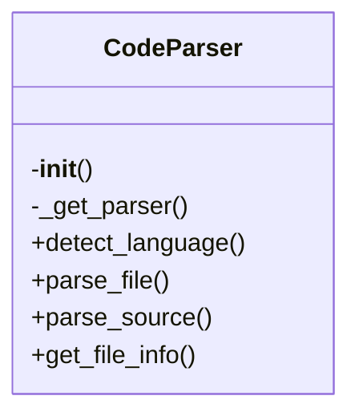

# File Overview

This file, `src/local_deepwiki/core/parser.py`, provides functionality for parsing source code using the Tree-sitter library. It supports multiple programming languages and includes utilities for extracting information from parsed ASTs, such as node text and docstrings.

# Classes

## CodeParser

The `CodeParser` class is responsible for initializing parsers for various programming languages and providing methods to parse source code files or strings into ASTs (Abstract Syntax Trees). It also offers utilities for extracting specific parts of the code like docstrings and node text.

### Methods

#### `__init__`

Initializes the parser with empty dictionaries for storing parsers and language configurations.

#### `_get_parser`

Retrieves or creates a Tree-sitter parser for a given language.

- **Parameters**:
  - `language` (`LangEnum`): The programming language.
- **Returns**:
  - A Tree-sitter `Parser` configured for the specified language.

#### `detect_language`

Detects the programming language of a file based on its extension.

- **Parameters**:
  - `file_path` (`Path`): The path to the file.
- **Returns**:
  - The detected `LangEnum` language.

#### `parse_file`

Parses a file and returns the root node of its AST.

- **Parameters**:
  - `file_path` (`Path`): The path to the file.
- **Returns**:
  - The AST root node.

#### `parse_source`

Parses a source code string and returns the AST root.

- **Parameters**:
  - `source` (`str | bytes`): The source code.
  - `language` (`LangEnum`): The programming language.
- **Returns**:
  - The AST root node.

#### `get_file_info`

Retrieves file information including content, hash, and language.

- **Parameters**:
  - `file_path` (`Path`): The path to the file.
- **Returns**:
  - A tuple containing file content (`bytes`), hash (`str`), and language (`LangEnum`).

# Functions

## `_read_file_content`

Reads the content of a file as bytes.

- **Parameters**:
  - `file_path` (`Path`): The path to the file.
- **Returns**:
  - The file content as bytes.

## `_compute_file_hash`

Computes the SHA256 hash of a file's content.

- **Parameters**:
  - `content` (`bytes`): The file content.
- **Returns**:
  - The SHA256 hash of the content as a hexadecimal string.

## `get_node_text`

Extracts the text content of a Tree-sitter node from the source.

- **Parameters**:
  - `node` (`Node`): The Tree-sitter node.
  - `source` (`bytes`): The original source bytes.
- **Returns**:
  - The text content of the node.

## `find_nodes_by_type`

Finds all nodes in the AST that match a given node type.

- **Parameters**:
  - `node` (`Node`): The root node of the AST.
  - `node_type` (`str`): The type of node to search for.
- **Returns**:
  - A list of matching nodes.

## `walk`

Recursively traverses the AST and yields all nodes.

- **Parameters**:
  - `node` (`Node`): The root node of the AST.
- **Returns**:
  - An iterator over all nodes in the AST.

## `get_node_name`

Extracts the name of a node from its children.

- **Parameters**:
  - `node` (`Node`): The Tree-sitter node.
- **Returns**:
  - The name of the node as a string or `None` if not found.

## `_collect_preceding_comments`

Collects comments that precede a node.

- **Parameters**:
  - `node` (`Node`): The Tree-sitter node.
  - `source` (`bytes`): The original source bytes.
- **Returns**:
  - A list of comment strings.

## `_strip_line_comment_prefix`

Strips the comment prefix from a line comment.

- **Parameters**:
  - `line` (`str`): A line comment.
- **Returns**:
  - The comment without the prefix.

## `get_docstring`

Extracts the docstring from a function or class node.

- **Parameters**:
  - `node` (`Node`): The Tree-sitter node.
  - `source` (`bytes`): The original source bytes.
  - `language` (`LangEnum`): The programming language.
- **Returns**:
  - The docstring or `None` if not found.

# Usage Examples

### Parsing Source Code

```python
from local_deepwiki.core.parser import CodeParser
from local_deepwiki.core.types import LangEnum

parser = CodeParser()
source_code = "def hello():\n    return 'world'"
ast_root = parser.parse_source(source_code, LangEnum.PYTHON)
```

### Getting Node Text

```python
from local_deepwiki.core.parser import get_node_text

node_text = get_node_text(node, source_bytes)
```

### Extracting Docstrings

```python
from local_deepwiki.core.parser import get_docstring

docstring = get_docstring(node, source_bytes, LangEnum.PYTHON)
```

# Related Components

This file depends on the following external components:

- `tree_sitter_c`
- `tree_sitter_c_sharp`
- `tree_sitter_cpp`
- `tree_sitter_go`
- `tree_sitter_java`
- `tree_sitter_javascript`
- And 11 more Tree-sitter language modules

It also uses types from `local_deepwiki.core.types`, specifically `LangEnum` and `Parser`.

## API Reference

### class `CodeParser`

Multi-language code parser using tree-sitter.

**Methods:**

#### `__init__`

```python
def __init__()
```

Initialize the parser with language support.

#### `detect_language`

```python
def detect_language(file_path: Path) -> LangEnum | None
```

Detect the programming language from file extension.


| [Parameter](../generators/api_docs.md) | Type | Default | Description |
|-----------|------|---------|-------------|
| `file_path` | `Path` | - | Path to the source file. |

#### `parse_file`

```python
def parse_file(file_path: Path) -> tuple[Node, LangEnum, bytes] | None
```

Parse a source file and return the AST root.


| [Parameter](../generators/api_docs.md) | Type | Default | Description |
|-----------|------|---------|-------------|
| `file_path` | `Path` | - | Path to the source file. |

#### `parse_source`

```python
def parse_source(source: str | bytes, language: LangEnum) -> Node
```

Parse source code string and return the AST root.


| [Parameter](../generators/api_docs.md) | Type | Default | Description |
|-----------|------|---------|-------------|
| `source` | `str | bytes` | - | The source code. |
| `language` | `LangEnum` | - | The programming language. |

#### `get_file_info`

```python
def get_file_info(file_path: Path, repo_root: Path) -> FileInfo
```

Get information about a source file.  Uses chunked reading for large files to avoid loading the entire file into memory just for hash computation.


| [Parameter](../generators/api_docs.md) | Type | Default | Description |
|-----------|------|---------|-------------|
| `file_path` | `Path` | - | Absolute path to the file. |
| `repo_root` | `Path` | - | Root directory of the repository. |


---

### Functions

#### `get_node_text`

```python
def get_node_text(node: Node, source: bytes) -> str
```

Extract text content from a tree-sitter node.


| [Parameter](../generators/api_docs.md) | Type | Default | Description |
|-----------|------|---------|-------------|
| `node` | `Node` | - | The tree-sitter node. |
| `source` | `bytes` | - | The original source bytes. |

**Returns:** `str`


#### `find_nodes_by_type`

```python
def find_nodes_by_type(root: Node, node_types: set[str]) -> list[Node]
```

Find all nodes of specified types in the AST.


| [Parameter](../generators/api_docs.md) | Type | Default | Description |
|-----------|------|---------|-------------|
| `root` | `Node` | - | The root node to search from. |
| `node_types` | `set[str]` | - | Set of node type names to [find](../generators/manifest.md). |

**Returns:** `list[Node]`


#### `walk`

```python
def walk(node: Node)
```


| [Parameter](../generators/api_docs.md) | Type | Default | Description |
|-----------|------|---------|-------------|
| `node` | `Node` | - | - |


#### `get_node_name`

```python
def get_node_name(node: Node, source: bytes, language: LangEnum) -> str | None
```

Extract the name from a function/class/method node.


| [Parameter](../generators/api_docs.md) | Type | Default | Description |
|-----------|------|---------|-------------|
| `node` | `Node` | - | The tree-sitter node. |
| `source` | `bytes` | - | The original source bytes. |
| `language` | `LangEnum` | - | The programming language. |

**Returns:** `str | None`


#### `get_docstring`

```python
def get_docstring(node: Node, source: bytes, language: LangEnum) -> str | None
```

Extract docstring from a function/class node.


| [Parameter](../generators/api_docs.md) | Type | Default | Description |
|-----------|------|---------|-------------|
| `node` | `Node` | - | The tree-sitter node. |
| `source` | `bytes` | - | The original source bytes. |
| `language` | `LangEnum` | - | The programming language. |

**Returns:** `str | None`


## Class Diagram



## Call Graph

```mermaid
flowchart TD
    N0[CodeParser._get_parser]
    N1[CodeParser.get_file_info]
    N2[CodeParser.parse_file]
    N3[CodeParser.parse_source]
    N4[Language]
    N5[ValueError]
    N6[_collect_preceding_comments]
    N7[_compute_file_hash]
    N8[_get_parser]
    N9[_read_file_content]
    N10[_strip_line_comment_prefix]
    N11[bytes]
    N12[child_by_field_name]
    N13[decode]
    N14[detect_language]
    N15[fileno]
    N16[find_nodes_by_type]
    N17[get_docstring]
    N18[get_node_name]
    N19[get_node_text]
    N20[hexdigest]
    N21[language]
    N22[language_php]
    N23[mmap]
    N24[parse]
    N25[read]
    N26[read_bytes]
    N27[sha256]
    N28[stat]
    N29[walk]
    N9 --> N28
    N9 --> N26
    N9 --> N23
    N9 --> N15
    N9 --> N11
    N7 --> N28
    N7 --> N20
    N7 --> N27
    N7 --> N26
    N7 --> N25
    N19 --> N13
    N16 --> N29
    N29 --> N29
    N18 --> N19
    N18 --> N12
    N6 --> N19
    N17 --> N12
    N17 --> N19
    N17 --> N6
    N17 --> N10
    N0 --> N5
    N0 --> N4
    N0 --> N22
    N0 --> N21
    N2 --> N14
    N2 --> N9
    N2 --> N8
    N2 --> N24
    N3 --> N8
    N3 --> N24
    N1 --> N28
    N1 --> N14
    N1 --> N7
    classDef func fill:#e1f5fe
    class N4,N5,N6,N7,N8,N9,N10,N11,N12,N13,N14,N15,N16,N17,N18,N19,N20,N21,N22,N23,N24,N25,N26,N27,N28,N29 func
    classDef method fill:#fff3e0
    class N0,N1,N2,N3 method
```



## Relevant Source Files

- `src/local_deepwiki/core/parser.py:138-247`

## See Also

- [test_parser](../../../tests/test_parser.md) - uses this
- [api_docs](../generators/api_docs.md) - uses this
- [test_api_docs](../../../tests/test_api_docs.md) - uses this
- [test_callgraph](../../../tests/test_callgraph.md) - uses this
