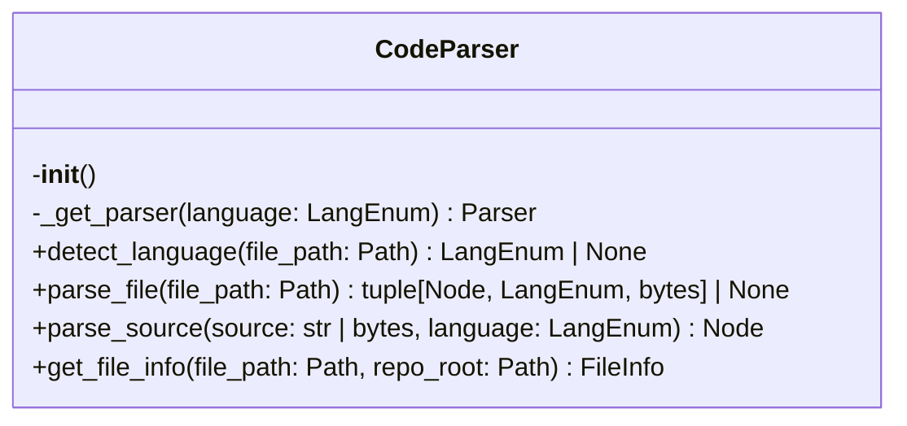

# Parser Module Documentation

## File Overview

The `parser.py` module provides source code parsing capabilities using tree-sitter parsers for multiple programming languages. It handles AST (Abstract Syntax Tree) generation, docstring extraction, and language detection for various programming languages including Python, JavaScript, Java, C/C++, Go, and others.

## Classes

### CodeParser

The CodeParser class is the [main](../export/pdf.md) interface for parsing source code files and strings across multiple programming languages.

**Purpose**: Provides a unified interface for parsing source code using tree-sitter parsers, with automatic language detection and parser caching.

**Key Methods**:
- `__init__()` - Initializes the parser with empty parser and language caches
- `_get_parser(language)` - Retrieves or creates a tree-sitter parser for the specified language
- `parse_source(source, language)` - Parses source code string/bytes and returns the AST root node
- `detect_language()` - Detects programming language (method signature not fully shown)
- `parse_file()` - Parses source code from file (method signature not fully shown)
- `get_file_info()` - Retrieves file information (method signature not fully shown)

## Functions

### get_docstring

Extracts docstrings from function or class nodes in the AST.

**Parameters**:
- `node: Node` - The tree-sitter node to extract docstring from
- `source: bytes` - The original source code as bytes
- `language: LangEnum` - The programming language enum

**Returns**: `str | None` - The extracted docstring or None if not found

### _get_jsdoc_or_line_comments

Extracts JSDoc-style comments (`/** */`) or multi-line `//` comments from JavaScript/TypeScript code.

**Parameters**:
- `node: Node` - The tree-sitter node
- `source: bytes` - The original source code as bytes

**Returns**: `str | None` - The extracted comment text or None

### _get_javadoc_or_doxygen

Extracts Javadoc/Doxygen-style comments (`/** */`) or `///` comments from Java/C++ code.

**Parameters**:
- `node: Node` - The tree-sitter node
- `source: bytes` - The original source code as bytes

**Returns**: `str | None` - The extracted comment text or None

## Usage Examples

### Basic Source Code Parsing

```python
from local_deepwiki.core.parser import CodeParser
from local_deepwiki.core.types import LangEnum

# Initialize parser
parser = CodeParser()

# Parse Python source code
source_code = """
def hello_world():
    '''This is a docstring.'''
    print("Hello, World!")
"""

# Parse and get AST root
root_node = parser.parse_source(source_code, LangEnum.PYTHON)
```

### Docstring Extraction

```python
from local_deepwiki.core.parser import get_docstring

# Extract docstring from a function node
docstring = get_docstring(function_node, source_bytes, LangEnum.PYTHON)
if docstring:
    print(f"Found docstring: {docstring}")
```

## Related Components

The parser module integrates with several other components:

- **LangEnum**: Enumeration defining supported programming languages
- **tree_sitter libraries**: Multiple tree-sitter language modules (c, c_sharp, cpp, go, java, javascript, etc.)
- **Node**: Tree-sitter node objects representing AST elements
- **Parser**: Tree-sitter parser objects for specific languages
- **[Language](../models.md)**: Tree-sitter language configuration objects

The module also references several utility functions for text processing and node traversal:
- `_read_file_content` - File reading utility
- `_compute_file_hash` - File hashing utility  
- `get_node_text` - Node text extraction
- `find_nodes_by_type` - AST node searching
- `walk` - AST traversal
- `get_node_name` - Node name extraction
- `_collect_preceding_comments` - Comment collection utility
- `_strip_line_comment_prefix` - Comment text processing

## API Reference

### class `CodeParser`

Multi-language code parser using tree-sitter.

**Methods:**


<details>
<summary>View Source (lines 139-252) | <a href="https://github.com/UrbanDiver/local-deepwiki-mcp/blob/feature/wiki-enhancements-round2/src/local_deepwiki/core/parser.py#L139-L252">GitHub</a></summary>

```python
class CodeParser:
    # Methods: __init__, _get_parser, detect_language, parse_file, parse_source, get_file_info
```

</details>

#### `__init__`

```python
def __init__()
```

Initialize the parser with language support.


<details>
<summary>View Source (lines 142-145) | <a href="https://github.com/UrbanDiver/local-deepwiki-mcp/blob/feature/wiki-enhancements-round2/src/local_deepwiki/core/parser.py#L142-L145">GitHub</a></summary>

```python
def __init__(self):
        """Initialize the parser with language support."""
        self._parsers: dict[LangEnum, Parser] = {}
        self._languages: dict[LangEnum, Language] = {}
```

</details>

#### `detect_language`

```python
def detect_language(file_path: Path) -> LangEnum | None
```

Detect the programming language from file extension.


| [Parameter](../generators/api_docs.md) | Type | Default | Description |
|-----------|------|---------|-------------|
| `file_path` | `Path` | - | Path to the source file. |


<details>
<summary>View Source (lines 177-187) | <a href="https://github.com/UrbanDiver/local-deepwiki-mcp/blob/feature/wiki-enhancements-round2/src/local_deepwiki/core/parser.py#L177-L187">GitHub</a></summary>

```python
def detect_language(self, file_path: Path) -> LangEnum | None:
        """Detect the programming language from file extension.

        Args:
            file_path: Path to the source file.

        Returns:
            The detected Language enum or None if not supported.
        """
        suffix = file_path.suffix.lower()
        return EXTENSION_MAP.get(suffix)
```

</details>

#### `parse_file`

```python
def parse_file(file_path: Path) -> tuple[Node, LangEnum, bytes] | None
```

Parse a source file and return the AST root.


| [Parameter](../generators/api_docs.md) | Type | Default | Description |
|-----------|------|---------|-------------|
| `file_path` | `Path` | - | Path to the source file. |


<details>
<summary>View Source (lines 189-212) | <a href="https://github.com/UrbanDiver/local-deepwiki-mcp/blob/feature/wiki-enhancements-round2/src/local_deepwiki/core/parser.py#L189-L212">GitHub</a></summary>

```python
def parse_file(self, file_path: Path) -> tuple[Node, LangEnum, bytes] | None:
        """Parse a source file and return the AST root.

        Args:
            file_path: Path to the source file.

        Returns:
            Tuple of (AST root node, language, source bytes) or None if not supported.
        """
        language = self.detect_language(file_path)
        if language is None:
            logger.debug(f"Unsupported file type: {file_path}")
            return None

        try:
            source = _read_file_content(file_path)
        except (OSError, IOError) as e:
            logger.warning(f"Failed to read file {file_path}: {e}")
            return None

        logger.debug(f"Parsing {file_path.name} as {language.value}")
        parser = self._get_parser(language)
        tree = parser.parse(source)
        return tree.root_node, language, source
```

</details>

#### `parse_source`

```python
def parse_source(source: str | bytes, language: LangEnum) -> Node
```

Parse source code string and return the AST root.


| [Parameter](../generators/api_docs.md) | Type | Default | Description |
|-----------|------|---------|-------------|
| `source` | `str | bytes` | - | The source code. |
| `language` | `LangEnum` | - | The programming language. |


<details>
<summary>View Source (lines 214-229) | <a href="https://github.com/UrbanDiver/local-deepwiki-mcp/blob/feature/wiki-enhancements-round2/src/local_deepwiki/core/parser.py#L214-L229">GitHub</a></summary>

```python
def parse_source(self, source: str | bytes, language: LangEnum) -> Node:
        """Parse source code string and return the AST root.

        Args:
            source: The source code.
            language: The programming language.

        Returns:
            The AST root node.
        """
        if isinstance(source, str):
            source = source.encode("utf-8")

        parser = self._get_parser(language)
        tree = parser.parse(source)
        return tree.root_node
```

</details>

#### `get_file_info`

```python
def get_file_info(file_path: Path, repo_root: Path) -> FileInfo
```

Get information about a source file.  Uses chunked reading for large files to avoid loading the entire file into memory just for hash computation.


| [Parameter](../generators/api_docs.md) | Type | Default | Description |
|-----------|------|---------|-------------|
| `file_path` | `Path` | - | Absolute path to the file. |
| `repo_root` | `Path` | - | Root directory of the repository. |


---


<details>
<summary>View Source (lines 231-252) | <a href="https://github.com/UrbanDiver/local-deepwiki-mcp/blob/feature/wiki-enhancements-round2/src/local_deepwiki/core/parser.py#L231-L252">GitHub</a></summary>

```python
def get_file_info(self, file_path: Path, repo_root: Path) -> FileInfo:
        """Get information about a source file.

        Uses chunked reading for large files to avoid loading
        the entire file into memory just for hash computation.

        Args:
            file_path: Absolute path to the file.
            repo_root: Root directory of the repository.

        Returns:
            FileInfo with file metadata.
        """
        stat = file_path.stat()

        return FileInfo(
            path=str(file_path.relative_to(repo_root)),
            language=self.detect_language(file_path),
            size_bytes=stat.st_size,
            last_modified=stat.st_mtime,
            hash=_compute_file_hash(file_path),
        )
```

</details>

### Functions

#### `get_node_text`

```python
def get_node_text(node: Node, source: bytes) -> str
```

Extract text content from a tree-sitter node.


| [Parameter](../generators/api_docs.md) | Type | Default | Description |
|-----------|------|---------|-------------|
| `node` | `Node` | - | The tree-sitter node. |
| `source` | `bytes` | - | The original source bytes. |

**Returns:** `str`


<details>
<summary>View Source (lines 255-265) | <a href="https://github.com/UrbanDiver/local-deepwiki-mcp/blob/feature/wiki-enhancements-round2/src/local_deepwiki/core/parser.py#L255-L265">GitHub</a></summary>

```python
def get_node_text(node: Node, source: bytes) -> str:
    """Extract text content from a tree-sitter node.

    Args:
        node: The tree-sitter node.
        source: The original source bytes.

    Returns:
        The text content of the node.
    """
    return source[node.start_byte : node.end_byte].decode("utf-8", errors="replace")
```

</details>

#### `find_nodes_by_type`

```python
def find_nodes_by_type(root: Node, node_types: set[str]) -> list[Node]
```

Find all nodes of specified types in the AST.


| [Parameter](../generators/api_docs.md) | Type | Default | Description |
|-----------|------|---------|-------------|
| `root` | `Node` | - | The root node to search from. |
| `node_types` | `set[str]` | - | Set of node type names to [find](../generators/manifest.md). |

**Returns:** `list[Node]`


<details>
<summary>View Source (lines 268-287) | <a href="https://github.com/UrbanDiver/local-deepwiki-mcp/blob/feature/wiki-enhancements-round2/src/local_deepwiki/core/parser.py#L268-L287">GitHub</a></summary>

```python
def find_nodes_by_type(root: Node, node_types: set[str]) -> list[Node]:
    """Find all nodes of specified types in the AST.

    Args:
        root: The root node to search from.
        node_types: Set of node type names to find.

    Returns:
        List of matching nodes.
    """
    results = []

    def walk(node: Node):
        if node.type in node_types:
            results.append(node)
        for child in node.children:
            walk(child)

    walk(root)
    return results
```

</details>

#### `walk`

```python
def walk(node: Node)
```


| [Parameter](../generators/api_docs.md) | Type | Default | Description |
|-----------|------|---------|-------------|
| `node` | `Node` | - | - |


<details>
<summary>View Source (lines 280-284) | <a href="https://github.com/UrbanDiver/local-deepwiki-mcp/blob/feature/wiki-enhancements-round2/src/local_deepwiki/core/parser.py#L280-L284">GitHub</a></summary>

```python
def walk(node: Node):
        if node.type in node_types:
            results.append(node)
        for child in node.children:
            walk(child)
```

</details>

#### `get_node_name`

```python
def get_node_name(node: Node, source: bytes, language: LangEnum) -> str | None
```

Extract the name from a function/class/method node.


| [Parameter](../generators/api_docs.md) | Type | Default | Description |
|-----------|------|---------|-------------|
| `node` | `Node` | - | The tree-sitter node. |
| `source` | `bytes` | - | The original source bytes. |
| `language` | `LangEnum` | - | The programming language. |

**Returns:** `str | None`


<details>
<summary>View Source (lines 290-319) | <a href="https://github.com/UrbanDiver/local-deepwiki-mcp/blob/feature/wiki-enhancements-round2/src/local_deepwiki/core/parser.py#L290-L319">GitHub</a></summary>

```python
def get_node_name(node: Node, source: bytes, language: LangEnum) -> str | None:
    """Extract the name from a function/class/method node.

    Args:
        node: The tree-sitter node.
        source: The original source bytes.
        language: The programming language.

    Returns:
        The name or None if not found.
    """
    # Different languages have different structures
    name_field_types = {
        "name",
        "identifier",
    }

    for child in node.children:
        if child.type in name_field_types:
            return get_node_text(child, source)
        # Check named children
        if child.type == "identifier":
            return get_node_text(child, source)

    # Try field access
    name_node = node.child_by_field_name("name")
    if name_node:
        return get_node_text(name_node, source)

    return None
```

</details>

#### `get_docstring`

```python
def get_docstring(node: Node, source: bytes, language: LangEnum) -> str | None
```

Extract docstring from a function/class node.


| [Parameter](../generators/api_docs.md) | Type | Default | Description |
|-----------|------|---------|-------------|
| `node` | `Node` | - | The tree-sitter node. |
| `source` | `bytes` | - | The original source bytes. |
| `language` | `LangEnum` | - | The programming language. |

**Returns:** `str | None`


<details>
<summary>View Source (lines 474-488) | <a href="https://github.com/UrbanDiver/local-deepwiki-mcp/blob/feature/wiki-enhancements-round2/src/local_deepwiki/core/parser.py#L474-L488">GitHub</a></summary>

```python
def get_docstring(node: Node, source: bytes, language: LangEnum) -> str | None:
    """Extract docstring from a function/class node.

    Args:
        node: The tree-sitter node.
        source: The original source bytes.
        language: The programming language.

    Returns:
        The docstring or None if not found.
    """
    extractor = _DOCSTRING_EXTRACTORS.get(language)
    if extractor:
        return cast(str | None, extractor(node, source))
    return None
```

</details>

## Class Diagram



## Call Graph

```mermaid
flowchart TD
    N0[CodeParser._get_parser]
    N1[CodeParser.get_file_info]
    N2[CodeParser.parse_file]
    N3[CodeParser.parse_source]
    N4[_collect_preceding_comments]
    N5[_compute_file_hash]
    N6[_get_javadoc_or_doxygen]
    N7[_get_jsdoc_or_line_comments]
    N8[_get_line_comments]
    N9[_get_parser]
    N10[_get_python_docstring]
    N11[_get_swift_docstring]
    N12[_read_file_content]
    N13[_strip_line_comment_prefix]
    N14[bytes]
    N15[child_by_field_name]
    N16[decode]
    N17[detect_language]
    N18[fileno]
    N19[get_docstring]
    N20[get_node_name]
    N21[get_node_text]
    N22[hexdigest]
    N23[mmap]
    N24[parse]
    N25[read]
    N26[read_bytes]
    N27[sha256]
    N28[stat]
    N29[walk]
    N12 --> N28
    N12 --> N26
    N12 --> N23
    N12 --> N18
    N12 --> N14
    N5 --> N28
    N5 --> N22
    N5 --> N27
    N5 --> N26
    N5 --> N25
    N21 --> N16
    N29 --> N29
    N20 --> N21
    N20 --> N15
    N4 --> N21
    N10 --> N15
    N10 --> N21
    N7 --> N21
    N7 --> N4
    N7 --> N13
    N8 --> N4
    N8 --> N13
    N6 --> N21
    N6 --> N4
    N6 --> N13
    N11 --> N4
    N11 --> N13
    N11 --> N21
    N2 --> N17
    N2 --> N12
    N2 --> N9
    N2 --> N24
    N3 --> N9
    N3 --> N24
    N1 --> N28
    N1 --> N17
    N1 --> N5
    classDef func fill:#e1f5fe
    class N4,N5,N6,N7,N8,N9,N10,N11,N12,N13,N14,N15,N16,N17,N18,N19,N20,N21,N22,N23,N24,N25,N26,N27,N28,N29 func
    classDef method fill:#fff3e0
    class N0,N1,N2,N3 method
```



## Used By

Functions and methods in this file and their callers:

- **[`FileInfo`](../models.md)**: called by `CodeParser.get_file_info`
- **[`Language`](../models.md)**: called by `CodeParser._get_parser`
- **`Parser`**: called by `CodeParser._get_parser`
- **`ValueError`**: called by `CodeParser._get_parser`
- **`_collect_preceding_comments`**: called by `_get_javadoc_or_doxygen`, `_get_jsdoc_or_line_comments`, `_get_line_comments`, `_get_swift_docstring`
- **`_compute_file_hash`**: called by `CodeParser.get_file_info`
- **`_get_parser`**: called by `CodeParser.parse_file`, `CodeParser.parse_source`
- **`_read_file_content`**: called by `CodeParser.parse_file`
- **`_strip_line_comment_prefix`**: called by `_get_javadoc_or_doxygen`, `_get_jsdoc_or_line_comments`, `_get_line_comments`, `_get_swift_docstring`
- **`bytes`**: called by `_read_file_content`
- **`cast`**: called by `get_docstring`
- **`child_by_field_name`**: called by `_get_python_docstring`, `get_node_name`
- **`decode`**: called by `get_node_text`
- **`detect_language`**: called by `CodeParser.get_file_info`, `CodeParser.parse_file`
- **`encode`**: called by `CodeParser.parse_source`
- **`extractor`**: called by `get_docstring`
- **`fileno`**: called by `_read_file_content`
- **`get_node_text`**: called by `_collect_preceding_comments`, `_get_block_comment`, `_get_javadoc_or_doxygen`, `_get_jsdoc_or_line_comments`, `_get_python_docstring`, `_get_swift_docstring`, `get_node_name`
- **`hexdigest`**: called by `_compute_file_hash`
- **`language`**: called by `CodeParser._get_parser`
- **`language_php`**: called by `CodeParser._get_parser`
- **`language_tsx`**: called by `CodeParser._get_parser`
- **`language_typescript`**: called by `CodeParser._get_parser`
- **`mmap`**: called by `_read_file_content`
- **`parse`**: called by `CodeParser.parse_file`, `CodeParser.parse_source`
- **`read`**: called by `_compute_file_hash`
- **`read_bytes`**: called by `_compute_file_hash`, `_read_file_content`
- **`relative_to`**: called by `CodeParser.get_file_info`
- **`sha256`**: called by `_compute_file_hash`
- **`stat`**: called by `CodeParser.get_file_info`, `_compute_file_hash`, `_read_file_content`
- **`walk`**: called by `find_nodes_by_type`, `walk`

## Usage Examples

*Examples extracted from test files*

### Test Python language detection

From `test_parser.py::test_detect_language_python`:

```python
assert self.parser.detect_language(Path("test.py")) == Language.PYTHON
```

### Test Python language detection

From `test_parser.py::test_detect_language_python`:

```python
assert self.parser.detect_language(Path("test.py")) == Language.PYTHON
```

### Test JavaScript language detection

From `test_parser.py::test_detect_language_javascript`:

```python
assert self.parser.detect_language(Path("test.js")) == Language.JAVASCRIPT
```

### Test JavaScript language detection

From `test_parser.py::test_detect_language_javascript`:

```python
assert self.parser.detect_language(Path("test.js")) == Language.JAVASCRIPT
```

### Test parsing a Python file

From `test_parser.py::test_parse_python_file`:

```python
result = self.parser.parse_file(test_file)
assert result is not None
```


## Additional Source Code

Source code for functions and methods not listed in the API Reference above.

#### `_read_file_content`

<details>
<summary>View Source (lines 36-60) | <a href="https://github.com/UrbanDiver/local-deepwiki-mcp/blob/feature/wiki-enhancements-round2/src/local_deepwiki/core/parser.py#L36-L60">GitHub</a></summary>

```python
def _read_file_content(file_path: Path) -> bytes:
    """Read file content, using memory-mapping for large files.

    For files larger than MMAP_THRESHOLD_BYTES, uses memory mapping
    which allows the OS to manage memory more efficiently.

    Args:
        file_path: Path to the file to read.

    Returns:
        The file content as bytes.
    """
    file_size = file_path.stat().st_size

    if file_size <= MMAP_THRESHOLD_BYTES:
        # Small files: direct read is faster
        return file_path.read_bytes()

    # Large files: use memory mapping
    logger.debug(f"Using mmap for large file ({file_size} bytes): {file_path.name}")
    with open(file_path, "rb") as f:
        # Memory-map the file (read-only)
        with mmap.mmap(f.fileno(), 0, access=mmap.ACCESS_READ) as mm:
            # Return a copy as bytes since mmap is closed after context
            return bytes(mm)
```

</details>


#### `_compute_file_hash`

<details>
<summary>View Source (lines 63-87) | <a href="https://github.com/UrbanDiver/local-deepwiki-mcp/blob/feature/wiki-enhancements-round2/src/local_deepwiki/core/parser.py#L63-L87">GitHub</a></summary>

```python
def _compute_file_hash(file_path: Path) -> str:
    """Compute SHA-256 hash of a file using chunked reading.

    This is more memory-efficient for large files as it doesn't
    require loading the entire file into memory at once.

    Args:
        file_path: Path to the file to hash.

    Returns:
        Hexadecimal SHA-256 hash string.
    """
    file_size = file_path.stat().st_size

    if file_size <= MMAP_THRESHOLD_BYTES:
        # Small files: direct read is fine
        return hashlib.sha256(file_path.read_bytes()).hexdigest()

    # Large files: read in chunks
    logger.debug(f"Using chunked hashing for large file ({file_size} bytes): {file_path.name}")
    hasher = hashlib.sha256()
    with open(file_path, "rb") as f:
        while chunk := f.read(HASH_CHUNK_SIZE):
            hasher.update(chunk)
    return hasher.hexdigest()
```

</details>


#### `_get_parser`

<details>
<summary>View Source (lines 147-175) | <a href="https://github.com/UrbanDiver/local-deepwiki-mcp/blob/feature/wiki-enhancements-round2/src/local_deepwiki/core/parser.py#L147-L175">GitHub</a></summary>

```python
def _get_parser(self, language: LangEnum) -> Parser:
        """Get or create a parser for the given language.

        Args:
            language: The programming language.

        Returns:
            A tree-sitter Parser configured for the language.
        """
        if language not in self._parsers:
            module = LANGUAGE_MODULES.get(language)
            if module is None:
                raise ValueError(f"Unsupported language: {language}")

            # Some modules have different function names
            if language == LangEnum.PHP:
                lang = Language(module.language_php())
            elif language == LangEnum.TYPESCRIPT:
                lang = Language(module.language_typescript())
            elif language == LangEnum.TSX:
                lang = Language(module.language_tsx())
            else:
                lang = Language(module.language())
            self._languages[language] = lang

            parser = Parser(lang)
            self._parsers[language] = parser

        return self._parsers[language]
```

</details>


#### `_collect_preceding_comments`

<details>
<summary>View Source (lines 322-351) | <a href="https://github.com/UrbanDiver/local-deepwiki-mcp/blob/feature/wiki-enhancements-round2/src/local_deepwiki/core/parser.py#L322-L351">GitHub</a></summary>

```python
def _collect_preceding_comments(
    node: Node,
    source: bytes,
    comment_types: set[str],
    prefix: str | None = None,
) -> list[str]:
    """Collect all consecutive preceding comment lines.

    Args:
        node: The tree-sitter node to look before.
        source: The original source bytes.
        comment_types: Set of comment node type names (e.g., {"comment", "line_comment"}).
        prefix: Optional prefix that comments must start with (e.g., "///" for doc comments).

    Returns:
        List of comment text lines in order (first comment first).
    """
    comments: list[str] = []
    prev = node.prev_sibling

    while prev and prev.type in comment_types:
        text = get_node_text(prev, source)
        if prefix is None or text.startswith(prefix):
            comments.insert(0, text)
            prev = prev.prev_sibling
        else:
            # Stop at non-matching comment (e.g., regular // after ///)
            break

    return comments
```

</details>


#### `_strip_line_comment_prefix`

<details>
<summary>View Source (lines 354-371) | <a href="https://github.com/UrbanDiver/local-deepwiki-mcp/blob/feature/wiki-enhancements-round2/src/local_deepwiki/core/parser.py#L354-L371">GitHub</a></summary>

```python
def _strip_line_comment_prefix(lines: list[str], prefix: str) -> str:
    """Strip prefix from comment lines and join them.

    Args:
        lines: List of comment lines.
        prefix: The prefix to strip (e.g., "//", "///", "#").

    Returns:
        Joined docstring with prefixes removed.
    """
    stripped = []
    for line in lines:
        # Remove the prefix and optional leading space
        content = line[len(prefix) :]
        if content.startswith(" "):
            content = content[1:]
        stripped.append(content)
    return "\n".join(stripped).strip()
```

</details>


#### `_get_python_docstring`

<details>
<summary>View Source (lines 374-393) | <a href="https://github.com/UrbanDiver/local-deepwiki-mcp/blob/feature/wiki-enhancements-round2/src/local_deepwiki/core/parser.py#L374-L393">GitHub</a></summary>

```python
def _get_python_docstring(node: Node, source: bytes) -> str | None:
    """Extract Python docstring from function/class body."""
    body = node.child_by_field_name("body")
    if not body or not body.children:
        return None

    first_child = body.children[0]
    if first_child.type != "expression_statement":
        return None

    expr = first_child.children[0] if first_child.children else None
    if not expr or expr.type != "string":
        return None

    text = get_node_text(expr, source)
    if text.startswith('"""') or text.startswith("'''"):
        return text[3:-3].strip()
    if text.startswith('"') or text.startswith("'"):
        return text[1:-1].strip()
    return None
```

</details>


#### `_get_jsdoc_or_line_comments`

<details>
<summary>View Source (lines 396-407) | <a href="https://github.com/UrbanDiver/local-deepwiki-mcp/blob/feature/wiki-enhancements-round2/src/local_deepwiki/core/parser.py#L396-L407">GitHub</a></summary>

```python
def _get_jsdoc_or_line_comments(node: Node, source: bytes) -> str | None:
    """Extract JSDoc (/** */) or multi-line // comments."""
    prev = node.prev_sibling
    if prev and prev.type == "comment":
        text = get_node_text(prev, source)
        if text.startswith("/**"):
            return text[3:-2].strip()

    comments = _collect_preceding_comments(node, source, {"comment"}, "//")
    if comments:
        return _strip_line_comment_prefix(comments, "//")
    return None
```

</details>


#### `_get_line_comments`

<details>
<summary>View Source (lines 410-415) | <a href="https://github.com/UrbanDiver/local-deepwiki-mcp/blob/feature/wiki-enhancements-round2/src/local_deepwiki/core/parser.py#L410-L415">GitHub</a></summary>

```python
def _get_line_comments(node: Node, source: bytes, comment_type: str, prefix: str) -> str | None:
    """Extract multi-line comments with a specific prefix."""
    comments = _collect_preceding_comments(node, source, {comment_type}, prefix)
    if comments:
        return _strip_line_comment_prefix(comments, prefix)
    return None
```

</details>


#### `_get_javadoc_or_doxygen`

<details>
<summary>View Source (lines 418-429) | <a href="https://github.com/UrbanDiver/local-deepwiki-mcp/blob/feature/wiki-enhancements-round2/src/local_deepwiki/core/parser.py#L418-L429">GitHub</a></summary>

```python
def _get_javadoc_or_doxygen(node: Node, source: bytes) -> str | None:
    """Extract Javadoc/Doxygen (/** */) or /// comments."""
    prev = node.prev_sibling
    if prev and prev.type in ("comment", "block_comment"):
        text = get_node_text(prev, source)
        if text.startswith("/**"):
            return text[3:-2].strip()

    comments = _collect_preceding_comments(node, source, {"comment"}, "///")
    if comments:
        return _strip_line_comment_prefix(comments, "///")
    return None
```

</details>


#### `_get_swift_docstring`

<details>
<summary>View Source (lines 432-443) | <a href="https://github.com/UrbanDiver/local-deepwiki-mcp/blob/feature/wiki-enhancements-round2/src/local_deepwiki/core/parser.py#L432-L443">GitHub</a></summary>

```python
def _get_swift_docstring(node: Node, source: bytes) -> str | None:
    """Extract Swift /// comments or /** */ block."""
    comments = _collect_preceding_comments(node, source, {"comment"}, "///")
    if comments:
        return _strip_line_comment_prefix(comments, "///")

    prev = node.prev_sibling
    if prev and prev.type == "comment":
        text = get_node_text(prev, source)
        if text.startswith("/**"):
            return text[3:-2].strip()
    return None
```

</details>


#### `_get_block_comment`

<details>
<summary>View Source (lines 446-453) | <a href="https://github.com/UrbanDiver/local-deepwiki-mcp/blob/feature/wiki-enhancements-round2/src/local_deepwiki/core/parser.py#L446-L453">GitHub</a></summary>

```python
def _get_block_comment(node: Node, source: bytes, comment_type: str) -> str | None:
    """Extract /** */ block comment of specified type."""
    prev = node.prev_sibling
    if prev and prev.type == comment_type:
        text = get_node_text(prev, source)
        if text.startswith("/**"):
            return text[3:-2].strip()
    return None
```

</details>

## Relevant Source Files

- `src/local_deepwiki/core/parser.py:139-252`

## See Also

- [test_examples](../generators/test_examples.md) - uses this
- [callgraph](../generators/callgraph.md) - uses this
- [api_docs](../generators/api_docs.md) - uses this
- [chunker](chunker.md) - uses this
