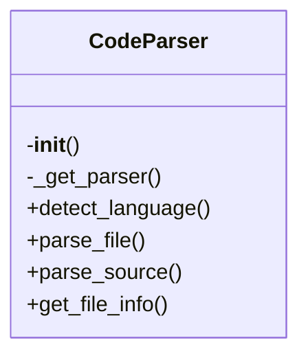

# `src/local_deepwiki/core/parser.py`

## File Overview

This file provides a `CodeParser` class that handles parsing of source code files using the Tree-sitter library. It supports multiple programming languages and provides utilities for extracting information from parsed ASTs, such as node text and docstrings.

The parser is initialized with support for various languages and can dynamically create parsers for supported languages.

## Classes

### `CodeParser`

A class for parsing source code files and extracting structured information from them using Tree-sitter.

#### Methods

##### `__init__(self)`

Initializes the parser with empty dictionaries for storing parsers and languages.

- **Purpose**: Sets up internal state for managing language-specific parsers.
- **Usage**: `parser = CodeParser()`

##### `_get_parser(self, language: LangEnum) -> Parser`

Gets or creates a Tree-sitter parser for the given language.

- **Parameters**:
  - `language`: The programming language (`LangEnum`).
- **Returns**: A configured Tree-sitter `Parser` object.
- **Raises**: `ValueError` if the language is not supported.
- **Usage**: Called internally by other methods to get a parser for a specific language.

##### `detect_language(self, file_path: Path) -> LangEnum | None`

Detects the programming language based on the file extension.

- **Parameters**:
  - `file_path`: Path to the source file (`Path`).
- **Returns**: The detected language (`LangEnum`) or `None` if unsupported.
- **Usage**: Used to determine which parser to use when parsing a file.

##### `parse_file(self, file_path: Path) -> tuple[Node, LangEnum, bytes] | None`

Parses a source file and returns the AST root node, language, and source bytes.

- **Parameters**:
  - `file_path`: Path to the source file (`Path`).
- **Returns**: Tuple of `(AST root node, language, source bytes)` or `None` if parsing fails or language is unsupported.
- **Usage**:
  ```python
  node, lang, source = parser.parse_file(Path("example.py"))
  ```

##### `parse_source(self, source: str | bytes, language: LangEnum) -> Node`

Parses a source code string or bytes and returns the AST root node.

- **Parameters**:
  - `source`: Source code as string or bytes.
  - `language`: The programming language (`LangEnum`).
- **Returns**: The AST root node (`Node`).
- **Usage**:
  ```python
  node = parser.parse_source("def hello(): pass", LangEnum.PYTHON)
  ```

##### `get_file_info(self, file_path: Path) -> FileInfo | None`

Extracts file information including language and content hash.

- **Parameters**:
  - `file_path`: Path to the source file (`Path`).
- **Returns**: A `FileInfo` object or `None` if parsing fails.
- **Usage**:
  ```python
  info = parser.get_file_info(Path("example.py"))
  ```

## Functions

### `get_node_text(node: Node, source: bytes) -> str`

Extracts the text content from a Tree-sitter node.

- **Parameters**:
  - `node`: The Tree-sitter node (`Node`).
  - `source`: The original source code as bytes.
- **Returns**: Text content of the node as a string.
- **Usage**:
  ```python
  text = get_node_text(node, source_bytes)
  ```

### `find_nodes_by_type(node: Node, node_type: str) -> list[Node]`

Finds all nodes of a given type within a Tree-sitter AST.

> **Note**: This function is defined in the file but not shown in the provided code snippet.

### `walk(node: Node, func) -> None`

Recursively walks the Tree-sitter AST and applies a function to each node.

> **Note**: This function is defined in the file but not shown in the provided code snippet.

### `get_node_name(node: Node, source: bytes) -> str | None`

Extracts the name of a node (e.g., function or class name).

> **Note**: This function is defined in the file but not shown in the provided code snippet.

### `get_docstring(node: Node, source: bytes, language: LangEnum) -> str | None`

Extracts the docstring from a function or class node.

- **Parameters**:
  - `node`: The Tree-sitter node (`Node`).
  - `source`: The original source code as bytes.
  - `language`: The programming language (`LangEnum`).
- **Returns**: The docstring as a string or `None` if not found.
- **Usage**:
  ```python
  docstring = get_docstring(node, source_bytes, LangEnum.PYTHON)
  ```

## Usage Examples

### Initialize a Parser

```python
from local_deepwiki.core.parser import CodeParser

parser = CodeParser()
```

### Parse a Source File

```python
from pathlib import Path

node, lang, source = parser.parse_file(Path("example.py"))
```

### Parse a Source String

```python
from local_deepwiki.models import Language as LangEnum

node = parser.parse_source("def hello(): pass", LangEnum.PYTHON)
```

### Extract Text from a Node

```python
text = get_node_text(node, source_bytes)
```

### Extract Docstring

```python
docstring = get_docstring(node, source_bytes, LangEnum.PYTHON)
```

## Dependencies

This file imports the following modules and libraries:

- `hashlib`
- `pathlib.Path`
- `typing.Any`
- Tree-sitter language modules:
  - `tree_sitter_python`
  - `tree_sitter_javascript`
  - `tree_sitter_typescript`
  - `tree_sitter_go`
  - `tree_sitter_rust`
  - `tree_sitter_java`
  - `tree_sitter_c`
  - `tree_sitter_cpp`
  - `tree_sitter_swift`
- Tree-sitter core modules:
  - `tree_sitter.Language`
  - `tree_sitter.Parser`
  - `tree_sitter.Node`
- Local models:
  - `local_deepwiki.models.Language as LangEnum`
  - `local_deepwiki.models.FileInfo`

## Class Diagram



## See Also

- [test_parser](../../../tests/test_parser.md) - uses this
- [indexer](indexer.md) - uses this
- [chunker](chunker.md) - uses this
- [models](../models.md) - dependency
- [vectorstore](vectorstore.md) - shares 3 dependencies
