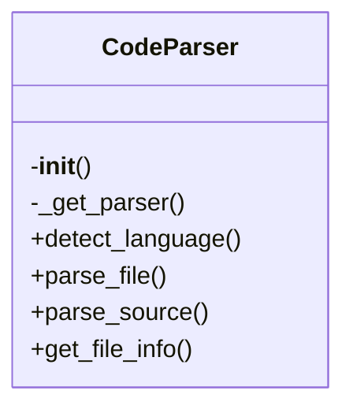

# File Overview

This file provides a core parser implementation for source code analysis using the Tree-sitter library. It supports multiple programming languages and provides functionality to parse source code into Abstract Syntax Trees (ASTs), extract text content from nodes, and identify programming languages from file paths.

# Classes

## CodeParser

The CodeParser class is responsible for managing language parsers and providing methods to parse source code files or strings into ASTs. It handles language detection, parser creation, and AST traversal.

### Key Methods

- `__init__`: Initializes the parser with empty dictionaries for storing parsers and language configurations.
- `_get_parser`: Retrieves or creates a Tree-sitter parser for a given language.
- `detect_language`: Determines the programming language of a file based on its extension.
- `parse_file`: Parses a source file and returns the AST root node, language, and source bytes.
- `parse_source`: Parses a source code string and returns the AST root node.
- `get_file_info`: Extracts file information including language and file path.

# Functions

## get_node_text

Extracts the text content from a Tree-sitter node using the original source bytes.

### Parameters

- `node`: The tree-sitter node.
- `source`: The original source bytes.

### Returns

The text content of the node as a string.

## find_nodes_by_type

(Not fully shown in the code snippet, but mentioned in the imports)

## walk

(Not fully shown in the code snippet, but mentioned in the imports)

## get_node_name

(Not fully shown in the code snippet, but mentioned in the imports)

## get_docstring

Extracts docstring from a function or class node.

### Parameters

- `node`: The tree-sitter node.
- `source`: The original source bytes.
- `language`: The programming language.

### Returns

The docstring or None if not found.

# Usage Examples

## Initialize a CodeParser

```python
parser = CodeParser()
```

## Parse a Source String

```python
source_code = "def hello(): pass"
ast_root = parser.parse_source(source_code, LangEnum.PYTHON)
```

## Parse a Source File

```python
file_path = Path("example.py")
result = parser.parse_file(file_path)
if result:
    ast_root, language, source_bytes = result
```

## Get Text Content from a Node

```python
node_text = get_node_text(ast_root, source_bytes)
```

# Related Components

This file works with the following components:

- `LangEnum` from `local_deepwiki.models`: Represents programming languages.
- `FileInfo` from `local_deepwiki.models`: Stores file information.
- Tree-sitter language modules (e.g., `tree_sitter_python`, `tree_sitter_javascript`, etc.): Used to create parsers for specific languages.
- `Language`, `Parser`, and `Node` from `tree_sitter`: Core Tree-sitter classes for language parsing and AST representation.

## API Reference

### class `CodeParser`

Multi-language code parser using tree-sitter.

**Methods:**

#### `__init__`

```python
def __init__()
```

Initialize the parser with language support.

#### `detect_language`

```python
def detect_language(file_path: Path) -> LangEnum | None
```

Detect the programming language from file extension.


| [Parameter](../generators/api_docs.md) | Type | Default | Description |
|-----------|------|---------|-------------|
| `file_path` | `Path` | - | Path to the source file. |

#### `parse_file`

```python
def parse_file(file_path: Path) -> tuple[Node, LangEnum, bytes] | None
```

Parse a source file and return the AST root.


| [Parameter](../generators/api_docs.md) | Type | Default | Description |
|-----------|------|---------|-------------|
| `file_path` | `Path` | - | Path to the source file. |

#### `parse_source`

```python
def parse_source(source: str | bytes, language: LangEnum) -> Node
```

Parse source code string and return the AST root.


| [Parameter](../generators/api_docs.md) | Type | Default | Description |
|-----------|------|---------|-------------|
| `source` | `str | bytes` | - | The source code. |
| `language` | `LangEnum` | - | The programming language. |

#### `get_file_info`

```python
def get_file_info(file_path: Path, repo_root: Path) -> FileInfo
```

Get information about a source file.


| [Parameter](../generators/api_docs.md) | Type | Default | Description |
|-----------|------|---------|-------------|
| `file_path` | `Path` | - | Absolute path to the file. |
| `repo_root` | `Path` | - | Root directory of the repository. |


---

### Functions

#### `get_node_text`

```python
def get_node_text(node: Node, source: bytes) -> str
```

Extract text content from a tree-sitter node.


| [Parameter](../generators/api_docs.md) | Type | Default | Description |
|-----------|------|---------|-------------|
| `node` | `Node` | - | The tree-sitter node. |
| `source` | `bytes` | - | The original source bytes. |

**Returns:** `str`


#### `find_nodes_by_type`

```python
def find_nodes_by_type(root: Node, node_types: set[str]) -> list[Node]
```

Find all nodes of specified types in the AST.


| [Parameter](../generators/api_docs.md) | Type | Default | Description |
|-----------|------|---------|-------------|
| `root` | `Node` | - | The root node to search from. |
| `node_types` | `set[str]` | - | Set of node type names to [find](../generators/manifest.md). |

**Returns:** `list[Node]`


#### `walk`

```python
def walk(node: Node)
```


| [Parameter](../generators/api_docs.md) | Type | Default | Description |
|-----------|------|---------|-------------|
| `node` | `Node` | - | - |


#### `get_node_name`

```python
def get_node_name(node: Node, source: bytes, language: LangEnum) -> str | None
```

Extract the name from a function/class/method node.


| [Parameter](../generators/api_docs.md) | Type | Default | Description |
|-----------|------|---------|-------------|
| `node` | `Node` | - | The tree-sitter node. |
| `source` | `bytes` | - | The original source bytes. |
| `language` | `LangEnum` | - | The programming language. |

**Returns:** `str | None`


#### `get_docstring`

```python
def get_docstring(node: Node, source: bytes, language: LangEnum) -> str | None
```

Extract docstring from a function/class node.


| [Parameter](../generators/api_docs.md) | Type | Default | Description |
|-----------|------|---------|-------------|
| `node` | `Node` | - | The tree-sitter node. |
| `source` | `bytes` | - | The original source bytes. |
| `language` | `LangEnum` | - | The programming language. |

**Returns:** `str | None`


## Class Diagram



## Call Graph

```mermaid
flowchart TD
    N0[CodeParser._get_parser]
    N1[CodeParser.get_file_info]
    N2[CodeParser.parse_file]
    N3[CodeParser.parse_source]
    N4[FileInfo]
    N5[Language]
    N6[Parser]
    N7[ValueError]
    N8[_get_parser]
    N9[child_by_field_name]
    N10[decode]
    N11[detect_language]
    N12[encode]
    N13[find_nodes_by_type]
    N14[get_docstring]
    N15[get_node_name]
    N16[get_node_text]
    N17[hexdigest]
    N18[language]
    N19[language_php]
    N20[lstrip]
    N21[parse]
    N22[read_bytes]
    N23[relative_to]
    N24[rstrip]
    N25[sha256]
    N26[stat]
    N27[walk]
    N16 --> N10
    N13 --> N27
    N27 --> N27
    N15 --> N16
    N15 --> N9
    N14 --> N9
    N14 --> N16
    N14 --> N24
    N14 --> N20
    N0 --> N7
    N0 --> N5
    N0 --> N19
    N0 --> N18
    N0 --> N6
    N2 --> N11
    N2 --> N22
    N2 --> N8
    N2 --> N21
    N3 --> N12
    N3 --> N8
    N3 --> N21
    N1 --> N26
    N1 --> N22
    N1 --> N4
    N1 --> N23
    N1 --> N11
    N1 --> N17
    N1 --> N25
    classDef func fill:#e1f5fe
    class N4,N5,N6,N7,N8,N9,N10,N11,N12,N13,N14,N15,N16,N17,N18,N19,N20,N21,N22,N23,N24,N25,N26,N27 func
    classDef method fill:#fff3e0
    class N0,N1,N2,N3 method
```



## Relevant Source Files

- `src/local_deepwiki/core/parser.py:72-176`

## See Also

- [api_docs](../generators/api_docs.md) - uses this
- [chunker](chunker.md) - uses this
- [test_api_docs](../../../tests/test_api_docs.md) - uses this
- [wiki](../generators/wiki.md) - shares 4 dependencies
- [diagrams](../generators/diagrams.md) - shares 3 dependencies
