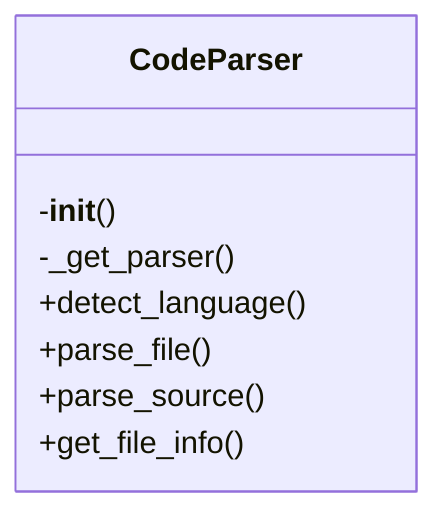

# File Overview

This file provides a `CodeParser` class for parsing source code files using the Tree-sitter library. It supports multiple programming languages and offers methods to parse files or source strings into Abstract Syntax Trees (ASTs), as well as utilities for extracting information from nodes in the AST.

The parser handles language detection based on file extensions and provides access to parsed ASTs for further processing.

# Classes

## CodeParser

The `CodeParser` class is responsible for initializing and managing parsers for various programming languages using Tree-sitter. It provides methods to parse source code files or strings into ASTs and to detect the language of a file.

### Methods

#### `__init__`

Initializes the parser with empty dictionaries for storing parsers and languages.

#### `_get_parser`

Get or create a parser for the given language.

**Parameters:**
- `language` (LangEnum): The programming language.

**Returns:**
- A tree-sitter Parser configured for the language.

#### `detect_language`

Detects the programming language based on the file extension.

**Parameters:**
- `file_path` (Path): Path to the source file.

**Returns:**
- The detected language (LangEnum) or None if unsupported.

#### `parse_file`

Parse a source file and return the AST root.

**Parameters:**
- `file_path` (Path): Path to the source file.

**Returns:**
- Tuple of (AST root node, language, source bytes) or None if not supported.

#### `parse_source`

Parse source code string and return the AST root.

**Parameters:**
- `source` (str | bytes): The source code.
- `language` (LangEnum): The programming language.

**Returns:**
- The AST root node.

#### `get_file_info`

Extracts file information including language and content hash.

**Parameters:**
- `file_path` (Path): Path to the source file.

**Returns:**
- FileInfo object containing file information.

# Functions

## get_node_text

Extract text content from a tree-sitter node.

**Parameters:**
- `node` (Node): The tree-sitter node.
- `source` (bytes): The original source bytes.

**Returns:**
- The text content of the node.

## find_nodes_by_type

Find all nodes of a given type in the AST.

**Parameters:**
- `node` (Node): The tree-sitter node to search from.
- `node_type` (str): The type of node to [find](../generators/manifest.md).

**Returns:**
- A list of matching nodes.

## walk

Recursively walk through the AST and yield all nodes.

**Parameters:**
- `node` (Node): The tree-sitter node to start walking from.

**Yields:**
- All nodes in the AST in a depth-first manner.

## get_node_name

Extract the name of a node from the AST.

**Parameters:**
- `node` (Node): The tree-sitter node.
- `source` (bytes): The original source bytes.

**Returns:**
- The name of the node or None if not found.

## get_docstring

Extract docstring from a function/class node.

**Parameters:**
- `node` (Node): The tree-sitter node.
- `source` (bytes): The original source bytes.
- `language` (LangEnum): The programming language.

**Returns:**
- The docstring or None if not found.

# Usage Examples

### Initialize the parser

```python
parser = CodeParser()
```

### Parse a source string

```python
source_code = "def hello():\n    return 'world'"
ast_root = parser.parse_source(source_code, LangEnum.PYTHON)
```

### Parse a file

```python
file_path = Path("example.py")
ast_root, language, source_bytes = parser.parse_file(file_path)
```

### Get node text

```python
node_text = get_node_text(ast_root, source_bytes)
```

### Get docstring

```python
docstring = get_docstring(ast_root, source_bytes, LangEnum.PYTHON)
```

# Related Components

This file references the following components:

- `LangEnum` from `local_deepwiki.models`: Represents programming languages.
- `FileInfo` from `local_deepwiki.models`: Contains file information.
- Tree-sitter Python, JavaScript, TypeScript, Go, Rust, Java, C, C++, and Swift language modules.
- Tree-sitter classes: `Language`, `Parser`, and `Node` from the `tree_sitter` package.

## API Reference

### class `CodeParser`

Multi-language code parser using tree-sitter.

**Methods:**

#### `__init__`

```python
def __init__()
```

Initialize the parser with language support.

#### `detect_language`

```python
def detect_language(file_path: Path) -> LangEnum | None
```

Detect the programming language from file extension.


| [Parameter](../generators/api_docs.md) | Type | Default | Description |
|-----------|------|---------|-------------|
| `file_path` | `Path` | - | Path to the source file. |

#### `parse_file`

```python
def parse_file(file_path: Path) -> tuple[Node, LangEnum, bytes] | None
```

Parse a source file and return the AST root.


| [Parameter](../generators/api_docs.md) | Type | Default | Description |
|-----------|------|---------|-------------|
| `file_path` | `Path` | - | Path to the source file. |

#### `parse_source`

```python
def parse_source(source: str | bytes, language: LangEnum) -> Node
```

Parse source code string and return the AST root.


| [Parameter](../generators/api_docs.md) | Type | Default | Description |
|-----------|------|---------|-------------|
| `source` | `str | bytes` | - | The source code. |
| `language` | `LangEnum` | - | The programming language. |

#### `get_file_info`

```python
def get_file_info(file_path: Path, repo_root: Path) -> FileInfo
```

Get information about a source file.


| [Parameter](../generators/api_docs.md) | Type | Default | Description |
|-----------|------|---------|-------------|
| `file_path` | `Path` | - | Absolute path to the file. |
| `repo_root` | `Path` | - | Root directory of the repository. |


---

### Functions

#### `get_node_text`

```python
def get_node_text(node: Node, source: bytes) -> str
```

Extract text content from a tree-sitter node.


| [Parameter](../generators/api_docs.md) | Type | Default | Description |
|-----------|------|---------|-------------|
| `node` | `Node` | - | The tree-sitter node. |
| `source` | `bytes` | - | The original source bytes. |

**Returns:** `str`


#### `find_nodes_by_type`

```python
def find_nodes_by_type(root: Node, node_types: set[str]) -> list[Node]
```

Find all nodes of specified types in the AST.


| [Parameter](../generators/api_docs.md) | Type | Default | Description |
|-----------|------|---------|-------------|
| `root` | `Node` | - | The root node to search from. |
| `node_types` | `set[str]` | - | Set of node type names to [find](../generators/manifest.md). |

**Returns:** `list[Node]`


#### `walk`

```python
def walk(node: Node)
```


| [Parameter](../generators/api_docs.md) | Type | Default | Description |
|-----------|------|---------|-------------|
| `node` | `Node` | - | - |


#### `get_node_name`

```python
def get_node_name(node: Node, source: bytes, language: LangEnum) -> str | None
```

Extract the name from a function/class/method node.


| [Parameter](../generators/api_docs.md) | Type | Default | Description |
|-----------|------|---------|-------------|
| `node` | `Node` | - | The tree-sitter node. |
| `source` | `bytes` | - | The original source bytes. |
| `language` | `LangEnum` | - | The programming language. |

**Returns:** `str | None`


#### `get_docstring`

```python
def get_docstring(node: Node, source: bytes, language: LangEnum) -> str | None
```

Extract docstring from a function/class node.


| [Parameter](../generators/api_docs.md) | Type | Default | Description |
|-----------|------|---------|-------------|
| `node` | `Node` | - | The tree-sitter node. |
| `source` | `bytes` | - | The original source bytes. |
| `language` | `LangEnum` | - | The programming language. |

**Returns:** `str | None`


## Class Diagram



## Call Graph

```mermaid
flowchart TD
    N0[CodeParser._get_parser]
    N1[CodeParser.get_file_info]
    N2[CodeParser.parse_file]
    N3[CodeParser.parse_source]
    N4[FileInfo]
    N5[Language]
    N6[Parser]
    N7[ValueError]
    N8[_get_parser]
    N9[child_by_field_name]
    N10[decode]
    N11[detect_language]
    N12[encode]
    N13[find_nodes_by_type]
    N14[get_docstring]
    N15[get_node_name]
    N16[get_node_text]
    N17[hexdigest]
    N18[language]
    N19[lstrip]
    N20[parse]
    N21[read_bytes]
    N22[relative_to]
    N23[rstrip]
    N24[sha256]
    N25[stat]
    N26[walk]
    N16 --> N10
    N13 --> N26
    N26 --> N26
    N15 --> N16
    N15 --> N9
    N14 --> N9
    N14 --> N16
    N14 --> N23
    N14 --> N19
    N0 --> N7
    N0 --> N5
    N0 --> N18
    N0 --> N6
    N2 --> N11
    N2 --> N21
    N2 --> N8
    N2 --> N20
    N3 --> N12
    N3 --> N8
    N3 --> N20
    N1 --> N25
    N1 --> N21
    N1 --> N4
    N1 --> N22
    N1 --> N11
    N1 --> N17
    N1 --> N24
    classDef func fill:#e1f5fe
    class N4,N5,N6,N7,N8,N9,N10,N11,N12,N13,N14,N15,N16,N17,N18,N19,N20,N21,N22,N23,N24,N25,N26 func
    classDef method fill:#fff3e0
    class N0,N1,N2,N3 method
```



## Relevant Source Files

- `src/local_deepwiki/core/parser.py:56-156`

## See Also

- [api_docs](../generators/api_docs.md) - uses this
- [chunker](chunker.md) - uses this
- [test_api_docs](../../../tests/test_api_docs.md) - uses this
- [wiki](../generators/wiki.md) - shares 4 dependencies
- [diagrams](../generators/diagrams.md) - shares 3 dependencies
